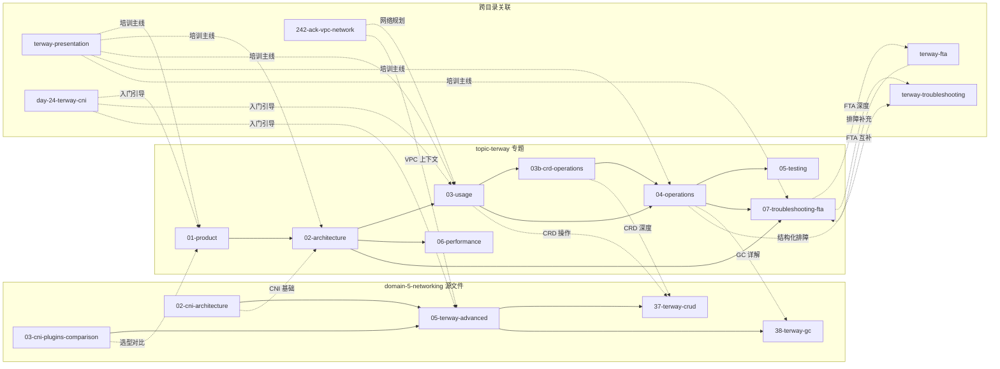

# Terway 全项目资源索引

> **版本**: 2026-05 | **资源总数**: 19 文件 | **总行数**: ~14,043 行
> 本索引汇总 kudig-database 仓库中所有 Terway 相关资源，提供跨目录统一导航。

---

## 1. 资源总览

| # | 目录 | 文件 | 行数 | 类型 | 一句话描述 |
|:---:|:---|:---|:---:|:---:|:---|
| 1 | topic-terway | [01-product.md](./01-product.md) | 332 | 专题 | 产品定位、版本历史、5 种模式总览、CNI 对比、ECS 规格速查 |
| 2 | topic-terway | [02-architecture.md](./02-architecture.md) | 973 | 专题 | 整体架构图、控制面/数据面、IPAM 流程、5 个 CRD 模型、BoltDB 持久化 |
| 3 | topic-terway | [03-usage.md](./03-usage.md) | 1022 | 专题 | 安装初始化、5 种模式 YAML 配置、NetworkPolicy、固定 IP、IPv6 双栈、容量规划 |
| 4 | topic-terway | [03b-crd-operations.md](./03b-crd-operations.md) | 1231 | 专题 | 5 个 CRD 全量清单与完整 CRUD、ConfigMap 管理、综合诊断脚本 |
| 5 | topic-terway | [04-operations.md](./04-operations.md) | 1388 | 专题 | 健康检查、GC 机制(设计原则/参数调优)、Prometheus 告警、升级回滚、巡检清单 |
| 6 | topic-terway | [05-testing.md](./05-testing.md) | 1028 | 专题 | 端到端测试套件、ENI 密度压测、NetworkPolicy 测试、iperf3 基准、MTU 测试 |
| 7 | topic-terway | [06-performance.md](./06-performance.md) | 682 | 专题 | 5 模式性能基准、Pod 容量计算、内核调优、eBPF 加速、生产基线指标 |
| 8 | topic-terway | [07-troubleshooting-fta.md](./07-troubleshooting-fta.md) | 513 | 专题 | Mermaid FTA 全景图、6 大故障类别、32 条错误信息目录、AND 门组合故障 |
| 9 | topic-terway | [README.md](./README.md) | 85 | 索引 | 专题目录索引与阅读建议 |
| 10 | domain-5-networking | [05-terway-advanced-guide.md](../domain-5-networking/05-terway-advanced-guide.md) | 369 | 源文件 | 模式对比、ENIIP 详解、固定 IP、NetworkPolicy、故障排查、最佳实践 |
| 11 | domain-5-networking | [37-terway-resources-crud-operations.md](../domain-5-networking/37-terway-resources-crud-operations.md) | 1521 | 源文件 | CRD 资源架构、PodENI/NodeNetworking/PodNetworking CRUD、IPAM Manager |
| 12 | domain-5-networking | [38-terway-gc-mechanism.md](../domain-5-networking/38-terway-gc-mechanism.md) | 942 | 源文件 | GC 设计原则、触发链路、参数调优、安全组清理、Finalizer 死锁处理 |
| 13 | topic-structural-trouble-shooting | [07-terway-troubleshooting.md](../topic-structural-trouble-shooting/03-networking/07-terway-troubleshooting.md) | 634 | 排障 | 10 分钟快速诊断、问题现象分类、排查步骤决策树、预防与最佳实践 |
| 14 | topic-fta | [terway-fta.md](../topic-fta/list/terway-fta.md) | 879 | FTA | ENI/IP 池/CNI/节点网络/安全组/控制面 6 分支 FTA 树、JSON 工作流 |
| 15 | topic-presentations | [kubernetes-terway-presentation.md](../topic-presentations/kubernetes-terway-presentation.md) | 1075 | 演示 | 4 阶段培训(入门/架构/部署/排障)、Speaker Notes、现场演示命令 |
| 16 | topic-learn | [day-24-terway-cni.md](../topic-learn/inner-training/week-4-network-storage/day-24-terway-cni.md) | 200 | 培训 | 入门学习计划、Terway 三模式理论、实践任务(部署确认/模式识别/排障) |
| 17 | domain-17-cloud-provider | [242-ack-vpc-network.md](../domain-17-cloud-provider/04-alicloud-ack/242-ack-vpc-network.md) | 110 | VPC | VPC 网络规划、vSwitch 设计策略、Terway 与 VPC 集成、NAT Gateway |
| 18 | domain-5-networking | [02-cni-architecture-fundamentals.md](../domain-5-networking/02-cni-architecture-fundamentals.md) | 844 | 源文件 | CNI 规范基础、插件链、IPAM 接口、Terway 作为 CNI 的设计上下文 |
| 19 | domain-5-networking | [03-cni-plugins-comparison.md](../domain-5-networking/03-cni-plugins-comparison.md) | 215 | 源文件 | CNI 插件横向对比(Terway/Flannel/Calico/Cilium)、选型决策矩阵 |

---

## 2. 按角色推荐路径

### 架构师

1. [01-product.md](./01-product.md) -- 理解产品定位与 CNI 选型
2. [02-architecture.md](./02-architecture.md) -- 深入控制面/数据面架构与 CRD 模型
3. [05-terway-advanced-guide.md](../domain-5-networking/05-terway-advanced-guide.md) -- 模式对比与容量规划
4. [03-usage.md](./03-usage.md) -- 容量规划参考与多 vSwitch 设计
5. [06-performance.md](./06-performance.md) -- 性能基准与 eBPF 迁移策略
6. [242-ack-vpc-network.md](../domain-17-cloud-provider/04-alicloud-ack/242-ack-vpc-network.md) -- VPC 网络顶层规划
7. [03-cni-plugins-comparison.md](../domain-5-networking/03-cni-plugins-comparison.md) -- 全局 CNI 选型视角

### SRE / 运维

1. [07-troubleshooting-fta.md](./07-troubleshooting-fta.md) -- FTA 故障树速查
2. [04-operations.md](./04-operations.md) -- GC 调优、告警规则、巡检清单
3. [38-terway-gc-mechanism.md](../domain-5-networking/38-terway-gc-mechanism.md) -- GC 机制深度理解
4. [07-terway-troubleshooting.md](../topic-structural-trouble-shooting/03-networking/07-terway-troubleshooting.md) -- 结构化排障决策树
5. [terway-fta.md](../topic-fta/list/terway-fta.md) -- Agent 可执行的 FTA 工作流
6. [05-testing.md](./05-testing.md) -- 生产验证测试套件
7. [03b-crd-operations.md](./03b-crd-operations.md) -- CRD 诊断脚本与紧急操作

### 开发者

1. [01-product.md](./01-product.md) -- 快速了解 Terway 能力边界
2. [03-usage.md](./03-usage.md) -- Annotation 配置、NetworkPolicy、固定 IP
3. [03b-crd-operations.md](./03b-crd-operations.md) -- CRD 资源查询与操作
4. [37-terway-resources-crud-operations.md](../domain-5-networking/37-terway-resources-crud-operations.md) -- CRD 深度 CRUD 参考
5. [02-cni-architecture-fundamentals.md](../domain-5-networking/02-cni-architecture-fundamentals.md) -- CNI 规范与接口理解

### 培训讲师

1. [kubernetes-terway-presentation.md](../topic-presentations/kubernetes-terway-presentation.md) -- 完整 3 小时培训讲稿
2. [01-product.md](./01-product.md) -- 产品概览素材
3. [02-architecture.md](./02-architecture.md) -- 架构图与模式详解素材
4. [day-24-terway-cni.md](../topic-learn/inner-training/week-4-network-storage/day-24-terway-cni.md) -- 配套入门实践任务
5. [05-testing.md](./05-testing.md) -- 现场 Workshop 实验脚本

### 新人入门

1. [day-24-terway-cni.md](../topic-learn/inner-training/week-4-network-storage/day-24-terway-cni.md) -- 4-5 小时入门学习
2. [01-product.md](./01-product.md) -- 产品定位与模式概览
3. [03-usage.md](./03-usage.md) -- 安装配置与基本使用
4. [05-terway-advanced-guide.md](../domain-5-networking/05-terway-advanced-guide.md) -- 模式对比加深理解
5. [07-troubleshooting-fta.md](./07-troubleshooting-fta.md) -- 建立排障意识

---

## 3. 按场景索引

| 场景 | 推荐文件（优先级排序） |
|:---|:---|
| Terway 选型与容量规划 | → [01-product](./01-product.md) → [05-advanced](../domain-5-networking/05-terway-advanced-guide.md) → [03-usage(容量规划)](./03-usage.md) → [06-performance](./06-performance.md) → [242-vpc](../domain-17-cloud-provider/04-alicloud-ack/242-ack-vpc-network.md) |
| CRD 资源管理 | → [03b-crd-operations](./03b-crd-operations.md) → [37-crud](../domain-5-networking/37-terway-resources-crud-operations.md) → [02-architecture(CRD模型)](./02-architecture.md) |
| 生产环境部署 | → [03-usage](./03-usage.md) → [04-operations](./04-operations.md) → [05-testing](./05-testing.md) → [kubernetes-terway-presentation(第三阶段)](../topic-presentations/kubernetes-terway-presentation.md) |
| GC 调优 | → [04-operations(GC章节)](./04-operations.md) → [38-gc](../domain-5-networking/38-terway-gc-mechanism.md) → [05-testing(GC验证)](./05-testing.md) |
| 故障排查 | → [07-troubleshooting-fta](./07-troubleshooting-fta.md) → [07-terway-troubleshooting](../topic-structural-trouble-shooting/03-networking/07-terway-troubleshooting.md) → [04-operations(排障决策树)](./04-operations.md) → [terway-fta](../topic-fta/list/terway-fta.md) |
| FTA 故障树分析 | → [terway-fta](../topic-fta/list/terway-fta.md) → [07-troubleshooting-fta](./07-troubleshooting-fta.md) → [07-terway-troubleshooting](../topic-structural-trouble-shooting/03-networking/07-terway-troubleshooting.md) |
| 多集群网络互通 | → [242-ack-vpc](../domain-17-cloud-provider/04-alicloud-ack/242-ack-vpc-network.md) → [03-usage(多集群章节)](./03-usage.md) → [kubernetes-terway-presentation](../topic-presentations/kubernetes-terway-presentation.md) |
| 性能调优与基准测试 | → [06-performance](./06-performance.md) → [05-testing(性能基准)](./05-testing.md) → [05-advanced(性能优化)](../domain-5-networking/05-terway-advanced-guide.md) |
| NetworkPolicy 配置 | → [03-usage(NetworkPolicy)](./03-usage.md) → [05-advanced(NetworkPolicy)](../domain-5-networking/05-terway-advanced-guide.md) → [05-testing(NP测试)](./05-testing.md) |
| 培训与演讲 | → [kubernetes-terway-presentation](../topic-presentations/kubernetes-terway-presentation.md) → [day-24-terway-cni](../topic-learn/inner-training/week-4-network-storage/day-24-terway-cni.md) → [01-product](./01-product.md) |
| 固定 IP 与状态应用 | → [03-usage(固定IP)](./03-usage.md) → [03b-crd-operations(ReservedIP)](./03b-crd-operations.md) → [05-advanced(固定IP)](../domain-5-networking/05-terway-advanced-guide.md) → [05-testing(固定IP验证)](./05-testing.md) |
| CNI 基础与选型对比 | → [02-cni-architecture](../domain-5-networking/02-cni-architecture-fundamentals.md) → [03-cni-plugins-comparison](../domain-5-networking/03-cni-plugins-comparison.md) → [01-product(CNI对比)](./01-product.md) |
| 安全组与访问控制 | → [03-usage(安全组)](./03-usage.md) → [03b-crd-operations](./03b-crd-operations.md) → [04-operations](./04-operations.md) → [terway-fta(安全组分支)](../topic-fta/list/terway-fta.md) |
| 升级与版本迁移 | → [04-operations(升级策略)](./04-operations.md) → [01-product(版本历史)](./01-product.md) → [06-performance(eBPF迁移)](./06-performance.md) |
| VPC 网络规划 | → [242-ack-vpc](../domain-17-cloud-provider/04-alicloud-ack/242-ack-vpc-network.md) → [03-usage(多vSwitch)](./03-usage.md) → [02-architecture](./02-architecture.md) |

---

## 4. 资源依赖关系

---

## 5. 内容覆盖矩阵

> ✓ = 完整覆盖 | partial = 部分涉及 | -- = 未覆盖

| 知识域 | 01-product | 02-arch | 03-usage | 03b-crd | 04-ops | 05-test | 06-perf | 07-fta | 05-advanced | 37-crud | 38-gc | 07-trouble | terway-fta | presentation | day-24 | 242-vpc |
|:---|:---:|:---:|:---:|:---:|:---:|:---:|:---:|:---:|:---:|:---:|:---:|:---:|:---:|:---:|:---:|:---:|
| ENI 独占模式 | ✓ | ✓ | ✓ | partial | partial | ✓ | ✓ | ✓ | ✓ | partial | -- | partial | ✓ | ✓ | ✓ | -- |
| ENIIP 模式 | ✓ | ✓ | ✓ | ✓ | partial | ✓ | ✓ | partial | ✓ | ✓ | ✓ | ✓ | ✓ | ✓ | ✓ | partial |
| VPC 路由模式 | ✓ | ✓ | ✓ | -- | partial | ✓ | ✓ | partial | ✓ | -- | -- | partial | ✓ | ✓ | ✓ | ✓ |
| IPAM 机制 | partial | ✓ | ✓ | ✓ | -- | partial | ✓ | -- | partial | ✓ | partial | partial | ✓ | partial | partial | ✓ |
| GC 机制 | -- | -- | -- | partial | ✓ | ✓ | -- | -- | -- | partial | ✓ | partial | ✓ | -- | -- | -- |
| CRD 操作 | -- | ✓ | partial | ✓ | -- | -- | -- | -- | -- | ✓ | -- | -- | -- | partial | -- | -- |
| NetworkPolicy | partial | partial | ✓ | -- | -- | ✓ | -- | -- | ✓ | -- | -- | partial | -- | ✓ | partial | -- |
| 固定 IP | -- | partial | ✓ | ✓ | -- | ✓ | -- | -- | ✓ | ✓ | -- | partial | -- | ✓ | -- | -- |
| Trunking | partial | ✓ | partial | -- | -- | -- | partial | -- | partial | -- | -- | -- | -- | ✓ | -- | -- |
| 安全组 | partial | partial | ✓ | partial | -- | ✓ | -- | ✓ | partial | partial | -- | ✓ | ✓ | ✓ | -- | -- |
| 监控告警 | -- | -- | -- | -- | ✓ | -- | ✓ | -- | -- | -- | -- | -- | -- | partial | -- | -- |
| FTA 排障 | -- | -- | -- | -- | partial | -- | -- | ✓ | -- | -- | -- | ✓ | ✓ | partial | -- | -- |
| 性能调优 | -- | -- | -- | -- | -- | ✓ | ✓ | -- | ✓ | -- | -- | -- | -- | ✓ | -- | -- |
| 多集群 | -- | -- | ✓ | -- | -- | -- | -- | -- | -- | -- | -- | -- | -- | partial | -- | ✓ |
| eBPF 加速 | -- | -- | -- | -- | -- | -- | ✓ | -- | -- | -- | -- | -- | -- | partial | -- | -- |
| 测试验证 | -- | -- | -- | -- | -- | ✓ | partial | -- | -- | -- | -- | -- | -- | partial | partial | -- |
| Pod 带宽限制 | -- | -- | ✓ | -- | -- | -- | ✓ | -- | -- | -- | -- | -- | -- | -- | -- | -- |
| IPv6 双栈 | -- | -- | ✓ | -- | -- | -- | -- | -- | -- | -- | -- | -- | -- | -- | -- | -- |
| 升级回滚 | -- | -- | -- | -- | ✓ | -- | -- | -- | -- | -- | -- | -- | -- | partial | -- | -- |

---

## 6. 与非 Terway 网络资源的关联

以下文件非 Terway 专属，但与 Terway 使用场景高度相关，可作为补充阅读。

| 文件 | 行数 | 关联说明 |
|:---|:---:|:---|
| [domain-5-networking/02-cni-architecture-fundamentals.md](../domain-5-networking/02-cni-architecture-fundamentals.md) | 844 | CNI 规范基础，理解 Terway 插件链设计的前提 |
| [domain-5-networking/03-cni-plugins-comparison.md](../domain-5-networking/03-cni-plugins-comparison.md) | 215 | CNI 插件横向对比，Terway 选型决策参考 |
| [domain-5-networking/04-flannel-complete-guide.md](../domain-5-networking/04-flannel-complete-guide.md) | 430 | Flannel 完整指南，Terway 迁移时对比参考 |
| [domain-5-networking/16-networkpolicy-deep-practice.md](../domain-5-networking/16-networkpolicy-deep-practice.md) | 801 | NetworkPolicy 深度实践，Terway NP 功能的通用知识基础 |
| [domain-5-networking/34-network-performance-tuning.md](../domain-5-networking/34-network-performance-tuning.md) | 205 | 网络性能调优通用方法，Terway 性能调优的补充视角 |
| [domain-5-networking/11-dns-service-discovery-coredns.md](../domain-5-networking/11-dns-service-discovery-coredns.md) | 1140 | CoreDNS 服务发现，Pod 直通 VPC 场景下 DNS 解析联动 |
| [domain-5-networking/06-service-concepts-types.md](../domain-5-networking/06-service-concepts-types.md) | 2516 | Service 类型与实现，Terway ENI 模式下 Service 流量路径 |
| [domain-5-networking/19-ingress-fundamentals.md](../domain-5-networking/19-ingress-fundamentals.md) | 2113 | Ingress 基础，ALB Ingress 与 Terway VPC 网络联动 |
| [domain-5-networking/33-network-troubleshooting.md](../domain-5-networking/33-network-troubleshooting.md) | -- | 通用网络故障排查，Terway 排障的知识补充 |

---

> 维护说明：本索引由人工维护，新增 Terway 资源时请同步更新本文件。
