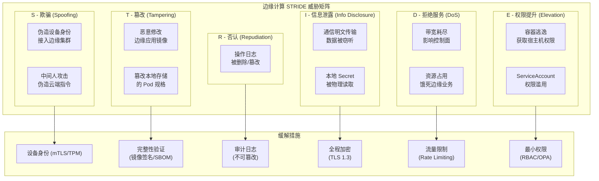
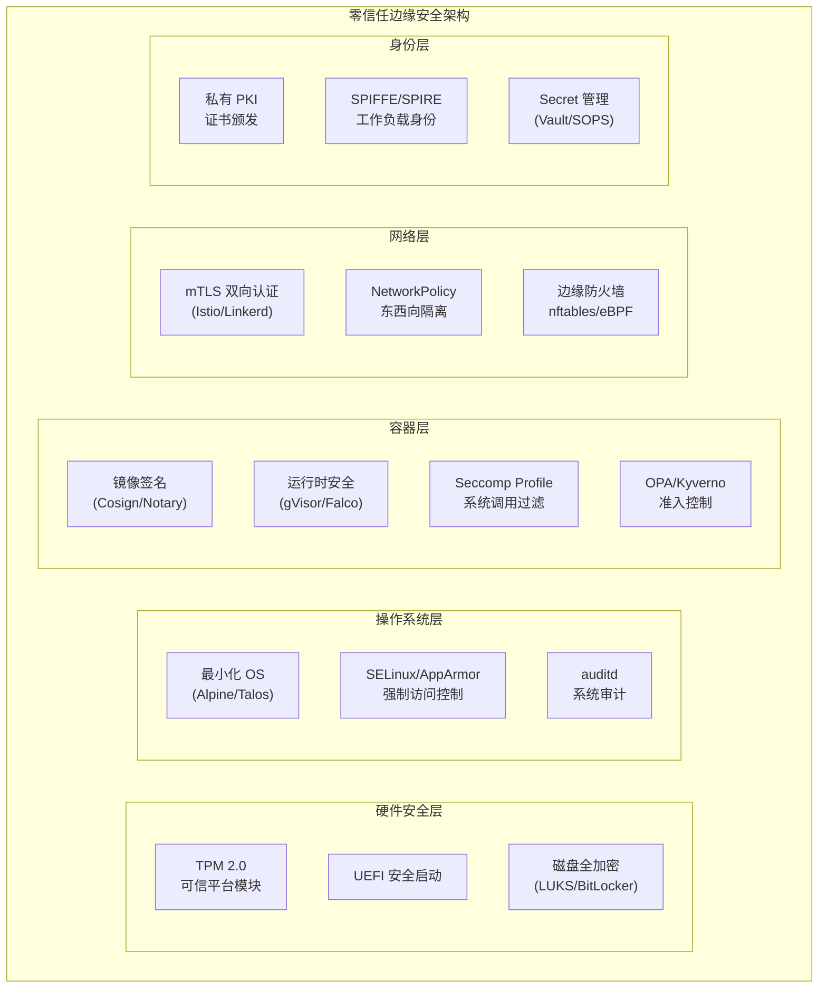
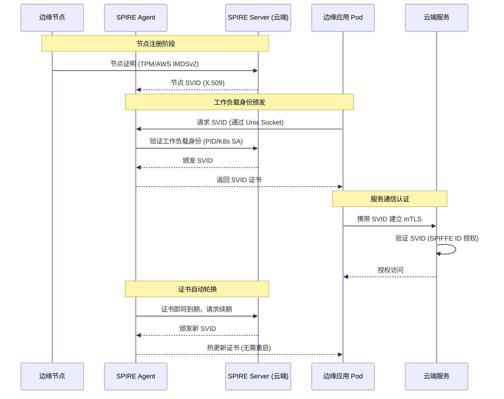
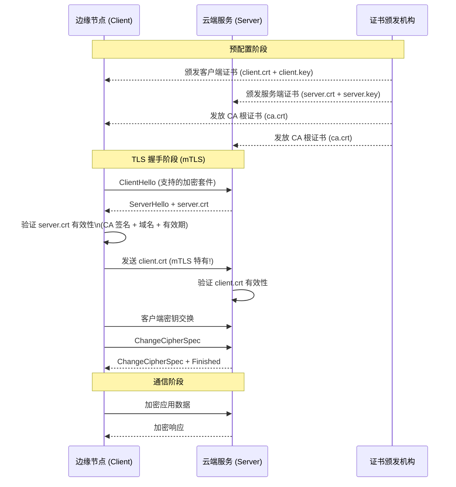
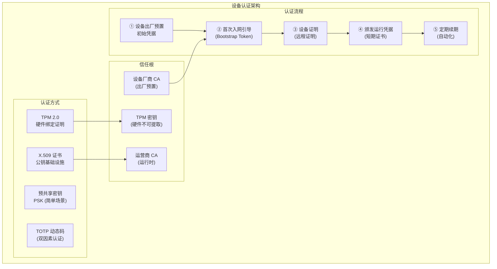
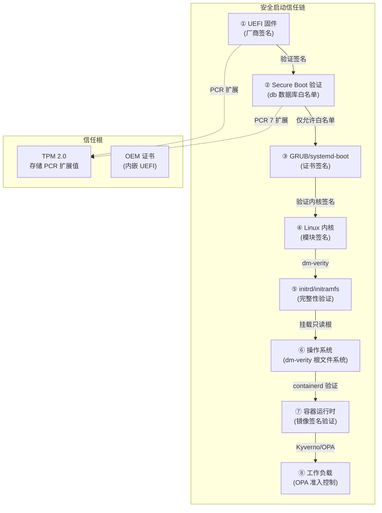
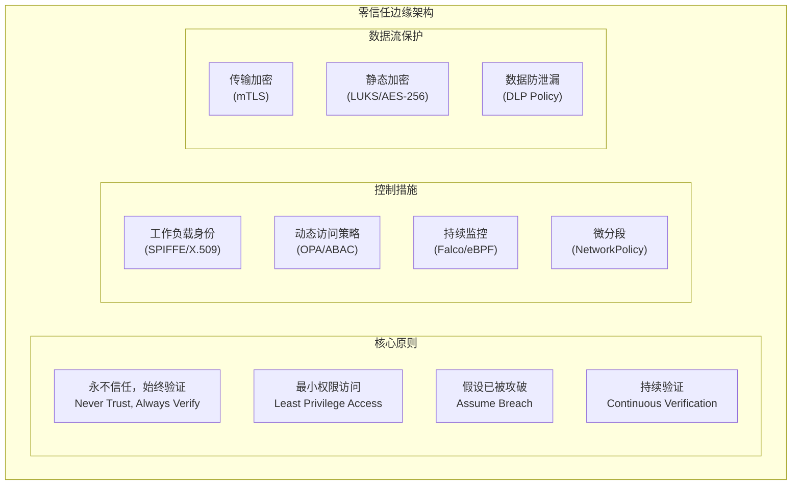
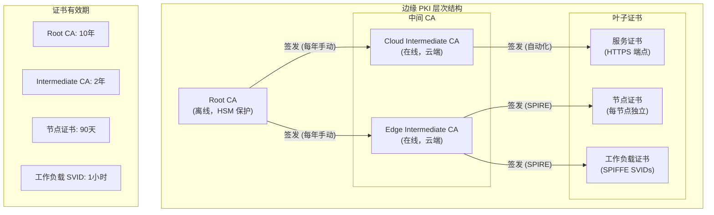
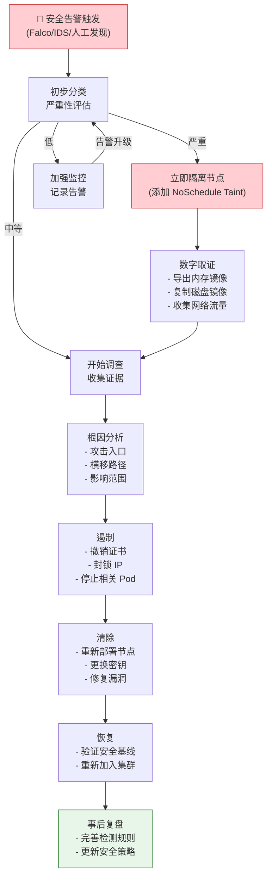

> **生产环境安全提示**
>
> 本文档包含可直接执行的运维命令。执行前请确认：当前目标集群与 Namespace 是否正确；是否具备足够的 RBAC 权限；是否已在非生产环境验证。命令风险等级标注：🔴 高风险（可能造成数据丢失或服务中断）、🟡 中风险（会修改集群状态，但通常可回滚）、🟢 低风险/只读（信息收集，无副作用）。


# 边缘安全架构 (Edge Security Architecture)

<!-- chunk: 概述 (Overview) -->## 概述 (Overview)

边缘计算将算力部署到物理上分散、网络环境复杂、人员难以管控的场所，安全挑战远比传统数据中心严峻。边缘节点可能被物理接触、网络环境不可信、设备软件栈难以统一管控。本文档从身份管理、通信安全、设备认证、安全启动、边缘防火墙和威胁模型六个维度，构建全面的边缘安全架构。

Edge computing deploys compute to physically dispersed, network-complex, and hard-to-control locations—security challenges are far more severe than traditional data centers. Edge nodes may be physically accessed, operate in untrusted networks, and have heterogeneous software stacks. This document builds a comprehensive edge security architecture covering identity management, communication security, device authentication, secure boot, edge firewall, and threat modeling.

---

<!-- chunk: 目录 (Table of Contents) -->## 目录 (Table of Contents)

1. [边缘安全威胁模型](#1-边缘安全威胁模型)
2. [边缘身份管理](#2-边缘身份管理)
3. [mTLS 通信安全](#3-mtls-通信安全)
4. [设备认证机制](#4-设备认证机制)
5. [安全启动与可信执行环境](#5-安全启动与可信执行环境)
6. [边缘防火墙与网络策略](#6-边缘防火墙与网络策略)
7. [零信任边缘架构](#7-零信任边缘架构)
8. [密钥管理与 PKI](#8-密钥管理与-pki)
9. [入侵检测与审计](#9-入侵检测与审计)
10. [供应链安全](#10-供应链安全)
11. [合规与隐私保护](#11-合规与隐私保护)
12. [安全运维实践](#12-安全运维实践)

---

<!-- chunk: 1. 边缘安全威胁模型 -->## 1. 边缘安全威胁模型

## 1.1 STRIDE 威胁分析



## 1.2 边缘攻击面分析

| 攻击面 | 威胁级别 | 攻击场景 | 防护措施 |
|--------|---------|---------|---------|
| **物理接入** | 🔴 高 | 插入 USB 设备、盗走硬盘 | 安全启动、磁盘加密、物理锁 |
| **网络通信** | 🔴 高 | 中间人、流量劫持 | mTLS、证书固定 |
| **操作系统** | 🟡 中 | CVE 漏洞利用、提权 | 最小化 OS、自动补丁 |
| **容器运行时** | 🟡 中 | 容器逃逸 | gVisor/Kata、Seccomp |
| **应用层** | 🟡 中 | 注入攻击、配置错误 | OPA、镜像签名 |
| **供应链** | 🟠 中高 | 恶意依赖、污染镜像 | SBOM、Cosign 签名 |
| **身份凭证** | 🔴 高 | 证书泄露、Token 窃取 | HSM/TPM、短期证书 |

## 1.3 边缘安全架构全景



---

<!-- chunk: 2. 边缘身份管理 -->## 2. 边缘身份管理

## 2.1 SPIFFE/SPIRE 工作负载身份

SPIFFE (Secure Production Identity Framework For Everyone) 为边缘工作负载提供统一的身份标准。



## 2.2 SPIRE 部署配置

```yaml
# spire-server-config.yaml (云端)
apiVersion: v1
kind: ConfigMap
metadata:
  name: spire-server
  namespace: spire
data:
  server.conf: |
    server {
      bind_address = "0.0.0.0"
      bind_port = "8081"
      socket_path = "/tmp/spire-server/private/api.sock"
      trust_domain = "edge.example.com"
      data_dir = "/run/spire/data"
      log_level = "DEBUG"
      
      # 证书有效期（边缘场景建议较短）
      default_svid_ttl = "1h"
      
      # CA 配置
      ca_subject = {
        country = ["CN"]
        organization = ["Edge Corp"]
        common_name = "Edge SPIRE CA"
      }
      ca_ttl = "24h"
    }

    plugins {
      # 数据存储
      DataStore "sql" {
        plugin_data {
          database_type = "postgres"
          connection_string = "host=postgres port=5432 dbname=spire..."
        }
      }
      
      # 节点证明 (Kubernetes 方式)
      NodeAttestor "k8s_psat" {
        plugin_data {
          clusters = {
            "edge-cluster" = {
              service_account_allow_list = ["spire:spire-agent"]
            }
          }
        }
      }
      
      # 密钥管理
      KeyManager "disk" {
        plugin_data {
          keys_path = "/run/spire/data/keys.json"
        }
      }
      
      # 健康检查
      UpstreamAuthority "disk" {
        plugin_data {
          cert_file_path = "/run/spire/config/dummy_root_ca.crt"
          key_file_path = "/run/spire/config/dummy_root_ca.key"
        }
      }
    }

    health_checks {
      listener_enabled = true
      bind_address = "0.0.0.0"
      bind_port = "8080"
      live_path = "/live"
      ready_path = "/ready"
    }

---
# spire-agent-config.yaml (边缘端)
apiVersion: v1
kind: ConfigMap
metadata:
  name: spire-agent
  namespace: spire
data:
  agent.conf: |
    agent {
      data_dir = "/run/spire"
      log_level = "DEBUG"
      server_address = "spire-server.cloud.example.com"
      server_port = "8081"
      socket_path = "/run/spire/sockets/agent.sock"
      trust_bundle_path = "/run/spire/bundle/bundle.crt"
      trust_domain = "edge.example.com"
    }

    plugins {
      NodeAttestor "k8s_psat" {
        plugin_data {
          cluster = "edge-cluster"
        }
      }
      
      # 工作负载证明
      WorkloadAttestor "k8s" {
        plugin_data {
          skip_kubelet_verification = true
          node_name_env = "NODE_NAME"
        }
      }
      
      KeyManager "memory" {
        plugin_data {}
      }
    }

---
# 注册边缘工作负载条目
# kubectl exec -n spire spire-server-0 -- \
#   /opt/spire/bin/spire-server entry create \
#   -spiffeID spiffe://edge.example.com/edge/data-collector \
#   -parentID spiffe://edge.example.com/ns/spire/sa/spire-agent \
#   -selector k8s:ns:edge-apps \
#   -selector k8s:sa:data-collector \
#   -ttl 3600
```

## 2.3 边缘节点证书管理

``` bash
# 🟢 低风险：只读/信息收集，通常无副作用
#!/bin/bash
# edge-cert-manager.sh - 边缘节点证书自动化管理

CERT_DIR="/etc/edge/certs"
CA_URL="https://ca.internal.example.com"
NODE_NAME=$(hostname)
CERT_VALIDITY_DAYS=90
RENEWAL_THRESHOLD_DAYS=15

# 检查证书有效期
check_cert_expiry() {
    local cert_file="${CERT_DIR}/node.crt"
    
    if [ ! -f "${cert_file}" ]; then
        echo "证书不存在，需要初始化"
        return 1
    fi
    
    # 获取到期日期
    EXPIRY_DATE=$(openssl x509 -enddate -noout -in "${cert_file}" | cut -d= -f2)
    EXPIRY_EPOCH=$(date -d "${EXPIRY_DATE}" +%s)
    CURRENT_EPOCH=$(date +%s)
    DAYS_REMAINING=$(( (EXPIRY_EPOCH - CURRENT_EPOCH) / 86400 ))
    
    echo "证书剩余有效期: ${DAYS_REMAINING} 天"
    
    if [ "${DAYS_REMAINING}" -lt "${RENEWAL_THRESHOLD_DAYS}" ]; then
        echo "⚠️  证书即将到期，需要续期"
        return 1
    fi
    
    echo "✅ 证书有效"
    return 0
}

# 申请/续期证书
request_certificate() {
    echo "正在申请节点证书..."
    
    mkdir -p "${CERT_DIR}"
    
    # 生成 RSA 私钥（使用 HSM 时改为 PKCS#11）
    openssl genrsa -out "${CERT_DIR}/node.key" 4096
    chmod 600 "${CERT_DIR}/node.key"
    
    # 生成 CSR（包含节点身份信息）
    openssl req -new \
        -key "${CERT_DIR}/node.key" \
        -out "${CERT_DIR}/node.csr" \
        -subj "/CN=${NODE_NAME}/O=EdgeCluster/C=CN" \
        -addext "subjectAltName=DNS:${NODE_NAME},IP:$(hostname -I | awk '{print $1}')"
    
    # 向 CA 申请签发
    # 实际部署使用 cert-manager 或 Vault PKI
    curl -X POST "${CA_URL}/sign" \
        -H "Authorization: Bearer $(cat /run/secrets/kubernetes.io/serviceaccount/token)" \
        -F "csr=@${CERT_DIR}/node.csr" \
        -F "ttl=${CERT_VALIDITY_DAYS}d" \
        -o "${CERT_DIR}/node.crt"
    
    if [ $? -eq 0 ]; then
        echo "✅ 证书申请成功"
        
        # 重载使用证书的服务
        systemctl reload edge-agent 2>/dev/null || true
        kubectl -n edge-system rollout restart daemonset/tunnel-edge 2>/dev/null || true
    else
        echo "❌ 证书申请失败"
        exit 1
    fi
}

# 主流程
if ! check_cert_expiry; then
    request_certificate
fi
```
---

<!-- chunk: 3. mTLS 通信安全 -->## 3. mTLS 通信安全

## 3.1 mTLS 工作原理



## 3.2 Istio 服务网格 mTLS

```yaml
# 为边缘命名空间开启严格 mTLS 模式
apiVersion: security.istio.io/v1beta1
kind: PeerAuthentication
metadata:
  name: edge-mtls-strict
  namespace: edge-apps
spec:
  # 强制所有服务使用 mTLS
  mtls:
    mode: STRICT

---
# 允许特定端口例外（如需要对外暴露的 HTTP 接口）
apiVersion: security.istio.io/v1beta1
kind: PeerAuthentication
metadata:
  name: edge-mtls-partial
  namespace: edge-apps
spec:
  mtls:
    mode: STRICT
  portLevelMtls:
    8080:
      mode: PERMISSIVE  # 对外接口允许非 mTLS（需配合 NetworkPolicy 限制来源）

---
# 授权策略：基于 SPIFFE 身份的服务间访问控制
apiVersion: security.istio.io/v1beta1
kind: AuthorizationPolicy
metadata:
  name: data-collector-policy
  namespace: edge-apps
spec:
  selector:
    matchLabels:
      app: data-processor
  action: ALLOW
  rules:
    - from:
        - source:
            # 只允许 data-collector 的 SPIFFE 身份访问
            principals:
              - "cluster.local/ns/edge-apps/sa/data-collector"
              - "spiffe://edge.example.com/edge/data-collector"
      to:
        - operation:
            methods: ["POST"]
            paths: ["/api/v1/data/ingest"]
```

## 3.3 手动 mTLS 实现（非 Service Mesh 场景）

```python
# edge_mtls_client.py
import ssl
import aiohttp
import asyncio
from typing import Optional, Dict, Any
import logging

logger = logging.getLogger(__name__)


class EdgeMTLSClient:
    """
    边缘端 mTLS HTTP 客户端
    用于边缘节点与云端服务的安全通信
    """
    
    def __init__(
        self,
        ca_cert: str,
        client_cert: str,
        client_key: str,
        base_url: str,
        timeout_s: float = 30.0,
        verify_hostname: bool = True
    ):
        """
        初始化 mTLS 客户端
        
        Args:
            ca_cert: CA 根证书路径（用于验证服务端）
            client_cert: 客户端证书路径
            client_key: 客户端私钥路径
            base_url: 服务端基础 URL
            verify_hostname: 是否验证主机名
        """
        self.base_url = base_url
        
        # 构建 SSL 上下文（mTLS）
        self.ssl_context = ssl.SSLContext(ssl.PROTOCOL_TLS_CLIENT)
        
        # TLS 1.3 优先（最安全）
        self.ssl_context.minimum_version = ssl.TLSVersion.TLSv1_2
        self.ssl_context.maximum_version = ssl.TLSVersion.TLSv1_3
        
        # 加载 CA 证书（验证服务端证书）
        self.ssl_context.load_verify_locations(ca_cert)
        
        # 加载客户端证书（mTLS 核心：客户端也需要证书）
        self.ssl_context.load_cert_chain(
            certfile=client_cert,
            keyfile=client_key
        )
        
        # 证书验证
        self.ssl_context.verify_mode = ssl.CERT_REQUIRED
        self.ssl_context.check_hostname = verify_hostname
        
        # 禁用弱密码套件
        self.ssl_context.set_ciphers(
            "TLS_AES_256_GCM_SHA384:"
            "TLS_CHACHA20_POLY1305_SHA256:"
            "TLS_AES_128_GCM_SHA256:"
            "ECDHE-RSA-AES256-GCM-SHA384:"
            "ECDHE-RSA-CHACHA20-POLY1305"
        )
        
        self.timeout = aiohttp.ClientTimeout(total=timeout_s)
        self._session: Optional[aiohttp.ClientSession] = None
    
    async def __aenter__(self):
        self._session = aiohttp.ClientSession(
            connector=aiohttp.TCPConnector(ssl=self.ssl_context),
            timeout=self.timeout
        )
        return self
    
    async def __aexit__(self, *args):
        if self._session:
            await self._session.close()
    
    async def post(
        self,
        path: str,
        data: Dict[str, Any],
        headers: Optional[Dict] = None
    ) -> Dict:
        """发送 POST 请求"""
        url = f"{self.base_url}{path}"
        default_headers = {
            "Content-Type": "application/json",
            "X-Edge-Node-ID": self._get_node_id()
        }
        if headers:
            default_headers.update(headers)
        
        async with self._session.post(
            url,
            json=data,
            headers=default_headers,
            ssl=self.ssl_context
        ) as resp:
            resp.raise_for_status()
            return await resp.json()
    
    def _get_node_id(self) -> str:
        """获取节点身份标识"""
        import socket
        return socket.gethostname()
    
    @staticmethod
    def verify_cert_chain(cert_path: str, ca_path: str) -> bool:
        """验证证书链有效性"""
        import subprocess
        result = subprocess.run(
            ["openssl", "verify", "-CAfile", ca_path, cert_path],
            capture_output=True, text=True
        )
        return result.returncode == 0


# 使用示例
async def main():
    async with EdgeMTLSClient(
        ca_cert="/etc/edge/certs/ca.crt",
        client_cert="/etc/edge/certs/node.crt",
        client_key="/etc/edge/certs/node.key",
        base_url="https://cloud-api.example.com"
    ) as client:
        response = await client.post(
            "/api/v1/data",
            data={"sensor_id": "temp-001", "value": 25.6}
        )
        print(f"上传结果: {response}")


if __name__ == "__main__":
    asyncio.run(main())
```

---

<!-- chunk: 4. 设备认证机制 -->## 4. 设备认证机制

## 4.1 设备认证架构



## 4.2 基于 TPM 的设备证明

```python
# tpm_device_attestation.py
# TPM 2.0 设备证明实现（使用 tpm2-pytss 库）

import base64
import json
import hashlib
from typing import Dict, Optional, Tuple
import logging

logger = logging.getLogger(__name__)


class TPMAttestationClient:
    """
    基于 TPM 2.0 的设备身份证明客户端
    
    证明流程:
    1. 服务端发送随机挑战 (nonce)
    2. 设备使用 TPM 签名挑战 + PCR 扩展值
    3. 服务端验证签名和 PCR 状态
    4. 颁发设备身份证书
    """
    
    def __init__(self, device_id: str):
        self.device_id = device_id
        self._tpm_ctx = None
    
    def _init_tpm(self):
        """初始化 TPM 上下文"""
        try:
            from tpm2_pytss import ESAPI, TPM2_PT, TPM2_ALG
            self._tpm_ctx = ESAPI()
            logger.info("TPM 2.0 初始化成功")
        except ImportError:
            logger.warning("tpm2-pytss 未安装，使用模拟模式")
    
    def get_ek_cert(self) -> bytes:
        """获取 EK (Endorsement Key) 证书"""
        if self._tpm_ctx is None:
            self._init_tpm()
        
        # 实际代码：从 TPM NV 存储读取 EK 证书
        # nv_index = 0x01C00002  # RSA EK 证书 NV 索引
        # ek_cert = self._tpm_ctx.nv_read(nv_index)
        
        # 模拟：返回自签名 EK 证书
        return b"EK_CERTIFICATE_PLACEHOLDER"
    
    def create_attestation_key(self) -> Tuple[bytes, bytes]:
        """
        创建证明密钥 (AK - Attestation Key)
        
        Returns:
            (ak_public, ak_name) - AK 公钥和名称
        """
        # TPM 在 TPM_RH_ENDORSEMENT 层级下创建 AK
        # AK 是不可导出的（私钥永不离开 TPM）
        
        # 模拟返回
        ak_public = b"AK_PUBLIC_KEY_PLACEHOLDER"
        ak_name = hashlib.sha256(ak_public).digest()
        return ak_public, ak_name
    
    def quote(
        self,
        nonce: bytes,
        pcr_selection: list = [0, 1, 2, 3, 4, 7]
    ) -> Dict:
        """
        TPM Quote：对 PCR 值和随机挑战进行签名
        
        PCR 含义:
            PCR 0: BIOS 代码
            PCR 1: BIOS 配置
            PCR 2: Option ROM 代码
            PCR 4: 引导加载程序
            PCR 7: 安全启动状态
        
        Returns:
            {
                "quoted": <TPM2B_ATTEST>,
                "signature": <TPMT_SIGNATURE>,
                "pcr_values": {pcr_index: sha256_hash},
                "nonce": <nonce>
            }
        """
        if self._tpm_ctx is None:
            self._init_tpm()
        
        # 实际 TPM Quote 实现（伪代码）:
        # pcr_selection = TPM2_PCRs([0,1,2,3,4,7])
        # quoted, signature = self._tpm_ctx.quote(
        #     ak_handle, pcr_selection, nonce
        # )
        
        # 模拟 PCR 值（实际从 TPM 读取）
        pcr_values = {
            pcr: hashlib.sha256(f"pcr_{pcr}_value".encode()).hexdigest()
            for pcr in pcr_selection
        }
        
        # 构建证明数据
        attestation_data = {
            "device_id": self.device_id,
            "nonce": base64.b64encode(nonce).decode(),
            "pcr_values": pcr_values,
            "firmware_version": self._get_firmware_version()
        }
        
        # 使用 AK 签名（模拟）
        quoted = json.dumps(attestation_data).encode()
        signature = hashlib.sha256(
            quoted + nonce
        ).digest()  # 实际使用 TPM 签名
        
        return {
            "quoted": base64.b64encode(quoted).decode(),
            "signature": base64.b64encode(signature).decode(),
            "pcr_values": pcr_values,
            "ak_cert": base64.b64encode(self.get_ek_cert()).decode()
        }
    
    def _get_firmware_version(self) -> str:
        """获取固件版本"""
        try:
            with open('/sys/class/dmi/id/bios_version', 'r') as f:
                return f.read().strip()
        except Exception:
            return "unknown"
    
    @staticmethod
    def verify_quote(
        quote_response: Dict,
        expected_nonce: bytes,
        trusted_pcr_policy: Dict
    ) -> Tuple[bool, str]:
        """
        验证 TPM Quote（服务端执行）
        
        Returns:
            (is_valid, reason)
        """
        # 1. 验证签名
        quoted = base64.b64decode(quote_response["quoted"])
        signature = base64.b64decode(quote_response["signature"])
        nonce = base64.b64decode(
            json.loads(quoted.decode())["nonce"]
        )
        
        # 验证 nonce 匹配（防重放）
        if nonce != expected_nonce:
            return False, "Nonce 不匹配（可能的重放攻击）"
        
        # 2. 验证 PCR 值符合策略
        pcr_values = quote_response["pcr_values"]
        
        for pcr_idx, expected_hash in trusted_pcr_policy.items():
            actual_hash = pcr_values.get(str(pcr_idx))
            if actual_hash != expected_hash:
                return False, f"PCR {pcr_idx} 值不匹配（系统可能被篡改）"
        
        return True, "设备证明验证通过"


class DeviceEnrollmentServer:
    """设备入网注册服务端"""
    
    def __init__(self, trusted_pcr_policy: Dict):
        """
        Args:
            trusted_pcr_policy: 可信 PCR 策略
                {0: "expected_hash_of_bios", 7: "expected_hash_of_secure_boot"}
        """
        self.trusted_pcr_policy = trusted_pcr_policy
        self._pending_nonces: Dict[str, bytes] = {}
    
    def generate_challenge(self, device_id: str) -> bytes:
        """生成设备证明挑战"""
        import os
        nonce = os.urandom(32)
        self._pending_nonces[device_id] = nonce
        return nonce
    
    def verify_and_enroll(
        self,
        device_id: str,
        quote_response: Dict
    ) -> Optional[str]:
        """
        验证设备证明并颁发注册凭证
        
        Returns:
            registration_token (成功) 或 None (失败)
        """
        nonce = self._pending_nonces.pop(device_id, None)
        if nonce is None:
            logger.error(f"设备 {device_id} 无待处理挑战")
            return None
        
        is_valid, reason = TPMAttestationClient.verify_quote(
            quote_response,
            nonce,
            self.trusted_pcr_policy
        )
        
        if not is_valid:
            logger.warning(f"设备 {device_id} 证明失败: {reason}")
            return None
        
        # 颁发注册 Token（后续用于申请正式证书）
        import secrets
        token = secrets.token_urlsafe(32)
        logger.info(f"设备 {device_id} 证明成功，颁发注册 Token")
        
        return token
```

---

<!-- chunk: 5. 安全启动与可信执行环境 -->## 5. 安全启动与可信执行环境

## 5.1 安全启动链



## 5.2 Talos Linux 不可变操作系统

```yaml
# talos-machine-config.yaml
# Talos: 专为 Kubernetes 设计的不可变 OS
# 特性：只读根文件系统、无 SSH、API 驱动管理

machine:
  type: worker
  
  # 节点身份
  certSANs:
    - edge-node-1
    - 192.168.1.10
  
  # 内核参数
  sysctls:
    kernel.dmesg_restrict: "1"
    kernel.kptr_restrict: "2"
    kernel.perf_event_paranoid: "3"
    net.ipv4.conf.all.log_martians: "1"
    net.ipv4.conf.default.log_martians: "1"
  
  # 安全配置
  security:
    # 仅允许必要的内核模块
    allowedKernelModules:
      - overlay
      - br_netfilter
      - ip_tables
      - nf_nat
    
    # 磁盘加密（使用 TPM 密封）
    disk:
      encryption:
        provider: luks2
        options:
          - no_read_workqueue
          - no_write_workqueue
        keys:
          - nodeID: {}    # 使用节点 ID 作为密钥材料
            tpm: {}       # TPM 密封
        cipher: aes-xts-plain64
  
  # 网络配置
  network:
    hostname: edge-node-1
    interfaces:
      - interface: eth0
        addresses:
          - 192.168.1.10/24
        routes:
          - network: 0.0.0.0/0
            gateway: 192.168.1.1
    nameservers:
      - 8.8.8.8

cluster:
  controlPlane:
    endpoint: https://192.168.1.100:6443
  
  # API Server 安全加固
  apiServer:
    admissionPlugins:
      - NodeRestriction
      - PodSecurity
    auditPolicy:
      rules:
        - level: Metadata
          users: ["system:anonymous"]
        - level: RequestResponse
          resources:
            - group: ""
              resources: ["secrets", "configmaps"]
    
  # etcd 加密
  etcd:
    extraArgs:
      auto-tls: "false"
      peer-auto-tls: "false"
  
  # 加密 Secret
  encryptionConfig:
    resources:
      - resources:
          - secrets
        providers:
          - aescbc:
              keys:
                - name: key1
                  secret: <BASE64_ENCRYPTED_KEY>
```

## 5.3 容器安全配置

```yaml
# Pod 安全上下文配置示例
# 实现最小权限原则

apiVersion: v1
kind: Pod
metadata:
  name: secure-edge-app
  namespace: edge-apps
spec:
  # Pod 级别安全上下文
  securityContext:
    # 使用非 root 用户运行
    runAsNonRoot: true
    runAsUser: 10001
    runAsGroup: 10001
    fsGroup: 10001
    
    # Seccomp 配置文件（限制系统调用）
    seccompProfile:
      type: RuntimeDefault
    
    # 禁止提权
    supplementalGroups: [10001]
  
  # 只读根文件系统
  volumes:
    - name: tmp-vol
      emptyDir: {}
    - name: var-vol
      emptyDir: {}
  
  containers:
    - name: app
      image: edge/secure-app:v1.0@sha256:abc123...  # 使用 digest 固定镜像版本
      
      # 容器级别安全上下文
      securityContext:
        # 只读根文件系统（防止运行时文件篡改）
        readOnlyRootFilesystem: true
        
        # 禁止所有 Linux Capabilities
        allowPrivilegeEscalation: false
        capabilities:
          drop:
            - ALL
          add:
            # 仅添加必需的 capability
            - NET_BIND_SERVICE  # 如需绑定 80/443 端口
        
        # Seccomp（精细化系统调用控制）
        seccompProfile:
          type: Localhost
          localhostProfile: profiles/edge-app-seccomp.json
        
        # AppArmor（可选，如节点支持）
      
      volumeMounts:
        - name: tmp-vol
          mountPath: /tmp
        - name: var-vol
          mountPath: /var/run/app
      
      # 资源限制（防止 DoS）
      resources:
        limits:
          cpu: "1"
          memory: "512Mi"
          ephemeral-storage: "1Gi"
        requests:
          cpu: "100m"
          memory: "128Mi"
      
      # 健康检查（避免不健康 Pod 继续运行）
      livenessProbe:
        httpGet:
          path: /health
          port: 8080
        initialDelaySeconds: 10
        periodSeconds: 30
      
      env:
        # 避免在环境变量中传递敏感信息
        # 使用 Secret 挂载
        - name: DB_PASSWORD
          valueFrom:
            secretKeyRef:
              name: edge-app-secrets
              key: db-password

---
# Seccomp Profile 示例（白名单系统调用）
# /var/lib/kubelet/seccomp/profiles/edge-app-seccomp.json
# {
#   "defaultAction": "SCMP_ACT_ERRNO",
#   "architectures": ["SCMP_ARCH_X86_64"],
#   "syscalls": [
#     {
#       "names": [
#         "read", "write", "openat", "close", "stat", "fstat",
#         "mmap", "mprotect", "munmap", "brk", "rt_sigaction",
#         "rt_sigprocmask", "rt_sigreturn", "ioctl", "pread64",
#         "access", "pipe", "select", "sched_yield", "mremap",
#         "msync", "dup", "dup2", "nanosleep", "getitimer",
#         "alarm", "setitimer", "getpid", "sendfile", "socket",
#         "connect", "accept", "sendto", "recvfrom", "sendmsg",
#         "recvmsg", "shutdown", "bind", "listen", "getsockname",
#         "getpeername", "socketpair", "setsockopt", "getsockopt",
#         "clone", "fork", "vfork", "execve", "exit", "wait4",
#         "kill", "uname", "fcntl", "flock", "fsync", "fdatasync",
#         "getcwd", "chdir", "rename", "mkdir", "rmdir", "unlink",
#         "symlink", "readlink", "chmod", "fchmod", "getuid",
#         "syslog", "futex", "sched_getaffinity", "epoll_create",
#         "epoll_ctl", "epoll_wait", "clock_gettime", "exit_group",
#         "epoll_create1", "dup3", "pipe2", "accept4"
#       ],
#       "action": "SCMP_ACT_ALLOW"
#     }
#   ]
# }
```

---

<!-- chunk: 6. 边缘防火墙与网络策略 -->## 6. 边缘防火墙与网络策略

## 6.1 nftables 边缘防火墙

``` bash
# 🟢 低风险：只读/信息收集，通常无副作用
#!/bin/bash
# edge-firewall-setup.sh - 边缘节点 nftables 防火墙规则

# 清空旧规则
nft flush ruleset

# 创建主表
nft add table inet edge_filter

# INPUT 链 - 入站流量控制
nft add chain inet edge_filter input \
    '{ type filter hook input priority 0; policy drop; }'

# 允许本地回环
nft add rule inet edge_filter input iif lo accept

# 允许已建立的连接
nft add rule inet edge_filter input ct state established,related accept

# 允许 SSH（仅来自管理网段）
nft add rule inet edge_filter input \
    ip saddr 192.168.100.0/24 tcp dport 22 ct state new accept

# 允许 Kubernetes 必要端口
# kubelet API（仅 kube-apiserver 访问）
nft add rule inet edge_filter input \
    ip saddr @cloud_servers tcp dport 10250 accept

# tunnel-cloud gRPC（允许出站建立，但此处控制入站）
nft add rule inet edge_filter input \
    tcp sport 9000 ct state established accept

# 允许 Pod 网络（集群内通信）
nft add rule inet edge_filter input \
    ip saddr 10.244.0.0/16 accept

# 允许 NodePort 范围（仅来自内网）
nft add rule inet edge_filter input \
    ip saddr 192.168.0.0/16 tcp dport 30000-32767 accept

# 记录并丢弃其他入站
nft add rule inet edge_filter input \
    limit rate 5/minute log prefix '"edge-drop-in: "' drop

# OUTPUT 链 - 出站流量控制
nft add chain inet edge_filter output \
    '{ type filter hook output priority 0; policy accept; }'

# 限制边缘节点到外网的直接访问（通过代理）
nft add rule inet edge_filter output \
    ip daddr != { 192.168.0.0/16, 10.0.0.0/8, 172.16.0.0/12 } \
    ip daddr != @allowed_cloud_ips \
    tcp dport != 443 drop

# FORWARD 链 - 容器网络转发
nft add chain inet edge_filter forward \
    '{ type filter hook forward priority 0; policy accept; }'

# IP 集合定义
nft add set inet edge_filter cloud_servers \
    '{ type ipv4_addr; elements = { 203.0.113.10, 203.0.113.11 }; }'

nft add set inet edge_filter allowed_cloud_ips \
    '{ type ipv4_addr; flags interval; elements = { 203.0.113.0/24 }; }'

# 保存规则
nft list ruleset > /etc/nftables.conf
systemctl enable --now nftables
echo "✅ 边缘防火墙规则配置完成"
```
## 6.2 Kubernetes NetworkPolicy

```yaml
# 边缘应用命名空间网络隔离策略

# 默认拒绝所有入站流量
apiVersion: networking.k8s.io/v1
kind: NetworkPolicy
metadata:
  name: default-deny-ingress
  namespace: edge-apps
spec:
  podSelector: {}  # 匹配所有 Pod
  policyTypes:
    - Ingress

---
# 默认拒绝所有出站流量
apiVersion: networking.k8s.io/v1
kind: NetworkPolicy
metadata:
  name: default-deny-egress
  namespace: edge-apps
spec:
  podSelector: {}
  policyTypes:
    - Egress

---
# 允许数据采集服务与处理服务通信
apiVersion: networking.k8s.io/v1
kind: NetworkPolicy
metadata:
  name: allow-collector-to-processor
  namespace: edge-apps
spec:
  podSelector:
    matchLabels:
      app: data-processor
  policyTypes:
    - Ingress
  ingress:
    - from:
        - podSelector:
            matchLabels:
              app: data-collector
      ports:
        - protocol: TCP
          port: 8080

---
# 允许边缘应用访问云端 API（通过 tunnel）
apiVersion: networking.k8s.io/v1
kind: NetworkPolicy
metadata:
  name: allow-egress-to-cloud
  namespace: edge-apps
spec:
  podSelector:
    matchLabels:
      role: cloud-client
  policyTypes:
    - Egress
  egress:
    - to:
        - ipBlock:
            cidr: 203.0.113.0/24  # 云端 API 地址段
      ports:
        - protocol: TCP
          port: 443
    # 允许 DNS 解析
    - to:
        - namespaceSelector:
            matchLabels:
              kubernetes.io/metadata.name: kube-system
          podSelector:
            matchLabels:
              k8s-app: kube-dns
      ports:
        - protocol: UDP
          port: 53
        - protocol: TCP
          port: 53

---
# 监控组件网络策略（允许 Prometheus 抓取）
apiVersion: networking.k8s.io/v1
kind: NetworkPolicy
metadata:
  name: allow-prometheus-scrape
  namespace: edge-apps
spec:
  podSelector: {}
  policyTypes:
    - Ingress
  ingress:
    - from:
        - namespaceSelector:
            matchLabels:
              kubernetes.io/metadata.name: monitoring
          podSelector:
            matchLabels:
              app: prometheus
      ports:
        - protocol: TCP
          port: 9090
        - protocol: TCP
          port: 8001
```

---

<!-- chunk: 7. 零信任边缘架构 -->## 7. 零信任边缘架构

## 7.1 零信任原则在边缘的应用



## 7.2 OPA 策略引擎

```yaml
# OPA Gatekeeper 部署和策略

---
# 约束模板：要求容器使用非 root 用户
apiVersion: templates.gatekeeper.sh/v1beta1
kind: ConstraintTemplate
metadata:
  name: k8srequirenondroot
spec:
  crd:
    spec:
      names:
        kind: K8sRequireNonRoot
      validation:
        openAPIV3Schema:
          type: object
  targets:
    - target: admission.k8s.gatekeeper.sh
      rego: |
        package k8srequirenonroot
        
        violation[{"msg": msg}] {
          container := input.review.object.spec.containers[_]
          not container.securityContext.runAsNonRoot
          msg := sprintf("容器 '%v' 未配置 runAsNonRoot=true",
                         [container.name])
        }
        
        violation[{"msg": msg}] {
          container := input.review.object.spec.containers[_]
          container.securityContext.runAsUser == 0
          msg := sprintf("容器 '%v' 以 root 用户(UID=0)运行",
                         [container.name])
        }

---
# 应用约束
apiVersion: constraints.gatekeeper.sh/v1beta1
kind: K8sRequireNonRoot
metadata:
  name: require-non-root-edge-apps
spec:
  match:
    kinds:
      - apiGroups: [""]
        kinds: ["Pod"]
    namespaces:
      - edge-apps
      - edge-system

---
# 约束模板：要求使用已签名的镜像
apiVersion: templates.gatekeeper.sh/v1beta1
kind: ConstraintTemplate
metadata:
  name: k8srequiresignedimages
spec:
  crd:
    spec:
      names:
        kind: K8sRequireSignedImages
  targets:
    - target: admission.k8s.gatekeeper.sh
      rego: |
        package k8srequiresignedimages
        
        violation[{"msg": msg}] {
          container := input.review.object.spec.containers[_]
          image := container.image
          # 检查镜像是否包含 digest（@sha256:...）
          not contains(image, "@sha256:")
          msg := sprintf("容器 '%v' 使用了未固定 digest 的镜像: %v\n请使用 image@sha256:... 格式",
                         [container.name, image])
        }

---
# Kyverno 策略（另一种 Policy Engine）
apiVersion: kyverno.io/v1
kind: ClusterPolicy
metadata:
  name: edge-security-baseline
spec:
  validationFailureAction: enforce
  background: true
  rules:
    # 规则 1：禁止特权容器
    - name: deny-privileged-containers
      match:
        resources:
          kinds: ["Pod"]
          namespaces: ["edge-apps"]
      validate:
        message: "边缘应用不允许使用特权容器"
        pattern:
          spec:
            containers:
              - =(securityContext):
                  =(privileged): "false"
    
    # 规则 2：要求资源限制
    - name: require-resource-limits
      match:
        resources:
          kinds: ["Pod"]
          namespaces: ["edge-apps"]
      validate:
        message: "边缘 Pod 必须设置 CPU 和内存限制"
        pattern:
          spec:
            containers:
              - resources:
                  limits:
                    cpu: "?*"
                    memory: "?*"
    
    # 规则 3：禁止 hostNetwork
    - name: deny-host-network
      match:
        resources:
          kinds: ["Pod"]
          namespaces: ["edge-apps"]
      validate:
        message: "边缘应用 Pod 不允许使用 hostNetwork（系统组件除外）"
        pattern:
          spec:
            =(hostNetwork): "false"
```

---

<!-- chunk: 8. 密钥管理与 PKI -->## 8. 密钥管理与 PKI

## 8.1 边缘 PKI 架构



## 8.2 HashiCorp Vault 边缘密钥管理

```yaml
# vault-edge-config.yaml
# Vault PKI Secret Engine 配置

---
# Vault 在边缘集群旁侧部署（或使用云端 Vault）
apiVersion: apps/v1
kind: StatefulSet
metadata:
  name: vault
  namespace: vault-system
spec:
  replicas: 1
  selector:
    matchLabels:
      app: vault
  template:
    spec:
      containers:
        - name: vault
          image: vault:1.15
          args:
            - server
            - -config=/vault/config/config.hcl
          env:
            - name: VAULT_ADDR
              value: "https://127.0.0.1:8200"
            - name: VAULT_API_ADDR
              value: "https://vault.vault-system.svc:8200"
            - name: VAULT_CLUSTER_ADDR
              value: "https://vault.vault-system.svc:8201"
          securityContext:
            capabilities:
              add:
                - IPC_LOCK  # 防止内存被交换到磁盘
          volumeMounts:
            - name: config
              mountPath: /vault/config
            - name: data
              mountPath: /vault/data
      volumes:
        - name: config
          configMap:
            name: vault-config
  volumeClaimTemplates:
    - metadata:
        name: data
      spec:
        storageClassName: edge-local-fast
        resources:
          requests:
            storage: 10Gi

---
apiVersion: v1
kind: ConfigMap
metadata:
  name: vault-config
  namespace: vault-system
data:
  config.hcl: |
    storage "file" {
      path = "/vault/data"
    }
    
    listener "tcp" {
      address     = "0.0.0.0:8200"
      tls_cert_file = "/vault/tls/tls.crt"
      tls_key_file  = "/vault/tls/tls.key"
    }
    
    # 自动解封（使用 Kubernetes Secret 存储解封密钥）
    seal "transit" {
      address         = "https://cloud-vault.example.com:8200"
      token           = "${CLOUD_VAULT_TOKEN}"
      disable_renewal = "false"
      key_name        = "edge-unseal-key"
      mount_path      = "transit/"
      tls_skip_verify = "false"
    }
    
    api_addr = "https://vault.vault-system.svc:8200"
    cluster_addr = "https://vault.vault-system.svc:8201"
    ui = false
    disable_mlock = false
```

```bash
#!/bin/bash
# vault-pki-setup.sh - 配置 Vault PKI 为边缘节点颁发证书

VAULT_ADDR="https://vault.vault-system.svc:8200"
VAULT_TOKEN="${VAULT_TOKEN}"

# 1. 启用 PKI Secret Engine
vault secrets enable -path=edge-pki pki

# 2. 配置根 CA（实际应导入外部 CA）
vault secrets tune -max-lease-ttl=87600h edge-pki
vault write edge-pki/root/generate/internal \
    common_name="Edge Intermediate CA" \
    ttl=43800h \
    key_bits=4096 \
    key_type=rsa

# 3. 配置 CRL
vault write edge-pki/config/urls \
    issuing_certificates="${VAULT_ADDR}/v1/edge-pki/ca" \
    crl_distribution_points="${VAULT_ADDR}/v1/edge-pki/crl"

# 4. 创建节点证书角色
vault write edge-pki/roles/edge-node \
    allowed_domains="edge.example.com" \
    allow_subdomains=true \
    allow_bare_domains=false \
    max_ttl=2160h \  # 90天
    key_bits=2048 \
    key_type=rsa \
    require_cn=true \
    server_flag=true \
    client_flag=true \
    code_signing_flag=false \
    email_protection_flag=false

# 5. 创建工作负载证书角色（短期）
vault write edge-pki/roles/workload \
    allowed_domains="spiffe://edge.example.com" \
    allow_bare_domains=true \
    max_ttl=3600s \  # 1小时
    key_type=ec \
    key_bits=256 \
    no_store=true  # 不存储，减少 Vault 负载

# 6. 配置 Kubernetes 认证
vault auth enable kubernetes
vault write auth/kubernetes/config \
    token_reviewer_jwt="$(cat /var/run/secrets/kubernetes.io/serviceaccount/token)" \
    kubernetes_host="https://kubernetes.default.svc" \
    kubernetes_ca_cert=@/var/run/secrets/kubernetes.io/serviceaccount/ca.crt

# 7. 创建 Policy
vault policy write edge-node-cert - <<EOF
path "edge-pki/issue/edge-node" {
  capabilities = ["create", "update"]
}
path "edge-pki/sign/edge-node" {
  capabilities = ["create", "update"]
}
path "edge-pki/cert/ca" {
  capabilities = ["read"]
}
EOF

# 8. 绑定 Kubernetes SA 到 Policy
vault write auth/kubernetes/role/edge-node \
    bound_service_account_names="edge-cert-agent" \
    bound_service_account_namespaces="edge-system" \
    policies="edge-node-cert" \
    ttl=24h

echo "✅ Vault PKI 配置完成"
```

---

<!-- chunk: 9. 入侵检测与审计 -->## 9. 入侵检测与审计

## 9.1 Falco 运行时安全

```yaml
# falco-rules-edge.yaml - 边缘场景 Falco 规则

- rule: 边缘节点检测到意外的 Shell 进程
  desc: 在非调试容器中检测到 shell 进程
  condition: >
    spawned_process and
    container and
    not container.image.repository in (allowed_debug_images) and
    proc.name in (shell_binaries) and
    not proc.pname in (allowed_parent_procs)
  output: >
    ⚠️ 检测到可疑 Shell (user=%user.name container=%container.name
    image=%container.image.repository proc=%proc.name
    parent=%proc.pname cmdline=%proc.cmdline)
  priority: WARNING
  tags: [edge, shell_spawn, T1059]

- rule: 边缘容器写入敏感目录
  desc: 检测到容器向 /etc、/bin、/usr 等只读目录写入
  condition: >
    open_write and container and
    (fd.name startswith /etc or
     fd.name startswith /bin or
     fd.name startswith /usr or
     fd.name startswith /sbin) and
    not proc.name in (package_mgmt_binaries)
  output: >
    🔴 容器向敏感目录写入文件 (user=%user.name
    container=%container.name file=%fd.name
    image=%container.image.repository)
  priority: ERROR
  tags: [edge, filesystem, T1565]

- rule: 检测 crypto-mining 特征进程
  desc: 检测潜在的挖矿进程
  condition: >
    spawned_process and container and
    (proc.name in (crypto_miners) or
     proc.cmdline contains "stratum+tcp" or
     proc.cmdline contains "xmr-pool")
  output: >
    🚨 检测到可能的挖矿程序 (container=%container.name
    image=%container.image.repository cmdline=%proc.cmdline)
  priority: CRITICAL
  tags: [edge, cryptomining, T1496]

- rule: 边缘节点网络异常连接
  desc: 检测到向未授权 IP/端口的连接
  condition: >
    outbound and container and
    not fd.sport in (allowed_outbound_ports) and
    not fd.rip in (allowed_outbound_ips)
  output: >
    ⚠️ 容器建立异常外连 (container=%container.name
    image=%container.image.repository
    dest_ip=%fd.rip dest_port=%fd.rport)
  priority: WARNING
  tags: [edge, network, T1041]

# 宏定义
- macro: allowed_debug_images
  condition: >
    container.image.repository in (
      "docker.io/library/busybox",
      "gcr.io/edge-debug/debugger"
    )

- list: allowed_outbound_ports
  items: [443, 9000, 9090, 5671]

- list: crypto_miners
  items: [xmrig, minerd, cpuminer, cgminer, bfgminer]

---
# Falco DaemonSet 配置
apiVersion: apps/v1
kind: DaemonSet
metadata:
  name: falco
  namespace: falco-system
spec:
  selector:
    matchLabels:
      app: falco
  template:
    spec:
      serviceAccountName: falco
      hostNetwork: false
      hostPID: true  # 需要查看主机进程
      tolerations:
        - operator: Exists
      containers:
        - name: falco
          image: falcosecurity/falco-no-driver:0.36.2
          securityContext:
            privileged: true  # 需要内核访问
          args:
            - /usr/bin/falco
            - --cri=/run/containerd/containerd.sock
            - -K /var/run/secrets/kubernetes.io/serviceaccount/token
            - -k https://kubernetes.default.svc
            - --k8s-node=$(NODE_NAME)
            - -pk
          env:
            - name: NODE_NAME
              valueFrom:
                fieldRef:
                  fieldPath: spec.nodeName
          volumeMounts:
            - name: proc
              mountPath: /host/proc
              readOnly: true
            - name: etc
              mountPath: /host/etc
              readOnly: true
            - name: dev
              mountPath: /host/dev
            - name: falco-rules
              mountPath: /etc/falco/rules.d
          resources:
            limits:
              cpu: "200m"
              memory: "256Mi"
            requests:
              cpu: "50m"
              memory: "128Mi"
      volumes:
        - name: proc
          hostPath:
            path: /proc
        - name: etc
          hostPath:
            path: /etc
        - name: dev
          hostPath:
            path: /dev
        - name: falco-rules
          configMap:
            name: falco-rules-edge
```

## 9.2 不可篡改审计日志

```yaml
# audit-policy.yaml - Kubernetes API Server 审计策略
apiVersion: audit.k8s.io/v1
kind: Policy
rules:
  # 记录所有对 Secrets 的访问
  - level: RequestResponse
    verbs: ["get", "list", "watch", "create", "update", "patch", "delete"]
    resources:
      - group: ""
        resources: ["secrets"]
  
  # 记录所有 Pod 创建/删除
  - level: RequestResponse
    verbs: ["create", "delete", "deletecollection"]
    resources:
      - group: ""
        resources: ["pods"]
  
  # 记录特权操作
  - level: RequestResponse
    verbs: ["create"]
    resources:
      - group: ""
        resources: ["pods/exec", "pods/portforward"]
  
  # 记录 RBAC 变更
  - level: RequestResponse
    resources:
      - group: "rbac.authorization.k8s.io"
        resources: ["clusterroles", "clusterrolebindings", "roles", "rolebindings"]
  
  # 忽略健康检查（减少日志量）
  - level: None
    users: ["system:kube-proxy"]
    verbs: ["watch"]
    resources:
      - group: ""
        resources: ["endpoints", "services", "services/status"]
  
  - level: None
    userGroups: ["system:nodes"]
    verbs: ["get"]
    resources:
      - group: ""
        resources: ["nodes", "nodes/status"]
  
  # 其他操作记录元数据
  - level: Metadata
    omitStages:
      - RequestReceived

---
# 将审计日志发送到不可篡改存储（云端 S3 + WORM）
apiVersion: v1
kind: ConfigMap
metadata:
  name: audit-log-forwarder
  namespace: kube-system
data:
  fluent-bit.conf: |
    [SERVICE]
        Flush         5
        Daemon        Off
        Log_Level     info
    
    [INPUT]
        Name    tail
        Path    /var/log/kubernetes/audit.log
        Tag     k8s.audit
        Parser  json
    
    [FILTER]
        Name    record_modifier
        Match   k8s.audit
        Record  edge_node ${NODE_NAME}
        Record  cluster   edge-cluster-1
    
    [OUTPUT]
        Name          s3
        Match         k8s.audit
        Bucket        edge-audit-logs-immutable
        Region        cn-hangzhou
        # WORM 存储（Object Lock 防删除）
        store_dir     /tmp/fluent-bit/s3
        total_file_size 100M
        upload_timeout  5m
        use_put_object  On
        compression     gzip
```

---

<!-- chunk: 10. 供应链安全 -->## 10. 供应链安全

## 10.1 镜像签名与验证

``` bash
# 🟢 低风险：只读/信息收集，通常无副作用
#!/bin/bash
# cosign-image-signing.sh - 使用 Sigstore Cosign 签名镜像

IMAGE="registry.example.com/edge/data-collector:v1.2.0"

# 1. 生成密钥对（生产环境使用 KMS/HSM）
cosign generate-key-pair \
  --kms gcpkms://projects/edge-security/locations/global/keyRings/signing/cryptoKeys/image-signing

# 2. 构建并推送镜像
docker build -t ${IMAGE} .
docker push ${IMAGE}

# 3. 获取镜像 digest
DIGEST=$(docker inspect --format='{{index .RepoDigests 0}}' ${IMAGE})
echo "镜像 Digest: ${DIGEST}"

# 4. 签名镜像
cosign sign \
  --key gcpkms://projects/edge-security/locations/global/keyRings/signing/cryptoKeys/image-signing \
  ${IMAGE}

# 5. 添加软件供应链证明 (SBOM)
# 生成 SBOM
syft ${IMAGE} -o spdx-json > sbom.spdx.json

# 附加 SBOM 到镜像
cosign attach sbom --sbom sbom.spdx.json ${IMAGE}

# 签名 SBOM
cosign sign-sbom --sbom sbom.spdx.json \
  --key gcpkms://... \
  ${IMAGE}

echo "✅ 镜像签名完成"

# 6. 验证（在边缘节点部署前验证）
cosign verify \
  --key cosign.pub \
  ${IMAGE} | jq .
```
```yaml
# Kyverno 强制镜像签名验证策略
apiVersion: kyverno.io/v1
kind: ClusterPolicy
metadata:
  name: verify-image-signatures
spec:
  validationFailureAction: enforce
  background: false
  webhookTimeoutSeconds: 30
  rules:
    - name: check-image-signature
      match:
        resources:
          kinds: ["Pod"]
          namespaces: ["edge-apps"]
      verifyImages:
        - imageReferences:
            - "registry.example.com/edge/*"
          attestors:
            - count: 1
              entries:
                - keys:
                    # 公钥（验证签名）
                    publicKeys: |-
                      -----BEGIN PUBLIC KEY-----
                      MFkwEwYHKoZIzj0CAQY...
                      -----END PUBLIC KEY-----
                    signatureAlgorithm: sha256
          # 同时验证 SBOM 存在
          attestations:
            - predicateType: https://spdx.dev/Document
              conditions:
                - all:
                    - key: "{{ creationInfo.created }}"
                      operator: NotEquals
                      value: ""
```

---

<!-- chunk: 11. 合规与隐私保护 -->## 11. 合规与隐私保护

## 11.1 GDPR/数据本地化合规

```yaml
# 数据分类和处理策略配置
apiVersion: v1
kind: ConfigMap
metadata:
  name: data-classification-policy
  namespace: edge-system
data:
  policy.yaml: |
    # 数据分类级别
    classification_levels:
      public:
        description: "公开数据，无限制"
        retention_days: 365
        encryption_required: false
        cloud_sync: true
      
      internal:
        description: "内部数据"
        retention_days: 90
        encryption_required: true
        cloud_sync: true
        encryption_algorithm: AES-256-GCM
      
      confidential:
        description: "机密数据，含 PII"
        retention_days: 30
        encryption_required: true
        cloud_sync: false  # 不允许上传至云端（数据本地化）
        encryption_algorithm: AES-256-GCM
        access_log_required: true
        anonymize_before_analytics: true
      
      restricted:
        description: "受限数据，医疗/金融"
        retention_days: 7
        encryption_required: true
        cloud_sync: false
        access_requires_mfa: true
        audit_all_access: true
    
    # PII 数据字段定义（自动识别和脱敏）
    pii_fields:
      - name
      - id_number
      - phone
      - email
      - location_precise
      - health_data
      - biometric
    
    # 脱敏规则
    anonymization_rules:
      location_precise:
        method: generalize
        precision: city_level  # 精确位置 -> 城市级
      id_number:
        method: tokenize       # 替换为随机 Token
      phone:
        method: mask           # 138****1234
      name:
        method: pseudonymize   # 假名化
```

## 11.2 数据脱敏实现

```python
# data_anonymizer.py
import re
import hashlib
import random
import string
from typing import Any, Dict


class EdgeDataAnonymizer:
    """边缘端数据脱敏处理器（GDPR/数据本地化合规）"""
    
    # 设备特定盐值（不同设备生成不同 Token，无法反推）
    def __init__(self, device_salt: str):
        self.salt = device_salt
    
    def pseudonymize(self, value: str) -> str:
        """假名化：可逆但需要密钥"""
        h = hashlib.sha256(f"{self.salt}:{value}".encode()).hexdigest()
        return f"PSEUDO_{h[:12].upper()}"
    
    def tokenize(self, value: str) -> str:
        """令牌化：不可逆替换"""
        h = hashlib.sha256(f"{self.salt}:TOKEN:{value}".encode()).hexdigest()
        return f"TKN_{h[:16]}"
    
    @staticmethod
    def mask_phone(phone: str) -> str:
        """手机号码脱敏: 138****1234"""
        cleaned = re.sub(r'\D', '', phone)
        if len(cleaned) == 11:
            return f"{cleaned[:3]}****{cleaned[7:]}"
        return "***"
    
    @staticmethod
    def mask_email(email: str) -> str:
        """邮箱脱敏: u***@example.com"""
        parts = email.split('@')
        if len(parts) != 2:
            return "***"
        user = parts[0]
        domain = parts[1]
        masked_user = user[0] + '*' * (len(user) - 1) if len(user) > 1 else '*'
        return f"{masked_user}@{domain}"
    
    @staticmethod
    def generalize_location(lat: float, lon: float, 
                             precision: str = "city") -> Dict:
        """位置泛化：精确坐标 -> 城市级"""
        precision_map = {
            "country": 0,     # 国家级精度
            "province": 1,    # 省级精度
            "city": 2,        # 城市级精度（默认）
            "district": 3,    # 区县精度
        }
        
        # 根据精度截断小数位
        decimal_places = precision_map.get(precision, 2)
        factor = 10 ** decimal_places
        
        return {
            "lat": round(int(lat * factor) / factor, decimal_places),
            "lon": round(int(lon * factor) / factor, decimal_places),
            "precision": precision
        }
    
    def anonymize_record(
        self,
        record: Dict[str, Any],
        classification: str = "internal"
    ) -> Dict[str, Any]:
        """
        对数据记录进行脱敏处理
        
        Args:
            record: 原始数据记录
            classification: 数据分类级别
        
        Returns:
            脱敏后的记录
        """
        if classification not in ["confidential", "restricted"]:
            return record  # 非敏感数据直接返回
        
        anonymized = dict(record)
        
        # 按字段类型处理
        field_handlers = {
            "phone": self.mask_phone,
            "mobile": self.mask_phone,
            "email": self.mask_email,
            "name": self.pseudonymize,
            "user_name": self.pseudonymize,
            "id_number": self.tokenize,
            "id_card": self.tokenize,
        }
        
        for field, handler in field_handlers.items():
            if field in anonymized and anonymized[field]:
                try:
                    anonymized[field] = handler(str(anonymized[field]))
                except Exception:
                    anonymized[field] = "***"
        
        # 处理精确位置
        if "latitude" in anonymized and "longitude" in anonymized:
            generalized = self.generalize_location(
                anonymized["latitude"],
                anonymized["longitude"],
                precision="city"
            )
            anonymized["latitude"] = generalized["lat"]
            anonymized["longitude"] = generalized["lon"]
            anonymized["location_precision"] = generalized["precision"]
        
        return anonymized
```

---

<!-- chunk: 12. 安全运维实践 -->## 12. 安全运维实践

## 12.1 安全基线检查

```bash
#!/bin/bash
# edge-security-baseline-check.sh - 边缘节点安全基线检查

PASS=0
FAIL=0
WARN=0

check() {
    local desc=$1
    local cmd=$2
    local expected=$3
    
    result=$(eval "${cmd}" 2>/dev/null)
    
    if echo "${result}" | grep -q "${expected}"; then
        echo "✅ PASS: ${desc}"
        ((PASS++))
    else
        echo "❌ FAIL: ${desc}"
        echo "   期望: ${expected}"
        echo "   实际: ${result}"
        ((FAIL++))
    fi
}

warn() {
    local desc=$1
    local cmd=$2
    local expected=$3
    
    result=$(eval "${cmd}" 2>/dev/null)
    
    if echo "${result}" | grep -q "${expected}"; then
        echo "✅ PASS: ${desc}"
        ((PASS++))
    else
        echo "⚠️  WARN: ${desc}"
        ((WARN++))
    fi
}

echo "================================================"
echo " 边缘节点安全基线检查"
echo " $(date)"
echo "================================================"

echo ""
echo "【1. 操作系统安全】"
# 内核参数
check "内核随机化地址布局 (ASLR)" \
    "cat /proc/sys/kernel/randomize_va_space" "2"

check "禁止 SysRq 键" \
    "cat /proc/sys/kernel/sysrq" "0"

check "dmesg 限制访问" \
    "cat /proc/sys/kernel/dmesg_restrict" "1"

check "核心 dump 禁用" \
    "cat /proc/sys/kernel/core_pattern" "core|/dev/null"

# SSH 安全
check "SSH 禁止 root 登录" \
    "grep PermitRootLogin /etc/ssh/sshd_config" "no"

check "SSH 禁止密码认证" \
    "grep PasswordAuthentication /etc/ssh/sshd_config" "no"

check "SSH 协议版本 2" \
    "ssh -V 2>&1" "OpenSSH_[0-9]"

echo ""
echo "【2. 容器运行时安全】"
check "containerd 未特权运行" \
    "ps aux | grep containerd | grep -v grep" "containerd"

warn "容器 seccomp 默认启用" \
    "containerd config dump | grep seccomp" "seccomp"

check "cgroups v2 启用" \
    "cat /sys/fs/cgroup/cgroup.controllers" "memory"

echo ""
echo "【3. 网络安全】"
check "IP 转发配置正确" \
    "cat /proc/sys/net/ipv4/ip_forward" "1"

check "IP Spoofing 防护" \
    "cat /proc/sys/net/ipv4/conf/all/rp_filter" "1"

check "ICMP 重定向禁用" \
    "cat /proc/sys/net/ipv4/conf/all/accept_redirects" "0"

echo ""
echo "【4. 证书有效期】"
CERT_FILE="/etc/edge/certs/node.crt"
if [ -f "${CERT_FILE}" ]; then
    EXPIRY=$(openssl x509 -enddate -noout -in "${CERT_FILE}" | cut -d= -f2)
    DAYS=$(( ($(date -d "${EXPIRY}" +%s) - $(date +%s)) / 86400 ))
    
    if [ "${DAYS}" -gt 30 ]; then
        echo "✅ PASS: 节点证书有效期 (剩余 ${DAYS} 天)"
        ((PASS++))
    elif [ "${DAYS}" -gt 7 ]; then
        echo "⚠️  WARN: 节点证书即将到期 (剩余 ${DAYS} 天)"
        ((WARN++))
    else
        echo "❌ FAIL: 节点证书即将到期 (剩余 ${DAYS} 天)"
        ((FAIL++))
    fi
fi

echo ""
echo "================================================"
echo " 检查结果: ✅ ${PASS} 通过 | ❌ ${FAIL} 失败 | ⚠️  ${WARN} 警告"
echo "================================================"

if [ "${FAIL}" -gt 0 ]; then
    exit 1
fi
```

## 12.2 安全事件响应流程



## 12.3 安全生产检查清单

```markdown
<!-- chunk: 边缘安全生产检查清单 -->## 边缘安全生产检查清单

## 设备安全
- [ ] UEFI Secure Boot 已启用
- [ ] 磁盘加密 (LUKS) 已配置
- [ ] TPM 2.0 已激活并用于密钥保护
- [ ] 物理访问需要身份验证（门禁/锁柜）

## 身份与认证
- [ ] 所有节点使用唯一证书（非共享）
- [ ] 节点证书有效期 ≤ 90 天
- [ ] 工作负载 SVID 有效期 ≤ 1 小时
- [ ] 证书自动续期已配置（≥15天前）
- [ ] Root CA 离线存储

## 通信安全
- [ ] 所有服务通信使用 mTLS
- [ ] TLS 最低版本 1.2（推荐 1.3）
- [ ] 弱密码套件已禁用
- [ ] 证书固定（关键服务）

## 容器安全
- [ ] 所有生产镜像使用 Digest 固定
- [ ] 镜像签名验证策略已部署
- [ ] 所有容器配置非 root 用户
- [ ] readOnlyRootFilesystem=true
- [ ] Seccomp 配置已应用
- [ ] 资源限制已设置

## 网络安全
- [ ] NetworkPolicy 默认拒绝策略
- [ ] 防火墙规则最小化开放
- [ ] 管理端口（SSH/API）限制来源 IP

## 监控与审计
- [ ] Falco 运行时安全监控已部署
- [ ] Kubernetes 审计日志已启用
- [ ] 审计日志发送到不可篡改存储
- [ ] 安全告警 P1 响应时间 < 15 分钟

## 合规
- [ ] 数据分类策略已实施
- [ ] PII 数据脱敏处理
- [ ] 数据保留策略符合法规要求
- [ ] SBOM 已生成并保存
```

---

*文档版本: v1.0 | 安全基线: CIS Kubernetes Benchmark v1.8 | 合规参考: GDPR, ISO 27001*

---

<!-- chunk: Obsidian 相关文档 -->## Obsidian 相关文档

- domain-37-edge-computing MOC
- [[专项技术/README.md|Domain 15: 边缘计算 (Edge Computing)]]
- Domain-37 边缘计算 — 开源项目索引
- 边缘计算架构概述 (Edge Computing Architecture Overview)
- 云边协同设计模式 (Cloud-Edge Collaboration Design Patterns)
- KubeEdge 架构与部署 (KubeEdge Architecture and Deployment)
- KubeEdge 设备管理与边缘应用 (KubeEdge Device Management and Edge Appl...
- OpenYurt 边缘方案 (OpenYurt Edge Solution)
- SuperEdge 架构实践 (SuperEdge Architecture Practice)
- 边缘 AI 推理与联邦学习 (Edge AI Inference and Federated Learning)
- 边缘存储与网络 (Edge Storage and Network)
- 边缘场景案例 (Edge Computing Use Cases)

## See Also

- 07-edge-ai-inference-federated-learning
- 08-edge-storage-network
- 10-edge-use-cases
- 99-kubernetes-developer-toolchain-guide


<!-- risk-assessed -->
