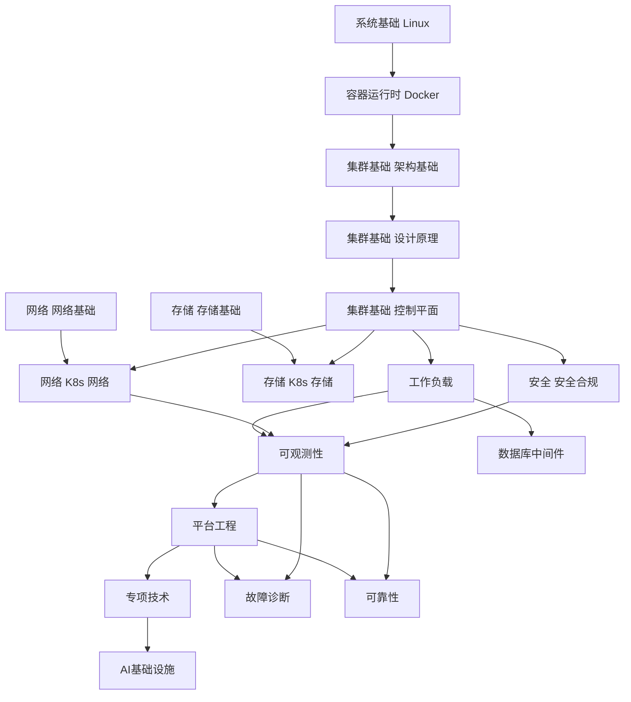
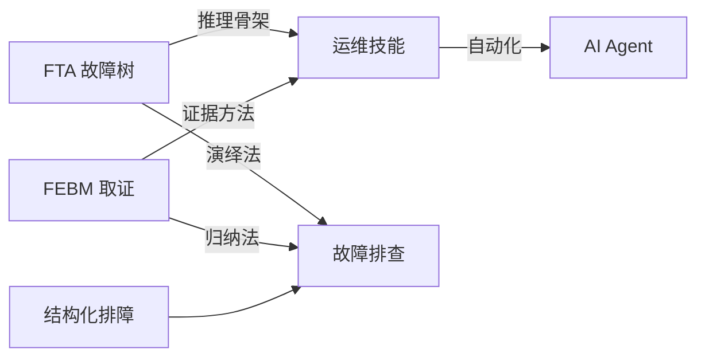
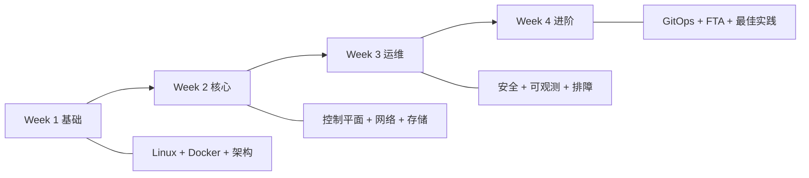

# 知识图谱 (Knowledge Map)

> 知识模块间的依赖关系、学习路径和知识流动全景。用于指导新人入职学习顺序、Agent 知识检索路径、内容建设优先级。

---

## 核心知识依赖图



---

## 方法论关系图



### 方法论说明

| 方法论 | 全称 | 核心思想 | 适用场景 |
|--------|------|----------|----------|
| FTA | Fault Tree Analysis | 从顶事件向下演绎，逐层分解原因 | 已知故障现象，定位根因 |
| FEBM | Forensic Evidence-Based Method | 基于证据归纳，收集线索推导 | 未知故障，探索性诊断 |
| 结构化排障 | Structural Troubleshooting | 分层分块系统性排除 | 复杂多因素故障 |

---

## 学习路径

### 4 周快速上手路径



### 按角色学习路径

| 角色 | 优先学习模块 | 进阶模块 |
|------|--------------|----------|
| 新人 SRE | 系统基础 → 集群基础 → 故障诊断 | 可观测性 → 可靠性 |
| 平台工程师 | 集群基础 → 平台工程 → 发布变更 | 专项技术 → AI基础设施 |
| 安全工程师 | 安全 → 网络 → 合规审计 | 供应链 → 运行时安全 |
| AI 工程师 | 工作负载 → AI基础设施 → 数据库中间件 | 专项技术 → 可观测性 |
| 架构师 | 集群基础 → 应用模式 → 云厂商 | 可靠性 → 生产运维 |

---

## 模块间依赖矩阵

| 模块 | 前置依赖 | 推荐后续 | 知识域标签 |
|:---|:---|:---|:---|
| 系统基础 Linux | 无 | 容器运行时 Docker | `domain/system-foundation` |
| 容器运行时 Docker | Linux 基础 | 集群基础 架构 | `domain/container-runtime` |
| 集群基础 架构 | Docker | 设计原理 | `domain/cluster-fundamentals` |
| 集群基础 控制平面 | 设计原理 | 工作负载/网络/存储 | `domain/cluster-fundamentals` |
| 网络 K8s 网络 | 网络基础 | 故障诊断 | `domain/networking-traffic` |
| 存储 K8s 存储 | 存储基础 | 故障诊断 | `domain/storage-data` |
| 可观测性 | 集群基础 | 平台工程/可靠性 | `domain/observability` |
| AI基础设施 | 工作负载 | AI Agents | `domain/ai-ml-infra` |
| 故障诊断 | 任一核心域 | FTA/Skills | `domain/troubleshooting-diagnostics` |
| 平台工程 | 可观测性 + 发布变更 | 专项技术 | `domain/platform-engineering` |
| 可靠性 | 可观测性 + 生产运维 | 混沌工程 | `domain/reliability-engineering` |

---

## 知识流动模式

```
生产故障 → 故障诊断(FTA/FEBM) → 事后复盘 → 可靠性(SRE实践)
    │                                              │
    └──→ 可观测性(告警优化) ←──────────────┘
    │
    └──→ 平台工程(自动化修复) → 发布变更(预防)
```

## Related

- [[生态参考/领域索引/gitops-cicd-index.md|GitOps / CI-CD 全局索引]]
- [[元数据/taxonomy.md|Tag Taxonomy]] — 标签分类体系
- [[元数据/domain-mapping.md|Domain 映射]] — 目录结构
