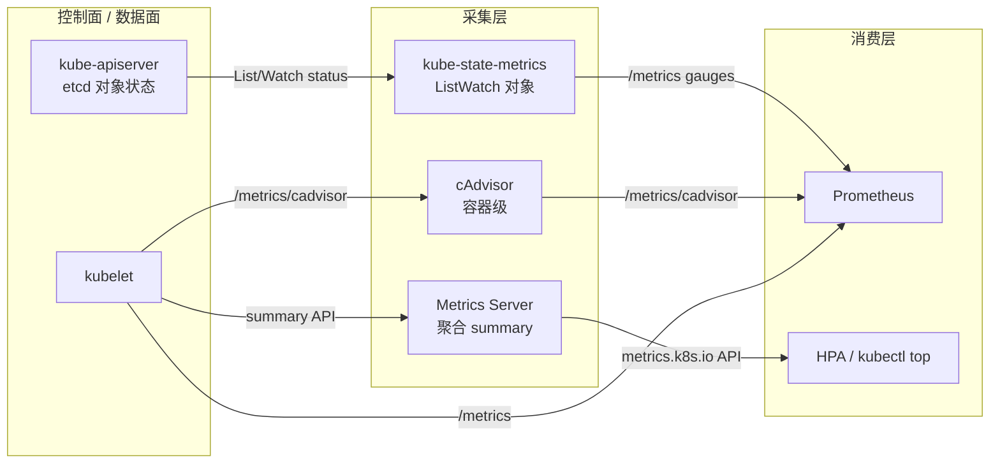
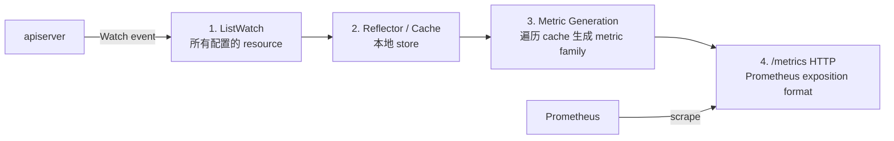

> **生产环境安全提示**
>
> 本文档包含可直接执行的运维命令。执行前请确认：当前目标集群与 Namespace 是否正确；是否具备足够的 RBAC 权限；是否已在非生产环境验证。命令风险等级标注：🔴 高风险（可能造成数据丢失或服务中断）、🟡 中风险（会修改集群状态，但通常可回滚）、🟢 低风险/只读（信息收集，无副作用）。

# kube-state-metrics 深度解析

> **作者**: 可观测性架构团队 | **版本**: v1.0 | **更新时间**: 2026-07-23
> **适用版本**: kube-state-metrics v2.13+ / Kubernetes v1.28–v1.33 | **复杂度**: ⭐⭐⭐⭐

## 1. 概述

**kube-state-metrics（简称 KSM）** 是一个独立的服务（Service），它通过监听 Kubernetes API server，将集群内各类资源对象（object）的 **spec 与 status 字段** 转换成 Prometheus 格式的 **gauge 指标**，并通过 HTTP `/metrics` 端点暴露出来。简而言之，它的核心价值是：

> **把 etcd 里对象的"配置与状态"翻译成 Prometheus gauges。**

它回答的是 **"集群里有几个 Pod、它们处于什么 Phase、Deployment 期望副本数 vs 可用副本数、PVC 是不是 Bound、Node 是不是 Ready"** 这一类**对象拓扑与状态（object topology & state）** 的问题。

它**不**回答的问题：

- ❌ 这个 Pod 现在用了多少 CPU/内存（这是 cAdvisor / kubelet summary 的职责）
- ❌ HPA 该不该扩容（这是 Metrics Server 提供 resource metrics 的职责）
- ❌ 进程级 GC、goroutine、HTTP 延迟（这是应用自身 exporter 的职责）

KSM 是 **SIG instrumentation** 维护的官方子项目，kube-prometheus-stack Helm chart 默认内置，Prometheus Operator 的默认 `ServiceMonitor` 也会自动发现并抓取它。在大规模集群里，它是告警与容量 SLO 的**对象层数据底座**。

### 1.1 核心定位一句话

> KSM = "对象状态（object state）" 的 Prometheus 适配层；它只读、无状态、不写回集群。

---

## 2. 在 metrics pipeline 中的定位

这是理解 KSM 最关键的部分。一个 Kubernetes 集群的可观测性 pipeline 通常由**四个数据源**组成，它们职责正交、不可互相替代。KSM 与另外三者（Metrics Server / cAdvisor / kubelet）的对比是面试与排障的高频考点。

### 2.1 四组件职责对比表

| 组件 | 数据源 | 指标类型 | 典型指标前缀 | 用途 |
|---|---|---|---|---|
| **kube-state-metrics** | apiserver（对象 status） | gauges（label-heavy） | `kube_pod_*`、`kube_node_*`、`kube_deployment_*` | 对象级状态：副本数、Phase、Condition、PVC 状态 |
| **Metrics Server** | kubelet `/metrics/cadvisor` summary | gauges（瞬时值） | （不暴露 Prometheus，走 metrics.k8s.io API） | HPA / VPA / `kubectl top` 用的 resource metrics |
| **cAdvisor** | kubelet `/metrics/cadvisor` | counters + gauges | `container_cpu_*`、`container_memory_*` | 容器级 CPU / Mem / 网络 / IO 运行时数值 |
| **kubelet `/metrics`** | kubelet 自身 | gauges + counters | `kubelet_*`、`volume_manager_*` | kubelet 进程运行指标（PLEG、pod 启动耗时） |

### 2.2 数据流定位图



### 2.3 关键认知点

1. **KSM = "对象拓扑与状态"，其它三者 = "运行时数值"。** 二者维度正交：一个回答"有多少 / 什么状态"，一个回答"用了多少资源"。
2. **KSM 不参与 HPA 决策**：HPA 依赖的 resource metrics 走 `metrics.k8s.io`（Metrics Server 提供），而 custom.metrics / external.metrics 走 Prometheus Adapter（详见 [[可观测性/指标/11-custom-metrics-adapter.md|自定义指标适配器]]）。KSM 只把数据给 Prometheus，不直接服务 autoscaler。
3. **KSM 是只读旁路**：它不写集群、不影响调度。这决定了它非常适合做"无副作用"的对象层监控，挂掉只影响告警、不影响业务。
4. **KSM 与 Prometheus Operator 强绑定**：默认 kube-prometheus-stack 部署它，并以 `ServiceMonitor` 自动 scrape，几乎零配置即可工作。

完整的 pipeline 全景见 [[可观测性/指标/02-monitoring-metrics-system.md|监控指标体系]] 第 1 节。

---

## 3. 指标模型（label-heavy gauge）

### 3.1 全部是 gauge，没有 counter / histogram / summary

这是 KSM 与 cAdvisor / kubelet 指标最显著的区别。KSM 暴露的所有指标（极少数例外如 `kube_pod_container_status_restarts_total` 这种累计计数）几乎都是 **gauge**：

- 没有 `_total` 后缀的累计计数器（restarts_total 是历史遗留特例）
- 没有 histogram 的 `_bucket` / `_sum` / `_count`
- 没有 summary 的分位数

为什么？因为 KSM 暴露的是 **对象当前状态（spec/status 的瞬时快照）**，状态本身就是离散、可枚举的——一个 Pod 的 phase 要么 Pending、要么 Running，不存在"rate"。

### 3.2 用 labels 区分实例与维度

典型的 KSM 指标长这样：

```
# HELP kube_pod_status_phase The pods current phase.
# TYPE kube_pod_status_phase gauge
kube_pod_status_phase{namespace="pay",pod="checkout-7b9-x4r",phase="Pending"} 0
kube_pod_status_phase{namespace="pay",pod="checkout-7b9-x4r",phase="Running"} 1
kube_pod_status_phase{namespace="pay",pod="checkout-7b9-x4r",phase="Succeeded"} 0
kube_pod_status_phase{namespace="pay",pod="checkout-7b9-x4r",phase="Failed"} 0
kube_pod_status_phase{namespace="pay",pod="checkout-7b9-x4r",phase="Unknown"} 0
```

注意几个关键点：

1. **一个对象 + 一个维度 = 一组互斥序列**：对每个 Pod，`phase` 这个 label 会展开成 5 条序列（Pending/Running/Succeeded/Failed/Unknown），其中**恰好一条为 1**，其余为 0。这是"枚举型 gauge"模式。
2. **查询时务必带 label 过滤**：查"运行中的 Pod 数"应写 `kube_pod_status_phase{phase="Running"} == 1`，否则会把 0 也算进去。
3. **`_info` 类指标是常数 1**：`kube_pod_info`、`kube_node_info`、`kube_service_info` 恒为 1，作用是**作为 join 键**携带元信息（node、pod_ip、created_by 等），用于 PromQL `* on() group_left()` 联接。

### 3.3 label-heavy 模式对存储与查询的影响

| 维度 | 影响 | 应对 |
|---|---|---|
| **序列基数（cardinality）** | Pod × phase × namespace 等组合在大集群里可达数十万序列 | 用 `--metric-allowlist` 裁剪；监控 KSM 自身内存 |
| **存储成本** | 每条序列在 Prometheus 里都有索引与 chunk 开销 | 关闭 `--metric-annotations-allowlist`、限制 label 维度 |
| **查询习惯** | 必须带枚举 label 过滤，否则值被 0 污染 | 团队约定 PromQL 写法，见 [[可观测性/指标/17-monitoring-cost-optimization.md|监控成本优化]] |
| **Scrape 体积** | `/metrics` 单次响应可达数十 MB，scrape timeout 风险 | scrape timeout ≥ 30s；必要时分片 |

> ⚠️ **常见陷阱**：开启 `--metric-annotations-allowlist=*` 会把所有 annotation 当作 label 注入，会瞬间把基数炸到不可控。生产环境严禁 `*`，必须显式列出需要的 annotation key。

---

## 4. 内部架构（源码级）

理解 KSM 内部架构，才能理解"为什么大集群要分片、为什么内存会涨、为什么 `/metrics` 偶尔超时"。

### 4.1 四阶段管线



#### 阶段 1：ListWatch（informer）

- KSM 启动时，根据 `--resources` 与默认配置（pod/node/deployment/replicaset/statefulset/daemonset/job/cronjob/service/endpoints/pvc/pv/namespace/...），为**每个 resource type** 创建一个 client-go informer。
- 每个 informer 执行 `List`（全量拉取）+ `Watch`（增量订阅），通过 `Reflector` 维护本地缓存。
- 这是 KSM 内存占用的**主要来源**：缓存持有所有对象（pod/spec/status 等），1 万 Pod 大约几十 MB 起。

#### 阶段 2：Store / Cache

- informer 维护一个 thread-safe 的 `Store`（底层是 `cache`），key 为 `namespace/name`。
- Watch 事件触发 store 的增删改，KSM 主流程无需关心，缓存始终是 apiserver 的镜像（eventually consistent）。
- 注意：KSM 不写回任何东西，它是纯消费者。

#### 阶段 3：Metric Generation（核心）

- 每个 resource type 注册一组 **metric family**（如 pod 的 `kube_pod_status_phase`、`kube_pod_container_resource_limits` 等）。
- 每次 `/metrics` 被 scrape 时，KSM 遍历对应 store，为每个对象、每个 metric family 生成一条（或多条）metric。
- **生成阶段是单线程、CPU 密集**：万级 Pod × 数十个 family，单次渲染可能耗时秒级——这是"单实例扛不住"的根本原因。

#### 阶段 4：HTTP `/metrics`

- 用 `prometheus/client_golang` 的 `Registry.Gather()` 输出 text exposition format。
- 端口：`8080`（main，`/metrics`）+ `8081`（telemetry，KSM 自身指标如 `kube_state_metrics_total_metric_families`、`kube_state_metrics_shard_ordinal`）。
- 路由：`/metrics`（对外 scrape）、`/healthz`（探针）。

### 4.2 metric family 注册与生成（源码视角）

KSM 内部每个 resource type 对应一个 `MetricsStore`，它实现 client-go 的 `cache.Store` 接口，并额外持有一组 `metric family` 的**生成函数（genFunc）**。核心数据流：

```
informer ──event──▶ MetricsStore.Add/Update/Delete (持锁)
                          │
scrape ──/metrics──▶ MetricsStore.GetEnumerator() (持读锁)
                          │
                          ▼
                     遍历 store 中每个对象
                          │
                          ▼
                   对每个 metric family 调用 genFunc(obj) ──▶ []metric
```

几个值得记住的实现细节：

1. **生成函数是无状态的纯函数**：`genFunc(obj *v1.Pod) []metric` 只依赖传入对象的当前值，不维护跨 scrape 的状态。这意味着 KSM **重启后不丢指标语义**——它从 apiserver 重新 List 即可重建全量。
2. **生成与抓取同步**：scrape 触发的渲染走读锁，对象更新走写锁，二者互斥。大集群下渲染耗时长，会短暂阻塞 cache 写入（但 Watch 队列会缓冲），所以 scrape timeout 调小反而可能触发"渲染未完成就被切断"的死循环。**生产上 scrape timeout 不要小于实际 P99 渲染耗时**。
3. **`_info` 指标用单独 family**：`kube_pod_info` 这类元信息指标走同套机制，但恒为 1，仅用于携带 label 做 PromQL join。
4. **没有增量导出**：每次 scrape 都全量遍历 store 重新生成，**不缓存上次结果**。这是 KSM CPU 随 scrape 频率线性增长的根因——所以拉长 interval 能直接降 CPU，但会降采样密度。

### 4.3 为什么需要 sharding

| 触发因素 | 表现 | 触发阈值（经验） |
|---|---|---|
| 缓存内存 | 单实例 RSS 持续增长，OOMKilled | Pod 数 > 3 万 / 单实例内存 > 2 GiB |
| 渲染 CPU | scrape 耗时 > scrape timeout，target 标记 down | `/metrics` 响应 > 30s |
| apiserver 负载 | 单实例 Watch 给 apiserver 带来压力 | 每 resource 的 Watch event rate 过高 |

当任一指标触顶，就需要把"全量对象"按某种规则切分到多个 KSM 实例——这就是 **sharding（分片）**。

---

## 5. 关键指标族速查

下表按 resource type 分类，给出每类的代表指标、类型与含义。所有指标默认 `gauge` 类型（`restarts_total` 等历史特例会显式标注）。

### 5.1 Pod 类（`kube_pod_*`）

| 指标 | 含义 | 典型用法 |
|---|---|---|
| `kube_pod_status_phase{phase}` | Pod 当前 Phase（0/1 枚举） | 告警 Pending > 15m、Failed |
| `kube_pod_status_ready{condition}` | Pod Ready condition | `condition="true"` 计数可用 Pod |
| `kube_pod_status_scheduled{condition}` | 是否已调度 | 排查调度失败 |
| `kube_pod_container_resource_limits{resource,unit}` | 容器资源 limit（cpu/core、memory/byte） | 容量规划、成本归因 |
| `kube_pod_container_resource_requests{resource,unit}` | 容器资源 request | 集群调度率统计 |
| `kube_pod_container_status_restarts_total` | 容器累计重启次数（**counter 特例**） | 告警 `increase(...[1h]) > 5` |
| `kube_pod_container_status_waiting_reason{reason}` | 容器 waiting reason（CrashLoopBackOff/ImagePullBackOff） | 启动故障告警 |
| `kube_pod_info{pod,uid,created_by_kind,created_by_name,...}` | 恒为 1，携带元信息 | PromQL join 键 |

### 5.2 Node 类（`kube_node_*`）

| 指标 | 含义 | 典型用法 |
|---|---|---|
| `kube_node_status_condition{condition,status}` | Node condition（Ready / DiskPressure / MemoryPressure / PIDPressure / NetworkUnavailable） | 节点健康告警核心 |
| `kube_node_spec_unschedulable` | 是否 cordon（1=不可调度） | 维护窗口监控 |
| `kube_node_info{node,kernel_version,kubelet_version,...}` | 节点元信息 | 版本分布统计 |
| `kube_node_status_allocatable{resource,unit}` | 节点可分配资源 | 容量 SLO |
| `kube_node_status_capacity{resource,unit}` | 节点总容量 | 利用率分母 |
| `kube_node_role` | 节点 role label | 区分 master / worker |

### 5.3 工作负载类（Deployment / ReplicaSet / StatefulSet / DaemonSet）

| 指标 | 含义 | 典型用法 |
|---|---|---|
| `kube_deployment_spec_replicas` | 期望副本数 | 告警分母 |
| `kube_deployment_status_replicas` | 当前副本数 | |
| `kube_deployment_status_replicas_available` | 可用副本数 | 告警分子（< spec = 不可用） |
| `kube_deployment_status_replicas_unavailable` | 不可用副本数 | `> 0` 告警 |
| `kube_replicaset_spec_replicas` / `kube_replicaset_status_replicas` | RS 期望/实际副本 | 滚动发布监控 |
| `kube_statefulset_status_replicas` / `..._ready` | StatefulSet 副本/就绪 | 有状态服务监控 |
| `kube_daemonset_status_desired_number_scheduled` / `..._number_ready` | DS 期望/就绪节点数 | DaemonSet 覆盖率告警 |

### 5.4 存储类（PVC / PV / StorageClass）

| 指标 | 含义 | 典型用法 |
|---|---|---|
| `kube_persistentvolumeclaim_status_phase{phase}` | PVC phase（Pending/Bound/Lost） | Pending 卡住 = 供给失败告警 |
| `kube_persistentvolumeclaim_resource_requests_storage` | PVC 申请容量 | 存储容量规划 |
| `kube_persistentvolume_status_phase{phase}` | PV phase | 回收异常监控 |
| `kube_persistentvolumeclaim_info{storageclass,volumename}` | PVC 元信息 | 按 storageclass 聚合 |

### 5.5 Job / CronJob 类

| 指标 | 含义 | 典型用法 |
|---|---|---|
| `kube_job_status_failed` | Job 是否失败（0/1） | 批任务失败告警 |
| `kube_job_status_succeeded` | Job 是否成功 | 批任务成功率 |
| `kube_job_complete` / `kube_job_failed` | Job 是否已结束 | 区分"进行中 vs 完成" |
| `kube_cronjob_status_last_schedule_time` | CronJob 上次调度时间（unix ts） | 调度延迟监控 |
| `kube_cronjob_spec_suspend` | 是否暂停 | 配置漂移检测 |

### 5.6 网络 / 服务发现类

| 指标 | 含义 | 典型用法 |
|---|---|---|
| `kube_service_info{service,type,cluster_ip}` | Service 元信息 | Service 资产盘点 |
| `kube_service_spec_type{type}` | Service 类型（ClusterIP/NodePort/LoadBalancer） | LB 成本统计 |
| `kube_endpoint_address_available` | Endpoint 可用后端数 | 流量可达性告警 |
| `kube_endpoint_address_not_ready` | 未就绪后端数 | `> 0` 告警 |

### 5.7 治理类（Namespace / ResourceQuota / LimitRange / HPA）

| 指标 | 含义 | 典型用法 |
|---|---|---|
| `kube_namespace_status_phase{phase}` | Namespace phase | Terminating 卡住告警 |
| `kube_resourcequota{resource,type}` | 配额 used / hard | `used/hard > 0.85` 配额告警 |
| `kube_limitrange{resource,type,max,min,default}` | LimitRange 约束 | 容量合规审计 |
| `kube_horizontalpodautoscaler_status_current_replicas` | HPA 当前副本 | 扩缩容追踪 |
| `kube_horizontalpodautoscaler_status_desired_replicas` | HPA 期望副本 | 达到 max 告警（可能撞顶） |
| `kube_horizontalpodautoscaler_spec_max_replicas` | HPA 上限 | HPA 容量规划 |

> 完整指标清单（数百项）见 KSM 官方 `metrics.md`；告警阈值模板见 [[可观测性/指标/10-monitoring-metrics-prometheus.md|Prometheus 监控指标]] 第 6 节。

---

## 6. 部署配置

### 6.1 Helm 部署（推荐）

kube-prometheus-stack 默认内置 KSM 子 chart；也可独立部署 `kube-state-metrics/kube-state-metrics`。

```bash
# 🟢 低风险：独立部署 KSM 到 monitoring 命名空间（只读，无副作用）
helm repo add kube-state-metrics https://kubernetes.github.io/kube-state-metrics
helm upgrade --install kube-state-metrics kube-state-metrics/kube-state-metrics \
  --namespace monitoring \
  --create-namespace \
  --set replicaCount=1 \
  --set autosharding.enabled=false
```

### 6.2 关键启动参数（options）

| 参数 | 作用 | 默认 |
|---|---|---|
| `--metric-allowlist` | 指标白名单（正则），命中才暴露 | 全部 |
| `--metric-denylist` | 指标黑名单（正则），命中则剔除 | 无 |
| `--metric-annotations-allowlist` | 允许作为 label 的 annotation key 列表（逗号分隔） | 空（关键安全项） |
| `--metric-labels-allowlist` | 允许作为 label 的对象 label key 列表 | 空 |
| `--namespaces` | 只监听这些 namespace（逗号分隔）；留空=全部 | 空=全部 |
| `--namespace` | 已废弃，用 `--namespaces` 替代 | — |
| `--resources` | 只暴露这些 resource 的指标（逗号分隔，如 `pods,nodes`） | 全部 |
| `--shard` | 当前实例的 shard 编号（从 0 开始） | 0 |
| `--shards` | 总 shard 数 | 1 |
| `--port` | main 端口（`/metrics`） | 8080 |
| `--telemetry-port` | 自监控端口 | 8081 |
| `--tls-config` | 启用 mTLS（双向认证） | 关闭 |

### 6.3 allowlist 裁剪示例（生产推荐）

只暴露 Pod/Node/Deployment 的核心指标，能显著降低基数与内存：

```bash
# 🟡 中风险：修改 KSM 暴露的指标会影响既有告警/看板，需先在非生产验证
#           以下参数建议通过 Helm values.yaml 注入，避免命令行覆盖
cat <<'EOF' > ksm-values.yaml
metricAllowList:
  - kube_pod_status_phase
  - kube_pod_status_ready
  - kube_pod_container_status_restarts_total
  - kube_pod_container_resource_limits
  - kube_node_status_condition
  - kube_node_status_allocatable
  - kube_deployment_status_replicas_available
  - kube_deployment_spec_replicas
extraArgs:
  - --metric-allowlist=kube_pod_.*
  - --metric-allowlist=kube_node_.*
  - --metric-allowlist=kube_deployment_.*
EOF

helm upgrade --install kube-state-metrics kube-state-metrics/kube-state-metrics \
  --namespace monitoring \
  -f ksm-values.yaml
```

### 6.4 自动分片（autosharding）

KSM 的分片是**水平扩展**：N 个实例各自只渲染 1/N 的对象。shard 归属由对象 `namespace/name` 做 hash 后对 `shards` 取模决定。

Helm chart 提供 `autosharding.enabled=true`，它利用 StatefulSet 的稳定 pod name（`kube-state-metrics-0/1/2`）自动解析出每个实例的 `--shard` 与 `--shards`，无需手动维护。

```bash
# 🟡 中风险：开启分片会临时改变 scrape target 拓扑，Prometheus 抓取窗口内可能有数据缺口
cat <<'EOF' > ksm-shard-values.yaml
replicaCount: 3
autosharding:
  enabled: true
extraArgs:
  - --telemetry-port=8081
EOF

helm upgrade --install kube-state-metrics kube-state-metrics/kube-state-metrics \
  --namespace monitoring \
  -f ksm-shard-values.yaml
```

每个分片实例的 args 会自动注入：

```
--shard=0  --shards=3   # 第一个副本
--shard=1  --shards=3   # 第二个副本
--shard=2  --shards=3   # 第三个副本
```

> 分片数选择经验：单实例 Pod 数 / 分片数 ≤ 1 万，且单实例 RSS ≤ 1 GiB。监控 `kube_state_metrics_total_metric_families` 与 `process_resident_memory_bytes` 判断是否需要扩 shard。

### 6.5 与 Prometheus ServiceMonitor 集成

kube-prometheus-stack 已默认创建 KSM 的 ServiceMonitor。独立部署时需手动添加：

```yaml
# 🟡 中风险：ServiceMonitor 修改会改变 Prometheus 抓取行为，影响告警数据完整性
apiVersion: monitoring.coreos.com/v1
kind: ServiceMonitor
metadata:
  name: kube-state-metrics
  namespace: monitoring
  labels:
    release: kube-prometheus-stack   # 匹配 Prometheus 的 selector
spec:
  jobLabel: app.kubernetes.io/name
  selector:
    matchLabels:
      app.kubernetes.io/name: kube-state-metrics
  endpoints:
  - port: http-metrics
    interval: 30s          # KSM 缓存高频，30s 足够
    scrapeTimeout: 30s     # 大集群 /metrics 渲染慢，需放宽
    honorLabels: true      # 让 KSM 自己的 label 不被覆盖
    relabelings:
    - sourceLabels: [__meta_kubernetes_pod_node_name]
      targetLabel: node
```

> ServiceMonitor 的完整语法与最佳实践见 [[可观测性/指标/01-prometheus-enterprise-monitoring.md|Prometheus 企业级监控]] 第 2 节。

---

## 7. 生产实践

### 7.1 用 allowlist 控制基数爆炸

大集群最常见的事故是 KSM 内存 OOM，根因往往是**暴露了不需要的指标**或**注入了高基数 label**。生产纪律：

1. **默认开 allowlist**，按需放开，而非默认全开再 deny。
2. **annotation / label allowlist 永远不用 `*`**：必须显式枚举需要的 key，防止业务把 `trace_id`、`user_id` 当 annotation 写进 Pod。
3. **定期审查基数**：`topk(10, count by (__name__) ({__name__=~"kube_.*"}))`，找出序列数异常的指标族。

### 7.2 scrape interval 取舍

| 场景 | 建议 interval | 理由 |
|---|---|---|
| 默认（< 5k Pod） | 30s | 平衡数据新鲜度与负载 |
| 中规模（5k–20k Pod） | 30–60s | 给 KSM 渲染留余量，scrape timeout ≥ 30s |
| 大规模 / 分片后 | 30s + 分片 | 不靠拉长 interval，靠水平扩展 |
| 成本敏感（仅告警） | 60s | 对象状态变化慢，60s 足够 |

> KSM 自身缓存由 Watch 实时更新，所以 interval 拉长**不会丢失状态变化**，只是降低采样密度。这与 cAdvisor 不同（cAdvisor 拉长 interval 会平滑掉瞬时尖刺）。

### 7.3 与 Prometheus 联动的告警样例

```yaml
# 🟡 中风险：告警规则变更需灰度发布，避免误报风暴
apiVersion: monitoring.coreos.com/v1
kind: PrometheusRule
metadata:
  name: ksm-object-alerts
  namespace: monitoring
spec:
  groups:
  - name: ksm.workload
    rules:
    # Deployment 可用副本不足
    - alert: KubeDeploymentReplicasMismatch
      expr: |
        (kube_deployment_spec_replicas{namespace!~"kube-system"}
          - kube_deployment_status_replicas_available{namespace!~"kube-system"}) > 0
      for: 15m
      labels:
        severity: warning
      annotations:
        summary: "Deployment {{ $labels.namespace }}/{{ $labels.deployment }} 副本不足"
        description: "期望 {{ $value }} 个副本持续 15m 未达到可用，检查 Pod 启动失败原因"

    # Pod 长时间 Pending（调度失败）
    - alert: KubePodPending
      expr: kube_pod_status_phase{phase="Pending"} == 1
      for: 15m
      labels:
        severity: warning
      annotations:
        summary: "Pod {{ $labels.namespace }}/{{ $labels.pod }} Pending 超过 15m"

    # Node NotReady
    - alert: KubeNodeNotReady
      expr: kube_node_status_condition{condition="Ready",status!="true"} == 1
      for: 5m
      labels:
        severity: critical
      annotations:
        summary: "Node {{ $labels.node }} NotReady"

    # PVC 长时间 Pending（存储供给失败）
    - alert: KubePVCPending
      expr: kube_persistentvolumeclaim_status_phase{phase="Pending"} == 1
      for: 10m
      labels:
        severity: warning
      annotations:
        summary: "PVC {{ $labels.namespace }}/{{ $labels.persistentvolumeclaim }} Pending"

    # 容器频繁重启（CrashLoopBackOff 前兆）
    - alert: KubePodCrashLooping
      expr: increase(kube_pod_container_status_restarts_total[1h]) > 5
      labels:
        severity: warning
      annotations:
        summary: "容器 {{ $labels.namespace }}/{{ $labels.pod }}/{{ $labels.container }} 1h 内重启 {{ $value }} 次"
```

### 7.4 与 Recording Rules 结合做容量 SLO

KSM 的 `kube_pod_container_resource_requests` / `..._limits` 是**容量规划的金标准数据源**（cAdvisor 给的是真实用量，KSM 给的是声明额度）。结合 recording rule 可建立可追踪的容量 SLO：

```yaml
# 🟢 低风险：recording rule 只新增序列，不改变既有数据
groups:
- name: ksm.capacity
  interval: 5m
  rules:
  # 集群整体 CPU 申请率（已申请 / 可分配）
  - record: cluster:cpu_requests:ratio
    expr: |
      sum(kube_pod_container_resource_requests{resource="cpu",unit="core"})
      /
      sum(kube_node_status_allocatable{resource="cpu",unit="core"})

  # 命名空间维度内存 limit 利用率（避免超售）
  - record: namespace:memory_limits:bytes
    expr: |
      sum by (namespace) (
        kube_pod_container_resource_limits{resource="memory",unit="byte"}
      )
```

> Recording Rules 与成本治理的深度结合见 [[可观测性/指标/17-monitoring-cost-optimization.md|监控成本优化]] 与 [[可观测性/指标/18-cost-optimization-observability.md|可观测性成本优化]]。

### 7.5 多集群联邦场景下的 KSM

在多集群架构（每个集群一套 KSM + Prometheus，上层 Thanos 全局查询）里，KSM 指标必须**带上集群标识**，否则跨集群聚合会出现 Pod name 碰撞。标准做法是让 Prometheus 抓取时注入 external label：

```yaml
# 🟢 低风险：仅修改 Prometheus 全局 external_labels，不影响抓取本身
global:
  external_labels:
    cluster: prod-east-1    # 跨集群聚合的唯一标识
    replica: $(POD_NAME)    # HA 去重键
```

下游 Thanos Query 用 `cluster` label 做聚合分组，例如全局 Deployment 可用副本：

```promql
sum by (cluster, namespace, deployment) (
  kube_deployment_status_replicas_available
)
```

> 多集群联邦的完整架构与 Thanos 侧处理见 [[可观测性/指标/04-thanos-enterprise-metrics-federation.md|Thanos 企业级指标联邦]] 与 [[可观测性/指标/16-multi-cluster-monitoring-governance.md|多集群监控治理]]。

### 7.6 KSM 自身监控

务必抓取 KSM 的 telemetry 端口（8081），关注：

| 指标 | 含义 | 告警建议 |
|---|---|---|
| `kube_state_metrics_total_metric_families` | 暴露的 metric family 总数 | 突然下降 = allowlist 配错 |
| `kube_state_metrics_shard_ordinal` | 当前 shard 编号 | 校验分片分布是否均匀 |
| `process_resident_memory_bytes` | 进程 RSS | 接近 limit = 需扩 shard |
| `http_request_duration_seconds{handler="/metrics"}` | scrape 响应耗时 | P99 接近 scrape timeout = 渲染瓶颈 |

---

## 8. 排障

### 8.1 基础排查命令

```bash
# 🟢 低风险：port-forward + curl 检查 KSM 是否正常暴露指标
kubectl -n monitoring port-forward svc/kube-state-metrics 8080:8080 &
curl -s http://localhost:8080/metrics | head -50

# 🟢 低风险：检查 KSM Pod 的实际启动参数（确认 allowlist / shard 生效）
kubectl -n monitoring get pod -l app.kubernetes.io/name=kube-state-metrics \
  -o jsonpath='{.items[*].spec.containers[*].args}{"\n"}'

# 🟢 低风险：查看 KSM 自监控指标（基数、shard、内存）
kubectl -n monitoring port-forward svc/kube-state-metrics 8081:8081 &
curl -s http://localhost:8081/metrics | grep -E \
  'kube_state_metrics_total_metric_families|kube_state_metrics_shard_ordinal|process_resident_memory'

# 🟢 低风险：在 Prometheus 检查 KSM target health
kubectl -n monitoring port-forward svc/prometheus-operated 9090:9090 &
open "http://localhost:9090/targets#job-kube-state-metrics"

# 🟢 低风险：统计 KSM 各指标族序列基数（找基数爆炸源）
curl -s http://localhost:8080/metrics | \
  awk '/^kube_/{n=split($1,a,"{"); print a[1]}' | sort | uniq -c | sort -rn | head
```

### 8.2 常见问题与对策

| 症状 | 可能原因 | 处置 |
|---|---|---|
| KSM Pod OOMKilled | 缓存过大 / 注入了高基数 annotation | 开 allowlist；排查 `--metric-annotations-allowlist`；扩 shard |
| Prometheus target `last scrape` 超时 | 单次 `/metrics` 渲染过慢 | 放宽 scrapeTimeout；扩 shard；裁指标 |
| 告警指标缺失（`kube_xxx` 查不到） | allowlist 正则写错，把需要的指标也滤掉了 | 用 `kubectl ... -o jsonpath=...args` 核对正则 |
| 分片后部分 namespace 指标时有时无 | shard 数变更时 hash 重分布 | 灰度调整 shard 数；分片稳定后再开告警 |
| `kube_pod_info` 缺失 created_by | RBAC 权限不足（缺 owner references 读取） | 检查 ClusterRole 是否含 pods/ownerReferences |
| 跨 namespace 指标不全 | 误用了 `--namespaces` 限定 | 生产监控场景默认留空（全部 namespace） |

### 8.3 RBAC 最小权限核查

KSM 需要对监控的资源有 `list/watch` 权限。RBAC 配错会导致对应指标族静默缺失（最难排的一类问题）：

```bash
# 🟢 低风险：检查 KSM ClusterRole 是否覆盖所需 resource
kubectl get clusterrole kube-state-metrics -o yaml | grep -A2 resources

# 🟢 低风险：以 KSM service account 视角验证能否 list pods（auth can-i）
kubectl auth can-i list pods \
  --as=system:serviceaccount:monitoring:kube-state-metrics
```

---

## 9. 相关文档

- [[可观测性/指标/01-prometheus-enterprise-monitoring.md|Prometheus 企业级监控]] — KSM 的下游消费者，ServiceMonitor 与告警体系全景
- [[可观测性/指标/02-monitoring-metrics-system.md|监控指标体系]] — metrics pipeline 总览，KSM 在其中的节点定位
- [[可观测性/指标/10-monitoring-metrics-prometheus.md|Prometheus 监控指标]] — KSM 关键指标速查表与告警阈值模板
- [[可观测性/指标/11-custom-metrics-adapter.md|自定义指标适配器]] — KSM 数据如何经 Prometheus Adapter 流向 HPA
- [[可观测性/指标/17-monitoring-cost-optimization.md|监控成本优化]] — allowlist 与基数治理的成本视角
- [[可观测性/指标/18-cost-optimization-observability.md|可观测性成本优化]] — KSM 容量指标驱动成本归因模型
- [[可观测性/指标/15-enterprise-scale-monitoring.md|企业级规模监控]] — 大规模集群的 KSM 分片与横向扩展策略

## See Also

- [kube-state-metrics 官方文档（metrics.md 全量指标清单）](https://github.com/kubernetes/kube-state-metrics/blob/main/docs/metrics/workload-metrics.md)
- [SIG instrumentation 设计文档](https://github.com/kubernetes/community/tree/master/sig-instrumentation)

- [[可观测性/README.md|返回目录]]

## Related

- [[生态参考/领域索引/observability-index.md|Observability 可观测性知识图谱索引]]

<!-- risk-assessed -->
