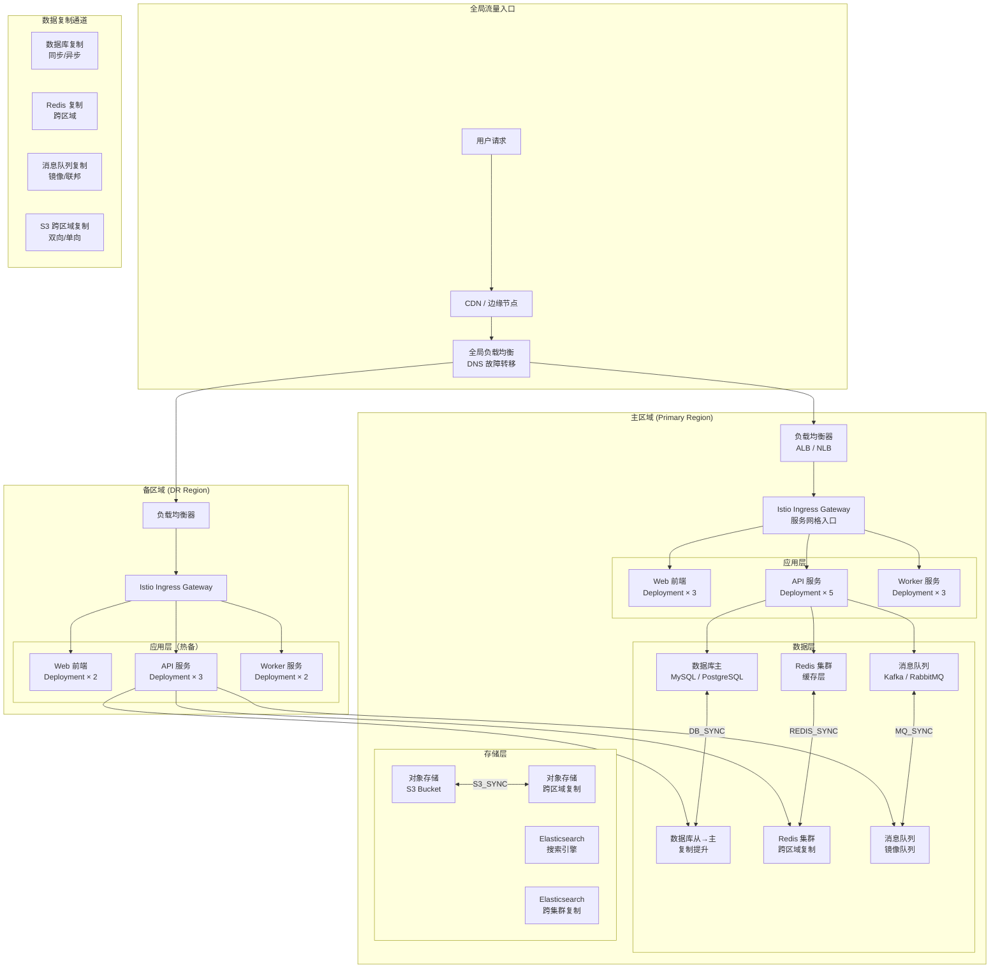

> **生产环境安全提示**
>
> 本文档包含可直接执行的运维命令。执行前请确认：当前目标集群与 Namespace 是否正确；是否具备足够的 RBAC 权限；是否已在非生产环境验证。命令风险等级标注：🔴 高风险（可能造成数据丢失或服务中断）、🟡 中风险（会修改集群状态，但通常可回滚）、🟢 低风险/只读（信息收集，无副作用）。


# 应用级灾备架构：多区域部署与故障转移

> **作者**: SRE 架构师 | **版本**: v1.0 | **更新时间**: 2026-05-18
> **适用场景**: 应用层多区域容灾与流量管理 | **复杂度**: ⭐⭐⭐⭐⭐

---

<!-- chunk: 概述 -->## 概述

基础设施级灾备（如存储复制、虚拟机故障切换）解决的是"数据不丢"的问题，但现代云原生应用的灾备远不止于此。应用级灾备关注的是在应用架构层面实现多区域部署、数据复制、自动故障检测和无缝流量切换，确保在区域性灾难发生时，业务能够在秒级到分钟级内切换到备用区域，用户几乎无感知。本文档深入探讨应用级灾备的核心技术：多区域部署架构、数据复制策略、DNS 故障转移、流量渐进式切换以及完整的问题响应编排。

## RPO 与 RTO 定义

- **RPO（Recovery Point Objective）**：在应用级灾备中，RPO 由数据复制策略决定。同步复制可实现 RPO ≈ 0（零数据丢失）；异步复制根据复制间隔可实现秒级到分钟级 RPO；最终一致性方案则接受更大范围的数据不一致。
- **RTO（Recovery Time Objective）**：应用级灾备通过多活部署可将 RTO 缩短至秒级（自动 DNS 故障转移）到分钟级（流量渐进式切换）。与基础设施级灾备不同，应用级灾备强调的是"服务不中断"而非"数据恢复后启动"。

```yaml
application_dr_rpo_rto:
  active_active:
    description: "多活部署，所有区域同时服务"
    rpo: "0（同步复制）"
    rto: "秒级（自动流量切换）"
    
  active_passive_hot:
    description: "主备热备，备区域全量部署但不服务"
    rpo: "秒-分钟级（异步复制）"
    rto: "分钟级（DNS 切换 + 服务启动）"
    
  active_passive_warm:
    description: "主备温备，备区域有基础设施但应用需启动"
    rpo: "分钟-小时级"
    rto: "10-30 分钟"
    
  pilot_light:
    description: "最小化备区域，仅运行核心组件"
    rpo: "小时级"
    rto: "30 分钟 - 数小时"
```

---

<!-- chunk: 架构设计 -->## 架构设计

## 多区域应用灾备架构



---

<!-- chunk: 核心配置 -->## 核心配置

## 多区域 Kubernetes 部署

```yaml
# 主区域部署 - production-us-east
apiVersion: apps/v1
kind: Deployment
metadata:
  name: api-server
  namespace: production
  labels:
    app: api-server
    region: us-east-1
spec:
  replicas: 5
  selector:
    matchLabels:
      app: api-server
  template:
    metadata:
      labels:
        app: api-server
        region: us-east-1
    spec:
      topologySpreadConstraints:
        - maxSkew: 1
          topologyKey: topology.kubernetes.io/zone
          whenUnsatisfiable: DoNotSchedule
          labelSelector:
            matchLabels:
              app: api-server
      containers:
        - name: api-server
          image: company/api-server:v2.5.0
          ports:
            - containerPort: 8080
          readinessProbe:
            httpGet:
              path: /health
              port: 8080
            initialDelaySeconds: 10
            periodSeconds: 5
          livenessProbe:
            httpGet:
              path: /health
              port: 8080
            initialDelaySeconds: 30
            periodSeconds: 10
          resources:
            requests:
              cpu: 500m
              memory: 512Mi
            limits:
              cpu: 2000m
              memory: 1Gi
          env:
            - name: REGION
              value: "us-east-1"
            - name: DB_HOST
              valueFrom:
                configMapKeyRef:
                  name: db-config
                  key: primary_host
            - name: REDIS_HOST
              value: "redis-primary.production.svc"
---
# 备区域部署 - production-us-west
# (同上，修改 region 和 DB_HOST)
```

## 数据库跨区域复制

```yaml
# MySQL 跨区域复制配置
apiVersion: v1
kind: ConfigMap
metadata:
  name: mysql-replication-config
  namespace: database
data:
  primary.cnf: |
    [mysqld]
    server-id = 1
    log-bin = mysql-bin
    binlog-format = ROW
    sync-binlog = 1
    innodb-flush-log-at-trx-commit = 1
    gtids-mode = ON
    enforce-gtid-consistency = ON
    
    # 半同步复制（RPO < 1秒）
    plugin-load = "rpl_semi_sync_master=semisync_master.so"
    rpl-semi-sync-master-enabled = 1
    rpl-semi-sync-master-timeout = 5000    # 5秒超时降级为异步
    
    # 复制过滤
    replicate-do-db = production_db
    replicate-do-db = analytics_db
    
  replica.cnf: |
    [mysqld]
    server-id = 2
    relay-log = relay-bin
    read-only = 1
    
    # 半同步复制
    plugin-load = "rpl_semi_sync_slave=semisync_slave.so"
    rpl-semi-sync-slave-enabled = 1
    
    # 并行复制
    slave-parallel-workers = 4
    slave-parallel-type = LOGICAL_CLOCK
    slave-preserve-commit-order = 1
```

```sql
-- 配置跨区域复制通道
-- 在主区域执行
CHANGE MASTER TO
    MASTER_HOST = 'mysql-dr.us-west-2.internal',
    MASTER_PORT = 3306,
    MASTER_USER = 'replication_user',
    MASTER_PASSWORD = 'secure_password',
    MASTER_AUTO_POSITION = 1,
    MASTER_CONNECT_RETRY = 10,
    MASTER_RETRY_COUNT = 86400;
    
START SLAVE FOR CHANNEL 'dr_replication';

-- 监控复制状态
SHOW SLAVE STATUS FOR CHANNEL 'dr_replication'\G

-- 关键指标
-- Seconds_Behind_Master: 应接近 0
-- Slave_SQL_Running: Yes
-- Slave_IO_Running: Yes
-- Retrieved_Gtid_Set: 连续无间隔
```

## Redis 跨区域复制

```yaml
# Redis Cluster 跨区域配置
apiVersion: apps/v1
kind: StatefulSet
metadata:
  name: redis-cluster
  namespace: production
spec:
  serviceName: redis-cluster
  replicas: 6   # 3 主 + 3 从
  template:
    spec:
      containers:
        - name: redis
          image: redis:7.2
          command:
            - redis-server
            - /etc/redis/redis.conf
          volumeMounts:
            - name: config
              mountPath: /etc/redis
      volumes:
        - name: config
          configMap:
            name: redis-config
---
apiVersion: v1
kind: ConfigMap
metadata:
  name: redis-config
  namespace: production
data:
  redis.conf: |
    cluster-enabled yes
    cluster-config-file nodes.conf
    cluster-node-timeout 5000
    
    # 持久化
    appendonly yes
    appendfsync everysec
    
    # 跨区域复制配置
    replica-serve-stale-data no
    replica-read-only yes
    
    # 故障转移
    cluster-require-full-coverage no
    cluster-migration-barrier 1
```

## DNS 故障转移配置

```yaml
# external-dns 配置 - 自动管理 DNS 记录
apiVersion: apps/v1
kind: Deployment
metadata:
  name: external-dns
  namespace: external-dns
spec:
  replicas: 1
  selector:
    matchLabels:
      app: external-dns
  template:
    spec:
      serviceAccountName: external-dns
      containers:
        - name: external-dns
          image: registry.k8s.io/external-dns/external-dns:v0.16
          args:
            - --source=service
            - --source=ingress
            - --domain-filter=company.com
            - --provider=aws
            - --policy=sync
            - --registry=txt
            - --txt-owner-id=company-k8s
          env:
            - name: AWS_ACCESS_KEY_ID
              valueFrom:
                secretKeyRef:
                  name: aws-credentials
                  key: access_key
---
# 全局 DNS 故障转移 - Route53 健康检查
apiVersion: v1
kind: ConfigMap
metadata:
  name: dns-failover-config
  namespace: external-dns
data:
  failover.yaml: |
    primary:
      domain: "api.company.com"
      endpoint: "https://api.us-east-1.company.com/health"
      region: "us-east-1"
      weight: 100
      health_check:
        protocol: HTTPS
        port: 443
        path: /health
        interval: 10
        timeout: 5
        failure_threshold: 3
        
    secondary:
      domain: "api.company.com"
      endpoint: "https://api.us-west-2.company.com/health"
      region: "us-west-2"
      weight: 0       # 正常情况不接收流量
      health_check:
        protocol: HTTPS
        port: 443
        path: /health
        interval: 10
        timeout: 5
        failure_threshold: 3
        
    failover_policy:
      type: "active_passive"
      ttl: 60           # DNS TTL 60 秒
      evaluation_interval: 10
      automatic_failover: true
      notification:
        email: "dr-team@company.com"
        slack: "#dr-alerts"
```

## 流量渐进式切换

```yaml
# Istio 多集群流量管理 - 渐进式故障转移
apiVersion: networking.istio.io/v1beta1
kind: VirtualService
metadata:
  name: api-server-failover
  namespace: production
spec:
  hosts:
    - api.company.com
  gateways:
    - istio-system/api-gateway
  http:
    - route:
        - destination:
            host: api-server.production.svc.cluster.local
            port:
              number: 8080
          weight: 100       # 正常：100% 流量到主区域
        - destination:
            host: api-server.production.svc.cluster.global
            port:
              number: 8080
          weight: 0         # 备区域权重 0
      retries:
        attempts: 3
        perTryTimeout: 2s
        retryOn: 5xx,reset,connect-failure
      timeout: 10s
      fallback:
        routing:
          - destination:
              host: api-server.production.svc.cluster.global
              port:
                number: 8080
---
# 故障转移时更新 VirtualService（自动脚本执行）
# api-server-failover-dr.yaml
apiVersion: networking.istio.io/v1beta1
kind: VirtualService
metadata:
  name: api-server-failover
  namespace: production
spec:
  hosts:
    - api.company.com
  gateways:
    - istio-system/api-gateway
  http:
    - route:
        - destination:
            host: api-server.production.svc.cluster.local
          weight: 0         # 主区域降为 0
        - destination:
            host: api-server.production.svc.cluster.global
          weight: 100       # 流量切换到备区域
```

## 自动化故障切换脚本

```python
#!/usr/bin/env python3
"""
应用级问题自动切换编排器
"""

import time
import logging
import json
import boto3
from typing import Dict, Optional
import requests
from kubernetes import client, config

logging.basicConfig(level=logging.INFO)
logger = logging.getLogger(__name__)

class ApplicationDRFailover:
    def __init__(self, config_file: str = "dr-config.json"):
        with open(config_file) as f:
            self.config = json.load(f)
        
        config.load_kube_config()
        self.k8s_custom = client.CustomObjectsApi()
        self.route53 = boto3.client('route53')
        
    def check_primary_health(self) -> bool:
        primary_url = self.config['primary']['health_endpoint']
        try:
            resp = requests.get(primary_url, timeout=10)
            return resp.status_code == 200
        except Exception:
            return False
    
    def check_dr_readiness(self) -> bool:
        dr_url = self.config['secondary']['health_endpoint']
        try:
            resp = requests.get(dr_url, timeout=10)
            data = resp.json()
            return (
                resp.status_code == 200 and
                data.get('db_replication_lag', 999) < 60 and
                data.get('all_services_healthy', False)
            )
        except Exception:
            return False
    
    def promote_database_replica(self) -> bool:
        logger.info("提升数据库副本为主节点...")
        try:
            dr_db_host = self.config['secondary']['db_host']
            
            # 停止复制
            requests.post(f"http://{dr_db_host}:3307/admin/stop-replica", timeout=30)
            
            # 验证数据一致性
            resp = requests.get(f"http://{dr_db_host}:3307/admin/replication-status", timeout=30)
            status = resp.json()
            
            if status.get('seconds_behind_master', 999) > 10:
                logger.warning(f"复制延迟: {status.get('seconds_behind_master')}秒")
                return False
            
            # 提升为主
            requests.post(f"http://{dr_db_host}:3307/admin/promote", timeout=30)
            
            # 更新应用配置
            self._update_app_db_config(dr_db_host)
            
            logger.info("数据库副本已提升为主节点")
            return True
            
        except Exception as e:
            logger.error(f"数据库提升失败: {e}")
            return False
    
    def shift_traffic(self, target: str, percentage: int = 100) -> bool:
        logger.info(f"切换 {percentage}% 流量到 {target}...")
        try:
            if target == "secondary":
                primary_weight = 100 - percentage
                secondary_weight = percentage
            else:
                primary_weight = percentage
                secondary_weight = 100 - percentage
            
            self._update_istio_virtualservice(primary_weight, secondary_weight)
            
            if percentage == 100 and target == "secondary":
                self._update_dns_failover()
            
            return True
            
        except Exception as e:
            logger.error(f"流量切换失败: {e}")
            return False
    
    def _update_istio_virtualservice(self, primary_weight: int, secondary_weight: int):
        vs_name = "api-server-failover"
        namespace = "production"
        
        body = {
            "spec": {
                "http": [{
                    "route": [
                        {
                            "destination": {"host": "api-server.production.svc.cluster.local"},
                            "weight": primary_weight
                        },
                        {
                            "destination": {"host": "api-server.production.svc.cluster.global"},
                            "weight": secondary_weight
                        }
                    ]
                }]
            }
        }
        
        self.k8s_custom.patch_namespaced_custom_object(
            group="networking.istio.io",
            version="v1beta1",
            namespace=namespace,
            plural="virtualservices",
            name=vs_name,
            body=body
        )
    
    def _update_dns_failover(self):
        hosted_zone_id = self.config['route53']['hosted_zone_id']
        record_name = self.config['route53']['record_name']
        secondary_ip = self.config['secondary']['load_balancer_ip']
        
        self.route53.change_resource_record_sets(
            HostedZoneId=hosted_zone_id,
            ChangeBatch={
                'Changes': [{
                    'Action': 'UPSERT',
                    'ResourceRecordSet': {
                        'Name': record_name,
                        'Type': 'A',
                        'TTL': 60,
                        'ResourceRecords': [{'Value': secondary_ip}]
                    }
                }]
            }
        )
    
    def _update_app_db_config(self, new_host: str):
        core_v1 = client.CoreV1Api()
        core_v1.patch_namespaced_config_map(
            name="db-config",
            namespace="production",
            body={"data": {"primary_host": new_host}}
        )
    
    def execute_failover(self, gradual: bool = True) -> bool:
        logger.info("=== 开始应用级故障切换 ===")
        
        # 步骤 1: 验证备区域就绪
        if not self.check_dr_readiness():
            logger.error("备区域未就绪，中止故障切换")
            return False
        
        # 步骤 2: 提升数据库副本
        if not self.promote_database_replica():
            logger.error("数据库提升失败，中止故障切换")
            return False
        
        # 步骤 3: 流量切换
        if gradual:
            for pct in [10, 25, 50, 75, 100]:
                logger.info(f"渐进切换: {pct}%")
                self.shift_traffic("secondary", pct)
                time.sleep(30)  # 每阶段等待 30 秒观察
                
                if not self.check_dr_readiness():
                    logger.warning("备区域异常，回滚流量")
                    self.shift_traffic("primary", 100)
                    return False
        else:
            self.shift_traffic("secondary", 100)
        
        # 步骤 4: 更新 DNS
        self._update_dns_failover()
        
        logger.info("=== 故障切换完成 ===")
        return True


if __name__ == "__main__":
    failover = ApplicationDRFailover("dr-config.json")
    
    if failover.check_primary_health():
        print("主区域健康，无需故障切换")
    else:
        print("主区域不可用，执行故障切换...")
        success = failover.execute_failover(gradual=True)
        print(f"故障切换结果: {'成功' if success else '失败'}")
```

---

<!-- chunk: 备份策略 -->## 备份策略

## 应用层数据保护策略

```yaml
application_data_protection:
  database:
    method: "逻辑备份 + 物理复制"
    logical_backup:
      tool: "mysqldump / pg_dump"
      schedule: "每小时"
      retention: "7 天"
      storage: "S3（跨区域）"
      
    physical_replication:
      type: "半同步复制"
      target: "备区域数据库"
      monitoring:
        lag_threshold_warning: "5s"
        lag_threshold_critical: "30s"
        
  object_storage:
    method: "S3 跨区域复制"
    source: "us-east-1 bucket"
    target: "us-west-2 bucket"
    mode: "双向（多活）/ 单向（主备）"
    
  cache:
    method: "Redis 跨集群复制"
    trade_off: "接受缓存数据丢失（可重建）"
    replication: "异步"
    
  message_queue:
    method: "Kafka MirrorMaker 2"
    direction: "主→备单向"
    monitoring: "消费者 lag"
    
  search_index:
    method: "Elasticsearch CCR"
    direction: "主→备单向"
    monitoring: "索引同步延迟"
```

---

<!-- chunk: 恢复流程 -->## 恢复流程

## 分级问题响应

```yaml
failover_response:
  level_1_single_service:
    trigger: "单个服务实例不可用"
    detection: "K8s Liveness Probe / Istio 健康检查"
    response: "自动（K8s 重启 Pod）"
    rto: "30 秒"
    manual: false
    
  level_2_service_degradation:
    trigger: "服务延迟升高或错误率上升"
    detection: "Prometheus SLO 告警"
    response: "自动（HPA 扩容 + Istio 降级）"
    rto: "2 分钟"
    manual: false
    
  level_3_availability_zone:
    trigger: "整个 AZ 不可用"
    detection: "跨 AZ 健康检查失败"
    response: "自动（拓扑分布 + 流量切换）"
    rto: "5 分钟"
    manual: false
    
  level_4_region_failover:
    trigger: "整个区域不可用"
    detection: "GSLB 健康检查失败"
    response: "半自动（需要确认后执行渐进切换）"
    rto: "15-30 分钟"
    manual: true
    steps:
      - "GSLB 检测到主区域不可用"
      - "值班 SRE 确认并启动故障切换"
      - "执行数据库副本提升"
      - "渐进式流量切换到备区域"
      - "更新 DNS 记录"
      - "验证业务功能"
      - "通知所有相关方"
```

---

<!-- chunk: 容灾演练方案 -->## 容灾演练方案

```yaml
application_dr_drill:
  weekly_traffic_shift_test:
    type: "流量切换测试"
    scope: "将 1% 流量切换到备区域，验证功能"
    automation: "Istio VirtualService 自动轮转"
    success_criteria:
      - "备区域正常处理请求"
      - "延迟 < 主区域 * 1.2"
      - "错误率 < 0.1%"
      
  monthly_database_failover:
    type: "数据库故障切换测试"
    scope: "在备区域测试数据库副本提升"
    steps:
      - "在隔离环境提升副本"
      - "执行读写验证"
      - "检查数据一致性"
      - "验证应用连接切换"
      
  quarterly_full_region_failover:
    type: "完整区域故障切换演练"
    scope: "模拟主区域完全不可用"
    steps:
      - "将主区域流量逐步切换到备区域"
      - "备区域承载全部流量 4 小时"
      - "监控备区域性能和稳定性"
      - "执行问题回切"
      - "验证数据一致性"
      - "记录 RPO 和 RTO 实际值"
```

---

<!-- chunk: 监控告警 -->## 监控告警

```yaml
application_dr_monitoring:
  replication_health:
    - metric: "mysql_replication_lag_seconds"
      warning: "> 5s"
      critical: "> 30s"
      
    - metric: "redis_replication_offset_diff"
      warning: "> 10000"
      
    - metric: "kafka_consumer_group_lag"
      warning: "> 100000"
      
  service_health:
    - metric: "http_request_success_rate"
      target: ">= 99.95%"
      alert_below: "99.9%"
      
    - metric: "http_request_latency_p99"
      target: "< 500ms"
      alert_above: "2000ms"
      
  failover_readiness:
    - metric: "dr_region_readiness_score"
      target: "100%"
      components:
        - "应用健康"
        - "数据库复制状态"
        - "存储同步状态"
        - "DNS 配置正确性"
```

---

<!-- chunk: 最佳实践 -->## 最佳实践

1. **多活优于主备**：多活架构（Active-Active）比主备架构提供更低的 RPO/RTO
2. **数据层优先**：先解决数据复制问题，再解决应用层切换问题
3. **渐进式切换**：不要一次性切换全部流量，先用 1%→10%→50%→100% 渐进验证
4. **自动化但要有人工确认**：区域级故障切换应自动化检测但需人工确认执行
5. **持续验证**：每周将少量流量引导到备区域，验证其功能正常
6. **混沌验证**：定期通过混沌工程模拟区域问题，验证故障切换流程
7. **DNS TTL 最小化**：故障转移相关的 DNS 记录 TTL 设置为 60 秒以下

---

<!-- chunk: 故障排查 -->## 故障排查

## 常见问题诊断

> ⚠️ **🟡 中危变更** — 变更集群资源状态，建议先 --dry-run 或 diff 确认
> - `kubectl exec`：进入容器执行命令，可能改变容器状态

``` bash
# 🟡 中风险：会修改集群/资源状态，执行前请确认目标、影响范围与授权
#!/bin/bash
# 应用级灾备故障排查

echo "=== 应用级灾备诊断 ==="

# 1. 检查多区域 Pod 状态
echo "[1] 多区域 Pod 分布"
kubectl get pods -A -o wide | grep -E "us-east|us-west"

# 2. 检查数据库复制状态
echo "[2] 数据库复制状态"
kubectl exec -n database mysql-primary -- \
  mysql -e "SHOW SLAVE STATUS\G" | grep -E "Slave_IO_Running|Slave_SQL_Running|Seconds_Behind"

# 3. 检查 Redis 复制
echo "[3] Redis 复制状态"
kubectl exec -n production redis-0 -- redis-cli info replication

# 4. 检查 Istio VirtualService
echo "[4] 流量分配"
kubectl get virtualservice -A -o yaml | grep -A 5 "weight"

# 5. 检查 DNS 记录
echo "[5] DNS 解析"
dig api.company.com +short
dig api.us-east-1.company.com +short
dig api.us-west-2.company.com +short

# 6. 健康检查
echo "[6] 区域健康检查"
curl -s https://api.us-east-1.company.com/health | jq .
curl -s https://api.us-west-2.company.com/health | jq .
```
## 故障排查手册

| 问题现象 | 可能原因 | 排查步骤 | 解决方案 |
|:---|:---|:---|:---|
| DNS 切换后部分用户仍访问主区域 | DNS 缓存/TTL | 检查 TTL 配置和递归 DNS 缓存 | 降低 TTL 到 60s，等待缓存过期 |
| 数据库切换后应用报连接错误 | 应用连接未更新 | 检查 ConfigMap 中的 DB_HOST | 更新 ConfigMap 并重启 Pod |
| 流量切换后备区域延迟高 | 备区域资源不足 | 检查 HPA 和资源利用率 | 预先扩容或配置自动扩缩容 |
| 数据不一致 | 复制延迟过大 | 检查复制 lag | 等待复制追平后再切换 |
| Redis 缓存全部丢失 | 未配置持久化 | 检查 appendonly 配置 | 启用 AOF 持久化 |
| S3 跨区域复制延迟 | 对象数量过多 | 检查 S3 复制指标 | 使用 S3 Batch Operations |

---

**文档版本**: v1.0  
**最后更新**: 2026-05-18  
**适用场景**: 应用级多区域容灾架构

---

<!-- chunk: 数据复制策略深度对比 -->## 数据复制策略深度对比

## 复制模式选型

数据复制是应用级灾备的核心技术。不同的复制模式在一致性、延迟、成本和复杂性之间存在权衡。企业应根据业务需求和预算选择合适的复制策略。

| 复制模式 | 一致性保证 | 延迟影响 | 数据丢失风险 | 成本 | 适用场景 |
|:---|:---|:---|:---|:---|:---|
| 同步复制 | 强一致 | 高（写入延迟加倍） | 零丢失 | 高 | 金融交易、支付 |
| 半同步复制 | 近一致 | 中等 | 极少（超时降级时） | 中 | 核心业务系统 |
| 异步复制 | 最终一致 | 低 | 有可能（延迟窗口内） | 低 | 一般业务、分析 |
| 逻辑复制 | 最终一致 | 低 | 有可能 | 低 | 跨数据库类型 |
| CDC（变更数据捕获） | 最终一致 | 极低 | 有可能 | 中 | 实时数据同步 |

## MySQL 数据库复制方案

```yaml
# MySQL 高可用跨区域配置
mysql_ha_cross_region:
  topology: "Group Replication + 自动故障切换"
  
  primary_region:
    instances: 3
    mode: "single-primary"
    data_center: "us-east-1"
    config:
      server_id_range: "1-3"
      gtid_mode: "ON"
      enforce_gtid_consistency: "ON"
      binlog_format: "ROW"
      sync_binlog: 1
      innodb_flush_log_at_trx_commit: 1
      
      # 半同步复制配置
      plugin_load: "rpl_semi_sync_master=semisync_master.so"
      rpl_semi_sync_master_enabled: 1
      rpl_semi_sync_master_timeout: 3000  # 3秒超时降级为异步
      
  dr_region:
    instances: 2
    mode: "async-replica"
    data_center: "us-west-2"
    config:
      server_id_range: "10-11"
      relay_log: "relay-bin"
      read_only: 1
      super_read_only: 1
      
      # 异步复制通道
      replica_parallel_workers: 4
      replica_parallel_type: "LOGICAL_CLOCK"
      
  replication_monitoring:
    metrics:
      - "Seconds_Behind_Master < 30"
      - "Slave_SQL_Running = Yes"
      - "Slave_IO_Running = Yes"
      - "Retrieved_Gtid_Set 无间隔"
      
    alerts:
      - condition: "Seconds_Behind_Master > 60"
        severity: "warning"
        notification: "DBA 团队"
        
      - condition: "Seconds_Behind_Master > 300"
        severity: "critical"
        notification: "DBA 团队 + SRE 团队"
```

## Kafka 跨区域复制

消息队列的跨区域复制是微服务架构灾备的关键环节。Kafka 通过 MirrorMaker 2 实现跨集群消息复制，支持主动-主动和主动-被动两种模式。

```yaml
# Kafka MirrorMaker 2 跨区域复制配置
kafka_mm2:
  source_cluster:
    alias: "primary"
    bootstrap_servers: "kafka-primary.us-east-1:9092"
    
  target_cluster:
    alias: "dr"
    bootstrap_servers: "kafka-dr.us-west-2:9092"
    
  replication:
    # 需要复制的 Topic
    topics:
      - "order-events"
      - "payment-events"
      - "user-events"
      - "inventory-events"
    topics_exclude:
      - ".*-internal"
      - ".*-test"
      
    # 复制配置
    sync_topic_configs: true
    sync_topic_acls: true
    emit_checkpoints_interval_seconds: 60
    refresh_topics_interval_seconds: 300
    
    # 消费者偏移量同步
    emit_checkpoints_enabled: true
    sync_group_offsets_interval_seconds: 60
    
  # 资源配置
  resources:
    requests:
      cpu: "1000m"
      memory: "2Gi"
    limits:
      cpu: "4000m"
      memory: "4Gi"
```

---

<!-- chunk: SaaS 应用灾备 -->## SaaS 应用灾备

## SaaS 多租户灾备架构

对于 SaaS 应用，灾备方案需要考虑多租户隔离。通常有两种模式：共享灾备（所有租户共享同一灾备环境）和独立灾备（每个租户有独立的灾备资源）。共享灾备成本较低但隔离性差，独立灾备成本高但满足合规要求。

```yaml
# SaaS 多租户灾备配置
saas_dr:
  tenant_isolation: "namespace_per_tenant"
  
  shared_infrastructure:
    load_balancer: "shared"
    monitoring: "shared"
    
  per_tenant:
    database: "isolated"
    cache: "isolated"
    storage: "isolated"
    
  failover:
    type: "active_active"
    traffic_routing: "DNS weight based"
    data_replication: "async"
    
  rto_targets:
    enterprise_tenant: "5 分钟"
    business_tenant: "15 分钟"
    standard_tenant: "1 小时"
```

---

<!-- chunk: 成本优化策略 -->## 成本优化策略

## 灾备成本模型

应用级灾备的成本主要包括：备区域基础设施成本、数据复制带宽成本、运维人力成本和监控工具成本。不同灾备架构的成本差异巨大——多活架构的成本是主备热备的 2-3 倍，而主备温备的成本仅为多活的 1/3。

```yaml
# 灾备成本优化策略
cost_optimization:
  compute:
    strategy: "Reserved Instances + Spot Instances"
    primary_region:
      instances: "On-Demand + Reserved"
      utilization_target: "70%"
      
    dr_region:
      instances: "Spot + Reserved"
      min_instances: "20% of primary"
      max_instances: "100% of primary"
      auto_scaling:
        enabled: true
        scale_up_on_failover: true
        target_capacity_percent: 100
        
  data_transfer:
    strategy: "压缩 + 去重 + 带宽优化"
    cross_region_replication:
      compression: "lz4"
      deduplication: true
      bandwidth_throttle:
        business_hours: "200 Mbps"
        off_hours: "1 Gbps"
        
  storage:
    strategy: "分层存储"
    hot: "SSD (最近 7 天)"
    warm: "HDD (30 天)"
    cold: "S3 Glacier (归档)"
```

---

<!-- chunk: 故障转移测试自动化 -->## 故障转移测试自动化

## 自动化故障转移验证

故障转移方案的有效性取决于持续的自动化验证。以下框架定期测试故障转移流程的每个环节，确保在真实灾难发生时一切按预期工作。

```yaml
# 自动化故障转移测试
automated_failover_test:
  schedule: "每周六 03:00"
  
  test_cases:
    - name: "DNS 故障转移"
      steps:
        - "模拟主区域 DNS 记录不可用"
        - "验证 GSLB 自动切换到备区域"
        - "验证 DNS TTL 在预期范围内"
        - "验证全球 DNS 解析更新"
        
    - name: "数据库故障切换"
      steps:
        - "在测试环境停止主数据库"
        - "验证自动选举新主节点"
        - "验证应用连接自动切换"
        - "验证数据一致性"
        
    - name: "流量渐进切换"
      steps:
        - "将 1% 流量切换到备区域"
        - "验证请求成功率无下降"
        - "将 10% 流量切换"
        - "验证延迟无显著增加"
        - "回切到主区域"
        
  reporting:
    - "RTO 实际测量值"
    - "RPO 实际测量值"
    - "数据一致性检查结果"
    - "性能对比（主区域 vs 备区域）"
```

---

**文档版本**: v1.0  
**最后更新**: 2026-05-18  
**适用场景**: 应用级多区域容灾架构

---

<!-- chunk: Obsidian 相关文档 -->## Obsidian 相关文档

- domain-30-disaster-recovery-business-continuity KUDIG Database — Global MOC
- [[可靠性/README.md|Domain 09: 企业级灾备与业务连续性 (Enterprise [[Kubernetes 灾难恢复最佳实践|Disaster Recovery]] & Busin...]]
- index.md|Domain-30 灾备与业务连续性 — 开源项目索引]]
- VMware vSphere 企业级灾备与业务连续性
- Veeam Backup & Replication 企业级备份恢复解决方案
- 企业级容灾架构与混沌工程深度实践
- Commvault 企业级灾备与业务连续性深度实践
- Rubrik 企业级灾备与业务连续性深度实践
- Kubernetes 备份与恢复深度实践
- 混沌工程平台实践：LitmusChaos 与 Chaos Mesh
- Velero 企业级备份恢复实践指南

## See Also

- 07-kubernetes-backup-restore-deep-dive
- 08-chaos-engineering-platforms
- 99-velero-backup-recovery-guide
- 01-vmware-vsphere-enterprise-dr


<!-- risk-assessed -->
