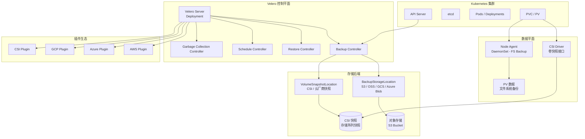

> **生产环境安全提示**
>
> 本文档包含可直接执行的运维命令。执行前请确认：当前目标集群与 Namespace 是否正确；是否具备足够的 RBAC 权限；是否已在非生产环境验证。命令风险等级标注：🔴 高风险（可能造成数据丢失或服务中断）、🟡 中风险（会修改集群状态，但通常可回滚）、🟢 低风险/只读（信息收集，无副作用）。


# Velero 企业级备份恢复实践指南

> **作者**: [[Kubernetes|Kubernetes]] 灾备架构师 | **版本**: v2.0 | **更新时间**: 2026-05-18
> **适用版本**: Velero v1.15.0 | **难度**: ⭐⭐⭐⭐

---

<!-- chunk: 概述 -->## 概述

Velero（前身为 Heptio Ark）是 Kubernetes 生态中最成熟的开源备份与灾难恢复工具，由 VMware Tanzu 团队维护。Velero 能够备份 Kubernetes 集群的所有资源对象（[[Deployments|Deployments]]、Services、[[ConfigMaps|ConfigMaps]]、[[Secrets|Secrets]]、CRDs 等）以及持久卷（PV）数据，支持跨集群迁移和灾难恢复。本文档深入探讨 Velero 在企业级生产环境中的部署、配置、备份策略、恢复流程和最佳实践。

## RPO 与 RTO 定义

Velero 的恢复能力直接决定了企业 Kubernetes 集群的灾备指标。RPO 取决于备份频率（Schedule 配置），RTO 取决于恢复的数据量和网络带宽。通过合理的配置组合，可以实现分钟级 RPO 和小时级 RTO。

```yaml
velero_rpo_rto:
  resource_only_backup:
    rpo: "取决于定时策略（分钟-小时）"
    rto: "秒-分钟级"
    
  csi_snapshot:
    rpo: "取决于快照策略（分钟级）"
    rto: "分钟级（快照恢复）"
    
  fs_backup:
    rpo: "取决于定时策略（小时级）"
    rto: "分钟-小时级（取决于数据量）"
    
  etcd_backup:
    rpo: "取决于备份频率"
    rto: "分钟级（etcd 恢复）"
```

---

<!-- chunk: 架构设计 -->## 架构设计

## Velero 核心架构



## Velero 备份流程详解

Velero 的备份流程是一个精心设计的多步骤过程，确保了数据的一致性和完整性。理解这个流程对于排查备份问题和优化备份性能至关重要。

```yaml
Velero备份执行流程:
  Step_1_资源收集:
    操作: 通过API Server收集所有匹配的资源对象
    过滤: 根据includedNamespaces/excludedNamespaces等过滤
    序列化: 将资源对象序列化为JSON格式
    耗时: 通常秒级完成
  
  Step_2_自定义资源处理:
    操作: 收集CRD和CR实例
    排序: 确保CRD在CR之前创建（恢复时需要）
    耗时: 通常秒级完成
  
  Step_3_CSI快照创建:
    操作: 调用CSI Driver创建VolumeSnapshot
    条件: snapshotVolumes=true 且有支持的CSI Driver
    异步: 快照创建是异步的，Velero等待快照Ready
    耗时: 取决于存储类型（通常秒级到分钟级）
  
  Step_4_Pre_Hook执行:
    操作: 在目标Pod中执行pre hook命令
    示例: pg_dumpall, xtrabackup --backup
    目的: 确保应用数据一致性
    超时: 默认30秒，可配置
  
  Step_5_FS_Backup执行:
    操作: Node Agent使用Kopia备份PV文件
    条件: defaultVolumesToFsBackup=true
    过程: 遍历文件系统，去重压缩上传
    耗时: 取决于数据量（GB级数据通常分钟级）
  
  Step_6_Post_Hook执行:
    操作: 在目标Pod中执行post hook命令
    示例: rm /tmp/backup.sql
    目的: 清理临时文件
  
  Step_7_打包上传:
    操作: 将所有资源JSON和元数据打包为tar.gz
    上传: 上传到BackupStorageLocation（S3等）
    完成: 更新Backup CRD状态为Completed
```

---

<!-- chunk: 核心配置 -->## 核心配置

## Helm 生产级部署

```yaml
# values-velero-production.yaml
configuration:
  backupStorageLocation:
    - name: default
      provider: aws
      bucket: my-cluster-backups
      config:
        region: us-east-1
        s3ForcePathStyle: false
    - name: dr-target
      provider: aws
      bucket: dr-cluster-backups
      config:
        region: us-west-2
        
  volumeSnapshotLocation:
    - name: default
      provider: aws
      config:
        region: us-east-1
        
  features: EnableCSI
  
  defaultVolumesToFsBackup: true
  
  global:
    logLevel: "info"

credentials:
  useSecret: true
  secretContents:
    aws: |
      [default]
      aws_access_key_id = ${AWS_ACCESS_KEY_ID}
      aws_secret_access_key = ${AWS_SECRET_ACCESS_KEY}

initContainers:
  - name: velero-plugin-for-aws
    image: velero/velero-plugin-for-aws:v1.11.0
    imagePullPolicy: IfNotPresent
    volumeMounts:
      - mountPath: /target
        name: plugins
  - name: velero-plugin-for-csi
    image: velero/velero-plugin-for-csi:v0.7.0
    imagePullPolicy: IfNotPresent
    volumeMounts:
      - mountPath: /target
        name: plugins

deployNodeAgent: true
nodeAgent:
  podVolumePath: /var/lib/kubelet/pods
  tolerations:
    - operator: Exists

resources:
  requests:
    cpu: 500m
    memory: 256Mi
  limits:
    cpu: 2000m
    memory: 1Gi

metrics:
  enabled: true
  scrapeInterval: 30s
  serviceMonitor:
    enabled: true
    namespace: monitoring

podAnnotations:
  sidecar.istio.io/inject: "false"

priorityClassName: "system-cluster-critical"
```

> ⚠️ **🟡 中危变更** — 变更集群资源状态，建议先 --dry-run 或 diff 确认
> - `helm upgrade/install`：部署/升级 release

``` bash
# 🟡 中风险：会修改集群/资源状态，执行前请确认目标、影响范围与授权
# 安装命令
helm repo add vmware-tanzu https://vmware-tanzu.github.io/helm-charts
helm install velero vmware-tanzu/velero \
  --namespace velero \
  --create-namespace \
  --values values-velero-production.yaml

# 验证安装
kubectl get pods -n velero
velero version
velero backup-location get
velero snapshot-location get
```
## VolumeSnapshotClass 配置

```yaml
# VolumeSnapshotClass 配置 - AWS EBS
apiVersion: snapshot.storage.k8s.io/v1
kind: VolumeSnapshotClass
metadata:
  name: csi-ebs-snapclass
  labels:
    velero.io/csi-volumesnapshot-class: "true"
driver: ebs.csi.aws.com
deletionPolicy: Retain
parameters:
  encrypted: "true"
---
# VolumeSnapshotClass 配置 - Azure Disk
apiVersion: snapshot.storage.k8s.io/v1
kind: VolumeSnapshotClass
metadata:
  name: csi-azure-snapclass
  labels:
    velero.io/csi-volumesnapshot-class: "true"
driver: disk.csi.azure.com
deletionPolicy: Retain
---
# VolumeSnapshotClass 配置 - GCE PD
apiVersion: snapshot.storage.k8s.io/v1
kind: VolumeSnapshotClass
metadata:
  name: csi-gce-snapclass
  labels:
    velero.io/csi-volumesnapshot-class: "true"
driver: pd.csi.storage.gke.io
deletionPolicy: Retain
```

---

<!-- chunk: 备份策略 -->## 备份策略

## 企业级备份策略设计

企业级 Velero 备份策略需要根据业务的关键程度、数据变更频率和 RPO 要求来设计不同层级的备份计划。以下是一个完整的企业级备份策略配置：

```yaml
# 策略一: 每日生产环境备份（核心业务）
apiVersion: velero.io/v1
kind: Schedule
metadata:
  name: production-daily
  namespace: velero
spec:
  schedule: "0 2 * * *"
  template:
    includedNamespaces:
      - production
      - monitoring
      - ingress-nginx
      - cert-manager
    excludedResources:
      - events
      - podmetrics
      - endpoints
    snapshotVolumes: true
    defaultVolumesToFsBackup: true
    ttl: 168h    # 7 天保留
    storageLocation: default
    volumeSnapshotLocations:
      - default
    metadata:
      labels:
        backup-type: daily
        environment: production
---
# 策略二: 每周全量备份（长期保留）
apiVersion: velero.io/v1
kind: Schedule
metadata:
  name: production-weekly
  namespace: velero
spec:
  schedule: "0 3 * * 0"
  template:
    includedNamespaces:
      - production
    snapshotVolumes: true
    ttl: 2160h   # 90 天保留
    storageLocation: default
    metadata:
      labels:
        backup-type: weekly
---
# 策略三: 数据库高频快照（高 RPO 要求）
apiVersion: velero.io/v1
kind: Schedule
metadata:
  name: database-frequent-snapshot
  namespace: velero
spec:
  schedule: "0 */2 * * *"
  template:
    includedNamespaces:
      - database
    snapshotVolumes: true
    defaultVolumesToFsBackup: false
    ttl: 48h
    hooks:
      resources:
        - name: postgres-quiesce
          includedNamespaces:
            - database
          labelSelector:
            matchLabels:
              app: postgres
          pre:
            - exec:
                command:
                  - /bin/bash
                  - -c
                  - "pg_dumpall -U postgres > /tmp/pg_backup.sql && sync"
                container: postgres
                timeout: 120s
          post:
            - exec:
                command:
                  - /bin/bash
                  - -c
                  - "rm -f /tmp/pg_backup.sql"
                container: postgres
---
# 策略四: 升级前手动备份（永久保留）
apiVersion: velero.io/v1
kind: Backup
metadata:
  name: pre-upgrade-2026-05-18
  namespace: velero
  labels:
    backup-type: pre-upgrade
    permanent: "true"
spec:
  includedNamespaces:
    - production
    - monitoring
    - ingress-nginx
    - cert-manager
    - external-secrets
    - argocd
  snapshotVolumes: true
  defaultVolumesToFsBackup: true
  ttl: 0s    # 永久保留
  storageLocation: default
```

## 备份策略矩阵

| 备份类型 | 频率 | 保留时间 | 范围 | 存储位置 | 适用场景 |
|:---|:---|:---|:---|:---|:---|
| 每日增量 | 每日 02:00 | 7 天 | 生产命名空间 | 本地BSL | 快速回滚近期变更 |
| 每周全量 | 周日 03:00 | 90 天 | 生产命名空间 | 本地BSL | 月度恢复点 |
| CSI 快照 | 每 2 小时 | 48 小时 | 数据库 PV | 本地VSL | 高 RPO 要求数据库 |
| 异地备份 | 每日 04:00 | 30 天 | 全集群 | 远程BSL | 灾备恢复 |
| 升级前 | 手动触发 | 永久 | 全集群 | 本地+远程 | 重大变更前安全基线 |
| etcd 备份 | 每小时 | 7 天 | etcd 数据 | S3 | 集群状态恢复 |

---

<!-- chunk: 恢复流程 -->## 恢复流程

## 单命名空间恢复

``` bash
# 🟢 低风险：只读/信息收集，通常无副作用
# 步骤 1: 列出可用备份
velero backup get

# 步骤 2: 查看备份详情
velero backup describe production-daily-20260518 --details

# 步骤 3: 恢复到新命名空间（演练不覆盖生产）
velero restore create restore-test-$(date +%s) \
  --from-backup production-daily-20260518 \
  --include-namespaces production \
  --namespace-mappings production:production-restore-test \
  --wait

# 步骤 4: 验证恢复结果
kubectl get all -n production-restore-test
kubectl get pvc -n production-restore-test

# 步骤 5: 确认后恢复到生产命名空间
velero restore create production-restore-$(date +%s) \
  --from-backup production-daily-20260518 \
  --include-namespaces production \
  --existing-resource-policy update \
  --wait
```
## 完整集群灾难恢复

``` bash
# 🟢 低风险：只读/信息收集，通常无副作用
#!/bin/bash
# full_cluster_dr_recovery.sh - 完整集群灾难恢复脚本
set -euo pipefail

BACKUP_NAME="${1:?用法: $0 <backup-name>}"
echo "=== 完整集群灾难恢复 ==="
echo "恢复备份: $BACKUP_NAME"

echo "[1/7] 在新集群安装 Velero"
velero install \
  --provider aws \
  --plugins velero/velero-plugin-for-aws:v1.11.0,velero/velero-plugin-for-csi:v0.7.0 \
  --bucket my-cluster-backups \
  --backup-location-config region=us-east-1 \
  --snapshot-location-config region=us-east-1 \
  --secret-file ./credentials-velero \
  --use-node-agent \
  --use-volume-snapshots

echo "[2/7] 等待备份同步"
echo "等待 60 秒让 Velero 同步备份元数据..."
sleep 60
velero backup get
echo "确认能看到备份: $BACKUP_NAME"

echo "[3/7] 执行全集群恢复"
velero restore create full-cluster-restore \
  --from-backup "$BACKUP_NAME" \
  --exclude-namespaces kube-system,kube-public,kube-node-lease,velero \
  --existing-resource-policy update \
  --wait

echo "[4/7] 验证命名空间"
kubectl get namespaces
echo ""

echo "[5/7] 验证所有工作负载"
kubectl get all -A | grep -v kube-system
echo ""

echo "[6/7] 验证 PVC 恢复"
kubectl get pvc -A
echo ""

echo "[7/7] 执行健康检查"
for ns in $(kubectl get ns -o jsonpath='{.items[*].metadata.name}' | grep -v kube-); do
  echo "命名空间: $ns"
  kubectl get pods -n "$ns" --field-selector=status.phase!=Running 2>/dev/null || true
done

echo "=== 集群灾难恢复完成 ==="
```
## 跨集群迁移

``` bash
# 🟢 低风险：只读/信息收集，通常无副作用
# 源集群: 创建迁移备份
velero backup create migrate-app-$(date +%s) \
  --include-namespaces my-application \
  --snapshot-volumes \
  --default-volumes-to-fs-backup \
  --wait

# 目标集群: 安装 Velero 指向同一 BSL
velero install --provider aws --bucket shared-backups ...

# 目标集群: 等待备份元数据同步
velero backup get

# 目标集群: 执行恢复
velero restore create migrate-restore \
  --from-backup migrate-app-xxx \
  --namespace-mappings my-application:my-application-new \
  --wait

# 验证
kubectl get all -n my-application-new
```
---

<!-- chunk: PV 持久卷备份策略 -->## PV 持久卷备份策略

## CSI 快照与文件系统备份对比

| 维度 | CSI 快照 | 文件系统备份 (FS Backup) |
|:---|:---|:---|
| **备份速度** | 秒级（存储级别操作） | 分钟-小时级（文件级别） |
| **一致性** | 崩溃一致性 | 应用一致性（配合Hook） |
| **存储要求** | 需要支持CSI的存储驱动 | 无特殊要求 |
| **跨云迁移** | 不支持（快照是云特定的） | 支持（文件级别备份） |
| **存储成本** | 云快照费用 | S3存储费用 |
| **恢复粒度** | 整个卷 | 可选择性恢复 |
| **适用场景** | 同云快速恢复 | 跨云迁移、应用一致性 |

---

<!-- chunk: 容灾演练方案 -->## 容灾演练方案

```yaml
velero_dr_drill:
  weekly_restore_test:
    type: "单命名空间恢复测试"
    scope: "生产命名空间恢复到测试环境"
    steps:
      - "选择最近成功的备份"
      - "恢复到隔离命名空间"
      - "执行应用健康检查"
      - "验证数据完整性"
      - "清理测试命名空间"
    automation: "CI/CD Pipeline 自动执行"
    
  monthly_cross_cluster:
    type: "跨集群迁移测试"
    scope: "应用迁移到灾备集群"
    steps:
      - "在灾备集群安装 Velero"
      - "同步备份元数据"
      - "执行恢复"
      - "验证应用功能"
      - "测量 RTO"
      
  quarterly_full_disaster:
    type: "完整灾难恢复演练"
    scope: "模拟源集群完全不可用"
    steps:
      - "创建灾备集群"
      - "安装 Velero 指向同一 BSL"
      - "执行全集群恢复"
      - "验证所有服务"
      - "切换 DNS 流量"
      - "运行业务 2 小时"
```

## 灾备演练自动化脚本

> ⚠️ **🔴 灾难性操作** — 含不可逆命令，执行前必须满足变更窗口+双人复核+事前备份+回滚方案
> - `kubectl delete namespace`：永久删除命名空间及全部资源，不可恢复

> **🔴 高风险操作警告**
>
> 下方命令属于不可逆或高影响操作，执行前请确认：
> - 已备份关键数据与配置
> - 处于批准的变更窗口期
> - 已获得相关责任人授权
> - 已准备回滚或恢复方案
> - 目标集群、Namespace、节点/资源名称正确无误

``` bash
# 🔴 高风险：可能造成数据丢失或服务中断，执行前需备份、变更审批与回滚方案
#!/bin/bash
# velero_dr_drill.sh - Velero 灾备演练自动化脚本
set -euo pipefail

DR_TYPE="${1:-weekly}"
NAMESPACE="production"
RESTORE_NS="dr-test-$(date +%Y%m%d)"

echo "=== Velero 灾备演练 ==="
echo "演练类型: $DR_TYPE"
echo "测试命名空间: $RESTORE_NS"

case "$DR_TYPE" in
  weekly)
    echo "[1] 获取最近的每日备份..."
    BACKUP=$(velero backup get --sort-by=.metadata.creationTimestamp \
      -o json | jq -r '[.items[] | select(.status.phase=="Completed") | .metadata.name] | last')
    echo "使用备份: $BACKUP"
    
    echo "[2] 创建恢复测试..."
    velero restore create "dr-test-$(date +%s)" \
      --from-backup "$BACKUP" \
      --include-namespaces "$NAMESPACE" \
      --namespace-mappings "$NAMESPACE:$RESTORE_NS" \
      --wait
    
    echo "[3] 验证恢复结果..."
    POD_COUNT=$(kubectl get pods -n "$RESTORE_NS" --field-selector=status.phase=Running --no-headers | wc -l)
    PVC_COUNT=$(kubectl get pvc -n "$RESTORE_NS" --no-headers | wc -l)
    echo "运行中的 Pod: $POD_COUNT"
    echo "已恢复的 PVC: $PVC_COUNT"
    
    echo "[4] 执行健康检查..."
    kubectl get pods -n "$RESTORE_NS" -o wide
    
    echo "[5] 清理测试命名空间..."
    read -p "确认清理测试命名空间 $RESTORE_NS? (y/N) " confirm
    if [ "$confirm" = "y" ]; then
      kubectl delete namespace "$RESTORE_NS"  # ⚠️ 不可逆：永久删除命名空间及全部资源
      echo "清理完成"
    fi
    ;;
    
  monthly)
    echo "执行月度跨集群演练..."
    echo "[1] 在灾备集群检查 Velero 状态..."
    kubectl config use-context dr-cluster
    velero backup get | head -5
    
    echo "[2] 执行恢复..."
    BACKUP=$(velero backup get --sort-by=.metadata.creationTimestamp \
      -o json | jq -r '[.items[] | select(.status.phase=="Completed") | .metadata.name] | last')
    START_TIME=$(date +%s)
    
    velero restore create "monthly-dr-$(date +%s)" \
      --from-backup "$BACKUP" \
      --include-namespaces "$NAMESPACE" \
      --wait
    
    END_TIME=$(date +%s)
    RTO=$((END_TIME - START_TIME))
    echo "恢复完成, RTO: ${RTO} 秒"
    
    echo "[3] 验证服务..."
    kubectl get pods -n "$NAMESPACE" -o wide
    ;;
esac

echo "=== 演练完成 ==="
```
---

<!-- chunk: 监控告警 -->## 监控告警

## Prometheus 告警规则

```yaml
apiVersion: v1
kind: ConfigMap
metadata:
  name: velero-alerts
  namespace: monitoring
data:
  velero-alerts.yml: |
    groups:
      - name: velero.backup
        rules:
          - alert: VeleroBackupFailed
            expr: increase(velero_backup_failure_total[24h]) > 0
            for: 5m
            labels:
              severity: critical
            annotations:
              summary: "Velero 备份 {{ $labels.schedule_name }} 失败"
              runbook: "https://wiki.company.com/runbooks/velero-backup-failed"
              
          - alert: VeleroBackupTooOld
            expr: time() - velero_backup_last_successful_timestamp > 86400
            for: 1h
            labels:
              severity: warning
            annotations:
              summary: "Velero 备份超过 24 小时未成功"
              
          - alert: VeleroRestoreFailed
            expr: increase(velero_restore_failure_total[1h]) > 0
            for: 5m
            labels:
              severity: critical
            annotations:
              summary: "Velero 恢复 {{ $labels.restore_name }} 失败"
              
          - alert: VeleroBSLUnavailable
            expr: velero_backup_storage_location_status == 0
            for: 5m
            labels:
              severity: critical
            annotations:
              summary: "Velero 备份存储位置不可用"
              
          - alert: VeleroScheduleNotRunning
            expr: time() - velero_schedule_last_execution_timestamp > 86400
            for: 2h
            labels:
              severity: warning
            annotations:
              summary: "Velero 定时计划 {{ $labels.schedule_name }} 超过 24 小时未执行"
```

---

<!-- chunk: etcd 备份与恢复 -->## etcd 备份与恢复

## etcd 定期自动备份

etcd 是 Kubernetes 集群的大脑，所有集群状态都存储在 etcd 中。Velero 备份的是通过 API Server 暴露的资源对象，但 etcd 本身包含更底层的集群状态。因此，etcd 备份是 Kubernetes 灾备体系中不可或缺的一环，必须独立配置。

```yaml
# etcd 自动备份 CronJob
apiVersion: batch/v1
kind: CronJob
metadata:
  name: etcd-backup
  namespace: kube-system
spec:
  schedule: "0 */4 * * *"
  concurrencyPolicy: Forbid
  successfulJobsHistoryLimit: 3
  failedJobsHistoryLimit: 3
  jobTemplate:
    spec:
      template:
        spec:
          nodeSelector:
            node-role.kubernetes.io/control-plane: ""
          tolerations:
            - key: node-role.kubernetes.io/control-plane
              effect: NoSchedule
          containers:
            - name: etcd-backup
              image: bitnami/etcd:3.5
              command:
                - /bin/bash
                - -c
                - |
                  ETCDCTL_API=3
                  ETCDCTL_CACERT=/etc/kubernetes/pki/etcd/ca.crt
                  ETCDCTL_CERT=/etc/kubernetes/pki/etcd/healthcheck-client.crt
                  ETCDCTL_KEY=/etc/kubernetes/pki/etcd/healthcheck-client.key
                  ENDPOINTS=https://127.0.0.1:2379
                  
                  TIMESTAMP=$(date +%Y%m%d_%H%M%S)
                  BACKUP_DIR="/backup/etcd/${TIMESTAMP}"
                  mkdir -p ${BACKUP_DIR}
                  
                  etcdctl snapshot save ${BACKUP_DIR}/snapshot.db \
                    --endpoints=${ENDPOINTS} \
                    --cacert=${ETCDCTL_CACERT} \
                    --cert=${ETCDCTL_CERT} \
                    --key=${ETCDCTL_KEY}
                    
                  etcdctl snapshot status ${BACKUP_DIR}/snapshot.db --write-table
                  
                  aws s3 cp ${BACKUP_DIR}/snapshot.db \
                    s3://k8s-etcd-backups/$(hostname)/${TIMESTAMP}/snapshot.db
                    
                  find /backup/etcd -type d -mtime +3 -exec rm -rf {} +
              volumeMounts:
                - name: etcd-certs
                  mountPath: /etc/kubernetes/pki/etcd
                  readOnly: true
                - name: backup-dir
                  mountPath: /backup
          volumes:
            - name: etcd-certs
              hostPath:
                path: /etc/kubernetes/pki/etcd
            - name: backup-dir
              hostPath:
                path: /var/lib/etcd-backup
                type: DirectoryOrCreate
          restartPolicy: OnFailure
```

## etcd 恢复操作

> ⚠️ **🔴 灾难性操作** — 含不可逆命令，执行前必须满足变更窗口+双人复核+事前备份+回滚方案
> - `etcdctl snapshot restore`：用快照覆盖 etcd 数据目录，集群状态强制回退
> - `chmod/chown -R`：递归改权限，误操作破坏系统文件访问
> - `systemctl stop/restart`：停止/重启系统服务，影响节点上所有容器

``` bash
# 🟢 低风险：只读/信息收集，通常无副作用
#!/bin/bash
# etcd 灾难恢复脚本
set -euo pipefail

BACKUP_FILE="${1:?用法: $0 <snapshot.db>}"
echo "=== etcd 恢复开始 ==="
echo "快照文件: $BACKUP_FILE"

echo "[1/6] 停止控制平面组件..."
systemctl stop kube-apiserver kube-controller-manager kube-scheduler etcd

echo "[2/6] 备份当前 etcd 数据..."
mv /var/lib/etcd /var/lib/etcd.corrupted.$(date +%s)

echo "[3/6] 恢复 etcd 快照..."
ETCDCTL_API=3 etcdctl snapshot restore "$BACKUP_FILE" \
    --name=$(hostname) \
    --initial-cluster="etcd-01=https://10.0.0.1:2380,etcd-02=https://10.0.0.2:2380,etcd-03=https://10.0.0.3:2380" \
    --initial-advertise-peer-urls="https://$(hostname -I | awk '{print $1}'):2380" \
    --data-dir=/var/lib/etcd

echo "[4/6] 修复权限..."
chown -R etcd:etcd /var/lib/etcd
chmod 700 /var/lib/etcd

echo "[5/6] 启动 etcd..."
systemctl start etcd
sleep 15
ETCDCTL_API=3 etcdctl endpoint health --cluster

echo "[6/6] 启动控制平面..."
systemctl start kube-apiserver
sleep 10
systemctl start kube-controller-manager kube-scheduler

echo "=== etcd 恢复完成 ==="
kubectl get nodes
```
---

<!-- chunk: 最佳实践 -->## 最佳实践

## Velero 生产部署检查清单

```yaml
备份策略:
  - 配置每日定时备份（Schedule CRD）
  - 配置每周全量备份（长期保留）
  - 配置数据库高频快照（高RPO要求）
  - 设置合理的TTL避免存储无限增长
  - 配置异地BSL实现异地备份
  - 升级前创建手动备份

存储配置:
  - 使用CSI快照加速PV备份
  - 同时启用FS Backup作为备用
  - 配置VolumeSnapshotClass标签
  - 验证存储驱动支持快照
  - 监控备份存储使用量

应用一致性:
  - 为数据库配置Pre/Post Hook
  - Hook中使用pg_dump/xtrabackup等工具
  - 设置合理的Hook超时时间
  - 验证Hook执行结果

恢复验证:
  - 每周自动恢复测试（CI/CD）
  - 每月跨集群迁移测试
  - 每季度完整灾难恢复演练
  - 记录RTO指标并持续优化

监控告警:
  - 配置备份失败告警（Critical）
  - 配置备份过期告警（Warning）
  - 配置BSL不可用告警（Critical）
  - 配置定时计划未执行告警（Warning）
```

---

<!-- chunk: 故障排查 -->## 故障排查

## 常见问题诊断

``` bash
# 🟢 低风险：只读/信息收集，通常无副作用
#!/bin/bash
# Velero 故障排查脚本

echo "=== Velero 诊断 ==="

echo "[1] Velero Pod 状态"
kubectl get pods -n velero -o wide

echo "[2] 备份存储位置"
velero backup-location get

echo "[3] 最近备份"
velero backup get --sort-by=.metadata.creationTimestamp | tail -10

echo "[4] 失败备份详情"
FAILED_BACKUP=$(velero backup get --output json | jq -r '[.items[] | select(.status.phase=="Failed") | .metadata.name] | .[0]')
if [ -n "$FAILED_BACKUP" ]; then
    velero backup describe $FAILED_BACKUP --details
    kubectl logs -n velero deployment/velero | grep -A 10 "$FAILED_BACKUP"
fi

echo "[5] Node Agent 状态"
kubectl get pods -n velero -l name=velero -o wide

echo "[6] 存储桶访问测试"
aws s3 ls s3://my-cluster-backups/ --region us-east-1 | tail -5

echo "[7] CSI 快照状态"
kubectl get volumesnapshots -A

echo "[8] 最近恢复"
velero restore get --sort-by=.metadata.creationTimestamp | tail -5
```
## 故障排查手册

| 问题现象 | 可能原因 | 排查步骤 | 解决方案 |
|:---|:---|:---|:---|
| 备份卡在 InProgress | Node Agent 未运行 | `kubectl get pods -n velero` | 重启 Node Agent DaemonSet |
| CSI 快照失败 | CSI Driver 不支持快照 | 检查 VolumeSnapshotClass | 安装/升级 CSI Driver |
| BSL 不可用 | S3 凭证过期 | `velero backup-location get` | 更新 Secret 中的凭证 |
| 恢复后 PV 缺失 | 快照未正确创建 | 检查 VSL 和 VolumeSnapshot | 确保存储支持快照 |
| 恢复超时 | 数据量过大 | 查看恢复日志 | 增加 `--timeout` 参数 |
| 定时计划不执行 | Cron 表达式错误 | `velero schedule describe` | 修正 Cron 表达式 |
| Hook 执行失败 | 命令错误或超时 | 查看 Pod 日志 | 修正 Hook 命令和超时 |
| 资源恢复冲突 | 资源已存在 | 查看 Restore 日志 | 使用 `--existing-resource-policy update` |
| FS Backup 慢 | 数据量大/网络慢 | 查看 Node Agent 日志 | 优化网络或增加并行度 |
| 备份体积过大 | 包含非必要资源 | `velero backup describe` | 配置 excludedResources |

---

**文档版本**: v2.0  
**最后更新**: 2026-05-18  
**适用版本**: Velero v1.15.0+

---

<!-- chunk: Obsidian 相关文档 -->## Obsidian 相关文档

- domain-30-disaster-recovery-business-continuity MOC
- [[可靠性/README.md|Domain 09: 企业级灾备与业务连续性 (Enterprise Disaster Recovery & Busin...]]
- Domain-30 灾备与业务连续性 — 开源项目索引
- VMware vSphere 企业级灾备与业务连续性
- Veeam Backup & Replication 企业级备份恢复解决方案
- 企业级容灾架构与混沌工程深度实践
- Commvault 企业级灾备与业务连续性深度实践
- Rubrik 企业级灾备与业务连续性深度实践
- Kubernetes 备份与恢复深度实践
- 混沌工程平台实践：LitmusChaos 与 Chaos Mesh
- 应用级灾备架构：多区域部署与故障转移

## See Also

- 08-chaos-engineering-platforms
- 09-application-level-disaster-recovery
- 01-vmware-vsphere-enterprise-dr
- 02-veeam-enterprise-backup

## Related

- [[生态参考/topic-index/backup-dr-index.md|Backup & DR 备份与灾备知识图谱索引]]


<!-- risk-assessed -->
