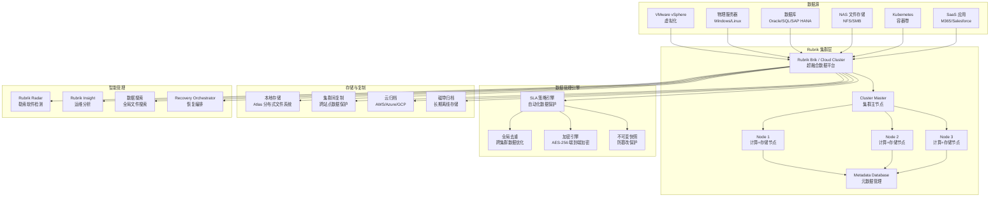

> **生产环境安全提示**
>
> 本文档包含可直接执行的运维命令。执行前请确认：当前目标集群与 Namespace 是否正确；是否具备足够的 RBAC 权限；是否已在非生产环境验证。命令风险等级标注：🔴 高风险（可能造成数据丢失或服务中断）、🟡 中风险（会修改集群状态，但通常可回滚）、🟢 低风险/只读（信息收集，无副作用）。


# Rubrik 企业级灾备与业务连续性深度实践

> **作者**: 灾备架构师 | **版本**: v2.0 | **更新时间**: 2026-05-18
> **场景**: 企业级云数据管理和灾难恢复解决方案 | **复杂度**: ⭐⭐⭐⭐⭐

---

<!-- chunk: 概述 -->## 概述

Rubrik 是新一代云数据管理平台的代表，以零信任数据安全（Zero Trust Data Security）为核心理念，提供从备份恢复、灾难恢复、勒索软件防护到数据治理的一体化解决方案。与传统备份软件不同，Rubrik 采用超融合硬件（Brik）或纯软件（Rubrik Cloud Cluster）的部署方式，内置分布式文件系统、全局去重、不可变快照和基于 SLA 的自动化策略引擎，大幅简化了企业数据保护的复杂度。本文档基于大规模混合云环境经验，全面探讨 Rubrik 的企业级部署、数据保护和灾备实践。

## RPO 与 RTO 定义

- **RPO（Recovery Point Objective）**：Rubrik 通过 SLA 策略驱动备份频率，支持从每小时到每天不等的备份周期，配合 NearSync 技术可实现最短 10 秒的 RPO。对于关键数据库，Live Mount 可提供接近零的 RPO 恢复能力。
- **RTO（Recovery Time Objective）**：Rubrik 的即时恢复（Instant Recovery / Live Mount）能力是其核心竞争优势——虚拟机可直接从备份存储运行，无需等待数据拷贝完成，RTO 可缩短至 1-5 分钟。文件级恢复可在秒级完成。

```yaml
rubrik_rpo_rto:
  sla_driven_backup:
    rpo: "1小时 - 24小时（根据 SLA 策略）"
    rto: "1-5 分钟（Live Mount）"
    
  nearsync:
    rpo: "10 秒"
    rto: "1-5 分钟"
    
  archival:
    rpo: "每日/每周"
    rto: "小时级（需要从归档恢复）"
    
  replication:
    rpo: "取决于源端 SLA"
    rto: "5-15 分钟（故障切换）"
```

---

<!-- chunk: 架构设计 -->## 架构设计

## Rubrik 核心组件架构



## 企业级部署架构

```yaml
rubrik_enterprise:
  cluster:
    name: "rubrik-prod-cluster"
    type: "Rubrik Cloud Cluster"  # 或 physical Brik
    version: "9.2"
    nodes:
      - hostname: "rubrik-node-01"
        ip: "192.168.10.101"
        role: "cluster_master"
        cpu: 24
        memory_gb: 128
        storage_tb: 100
        interfaces:
          - name: "management"
            ip: "192.168.10.101"
            subnet: "255.255.255.0"
          - name: "backup"
            ip: "10.0.10.101"
            mtu: 9000
            
      - hostname: "rubrik-node-02"
        ip: "192.168.10.102"
        storage_tb: 100
        
      - hostname: "rubrik-node-03"
        ip: "192.168.10.103"
        storage_tb: 100
        
    settings:
      replication_factor: 2
      erasure_coding: "8+2"
      encryption_at_rest: "AES-256"
      encryption_in_transit: "TLS 1.3"
      timezone: "Asia/Shanghai"
      
  replication_targets:
    - name: "DR-Cluster"
      type: "Rubrik Cluster"
      ip: "192.168.20.100"
      replication_mode: "incremental_forever"
      bandwidth_throttle_mbps: 500
      
  cloud_archival:
    - name: "AWS-S3-Archive"
      provider: "AWS"
      bucket: "company-rubrik-archive"
      region: "us-west-2"
      storage_class: "S3 Glacier Deep Archive"
      immutability: "Compliance"
      lock_period_days: 365
```

---

<!-- chunk: 核心配置 -->## 核心配置

## SLA 策略配置

```python
#!/usr/bin/env python3
"""
Rubrik SLA 策略自动化管理
"""

import json
import requests
from typing import Dict, List, Any

class RubrikSLAOrchestrator:
    def __init__(self, cluster_ip: str, api_token: str):
        self.cluster_ip = cluster_ip
        self.api_token = api_token
        self.base_url = f"https://{cluster_ip}/api/internal"
        self.headers = {
            "Authorization": f"Bearer {api_token}",
            "Content-Type": "application/json"
        }
    
    def create_sla(self, config: Dict[str, Any]) -> Dict:
        payload = {
            "name": config["name"],
            "frequencies": config["frequencies"],
            "localRetention": config["local_retention"],
            "archivalSpec": config.get("archival"),
            "replicationSpec": config.get("replication"),
            "advancedConfig": {
                "indexed": True,
                "cloudStorageOptimization": True
            }
        }
        
        resp = requests.post(
            f"{self.base_url}/sla_domain",
            headers=self.headers,
            json=payload,
            verify=False
        )
        return resp.json()
    
    def assign_sla(self, object_ids: List[str], sla_id: str) -> Dict:
        payload = {
            "managedIds": object_ids,
            "slaDomainId": sla_id
        }
        resp = requests.post(
            f"{self.base_url}/batch/assign/sla",
            headers=self.headers,
            json=payload,
            verify=False
        )
        return resp.json()

# SLA 策略模板
sla_templates = {
    "Gold-Critical": {
        "name": "Gold-Critical",
        "frequencies": {
            "hourly": {"frequency": 4, "retention": 48},
            "daily": {"frequency": 1, "retention": 90},
            "monthly": {"frequency": 1, "retention": 365}
        },
        "local_retention": "14 天",
        "replication": {
            "target_cluster": "DR-Cluster",
            "retention": "30 天"
        },
        "archival": {
            "target": "AWS-S3-Archive",
            "retention": "7 年",
            "immutability": "Compliance"
        }
    },
    "Silver-Important": {
        "name": "Silver-Important",
        "frequencies": {
            "daily": {"frequency": 1, "retention": 30},
            "monthly": {"frequency": 1, "retention": 180}
        },
        "local_retention": "7 天"
    },
    "Bronze-Standard": {
        "name": "Bronze-Standard",
        "frequencies": {
            "daily": {"frequency": 1, "retention": 7},
            "weekly": {"frequency": 1, "retention": 30}
        },
        "local_retention": "7 天"
    }
}
```

## 勒索软件防护配置

```yaml
# Rubrik Radar 勒索软件防护配置
ransomware_protection:
  radar:
    anomaly_detection:
      enabled: true
      sensitivity: "high"
      monitoring_scope: "all_protected_objects"
      
    indicators_of_compromise:
      - "异常文件加密行为（大量文件短时间内被修改）"
      - "可疑文件扩展名（.encrypted, .locked, .crypt）"
      - "异常数据删除模式"
      - "已知勒索软件文件签名"
      
    response_actions:
      automatic_quarantine: true
      notification_channels:
        - type: "email"
          recipients: ["security@company.com", "ciso@company.com"]
        - type: "webhook"
          url: "https://soar.company.com/webhook/rubrik-radar"
        - type: "slack"
          channel: "#security-alerts"
          
  immutable_backups:
    enabled: true
    lock_mode: "Compliance"     # Compliance / Governance
    minimum_lock_days: 30
    
  data_recovery:
    strategy: "从最近的干净恢复点恢复"
    validation: "恢复前自动验证数据完整性"
    test_environment: "隔离恢复环境验证"
```

---

<!-- chunk: 备份策略 -->## 备份策略

## 分层数据保护策略

```yaml
# Rubrik 分层数据保护策略
data_protection_tiers:
  tier_1_gold:
    description: "核心生产系统"
    sla: "Gold-Critical"
    protection:
      - "每 4 小时快照"
      - "实时复制到灾备集群"
      - "云归档 7 年（不可变）"
      - "Radar 勒索软件监控"
    targets:
      rpo: "4 小时"
      rto: "5 分钟（Live Mount）"
    systems: ["ERP", "CRM", "支付网关"]
    
  tier_2_silver:
    description: "重要业务系统"
    sla: "Silver-Important"
    protection:
      - "每日快照"
      - "本地保留 30 天"
      - "可选云归档"
    targets:
      rpo: "24 小时"
      rto: "15 分钟"
    systems: ["OA", "邮件", "文件服务器"]
    
  tier_3_bronze:
    description: "一般系统"
    sla: "Bronze-Standard"
    protection:
      - "每日快照"
      - "本地保留 7 天"
    targets:
      rpo: "24 小时"
      rto: "1 小时"
    systems: ["开发环境", "测试环境"]
```

---

<!-- chunk: 恢复流程 -->## 恢复流程

## Live Mount 即时恢复

```python
# Rubrik Live Mount 恢复脚本
class RubrikRecovery:
    def __init__(self, cluster_ip: str, api_token: str):
        self.cluster_ip = cluster_ip
        self.api_token = api_token
        
    def live_mount_vm(self, vm_name: str, snapshot_id: str, 
                      mount_name: str = None, power_on: bool = True) -> Dict:
        """即时挂载虚拟机从备份快照"""
        if not mount_name:
            mount_name = f"{vm_name}-recovery"
            
        payload = {
            "sourceSnapshotId": snapshot_id,
            "vmName": mount_name,
            "powerOn": power_on,
            "networkConfig": {
                "networkName": "Recovery-Network",
                "ipMode": "DHCP"
            }
        }
        
        resp = requests.post(
            f"https://{self.cluster_ip}/api/internal/vm/snapshot/{snapshot_id}/mount",
            headers=self.headers,
            json=payload,
            verify=False
        )
        return resp.json()
    
    def file_recovery(self, vm_name: str, file_path: str, 
                     snapshot_id: str, dest_path: str) -> Dict:
        """文件级恢复"""
        payload = {
            "sourceSnapshotId": snapshot_id,
            "filePath": file_path,
            "destinationPath": dest_path,
            "overwrite": True
        }
        
        resp = requests.post(
            f"https://{self.cluster_ip}/api/internal/vm/snapshot/{snapshot_id}/file",
            headers=self.headers,
            json=payload,
            verify=False
        )
        return resp.json()
```

## 灾难恢复操作手册

```yaml
# Rubrik 灾难恢复操作手册
disaster_recovery_runbook:
  scenario_1_single_vm_failure:
    trigger: "单个虚拟机损坏或数据丢失"
    rto_target: "5 分钟"
    steps:
      - step: 1
        action: "登录 Rubrik Web 界面"
        duration: "< 1 分钟"
      - step: 2
        action: "导航到虚拟机恢复页面"
        duration: "< 1 分钟"
      - step: 3
        action: "选择最新干净恢复点"
        duration: "1 分钟"
      - step: 4
        action: "执行 Live Mount 即时挂载"
        duration: "1-3 分钟"
      - step: 5
        action: "验证恢复的虚拟机功能"
        duration: "2 分钟"
      - step: 6
        action: "确信后执行快速故障切换"
        duration: "1 分钟"
        
  scenario_2_ransomware:
    trigger: "勒索软件攻击检测"
    rto_target: "30 分钟"
    steps:
      - step: 1
        action: "Rubrik Radar 自动检测并告警"
        duration: "自动"
      - step: 2
        action: "安全团队确认感染范围"
        duration: "5 分钟"
      - step: 3
        action: "使用 Radar 找到最近的干净恢复点"
        duration: "5 分钟"
      - step: 4
        action: "在隔离网络中恢复受影响虚拟机"
        duration: "10 分钟"
      - step: 5
        action: "验证恢复数据无恶意软件"
        duration: "10 分钟"
      - step: 6
        action: "切换生产流量到恢复后的虚拟机"
        duration: "5 分钟"
        
  scenario_3_site_failure:
    trigger: "主站点完全不可用"
    rto_target: "1-2 小时"
    steps:
      - step: 1
        action: "确认主站点不可恢复"
        duration: "15 分钟"
      - step: 2
        action: "访问灾备集群 Rubrik 界面"
        duration: "5 分钟"
      - step: 3
        action: "从复制副本批量恢复关键虚拟机"
        duration: "30-60 分钟"
      - step: 4
        action: "验证所有服务正常"
        duration: "15 分钟"
      - step: 5
        action: "更新 DNS 和负载均衡器"
        duration: "10 分钟"
```

---

<!-- chunk: 容灾演练方案 -->## 容灾演练方案

```yaml
rubrik_dr_drill:
  monthly_recovery_test:
    type: "自动恢复验证"
    scope: "随机 3-5 个虚拟机"
    steps:
      - "自动执行 Live Mount 到测试网络"
      - "执行应用健康检查"
      - "自动清理测试挂载"
    automation: "Rubrik API + 自动化脚本"
    
  quarterly_site_test:
    type: "灾备站点验证"
    scope: "灾备集群数据完整性"
    steps:
      - "验证复制数据完整性"
      - "从复制副本恢复虚拟机到隔离环境"
      - "执行功能测试"
      - "测量 RTO 实际值"
      
  annual_game_day:
    type: "年度全量演练"
    scope: "完整站点故障切换"
    steps:
      - "模拟主站点问题"
      - "从灾备集群恢复全部关键系统"
      - "灾备站点运行业务 4 小时"
      - "执行问题回切"
      - "全面验证和报告"
```

---

<!-- chunk: 监控告警 -->## 监控告警

```yaml
rubrik_monitoring:
  cluster_health:
    - metric: "node_status"
      target: "所有节点在线"
      alert: "任何节点离线"
      
    - metric: "storage_capacity_percent"
      warning: "> 80%"
      critical: "> 90%"
      
  backup_compliance:
    - metric: "sla_compliance_rate"
      target: ">= 99.9%"
      
    - metric: "missed_snapshots"
      alert: "任何未完成的快照"
      
  security:
    - metric: "radar_anomalies"
      alert: "检测到任何异常"
      severity: "critical"
      
  replication:
    - metric: "replication_lag"
      warning: "> 4 小时"
      critical: "> 24 小时"
```

---

<!-- chunk: 最佳实践 -->## 最佳实践

1. **SLA 驱动**：使用 Rubrik 的 SLA 策略自动管理备份频率和保留，避免手动配置每个虚拟机
2. **不可变存储**：所有备份数据默认不可变，配合 Object Lock 实现勒索软件防护
3. **集群间复制**：配置至少一个远程复制目标，确保跨站点数据保护
4. **Radar 监控**：启用勒索软件异常检测，实现分钟级威胁发现
5. **定期 Live Mount 测试**：每月从备份恢复虚拟机到隔离环境，验证数据可恢复性

---

<!-- chunk: 故障排查 -->## 故障排查

## 常见问题诊断

```bash
#!/bin/bash
# Rubrik 故障排查脚本

echo "=== Rubrik 集群诊断 ==="

# 1. 集群状态
echo "[1] 集群状态"
curl -sk -H "Authorization: Bearer $RUBRIK_TOKEN" \
  "https://rubrik.company.com/api/internal/cluster/me" | jq .

# 2. 节点状态
echo "[2] 节点状态"
curl -sk -H "Authorization: Bearer $RUBRIK_TOKEN" \
  "https://rubrik.company.com/api/internal/node" | jq '.[].status'

# 3. 存储容量
echo "[3] 存储容量"
curl -sk -H "Authorization: Bearer $RUBRIK_TOKEN" \
  "https://rubrik.company.com/api/internal/stats" | jq '.storage'

# 4. 失败任务
echo "[4] 最近失败任务"
curl -sk -H "Authorization: Bearer $RUBRIK_TOKEN" \
  "https://rubrik.company.com/api/internal/job?status=FAILED&limit=10" | jq .

# 5. SLA 合规性
echo "[5] SLA 合规性"
curl -sk -H "Authorization: Bearer $RUBRIK_TOKEN" \
  "https://rubrik.company.com/api/internal/sla_domain" | jq '.[] | {name, compliance}'
```

## 故障排查手册

| 问题现象 | 可能原因 | 排查步骤 | 解决方案 |
|:---|:---|:---|:---|
| 快照失败 | vCenter 连接中断 | 检查 vCenter 凭证和网络 | 重新配置 vCenter 连接 |
| Live Mount 超时 | 数据存储空间不足 | 检查目标数据存储容量 | 清理或扩展数据存储 |
| 复制延迟 | 网络带宽不足 | 检查站点间带宽利用率 | 调整带宽限制或优化窗口 |
| SLA 不合规 | 备份窗口不足 | 检查并发任务数和性能 | 增加节点或调整 SLA 频率 |
| 节点离线 | 硬件问题 | 检查节点网络和电源 | 联系硬件支持 |
| Radar 误报 | 灵敏度过高 | 分析异常文件模式 | 调整检测灵敏度 |

---

<!-- chunk: 性能优化与容量规划 -->## 性能优化与容量规划

## Rubrik 集群性能调优

Rubrik 集群的性能直接影响备份和恢复的效率。在大规模企业环境中，需要从网络、存储、并发任务和资源分配四个维度进行系统性优化。

**网络优化**是 Rubrik 性能调优的第一步。备份网络应与管理网络物理隔离，使用独立的 10Gbps 或更高带宽链路。启用 Jumbo Frame（MTU 9000）可以显著减少网络传输中的协议开销，提升大数据块传输效率。对于跨站点复制，建议使用专线连接并启用 WAN 优化。

```yaml
# Rubrik 网络性能优化配置
network_optimization:
  backup_network:
    interface: "backup"
    mtu: 9000
    speed: "10Gbps"
    isolation: true
    
  cross_site_replication:
    bandwidth_limit_mbps: 500
    compression: "lz4"
    deduplication: "global"
    encryption: "AES-256"
    
  load_balancing:
    method: "round_robin"
    health_check_interval: "5s"
    failover_threshold: 3
```

**存储优化**方面，Rubrik 的 Atlas 分布式文件系统内置了全局去重和压缩功能。去重比通常可以达到 10:1 到 30:1，具体取决于数据类型。数据库备份的去重比最高（因为增量变化小），而媒体文件（图片、视频）的去重比较低。建议根据数据类型合理分配存储空间，并定期审查去重效率。

**并发任务管理**是另一个关键优化点。每个 Rubrik 节点可以同时处理的备份任务数是有限的。建议按照以下公式计算最大并发数：节点数 × 每节点最大并发 = 集群最大并发。超过这个限制会导致备份排队，延长备份窗口。

```python
# Rubrik 容量规划计算器
class RubrikCapacityPlanner:
    def __init__(self):
        self.nodes = 0
        self.raw_capacity_tb = 0
        self.daily_change_gb = 0
        self.dedup_ratio = 15.0
        self.compression_ratio = 2.0
        self.retention_days = 30
        
    def calculate_effective_capacity(self):
        effective = self.raw_capacity_tb * self.dedup_ratio * self.compression_ratio
        return effective
    
    def calculate_daily_ingest(self):
        daily_ingest_tb = (self.daily_change_gb / 1024) / self.dedup_ratio
        return daily_ingest_tb
    
    def calculate_retention_requirement(self):
        daily = self.calculate_daily_ingest()
        total = daily * self.retention_days
        return total
    
    def is_capacity_sufficient(self):
        effective = self.calculate_effective_capacity()
        required = self.calculate_retention_requirement()
        buffer = effective * 0.2
        return (effective - required) > buffer
    
    def generate_report(self):
        return {
            "raw_capacity_tb": self.raw_capacity_tb,
            "effective_capacity_tb": round(self.calculate_effective_capacity(), 2),
            "daily_ingest_tb": round(self.calculate_daily_ingest(), 4),
            "retention_requirement_tb": round(self.calculate_retention_requirement(), 2),
            "capacity_sufficient": self.is_capacity_sufficient(),
            "recommended_action": "扩展存储" if not self.is_capacity_sufficient() else "容量充足"
        }
```

## 备份窗口优化

在大规模环境中，备份窗口是稀缺资源。以下策略可以帮助优化备份窗口的使用：

1. **错峰调度**：将不同优先级的备份分散到不同时间段执行。关键系统优先备份（22:00-02:00），一般系统延后（02:00-06:00）。
2. **增量优先**：使用 Rubrik 的 Incremental Forever 技术，首次全量后仅备份变化数据，大幅减少后续备份时间。
3. **并行执行**：利用 Rubrik 集群的分布式架构，多个节点并行处理不同虚拟机的备份。
4. **自适应带宽**：在业务高峰期自动降低备份带宽占用，非高峰期全速备份。

```yaml
# 备份窗口优化策略
backup_window_optimization:
  scheduling:
    tier_1_critical:
      window: "22:00 - 02:00"
      priority: "high"
      concurrency: "max"
      
    tier_2_important:
      window: "02:00 - 05:00"
      priority: "medium"
      concurrency: "medium"
      
    tier_3_standard:
      window: "05:00 - 08:00"
      priority: "low"
      concurrency: "low"
      
  bandwidth_adaptation:
    business_hours:
      start: "08:00"
      end: "20:00"
      max_bandwidth_mbps: 200
      
    off_hours:
      start: "20:00"
      end: "08:00"
      max_bandwidth_mbps: 0  # 无限制
```

---

<!-- chunk: 合规性与审计 -->## 合规性与审计

## 数据保护合规框架

在金融、医疗、政府等受监管行业，备份数据管理需要满足多项合规要求。Rubrik 提供了内置的合规性支持，包括数据加密、不可变存储、审计日志和合规报告。

```yaml
# Rubrik 合规性配置
compliance_configuration:
  data_encryption:
    at_rest:
      algorithm: "AES-256"
      key_management: "External KMS"
      key_rotation_days: 90
      
    in_transit:
      protocol: "TLS 1.3"
      certificate_validity_days: 365
      
  immutability:
    enabled: true
    mode: "Compliance"     # 符合 SEC 17a-4, FINRA, GDPR 等要求
    minimum_retention_days: 30
    legal_hold_support: true
    
  audit_logging:
    enabled: true
    retention_days: 365
    syslog_forwarding: true
    syslog_server: "siem.company.com"
    events:
      - "backup_create"
      - "backup_delete"
      - "restore_initiate"
      - "sla_change"
      - "user_login"
      - "permission_change"
      
  compliance_reports:
    - name: "SOC 2 Type II"
      schedule: "季度"
      
    - name: "GDPR 数据保护"
      schedule: "年度"
      
    - name: "等保 2.0 三级"
      schedule: "年度"
```

## 自动化合规检查

```python
#!/usr/bin/env python3
"""
Rubrik 合规性自动检查脚本
"""
import requests
import json
from datetime import datetime

class RubrikComplianceChecker:
    def __init__(self, cluster_ip, api_token):
        self.cluster_ip = cluster_ip
        self.api_token = api_token
        self.base_url = f"https://{cluster_ip}/api/internal"
        self.headers = {
            "Authorization": f"Bearer {api_token}",
            "Content-Type": "application/json"
        }
        self.violations = []
        
    def check_encryption_compliance(self):
        resp = requests.get(
            f"{self.base_url}/cluster/me/encryption",
            headers=self.headers,
            verify=False
        )
        encryption_status = resp.json()
        
        if not encryption_status.get("encryptionEnabled"):
            self.violations.append({
                "type": "encryption_not_enabled",
                "severity": "critical",
                "description": "集群未启用静态数据加密"
            })
            
    def check_sla_compliance(self):
        resp = requests.get(
            f"{self.base_url}/sla_domain",
            headers=self.headers,
            verify=False
        )
        sla_domains = resp.json()
        
        for sla in sla_domains.get("data", []):
            if sla.get("numProtectedObjects", 0) == 0:
                self.violations.append({
                    "type": "empty_sla",
                    "severity": "low",
                    "description": f"SLA 域 {sla['name']} 没有关联任何保护对象"
                })
                
    def check_immutability_compliance(self):
        resp = requests.get(
            f"{self.base_url}/archive",
            headers=self.headers,
            verify=False
        )
        archives = resp.json()
        
        has_immutable = False
        for archive in archives.get("data", []):
            if archive.get("immutabilityEnabled"):
                has_immutable = True
                break
                
        if not has_immutable:
            self.violations.append({
                "type": "no_immutable_storage",
                "severity": "high",
                "description": "没有配置不可变存储目标，勒索软件防护不完整"
            })
    
    def generate_compliance_report(self):
        self.check_encryption_compliance()
        self.check_sla_compliance()
        self.check_immutability_compliance()
        
        return {
            "generated_at": datetime.now().isoformat(),
            "cluster": self.cluster_ip,
            "total_violations": len(self.violations),
            "violations": self.violations,
            "compliance_status": "PASS" if len(self.violations) == 0 else "FAIL"
        }
```

---

<!-- chunk: 高级恢复场景 -->## 高级恢复场景

## 勒索软件恢复工作流

勒索软件攻击已成为企业面临的最大数据安全威胁之一。Rubrik 的 Radar 功能结合不可变存储，提供了一套完整的勒索软件检测和恢复工作流。

当 Radar 检测到异常数据模式时，会自动触发告警。安全团队可以在 Rubrik 界面中查看受影响的虚拟机和文件，找到最后一个已知的干净恢复点，然后在隔离环境中执行恢复，验证数据无恶意软件后再切换生产流量。

```yaml
# 勒索软件恢复自动化工作流
ransomware_recovery_workflow:
  detection:
    tool: "Rubrik Radar"
    indicators:
      - "文件加密速率异常"
      - "文件扩展名批量变更"
      - "已知勒索软件签名匹配"
      - "异常数据删除模式"
    detection_time_target: "< 5 分钟"
    
  assessment:
    steps:
      - "Radar 自动标记受影响快照"
      - "显示异常文件列表"
      - "建议最近的干净恢复点"
      - "评估影响范围（虚拟机数量）"
    assessment_time_target: "< 15 分钟"
    
  recovery:
    strategy: "优先恢复关键系统"
    steps:
      - step: 1
        action: "在隔离网络中执行 Live Mount"
        target: "受影响的关键虚拟机"
        duration: "5 分钟"
        
      - step: 2
        action: "运行恶意软件扫描"
        tool: "集成 AV 扫描"
        duration: "10 分钟"
        
      - step: 3
        action: "数据完整性验证"
        tool: "应用层健康检查 + 数据校验"
        duration: "5 分钟"
        
      - step: 4
        action: "确认安全后执行快速切换"
        tool: "Rubrik Quick Failover"
        duration: "1 分钟"
        
  post_recovery:
    steps:
      - "保留受感染快照用于取证分析"
      - "更新 Radar 检测规则"
      - "编写事后报告"
      - "加强相关系统安全防护"
```

## 跨集群数据迁移

在数据中心迁移或合并场景中，需要将大量备份数据从一个 Rubrik 集群迁移到另一个。Rubrik 支持集群间的数据复制和迁移，可以通过配置集群间复制目标来实现。

```yaml
# 跨集群数据迁移计划
cluster_migration:
  source:
    cluster: "rubrik-old-cluster"
    ip: "192.168.10.100"
    data_size_tb: 500
    
  target:
    cluster: "rubrik-new-cluster"
    ip: "192.168.20.100"
    data_size_tb: 800
    
  migration_steps:
    - step: "配置集群间复制"
      action: "在目标集群添加源集群为复制源"
      
    - step: "选择性迁移"
      action: "选择需要迁移的 SLA 域和虚拟机"
      
    - step: "数据同步"
      action: "启动数据复制，监控进度"
      estimated_time: "数天（取决于数据量和带宽）"
      
    - step: "切换保护"
      action: "将源集群的保护切换到目标集群"
      
    - step: "验证"
      action: "验证所有备份和恢复点完整"
      
    - step: "退役源集群"
      action: "确认数据完整后退役旧集群"
```

---

<!-- chunk: 多云数据保护 -->## 多云数据保护

## AWS 工作负载保护

```yaml
# Rubrik AWS 工作负载保护配置
aws_protection:
  ec2_instances:
    protection_method: "Rubrik Cloud Cluster on AWS"
    sla: "Gold-Critical"
    backup_frequency: "每 4 小时"
    
  rds_databases:
    protection_method: "Rubrik RDS Protection"
    backup_type: "Automated Snapshot + Manual Snapshot"
    retention: "30 天"
    
  s3_buckets:
    protection_method: "Rubrik S3 Protection"
    backup_frequency: "每日"
    versioning: "enabled"
    
  ebs_volumes:
    protection_method: "EBS Snapshot via Rubrik"
    snapshot_frequency: "每 4 小时"
```

## Azure 工作负载保护

```yaml
# Rubrik Azure 工作负载保护配置
azure_protection:
  azure_vms:
    protection_method: "Rubrik Cloud Cluster on Azure"
    sla: "Silver-Important"
    
  azure_blobs:
    protection_method: "Rubrik Blob Protection"
    backup_frequency: "每日"
    
  azure_sql:
    protection_method: "Rubrik Azure SQL Protection"
    backup_type: "Long Term Retention"
```

---

<!-- chunk: 安全最佳实践 -->## 安全最佳实践

## 零信任数据安全

Rubrik 的零信任数据安全架构是其核心竞争力之一。以下是其关键安全实践：

1. **数据不可变**：所有备份快照默认不可变，即使是管理员也无法修改或删除已创建的快照
2. **端到端加密**：数据在传输（TLS 1.3）和静态存储（AES-256）时均加密
3. **基于角色的访问控制**：精细的 RBAC 权限管理，支持 LDAP/AD 集成
4. **多因素认证**：Web 界面和 API 均支持 MFA
5. **审计日志**：所有操作均记录审计日志，支持 Syslog 转发
6. **集群隔离**：Rubrik 运行在专用的操作系统（Rubrik OS）上，不受通用操作系统漏洞影响

```yaml
# 零信任安全配置
zero_trust_security:
  authentication:
    method: "LDAP + MFA"
    session_timeout_minutes: 30
    max_login_attempts: 5
    lockout_duration_minutes: 30
    
  authorization:
    roles:
      - name: "Backup Admin"
        permissions: ["full_access"]
      - name: "Restore Operator"
        permissions: ["restore", "view"]
      - name: "Auditor"
        permissions: ["view", "export_reports"]
      - name: "Security Admin"
        permissions: ["manage_security", "view_audit"]
        
  data_protection:
    immutable_snapshots: true
    encryption_at_rest: "AES-256"
    encryption_in_transit: "TLS 1.3"
    key_management: "External KMS"
```

---

**文档版本**: v2.0  
**最后更新**: 2026-05-18  
**适用版本**: Rubrik Cloud Data Management 9.x+

---

<!-- chunk: Obsidian 相关文档 -->## Obsidian 相关文档

- domain-30-disaster-recovery-business-continuity KUDIG Database — Global MOC
- [[可靠性/README.md|Domain 09: 企业级灾备与业务连续性 (Enterprise [[Kubernetes 灾难恢复最佳实践|Disaster Recovery]] & Busin...]]
- index.md|Domain-30 灾备与业务连续性 — 开源项目索引]]
- VMware vSphere 企业级灾备与业务连续性
- Veeam Backup & Replication 企业级备份恢复解决方案
- 企业级容灾架构与混沌工程深度实践
- Commvault 企业级灾备与业务连续性深度实践
- Kubernetes 备份与恢复深度实践
- 混沌工程平台实践：LitmusChaos 与 Chaos Mesh
- 应用级灾备架构：多区域部署与故障转移
- Velero 企业级备份恢复实践指南

## See Also

- 03-enterprise-disaster-recovery-chaos-engineering
- 05-commvault-enterprise-disaster-recovery
- 07-kubernetes-backup-restore-deep-dive
- 08-chaos-engineering-platforms

## Related

- [[生态参考/领域索引/backup-dr-index.md|Backup & DR 备份与灾备知识图谱索引]]


<!-- risk-assessed -->
