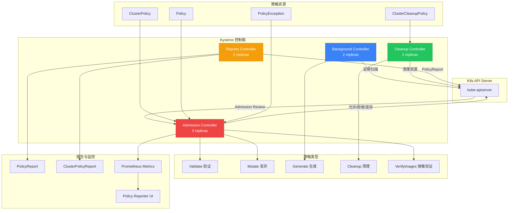

> **生产环境安全提示**
>
> 本文档包含可直接执行的运维命令。执行前请确认：当前目标集群与 Namespace 是否正确；是否具备足够的 RBAC 权限；是否已在非生产环境验证。命令风险等级标注：🔴 高风险（可能造成数据丢失或服务中断）、🟡 中风险（会修改集群状态，但通常可回滚）、🟢 低风险/只读（信息收集，无副作用）。


# [[Kyverno|Kyverno]] K8s 原生策略管理实践指南

> **适用版本**: Kyverno v1.14.0
> **最后更新**: 2026-04-24
> **难度**: 中级

---

<!-- chunk: 一、概述与威胁模型 -->## 一、概述与威胁模型

Kyverno 是专为 [[Kubernetes|Kubernetes]] 设计的策略引擎，以 CNCF 毕业项目的身份成为云原生策略管理的事实标准。与 OPA Gatekeeper 需要学习 Rego 语言不同，Kyverno 使用标准 K8s YAML 定义策略，直接使用 kubectl 管理策略资源，这使得 K8s 管理员和安全团队能够以最低的学习成本快速落地策略管理。

在缺乏策略引擎的 K8s 集群中，安全风险无处不在。开发人员可以随意创建特权容器用于调试但事后忘记删除；CI/CD 管道可以部署使用 latest 标签的镜像导致生产环境不可预测；团队成员可以绕过安全基线直接创建不安全的 K8s 资源；命名空间的资源配额可能被过度消耗影响其他团队的服务质量。这种无约束的状态在小型团队中也许可以通过人工审查来控制，但在多团队、多集群、多环境的企业环境中，人工审查完全无法跟上资源创建的速度和规模。

Kyverno 的价值在于将安全策略从人工审查转变为自动化执行。通过 K8s Admission Webhook 机制，Kyverno 在资源创建和修改时自动执行策略检查，拒绝不符合安全基线的资源。通过背景扫描，Kyverno 定期检查集群内现有资源的合规状态并生成策略报告。通过变异策略，Kyverno 可以自动修复不安全的配置。通过生成策略，Kyverno 可以在新命名空间创建时自动生成安全基础设施。通过镜像验证策略，Kyverno 可以确保只有经过签名验证的镜像才能部署。通过清理策略，Kyverno 可以定期清理过期的旧资源。这种全面的策略管理能力使 Kyverno 成为云原生安全基础设施的核心组件。

## 威胁模型分析

策略引擎面临的威胁模型涵盖以下几个维度。首先是配置层面的威胁，包括特权容器逃逸、root 用户运行、不必要的 Linux capabilities、缺少资源限制等。这些配置缺陷可被攻击者直接利用，例如特权容器可以通过挂载宿主机文件系统实现容器逃逸，获取宿主机的完全控制权。以 root 运行的容器被入侵后，攻击者可以修改容器内的任意文件、安装恶意软件包、修改系统配置。

其次是供应链层面的威胁，包括未签名的恶意镜像、使用 latest 标签导致的环境不一致、以及来自不受信任镜像仓库的镜像。攻击者可以通过依赖混淆攻击在公共镜像仓库发布与内部镜像同名的恶意版本，如果集群没有限制镜像来源，CI/CD 管道可能拉取到恶意镜像。镜像标签被覆盖（tag mutability）攻击中，攻击者在获取镜像仓库写权限后替换特定标签的镜像内容，导致使用该标签的部署在下次更新时拉取到恶意版本。

第三是合规层面的威胁，包括违反 CIS Benchmark 的配置、缺乏必要标签和注释的资源、以及不符合 Pod Security Standards 的工作负载。合规违规不仅带来安全风险，还可能导致监管处罚和客户信任损失。在 SOC 2 和 PCI-DSS 审计中，需要证明所有部署的工作负载都符合安全基线，没有策略引擎的情况下这几乎不可能做到。

第四是运维层面的威胁，包括命名空间缺乏默认的网络策略和资源配额、调试资源未及时清理、以及敏感资源的未授权访问。缺少默认网络策略的命名空间中，被入侵的 Pod 可以自由访问其他 Pod 和服务。未设置资源配额的命名空间可能被单个工作负载耗尽所有资源，导致同命名空间的其他服务不可用。

**攻击向量与防御矩阵**：

| 攻击向量 | 风险等级 | Kyverno 防御策略 | 检测方式 |
|:---|:---|:---|:---|
| 特权容器逃逸 | 严重 | 验证禁止 privileged:true | Validate + Background Scan |
| Root 用户运行 | 高 | 验证 runAsNonRoot:true | Validate + Mutate |
| 危险 Capabilities | 高 | 验证 drop ALL | Validate |
| Latest 镜像标签 | 中 | 验证禁止 :latest | Validate |
| 未签名镜像 | 严重 | VerifyImages 签名验证 | VerifyImages |
| 无资源限制 | 中 | 验证 limits 必须存在 | Validate |
| HostPath 挂载 | 高 | 验证禁止 hostPath 卷 | Validate |
| 主机命名空间 | 严重 | 验证禁止 hostPID/hostIPC/hostNetwork | Validate |
| 缺少标签 | 低 | 验证必须标签 | Validate |
| 无网络策略 | 中 | 生成默认 NetworkPolicy | Generate |
| 调试资源遗留 | 低 | 清理过期资源 | CleanupPolicy |
| 密钥明文存储 | 高 | 验证禁止 env 明文密钥 | Validate |

---

<!-- chunk: 二、架构设计 -->## 二、架构设计

## 2.1 Kyverno 核心架构

Kyverno 的架构从 v1.11 开始采用多控制器模式，将不同职责拆分为独立的控制器，每个控制器可以独立扩展和升级。这种架构设计提高了系统的可靠性和可维护性，避免了单点问题。

Admission Controller 是最核心的组件，负责处理所有来自 K8s API Server 的 Admission Review 请求。它以 Webhook 的形式注册到 API Server，当有资源创建或修改请求时，API Server 会将请求转发给 Admission Controller 进行策略检查。Admission Controller 根据请求的资源类型和命名空间匹配相关的 ClusterPolicy 和 Policy，执行验证、变异或镜像验证操作，然后将结果返回给 API Server。为了保证高可用，建议在生产环境中运行至少三个副本，并使用 Pod 反亲和性和拓扑分布约束确保副本分布在不同节点和可用区。Admission Controller 的性能直接影响集群的部署速度，建议在大规模集群中为其分配充足的 CPU 和内存资源。

Background Controller 负责对集群中已存在的资源执行策略检查。当新策略被创建或现有策略被更新时，Background Controller 会扫描所有匹配的现有资源，检查其合规状态。它还负责执行 Mutate 策略对现有资源的变异操作。Background Controller 的扫描频率可以通过 backgroundScanInterval 参数配置，在大规模集群中建议适当降低频率以减少 API Server 负载。Background Controller 的另一个重要功能是处理 Generate 策略——当匹配的命名空间或资源被创建时，自动生成相关的安全资源。

Cleanup Controller 是 Kyverno v1.11 新增的控制器，负责执行 CleanupPolicy 定义的资源清理任务。通过 Cron 表达式指定清理时间和频率，可以自动清理过期的 Job、旧的 ReplicaSet、未使用的 ConfigMap 等资源。Cleanup Controller 的条件表达式使用 Kyverno 变量语法，可以基于资源的创建时间、标签值、状态字段等条件判断是否需要清理。

Reports Controller 负责生成策略报告。它会定期扫描集群中的资源，将策略合规状态写入 PolicyReport 和 ClusterPolicyReport 资源，供外部工具（如 Policy Reporter UI）查询和展示。报告数据包含每个资源的策略评估结果——通过（pass）、失败（fail）或跳过（skip），以及对应的策略名称、规则名称和违规消息。



## 2.2 策略处理流程

Kyverno 的策略处理流程设计为高性能和可扩展。当 API Server 接收到资源创建或修改请求后，通过 Admission Webhook 将请求转发给 Kyverno Admission Controller。Admission Controller 首先根据资源的类型、命名空间和标签快速匹配相关的 ClusterPolicy 和 Policy，跳过不相关的策略以提高性能。然后按照策略的优先级顺序依次执行验证、变异和镜像验证操作。验证策略检查资源是否符合安全基线，变异策略自动修复不安全的配置，镜像验证策略检查镜像的签名和摘要。最后将处理结果返回给 API Server，允许合规的资源创建，拒绝不合规的资源创建，或者返回变异后的资源配置。

策略评估的顺序非常重要。Kyverno 首先执行所有 Mutate 策略，修改资源的配置（如注入默认安全上下文）。然后执行 VerifyImages 策略，验证镜像的签名和摘要。最后执行 Validate 策略，检查修改后的资源是否符合安全基线。这个顺序确保了验证策略检查的是最终生效的资源配置，而不是用户提交的原始配置。例如，如果 Mutate 策略自动注入了 `runAsNonRoot: true`，那么 Validate 策略检查 `runAsNonRoot` 时会看到已经被修改为 true 的值，而不是用户可能没有设置的原始值。

---

<!-- chunk: 三、核心配置 -->## 三、核心配置

## 3.1 Helm 生产级部署

生产环境的 Kyverno 部署需要考虑高可用性、资源管理和命名空间排除等因素。Admission Controller 至少需要三个副本以保证在节点问题时仍然可以处理准入请求。Background Controller 和 Reports Controller 各两个副本即可满足大多数场景的需求。资源请求和限制需要根据集群规模和策略数量进行调整。在大规模集群（500+ 节点）中，Admission Controller 的内存限制可能需要调高到 2Gi 以上。

> ⚠️ **🟡 中危变更** — 变更集群资源状态，建议先 --dry-run 或 diff 确认
> - `helm upgrade/install`：部署/升级 release

``` bash
# 🟡 中风险：会修改集群/资源状态，执行前请确认目标、影响范围与授权
helm repo add kyverno https://kyverno.github.io/kyverno/
helm repo update

helm install kyverno kyverno/kyverno \
  --namespace kyverno \
  --create-namespace \
  --set admissionController.replicas=3 \
  --set backgroundController.replicas=2 \
  --set cleanupController.replicas=2 \
  --set reportsController.replicas=2 \
  --set admissionController.resources.requests.memory=256Mi \
  --set admissionController.resources.limits.memory=1Gi \
  --version 3.3.0
```
## 3.2 生产级 Values 配置

以下 Values 文件经过大规模生产环境验证，覆盖了资源管理、拓扑分布、命名空间排除等关键配置项。资源请求和限制需要根据集群规模和策略数量进行调整。在大规模集群（500+ 节点）中，Admission Controller 的内存限制可能需要调高到 2Gi 以上。

```yaml
admissionController:
  replicas: 3
  resources:
    requests:
      cpu: 100m
      memory: 256Mi
    limits:
      cpu: 1000m
      memory: 1Gi
  topologySpreadConstraints:
    - maxSkew: 1
      topologyKey: topology.kubernetes.io/zone
      whenUnsatisfiable: DoNotSchedule
    - maxSkew: 1
      topologyKey: kubernetes.io/hostname
      whenUnsatisfiable: DoNotSchedule
  podDisruptionBudget:
    minAvailable: 2
  serviceMonitor:
    enabled: true

backgroundController:
  replicas: 2
  resources:
    requests:
      cpu: 100m
      memory: 128Mi
    limits:
      cpu: 500m
      memory: 512Mi

cleanupController:
  replicas: 2
  resources:
    requests:
      cpu: 100m
      memory: 64Mi
    limits:
      cpu: 500m
      memory: 256Mi

reportsController:
  replicas: 2
  resources:
    requests:
      cpu: 100m
      memory: 128Mi
    limits:
      cpu: 500m
      memory: 512Mi

config:
  resourceFilters:
    - '[*,"*","kyverno"]'
    - '[*,"*","kube-system"]'
    - '[*,"*","kube-public"]'
    - '[*,"*","kube-node-lease"]'
    - '[*,"*","gatekeeper-system"]'
  webhooks:
    timeoutSeconds: 10
    failurePolicy: Fail

features:
  admissionReports:
    enabled: true
  aggregateReports:
    enabled: true
  policyReports:
    enabled: true
  cleanupReports:
    enabled: true
```

## 3.3 Webhook 配置与排错

Kyverno 注册了以下 Webhook 到 K8s API Server，理解每个 Webhook 的作用有助于排查问题：

| Webhook 类型 | 用途 | 默认超时 | 问题策略 |
|:---|:---|:---|:---|
| Validating Webhook | 验证策略执行 | 10s | Fail |
| Mutating Webhook | 变异策略执行 | 10s | Fail |
| VerifyImages Webhook | 镜像签名验证 | 30s | Fail |

``` bash
# 🟢 低风险：只读/信息收集，通常无副作用
kubectl get validatingwebhookconfiguration -l app.kubernetes.io/name=kyverno -o yaml
kubectl get mutatingwebhookconfiguration -l app.kubernetes.io/name=kyverno -o yaml

kubectl get validatingwebhookconfiguration kyverno-resource-validating-webhook-cfg \
  -o jsonpath='{.webhooks[0].timeoutSeconds}'
```
---

<!-- chunk: 四、安全策略实战 -->## 四、安全策略实战

## 4.1 Validate（验证策略）

验证策略是最常用的策略类型。当资源不符合策略条件时，Kyverno 拒绝资源的创建或修改。以下策略覆盖了 Pod Security Standards 的核心要求，包括禁止 root 运行、禁止特权容器、要求只读文件系统、丢弃所有 Linux capabilities、以及强制设置资源限制。

这些策略应该首先在 audit 模式下运行两到三周，收集所有违规的资源，与各团队确认是否可以修复。确认修复方案后，再逐步切换到 enforce 模式。一次性全量开启 enforce 模式可能导致大量现有服务无法部署，造成业务中断。

```yaml
apiVersion: kyverno.io/v1
kind: ClusterPolicy
metadata:
  name: pod-security-baseline
  annotations:
    policies.kyverno.io/title: Pod Security Baseline
    policies.kyverno.io/category: Pod Security Standards
    policies.kyverno.io/severity: critical
spec:
  validationFailureAction: Enforce
  background: true
  rules:
    - name: require-run-as-non-root
      match:
        any:
          - resources:
              kinds:
                - Pod
      validate:
        message: "容器必须以非 root 用户运行 (runAsNonRoot: true)"
        pattern:
          spec:
            securityContext:
              runAsNonRoot: true
            containers:
              - (name): "*"
                securityContext:
                  allowPrivilegeEscalation: false
                  readOnlyRootFilesystem: true
                  capabilities:
                    drop:
                      - ALL
                  seccompProfile:
                    type: RuntimeDefault

    - name: disallow-privileged
      match:
        any:
          - resources:
              kinds:
                - Pod
      validate:
        message: "禁止使用特权容器 (privileged: false)"
        pattern:
          spec:
            containers:
              - (name): "*"
                securityContext:
                  privileged: false

    - name: require-resource-limits
      match:
        any:
          - resources:
              kinds:
                - Pod
      validate:
        message: "所有容器必须设置 CPU 和内存 limits"
        pattern:
          spec:
            containers:
              - (name): "*"
                resources:
                  limits:
                    memory: "?*"
                    cpu: "?*"

    - name: disallow-host-namespaces
      match:
        any:
          - resources:
              kinds:
                - Pod
      validate:
        message: "禁止使用 hostPID、hostIPC、hostNetwork"
        pattern:
          spec:
            =(hostPID): "false"
            =(hostIPC): "false"
            =(hostNetwork): "false"

    - name: disallow-hostpath-mounts
      match:
        any:
          - resources:
              kinds:
                - Pod
      validate:
        message: "禁止使用 HostPath 卷挂载"
        pattern:
          spec:
            =(volumes):
              - X(hostPath): "null"

    - name: disallow-latest-tag
      match:
        any:
          - resources:
              kinds:
                - Pod
      validate:
        message: "禁止使用 :latest 镜像标签"
        foreach:
          - list: request.object.spec.containers
            element: container
            deny:
              conditions:
                any:
                  - key: "{{ endsWith(container.image, ':latest') || !contains(container.image, ':') }}"
                    operator: Equals
                    value: true

    - name: require-drop-all-capabilities
      match:
        any:
          - resources:
              kinds:
                - Pod
      validate:
        message: "必须丢弃所有 Linux capabilities"
        foreach:
          - list: request.object.spec.containers
            element: container
            deny:
              conditions:
                any:
                  - key: "{{ container.securityContext.capabilities.drop[] }}"
                    operator: NotEquals
                    value: ALL
```

## 4.2 Mutate（变异策略）

变异策略自动为资源添加安全配置，即使用户在提交时没有设置。这种「默认安全」的策略可以显著降低安全基线落地的阻力，因为开发团队不需要手动为每个工作负载配置 SecurityContext。

变异策略使用 patchStrategicMerge 语法修改资源配置。语法中的 `+(field)` 表示仅当字段不存在时才添加，不会覆盖用户已设置的值。这种设计确保了变异策略不会意外修改用户有意设置的配置。

```yaml
apiVersion: kyverno.io/v1
kind: ClusterPolicy
metadata:
  name: add-default-securitycontext
  annotations:
    policies.kyverno.io/title: Add Default Security Context
    policies.kyverno.io/category: Security
spec:
  rules:
    - name: add-defaults
      match:
        any:
          - resources:
              kinds:
                - Pod
      mutate:
        patchStrategicMerge:
          spec:
            securityContext:
              +(runAsNonRoot): true
              +(runAsUser): 1001
              +(runAsGroup): 1001
              +(fsGroup): 1001
              +(seccompProfile):
                +(type): RuntimeDefault
            containers:
              - (name): "*"
                securityContext:
                  +(allowPrivilegeEscalation): false
                  +(readOnlyRootFilesystem): true
                  +(capabilities):
                    +(drop):
                      - ALL
---
apiVersion: kyverno.io/v1
kind: ClusterPolicy
metadata:
  name: add-default-resource-limits
  annotations:
    policies.kyverno.io/title: Add Default Resource Limits
    policies.kyverno.io/category: Resource Management
spec:
  rules:
    - name: add-default-requests-and-limits
      match:
        any:
          - resources:
              kinds:
                - Pod
      mutate:
        patchStrategicMerge:
          spec:
            containers:
              - (name): "*"
                resources:
                  +(requests):
                    +(cpu): "100m"
                    +(memory): "128Mi"
                  +(limits):
                    +(cpu): "500m"
                    +(memory): "512Mi"
---
apiVersion: kyverno.io/v1
kind: ClusterPolicy
metadata:
  name: add-default-probes
  annotations:
    policies.kyverno.io/title: Add Default Probes
    policies.kyverno.io/category: Best Practices
spec:
  rules:
    - name: add-liveness-probe
      match:
        any:
          - resources:
              kinds:
                - Pod
      mutate:
        patchStrategicMerge:
          spec:
            containers:
              - (name): "*"
                +(livenessProbe):
                  +(httpGet):
                    +(port): 8080
                    +(path): /actuator/health/liveness
                  +(initialDelaySeconds): 30
                  +(periodSeconds): 15
```

## 4.3 Generate（生成策略）

生成策略是新命名空间创建时的安全基础设施自动配置工具。在企业环境中，每个新命名空间都应该配备默认的网络策略（Default Deny Ingress/Egress）、资源配额、LimitRange 和 RBAC 配置。手动配置这些资源既耗时又容易遗漏，通过 Kyverno 的生成策略可以实现自动化。

生成策略的 synchronize 选项控制是否持续同步生成的资源。如果设为 true，Kyverno 会确保生成的资源始终与策略定义一致，任何手动修改都会被自动恢复。如果设为 false，生成的资源创建后可以手动修改。对于安全基线资源（如 NetworkPolicy），建议设为 true 以防止被意外删除或修改。

```yaml
apiVersion: kyverno.io/v1
kind: ClusterPolicy
metadata:
  name: generate-default-networkpolicy
  annotations:
    policies.kyverno.io/title: Generate Default NetworkPolicy
    policies.kyverno.io/category: Networking
spec:
  rules:
    - name: default-deny-all
      match:
        any:
          - resources:
              kinds:
                - Namespace
      exclude:
        any:
          - resources:
              namespaces:
                - kube-system
                - kube-public
                - kube-node-lease
                - kyverno
      generate:
        apiVersion: networking.k8s.io/v1
        kind: NetworkPolicy
        name: default-deny-all
        namespace: "{{request.object.metadata.name}}"
        synchronize: true
        data:
          spec:
            podSelector: {}
            policyTypes:
              - Ingress
              - Egress
---
apiVersion: kyverno.io/v1
kind: ClusterPolicy
metadata:
  name: generate-resourcequota
  annotations:
    policies.kyverno.io/title: Generate ResourceQuota
    policies.kyverno.io/category: Resource Management
spec:
  rules:
    - name: default-quota
      match:
        any:
          - resources:
              kinds:
                - Namespace
      exclude:
        any:
          - resources:
              namespaces:
                - kube-system
                - kube-public
                - kube-node-lease
                - kyverno
      generate:
        apiVersion: v1
        kind: ResourceQuota
        name: default-quota
        namespace: "{{request.object.metadata.name}}"
        synchronize: true
        data:
          spec:
            hard:
              requests.cpu: "100"
              requests.memory: 200Gi
              limits.cpu: "200"
              limits.memory: 400Gi
              pods: "500"
              services: "50"
              secrets: "100"
              configmaps: "100"
---
apiVersion: kyverno.io/v1
kind: ClusterPolicy
metadata:
  name: generate-limitrange
  annotations:
    policies.kyverno.io/title: Generate LimitRange
    policies.kyverno.io/category: Resource Management
spec:
  rules:
    - name: default-limits
      match:
        any:
          - resources:
              kinds:
                - Namespace
      exclude:
        any:
          - resources:
              namespaces:
                - kube-system
                - kube-public
                - kube-node-lease
                - kyverno
      generate:
        apiVersion: v1
        kind: LimitRange
        name: default-limits
        namespace: "{{request.object.metadata.name}}"
        synchronize: true
        data:
          spec:
            limits:
              - type: Container
                default:
                  cpu: "500m"
                  memory: "512Mi"
                defaultRequest:
                  cpu: "100m"
                  memory: "128Mi"
                max:
                  cpu: "4"
                  memory: "8Gi"
                min:
                  cpu: "50m"
                  memory: "64Mi"
```

## 4.4 VerifyImages（镜像验证）

镜像验证策略是供应链安全的关键环节。Kyverno 原生支持 cosign 签名验证和 Notary v2 验证，可以在准入阶段确保只有经过授权签名的镜像才能部署到集群。这有效防止了恶意镜像和未经验证的第三方镜像进入生产环境。

镜像验证支持两种模式：基于密钥的验证和 Keyless 验证。基于密钥的验证使用预定义的公钥验证镜像签名，适合企业内部的私有镜像仓库。Keyless 验证使用 Sigstore 的 Fulcio CA 和 Rekor 透明日志，通过 OIDC 身份（如 GitHub Actions 的 workflow identity）验证签名，无需管理密钥。

```yaml
apiVersion: kyverno.io/v1
kind: ClusterPolicy
metadata:
  name: verify-image-signature
  annotations:
    policies.kyverno.io/title: Verify Image Signatures
    policies.kyverno.io/category: Supply Chain Security
    policies.kyverno.io/severity: critical
spec:
  validationFailureAction: Enforce
  background: false
  webhookTimeoutSeconds: 30
  rules:
    - name: verify-cosign-signature
      match:
        any:
          - resources:
              kinds:
                - Pod
      verifyImages:
        - imageReferences:
            - "harbor.example.com/production/*"
          verifyDigest: true
          required: true
          mutateDigest: true
          attestors:
            - entries:
                - keys:
                    publicKeys: |
                      -----BEGIN PUBLIC KEY-----
                      MFkwEwYHKoZIzj0CAQYIKoZIzj0DAQcDQgAE...
                      -----END PUBLIC KEY-----
    - name: verify-keyless-signature
      match:
        any:
          - resources:
              kinds:
                - Pod
      verifyImages:
        - imageReferences:
            - "ghcr.io/company/*"
          verifyDigest: true
          required: true
          mutateDigest: true
          attestors:
            - entries:
                - keyless:
                    subject: "https://github.com/company/*"
                    issuer: "https://token.actions.githubusercontent.com"
                    rekor:
                      url: https://rekor.sigstore.dev
```

## 4.5 CleanupPolicy（清理策略）

清理策略是 Kyverno v1.11 引入的独特功能，允许通过 Cron 表达式定期清理集群中的过期资源。这在运维场景中非常有用——调试完成后遗留的临时 Pod、过期的 Job、旧的 ReplicaSet、以及不再使用的 ConfigMap 和 Secret 都可以通过清理策略自动回收。

清理策略的执行由 Cleanup Controller 负责。它根据 Cron 表达式定期检查匹配的资源，对满足条件的资源执行删除操作。条件可以使用 Kyverno 的变量表达式，例如基于资源的创建时间、标签值或状态字段来判断是否需要清理。这种声明式的清理方式比传统的 CronJob 脚本更加可靠和可审计。

```yaml
apiVersion: kyverno.io/v1
kind: ClusterCleanupPolicy
metadata:
  name: cleanup-old-jobs
spec:
  match:
    any:
      - resources:
          kinds:
            - Batch/v1/Job
  conditions:
    any:
      - key: "{{ target.status.completionTime }}"
        operator: GreaterThanOrEquals
        value: "86400s"
  schedule: "0 */6 * * *"
---
apiVersion: kyverno.io/v1
kind: ClusterCleanupPolicy
metadata:
  name: cleanup-debug-pods
spec:
  match:
    any:
      - resources:
          kinds:
            - v1/Pod
          selector:
            matchLabels:
              debug: "true"
  conditions:
    any:
      - key: "{{ target.metadata.creationTimestamp }}"
        operator: GreaterThanOrEquals
        value: "14400s"
  schedule: "0 */4 * * *"
---
apiVersion: kyverno.io/v1
kind: ClusterCleanupPolicy
metadata:
  name: cleanup-old-replicaset
spec:
  match:
    any:
      - resources:
          kinds:
            - apps/v1/ReplicaSet
  conditions:
    all:
      - key: "{{ target.spec.replicas }}"
        operator: Equals
        value: 0
      - key: "{{ target.metadata.creationTimestamp }}"
        operator: GreaterThanOrEquals
        value: "604800s"
  schedule: "0 2 * * 0"
```

---

<!-- chunk: 五、合规与审计 -->## 五、合规与审计

## 5.1 Pod Security Standards

Kyverno 原生支持 K8s Pod Security Standards，可以一键强制执行 Restricted 配置文件。这是最简单的策略落地方式，推荐作为安全基线的起点。

```yaml
apiVersion: kyverno.io/v1
kind: ClusterPolicy
metadata:
  name: enforce-pod-security-restricted
  annotations:
    policies.kyverno.io/title: Enforce PSS Restricted
spec:
  validationFailureAction: Enforce
  background: true
  rules:
    - name: restricted-profile
      match:
        any:
          - resources:
              kinds:
                - Pod
      validate:
        podSecurity:
          level: restricted
          version: latest
```

## 5.2 CIS Benchmark 策略集

以下策略映射到 CIS Kubernetes Benchmark 的关键控制项：

```yaml
apiVersion: kyverno.io/v1
kind: ClusterPolicy
metadata:
  name: cis-benchmark-controls
  annotations:
    policies.kyverno.io/title: CIS Benchmark Controls
    policies.kyverno.io/category: Compliance
spec:
  validationFailureAction: Audit
  background: true
  rules:
    - name: cis-5.2.2-minimize-container-privileges
      match:
        any:
          - resources:
              kinds:
                - Pod
      validate:
        message: "CIS 5.2.2: 禁止特权容器"
        pattern:
          spec:
            containers:
              - (name): "*"
                securityContext:
                  privileged: false

    - name: cis-5.2.3-minimize-capabilities
      match:
        any:
          - resources:
              kinds:
                - Pod
      validate:
        message: "CIS 5.2.3: 必须丢弃所有 capabilities"
        pattern:
          spec:
            containers:
              - (name): "*"
                securityContext:
                  capabilities:
                    drop:
                      - ALL

    - name: cis-5.2.5-disable-service-account-token
      match:
        any:
          - resources:
              kinds:
                - Pod
      validate:
        message: "CIS 5.2.5: 非必要不自动挂载 ServiceAccount Token"
        pattern:
          spec:
            automountServiceAccountToken: false

    - name: cis-5.2.6-require-read-only-fs
      match:
        any:
          - resources:
              kinds:
                - Pod
      validate:
        message: "CIS 5.2.6: 建议使用只读文件系统"
        pattern:
          spec:
            containers:
              - (name): "*"
                securityContext:
                  readOnlyRootFilesystem: true

    - name: cis-5.4.1-prefer-secrets-over-env
      match:
        any:
          - resources:
              kinds:
                - Pod
      validate:
        message: "CIS 5.4.1: 密钥应使用 secretKeyRef 而非明文 env"
        pattern:
          spec:
            containers:
              - (name): "*"
                ~(env):
                  - value: "*password*|*secret*|*token*|*api_key*|*credential*"
```

## 5.3 策略异常管理

在实际运维中，某些特殊资源可能需要豁免特定的安全策略。例如调试命名空间中的临时调试 Pod 可能需要以 root 用户运行，或者某些遗留应用暂时无法配置只读文件系统。Kyverno 通过 PolicyException 机制提供受控的策略豁免，确保豁免是显式声明和可审计的，而不是通过全局放行来绕过策略。

```yaml
apiVersion: kyverno.io/v2
kind: PolicyException
metadata:
  name: breakglass-exception
  annotations:
    policies.kyverno.io/title: Breakglass Exception for Debug Namespace
    policies.kyverno.io/description: "允许调试命名空间中的临时 Pod 豁免特定策略"
spec:
  exceptions:
    - policyName: pod-security-baseline
      ruleNames:
        - require-run-as-non-root
        - disallow-privileged
    - policyName: cis-benchmark-controls
      ruleNames:
        - cis-5.2.6-require-read-only-fs
  match:
    any:
      - resources:
          kinds:
            - Pod
          names:
            - debug-pod-*
          namespaces:
            - debug
            - troubleshooting
```

## 5.4 策略报告与可视化

Kyverno 自动为每个命名空间生成 PolicyReport，列出所有资源的合规状态。通过安装 Policy Reporter UI，可以获得直观的策略合规仪表板。

> ⚠️ **🟡 中危变更** — 变更集群资源状态，建议先 --dry-run 或 diff 确认
> - `helm upgrade/install`：部署/升级 release

``` bash
# 🟡 中风险：会修改集群/资源状态，执行前请确认目标、影响范围与授权
kubectl get policyreport -A
kubectl get clusterpolicyreport

helm install policy-reporter policy-reporter/policy-reporter \
  --namespace kyverno \
  --set ui.enabled=true \
  --set kyvernoPlugin.enabled=true \
  --set monitoring.enabled=true \
  --set grafana.dashboard.enabled=true
```
## 5.5 合规报告自动化脚本

``` bash
# 🟢 低风险：只读/信息收集，通常无副作用
#!/bin/bash
# kyverno_compliance_report.sh - 生成合规报告

REPORT_DIR="/tmp/kyverno-reports"
DATE=$(date +%Y%m%d_%H%M%S)
mkdir -p "$REPORT_DIR/$DATE"

echo "# Kyverno Policy Compliance Report" > "$REPORT_DIR/$DATE/report.md"
echo "**Date**: $(date)" >> "$REPORT_DIR/$DATE/report.md"
echo "**Cluster**: $(kubectl config current-context)" >> "$REPORT_DIR/$DATE/report.md"
echo "" >> "$REPORT_DIR/$DATE/report.md"

echo "<!-- chunk: Summary" >> "$REPORT_DIR/$DATE/report.md" -->## Summary" >> "$REPORT_DIR/$DATE/report.md"
TOTAL_POLICIES=$(kubectl get clusterpolicies --no-headers | wc -l)
ENFORCED=$(kubectl get clusterpolicies -o json | jq '[.items[] | select(.spec.validationFailureAction=="Enforce")] | length')
AUDIT_MODE=$(kubectl get clusterpolicies -o json | jq '[.items[] | select(.spec.validationFailureAction=="Audit")] | length')
echo "- Total Policies: $TOTAL_POLICIES" >> "$REPORT_DIR/$DATE/report.md"
echo "- Enforced: $ENFORCED" >> "$REPORT_DIR/$DATE/report.md"
echo "- Audit: $AUDIT_MODE" >> "$REPORT_DIR/$DATE/report.md"
echo "" >> "$REPORT_DIR/$DATE/report.md"

echo "<!-- chunk: Cluster-level Violations" >> "$REPORT_DIR/$DATE/report.md" -->## Cluster-level Violations" >> "$REPORT_DIR/$DATE/report.md"
echo "| Policy | Rule | Resource | Message |" >> "$REPORT_DIR/$DATE/report.md"
echo "|:---|:---|:---|:---|" >> "$REPORT_DIR/$DATE/report.md"
kubectl get clusterpolicyreport -o json | \
  jq -r '.results[] | select(.result == "fail") |
    "| \(.policy) | \(.rule) | \(.resource.kind)/\(.resource.name) | \(.message) |"' \
  >> "$REPORT_DIR/$DATE/report.md"

echo "" >> "$REPORT_DIR/$DATE/report.md"
echo "<!-- chunk: Namespace-level Violations" >> "$REPORT_DIR/$DATE/report.md" -->## Namespace-level Violations" >> "$REPORT_DIR/$DATE/report.md"
for ns in $(kubectl get namespaces -o jsonpath='{.items[*].metadata.name}'); do
  violations=$(kubectl get policyreport -n "$ns" -o json 2>/dev/null | \
    jq -r '.results[] | select(.result == "fail")')
  if [ -n "$violations" ]; then
    echo "#<!-- chunk: Namespace: $ns" >> "$REPORT_DIR/$DATE/report.md" -->## Namespace: $ns" >> "$REPORT_DIR/$DATE/report.md"
    echo "| Policy | Rule | Resource | Message |" >> "$REPORT_DIR/$DATE/report.md"
    echo "|:---|:---|:---|:---|" >> "$REPORT_DIR/$DATE/report.md"
    echo "$violations" | \
      jq -r '"| \(.policy) | \(.rule) | \(.resource.kind)/\(.resource.name) | \(.message) |"' \
      >> "$REPORT_DIR/$DATE/report.md"
    echo "" >> "$REPORT_DIR/$DATE/report.md"
  fi
done

echo "Report generated: $REPORT_DIR/$DATE/report.md"
```
---

<!-- chunk: 六、监控与告警 -->## 六、监控与告警

## 6.1 Prometheus 监控

Kyverno 暴露了丰富的 Prometheus 指标用于监控策略执行情况。关键指标包括策略执行通过率和失败率、Webhook 处理延迟、以及规则匹配次数。建议为这些指标配置告警规则，当策略失败率异常升高或 Webhook 延迟过高时及时通知运维团队。

```yaml
apiVersion: monitoring.coreos.com/v1
kind: PrometheusRule
metadata:
  name: kyverno-alerts
  namespace: kyverno
spec:
  groups:
    - name: kyverno.rules
      rules:
        - alert: KyvernoPolicyViolation
          expr: increase(kyverno_policy_results_total{result="fail"}[1h]) > 10
          for: 5m
          labels:
            severity: warning
          annotations:
            summary: "Kyverno 检测到大量策略违规"
            description: "过去 1 小时内有 {{ $value }} 次策略违规"

        - alert: KyvernoWebhookLatencyHigh
          expr: histogram_quantile(0.99, rate(kyverno_admission_review_duration_seconds_bucket[5m])) > 1
          for: 5m
          labels:
            severity: warning
          annotations:
            summary: "Kyverno Webhook 延迟过高 (>1s)"
            description: "P99 延迟 {{ $value }}s，可能影响集群部署性能"

        - alert: KyvernoControllerDown
          expr: up{job="kyverno"} == 0
          for: 3m
          labels:
            severity: critical
          annotations:
            summary: "Kyverno 控制器不可用"
            description: "Kyverno 已停止响应，策略执行中断"

        - alert: KyvernoHighDenyRate
          expr: rate(kyverno_policy_results_total{result="fail"}[5m]) > 5
          for: 2m
          labels:
            severity: warning
          annotations:
            summary: "Kyverno 策略拒绝率异常"
            description: "拒绝率 {{ $value }}/s，可能有大量不合规部署尝试"

        - alert: KyvernoExceptionCountHigh
          expr: count(kyverno_policy_exception) > 10
          for: 10m
          labels:
            severity: info
          annotations:
            summary: "策略例外数量过多: {{ $value }}"
            description: "过多的策略例外可能削弱安全防护"
```

## 6.2 Grafana Dashboard JSON

```json
{
  "dashboard": {
    "title": "Kyverno Policy Dashboard",
    "panels": [
      {
        "title": "Policy Results (Pass/Fail)",
        "type": "timeseries",
        "gridPos": {"h": 8, "w": 12, "x": 0, "y": 0},
        "targets": [
          {
            "expr": "sum(rate(kyverno_policy_results_total{result=\"pass\"}[5m]))",
            "legendFormat": "Pass"
          },
          {
            "expr": "sum(rate(kyverno_policy_results_total{result=\"fail\"}[5m]))",
            "legendFormat": "Fail"
          }
        ]
      },
      {
        "title": "Webhook Latency (P50/P95/P99)",
        "type": "timeseries",
        "gridPos": {"h": 8, "w": 12, "x": 12, "y": 0},
        "targets": [
          {
            "expr": "histogram_quantile(0.50, rate(kyverno_admission_review_duration_seconds_bucket[5m]))",
            "legendFormat": "P50"
          },
          {
            "expr": "histogram_quantile(0.95, rate(kyverno_admission_review_duration_seconds_bucket[5m]))",
            "legendFormat": "P95"
          },
          {
            "expr": "histogram_quantile(0.99, rate(kyverno_admission_review_duration_seconds_bucket[5m]))",
            "legendFormat": "P99"
          }
        ]
      },
      {
        "title": "Policy Violations by Policy",
        "type": "barchart",
        "gridPos": {"h": 8, "w": 12, "x": 0, "y": 8},
        "targets": [
          {
            "expr": "sum by (policy_name) (increase(kyverno_policy_results_total{result=\"fail\"}[24h]))",
            "legendFormat": "{{policy_name}}"
          }
        ]
      },
      {
        "title": "Active Policies",
        "type": "stat",
        "gridPos": {"h": 4, "w": 6, "x": 12, "y": 8},
        "targets": [
          {
            "expr": "count(kyverno_policy_info)",
            "legendFormat": "Total"
          }
        ]
      }
    ]
  }
}
```

---

<!-- chunk: 七、最佳实践 -->## 七、最佳实践

策略管理最佳实践的核心原则是「渐进式落地」。不要试图一次性为集群应用所有安全策略。应该先以 audit 模式部署策略，观察两到三周的违规情况，与各团队沟通修复方案，确认无影响后再切换到 enforce 模式。

另一个重要原则是「分层设计」。第一层是通用安全基线（Pod Security Standards），适用于所有命名空间和工作负载。第二层是环境覆盖策略，针对不同环境（开发、测试、生产）调整策略严格程度。第三层是团队自定义策略，满足特定业务的安全要求。

策略应该通过 GitOps 流程管理，将策略文件存储在 Git 仓库中，通过 Argo CD 或 Flux 自动同步到集群。这样可以确保策略变更有完整的审批流程和回滚能力。

| 实践 | 说明 | 详情 |
|:---|:---|:---|
| 分阶段落地 | 先 audit 模式观察，再 enforce 模式执行 | 审计 2-3 周，确认无影响后切换 |
| 策略分层 | 通用基线 → 环境覆盖 → 团队自定义 | PSS Restricted 作为起点 |
| GitOps 管理 | 通过 Argo CD/Flux 管理策略 | PR 审批流程，自动同步 |
| 策略测试 | 使用 kyverno cli 预检策略效果 | CI/CD 集成自动化测试 |
| PolicyException | 受控的策略豁免，避免全局放行 | 定期审查豁免的必要性 |
| 性能优化 | 排除系统命名空间，控制规则数量 | 使用精确的 match 条件 |
| 命名约定 | 统一策略命名规范 | 类别-目标-动作 |
| 文档注释 | 使用 annotations 记录策略意图 | title/category/severity |
| 监控告警 | 配置 Prometheus 告警规则 | 关注拒绝率和延迟 |
| 定期审计 | 定期审查策略效果和例外 | 每月合规报告 |

## 策略测试最佳实践

``` bash
# 🟢 低风险：只读/信息收集，通常无副作用
# 使用 Kyverno CLI 在本地测试策略
kyverno validate ./policies/

# 使用测试资源验证策略效果
kyverno apply ./policies/ --resource ./manifests/deployment.yaml

# 运行策略测试套件
kyverno test ./policies/test/

# CI/CD 集成示例
helm template mychart | kyverno apply policies/ --resource -
```
## GitOps 集成

```yaml
apiVersion: argoproj.io/v1alpha1
kind: Application
metadata:
  name: kyverno-policies
  namespace: argocd
spec:
  project: security
  source:
    repoURL: https://github.com/company/security-policies.git
    targetRevision: main
    path: kyverno
    directory:
      recurse: true
  destination:
    server: https://kubernetes.default.svc
    namespace: kyverno
  syncPolicy:
    automated:
      prune: true
      selfHeal: true
    syncOptions:
      - CreateNamespace=true
      - ServerSideApply=true
  ignoreDifferences:
    - group: kyverno.io
      kind: ClusterPolicyReport
      jsonPointers:
        - /status
```

---

<!-- chunk: 八、故障排查 -->## 八、故障排查

## 8.1 常见问题诊断

Kyverno 在生产环境中运行时可能遇到各种问题，本节总结了最常见的问题场景及其诊断方法。

**策略不生效**：当创建了验证策略但资源仍然可以绕过策略时，首先检查 ClusterPolicy 的 validationFailureAction 字段。如果设置为 audit，策略只会在策略报告中记录违规，但不会拒绝资源创建。需要将其改为 enforce 才能真正拒绝不合规的资源。另外，检查策略的 match 条件是否正确匹配了目标资源。如果 match 中的 kinds 列表没有包含目标资源类型，策略不会生效。还需要检查 PolicyException 是否豁免了该资源。

**Webhook 拒绝所有请求**：这是一个严重的问题场景，可能导致整个集群无法创建或修改任何资源。通常发生在 Kyverno Admission Controller 不可达时（如 Pod 崩溃、网络问题），而 Webhook 的 failurePolicy 设置为 Fail。解决方法包括：确保 Kyverno 有足够的资源和高可用副本数，将 Webhook 的 failurePolicy 设置为 Ignore（但这意味着策略可能被绕过），以及配置 Webhook 的 namespaceSelector 排除关键命名空间。

**高延迟**：大规模集群中的常见问题。当 Kyverno 的 Webhook 处理延迟超过 API Server 的超时时间（默认 10 秒）时，请求会超时失败。导致高延迟的原因包括策略规则过多、规则条件过于复杂、或者 Admission Controller 资源不足。解决方法包括优化规则条件（使用更精确的 match 条件减少不必要的规则评估）、增加 Admission Controller 的 CPU 和内存配额、以及调整 Webhook 的 timeoutSeconds 参数。

**变异策略不生效**：通常是因为 patchStrategicMerge 的语法问题。Kyverno 的变异语法使用 `(name): "*"` 匹配容器，使用 `+(field)` 表示仅当字段不存在时添加。如果语法不正确，变异操作会被静默忽略。建议使用 kyverno cli 工具在本地测试变异策略的效果。

**镜像验证策略失败**：如果使用 cosign 密钥验证，检查公钥是否正确配置，以及镜像是否确实被签名。如果使用 Keyless 验证，检查 OIDC issuer 和 subject 配置是否匹配 CI/CD 管道的身份。可以使用 `cosign verify` 命令在本地验证镜像签名。

## 8.2 诊断命令

``` bash
# 🟢 低风险：只读/信息收集，通常无副作用
# 查看策略详情和状态
kubectl describe clusterpolicy pod-security-baseline

# 查看 Webhook 配置和超时设置
kubectl get validatingwebhookconfiguration -o yaml | grep -A 5 kyverno
kubectl get mutatingwebhookconfiguration -o yaml | grep -A 5 kyverno

# 查看 Admission Controller 日志
kubectl logs -n kyverno deployment/kyverno-admission-controller --tail=100
kubectl logs -n kyverno -l app.kubernetes.io/component=admission-controller --tail=50

# 查看策略报告
kubectl get policyreport -A
kubectl get clusterpolicyreport

# 查看特定命名空间的违规详情
kubectl get policyreport -n production -o json | \
  jq '.results[] | select(.result == "fail") | {policy, rule, resource, message}'

# 检查 Kyverno 版本和配置
kubectl get deployment -n kyverno -o wide
kubectl get pods -n kyverno -o wide

# 本地测试策略
kyverno apply ./policies/ --resource ./manifests/deployment.yaml
kyverno test ./policies/

# 检查策略异常
kubectl get policyexception -A
kubectl describe policyexception breakglass-exception

# 检查 CleanupPolicy 执行状态
kubectl get clustercleanuppolicy
kubectl logs -n kyverno -l app.kubernetes.io/component=cleanup-controller --tail=30

```
## 8.3 紧急恢复

当 Kyverno 导致集群不可用时，可以通过以下步骤紧急恢复。首先，使用 kubectl patch 命令将所有 Kyverno Webhook 的 failurePolicy 改为 Ignore，使 API Server 在 Kyverno 不可达时仍然可以处理请求。然后，检查 Kyverno Pod 的状态和日志，定位问题根因。最后，修复问题后恢复 failurePolicy 为 Fail。

> ⚠️ **🔴 灾难性操作** — 含不可逆命令，执行前必须满足变更窗口+双人复核+事前备份+回滚方案
> - `helm uninstall`：删除 release 及其释放的所有资源
> - `kubectl edit/patch`：修改运行中的资源

> **🔴 高风险操作警告**
>
> 下方命令属于不可逆或高影响操作，执行前请确认：
> - 已备份关键数据与配置
> - 处于批准的变更窗口期
> - 已获得相关责任人授权
> - 已准备回滚或恢复方案
> - 目标集群、Namespace、节点/资源名称正确无误

``` bash
# 🔴 高风险：可能造成数据丢失或服务中断，执行前需备份、变更审批与回滚方案
# 紧急恢复：将 Webhook failurePolicy 改为 Ignore
kubectl patch validatingwebhookconfiguration kyverno-resource-validating-webhook-cfg \
  --type json -p='[{"op":"replace","path":"/webhooks/0/failurePolicy","value":"Ignore"}]'
kubectl patch mutatingwebhookconfiguration kyverno-resource-mutating-webhook-cfg \
  --type json -p='[{"op":"replace","path":"/webhooks/0/failurePolicy","value":"Ignore"}]'

# 恢复 Fail 策略
kubectl patch validatingwebhookconfiguration kyverno-resource-validating-webhook-cfg \
  --type json -p='[{"op":"replace","path":"/webhooks/0/failurePolicy","value":"Fail"}]'
kubectl patch mutatingwebhookconfiguration kyverno-resource-mutating-webhook-cfg \
  --type json -p='[{"op":"replace","path":"/webhooks/0/failurePolicy","value":"Fail"}]'

# 紧急卸载（最后手段）
helm uninstall kyverno -n kyverno  # ⚠️ 删除 release 及关联资源
```
## 8.4 完整诊断脚本

``` bash
# 🟢 低风险：只读/信息收集，通常无副作用
#!/bin/bash
# kyverno_diagnostics.sh

echo "=== Kyverno Pods ==="
kubectl get pods -n kyverno -o wide
echo ""

echo "=== Policy Status ==="
kubectl get clusterpolicies -o custom-columns=NAME:.metadata.name,ACTION:.spec.validationFailureAction,READY:.status.ready,RULES:.spec.rules[*].name
echo ""

echo "=== Recent Violations ==="
kubectl get clusterpolicyreport -o json | \
  jq -r '.results[] | select(.result == "fail") | "\(.policy)/\(.rule): \(.resource.kind)/\(.resource.name) - \(.message)"' | tail -20
echo ""

echo "=== Policy Exceptions ==="
kubectl get policyexception -A -o wide
echo ""

echo "=== Webhook Configuration ==="
kubectl get validatingwebhookconfiguration -l app.kubernetes.io/name=kyverno -o yaml | grep -A10 "failurePolicy|timeoutSeconds|namespaceSelector"
echo ""

echo "=== Controller Logs (last 30 lines) ==="
kubectl logs -n kyverno -l app.kubernetes.io/name=kyverno --tail=30
echo ""

echo "=== Resource Usage ==="
kubectl top pods -n kyverno
echo ""

echo "=== Cleanup Policies ==="
kubectl get clustercleanuppolicy -o wide
```
---

<!-- chunk: 参考链接 -->## 参考链接

- [Kyverno 官方文档](https://kyverno.io/docs/)
- [Kyverno 策略库](https://kyverno.io/policies/)
- [Kyverno Helm Chart](https://github.com/kyverno/kyverno/tree/main/charts/kyverno)
- [Policy Reporter](https://kyverno.github.io/policy-reporter/)
- [Kyverno CLI 参考](https://kyverno.io/docs/kyverno-cli/)
- [Pod Security Standards](https://kubernetes.io/docs/concepts/security/pod-security-standards/)
- [CIS Kubernetes Benchmark](https://www.cisecurity.org/benchmark/kubernetes)

---

*本文档基于 Kyverno 策略管理实践经验编写，持续更新最新技术和最佳实践。*

---

<!-- chunk: Obsidian 相关文档 -->## Obsidian 相关文档

- 安全 MOC
- [[安全/README.md|Domain 05: 云原生安全 (Cloud Native Security)]]
- [[安全/00-open-source-projects-index.md|Domain-25 云原生安全 — 开源项目索引]]
- Falco 云原生安全监控深度实践
- Sysdig企业级容器安全深度实践
- Aqua Security 企业级容器安全平台深度实践
- Kyverno 企业级策略管理深度实践
- HashiCorp Vault 企业级密钥管理深度实践
- OPA Gatekeeper 策略即代码深度实践
- 容器镜像安全扫描深度实践
- Kubernetes 安全加固深度实践
- gVisor 容器沙箱深度解析

## See Also

- 99-falco-runtime-security-guide
- 99-java-security-kubernetes-guide
- 99-opa-gatekeeper-policy-guide
- 99-vault-k8s-secrets-guide

- [[安全/README.md|返回目录]]
```

<!-- risk-assessed -->
