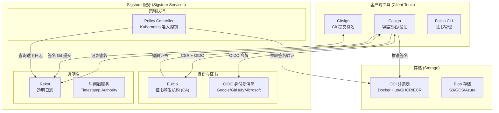
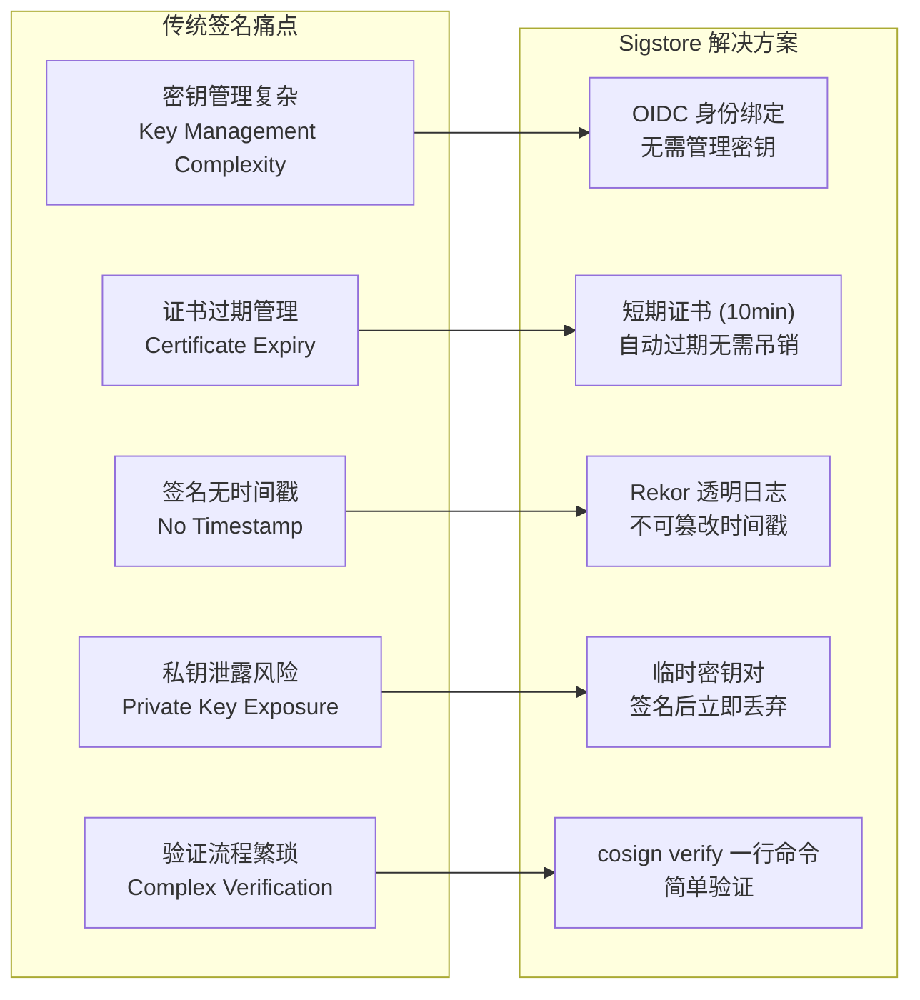
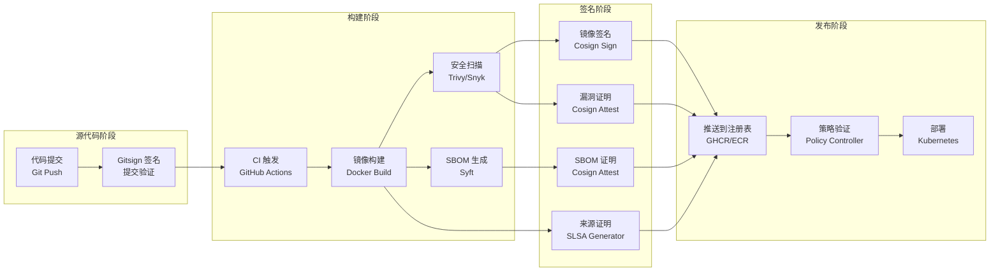

> **生产环境安全提示**
>
> 本文档包含可直接执行的运维命令。执行前请确认：当前目标集群与 Namespace 是否正确；是否具备足够的 RBAC 权限；是否已在非生产环境验证。命令风险等级标注：🔴 高风险（可能造成数据丢失或服务中断）、🟡 中风险（会修改集群状态，但通常可回滚）、🟢 低风险/只读（信息收集，无副作用）。


---
tags:
- security
- supply-chain
intent_queries:
- sigstore-cosign-signing是什么？
- sigstore-cosign-signing的使用方法
- sigstore-cosign-signing的最佳实践

tier: peripheral---
title: Sigstore 与 Cosign 签名 (Sigstore and Cosign Signing)
description: '<!-- chunk: 概述 (Overview)' -->## 概述 (Overview)'
category: supply-chain-security
tags:
- k8s
- supply-chain
- security
- sbom
- slsa
- [[Prometheus|prometheus]]
- [[Helm|helm]]
- docker
- redis
- mysql
last_updated: 2026-05
difficulty: advanced
reading_level: advanced
audience:
- 安全工程师
- SRE
- 架构师
estimated_read_time: 5min
intent_queries:
- Sigstore 与 Cosign 签名 (Sigstore and Cosign Signing) 是什么
- 如何 Sigstore 与 Cosign 签名 (Sigstore and Cosign Signing)
- [[Kubernetes|Kubernetes]] 39 supply chain security 最佳实践
trigger_keywords:
- Sigstore
- Cosign
- 签名
- Sigstore
- and
- Cosign
- Signing
- supply
authors:
- name: KUDIG Team
  role: contributor
k8s_versions:
- '1.28'
- '1.29'
- '1.30'
- '1.31'
- '1.32'
---

# Sigstore 与 Cosign 签名 (Sigstore and Cosign Signing)

<!-- chunk: 概述 (Overview) -->## 概述 (Overview)

Sigstore 是 Linux Foundation 旗下的开源项目，旨在为软件供应链提供透明、可验证的签名基础设施。它通过将代码签名与透明日志相结合，解决了传统密钥管理的复杂性问题，使开发者能够以 "无密钥"（Keyless）方式对软件制品进行签名。

**Cosign** 是 Sigstore 生态的核心客户端工具，支持容器镜像签名、通用文件签名、SBOM 附加、证明生成等功能。

---

<!-- chunk: 1. Sigstore 生态系统全景 (Sigstore Ecosystem Overview) -->## 1. Sigstore 生态系统全景 (Sigstore Ecosystem Overview)

## 1.1 核心组件架构 (Core Component Architecture)



## 1.2 Sigstore 解决的问题 (Problems Sigstore Solves)



## 1.3 Sigstore 公共实例 (Sigstore Public Good Infrastructure)

| 服务 | 生产实例 URL | 用途 |
|------|-------------|------|
| Fulcio | `https://fulcio.sigstore.dev` | OIDC 证书颁发 |
| Rekor | `https://rekor.sigstore.dev` | 透明日志 |
| TUF Root | `https://tuf-repo-cdn.sigstore.dev` | 根信任管理 |
| CT Log | `https://ctfe.sigstore.dev/test` | 证书透明度 |

---

<!-- chunk: 2. Cosign 安装与配置 (Cosign Installation and Configuration) -->## 2. Cosign 安装与配置 (Cosign Installation and Configuration)

## 2.1 安装方式 (Installation Methods)

``` bash
# 🟢 低风险：只读/信息收集，通常无副作用
# 方法 1: Go install（推荐开发环境）
go install github.com/sigstore/cosign/v2/cmd/cosign@latest

# 方法 2: 从 GitHub Release 下载二进制
COSIGN_VERSION="v2.2.4"
curl -sSfL "https://github.com/sigstore/cosign/releases/download/${COSIGN_VERSION}/cosign-linux-amd64" \
  -o /usr/local/bin/cosign
chmod +x /usr/local/bin/cosign

# 验证 Cosign 本身的签名
# 使用 Cosign 验证 Cosign
cosign verify-blob \
  --certificate-oidc-issuer "https://token.actions.githubusercontent.com" \
  --certificate-identity "https://github.com/sigstore/cosign/.github/workflows/release.yml@refs/tags/${COSIGN_VERSION}" \
  --bundle cosign-linux-amd64-keyless.sigstore \
  cosign-linux-amd64

# 方法 3: Homebrew（macOS）
brew install cosign

# 方法 4: APT（Debian/Ubuntu）
sudo apt-get update && sudo apt-get install -y cosign

# 方法 5: RPM（RHEL/Fedora）
sudo dnf install cosign

# 方法 6: Docker 容器（CI/CD 环境）
docker run --rm \
  -v $(pwd):/workspace \
  -w /workspace \
  gcr.io/projectsigstore/cosign:v2.2.4 \
  sign --help

# 验证安装
cosign version
# 输出示例：
# GitVersion:    v2.2.4
# GitCommit:     abc123
# GitTreeState:  clean
# BuildDate:     2024-03-01T00:00:00Z
# GoVersion:     go1.22.0
# Compiler:      gc
# Platform:      linux/amd64
```
## 2.2 环境变量配置 (Environment Variable Configuration)

```bash
# Sigstore 相关环境变量

# 使用自托管实例（企业内部）
export SIGSTORE_FULCIO_URL="https://fulcio.your-company.com"
export SIGSTORE_REKOR_URL="https://rekor.your-company.com"
export SIGSTORE_MIRROR_URL="https://tuf.your-company.com"

# 调试模式
export COSIGN_EXPERIMENTAL=1

# 禁用透明日志（离线环境）
export COSIGN_NO_TLOG=1

# 跳过 SCT 验证（测试环境）
export COSIGN_NO_SCT=1

# 自定义 OCI 存储
export SIGSTORE_OCI_EXPERIMENTAL=1

# CA 证书（自签名环境）
export SSL_CERT_FILE=/path/to/ca-bundle.crt

# 代理设置
export HTTPS_PROXY="https://proxy.company.com:8080"
export NO_PROXY="localhost,127.0.0.1,.company.com"
```

---

<!-- chunk: 3. 容器镜像签名 (Container Image Signing) -->## 3. 容器镜像签名 (Container Image Signing)

## 3.1 无密钥签名（OIDC）(Keyless Signing with OIDC)

## 3.1.1 交互式无密钥签名 (Interactive Keyless Signing)

```bash
# 无密钥签名（会打开浏览器进行 OIDC 认证）
cosign sign \
  --yes \
  ghcr.io/your-org/your-app:v1.0.0

# 签名并附加注解
cosign sign \
  --yes \
  --annotations "builder=github-actions" \
  --annotations "environment=production" \
  --annotations "commit=$GIT_SHA" \
  ghcr.io/your-org/your-app:v1.0.0

# 签名时记录到 Rekor（默认开启）
cosign sign \
  --yes \
  --tlog-upload=true \
  ghcr.io/your-org/your-app:v1.0.0

# 离线签名（不记录到 Rekor）
cosign sign \
  --yes \
  --tlog-upload=false \
  ghcr.io/your-org/your-app:v1.0.0
```

## 3.1.2 GitHub Actions 中的无密钥签名 (Keyless Signing in GitHub Actions)

```yaml
# .github/workflows/sign-image.yml
name: Build, Push, and Sign Container Image

on:
  push:
    branches: [main]
    tags: ['v*']

env:
  REGISTRY: ghcr.io
  IMAGE_NAME: ${{ github.repository }}

permissions:
  contents: read
  packages: write
  id-token: write  # 必须：用于 OIDC 无密钥签名

jobs:
  build-sign:
    name: Build, Push, and Sign
    runs-on: ubuntu-latest

    steps:
      - name: Checkout
        uses: actions/checkout@v4

      - name: Install Cosign
        uses: sigstore/cosign-installer@v3.5.0
        with:
          cosign-release: 'v2.2.4'

      - name: Set up Docker Buildx
        uses: docker/setup-buildx-action@v3

      - name: Log in to GHCR
        uses: docker/login-action@v3
        with:
          registry: ${{ env.REGISTRY }}
          username: ${{ github.actor }}
          password: ${{ secrets.GITHUB_TOKEN }}

      - name: Extract metadata
        id: meta
        uses: docker/metadata-action@v5
        with:
          images: ${{ env.REGISTRY }}/${{ env.IMAGE_NAME }}
          tags: |
            type=ref,event=branch
            type=semver,pattern={{version}}
            type=sha,prefix=sha-

      - name: Build and push
        id: build-push
        uses: docker/build-push-action@v5
        with:
          context: .
          push: true
          tags: ${{ steps.meta.outputs.tags }}
          labels: ${{ steps.meta.outputs.labels }}
          platforms: linux/amd64,linux/arm64

      - name: Sign the container image (Keyless)
        # 使用镜像摘要签名，而非标签（更安全，避免标签变更）
        run: |
          cosign sign \
            --yes \
            --annotations "repo=${{ github.repository }}" \
            --annotations "workflow=${{ github.workflow }}" \
            --annotations "ref=${{ github.ref }}" \
            --annotations "sha=${{ github.sha }}" \
            "${{ env.REGISTRY }}/${{ env.IMAGE_NAME }}@${{ steps.build-push.outputs.digest }}"

      - name: Verify the signature
        run: |
          cosign verify \
            --certificate-oidc-issuer "https://token.actions.githubusercontent.com" \
            --certificate-identity "https://github.com/${{ github.repository }}/.github/workflows/sign-image.yml@${{ github.ref }}" \
            "${{ env.REGISTRY }}/${{ env.IMAGE_NAME }}@${{ steps.build-push.outputs.digest }}"

      - name: Output image digest
        run: |
          echo "Image signed: ${{ env.REGISTRY }}/${{ env.IMAGE_NAME }}@${{ steps.build-push.outputs.digest }}"
```

## 3.2 基于密钥的签名 (Key-based Signing)

``` bash
# 🟢 低风险：只读/信息收集，通常无副作用
# 生成密钥对
cosign generate-key-pair
# 生成文件：cosign.key（私钥）和 cosign.pub（公钥）
# 私钥会被密码保护

# 生成密钥对并存储到 KMS（推荐生产使用）
# AWS KMS
cosign generate-key-pair \
  --kms "awskms:///arn:aws:kms:us-east-1:123456789:key/abc-def-ghi"

# GCP KMS
cosign generate-key-pair \
  --kms "gcpkms://projects/my-project/locations/global/keyRings/cosign/cryptoKeys/cosign-key"

# Azure Key Vault
cosign generate-key-pair \
  --kms "azurekms://myvault.vault.azure.net/keys/cosign-key"

# HashiCorp Vault (Transit engine)
cosign generate-key-pair \
  --kms "hashivault://cosign-key"

# 使用私钥签名
COSIGN_PASSWORD="your-key-password" cosign sign \
  --key cosign.key \
  ghcr.io/your-org/your-app:v1.0.0

# 使用 KMS 密钥签名
cosign sign \
  --key "awskms:///arn:aws:kms:us-east-1:123456789:key/abc-def-ghi" \
  ghcr.io/your-org/your-app:v1.0.0
```
## 3.3 GitHub Actions 中使用 KMS 签名 (KMS Signing in GitHub Actions)

```yaml
# .github/workflows/kms-sign-image.yml
name: Sign Image with KMS

on:
  push:
    tags: ['v*']

permissions:
  contents: read
  packages: write
  id-token: write  # AWS OIDC 认证

jobs:
  sign:
    runs-on: ubuntu-latest

    steps:
      - name: Configure AWS credentials
        uses: aws-actions/configure-aws-credentials@v4
        with:
          role-to-assume: arn:aws:iam::123456789:role/GitHubActionsRole
          aws-region: us-east-1

      - name: Install Cosign
        uses: sigstore/cosign-installer@v3.5.0

      - name: Login to Amazon ECR
        id: login-ecr
        uses: aws-actions/amazon-ecr-login@v2

      - name: Build and push
        id: build
        run: |
          docker build -t ${{ steps.login-ecr.outputs.registry }}/my-app:${{ github.ref_name }} .
          docker push ${{ steps.login-ecr.outputs.registry }}/my-app:${{ github.ref_name }}
          
          DIGEST=$(docker inspect --format='{{index .RepoDigests 0}}' \
            ${{ steps.login-ecr.outputs.registry }}/my-app:${{ github.ref_name }} | \
            cut -d@ -f2)
          echo "digest=$DIGEST" >> "$GITHUB_OUTPUT"

      - name: Sign with AWS KMS
        run: |
          cosign sign \
            --key "awskms:///arn:aws:kms:us-east-1:123456789:key/cosign-key-id" \
            --annotations "repository=${{ github.repository }}" \
            --annotations "workflow-run=${{ github.server_url }}/${{ github.repository }}/actions/runs/${{ github.run_id }}" \
            "${{ steps.login-ecr.outputs.registry }}/my-app@${{ steps.build.outputs.digest }}"

      - name: Verify KMS signature
        run: |
          cosign verify \
            --key "awskms:///arn:aws:kms:us-east-1:123456789:key/cosign-key-id" \
            "${{ steps.login-ecr.outputs.registry }}/my-app@${{ steps.build.outputs.digest }}"
```

---

<!-- chunk: 4. Blob 文件签名 (Blob File Signing) -->## 4. Blob 文件签名 (Blob File Signing)

## 4.1 通用文件签名 (Generic File Signing)

```bash
# 无密钥签名文件
cosign sign-blob \
  --yes \
  --bundle my-app.bundle \
  my-app-v1.0.0-linux-amd64.tar.gz

# 使用私钥签名文件
cosign sign-blob \
  --key cosign.key \
  --output-signature my-app.sig \
  --output-certificate my-app.pem \
  my-app-v1.0.0-linux-amd64.tar.gz

# 签名并记录到 Rekor
cosign sign-blob \
  --yes \
  --tlog-upload=true \
  --bundle my-app.bundle \
  my-app-v1.0.0-linux-amd64.tar.gz

# 批量签名
for FILE in dist/*.tar.gz dist/*.zip; do
  cosign sign-blob \
    --yes \
    --bundle "${FILE}.bundle" \
    "${FILE}"
done
```

## 4.2 文件签名验证 (File Signature Verification)

```bash
# 使用 bundle 验证（推荐：包含签名、证书、SCT）
cosign verify-blob \
  --bundle my-app.bundle \
  my-app-v1.0.0-linux-amd64.tar.gz

# 无密钥验证（使用分离的签名和证书）
cosign verify-blob \
  --certificate my-app.pem \
  --signature my-app.sig \
  --certificate-oidc-issuer "https://token.actions.githubusercontent.com" \
  --certificate-identity "https://github.com/your-org/your-repo/.github/workflows/release.yml@refs/tags/v1.0.0" \
  my-app-v1.0.0-linux-amd64.tar.gz

# 使用正则表达式验证证书身份
cosign verify-blob \
  --bundle my-app.bundle \
  --certificate-oidc-issuer "https://token.actions.githubusercontent.com" \
  --certificate-identity-regexp "^https://github.com/your-org/.*/.github/workflows/.*@refs/tags/v.*" \
  my-app-v1.0.0-linux-amd64.tar.gz

# 使用公钥验证
cosign verify-blob \
  --key cosign.pub \
  --signature my-app.sig \
  my-app-v1.0.0-linux-amd64.tar.gz

# 验证并输出详细信息
cosign verify-blob \
  --bundle my-app.bundle \
  --output-file verification-result.json \
  my-app-v1.0.0-linux-amd64.tar.gz
```

## 4.3 GitHub Release 中集成 Blob 签名 (Blob Signing in GitHub Release)

```yaml
# .github/workflows/release-with-signing.yml
name: Release with Blob Signing

on:
  push:
    tags: ['v*']

permissions:
  contents: write
  id-token: write

jobs:
  release:
    runs-on: ubuntu-latest

    steps:
      - uses: actions/checkout@v4

      - name: Install Cosign
        uses: sigstore/cosign-installer@v3.5.0

      - name: Build artifacts
        run: |
          # 构建多平台制品
          make build-all
          
          # 生成校验和文件
          sha256sum dist/*.tar.gz dist/*.zip > checksums.txt

      - name: Sign all artifacts
        run: |
          # 为每个制品生成签名 bundle
          for ARTIFACT in dist/*.tar.gz dist/*.zip; do
            echo "Signing: $ARTIFACT"
            cosign sign-blob \
              --yes \
              --bundle "${ARTIFACT}.bundle" \
              "$ARTIFACT"
          done
          
          # 签名校验和文件
          cosign sign-blob \
            --yes \
            --bundle "checksums.txt.bundle" \
            checksums.txt

      - name: Verify signatures before release
        run: |
          for ARTIFACT in dist/*.tar.gz dist/*.zip; do
            cosign verify-blob \
              --bundle "${ARTIFACT}.bundle" \
              --certificate-oidc-issuer "https://token.actions.githubusercontent.com" \
              --certificate-identity "https://github.com/${{ github.repository }}/.github/workflows/release-with-signing.yml@${{ github.ref }}" \
              "$ARTIFACT"
            echo "✅ Verified: $ARTIFACT"
          done

      - name: Create GitHub Release
        uses: softprops/action-gh-release@v2
        with:
          files: |
            dist/*.tar.gz
            dist/*.zip
            dist/*.bundle
            checksums.txt
            checksums.txt.bundle
          generate_release_notes: true
```

---

<!-- chunk: 5. 证明与附件 (Attestations and Attachments) -->## 5. 证明与附件 (Attestations and Attachments)

## 5.1 生成证明 (Generating Attestations)

```bash
# 将 SBOM 作为证明附加到镜像
# 使用 syft 生成 SBOM
syft ghcr.io/your-org/your-app:v1.0.0 \
  -o spdx-json \
  > sbom.spdx.json

# 将 SBOM 附加为证明
cosign attest \
  --yes \
  --predicate sbom.spdx.json \
  --type spdxjson \
  ghcr.io/your-org/your-app:v1.0.0

# CycloneDX SBOM 证明
syft ghcr.io/your-org/your-app:v1.0.0 \
  -o cyclonedx-json \
  > sbom.cyclonedx.json

cosign attest \
  --yes \
  --predicate sbom.cyclonedx.json \
  --type cyclonedxjson \
  ghcr.io/your-org/your-app:v1.0.0

# SLSA 来源证明
cosign attest \
  --yes \
  --predicate provenance.json \
  --type slsaprovenance \
  ghcr.io/your-org/your-app:v1.0.0

# 漏洞扫描结果证明
trivy image \
  --format sarif \
  --output trivy-results.sarif \
  ghcr.io/your-org/your-app:v1.0.0

cosign attest \
  --yes \
  --predicate trivy-results.sarif \
  --type vuln \
  ghcr.io/your-org/your-app:v1.0.0

# 自定义证明类型
cat > custom-attestation.json << 'EOF'
{
  "buildEnvironment": "github-actions",
  "testsCovered": 95.5,
  "codeReviewed": true,
  "approvedBy": ["alice", "bob"],
  "complianceChecks": {
    "soc2": true,
    "pci": true
  }
}
EOF

cosign attest \
  --yes \
  --predicate custom-attestation.json \
  --type "https://your-company.com/attestation/v1" \
  ghcr.io/your-org/your-app:v1.0.0
```

## 5.2 验证证明 (Verifying Attestations)

```bash
# 验证 SBOM 证明并输出内容
cosign verify-attestation \
  --type spdxjson \
  --certificate-oidc-issuer "https://token.actions.githubusercontent.com" \
  --certificate-identity "https://github.com/your-org/your-repo/.github/workflows/release.yml@refs/tags/v1.0.0" \
  ghcr.io/your-org/your-app:v1.0.0 | \
  jq '.payload | @base64d | fromjson'

# 验证 SLSA 来源证明
cosign verify-attestation \
  --type slsaprovenance \
  --certificate-oidc-issuer "https://token.actions.githubusercontent.com" \
  --certificate-identity-regexp "^https://github.com/slsa-framework/slsa-github-generator/.github/workflows/generator_container_slsa3.yml@" \
  ghcr.io/your-org/your-app:v1.0.0

# 验证漏洞扫描证明
cosign verify-attestation \
  --type vuln \
  --certificate-oidc-issuer "https://token.actions.githubusercontent.com" \
  --certificate-identity "https://github.com/your-org/your-repo/.github/workflows/scan.yml@refs/heads/main" \
  ghcr.io/your-org/your-app:v1.0.0 | \
  jq '.payload | @base64d | fromjson | .predicate.scanner'

# 列出所有附加到镜像的证明
cosign tree ghcr.io/your-org/your-app:v1.0.0
```

## 5.3 镜像签名树结构 (Image Signing Tree Structure)

```bash
# 查看镜像的完整签名树
cosign tree ghcr.io/your-org/your-app:v1.0.0

# 输出示例：
# 📦 Supply Chain Security Related artifacts for an image: ghcr.io/your-org/your-app:v1.0.0
# └── 💾 sboms for an image tag: ghcr.io/your-org/your-app:sha256-abc123.sbom
#     └── 📝 attestations for an image tag: ghcr.io/your-org/your-app:sha256-abc123.att
#         ├── 🔐 spdxjson (signature)
#         ├── 🔐 cyclonedxjson (signature)
#         └── 🔐 slsaprovenance (signature)
# └── 🔐 Signatures for an image tag: ghcr.io/your-org/your-app:sha256-abc123.sig
#     └── 🔐 (keyless signature)
```

---

<!-- chunk: 6. 签名验证详解 (Signature Verification Deep Dive) -->## 6. 签名验证详解 (Signature Verification Deep Dive)

## 6.1 容器镜像验证 (Container Image Verification)

```bash
# 基本无密钥验证
cosign verify \
  --certificate-oidc-issuer "https://token.actions.githubusercontent.com" \
  --certificate-identity "https://github.com/your-org/your-repo/.github/workflows/release.yml@refs/tags/v1.0.0" \
  ghcr.io/your-org/your-app:v1.0.0

# 使用正则表达式验证（更灵活）
cosign verify \
  --certificate-oidc-issuer "https://token.actions.githubusercontent.com" \
  --certificate-identity-regexp "^https://github.com/your-org/your-repo/.github/workflows/.*@refs/tags/v[0-9]+\.[0-9]+\.[0-9]+$" \
  ghcr.io/your-org/your-app:v1.0.0

# 验证特定注解
cosign verify \
  --certificate-oidc-issuer "https://token.actions.githubusercontent.com" \
  --certificate-identity-regexp ".*" \
  --annotations "environment=production" \
  ghcr.io/your-org/your-app:v1.0.0

# 使用公钥验证
cosign verify \
  --key cosign.pub \
  ghcr.io/your-org/your-app:v1.0.0

# 离线验证（使用本地缓存的透明日志条目）
cosign verify \
  --offline \
  --key cosign.pub \
  ghcr.io/your-org/your-app:v1.0.0

# 验证并输出签名详情（JSON 格式）
cosign verify \
  --certificate-oidc-issuer "https://token.actions.githubusercontent.com" \
  --certificate-identity-regexp ".*" \
  --output-file signatures.json \
  ghcr.io/your-org/your-app:v1.0.0

# 解析验证结果
cat signatures.json | jq '.[0] | {
  "issuer": .optional.Issuer,
  "subject": .optional.Subject,
  "workflow": .optional.workflow,
  "repository": .optional.repo,
  "signed_at": .optional.Bundle.Payload.integratedTime
}'
```

## 6.2 验证策略配置 (Verification Policy Configuration)

```bash
# 创建验证策略文件
cat > verify-policy.json << 'EOF'
{
  "version": 1,
  "policy": {
    "type": "cue",
    "data": "import \"time\"\n\nbefore: time.Parse(time.RFC3339, \"2025-01-01T00:00:00Z\")\n\n_cert: x509.FuzzyParseCertificate(payload.cert)\n\npayload.iss == \"https://token.actions.githubusercontent.com\"\n_cert.SubjectAltName.URIs[0] =~ \"^https://github.com/your-org/your-repo/\"\n"
  }
}
EOF

# 使用策略验证
cosign verify \
  --policy verify-policy.json \
  ghcr.io/your-org/your-app:v1.0.0
```

## 6.3 签名信息解析 (Signature Information Parsing)

```bash
# 提取并解析签名中的证书信息
cosign verify \
  --certificate-oidc-issuer "https://token.actions.githubusercontent.com" \
  --certificate-identity-regexp ".*" \
  ghcr.io/your-org/your-app:v1.0.0 \
  --output-file /tmp/sig.json 2>/dev/null

# 解析证书字段
cat /tmp/sig.json | python3 - << 'EOF'
import json
import base64
from cryptography import x509
from cryptography.hazmat.backends import default_backend

with open('/tmp/sig.json') as f:
    sigs = json.load(f)

for sig in sigs:
    cert_b64 = sig.get('Cert', '')
    if cert_b64:
        cert_pem = base64.b64decode(cert_b64)
        cert = x509.load_pem_x509_certificate(cert_pem, default_backend())
        
        print("=== Certificate Details ===")
        print(f"Subject: {cert.subject}")
        print(f"Issuer: {cert.issuer}")
        print(f"Not Before: {cert.not_valid_before}")
        print(f"Not After: {cert.not_valid_after}")
        
        for ext in cert.extensions:
            if ext.oid.dotted_string == "1.3.6.1.4.1.57264.1.1":
                print(f"OIDC Issuer: {ext.value.value.decode()}")
            elif ext.oid.dotted_string == "1.3.6.1.4.1.57264.1.3":
                print(f"GitHub Workflow: {ext.value.value.decode()}")
EOF
```

---

<!-- chunk: 7. 完整 CI/CD 签名流水线 (Complete CI/CD Signing Pipeline) -->## 7. 完整 CI/CD 签名流水线 (Complete CI/CD Signing Pipeline)

## 7.1 端到端容器镜像安全流水线 (End-to-End Container Image Security Pipeline)



## 7.2 完整生产流水线配置 (Complete Production Pipeline Configuration)

```yaml
# .github/workflows/full-security-pipeline.yml
name: Full Security Pipeline

on:
  push:
    tags: ['v*']

env:
  REGISTRY: ghcr.io
  IMAGE_NAME: ${{ github.repository }}

permissions:
  contents: read
  packages: write
  id-token: write
  security-events: write

jobs:
  # ============================================================
  # 阶段 1: 代码安全扫描
  # ============================================================
  code-scan:
    name: Code Security Scan
    runs-on: ubuntu-latest
    steps:
      - uses: actions/checkout@v4

      - name: Run Trivy code scan
        uses: aquasecurity/trivy-action@0.20.0
        with:
          scan-type: 'fs'
          format: 'sarif'
          output: 'trivy-code.sarif'
          severity: 'CRITICAL,HIGH'

      - name: Upload Trivy scan results
        uses: github/codeql-action/upload-sarif@v3
        with:
          sarif_file: 'trivy-code.sarif'

  # ============================================================
  # 阶段 2: 构建镜像
  # ============================================================
  build:
    name: Build Container Image
    runs-on: ubuntu-latest
    needs: [code-scan]
    outputs:
      image-digest: ${{ steps.build.outputs.digest }}
      image-ref: ${{ steps.image-ref.outputs.ref }}

    steps:
      - uses: actions/checkout@v4

      - name: Install Cosign
        uses: sigstore/cosign-installer@v3.5.0

      - name: Install Syft
        uses: anchore/sbom-action/download-syft@v0.16.0

      - name: Set up Docker Buildx
        uses: docker/setup-buildx-action@v3

      - name: Login to GHCR
        uses: docker/login-action@v3
        with:
          registry: ${{ env.REGISTRY }}
          username: ${{ github.actor }}
          password: ${{ secrets.GITHUB_TOKEN }}

      - name: Build and push
        id: build
        uses: docker/build-push-action@v5
        with:
          context: .
          push: true
          tags: |
            ${{ env.REGISTRY }}/${{ env.IMAGE_NAME }}:${{ github.ref_name }}
            ${{ env.REGISTRY }}/${{ env.IMAGE_NAME }}:latest
          platforms: linux/amd64,linux/arm64
          cache-from: type=gha
          cache-to: type=gha,mode=max

      - name: Set image reference
        id: image-ref
        run: |
          echo "ref=${{ env.REGISTRY }}/${{ env.IMAGE_NAME }}@${{ steps.build.outputs.digest }}" \
            >> "$GITHUB_OUTPUT"

  # ============================================================
  # 阶段 3: 生成 SBOM 并证明
  # ============================================================
  sbom:
    name: Generate and Attest SBOM
    runs-on: ubuntu-latest
    needs: [build]

    steps:
      - name: Install Cosign
        uses: sigstore/cosign-installer@v3.5.0

      - name: Login to GHCR
        uses: docker/login-action@v3
        with:
          registry: ${{ env.REGISTRY }}
          username: ${{ github.actor }}
          password: ${{ secrets.GITHUB_TOKEN }}

      - name: Generate SPDX SBOM
        uses: anchore/sbom-action@v0.16.0
        with:
          image: ${{ needs.build.outputs.image-ref }}
          format: spdx-json
          output-file: sbom.spdx.json

      - name: Generate CycloneDX SBOM
        uses: anchore/sbom-action@v0.16.0
        with:
          image: ${{ needs.build.outputs.image-ref }}
          format: cyclonedx-json
          output-file: sbom.cyclonedx.json

      - name: Attest SPDX SBOM
        run: |
          cosign attest \
            --yes \
            --predicate sbom.spdx.json \
            --type spdxjson \
            "${{ needs.build.outputs.image-ref }}"

      - name: Attest CycloneDX SBOM
        run: |
          cosign attest \
            --yes \
            --predicate sbom.cyclonedx.json \
            --type cyclonedxjson \
            "${{ needs.build.outputs.image-ref }}"

  # ============================================================
  # 阶段 4: 漏洞扫描并证明
  # ============================================================
  vuln-scan:
    name: Vulnerability Scan and Attest
    runs-on: ubuntu-latest
    needs: [build]

    steps:
      - name: Install Cosign
        uses: sigstore/cosign-installer@v3.5.0

      - name: Login to GHCR
        uses: docker/login-action@v3
        with:
          registry: ${{ env.REGISTRY }}
          username: ${{ github.actor }}
          password: ${{ secrets.GITHUB_TOKEN }}

      - name: Run Trivy vulnerability scan
        uses: aquasecurity/trivy-action@0.20.0
        with:
          image-ref: ${{ needs.build.outputs.image-ref }}
          format: 'cosign-vuln'
          output: 'trivy-vuln.json'

      - name: Attest vulnerability scan results
        run: |
          cosign attest \
            --yes \
            --predicate trivy-vuln.json \
            --type vuln \
            "${{ needs.build.outputs.image-ref }}"

      - name: Fail on critical vulnerabilities
        uses: aquasecurity/trivy-action@0.20.0
        with:
          image-ref: ${{ needs.build.outputs.image-ref }}
          format: 'table'
          exit-code: '1'
          severity: 'CRITICAL'

  # ============================================================
  # 阶段 5: 签名镜像
  # ============================================================
  sign:
    name: Sign Container Image
    runs-on: ubuntu-latest
    needs: [build, sbom, vuln-scan]

    steps:
      - name: Install Cosign
        uses: sigstore/cosign-installer@v3.5.0

      - name: Login to GHCR
        uses: docker/login-action@v3
        with:
          registry: ${{ env.REGISTRY }}
          username: ${{ github.actor }}
          password: ${{ secrets.GITHUB_TOKEN }}

      - name: Sign image (Keyless)
        run: |
          cosign sign \
            --yes \
            --annotations "repo=${{ github.repository }}" \
            --annotations "ref=${{ github.ref }}" \
            --annotations "sha=${{ github.sha }}" \
            --annotations "workflow=${{ github.workflow }}" \
            --annotations "run_id=${{ github.run_id }}" \
            --annotations "signed_at=$(date -u +%Y-%m-%dT%H:%M:%SZ)" \
            "${{ needs.build.outputs.image-ref }}"

      - name: Verify signature
        run: |
          cosign verify \
            --certificate-oidc-issuer "https://token.actions.githubusercontent.com" \
            --certificate-identity "https://github.com/${{ github.repository }}/.github/workflows/full-security-pipeline.yml@${{ github.ref }}" \
            "${{ needs.build.outputs.image-ref }}"
          
          echo "✅ Image signature verified successfully"

  # ============================================================
  # 阶段 6: 生成 SLSA 来源证明
  # ============================================================
  provenance:
    name: Generate SLSA Provenance
    needs: [build]
    permissions:
      actions: read
      id-token: write
      packages: write
    uses: slsa-framework/slsa-github-generator/.github/workflows/generator_container_slsa3.yml@v1.10.0
    with:
      image: ${{ needs.build.outputs.image-ref }}
      digest: ${{ needs.build.outputs.image-digest }}
      registry-username: ${{ github.actor }}
    secrets:
      registry-password: ${{ secrets.GITHUB_TOKEN }}
```

---

<!-- chunk: 8. 多注册表签名策略 (Multi-Registry Signing Strategy) -->## 8. 多注册表签名策略 (Multi-Registry Signing Strategy)

## 8.1 跨注册表镜像复制与签名 (Cross-Registry Image Copy and Signing)

``` bash
# 🟢 低风险：只读/信息收集，通常无副作用
# 将签名随镜像一起复制到另一个注册表
# 使用 crane 复制（保留所有 OCI 引用）
crane copy \
  ghcr.io/your-org/your-app:v1.0.0 \
  docker.io/yourorg/your-app:v1.0.0

# 使用 cosign copy（复制签名和证明）
cosign copy \
  ghcr.io/your-org/your-app:v1.0.0 \
  docker.io/yourorg/your-app:v1.0.0

# 验证目标注册表中的签名
cosign verify \
  --certificate-oidc-issuer "https://token.actions.githubusercontent.com" \
  --certificate-identity-regexp ".*" \
  docker.io/yourorg/your-app:v1.0.0
```
## 8.2 镜像签名转移工作流 (Image Signing Transfer Workflow)

```yaml
# .github/workflows/promote-and-sign.yml
name: Promote Image Across Registries

on:
  workflow_dispatch:
    inputs:
      source-image:
        description: 'Source image with digest (e.g., ghcr.io/org/app@sha256:...)'
        required: true
      target-registry:
        description: 'Target registry'
        required: true
        default: 'docker.io/myorg'
      target-tag:
        description: 'Target tag'
        required: true

permissions:
  id-token: write
  packages: write

jobs:
  promote:
    runs-on: ubuntu-latest

    steps:
      - name: Install Cosign
        uses: sigstore/cosign-installer@v3.5.0

      - name: Install Crane
        uses: imjasonh/setup-crane@v0.3

      - name: Verify source image
        run: |
          cosign verify \
            --certificate-oidc-issuer "https://token.actions.githubusercontent.com" \
            --certificate-identity-regexp ".*" \
            "${{ inputs.source-image }}"
          echo "✅ Source image verified"

      - name: Login to target registry
        uses: docker/login-action@v3
        with:
          registry: ${{ inputs.target-registry }}
          username: ${{ secrets.TARGET_REGISTRY_USER }}
          password: ${{ secrets.TARGET_REGISTRY_TOKEN }}

      - name: Copy image with signatures
        run: |
          cosign copy \
            "${{ inputs.source-image }}" \
            "${{ inputs.target-registry }}/${{ inputs.target-tag }}"

      - name: Re-sign for target registry
        run: |
          # 可选：添加目标环境特定的注解
          cosign sign \
            --yes \
            --annotations "promoted_from=${{ inputs.source-image }}" \
            --annotations "promoted_at=$(date -u +%Y-%m-%dT%H:%M:%SZ)" \
            --annotations "promoted_by=${{ github.actor }}" \
            "${{ inputs.target-registry }}/${{ inputs.target-tag }}"

      - name: Verify target image
        run: |
          cosign verify \
            --certificate-oidc-issuer "https://token.actions.githubusercontent.com" \
            --certificate-identity-regexp ".*" \
            "${{ inputs.target-registry }}/${{ inputs.target-tag }}"
          echo "✅ Target image verified"
```

---

<!-- chunk: 9. 私有 Sigstore 实例部署 (Private Sigstore Instance Deployment) -->## 9. 私有 Sigstore 实例部署 (Private Sigstore Instance Deployment)

## 9.1 使用 Scaffold 部署 (Deployment with Scaffold)

> ⚠️ **🟡 中危变更** — 变更集群资源状态，建议先 --dry-run 或 diff 确认
> - `helm upgrade/install`：部署/升级 release

``` bash
# 🟡 中风险：会修改集群/资源状态，执行前请确认目标、影响范围与授权
# 克隆 Sigstore 部署工具
git clone https://github.com/sigstore/scaffolding.git
cd scaffolding

# 使用 Helm 部署完整 Sigstore 栈
helm repo add sigstore https://sigstore.github.io/helm-charts
helm repo update

# 部署 Trillian（透明日志后端）
helm install trillian sigstore/trillian \
  --namespace sigstore-system \
  --create-namespace \
  --values trillian-values.yaml

# 部署 Rekor
helm install rekor sigstore/rekor \
  --namespace sigstore-system \
  --values rekor-values.yaml

# 部署 Fulcio
helm install fulcio sigstore/fulcio \
  --namespace sigstore-system \
  --values fulcio-values.yaml

# 部署 CT Log
helm install ctlog sigstore/ctlog \
  --namespace sigstore-system
```
## 9.2 私有实例配置文件 (Private Instance Configuration Files)

```yaml
# rekor-values.yaml
rekor:
  server:
    host: "rekor.your-company.com"
    tls:
      enabled: true
      certFile: "/etc/tls/tls.crt"
      keyFile: "/etc/tls/tls.key"
  
  trillian:
    address: "trillian-log-server.sigstore-system.svc.cluster.local:8091"
  
  redis:
    address: "redis.sigstore-system.svc.cluster.local:6379"
  
  storage:
    backend: "mysql"  # 或 "cloudspanner"
    mysql:
      dsn: "user:password@tcp(mysql:3306)/rekor"

---
# fulcio-values.yaml
fulcio:
  server:
    host: "fulcio.your-company.com"
    
  config:
    contents: |
      {
        "OIDCIssuers": {
          "https://token.actions.githubusercontent.com": {
            "IssuerURL": "https://token.actions.githubusercontent.com",
            "ClientID": "sigstore",
            "Type": "github-workflow"
          },
          "https://accounts.google.com": {
            "IssuerURL": "https://accounts.google.com",
            "ClientID": "sigstore",
            "Type": "email"
          },
          "https://your-keycloak.company.com/realms/your-realm": {
            "IssuerURL": "https://your-keycloak.company.com/realms/your-realm",
            "ClientID": "cosign",
            "Type": "email"
          }
        }
      }
  
  ca:
    # 使用 Google Cloud KMS 作为 CA 根密钥
    backend: "googleca"
    googleca:
      parent: "projects/my-project/locations/us-east1/caPools/fulcio-ca"
```

## 9.3 配置 Cosign 使用私有实例 (Configuring Cosign to Use Private Instance)

```bash
# 方法 1: 环境变量
export SIGSTORE_FULCIO_URL="https://fulcio.your-company.com"
export SIGSTORE_REKOR_URL="https://rekor.your-company.com"
export SIGSTORE_MIRROR_URL="https://tuf.your-company.com"

# 方法 2: Cosign 配置文件
mkdir -p ~/.config/cosign
cat > ~/.config/cosign/config.yaml << 'EOF'
fulcio-url: "https://fulcio.your-company.com"
rekor-url: "https://rekor.your-company.com"
tuf-mirror-url: "https://tuf.your-company.com"
root-certs:
  - "/etc/ssl/certs/company-ca.crt"
EOF

# 初始化 TUF 信任根
cosign initialize \
  --mirror "https://tuf.your-company.com" \
  --root "https://tuf.your-company.com/root.json"

# 验证私有实例健康状态
curl -s "https://rekor.your-company.com/api/v1/log" | jq .
curl -s "https://fulcio.your-company.com/api/v2/configuration" | jq .
```

---

<!-- chunk: 10. Gitsign：Git 提交签名 (Gitsign: Git Commit Signing) -->## 10. Gitsign：Git 提交签名 (Gitsign: Git Commit Signing)

## 10.1 Gitsign 安装与配置 (Gitsign Installation and Configuration)

```bash
# 安装 Gitsign
go install github.com/sigstore/gitsign@latest

# 或从 Release 下载
GITSIGN_VERSION="v0.10.0"
curl -sSfL "https://github.com/sigstore/gitsign/releases/download/${GITSIGN_VERSION}/gitsign_linux_amd64" \
  -o /usr/local/bin/gitsign
chmod +x /usr/local/bin/gitsign

# 配置 Git 使用 Gitsign
git config --global gpg.x509.program gitsign
git config --global gpg.format x509
git config --global commit.gpgsign true
git config --global tag.gpgsign true

# 可选：配置使用私有 Sigstore 实例
git config --global gitsign.fulcio "https://fulcio.your-company.com"
git config --global gitsign.rekor "https://rekor.your-company.com"
git config --global gitsign.connectorID "https://your-keycloak.company.com/realms/your-realm"
```

## 10.2 Git 提交验证 (Git Commit Verification)

```bash
# 签名提交（会触发 OIDC 浏览器认证）
git commit -m "feat: add new feature"

# 验证提交签名
git log --show-signature -1

# 使用 gitsign 验证
gitsign verify \
  --certificate-oidc-issuer "https://token.actions.githubusercontent.com" \
  --certificate-identity "user@example.com" \
  HEAD

# 验证提交范围
git log --format="%H" v1.0.0..HEAD | while read COMMIT; do
  gitsign verify \
    --certificate-oidc-issuer "https://accounts.google.com" \
    --certificate-identity-regexp "@your-company.com$" \
    "$COMMIT" && echo "✅ $COMMIT" || echo "❌ $COMMIT"
done

# GitHub Actions 中验证提交
- name: Verify commits are signed
  run: |
    git log --format="%H" ${{ github.event.before }}..${{ github.sha }} | \
    while read COMMIT; do
      gitsign verify \
        --certificate-oidc-issuer "https://token.actions.githubusercontent.com" \
        --certificate-identity-regexp "@your-org.com$" \
        "$COMMIT"
    done
```

---

<!-- chunk: 11. 监控与告警 (Monitoring and Alerting) -->## 11. 监控与告警 (Monitoring and Alerting)

## 11.1 签名验证监控工作流 (Signature Verification Monitoring Workflow)

```yaml
# .github/workflows/verify-signatures.yml
name: Periodic Signature Verification

on:
  schedule:
    - cron: '0 */6 * * *'  # 每 6 小时检查一次
  workflow_dispatch:

jobs:
  verify-production-images:
    runs-on: ubuntu-latest
    strategy:
      matrix:
        image:
          - name: "my-app"
            registry: "ghcr.io/your-org"
            tag: "latest"
          - name: "my-api"
            registry: "ghcr.io/your-org"
            tag: "stable"

    steps:
      - name: Install Cosign
        uses: sigstore/cosign-installer@v3.5.0

      - name: Verify image signature
        id: verify
        run: |
          if cosign verify \
            --certificate-oidc-issuer "https://token.actions.githubusercontent.com" \
            --certificate-identity-regexp "^https://github.com/your-org/${{ matrix.image.name }}/" \
            "${{ matrix.image.registry }}/${{ matrix.image.name }}:${{ matrix.image.tag }}"; then
            echo "status=passed" >> "$GITHUB_OUTPUT"
          else
            echo "status=failed" >> "$GITHUB_OUTPUT"
            exit 1
          fi

      - name: Verify SBOM attestation
        run: |
          cosign verify-attestation \
            --type spdxjson \
            --certificate-oidc-issuer "https://token.actions.githubusercontent.com" \
            --certificate-identity-regexp ".*" \
            "${{ matrix.image.registry }}/${{ matrix.image.name }}:${{ matrix.image.tag }}" \
            > /dev/null && echo "✅ SBOM attestation valid"

      - name: Send alert on failure
        if: failure()
        uses: slackapi/slack-github-action@v1.26.0
        with:
          payload: |
            {
              "text": "⚠️ Signature verification FAILED for ${{ matrix.image.registry }}/${{ matrix.image.name }}:${{ matrix.image.tag }}"
            }
        env:
          SLACK_WEBHOOK_URL: ${{ secrets.SLACK_WEBHOOK_URL }}

      - name: Record metrics
        run: |
          # 记录验证结果到 Prometheus Pushgateway
          cat << EOF | curl --data-binary @- http://pushgateway:9091/metrics/job/cosign_verify
          # HELP cosign_verify_result Cosign verification result (1=pass, 0=fail)
          # TYPE cosign_verify_result gauge
          cosign_verify_result{image="${{ matrix.image.name }}",tag="${{ matrix.image.tag }}"} ${{ steps.verify.outputs.status == 'passed' && '1' || '0' }}
          EOF
```

## 11.2 签名生命周期追踪 (Signature Lifecycle Tracking)

```bash
# 查询 Rekor 中的签名记录
REKOR_URL="https://rekor.sigstore.dev"

# 按邮箱查询签名
rekor-cli search \
  --email "user@example.com" \
  --rekor-server "$REKOR_URL"

# 按哈希查询制品签名
SHA256="abc123..."
rekor-cli search \
  --sha "sha256:$SHA256" \
  --rekor-server "$REKOR_URL"

# 获取特定日志条目详情
rekor-cli get \
  --log-index 12345678 \
  --rekor-server "$REKOR_URL"

# 查询特定时间范围内的签名
rekor-cli search \
  --email "ci@github.com" \
  --rekor-server "$REKOR_URL" | \
  jq 'map(select(.integratedTime > 1705315200))'
```

---

<!-- chunk: 12. 安全最佳实践 (Security Best Practices) -->## 12. 安全最佳实践 (Security Best Practices)

## 12.1 签名安全清单 (Signing Security Checklist)

```markdown
<!-- chunk: Cosign 签名安全清单 -->## Cosign 签名安全清单

## 无密钥签名（推荐）
- [x] 使用 GitHub Actions OIDC 令牌进行无密钥签名
- [x] 确保 `id-token: write` 权限限制在最小范围
- [x] 在专用 job 中进行签名（隔离权限）
- [x] 验证证书中的 `job_workflow_ref` 匹配预期工作流

## 基于密钥的签名
- [x] 私钥存储在 KMS 中，而非 GitHub Secrets
- [x] 使用 AWS KMS / GCP KMS / Azure Key Vault
- [x] 定期轮换签名密钥
- [x] 记录所有密钥使用操作到审计日志

## 验证策略
- [x] 始终通过摘要（digest）引用镜像，而非标签
- [x] 在部署前强制验证签名
- [x] 使用 Policy Controller 实现 Kubernetes 准入控制
- [x] 定期运行自动化签名验证

## 证明管理
- [x] 为所有生产镜像生成 SBOM 证明
- [x] 附加漏洞扫描结果证明
- [x] 保留 SLSA 来源证明
- [x] 定期审计证明的时效性

## 注册表安全
- [x] 启用注册表内容信任（Content Trust）
- [x] 限制注册表访问权限
- [x] 配置镜像不可变标签（Immutable Tags）
- [x] 定期清理过期镜像和签名
```

## 12.2 常见错误与解决方案 (Common Errors and Solutions)

``` bash
# 🟢 低风险：只读/信息收集，通常无副作用
# 错误 1: "no signatures found"
# 原因：镜像从未被签名，或签名存储在不同的 OCI 命名空间
cosign tree ghcr.io/your-org/your-app:v1.0.0
# 检查是否有签名附件

# 错误 2: "certificate expired"
# 原因：用于签名的短期证书（10分钟）已过期
# 解决：这不影响验证，因为 Rekor 记录了签名时的证书状态
# 验证时使用 --certificate-chain 参数指向 Rekor 中的记录

# 错误 3: "failed to verify certificate against root"
# 原因：TUF 根信任已过期或损坏
cosign initialize  # 重新初始化 TUF 根
# 或者：
cosign initialize --mirror https://tuf-repo-cdn.sigstore.dev --root https://tuf-repo-cdn.sigstore.dev/root.json

# 错误 4: "unexpected status code 401"
# 原因：未登录到容器注册表
docker login ghcr.io -u USERNAME -p TOKEN
# 或使用 Cosign 内置登录
cosign login ghcr.io -u USERNAME -p TOKEN

# 错误 5: "OIDC identity mismatch"
# 原因：签名时的 OIDC 身份与验证时指定的不匹配
# 查看实际签名身份：
cosign verify \
  --certificate-oidc-issuer "https://token.actions.githubusercontent.com" \
  --certificate-identity-regexp ".*" \
  your-image:tag 2>&1 | grep -i "Subject|Issuer"
# 使用实际值更新验证命令

# 错误 6: "error getting signature manifest"  
# 原因：镜像不存在或网络问题
crane ls ghcr.io/your-org/your-app  # 检查镜像是否存在

# 调试模式
COSIGN_VERBOSE=1 cosign verify ...
```
---

<!-- chunk: 总结 (Summary) -->## 总结 (Summary)

Sigstore 和 Cosign 提供了一个现代化、易用的软件签名框架：

1. **无密钥签名**: 通过 OIDC 身份绑定，无需管理长期密钥
2. **容器镜像签名**: 使用摘要引用确保不可变性
3. **Blob 签名**: 支持任意文件签名和验证
4. **证明框架**: SBOM、漏洞扫描、SLSA 来源的结构化证明
5. **CI/CD 集成**: 与 GitHub Actions 深度集成的完整流水线
6. **多注册表支持**: 跨注册表复制时保留签名信息
7. **私有实例**: 企业可部署自托管 Sigstore 基础设施
8. **Git 签名**: 通过 Gitsign 对源代码提交进行签名
9. **监控告警**: 持续验证签名有效性的自动化机制
10. **安全最佳实践**: KMS 密钥管理和策略执行

通过实施 Cosign 签名，组织能够：
- 建立可验证的软件制品来源
- 防止供应链中的镜像替换攻击
- 满足监管合规要求（如 EO 14028 Executive Order）
- 为 Kubernetes Policy Controller 提供签名验证基础

---

<!-- chunk: Obsidian 相关文档 -->## Obsidian 相关文档

- 安全 MOC
- [[安全/README.md|Domain 05: 供应链安全 (Supply Chain Security)]]
- [[安全/00-open-source-projects-index.md|Domain-39 供应链安全 — 开源项目索引]]
- 供应链安全概述 (Supply Chain Security Overview)
- 供应链安全成熟度模型 (Supply Chain Security Maturity Model)
- SBOM 生成与管理 (SBOM Generation and Management)
- SBOM 漏洞分析与治理 (SBOM Vulnerability Analysis and Governance)
- SLSA 级别与实施 (SLSA Levels and Implementation)
- GitHub Actions SLSA 构建 (GitHub Actions SLSA Build)
- Fulcio 与 Rekor 透明日志 (Fulcio and Rekor Transparency Logs)
- Policy Controller 镜像验证 (Policy Controller Image Verification...
- 合规自动化与审计 (Compliance Automation and Audit)

## See Also

- 05-slsa-levels-implementation
- 06-github-actions-slsa-build
- 08-fulcio-rekor-transparency
- 09-policy-controller-verification

- [[安全/README.md|返回目录]]

## Related

- [[生态参考/topic-index/security-index.md|Security 安全知识图谱索引]]


<!-- risk-assessed -->
