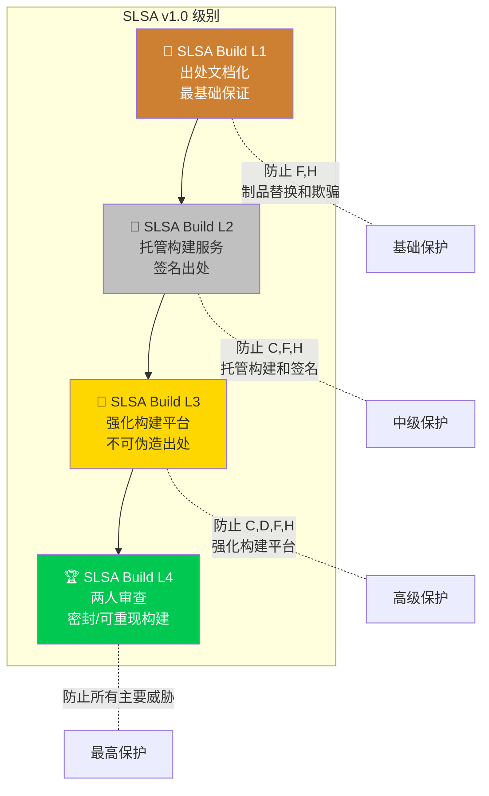
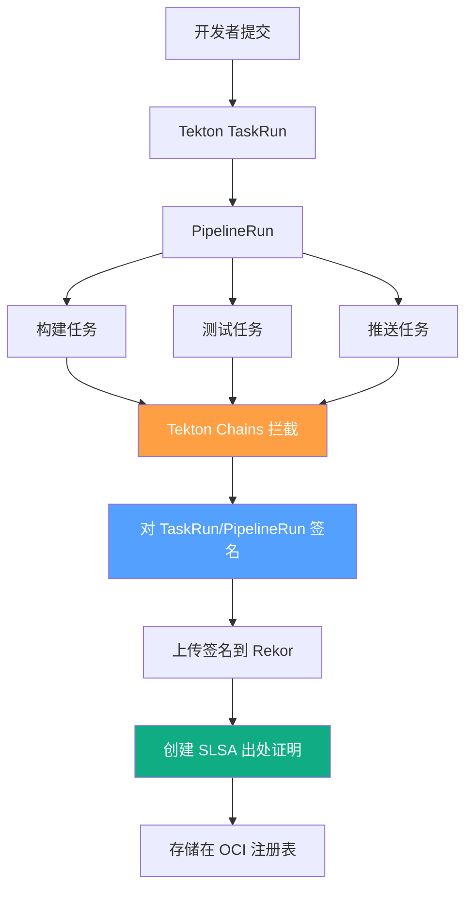

> **生产环境安全提示**
>
> 本文档包含可直接执行的运维命令。执行前请确认：当前目标集群与 Namespace 是否正确；是否具备足够的 RBAC 权限；是否已在非生产环境验证。命令风险等级标注：🔴 高风险（可能造成数据丢失或服务中断）、🟡 中风险（会修改集群状态，但通常可回滚）、🟢 低风险/只读（信息收集，无副作用）。


# SLSA 级别与实施 (SLSA Levels and Implementation)

> SLSA（Supply chain Levels for Software Artifacts）是系统化保护软件供应链的行业框架，通过渐进式级别要求帮助组织防范构建过程篡改和制品完整性攻击。

---

<!-- chunk: 目录 (Table of Contents) -->## 目录 (Table of Contents)

1. [SLSA 框架概述](#1-slsa-框架概述)
2. [SLSA 级别详解 L1-L4](#2-slsa-级别详解-l1-l4)
3. [构建出处 (Build Provenance)](#3-构建出处-build-provenance)
4. [源码完整性 (Source Integrity)](#4-源码完整性-source-integrity)
5. [密封构建 (Hermetic Builds)](#5-密封构建-hermetic-builds)
6. [可重现构建 (Reproducible Builds)](#6-可重现构建-reproducible-builds)
7. [GitHub Actions 实施指南](#7-github-actions-实施指南)
8. [Tekton Chains 实施指南](#8-tekton-chains-实施指南)
9. [SLSA 出处验证](#9-slsa-出处验证)
10. [SLSA 策略执行](#10-slsa-策略执行)
11. [组织级 SLSA 实施路径](#11-组织级-slsa-实施路径)
12. [SLSA v1.0 新特性](#12-slsa-v10-新特性)

---

<!-- chunk: 1. SLSA 框架概述 -->## 1. SLSA 框架概述

## 1.1 SLSA 设计理念

SLSA（读作 "salsa"）是 Google 在 2021 年提出并开源给 OpenSSF 维护的供应链安全框架。其核心理念是：

```
SLSA 核心问题:
"我如何确信这个软件制品确实来自声明的源码，
且构建过程未被篡改？"

回答方式:
通过可验证的、机器可读的出处（Provenance）证明
```

```mermaid
graph LR
    Source[源代码\n(Commit Hash)] --> Build[构建系统\n(Verified Builder)]
    Build --> Artifact[制品\n(Signed + Provenance)]
    
    User[用户/消费者] --> Verify{验证出处}
    Verify --> |"证明: 制品来自\n指定源码和构建器"| Trust[信任制品]
    Verify --> |"无法证明"| Reject[拒绝制品]
    
    Artifact --> Verify
    Source --> Verify
    Build --> Verify
```

## 1.2 SLSA 防御的威胁

```
SLSA 防御矩阵 (SLSA v1.0):

威胁类型                           L1   L2   L3   L4
─────────────────────────────────────────────────────
A: 提交恶意代码                    ❌   ❌   ~    ✅
B: 修改源码（仓库外）               ❌   ❌   ~    ✅
C: 构建中注入恶意内容               ❌   ✅   ✅   ✅
D: 使用恶意构建平台                 ❌   ❌   ✅   ✅
E: 使用恶意依赖                    ❌   ❌   ~    ~
F: 上传非构建产生的制品              ❌   ✅   ✅   ✅
G: 从存储中破坏制品                 ❌   ❌   ❌   ✅
H: 欺骗消费者使用恶意制品            ❌   ✅   ✅   ✅

✅ = 完全防御  ~ = 部分防御  ❌ = 不防御
```

## 1.3 SLSA v1.0 架构

```
SLSA v1.0 核心概念:

构建定义 (Build Definition):
  ─ 外部参数 (externalParameters): 用户指定的构建输入
  ─ 解析的依赖 (resolvedDependencies): 实际使用的依赖及其版本

运行详情 (Run Details):
  ─ 构建器 (builder): 执行构建的系统标识
  ─ 元数据 (metadata): 构建调用 ID、时间等
  ─ 拜拜依赖 (byproducts): 构建副产品（日志等）

出处声明 (Provenance Statement):
  ─ 主体 (subject): 构建产生的制品
  ─ 谓词 (predicate): 构建信息（BuildDefinition + RunDetails）
```

---

<!-- chunk: 2. SLSA 级别详解 L1-L4 -->## 2. SLSA 级别详解 L1-L4

## 2.1 总体概览



## 2.2 SLSA Build L1 详解

**要求概述：** 提供基础的构建出处，证明制品来自特定源码。

```
SLSA L1 要求:

构建:
  ✅ 脚本化构建 - 构建过程必须全部脚本化，无手动步骤
  ✅ 出处文档 - 提供机器可读的出处文档

出处质量要求:
  ✅ 格式: 符合 SLSA 出处格式（v0.1 或 v1.0）
  ✅ 内容: 包含构建器标识和源码引用
  ❌ 签名: 不要求（L2 开始要求）
  ❌ 不可伪造: 不要求

防御能力:
  ─ 防止意外的制品替换（通过出处可验证）
  ─ 基本的构建透明度

适用场景:
  ─ 内部工具和项目
  ─ 合规性基线要求
  ─ 开始供应链安全旅程的组织
```

**L1 实现示例：**

```yaml
# L1: 最小化出处生成
name: SLSA L1 Build

on:
  push:
    tags: ['v*']

jobs:
  build:
    runs-on: ubuntu-latest
    steps:
      - uses: actions/checkout@v4
      
      - name: Build
        id: build
        run: |
          make build
          sha256sum ./dist/myapp > ./dist/myapp.sha256
      
      - name: Generate L1 Provenance
        run: |
          cat > provenance.json << EOF
          {
            "_type": "https://in-toto.io/Statement/v0.1",
            "predicateType": "https://slsa.dev/provenance/v1",
            "subject": [{
              "name": "myapp",
              "digest": {
                "sha256": "$(sha256sum ./dist/myapp | awk '{print $1}')"
              }
            }],
            "predicate": {
              "buildDefinition": {
                "buildType": "https://github.com/actions/runner@v2",
                "externalParameters": {
                  "workflow": "${{ github.workflow }}",
                  "ref": "${{ github.ref }}"
                }
              },
              "runDetails": {
                "builder": {
                  "id": "https://github.com/actions/runner"
                },
                "metadata": {
                  "invocationID": "${{ github.run_id }}/${{ github.run_attempt }}",
                  "startedOn": "$(date -u +%Y-%m-%dT%H:%M:%SZ)"
                }
              }
            }
          }
          EOF
      
      - name: Upload artifacts
        uses: actions/upload-artifact@v4
        with:
          name: myapp-${{ github.ref_name }}
          path: |
            ./dist/myapp
            ./dist/myapp.sha256
            ./provenance.json
```

## 2.3 SLSA Build L2 详解

**要求概述：** 使用托管构建服务，出处由构建服务生成并签名，防止篡改。

```
SLSA L2 额外要求（在 L1 基础上）:

构建:
  ✅ 托管构建服务 - 必须使用 GitHub Actions/GitLab CI/CircleCI 等
  ✅ 出处由构建服务生成 - 不能由用户代码生成

出处质量要求:
  ✅ 非伪造 - 构建者无法伪造自己的出处
  ✅ 签名 - 出处必须经过签名
  ✅ 来自托管平台 - 证明使用了托管构建服务

关键区别（vs L1）:
  L1: 用户自己生成并可能伪造出处
  L2: 托管平台生成且用户无法伪造

防御威胁 C: 防止在构建中注入恶意内容
```

**L2 使用 SLSA GitHub Generator：**

```yaml
# L2: 使用官方 SLSA GitHub Generator
name: SLSA L2 Build

on:
  push:
    tags: ['v*']

permissions:
  contents: read
  id-token: write  # 用于 OIDC 令牌

jobs:
  # 1. 构建二进制文件
  build:
    runs-on: ubuntu-latest
    outputs:
      hashes: ${{ steps.hash.outputs.hashes }}
    steps:
      - uses: actions/checkout@b4ffde65f46336ab88eb53be808477a3936bae11
      
      - name: Build binary
        run: |
          make build
          # 创建 dist 目录
          mkdir -p dist
          cp ./bin/myapp dist/
      
      - name: Calculate hashes
        id: hash
        run: |
          cd dist
          sha256sum myapp > SHA256SUMS
          echo "hashes=$(cat SHA256SUMS | base64 -w0)" >> $GITHUB_OUTPUT
      
      - uses: actions/upload-artifact@c7d193f32edcb7bfad88892161225aeda64e9392
        with:
          name: binary
          path: dist/

  # 2. SLSA 出处生成（由 SLSA Generator 生成，不可伪造）
  provenance:
    needs: [build]
    permissions:
      actions: read
      id-token: write
      contents: write
    uses: slsa-framework/slsa-github-generator/.github/workflows/generator_generic_slsa3.yml@v2.0.0
    with:
      base64-subjects: "${{ needs.build.outputs.hashes }}"
      upload-assets: true  # 上传到 GitHub Release

  # 3. 发布到 GitHub Release
  release:
    needs: [build, provenance]
    runs-on: ubuntu-latest
    permissions:
      contents: write
    steps:
      - uses: actions/download-artifact@7a1cd3216ca9260cd8022db641d960b1db4d1be4
        with:
          name: binary
      
      - name: Release
        uses: softprops/action-gh-release@9d7c94cfd0a1f3ed45544c887983e9fa900f0564
        with:
          files: |
            myapp
            SHA256SUMS
```

## 2.4 SLSA Build L3 详解

**要求概述：** 强化的构建平台，提供不可伪造的出处，构建者无法访问签名密钥。

```
SLSA L3 额外要求（在 L2 基础上）:

构建:
  ✅ 强化构建平台 - 构建平台本身受到安全保护
  ✅ 不可伪造出处 - 即使是平台管理员也无法伪造
  ✅ 构建者无法访问签名密钥 - 密钥由 Sigstore/OIDC 管理

出处质量要求:
  ✅ 所有依赖固定 - 使用 commit hash 而非标签
  ✅ 构建参数完整 - 所有影响构建的参数都记录
  ✅ 不可变出处 - 透明日志（Rekor）中记录

关键区别（vs L2）:
  L2: 托管服务生成，但平台可能被 compromise
  L3: 平台强化，即使平台被攻击也无法伪造出处

防御威胁 D: 防止使用恶意构建平台
```

**L3 容器镜像构建：**

```yaml
# L3: 容器镜像 SLSA 出处生成
name: SLSA L3 Container Build

on:
  push:
    tags: ['v*']

permissions:
  contents: read
  packages: write
  id-token: write  # 必须，用于 OIDC 无密钥签名

env:
  REGISTRY: ghcr.io
  IMAGE_NAME: ${{ github.repository }}

jobs:
  # 容器镜像的 SLSA L3 出处
  build-and-provenance:
    permissions:
      contents: read
      packages: write
      id-token: write
    uses: slsa-framework/slsa-github-generator/.github/workflows/generator_container_slsa3.yml@v2.0.0
    with:
      image: ghcr.io/${{ github.repository }}
      digest: ${{ needs.build.outputs.digest }}
      registry-username: ${{ github.actor }}
    secrets:
      registry-password: ${{ secrets.GITHUB_TOKEN }}

  # 独立构建步骤（在 uses 工作流调用前）
  build:
    runs-on: ubuntu-latest
    permissions:
      contents: read
      packages: write
    outputs:
      image: ${{ steps.image.outputs.image }}
      digest: ${{ steps.build.outputs.digest }}
    steps:
      - uses: actions/checkout@b4ffde65f46336ab88eb53be808477a3936bae11
      
      - name: Setup Docker Buildx
        uses: docker/setup-buildx-action@f95db51fddba0c2d1ec667646a06c2ce06100226
      
      - name: Login to GHCR
        uses: docker/login-action@343f7c4344506bcbf9b4de18042ae17996df046d
        with:
          registry: ${{ env.REGISTRY }}
          username: ${{ github.actor }}
          password: ${{ secrets.GITHUB_TOKEN }}
      
      - name: Extract metadata
        id: meta
        uses: docker/metadata-action@96383f45573cb7f253c731d3b3ab81c87ef81934
        with:
          images: ${{ env.REGISTRY }}/${{ env.IMAGE_NAME }}
          tags: |
            type=semver,pattern={{version}}
            type=sha
      
      - name: Build and push
        id: build
        uses: docker/build-push-action@0565240e2d4ab88bba5387d719585280857ece09
        with:
          context: .
          push: true
          tags: ${{ steps.meta.outputs.tags }}
          labels: ${{ steps.meta.outputs.labels }}
          # 重要: 固定所有基础镜像到 SHA
          # 在 Dockerfile 中使用 FROM ubuntu@sha256:xxx
          provenance: mode=max  # 生成最大出处信息
          sbom: true           # 包含 SBOM
      
      - name: Set image output
        id: image
        run: |
          echo "image=${{ env.REGISTRY }}/${{ env.IMAGE_NAME }}" >> $GITHUB_OUTPUT
```

## 2.5 SLSA Build L4 详解

**要求概述：** 最高级别保证，要求密封构建、可重现构建和两人审查。

```
SLSA L4 额外要求（在 L3 基础上）:

源码要求:
  ✅ 两人审查 - 所有代码变更必须经过至少2人审查
  ✅ 保留历史记录 - 无法修改提交历史

构建要求:
  ✅ 密封构建 - 构建过程中不允许网络访问
  ✅ 可重现构建 - 相同输入产生完全相同的输出
  ✅ 构建出处必须满足以上所有要求

验证要求:
  ✅ 消费者必须验证出处

达到 L4 的挑战:
  ─ 密封构建需要预先获取所有依赖
  ─ 可重现构建需要消除时间戳、随机性等因素
  ─ 需要专门的构建系统支持（如 Bazel）

当前支持 L4 的构建系统:
  ─ Google Cloud Build（部分）
  ─ Bazel Remote Execution
  ─ 自定义构建系统
```

---

<!-- chunk: 3. 构建出处 (Build Provenance) -->## 3. 构建出处 (Build Provenance)

## 3.1 出处格式规范

```json
// SLSA v1.0 出处格式完整示例
{
  "_type": "https://in-toto.io/Statement/v1",
  "subject": [
    {
      "name": "pkg:docker/myorg/myapp@v1.2.3",
      "digest": {
        "sha256": "9f86d081884c7d659a2feaa0c55ad015a3bf4f1b2b0b822cd15d6c15b0f00a08"
      }
    },
    {
      "name": "myapp-linux-amd64",
      "digest": {
        "sha256": "abc123def456789012345678901234567890123456789012345678901234567890"
      }
    }
  ],
  "predicateType": "https://slsa.dev/provenance/v1",
  "predicate": {
    "buildDefinition": {
      "buildType": "https://github.com/slsa-framework/slsa-github-generator/container@v1",
      "externalParameters": {
        "workflow": {
          "ref": "refs/tags/v1.2.3",
          "repository": "https://github.com/myorg/myapp",
          "path": ".github/workflows/release.yml"
        }
      },
      "internalParameters": {
        "github": {
          "event_name": "push",
          "repository_id": "12345678",
          "repository_owner_id": "87654321"
        }
      },
      "resolvedDependencies": [
        {
          "uri": "git+https://github.com/myorg/myapp@refs/tags/v1.2.3",
          "digest": {
            "gitCommit": "abc123def456789012345678901234567890123456"
          }
        },
        {
          "uri": "https://github.com/actions/checkout@v4",
          "digest": {
            "gitCommit": "b4ffde65f46336ab88eb53be808477a3936bae11"
          }
        }
      ]
    },
    "runDetails": {
      "builder": {
        "id": "https://github.com/slsa-framework/slsa-github-generator/.github/workflows/generator_container_slsa3.yml@refs/tags/v2.0.0",
        "version": {
          "slsa-github-generator": "2.0.0"
        },
        "builderDependencies": [
          {
            "uri": "https://github.com/sigstore/cosign",
            "digest": {
              "sha256": "..."
            }
          }
        ]
      },
      "metadata": {
        "invocationID": "https://github.com/myorg/myapp/actions/runs/12345678/attempts/1",
        "startedOn": "2024-01-15T10:00:00Z",
        "finishedOn": "2024-01-15T10:05:30Z"
      },
      "byproducts": [
        {
          "name": "build-log",
          "uri": "https://github.com/myorg/myapp/actions/runs/12345678"
        }
      ]
    }
  }
}
```

## 3.2 in-toto 证明框架

in-toto 是 SLSA 出处的底层框架，提供通用的供应链完整性证明机制。

```python
#!/usr/bin/env python3
"""in-toto 证明生成示例"""

# pip install in-toto

import json
from datetime import datetime, timezone

def generate_slsa_provenance(
    artifact_name: str,
    artifact_sha256: str,
    source_repo: str,
    source_commit: str,
    workflow_path: str,
    run_id: str,
    builder_id: str
) -> dict:
    """生成符合 SLSA v1.0 的出处文档"""
    
    now = datetime.now(timezone.utc).isoformat()
    
    provenance = {
        "_type": "https://in-toto.io/Statement/v1",
        "subject": [
            {
                "name": artifact_name,
                "digest": {
                    "sha256": artifact_sha256
                }
            }
        ],
        "predicateType": "https://slsa.dev/provenance/v1",
        "predicate": {
            "buildDefinition": {
                "buildType": "https://github.com/actions/runner@v2",
                "externalParameters": {
                    "workflow": {
                        "ref": f"refs/heads/main",
                        "repository": source_repo,
                        "path": workflow_path
                    }
                },
                "resolvedDependencies": [
                    {
                        "uri": f"git+{source_repo}@refs/heads/main",
                        "digest": {
                            "gitCommit": source_commit
                        }
                    }
                ]
            },
            "runDetails": {
                "builder": {
                    "id": builder_id
                },
                "metadata": {
                    "invocationID": run_id,
                    "startedOn": now,
                    "finishedOn": now
                }
            }
        }
    }
    
    return provenance


# 验证 SLSA 出处
def verify_provenance_fields(provenance: dict) -> list:
    """验证出处文档的必要字段"""
    issues = []
    
    # 检查 subject
    subjects = provenance.get("subject", [])
    if not subjects:
        issues.append("Missing 'subject' field")
    else:
        for s in subjects:
            if not s.get("name"):
                issues.append("Subject missing 'name' field")
            if not s.get("digest"):
                issues.append("Subject missing 'digest' field")
            else:
                if not any(k in s["digest"] for k in ["sha256", "sha512", "gitCommit"]):
                    issues.append("Subject digest must have sha256, sha512, or gitCommit")
    
    # 检查 predicateType
    if provenance.get("predicateType") not in [
        "https://slsa.dev/provenance/v0.1",
        "https://slsa.dev/provenance/v0.2",
        "https://slsa.dev/provenance/v1"
    ]:
        issues.append("Invalid or missing predicateType")
    
    # 检查 predicate
    predicate = provenance.get("predicate", {})
    build_def = predicate.get("buildDefinition", {})
    
    if not build_def.get("buildType"):
        issues.append("Missing buildDefinition.buildType")
    
    run_details = predicate.get("runDetails", {})
    builder = run_details.get("builder", {})
    
    if not builder.get("id"):
        issues.append("Missing runDetails.builder.id")
    
    metadata = run_details.get("metadata", {})
    if not metadata.get("invocationID"):
        issues.append("Missing runDetails.metadata.invocationID")
    
    return issues
```

## 3.3 构建参数完整性

```bash
#!/bin/bash
# provenance-capture.sh
# 完整捕获构建参数用于出处记录

set -euo pipefail

# 捕获所有影响构建的参数
capture_build_context() {
  local OUTPUT_FILE="${1:-build-context.json}"
  
  # 1. 源码信息
  GIT_COMMIT=$(git rev-parse HEAD)
  GIT_REF=$(git symbolic-ref HEAD 2>/dev/null || echo "detached")
  GIT_REPO=$(git remote get-url origin 2>/dev/null || echo "local")
  GIT_DIRTY=$(git diff --quiet && echo "false" || echo "true")
  
  # 2. 构建环境信息
  BUILD_DATE=$(date -u +%Y-%m-%dT%H:%M:%SZ)
  GO_VERSION=$(go version 2>/dev/null | awk '{print $3}' || echo "unknown")
  NODE_VERSION=$(node --version 2>/dev/null || echo "unknown")
  PYTHON_VERSION=$(python3 --version 2>/dev/null | awk '{print $2}' || echo "unknown")
  OS_INFO=$(uname -a)
  
  # 3. 依赖锁定信息
  GO_SUM_HASH=""
  if [ -f "go.sum" ]; then
    GO_SUM_HASH=$(sha256sum go.sum | awk '{print $1}')
  fi
  
  NPM_LOCK_HASH=""
  if [ -f "package-lock.json" ]; then
    NPM_LOCK_HASH=$(sha256sum package-lock.json | awk '{print $1}')
  fi
  
  # 4. 生成上下文文档
  cat > "$OUTPUT_FILE" << EOF
{
  "source": {
    "repository": "${GIT_REPO}",
    "commit": "${GIT_COMMIT}",
    "ref": "${GIT_REF}",
    "isDirty": ${GIT_DIRTY}
  },
  "build": {
    "timestamp": "${BUILD_DATE}",
    "hostname": "$(hostname -f 2>/dev/null || hostname)",
    "tools": {
      "go": "${GO_VERSION}",
      "node": "${NODE_VERSION}",
      "python": "${PYTHON_VERSION}"
    },
    "os": "${OS_INFO}"
  },
  "dependencies": {
    "goSumHash": "${GO_SUM_HASH}",
    "npmLockHash": "${NPM_LOCK_HASH}"
  }
}
EOF

  echo "Build context captured: $OUTPUT_FILE"
  cat "$OUTPUT_FILE"
}

capture_build_context "build-context.json"
```

---

<!-- chunk: 4. 源码完整性 (Source Integrity) -->## 4. 源码完整性 (Source Integrity)

## 4.1 Git 提交完整性保护

``` bash
# 🟢 低风险：只读/信息收集，通常无副作用
# 源码完整性保护措施

# ============ 1. 强制 GPG 签名 ============

# 生成 GPG 密钥
gpg --full-generate-key
# 推荐: RSA 4096位，有效期1年

# 配置 Git 签名
GPG_KEY_ID=$(gpg --list-secret-keys --keyid-format LONG | \
  grep "sec" | awk '{print $2}' | cut -d/ -f2 | head -1)

git config --global user.signingkey "${GPG_KEY_ID}"
git config --global commit.gpgsign true
git config --global tag.gpgsign true

# 验证提交签名
git log --show-signature --format="%H %GK %GS" HEAD~5..HEAD

# 验证特定 commit
git verify-commit abc123def456

# ============ 2. GitHub 强制签名提交 ============

# 通过 GitHub CLI 配置分支保护
gh api -X PUT repos/{owner}/{repo}/branches/main/protection \
  -H "Accept: application/vnd.github+json" \
  --input - << 'EOF'
{
  "required_status_checks": null,
  "enforce_admins": true,
  "required_pull_request_reviews": {
    "required_approving_review_count": 2,
    "dismiss_stale_reviews": true,
    "require_code_owner_reviews": true,
    "require_last_push_approval": true
  },
  "restrictions": null,
  "required_linear_history": true,
  "allow_force_pushes": false,
  "allow_deletions": false,
  "block_creations": false,
  "required_conversation_resolution": true,
  "required_signatures": true
}
EOF

# ============ 3. 代码所有者 CODEOWNERS ============

cat > .github/CODEOWNERS << 'EOF'
# 全局所有者
* @security-team

# 关键文件需要安全团队审查
.github/workflows/ @security-team @devops-team
Dockerfile @security-team @platform-team
go.mod @security-team
go.sum @security-team
package.json @security-team
package-lock.json @security-team

# 基础设施代码
terraform/ @security-team @platform-team
kubernetes/ @security-team @platform-team
EOF
```
## 4.2 源码审计追踪

```python
#!/usr/bin/env python3
"""源码提交安全分析"""

import subprocess
import json
import re
from typing import List, Dict

def analyze_git_security(repo_path: str = ".") -> Dict:
    """分析 Git 仓库的安全状态"""
    results = {
        "unsigned_commits": [],
        "force_push_history": [],
        "large_commits": [],
        "suspicious_patterns": []
    }
    
    # 1. 检查未签名的提交（最近100个）
    cmd = ["git", "log", "--format=%H %GK %G?", "-100"]
    output = subprocess.check_output(cmd, cwd=repo_path).decode()
    
    for line in output.strip().split('\n'):
        parts = line.split()
        if len(parts) >= 3:
            commit_hash = parts[0]
            key_id = parts[1] if len(parts) > 1 else ""
            sign_status = parts[2] if len(parts) > 2 else ""
            
            # G = Good, B = Bad, U = Unknown, X = Expired, Y = Good untrusted, N = No sig
            if sign_status in ["N", "U", ""]:
                results["unsigned_commits"].append({
                    "hash": commit_hash[:12],
                    "status": "unsigned" if sign_status == "N" else "unknown_key"
                })
    
    # 2. 检查大型提交（可能是二进制文件注入）
    cmd = ["git", "log", "--format=%H", "--diff-filter=A", "-100"]
    output = subprocess.check_output(cmd, cwd=repo_path).decode()
    
    for commit_hash in output.strip().split('\n')[:20]:
        if not commit_hash:
            continue
        cmd = ["git", "diff-tree", "--no-commit-id", "-r", 
               "--name-only", "--diff-filter=A", commit_hash]
        files = subprocess.check_output(cmd, cwd=repo_path).decode().strip().split('\n')
        
        for f in files:
            if f.endswith(('.exe', '.dll', '.so', '.dylib', '.jar', '.war', '.bin')):
                results["large_commits"].append({
                    "commit": commit_hash[:12],
                    "file": f,
                    "concern": "Binary file added"
                })
    
    # 3. 检查可疑模式（密钥、凭据）
    secret_patterns = [
        (r'(?i)(password|passwd|pwd)\s*=\s*["\'][^"\']+["\']', "Password pattern"),
        (r'(?i)(api[_-]?key|apikey)\s*=\s*["\'][^"\']+["\']', "API key pattern"),
        (r'AKIA[0-9A-Z]{16}', "AWS access key"),
        (r'-----BEGIN (RSA |EC )?PRIVATE KEY-----', "Private key"),
    ]
    
    for pattern, description in secret_patterns:
        cmd = ["git", "log", "-p", "--all", "--format=", "-100", "--", "*.yaml", "*.yml", "*.json", "*.env"]
        try:
            output = subprocess.check_output(cmd, cwd=repo_path, stderr=subprocess.DEVNULL).decode(errors='replace')
            
            if re.search(pattern, output):
                results["suspicious_patterns"].append({
                    "pattern": description,
                    "action_required": "Review history for potential credential exposure"
                })
        except subprocess.CalledProcessError:
            pass
    
    return results


def print_security_report(results: Dict) -> None:
    """打印安全分析报告"""
    print("\n=== 源码完整性分析报告 ===\n")
    
    unsigned = results["unsigned_commits"]
    print(f"未签名提交: {len(unsigned)}")
    if unsigned[:5]:
        for c in unsigned[:5]:
            print(f"  - {c['hash']} ({c['status']})")
    
    binaries = results["large_commits"]
    if binaries:
        print(f"\n⚠️  二进制文件提交: {len(binaries)}")
        for b in binaries:
            print(f"  - {b['commit']}: {b['file']} ({b['concern']})")
    
    secrets = results["suspicious_patterns"]
    if secrets:
        print(f"\n🚨 可疑模式: {len(secrets)}")
        for s in secrets:
            print(f"  - {s['pattern']}: {s['action_required']}")
    
    if not unsigned and not binaries and not secrets:
        print("✅ 源码完整性检查通过")


if __name__ == "__main__":
    results = analyze_git_security()
    print_security_report(results)
```

---

<!-- chunk: 5. 密封构建 (Hermetic Builds) -->## 5. 密封构建 (Hermetic Builds)

## 5.1 密封构建原则

```
密封构建 (Hermetic Builds) 原则:

定义: 构建过程中不允许访问外部网络或文件系统的任何外部资源
目标: 构建结果仅依赖于明确声明的输入

禁止的操作:
  ❌ 构建时动态下载依赖（npm install, go get, pip install）
  ❌ 从互联网获取构建脚本或工具
  ❌ 访问外部 API 或服务
  ❌ 使用当前时间作为版本号组成部分

必须的准备:
  ✅ 所有依赖预先下载并固定到特定哈希
  ✅ 构建工具版本固定
  ✅ 网络隔离
  ✅ 文件系统只读（除输出目录）
```

## 5.2 实现密封的 Go 构建

```dockerfile
# 密封 Go 构建 Dockerfile

# ====== 阶段1: 依赖预获取（网络访问阶段）======
FROM golang:1.21.6-alpine3.19@sha256:2523a6f68a0f515fe251aad40b18545155101053da6ae8a1db05b51c7f37e42 AS deps

WORKDIR /build

# 仅复制依赖文件
COPY go.mod go.sum ./

# 下载并验证所有依赖（有网络访问）
RUN go mod download -x && go mod verify

# ====== 阶段2: 密封构建（无网络访问）======
FROM golang:1.21.6-alpine3.19@sha256:2523a6f68a0f515fe251aad40b18545155101053da6ae8a1db05b51c7f37e42 AS builder

WORKDIR /build

# 从 deps 阶段复制已下载的依赖（离线）
COPY --from=deps /root/go/pkg/mod /root/go/pkg/mod
COPY --from=deps /build/go.sum /build/go.sum

# 复制源码
COPY . .

# 密封构建：禁止网络访问
# -mod=readonly 确保不修改 go.sum
# GOFLAGS=-mod=readonly 防止任何下载
RUN CGO_ENABLED=0 \
    GOOS=linux \
    GOARCH=amd64 \
    GOFLAGS="-mod=readonly -trimpath" \
    GONOSUMDB="*" \
    GOPROXY="off" \  # 完全禁用代理（密封构建）
    go build \
    -ldflags="-s -w \
      -X main.version=$(cat VERSION) \
      -X main.commit=$(git rev-parse --short HEAD 2>/dev/null || echo 'unknown')" \
    -o /build/app \
    ./cmd/server

# 验证构建结果
RUN file /build/app && \
    /build/app --version

# ====== 阶段3: 最小化运行时镜像 ======
FROM scratch

COPY --from=builder /etc/ssl/certs/ca-certificates.crt /etc/ssl/certs/
COPY --from=builder /etc/passwd /etc/passwd
COPY --from=builder /build/app /app

USER 65534:65534
EXPOSE 8080
ENTRYPOINT ["/app"]
```

## 5.3 Bazel 密封构建

```python
# BUILD.bazel - Bazel 密封构建配置
# Bazel 原生支持密封构建和可重现构建

load("@io_bazel_rules_go//go:def.bzl", "go_binary", "go_library")
load("@rules_oci//oci:defs.bzl", "oci_image", "oci_push")

# 定义 Go 二进制目标
go_binary(
    name = "myapp",
    embed = [":myapp_lib"],
    gc_linkopts = ["-s", "-w"],  # 剥离调试符号
    pure = "on",  # CGO 禁用（密封构建要求）
    static = "on",  # 静态链接
)

# 定义 OCI 镜像（使用固定的基础镜像摘要）
oci_image(
    name = "myapp_image",
    base = "@distroless_base",  # 在 WORKSPACE 中固定到 SHA
    entrypoint = ["/myapp"],
    tars = [":myapp_layer"],
)

# WORKSPACE 中的密封依赖声明
# go_deps 使用固定版本
```

```starlark
# WORKSPACE.bazel
load("@bazel_tools//tools/build_defs/repo:http.bzl", "http_archive")

# 固定到具体 SHA（密封要求）
http_archive(
    name = "io_bazel_rules_go",
    sha256 = "6b65cb7917b4d1709f9410ffe00ecf3e160edf674b78c54a894471320862184f",
    urls = [
        "https://mirror.bazel.build/github.com/bazelbuild/rules_go/releases/download/v0.39.1/rules_go-v0.39.1.zip",
        "https://github.com/bazelbuild/rules_go/releases/download/v0.39.1/rules_go-v0.39.1.zip",
    ],
)

# 基础镜像固定到 SHA（不使用 tag）
http_file(
    name = "distroless_base",
    url = "https://gcr.io/distroless/base@sha256:73deaaf6a207c1a33850257ba74e0f196bc418636abb89986a1af35e7dc90c4b",
    sha256 = "73deaaf6a207c1a33850257ba74e0f196bc418636abb89986a1af35e7dc90c4b",
)
```

## 5.4 网络隔离构建配置

```yaml
# Kubernetes Job - 密封构建（无网络访问）
apiVersion: batch/v1
kind: Job
metadata:
  name: hermetic-build-$(date +%s)
  labels:
    app: builder
    build-type: hermetic
spec:
  template:
    metadata:
      annotations:
        # 记录构建元数据用于出处
        build.slsa.dev/hermetic: "true"
    spec:
      # 禁用服务账号令牌（减少网络访问）
      automountServiceAccountToken: false
      
      # 安全上下文
      securityContext:
        runAsNonRoot: true
        runAsUser: 65534
        seccompProfile:
          type: RuntimeDefault
      
      # 使用预拉取的镜像（不从网络拉取）
      imagePullPolicy: Never
      
      initContainers:
        # 预先从缓存中加载依赖
        - name: load-deps
          image: "internal.registry.io/build-cache:latest"
          command: ["cp", "-r", "/cache/go", "/workspace/go-cache"]
          volumeMounts:
            - name: workspace
              mountPath: /workspace
      
      containers:
        - name: builder
          image: "internal.registry.io/go-builder:1.21.6"
          
          # 完全隔离网络
          # 在 NetworkPolicy 中额外限制
          
          securityContext:
            allowPrivilegeEscalation: false
            readOnlyRootFilesystem: true
            capabilities:
              drop: [ALL]
          
          env:
            # 禁用 Go 代理（密封构建）
            - name: GOPROXY
              value: "off"
            - name: GONOSUMDB
              value: "*"
            - name: GOFLAGS
              value: "-mod=readonly"
            # 使用缓存的依赖
            - name: GOPATH
              value: "/workspace/gopath"
            - name: GOCACHE
              value: "/workspace/gocache"
          
          command:
            - /bin/sh
            - -c
            - |
              set -euo pipefail
              cd /workspace/source
              go build -o /workspace/output/myapp ./cmd/server
              sha256sum /workspace/output/myapp > /workspace/output/myapp.sha256
          
          volumeMounts:
            - name: workspace
              mountPath: /workspace
            - name: source
              mountPath: /workspace/source
              readOnly: true
            - name: output
              mountPath: /workspace/output
      
      volumes:
        - name: workspace
          emptyDir: {}
        - name: source
          persistentVolumeClaim:
            claimName: build-source-pvc
        - name: output
          persistentVolumeClaim:
            claimName: build-output-pvc
      
      restartPolicy: Never
  
  backoffLimit: 1
```

---

<!-- chunk: 6. 可重现构建 (Reproducible Builds) -->## 6. 可重现构建 (Reproducible Builds)

## 6.1 可重现构建基础

```
可重现构建 (Reproducible Builds):

定义: 给定相同输入，任何人在任何地方构建都产生完全相同的输出
     （字节级别相同，sha256 哈希完全一致）

挑战因素（需要消除）:
  1. 时间戳 - 构建系统嵌入当前时间
  2. 随机性 - 某些工具使用随机数
  3. 路径信息 - 编译器路径嵌入二进制
  4. 文件排序 - 文件系统遍历顺序不确定
  5. 并发 - 并行构建结果可能不同
  6. 环境变量 - 影响构建结果的环境变量
  7. 版本 - 构建工具版本差异

Go 可重现构建最佳实践:
  ─ 使用 -trimpath 去除绝对路径
  ─ 设置 CGO_ENABLED=0
  ─ 固定 GOOS, GOARCH
  ─ 使用 -mod=readonly
  ─ 固定 Go 版本
```

## 6.2 Go 可重现构建实现

```bash
#!/bin/bash
# reproducible-build.sh - Go 可重现构建脚本

set -euo pipefail

VERSION="${VERSION:-$(cat VERSION 2>/dev/null || echo 'dev')}"
GIT_COMMIT="${GIT_COMMIT:-$(git rev-parse --short HEAD 2>/dev/null || echo 'unknown')}"

# 消除时间戳影响 - 使用 git commit 时间
GIT_DATE=$(git log -1 --format=%ct HEAD 2>/dev/null || echo "0")
SOURCE_DATE_EPOCH="${GIT_DATE}"

export SOURCE_DATE_EPOCH

# 可重现构建标志
LDFLAGS="-s -w"
LDFLAGS+=" -X main.version=${VERSION}"
LDFLAGS+=" -X main.commit=${GIT_COMMIT}"
# 注意：不能嵌入构建时间，因为这会破坏可重现性
# LDFLAGS+=" -X main.buildDate=$(date ...)" # 错误！

BUILD_FLAGS=(
  "-trimpath"         # 移除绝对路径
  "-mod=readonly"     # 不修改依赖
  "-ldflags=${LDFLAGS}"
)

# 构建
CGO_ENABLED=0 \
GOOS=linux \
GOARCH=amd64 \
GOVERSION="$(go version | awk '{print $3}')" \
go build "${BUILD_FLAGS[@]}" \
  -o "./dist/myapp-linux-amd64" \
  "./cmd/server"

# 计算哈希
sha256sum "./dist/myapp-linux-amd64" > "./dist/myapp-linux-amd64.sha256"

echo "Build complete!"
echo "Hash: $(cat ./dist/myapp-linux-amd64.sha256)"

# 验证可重现性（重新构建并比较）
echo ""
echo "Verifying reproducibility..."

# 第二次构建
CGO_ENABLED=0 \
GOOS=linux \
GOARCH=amd64 \
go build "${BUILD_FLAGS[@]}" \
  -o "./dist/myapp-linux-amd64-verify" \
  "./cmd/server"

# 比较
HASH1=$(sha256sum "./dist/myapp-linux-amd64" | awk '{print $1}')
HASH2=$(sha256sum "./dist/myapp-linux-amd64-verify" | awk '{print $1}')

if [ "${HASH1}" = "${HASH2}" ]; then
  echo "✅ 构建是可重现的！"
  echo "  Hash: ${HASH1}"
else
  echo "❌ 构建不可重现！"
  echo "  Build 1: ${HASH1}"
  echo "  Build 2: ${HASH2}"
  exit 1
fi
```

## 6.3 Docker 镜像可重现构建

```dockerfile
# 可重现的容器镜像构建

# 使用 SHA256 摘要固定基础镜像（而非标签）
FROM golang:1.21.6-alpine3.19@sha256:2523a6f68a0f515fe251aad40b18545155101053da6ae8a1db05b51c7f37e42 AS builder

# 使用 SOURCE_DATE_EPOCH 设置文件时间戳
ARG SOURCE_DATE_EPOCH=0

WORKDIR /build

# 固定 APK 包版本（如需要）
RUN apk add --no-cache \
  ca-certificates=20230506-r0 \
  tzdata=2023c-r1

COPY go.mod go.sum ./
RUN GOPROXY=off go mod download

COPY . .

# 可重现构建
RUN CGO_ENABLED=0 \
    GOOS=linux \
    GOARCH=amd64 \
    go build \
    -trimpath \
    -mod=readonly \
    -ldflags="-s -w" \
    -o /build/app \
    ./cmd/server

# 最终镜像
FROM scratch

# 固定文件时间戳（用于镜像可重现性）
ARG SOURCE_DATE_EPOCH=0

COPY --from=builder /etc/ssl/certs/ca-certificates.crt /etc/ssl/certs/
COPY --from=builder /build/app /app

USER 65534:65534
ENTRYPOINT ["/app"]
```

``` bash
# 🟢 低风险：只读/信息收集，通常无副作用
# 构建可重现镜像
SOURCE_DATE_EPOCH=$(git log -1 --format=%ct HEAD)

docker build \
  --build-arg "SOURCE_DATE_EPOCH=${SOURCE_DATE_EPOCH}" \
  --no-cache \  # 不使用缓存确保可重现
  --tag "myapp:v1.0.0" \
  .

# 获取镜像摘要
DIGEST=$(docker inspect --format='{{index .RepoDigests 0}}' myapp:v1.0.0 2>/dev/null || \
  docker images --no-trunc --format "{{.ID}}" myapp:v1.0.0 | head -1)

echo "Image digest: ${DIGEST}"

# 验证可重现性
docker build \
  --build-arg "SOURCE_DATE_EPOCH=${SOURCE_DATE_EPOCH}" \
  --no-cache \
  --tag "myapp:v1.0.0-verify" \
  .

DIGEST2=$(docker images --no-trunc --format "{{.ID}}" myapp:v1.0.0-verify | head -1)

if [ "${DIGEST}" = "${DIGEST2}" ]; then
  echo "✅ Docker 镜像构建是可重现的！"
else
  echo "❌ Docker 镜像不可重现"
  # 调试差异
  docker image inspect myapp:v1.0.0 --format '{{.RootFS.Layers}}' | tr ' ' '\n'
  docker image inspect myapp:v1.0.0-verify --format '{{.RootFS.Layers}}' | tr ' ' '\n'
fi
```
---

<!-- chunk: 7. GitHub Actions 实施指南 -->## 7. GitHub Actions 实施指南

## 7.1 完整的 SLSA L3 工作流

```yaml
# .github/workflows/slsa-l3-release.yml
name: SLSA L3 Release Build

on:
  push:
    tags:
      - 'v[0-9]+.[0-9]+.[0-9]+'

permissions:
  contents: read

jobs:
  # ==========================================
  # 1. 安全预检
  # ==========================================
  pre-checks:
    runs-on: ubuntu-latest
    steps:
      - uses: actions/checkout@b4ffde65f46336ab88eb53be808477a3936bae11
        with:
          fetch-depth: 0
      
      # 验证标签是从经过审查的 commit 创建的
      - name: Verify tag commit
        run: |
          TAG_COMMIT=$(git rev-list -n 1 ${{ github.ref_name }})
          echo "Building tag: ${{ github.ref_name }}"
          echo "Commit: ${TAG_COMMIT}"
          
          # 检查 commit 是否在主分支上
          git branch -r --contains "${TAG_COMMIT}" | grep "origin/main" || {
            echo "ERROR: Tag commit is not on main branch!"
            exit 1
          }
      
      # 验证所有 Actions 固定到 SHA
      - name: Verify pinned actions
        run: |
          UNPINNED=$(grep -r "uses:" .github/workflows/ | \
            grep -v "@[a-f0-9]\{40\}" | \
            grep -v "^#" || true)
          
          if [ -n "$UNPINNED" ]; then
            echo "ERROR: Unpinned actions found:"
            echo "$UNPINNED"
            exit 1
          fi
          echo "✅ All actions pinned to commit SHAs"
  
  # ==========================================
  # 2. 构建多平台二进制
  # ==========================================
  build:
    needs: pre-checks
    runs-on: ubuntu-latest
    permissions:
      contents: read
    outputs:
      hashes: ${{ steps.hash.outputs.hashes }}
      release-artifacts: ${{ steps.artifacts.outputs.paths }}
    
    steps:
      - uses: actions/checkout@b4ffde65f46336ab88eb53be808477a3936bae11
        with:
          # 确保不检出浅层克隆（影响版本信息）
          fetch-depth: 0
      
      - name: Setup Go
        uses: actions/setup-go@0c52d547c9bc32b1aa3301fd7a9cb496313a4491
        with:
          go-version-file: 'go.mod'
          cache: true
      
      - name: Verify dependencies
        run: |
          go mod verify
          echo "✅ Go module checksums verified"
      
      - name: Build binaries
        env:
          VERSION: ${{ github.ref_name }}
          COMMIT: ${{ github.sha }}
        run: |
          mkdir -p dist
          
          PLATFORMS=(
            "linux/amd64"
            "linux/arm64"
            "darwin/amd64"
            "darwin/arm64"
            "windows/amd64"
          )
          
          for PLATFORM in "${PLATFORMS[@]}"; do
            OS="${PLATFORM%/*}"
            ARCH="${PLATFORM#*/}"
            OUTPUT="dist/myapp-${OS}-${ARCH}"
            [ "${OS}" = "windows" ] && OUTPUT="${OUTPUT}.exe"
            
            CGO_ENABLED=0 \
            GOOS="${OS}" \
            GOARCH="${ARCH}" \
            go build \
              -trimpath \
              -mod=readonly \
              -ldflags="-s -w -X main.version=${VERSION} -X main.commit=${COMMIT}" \
              -o "${OUTPUT}" \
              ./cmd/server
            
            echo "Built: ${OUTPUT}"
          done
          
          # 生成 SHA256 校验和
          cd dist && sha256sum * > SHA256SUMS
      
      - name: Calculate hashes for SLSA
        id: hash
        run: |
          cd dist
          echo "hashes=$(sha256sum * | base64 -w0)" >> $GITHUB_OUTPUT
      
      - name: Store artifact paths
        id: artifacts
        run: |
          echo "paths=$(ls dist/ | tr '\n' ' ')" >> $GITHUB_OUTPUT
      
      - name: Upload build artifacts
        uses: actions/upload-artifact@c7d193f32edcb7bfad88892161225aeda64e9392
        with:
          name: build-artifacts-${{ github.sha }}
          path: dist/
          if-no-files-found: error
          retention-days: 5
  
  # ==========================================
  # 3. SLSA L3 出处生成（不可伪造）
  # ==========================================
  provenance:
    needs: [build]
    permissions:
      actions: read
      id-token: write
      contents: write
    # 使用 SLSA Generator - 此工作流由 SLSA Generator 控制，不可伪造
    uses: slsa-framework/slsa-github-generator/.github/workflows/generator_generic_slsa3.yml@v2.0.0
    with:
      base64-subjects: "${{ needs.build.outputs.hashes }}"
      upload-assets: true
      compile-generator: true  # 从源码编译 generator（更高安全性）
  
  # ==========================================
  # 4. 容器镜像构建和 SLSA 出处
  # ==========================================
  container-build:
    needs: pre-checks
    runs-on: ubuntu-latest
    permissions:
      contents: read
      packages: write
      id-token: write
    outputs:
      image: ${{ steps.meta.outputs.tags }}
      digest: ${{ steps.build.outputs.digest }}
    
    steps:
      - uses: actions/checkout@b4ffde65f46336ab88eb53be808477a3936bae11
      
      - name: Setup Docker Buildx
        uses: docker/setup-buildx-action@f95db51fddba0c2d1ec667646a06c2ce06100226
      
      - name: Login to GHCR
        uses: docker/login-action@343f7c4344506bcbf9b4de18042ae17996df046d
        with:
          registry: ghcr.io
          username: ${{ github.actor }}
          password: ${{ secrets.GITHUB_TOKEN }}
      
      - name: Docker metadata
        id: meta
        uses: docker/metadata-action@96383f45573cb7f253c731d3b3ab81c87ef81934
        with:
          images: ghcr.io/${{ github.repository }}
          tags: |
            type=semver,pattern={{version}}
            type=semver,pattern={{major}}.{{minor}}
          labels: |
            org.opencontainers.image.vendor=MyCompany
            org.opencontainers.image.licenses=Apache-2.0
      
      - name: Build and push container
        id: build
        uses: docker/build-push-action@0565240e2d4ab88bba5387d719585280857ece09
        with:
          context: .
          push: true
          tags: ${{ steps.meta.outputs.tags }}
          labels: ${{ steps.meta.outputs.labels }}
          sbom: true
          provenance: mode=max
          cache-from: type=gha
          cache-to: type=gha,mode=max
          platforms: linux/amd64,linux/arm64
  
  container-provenance:
    needs: [container-build]
    permissions:
      actions: read
      id-token: write
      packages: write
    uses: slsa-framework/slsa-github-generator/.github/workflows/generator_container_slsa3.yml@v2.0.0
    with:
      image: ghcr.io/${{ github.repository }}
      digest: ${{ needs.container-build.outputs.digest }}
      registry-username: ${{ github.actor }}
    secrets:
      registry-password: ${{ secrets.GITHUB_TOKEN }}
  
  # ==========================================
  # 5. 最终发布
  # ==========================================
  release:
    needs: [build, provenance, container-provenance]
    runs-on: ubuntu-latest
    permissions:
      contents: write
    
    steps:
      - name: Download artifacts
        uses: actions/download-artifact@7a1cd3216ca9260cd8022db641d960b1db4d1be4
        with:
          name: build-artifacts-${{ github.sha }}
          path: dist/
      
      - name: Create GitHub Release
        uses: softprops/action-gh-release@9d7c94cfd0a1f3ed45544c887983e9fa900f0564
        with:
          files: dist/*
          generate_release_notes: true
          body: |
            <!-- chunk: Release ${{ github.ref_name }} -->## Release ${{ github.ref_name }}
            
            #<!-- chunk: Supply Chain Security -->## Supply Chain Security
            - ✅ SLSA L3 Provenance available
            - ✅ Container image signed with Sigstore/Cosign
            - ✅ SBOM generated (CycloneDX format)
            
            #<!-- chunk: Verification -->## Verification
            ```bash
            # Verify binary provenance
            slsa-verifier verify-artifact myapp-linux-amd64 \
              --provenance-path myapp-linux-amd64.intoto.jsonl \
              --source-uri github.com/${{ github.repository }} \
              --source-tag ${{ github.ref_name }}
            
            # Verify container image
            cosign verify \
              --certificate-identity "https://github.com/${{ github.repository }}/.github/workflows/slsa-l3-release.yml@${{ github.ref }}" \
              --certificate-oidc-issuer "https://token.actions.githubusercontent.com" \
              ghcr.io/${{ github.repository }}:${{ github.ref_name }}
            ```
```

---

<!-- chunk: 8. Tekton Chains 实施指南 -->## 8. Tekton Chains 实施指南

## 8.1 Tekton Chains 架构



## 8.2 Tekton Chains 安装配置

> ⚠️ **🟡 中危变更** — 变更集群资源状态，建议先 --dry-run 或 diff 确认
> - `kubectl apply/create/replace`：创建/变更集群资源
> - `kubectl edit/patch`：修改运行中的资源

``` bash
# 🟡 中风险：会修改集群/资源状态，执行前请确认目标、影响范围与授权
# 安装 Tekton Pipelines
kubectl apply -f https://storage.googleapis.com/tekton-releases/pipeline/latest/release.yaml

# 安装 Tekton Chains
kubectl apply -f https://storage.googleapis.com/tekton-releases/chains/latest/release.yaml

# 配置 Tekton Chains（签名和出处）
kubectl patch configmap chains-config \
  -n tekton-chains \
  --type merge \
  -p '{
    "data": {
      "artifacts.taskrun.format": "slsa/v1",
      "artifacts.taskrun.storage": "oci",
      "artifacts.pipelinerun.format": "slsa/v1",
      "artifacts.pipelinerun.storage": "oci",
      "artifacts.oci.storage": "oci",
      "signers.x509.fulcio.address": "https://fulcio.sigstore.dev",
      "signers.x509.rekor.address": "https://rekor.sigstore.dev",
      "transparency.enabled": "true",
      "transparency.url": "https://rekor.sigstore.dev"
    }
  }'

# 配置 Cosign 密钥对（或使用 OIDC 无密钥）
cosign generate-key-pair k8s://tekton-chains/signing-secrets

# 验证 Chains 安装
kubectl get pods -n tekton-chains
kubectl get configmap chains-config -n tekton-chains -o yaml
```
## 8.3 Tekton Pipeline 配置

```yaml
# tekton-slsa-pipeline.yaml
apiVersion: tekton.dev/v1
kind: Pipeline
metadata:
  name: slsa-build-pipeline
  annotations:
    tekton.dev/displayName: "SLSA L2+ Build Pipeline"
spec:
  description: |
    Build pipeline that produces SLSA L2 provenance
    using Tekton Chains.
  
  params:
    - name: git-url
      type: string
      description: Git repository URL
    - name: git-revision
      type: string
      description: Git revision (commit/tag/branch)
    - name: image-name
      type: string
      description: Output container image name
    - name: image-tag
      type: string
      description: Output container image tag
  
  workspaces:
    - name: source
    - name: dockerconfig
      optional: true
  
  results:
    - name: IMAGE_URL
      value: $(tasks.build-image.results.IMAGE_URL)
    - name: IMAGE_DIGEST
      value: $(tasks.build-image.results.IMAGE_DIGEST)
    - name: CHAINS-GIT_COMMIT
      value: $(tasks.git-clone.results.commit)
    - name: CHAINS-GIT_URL
      value: $(tasks.git-clone.results.url)
  
  tasks:
    # 克隆源码
    - name: git-clone
      taskRef:
        resolver: bundles
        params:
          - name: bundle
            value: gcr.io/tekton-releases/catalog/upstream/git-clone:0.9
          - name: name
            value: git-clone
          - name: kind
            value: task
      params:
        - name: url
          value: $(params.git-url)
        - name: revision
          value: $(params.git-revision)
      workspaces:
        - name: output
          workspace: source
    
    # 运行测试
    - name: run-tests
      runAfter: [git-clone]
      taskRef:
        name: run-go-tests
      workspaces:
        - name: source
          workspace: source
    
    # 漏洞扫描（构建前）
    - name: scan-deps
      runAfter: [git-clone]
      taskRef:
        name: trivy-scan
      params:
        - name: image
          value: aquasec/trivy:latest
        - name: scan-type
          value: fs
        - name: fail-on-severity
          value: "CRITICAL"
      workspaces:
        - name: source
          workspace: source
    
    # 构建容器镜像
    - name: build-image
      runAfter: [run-tests, scan-deps]
      taskRef:
        resolver: bundles
        params:
          - name: bundle
            value: gcr.io/tekton-releases/catalog/upstream/kaniko:0.6
          - name: name
            value: kaniko
          - name: kind
            value: task
      params:
        - name: IMAGE
          value: "$(params.image-name):$(params.image-tag)"
        - name: CONTEXT
          value: .
        - name: EXTRA_ARGS
          value:
            - "--cache=true"
            - "--cache-repo=$(params.image-name)/cache"
            - "--snapshot-mode=redo"
            - "--label=org.opencontainers.image.revision=$(tasks.git-clone.results.commit)"
      workspaces:
        - name: source
          workspace: source
        - name: dockerconfig
          workspace: dockerconfig
    
    # 签名镜像
    - name: sign-image
      runAfter: [build-image]
      taskRef:
        name: cosign-sign
      params:
        - name: image
          value: "$(params.image-name)@$(tasks.build-image.results.IMAGE_DIGEST)"
```

---

<!-- chunk: 9. SLSA 出处验证 -->## 9. SLSA 出处验证

## 9.1 slsa-verifier 工具

```bash
# 安装 slsa-verifier
go install github.com/slsa-framework/slsa-verifier/v2/cli/slsa-verifier@latest

# 验证二进制文件出处
slsa-verifier verify-artifact ./myapp-linux-amd64 \
  --provenance-path ./myapp-linux-amd64.intoto.jsonl \
  --source-uri "github.com/myorg/myapp" \
  --source-tag "v1.2.3"

# 成功输出示例:
# Verified signature against tlog entry index 12345678 at URL:
# https://rekor.sigstore.dev/api/v1/log/entries/...
# Verified build using builder https://github.com/slsa-framework/slsa-github-generator/
# .github/workflows/generator_generic_slsa3.yml@refs/tags/v2.0.0
# Verifying artifact myapp-linux-amd64: PASSED

# 验证容器镜像出处
slsa-verifier verify-image \
  "ghcr.io/myorg/myapp:v1.2.3@sha256:abc123..." \
  --source-uri "github.com/myorg/myapp" \
  --source-tag "v1.2.3"

# 验证并提取出处信息
slsa-verifier verify-artifact ./myapp-linux-amd64 \
  --provenance-path ./myapp-linux-amd64.intoto.jsonl \
  --source-uri "github.com/myorg/myapp" \
  --print-provenance | jq .
```

## 9.2 Cosign 验证

```bash
# 使用 Cosign 验证 SLSA 出处证明

# 安装 Cosign
brew install cosign

# 验证镜像签名
cosign verify \
  --certificate-identity="https://github.com/myorg/myapp/.github/workflows/slsa-l3-release.yml@refs/tags/v1.2.3" \
  --certificate-oidc-issuer="https://token.actions.githubusercontent.com" \
  "ghcr.io/myorg/myapp:v1.2.3"

# 验证并显示签名详情
cosign verify \
  --certificate-identity-regexp="^https://github.com/myorg/myapp/.*" \
  --certificate-oidc-issuer="https://token.actions.githubusercontent.com" \
  --output-file signature-details.json \
  "ghcr.io/myorg/myapp:v1.2.3"

cat signature-details.json | jq '.[] | {
  subject: .optional.subject,
  issuer: .optional.Issuer,
  workflow: .optional.workflow,
  ref: .optional.ref
}'

# 验证 SLSA 出处证明（attached attestation）
cosign verify-attestation \
  --type slsaprovenance \
  --certificate-identity="https://github.com/slsa-framework/slsa-github-generator/.github/workflows/generator_container_slsa3.yml@refs/tags/v2.0.0" \
  --certificate-oidc-issuer="https://token.actions.githubusercontent.com" \
  "ghcr.io/myorg/myapp:v1.2.3" | \
  jq '.payload | @base64d | fromjson | .predicate'

# 验证 SBOM 证明
cosign verify-attestation \
  --type cyclonedx \
  --certificate-identity-regexp="^https://github.com/myorg/myapp/.*" \
  --certificate-oidc-issuer="https://token.actions.githubusercontent.com" \
  "ghcr.io/myorg/myapp:v1.2.3" | \
  jq '.payload | @base64d | fromjson'
```

## 9.3 自动化出处验证脚本

```python
#!/usr/bin/env python3
"""SLSA 出处自动化验证"""

import subprocess
import json
import sys
from typing import Optional

def verify_slsa_provenance(
    image: str,
    expected_source: str,
    expected_workflow: Optional[str] = None,
    min_slsa_level: int = 2
) -> dict:
    """验证容器镜像的 SLSA 出处"""
    
    result = {
        "image": image,
        "verified": False,
        "slsa_level": 0,
        "source": None,
        "builder": None,
        "errors": []
    }
    
    # 1. 使用 cosign 验证签名
    try:
        cmd = [
            "cosign", "verify-attestation",
            "--type", "slsaprovenance",
            "--certificate-identity-regexp", 
            f"^https://github.com/{expected_source}/.*",
            "--certificate-oidc-issuer",
            "https://token.actions.githubusercontent.com",
            image
        ]
        
        output = subprocess.check_output(
            cmd, 
            stderr=subprocess.DEVNULL
        ).decode()
        
        # 解析出处
        for line in output.strip().split('\n'):
            try:
                attestation = json.loads(line)
                payload = json.loads(
                    __import__('base64').b64decode(attestation["payload"] + "==").decode()
                )
                
                predicate = payload.get("predicate", {})
                run_details = predicate.get("runDetails", {})
                builder = run_details.get("builder", {})
                build_def = predicate.get("buildDefinition", {})
                
                result["source"] = build_def.get("externalParameters", {}).get("workflow", {}).get("repository")
                result["builder"] = builder.get("id", "")
                
                # 判断 SLSA 级别
                if "slsa-github-generator" in result["builder"]:
                    if "generator_container_slsa3" in result["builder"] or \
                       "generator_generic_slsa3" in result["builder"]:
                        result["slsa_level"] = 3
                    else:
                        result["slsa_level"] = 2
                else:
                    result["slsa_level"] = 1
                
                break
            except (json.JSONDecodeError, KeyError):
                continue
        
        # 验证结果
        if result["slsa_level"] < min_slsa_level:
            result["errors"].append(f"SLSA level {result['slsa_level']} < required {min_slsa_level}")
        
        if result["source"] and expected_source not in result["source"]:
            result["errors"].append(f"Source mismatch: expected {expected_source}, got {result['source']}")
        
        if not result["errors"]:
            result["verified"] = True
            
    except subprocess.CalledProcessError as e:
        result["errors"].append(f"Cosign verification failed: {e}")
    except FileNotFoundError:
        result["errors"].append("cosign not found - please install cosign")
    
    return result


def main():
    images_to_verify = [
        {
            "image": "ghcr.io/myorg/myapp:v1.2.3",
            "source": "myorg/myapp",
            "min_slsa_level": 3
        },
        {
            "image": "ghcr.io/myorg/mylib:v2.0.0", 
            "source": "myorg/mylib",
            "min_slsa_level": 2
        }
    ]
    
    all_passed = True
    
    for item in images_to_verify:
        result = verify_slsa_provenance(
            item["image"],
            item["source"],
            min_slsa_level=item.get("min_slsa_level", 2)
        )
        
        status = "✅ PASSED" if result["verified"] else "❌ FAILED"
        print(f"\n{status}: {result['image']}")
        print(f"  SLSA Level: {result['slsa_level']}")
        print(f"  Source: {result['source'] or 'unknown'}")
        print(f"  Builder: {result['builder'] or 'unknown'}")
        
        if result["errors"]:
            print(f"  Errors:")
            for err in result["errors"]:
                print(f"    - {err}")
            all_passed = False
    
    sys.exit(0 if all_passed else 1)


if __name__ == "__main__":
    main()
```

---

<!-- chunk: 10. SLSA 策略执行 -->## 10. SLSA 策略执行

## 10.1 Kyverno SLSA 策略

```yaml
# Kyverno 策略: 要求 SLSA L2+ 出处
apiVersion: kyverno.io/v1
kind: ClusterPolicy
metadata:
  name: require-slsa-provenance
  annotations:
    policies.kyverno.io/title: Require SLSA Provenance
    policies.kyverno.io/category: Supply Chain Security
    policies.kyverno.io/severity: high
    policies.kyverno.io/description: >-
      Requires all container images in production namespace
      to have valid SLSA L2+ provenance verified by Cosign.
spec:
  validationFailureAction: enforce
  background: true
  webhookTimeoutSeconds: 30
  
  rules:
    # 规则1: 验证 SLSA 出处
    - name: verify-slsa-provenance
      match:
        any:
          - resources:
              kinds: [Pod]
              namespaces:
                - production
                - staging
      verifyImages:
        - imageReferences:
            - "ghcr.io/myorg/*"
          attestations:
            - predicateType: "https://slsa.dev/provenance/v1"
              conditions:
                - all:
                    # 验证构建器是 SLSA GitHub Generator
                    - key: "{{ predicate.runDetails.builder.id }}"
                      operator: AnyIn
                      value:
                        - "https://github.com/slsa-framework/slsa-github-generator/.github/workflows/generator_container_slsa3.yml@refs/tags/v2.0.0"
                    # 验证源码来自受信任的仓库
                    - key: "{{ predicate.buildDefinition.externalParameters.workflow.repository }}"
                      operator: AnyIn
                      value:
                        - "https://github.com/myorg/myapp"
                        - "https://github.com/myorg/mylib"
          attestors:
            - count: 1
              entries:
                - keyless:
                    subject: "https://github.com/slsa-framework/slsa-github-generator/.github/workflows/generator_container_slsa3.yml@refs/tags/v2.0.0"
                    issuer: "https://token.actions.githubusercontent.com"
                    rekor:
                      url: https://rekor.sigstore.dev
    
    # 规则2: 阻止使用 latest 标签
    - name: disallow-latest-tag
      match:
        any:
          - resources:
              kinds: [Pod]
              namespaces: [production]
      validate:
        message: "Production images must use specific version tags, not 'latest'"
        foreach:
          - list: "request.object.spec.containers"
            deny:
              conditions:
                any:
                  - key: "{{element.image}}"
                    operator: Contains
                    value: ":latest"
```

## 10.2 OPA Gatekeeper SLSA 策略

```rego
# rego/slsa-policy.rego
package kubernetes.slsa

import future.keywords.if
import future.keywords.in

# 要求 SLSA L2+ 的命名空间
required_slsa_namespaces := {"production", "staging"}

# 受信任的 SLSA Generator
trusted_builders := {
  "https://github.com/slsa-framework/slsa-github-generator/.github/workflows/generator_container_slsa3.yml@refs/tags/v2.0.0",
  "https://github.com/slsa-framework/slsa-github-generator/.github/workflows/generator_container_slsa3.yml@refs/tags/v1.10.0"
}

# 受信任的镜像仓库
trusted_registries := {
  "ghcr.io/myorg/",
  "us-central1-docker.pkg.dev/myproject/",
  "internal.registry.company.com/"
}

# 拒绝未验证 SLSA 出处的 Pod
deny[msg] if {
  input.review.kind.kind == "Pod"
  namespace := input.review.object.metadata.namespace
  namespace in required_slsa_namespaces
  
  container := input.review.object.spec.containers[_]
  
  # 检查镜像是否来自受信任仓库
  not image_from_trusted_registry(container.image)
  
  msg := sprintf(
    "Container '%v' uses image '%v' from untrusted registry. Use images from: %v",
    [container.name, container.image, trusted_registries]
  )
}

# 检查镜像是否有 SLSA 注解
deny[msg] if {
  input.review.kind.kind == "Pod"
  namespace := input.review.object.metadata.namespace
  namespace in required_slsa_namespaces
  
  container := input.review.object.spec.containers[_]
  annotations := input.review.object.metadata.annotations
  
  slsa_key := sprintf("slsa.dev/provenance/%v", [container.name])
  not annotations[slsa_key]
  
  msg := sprintf(
    "Container '%v' missing SLSA provenance annotation '%v'",
    [container.name, slsa_key]
  )
}

# 辅助函数
image_from_trusted_registry(image) if {
  registry := trusted_registries[_]
  startswith(image, registry)
}
```

---

<!-- chunk: 11. 组织级 SLSA 实施路径 -->## 11. 组织级 SLSA 实施路径

## 11.1 渐进式实施计划

```yaml
# 组织级 SLSA 实施路线图

phase_1_foundation (月1-2, 目标 L1):
  
  week_1_2:
    目标: "所有项目脚本化构建"
    任务:
      - 审计当前构建流程
      - 识别手动构建步骤
      - 将所有构建迁移到 GitHub Actions/GitLab CI
    成功标准: "100% 项目使用 CI/CD 构建"
    
  week_3_4:
    目标: "基础出处生成"
    任务:
      - 在 CI 中添加基础出处记录
      - 固定所有 GitHub Actions 到 commit SHA
      - 启用 OIDC 令牌权限
    成功标准: "所有发布制品附带出处文档"

phase_2_managed (月3-4, 目标 L2):
  
  month_3:
    目标: "使用 SLSA GitHub Generator"
    任务:
      - 二进制发布迁移到 slsa-github-generator
      - 验证出处签名到 Rekor
      - 验证出处完整性
    成功标准: "关键项目的 slsa-verifier 验证通过"
    
  month_4:
    目标: "容器镜像 SLSA L2"
    任务:
      - 集成 generator_container_slsa3 工作流
      - 启用镜像 Cosign 签名
      - 部署基础 Kyverno 策略（审计模式）
    成功标准: "100% 容器镜像有 SLSA 出处"

phase_3_hardened (月5-8, 目标 L3):
  
  month_5_6:
    目标: "强化构建平台"
    任务:
      - 全面使用 SLSA GitHub Generator（不可伪造出处）
      - 固定所有依赖到 commit SHA
      - 实施 CODEOWNERS 和强制审查
    成功标准: "SLSA L3 评估通过（试点项目）"
    
  month_7_8:
    目标: "策略执行"
    任务:
      - Kyverno 策略从审计切换到强制执行
      - 所有生产部署需要 SLSA L3 出处
      - 建立出处监控和告警
    成功标准: "生产环境 100% SLSA L3 合规"

phase_4_optimize (月9-12, 向 L4 进发):
  
  tasks:
    - 评估可重现构建可行性
    - 研究密封构建方案（Bazel/Nix）
    - 实施两人代码审查政策
    - 建立 SLSA 合规度量
```

## 11.2 组织 SLSA 评估工具

```python
#!/usr/bin/env python3
"""组织 SLSA 成熟度评估工具"""

import subprocess
import json
import os
from typing import Dict, List
from github import Github  # pip install PyGithub

class OrganizationSLSAAssessment:
    """评估 GitHub 组织的 SLSA 实施状态"""
    
    def __init__(self, org_name: str, github_token: str):
        self.org_name = org_name
        self.gh = Github(github_token)
        self.org = self.gh.get_organization(org_name)
    
    def assess_repository(self, repo_name: str) -> Dict:
        """评估单个仓库的 SLSA 实施状态"""
        repo = self.org.get_repo(repo_name)
        
        result = {
            "name": repo_name,
            "slsa_level": 0,
            "checks": {}
        }
        
        # 1. 检查是否有 CI/CD
        has_workflows = False
        try:
            workflows = repo.get_workflows()
            has_workflows = workflows.totalCount > 0
        except:
            pass
        result["checks"]["has_ci_cd"] = has_workflows
        
        # 2. 检查 Actions 是否固定到 SHA
        pinned_actions = True
        try:
            contents = repo.get_contents(".github/workflows")
            for content in contents:
                workflow = content.decoded_content.decode()
                import re
                unpinned = re.findall(r'uses:\s+[^\s@]+@(?!v?\d+\.\d+)(?![a-f0-9]{40})[^\s]+', workflow)
                if unpinned:
                    pinned_actions = False
                    break
        except:
            pinned_actions = None
        result["checks"]["pinned_actions"] = pinned_actions
        
        # 3. 检查是否使用 SLSA Generator
        uses_slsa_generator = False
        try:
            contents = repo.get_contents(".github/workflows")
            for content in contents:
                workflow = content.decoded_content.decode()
                if "slsa-github-generator" in workflow:
                    uses_slsa_generator = True
                    break
        except:
            pass
        result["checks"]["uses_slsa_generator"] = uses_slsa_generator
        
        # 4. 检查分支保护
        branch_protected = False
        try:
            protection = repo.get_branch("main").get_protection()
            branch_protected = True
        except:
            try:
                protection = repo.get_branch("master").get_protection()
                branch_protected = True
            except:
                pass
        result["checks"]["branch_protected"] = branch_protected
        
        # 5. 检查是否有 Cosign 签名
        uses_cosign = False
        try:
            contents = repo.get_contents(".github/workflows")
            for content in contents:
                workflow = content.decoded_content.decode()
                if "cosign" in workflow.lower():
                    uses_cosign = True
                    break
        except:
            pass
        result["checks"]["uses_cosign"] = uses_cosign
        
        # 计算 SLSA 级别
        if has_workflows:
            result["slsa_level"] = 0
            
            if has_workflows:
                result["slsa_level"] = 1
            
            if result["slsa_level"] >= 1 and uses_slsa_generator:
                result["slsa_level"] = 2
            
            if result["slsa_level"] >= 2 and pinned_actions and branch_protected:
                result["slsa_level"] = 3
        
        return result
    
    def assess_organization(self, max_repos: int = 50) -> List[Dict]:
        """评估整个组织"""
        results = []
        
        for repo in list(self.org.get_repos())[:max_repos]:
            if repo.archived:
                continue
            
            print(f"Assessing {repo.name}...")
            assessment = self.assess_repository(repo.name)
            results.append(assessment)
        
        return results
    
    def generate_org_report(self, assessments: List[Dict]) -> None:
        """生成组织级报告"""
        level_dist = {}
        for a in assessments:
            level = a["slsa_level"]
            level_dist[level] = level_dist.get(level, 0) + 1
        
        print(f"\n{'='*60}")
        print(f"组织 SLSA 成熟度报告: {self.org_name}")
        print(f"{'='*60}")
        print(f"评估仓库数: {len(assessments)}")
        
        print(f"\nSLSA 级别分布:")
        for level in sorted(level_dist.keys()):
            count = level_dist[level]
            bar = "█" * count
            pct = count / len(assessments) * 100
            print(f"  L{level}: {count:3d} ({pct:5.1f}%) {bar}")
        
        avg_level = sum(a["slsa_level"] for a in assessments) / len(assessments)
        print(f"\n平均 SLSA 级别: {avg_level:.2f}")
        
        print(f"\n需要改进的仓库 (SLSA < L2):")
        for a in sorted(assessments, key=lambda x: x["slsa_level"]):
            if a["slsa_level"] < 2:
                issues = [k for k, v in a["checks"].items() if not v]
                print(f"  {a['name']:40s} L{a['slsa_level']} | 缺少: {', '.join(issues)}")
```

---

<!-- chunk: 12. SLSA v1.0 新特性 -->## 12. SLSA v1.0 新特性

## 12.1 SLSA v0.1 → v1.0 主要变化

```
SLSA v1.0 重大更新 (2023年4月发布):

架构变化:
─ 引入 "Build Track" 和 "Source Track"（分离）
─ Build L1-L3 替代原来的 L1-L4
─ Source Track 独立于 Build Track
─ 更清晰的"构建平台"vs"构建者"定义

出处格式变化:
v0.1 出处: buildType, recipe, invocation, materials
v1.0 出处: buildDefinition, runDetails（更清晰的语义）

最重要的变化:
─ v0.1 L4 → v1.0 L3 (降低了最高要求，更易实现)
─ v1.0 增加了 "Source Track" 来处理源码完整性
─ v1.0 出处格式与 in-toto Statement v1 对齐

向后兼容:
─ v0.2 出处仍然受 slsa-verifier 支持
─ 建议新项目使用 v1.0
─ 现有 v0.1/v0.2 项目可逐步迁移
```

## 12.2 SLSA Source Track（实验性）

```yaml
# SLSA Source Track L2+ 要求
# (仍在规范化中，以下为当前草案要求)

SLSA_Source_L1:
  要求:
    - 版本控制系统托管
    - 每个变更有唯一不可变标识符
    - 保留历史记录（不可修改）
  防御:
    - 防止构建使用未跟踪的源码

SLSA_Source_L2:
  在 L1 基础上:
    - 变更需经过审查流程
    - 审查人不得与提交者相同（两人规则）
  防御:
    - 防止内部恶意代码注入

SLSA_Source_L3:
  在 L2 基础上:
    - 变更历史完全不可修改
    - 任何变更必须有可溯源的身份
    - 分支保护确保不可绕过审查
  防御:
    - 防止高权限用户绕过审查
```

## 12.3 未来展望

```
SLSA 未来发展方向:

1. Source Track 正式化
   ─ 将在 SLSA v2.0 中包含
   ─ 需要 OIDC/工作负载身份与 Git 平台集成

2. 依赖追踪
   ─ SLSA Dependencies Track（计划中）
   ─ 追踪构建使用的每个依赖的 SLSA 级别
   ─ 传递性 SLSA 要求

3. 跨平台支持
   ─ Tekton, Jenkins, CircleCI 的 SLSA 原生支持
   ─ 混合云构建环境
   ─ 本地构建的出处生成

4. 与 SBOM 深度集成
   ─ SLSA 出处中包含 SBOM 引用
   ─ 自动化漏洞追溯到特定构建
   ─ SBOM + 出处的联合验证
```

---

<!-- chunk: 参考资料与工具 -->## 参考资料与工具

## 官方资源

| 资源 | 链接 |
|------|------|
| SLSA 官网 | https://slsa.dev |
| SLSA v1.0 规范 | https://slsa.dev/spec/v1.0 |
| SLSA GitHub Generator | https://github.com/slsa-framework/slsa-github-generator |
| slsa-verifier | https://github.com/slsa-framework/slsa-verifier |
| in-toto | https://in-toto.io |
| Tekton Chains | https://tekton.dev/docs/chains/ |
| Sigstore | https://sigstore.dev |
| Rekor | https://rekor.sigstore.dev |

## 实施工具

```bash
# 供应链安全工具完整安装脚本
#!/bin/bash

echo "安装 SLSA 和供应链安全工具..."

# 1. Cosign - 制品签名
brew install cosign || \
  go install github.com/sigstore/cosign/v2/cmd/cosign@latest

# 2. slsa-verifier - SLSA 出处验证
go install github.com/slsa-framework/slsa-verifier/v2/cli/slsa-verifier@latest

# 3. Syft - SBOM 生成
curl -sSfL https://raw.githubusercontent.com/anchore/syft/main/install.sh | \
  sh -s -- -b /usr/local/bin

# 4. Grype - 漏洞扫描
curl -sSfL https://raw.githubusercontent.com/anchore/grype/main/install.sh | \
  sh -s -- -b /usr/local/bin

# 5. vexctl - VEX 管理
go install github.com/openvex/vexctl/cmd/vexctl@latest

# 6. Trivy - 综合安全扫描
brew install aquasecurity/trivy/trivy || \
  curl -sfL https://raw.githubusercontent.com/aquasecurity/trivy/main/contrib/install.sh | \
    sh -s -- -b /usr/local/bin

# 7. OpenSSF Scorecard - 项目安全评估
go install github.com/ossf/scorecard/v4/cmd/scorecard@latest

echo "✅ 所有工具安装完成！"

# 验证安装
echo ""
echo "工具版本:"
cosign version 2>/dev/null | head -1
slsa-verifier version 2>/dev/null | head -1
syft version 2>/dev/null | head -1
grype version 2>/dev/null | head -1
trivy --version 2>/dev/null | head -1
```

---

*本文档全面覆盖 SLSA 框架从理论到实践的完整内容，帮助组织系统化地提升供应链安全级别。*
*版本: 1.0 | 最后更新: 2024年*

---

<!-- chunk: Obsidian 相关文档 -->## Obsidian 相关文档

- 安全 KUDIG Database — Global MOC
- [[安全/README.md|[[Domain 39: 供应链安全 (Supply Chain Security)|Domain 39: 供应链安全 (Supply Chain Security)]]]]
- [[安全/00-open-source-projects-index.md|Domain-39 供应链安全 — 开源项目索引]]
- 供应链安全概述 (Supply Chain Security Overview)
- 供应链安全成熟度模型 (Supply Chain Security Maturity Model)
- SBOM 生成与管理 (SBOM Generation and Management)
- SBOM 漏洞分析与治理 (SBOM Vulnerability Analysis and Governance)
- GitHub Actions SLSA 构建 (GitHub Actions SLSA Build)
- Sigstore 与 Cosign 签名 (Sigstore and Cosign Signing)
- Fulcio 与 Rekor 透明日志 (Fulcio and Rekor Transparency Logs)
- Policy Controller 镜像验证 (Policy Controller Image Verification...
- 合规自动化与审计 (Compliance Automation and Audit)

## See Also

- 03-sbom-generation-management
- 04-sbom-vulnerability-analysis
- 06-github-actions-slsa-build
- 07-sigstore-cosign-signing

- [[安全/README.md|返回目录]]

## Related

- [[生态参考/领域索引/security-index.md|Security 安全知识图谱索引]]


<!-- risk-assessed -->
