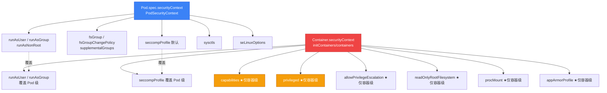

> **生产环境安全提示**
>
> 本文档包含可直接执行的运维命令与可落地的 Pod 模板。执行前请确认：当前目标集群与 Namespace 是否正确；是否具备足够的 RBAC 权限；是否已在非生产环境验证。命令风险等级标注：🔴 高风险（可能造成数据丢失或服务中断）、🟡 中风险（会修改集群状态，但通常可回滚）、🟢 低风险/只读（信息收集，无副作用）。

# Security Context 字段完整参考

> **适用版本**: Kubernetes v1.28 - v1.33 | **最后更新**: 2026-07-23 | **难度**: 高级 | **参考**: [kubernetes.io/docs/reference/generated/kubernetes-api/v1.33/#securitycontext-v1-core](https://kubernetes.io/docs/reference/generated/kubernetes-api/v1.33/#securitycontext-v1-core)

---

## 一、概述

`securityContext`（安全上下文）是 Kubernetes Pod 与容器运行时安全配置的核心入口，定义在 `Pod.spec.securityContext`（Pod 级）与 `Pod.spec.containers[].securityContext`（容器级）。它直接控制容器进程在 Linux 内核中的运行姿态：进程以何种 UID/GID 运行、是否拥有特权、保留哪些 Linux capabilities、如何被 seccomp/AppArmor/SELinux 等 Linux 安全模块（LSM, Linux Security Modules）约束，以及能否修改内核 sysctl 参数。

从纵深防御的视角看，`securityContext` 是 [[安全/策略治理/06-pod-security-standards.md|Pod Security Standards]]（PSS）落地的「具体字段层」。PSS 定义了 privileged / baseline / restricted 三个级别的策略意图，而 `securityContext` 的每一个字段就是这些策略意图的执行单元。当 [[安全/身份与访问/02-pod-security-admission-deep-dive.md|Pod Security Admission]]（PSA）准入控制器在 API Server 拦截不符合 restricted 级别的 Pod 时，它检查的正是 `securityContext` 中的 `runAsNonRoot`、`capabilities.drop`、`seccompProfile` 等字段。

正确配置 `securityContext` 的安全价值体现在三个层面：

1. **减小爆炸半径**：`runAsNonRoot` + 非 root 镜像让容器即使被攻陷，攻击者也无法直接获得 UID 0；`readOnlyRootFilesystem` 阻断恶意脚本的持久化植入；`drop ALL capabilities` 剥离了 `CAP_SYS_ADMIN`、`CAP_NET_ADMIN` 等高危内核能力，即使容器内进程拿到 root，能做的事也大幅受限。
2. **阻断容器逃逸**：`privileged: false`（默认）、合理的 seccomp profile、AppArmor 限制，共同降低了攻击者通过内核漏洞（如 CVE-2022-0185、CVE-2024-1086）突破 namespace 隔离逃逸到宿主节点的概率。
3. **满足合规基线**：CIS Kubernetes Benchmark、PCI DSS、SOC 2、NIST SP 800-190 等安全基线都将 `securityContext` 的最小化配置作为强制要求。例如 CIS Benchmark 5.1.x 系列明确要求「Minimize the admission of privileged containers」「Minimize the admission of containers wishing to share the host process ID namespace」等，对应的都是 `securityContext` 字段。

本文档将 `securityContext` 的全部字段按主题系统化汇总，并给出与 PSS 的精确映射，作为安全工程师与 SRE 的字段级速查参考。文档不重复运行时安全的整体威胁模型与防御理念，相关背景请参阅 [[安全/运行时安全/03-runtime-security-defense.md|运行时安全防御]] 与 [[安全/合规审计/11-kubernetes-security-hardening.md|Kubernetes 安全加固]]；Linux 安全模块（seccomp/AppArmor/SELinux）的底层原理详见 [[概念/linux-security-modules.md|Linux 安全模块]]。

---

## 二、securityContext 层级与覆盖规则

### 2.1 两级配置模型

Kubernetes 将 `securityContext` 设计为两级模型：**Pod 级**与**容器级**。

```yaml
apiVersion: v1
kind: Pod
metadata:
  name: sc-demo
spec:
  securityContext:            # ← Pod 级（PodSecurityContext）：对所有容器生效
    runAsNonRoot: true
    runAsUser: 10001
    runAsGroup: 10001
    fsGroup: 2000
    seccompProfile:
      type: RuntimeDefault
  initContainers:
    - name: init
      securityContext:        # ← 容器级（SecurityContext）：覆盖 Pod 级
        runAsUser: 0           #    本容器以 root 运行（注意：与 Pod 级冲突会被拒绝）
  containers:
    - name: app
      securityContext:        # ← 容器级：覆盖 Pod 级
        allowPrivilegeEscalation: false
        capabilities:
          drop: ["ALL"]
        readOnlyRootFilesystem: true
```

### 2.2 覆盖规则（核心）

理解覆盖规则是避免配置失效的关键。规则有三条：

1. **容器级覆盖 Pod 级**：当一个字段同时在 Pod 级和容器级定义时，容器级的值生效，Pod 级的值被忽略。例如 Pod 级 `runAsUser: 10001` 而容器级 `runAsUser: 1000`，该容器实际以 UID 1000 运行。
2. **部分字段仅 Pod 级**：`fsGroup`、`fsGroupChangePolicy`、`sysctls`、`seLinuxOptions`（Pod 级与容器级均可，但 Pod 级更常用）、`seccompProfile`（Pod 级为所有容器设定默认）只接受 Pod 级配置，容器级无法覆盖。
3. **部分字段仅容器级**：`capabilities`、`privileged`、`allowPrivilegeEscalation`、`readOnlyRootFilesystem`、`procMount` 只在容器级定义，Pod 级无对应字段。

### 2.3 字段归属速查表

| 字段 | Pod 级 (`spec.securityContext`) | 容器级 (`containers[].securityContext`) | 覆盖规则 |
|:---|:---:|:---:|:---|
| `runAsUser` | ✅ | ✅ | 容器级覆盖 Pod 级 |
| `runAsGroup` | ✅ | ✅ | 容器级覆盖 Pod 级（v1.21+ stable） |
| `runAsNonRoot` | ✅ | ✅ | 容器级覆盖 Pod 级 |
| `runAsUserName` | ✅ | ✅ | Windows 专用，容器级覆盖 Pod 级 |
| `fsGroup` | ✅ | ❌ | 仅 Pod 级 |
| `fsGroupChangePolicy` | ✅ | ❌ | 仅 Pod 级（v1.20+ stable） |
| `supplementalGroups` | ✅ | ❌ | 仅 Pod 级 |
| `seccompProfile` | ✅ | ✅ | 容器级覆盖 Pod 级（v1.27 GA） |
| `seLinuxOptions` | ✅ | ✅ | 容器级覆盖 Pod 级 |
| `appArmorProfile` | ❌ | ✅ | 仅容器级（v1.30 beta，逐步 GA） |
| `capabilities` | ❌ | ✅ | 仅容器级 |
| `privileged` | ❌ | ✅ | 仅容器级 |
| `allowPrivilegeEscalation` | ❌ | ✅ | 仅容器级 |
| `readOnlyRootFilesystem` | ❌ | ✅ | 仅容器级 |
| `procMount` | ❌ | ✅ | 仅容器级（v1.29 beta，默认 `Default`） |
| `sysctls` | ✅ | ❌ | 仅 Pod 级 |
| `windowsOptions` | ✅ | ✅ | 容器级覆盖 Pod 级 |

### 2.4 层级与覆盖关系图



---

## 三、用户与权限字段

用户与权限字段控制容器内进程以何种身份（UID/GID）运行，这是最小权限原则的第一道防线。一个以非 root 用户运行、且无法通过 setuid 提权的进程，即使存在 RCE 漏洞，攻击者能造成的破坏也受到严格限制。

### 3.1 字段总览表

| 字段 | 级别 | 类型 | 默认 | 含义 | PSS 关联 |
|:---|:---|:---|:---|:---|:---|
| `runAsUser` | Pod + 容器 | int64 | 容器镜像 `USER` 指令的值 | 容器进程的 UID。未设置时使用镜像中 `USER` 指令；镜像也无则默认 0（root） | restricted: 不可为 0 |
| `runAsGroup` | Pod + 容器 | int64 | 0（root GID） | 容器进程的主 GID。未设置时继承 `runAsUser` 的默认 GID（通常 0） | restricted: 推荐非 0 |
| `runAsNonRoot` | Pod + 容器 | bool | false | true 时 kubelet 验证容器不会以 UID 0 运行（检查镜像 USER 与 runAsUser） | restricted: 必须 true 或 runAsUser>0 |
| `runAsUserName` | Pod + 容器 | string | — | Windows only，指定容器进程的用户名（如 `ContainerAdministrator`） | — |
| `fsGroup` | Pod | int64 | — | 挂载卷时附加的补充 GID，kubelet 会 chown 挂载的 volume 到该 GID | restricted: 不强制 |
| `fsGroupChangePolicy` | Pod | enum | `Always` | 控制 kubelet 对挂载卷的 chown 行为：`Always`（每次挂载都递归 chown）/ `OnRootMismatch`（仅根目录 owner 不匹配时才 chown） | — |
| `supplementalGroups` | Pod | []int64 | — | 额外的补充 GID 列表，附加到容器进程的 supplementary groups | — |

### 3.2 runAsUser 与 runAsNonRoot 的区别（高频混淆点）

这两个字段是最容易被混淆的，但语义截然不同：

- **`runAsUser: 10001`** 是**声明式设置**：直接指定容器进程的 UID 为 10001。它不关心镜像的 `USER` 指令，会直接覆盖。
- **`runAsNonRoot: true`** 是**校验性约束**：它本身不指定 UID，而是要求 kubelet 在启动容器前**验证**容器不会以 UID 0 运行。验证逻辑是：如果设置了 `runAsUser`，则检查 `runAsUser != 0`；如果未设置 `runAsUser`，则要求 kubelet 能从镜像 metadata 中解析出非 0 的 USER。

最常见的启动失败场景就是 `runAsNonRoot: true` 但镜像以 root 构建（Dockerfile 无 `USER` 指令，或 `USER root`）：

```
Error: container has runAsNonRoot and image has non-numeric user (null),
cannot verify user is non-root (pod "...", container ...)
```

或：

```
Error: container has runAsNonRoot and image will run as root
(uid=0, gid=0)
```

**生产建议**：始终同时设置 `runAsNonRoot: true` 与显式的 `runAsUser: <非0 UID>`。前者作为防护网（即使镜像错误也拒绝启动），后者作为确定性配置（不依赖镜像 metadata）。

### 3.3 fsGroup 与 fsGroupChangePolicy 性能考量

`fsGroup` 让你能将一个 GID 注入挂载的 volume，使容器进程以该 GID 读写共享存储。但代价是 kubelet 会在 Pod 启动时对挂载的 volume 执行递归 `chown -R` 和 `chmod -R`，对于包含大量小文件的 volume（如节点上的 git 仓库、深度学习训练数据集），启动延迟可能从秒级恶化到分钟级。

`fsGroupChangePolicy` 正是为缓解此问题引入：

- `Always`（默认）：每次 Pod 启动都递归 chown，安全但慢。
- `OnRootMismatch`：仅当 volume 根目录的 owner 与 `fsGroup` 不匹配时才递归 chown。对于内容稳定、首次 chown 后不再变动的 volume，可显著缩短启动时间。

> ⚠️ 注意：`OnRootMismatch` 无法感知子目录 owner 变化。如果 volume 内部目录的 owner 被外部修改，kubelet 不会重新 chown，可能导致权限不一致。

---

## 四、特权与能力（privileged / capabilities / allowPrivilegeEscalation）

### 4.1 privileged：最危险的开关

`privileged: true` 让容器获得近乎宿主机 root 的权限，包括：

- 访问宿主机所有设备（`/dev/sda`、网卡、USB）
- 拥有全部 Linux capabilities（绕过 capabilities 过滤）
- 内核中的 DAC/MAC 安全检查对容器内进程大幅放行
- 可加载内核模块（若节点允许）

这在云原生环境等价于「容器逃逸已完成」。**restricted 基线绝对禁止，baseline 也禁止**。仅在少数基础设施组件（如某些 CNI 的初始化容器、需要访问 `/dev/fuse` 或 `/dev/mapper` 的存储组件）才允许，且应通过 [[安全/运行时安全/17-gvisor-container-sandbox.md|gVisor]] 等沙箱或专用节点池隔离。

```yaml
# 🔴 极度危险，仅在基础设施组件且隔离节点池时使用
securityContext:
  privileged: true
```

### 4.2 capabilities：精细化能力裁剪

Linux capabilities 将传统的 root 权力拆分为约 40 个细粒度能力（如 `CAP_NET_BIND_SERVICE` 允许绑定 <1024 端口、`CAP_SYS_TIME` 允许修改系统时钟）。容器默认获得一个有限的 capability 集合（约 14 个），通过 `capabilities.add` / `capabilities.drop` 可以增删。

**最小化原则**：先 `drop: ["ALL"]` 剥离所有默认能力，再按需 `add` 回最小必要集。这是 PSS restricted 的强制要求。

#### 容器默认 capability 集合（containerd/Docker）

| Capability | 含义 | 风险等级 |
|:---|:---|:---|
| `CAP_AUDIT_WRITE` | 写审计日志 | 低 |
| `CAP_CHOWN` | 修改文件 owner | 低 |
| `CAP_DAC_OVERRIDE` | 绕过文件权限检查 | 中 |
| `CAP_FOWNER` | 绕过文件 owner 检查 | 中 |
| `CAP_FSETID` | setuid 位修改 | 中 |
| `CAP_KILL` | 发送信号 | 中 |
| `CAP_MKNOD` | 创建设备节点 | 中 |
| `CAP_NET_BIND_SERVICE` | 绑定 <1024 端口 | 低 |
| `CAP_NET_RAW` | 原始套接字（ping、ARP） | 中 |
| `CAP_SETGID` / `CAP_SETUID` | 切换 GID/UID | 中 |
| `CAP_SETPCAP` | 调整子进程 capability | 中 |
| `CAP_SETFCAP` | 设置文件 capability | 中 |
| `CAP_SYS_CHROOT` | chroot | 中 |

#### 常见业务场景的最小 capability

| 场景 | 需要的 capability | 说明 |
|:---|:---|:---|
| 应用需 ping（健康检查 ICMP） | `CAP_NET_RAW` | 但通常应避免，改用 HTTP/TCP 探针 |
| 绑定 80/443 端口 | `CAP_NET_BIND_SERVICE` | 或改用 Service + NodePort/LB，避免给容器该能力 |
| 网络类 sidecar（Istio/Calico） | `CAP_NET_ADMIN` | 可修改路由表、iptables，风险高，需隔离 |
| 需修改系统时间 | `CAP_SYS_TIME` | 极少需要，通常用 chrony/ntpd 在节点层处理 |
| 性能监控 agent（bpftrace） | `CAP_SYS_ADMIN` + `CAP_BPF` + `CAP_PERFMON` | 高危，推荐用专用节点 + DaemonSet + seccomp |

> ⚠️ **`CAP_SYS_ADMIN` 是「新 root」**：它授予的能力过于宽泛（mount、namespace 操作、cgroup 修改等），是容器逃逸 CVE 的常见利用点。任何对 `CAP_SYS_ADMIN` 的 `add` 都应被视为接近 `privileged: true`，必须经过严格评审。

```yaml
# ✅ restricted 兼容：drop ALL，按需 add
securityContext:
  capabilities:
    drop: ["ALL"]
    add: ["NET_BIND_SERVICE"]
```

### 4.3 allowPrivilegeEscalation：阻断 setuid 提权

`allowPrivilegeEscalation` 控制容器内进程能否通过 setuid/setgid 二进制获得比父进程更高的权限。其底层通过设置进程的 `no_new_privs` 标志位实现（`prctl(PR_SET_NO_NEW_PRIVS, 1)`）。

- 默认值：`true`（除非 `privileged: false` 且 `runAsUser=0` 未设置时部分运行时默认 false）。
- **restricted 要求 `false`**：这是阻断「非 root 容器内通过 setuid 二进制（如 `sudo`、`su`、`ping`）提权到 root」的关键。即使你 `drop ALL`，如果没有设 `allowPrivilegeEscalation: false`，攻击者仍可能利用镜像内的 setuid 二进制提权。

```yaml
securityContext:
  allowPrivilegeEscalation: false
```

---

## 五、Linux 安全模块（seccomp / AppArmor / SELinux）

Linux 安全模块（LSM）是内核级别的强制访问控制（MAC）框架。`securityContext` 通过三个字段分别对接三种主流 LSM。它们的底层原理见 [[概念/linux-security-modules.md|Linux 安全模块]]，本节聚焦 K8s 中的字段配置。

### 5.1 三种 LSM 对比

| 维度 | seccomp | AppArmor | SELinux |
|:---|:---|:---|:---|
| **作用层** | 系统调用（syscall）过滤 | 路径（path）权限 | 标签（label）策略 |
| **配置粒度** | 按 syscall 号 allow/deny | 按文件路径的 r/w/x | 按 type/role/level 标签 |
| **内核依赖** | seccomp-BPF（主线内核） | AppArmor（Ubuntu/Debian） | SELinux（RHEL/CentOS/Fedora） |
| **运行时支持** | containerd/CRI-O/Docker 全支持 | containerd/CRI-O/Docker | containerd/CRI-O |
| **K8s 字段** | `seccompProfile`（GA v1.27） | 注解 → `appArmorProfile`（v1.30 beta） | `seLinuxOptions` |
| **典型用途** | 阻断 `keyctl`/`mount`/`bpf` 等高危 syscall | 限制可执行文件与文件读写路径 | 强制 type enforcement，多租户隔离 |
| **性能开销** | 极低（BPF 过滤） | 低 | 中 |
| **PSS restricted 要求** | `RuntimeDefault` 或 `Localhost` | 推荐 `runtime/default` | 推荐启用 enforcing |

### 5.2 seccompProfile（seccomp-BPF 系统调用过滤）

seccomp（secure computing mode）通过 BPF 过滤器在内核层面拦截容器进程发起的系统调用，拒绝未授权的 syscall。这是抵御内核漏洞利用（如容器逃逸）最有效的运行时控制之一——即使攻击者拿到容器内 root，无法调用 `mount`/`keyctl`/`bpf`/`userfaultfd` 等关键 syscall，逃逸路径也会被切断。

#### 字段结构

```yaml
securityContext:
  seccompProfile:
    type: <Unconfined | RuntimeDefault | Localhost>
    localhostOptions:        # 仅 type=Localhost 时生效
      profile: profiles/my-profile.json
```

#### 三种 type 详解

| type | 含义 | 适用场景 | PSS |
|:---|:---|:---|:---|
| `Unconfined` | 不应用 seccomp 过滤（**默认值**，历史包袱） | 不推荐，仅遗留工作负载 | restricted 禁止 |
| `RuntimeDefault` | 使用容器运行时（containerd/CRI-O）内置的默认 profile，已屏蔽已知高危 syscall | **生产首选**，覆盖 95% 场景 | restricted 要求 |
| `Localhost` | 使用节点上自定义 profile 文件，路径相对于 kubelet 配置的根目录（默认 `/var/lib/kubelet/seccomp/`） | 需要精细控制 syscall 白名单 | restricted 允许 |

> ⚠️ **默认值陷阱**：v1.27 GA 前，未设置 `seccompProfile` 等价于 `Unconfined`（不过滤）。这意味着大量存量 Pod 实际上没有任何 syscall 过滤。这正是 PSS restricted 强制要求显式设置 `RuntimeDefault` 的原因。从 v1.25 起，部分发行版（如 GKE）开始为特定工作负载默认启用 `RuntimeDefault`，但通用集群仍需显式配置。

#### Security Profiles Operator（SPO）与自定义 profile

当 `RuntimeDefault` 不够用时（如需要额外放行某个 syscall，或为特定应用生成最小化 profile），需要自定义 seccomp profile。手动编写 JSON profile 容易出错，推荐使用 [Security Profiles Operator](https://github.com/kubernetes-sigs/security-profiles-operator)（SPO）：

- SPO 提供 `SeccompProfile` CRD，用声明式 YAML 定义 profile，自动同步到节点 `/var/lib/kubelet/seccomp/operator/`。
- SPO 的「recording」功能可以监听运行中的容器，自动生成基线 profile。
- SPO 还集成 AppArmor 与 SELinux profile 管理。

```yaml
# SPO SeccompProfile CRD 示例
apiVersion: security-profiles-operator.x-k8s.io/v1beta1
kind: SeccompProfile
metadata:
  name: my-app-profile
  namespace: security-profiles-operator
spec:
  defaultAction: SCMP_ACT_ERRNO     # 默认拒绝
  syscalls:
    - action: SCMP_ACT_ALLOW         # 显式允许的 syscall
      names:
        - accept
        - accept4
        - bind
        - connect
        - epoll_wait
        - read
        - write
        # ... 应用实际需要的 syscall
  targetWorkload: my-namespace      # profile 仅对该 namespace 可见
```

在 Pod 中引用：

```yaml
securityContext:
  seccompProfile:
    type: Localhost
    localhostOptions:
      profile: operator/my-namespace/my-app-profile.json
```

#### 排查 seccomp 阻断

当应用因 seccomp 报 `EPERM` 或 `Operation not permitted` 时，排查步骤：

```bash
# 🟢 低风险：查看容器进程的 seccomp 模式（0=disabled, 1=strict, 2=filter）
kubectl exec <pod> -c <container> -- cat /proc/1/status | grep Seccomp

# 🟢 低风险：节点上查看 kubelet 是否加载了 profile
ls -l /var/lib/kubelet/seccomp/

# 🟢 低风险：用 strace 定位被阻断的 syscall（需容器内含 strace 且非只读 fs）
kubectl exec <pod> -c <container> -- strace -f -e trace=<syscall> <command> 2>&1 | grep EPERM
```

### 5.3 AppArmor

AppArmor 基于文件路径进行强制访问控制，主要在 Ubuntu/Debian 内核中启用。K8s 中 AppArmor 的配置经历了从**注解（annotation）**到**字段**的演进。

#### 历史方式：注解（v1.4+，仍广泛使用）

```yaml
metadata:
  annotations:
    # 格式：container.apparmor.security.beta.kubernetes.io/<container-name>
    container.apparmor.security.beta.kubernetes.io/app: runtime/default
    # 或自定义 profile
    container.apparmor.security.beta.kubernetes.io/sidecar: localhost/my-profile
```

取值：
- `runtime/default`：使用运行时默认 profile（推荐）。
- `localhost/<name>`：使用节点 `/etc/apparmor.d/` 下已加载的 profile。
- `unconfined`：不应用 AppArmor（不推荐）。

#### 新方式：appArmorProfile 字段（v1.30 beta，逐步 GA）

为消除「配置安全策略却用注解」的别扭，K8s 引入了 `appArmorProfile` 字段，语义与注解一致：

```yaml
containers:
  - name: app
    securityContext:
      appArmorProfile:
        type: <Unconfined | RuntimeDefault | Localhost>
        localhostProfile: my-profile   # 仅 type=Localhost 时
```

> ⚠️ **节点依赖**：AppArmor profile 必须先在节点上加载（`apparmor_parser -r /etc/apparmor.d/my-profile`），否则 Pod 卡在 `ContainerCreating`。可通过 `aa-status` 检查节点已加载的 profile。

```bash
# 🟢 低风险：节点上检查 AppArmor 状态
sudo aa-status
```

### 5.4 SELinux

SELinux 基于标签（label）进行强制访问控制，主要在 RHEL/CentOS/Fedora 内核中启用。它使用 type enforcement（TE）模型，每个进程与文件都有 `user:role:type:level`（MLS/MCS）四元组标签。

#### 字段结构

```yaml
securityContext:
  seLinuxOptions:
    user: system_u       # SELinux user
    role: system_r       # SELinux role
    type: spc_t          # SELinux type（最关键）
    level: s0:c100,c200  # MLS/MCS level（多租户隔离用）
```

| 子字段 | 含义 | 常见值 |
|:---|:---|:---|
| `user` | SELinux 用户身份 | `system_u`、`unconfined_u` |
| `role` | SELinux 角色 | `system_r`、`object_r` |
| `type` | 类型（type enforcement 的核心） | `spc_t`（super privileged container）、`container_t`（默认） |
| `level` | MLS/MCS 级别，用于多租户隔离 | `s0`（单级）、`s0:c100,c200`（多级） |

#### 多租户隔离典型用法

在 OpenShift 等多租户平台中，每个 namespace 分配不同的 MCS 标签（如 `s0:c1,c0` vs `s0:c2,c0`），不同 namespace 的 Pod 即使挂载相同的 PV 也无法互访，因为 SELinux 标签不匹配。

```bash
# 🟢 低风险：节点上检查 SELinux 模式（Enforcing/Permissive/Disabled）
getenforce

# 🟢 低风险：查看进程的 SELinux 标签
ps -eZ | grep <pid>
```

> ⚠️ SELinux 配置错误会导致容器无法访问挂载的卷或关键文件，表现为 `permission denied` 但传统 Unix 权限正常。排查时先确认 `getenforce` 状态，再检查 `/var/log/audit/audit.log` 中的 AVC 拒绝。

---

## 六、文件系统与只读（readOnlyRootFilesystem / procMount）

### 6.1 readOnlyRootFilesystem

`readOnlyRootFilesystem: true` 将容器的根文件系统（rootfs）挂载为只读。这能阻断攻击者植入后门、修改二进制、写入 crontab 等持久化操作——即使容器被攻陷，重启后状态完全重置。

```yaml
securityContext:
  readOnlyRootFilesystem: true
```

> ⚠️ **配套挂载**：很多应用需要写入临时文件（如 Java 写 `/tmp`、Nginx 写 `/var/cache/nginx`）。开启只读根 fs 后，必须用 `emptyDir` 显式挂载这些可写路径，否则应用启动失败：

```yaml
containers:
  - name: app
    securityContext:
      readOnlyRootFilesystem: true
    volumeMounts:
      - name: tmp
        mountPath: /tmp
      - name: cache
        mountPath: /var/cache/nginx
volumes:
  - name: tmp
    emptyDir: {}
  - name: cache
    emptyDir: {}
```

### 6.2 procMount

`procMount` 控制容器内 `/proc` 的挂载方式，默认 `Default` 会对 `/proc/kcore`、`/proc/keys` 等敏感条目做屏蔽。`Unmasked`（v1.29 beta，需 feature gate `ProcMountType`）则完全暴露 `/proc`，**仅用于有明确需求的特权监控类工作负载**，restricted 基线禁止。

| 取值 | 含义 | 风险 |
|:---|:---|:---|
| `Default`（默认） | 屏蔽 `/proc/kcore`、`/proc/keys` 等敏感条目 | 低 |
| `Unmasked` | 完全暴露 `/proc`，可能泄露内核密钥、内存 | 高，restricted 禁止 |

---

## 七、proc/sys 访问（sysctls）

`securityContext.sysctls`（仅 Pod 级）允许设置内核 sysctl 参数。由于容器共享宿主机内核，sysctl 的修改可能影响整个节点，因此 K8s 将 sysctl 分为「安全」与「不安全」两类。

```yaml
securityContext:
  sysctls:
    - name: net.ipv4.ip_local_port_range
      value: "1024 65535"
    - name: net.core.somaxconn
      value: "4096"
```

### 7.1 安全 vs 不安全 sysctl

| 类别 | 特征 | 示例 | 是否需特殊配置 |
|:---|:---|:---|:---|
| **安全（namespaced）** | 命名空间隔离，仅影响容器自身 namespace | `net.ipv4.ip_local_port_range`、`net.core.somaxconn`、`net.ipv4.tcp_syncookies`、`net.ipv4.ping_group_range` | 直接在 `sysctls` 设置即可 |
| **不安全（non-namespaced）** | 节点全局，修改影响所有容器 | `kernel.shmmax`、`kernel.shmmni`、`kernel.msgmax`、`net.ipv4.ip_forward` | 需 kubelet `--allowed-unsafe-sysctls=<name>` 显式开启 |

> ⚠️ **不安全 sysctl 必须在节点 kubelet 配置中通过 `--allowed-unsafe-sysctls` 显式允许**，否则 Pod 创建被拒绝。生产环境应严格评审每个不安全 sysctl 的必要性，优先通过节点级 systemd 配置或专用节点池解决。

### 7.2 常见用例

| sysctl | 用途 | 安全性 |
|:---|:---|:---|
| `net.ipv4.ip_local_port_range` | 扩大临时端口范围，提升高并发连接数 | 安全 |
| `net.core.somaxconn` | 增大 TCP backlog，应对突增连接 | 安全 |
| `net.ipv4.tcp_tw_reuse` | TIME_WAIT 端口复用（谨慎，NAT 环境有风险） | 安全 |
| `net.ipv4.ping_group_range` | 允许非 root 进程使用 ICMP（配合 `CAP_NET_RAW`） | 安全 |
| `kernel.shmmax` | 共享内存上限（数据库、中间件常用） | **不安全** |

---

## 八、Windows 专用字段

Windows 节点不支持 Linux 的 UID/capabilities/seccomp 体系，K8s 通过 `windowsOptions`（`WindowsSecurityContextOptions`）提供等价配置。

| 字段 | 级别 | 含义 |
|:---|:---|:---|
| `windowsOptions.hostProcess` | Pod + 容器 | true 时容器以 Windows HostProcess 方式运行，拥有宿主机权限（类似 Linux privileged，仅 Windows Server 2019+ 支持） |
| `windowsOptions.gmsaCredentialSpecName` | Pod + 容器 | Group Managed Service Account（gMSA）规格名，用于 AD 域认证 |
| `windowsOptions.gmsaCredentialSpec` | Pod + 容器 | gMSA 规格的完整 JSON（通常用 SpecName 引用，避免内联） |
| `windowsOptions.runAsUserName` | Pod + 容器 | 容器进程的 Windows 用户名，如 `ContainerUser`、`ContainerAdministrator` |

```yaml
# Windows Pod 示例
securityContext:
  windowsOptions:
    gmsaCredentialSpecName: webapp-gmsa
    runAsUserName: ContainerUser
containers:
  - name: iis
    securityContext:
      windowsOptions:
        runAsUserName: ContainerAdministrator
```

> ⚠️ `hostProcess: true` 的 Pod 会绕过 Windows 容器隔离，等价于宿主机进程，**严禁在多租户环境使用**。

---

## 九、Pod Security Standards 映射（核心参考表）

下表是 `securityContext` 各字段在 PSS 三个级别下的允许值。这是编写安全策略（Kyverno/OPA Gatekeeper）与配置 PSA 时的事实标准参考。

| 字段 | privileged | baseline | restricted |
|:---|:---|:---|:---|
| `privileged` | 允许 | **禁止 true** | **禁止 true** |
| `hostPID` / `hostIPC` / `hostNetwork` | 允许 | **禁止 true** | **禁止 true** |
| `hostPath` volumes | 允许 | **禁止** | **禁止** |
| `runAsNonRoot` | 任意 | 任意 | **必须 true，或 `runAsUser`!=0**（Pod 级或容器级） |
| `runAsUser` | 任意 | 任意 | **不可为 0**（Pod 级和所有 init/ephemeral/普通容器） |
| `seccompProfile.type` | 任意 | **不可 `Unconfined`**（注解或字段） | **必须 `RuntimeDefault` 或 `Localhost`**（Pod 级和所有容器） |
| `capabilities.add` | 任意 | 不可 add restricted 列表（如 `SYS_ADMIN`） | **必须 `drop: ["ALL"]`，且不可 `add`**（v1.27+ 允许 `NET_BIND_SERVICE`，v1.28 起完全禁止） |
| `allowPrivilegeEscalation` | 任意 | 任意 | **必须 false**（所有容器） |
| `readOnlyRootFilesystem` | 任意 | 任意 | 不强制（但强烈推荐 true） |
| `SELinux` | 任意 | type 不可为 `spc_t` 等 | type 不可提升，level 受约束 |
| `procMount` | 任意 | **不可 `Unmasked`** | **不可 `Unmasked`** |
| `sysctls`（不安全） | 允许 | **禁止** | **禁止** |

### 9.1 restricted 完整字段模板（基线对照）

以下 YAML 是一个严格满足 PSS **restricted** 级别的 `securityContext` 完整模板，可作为生产 Pod 的安全基线：

```yaml
apiVersion: v1
kind: Pod
metadata:
  name: restricted-baseline
  namespace: production
spec:
  securityContext:
    # —— Pod 级 ——
    runAsNonRoot: true            # ★强制：禁止 root
    runAsUser: 10001              # ★强制：显式非 0 UID
    runAsGroup: 10001             # 推荐：显式非 0 GID
    fsGroup: 20001                # 可选：卷挂载 GID
    fsGroupChangePolicy: OnRootMismatch  # 性能优化
    seccompProfile:               # ★强制：seccomp
      type: RuntimeDefault        #    RuntimeDefault 或 Localhost
    seLinuxOptions:
      level: s0:c100,c200         # 多租户 MCS 隔离（SELinux 节点）
  containers:
    - name: app
      image: myapp:1.2.3
      securityContext:
        # —— 容器级 ——
        runAsNonRoot: true        # ★强制：与 Pod 级一致
        runAsUser: 10001
        runAsGroup: 10001
        allowPrivilegeEscalation: false  # ★强制：阻断 setuid 提权
        privileged: false         # ★强制：非特权
        readOnlyRootFilesystem: true     # 强烈推荐
        capabilities:
          drop: ["ALL"]           # ★强制：剥离所有 capability
        seccompProfile:
          type: RuntimeDefault    # 容器级覆盖 Pod 级（可省略，继承 Pod 级）
```

---

## 十、生产配置模板

### 10.1 restricted 兼容的标准应用 Pod

一个典型的 Web 后端应用，完全满足 PSS restricted，可直接部署在 `enforce: restricted` 的 namespace：

```yaml
apiVersion: apps/v1
kind: Deployment
metadata:
  name: webapp
  namespace: production
  labels:
    app: webapp
spec:
  replicas: 3
  selector:
    matchLabels:
      app: webapp
  template:
    metadata:
      labels:
        app: webapp
    spec:
      securityContext:
        runAsNonRoot: true
        runAsUser: 10001
        runAsGroup: 10001
        fsGroup: 10001
        fsGroupChangePolicy: OnRootMismatch
        seccompProfile:
          type: RuntimeDefault
      containers:
        - name: webapp
          image: registry.example.com/webapp:1.4.2@sha256:abc123...  # 用 digest 锁定
          ports:
            - containerPort: 8080
          securityContext:
            runAsNonRoot: true
            runAsUser: 10001
            runAsGroup: 10001
            allowPrivilegeEscalation: false
            privileged: false
            readOnlyRootFilesystem: true
            capabilities:
              drop: ["ALL"]
          resources:
            requests:
              cpu: 100m
              memory: 128Mi
            limits:
              cpu: 500m
              memory: 512Mi
          volumeMounts:
            - name: tmp
              mountPath: /tmp
            - name: cache
              mountPath: /var/cache/app
            - name: tmp
              mountPath: /tmp
          readinessProbe:
            httpGet:
              path: /healthz
              port: 8080
            initialDelaySeconds: 5
          livenessProbe:
            httpGet:
              path: /healthz
              port: 8080
            initialDelaySeconds: 15
      volumes:
        - name: tmp
          emptyDir: {}
        - name: cache
          emptyDir:
            medium: Memory        # tmpfs，避免写磁盘
```

### 10.2 网络类 sidecar 例外模板（需 NET_ADMIN）

Istio Envoy sidecar、Calico CNI、Cilium 等网络组件必须操作 iptables/IPVS，需要 `CAP_NET_ADMIN`。这类工作负载无法满足 restricted 的「`drop ALL` 且不可 add」，**应部署在专用的 `privileged` 或 `baseline` namespace**（如 `istio-system`、`kube-system`、`calico-system`），并通过 Namespace 标签隔离 PSA 级别：

```yaml
# 🔴 基础设施专用 namespace：baseline 或 privileged，严禁业务 Pod 混部
apiVersion: v1
kind: Namespace
metadata:
  name: mesh-system
  labels:
    pod-security.kubernetes.io/enforce: baseline      # 网络组件需要 baseline
    pod-security.kubernetes.io/enforce-version: latest
    pod-security.kubernetes.io/audit: restricted
    pod-security.kubernetes.io/warn: restricted
---
apiVersion: apps/v1
kind: DaemonSet
metadata:
  name: mesh-proxy
  namespace: mesh-system
spec:
  selector:
    matchLabels:
      app: mesh-proxy
  template:
    metadata:
      labels:
        app: mesh-proxy
    spec:
      hostNetwork: true              # baseline 允许，restricted 禁止
      securityContext:
        runAsNonRoot: false          # 网络组件常需 root 操作 iptables
        seccompProfile:
          type: RuntimeDefault
      containers:
        - name: proxy
          image: registry.example.com/mesh-proxy:1.20.0
          securityContext:
            capabilities:
              drop: ["ALL"]
              add: ["NET_ADMIN", "NET_RAW", "SYS_ADMIN"]  # 仅添加网络必需能力
            allowPrivilegeEscalation: false
            privileged: false        # 仍保持非 privileged
```

> ⚠️ **隔离原则**：任何需要 `NET_ADMIN`/`SYS_ADMIN` 的 Pod 都应：① 部署在专用 namespace 并设 `enforce: baseline`；② 通过 [[安全/策略治理/04-kyverno-enterprise-policy-management.md|Kyverno]] 约束只允许特定 ServiceAccount 部署；③ 优先在专用节点池（taint + toleration）运行。

---

## 十一、排障

### 11.1 诊断命令

```bash
# 🟢 低风险：查看 Pod 的 securityContext（Pod 级）
kubectl get pod <pod-name> -o jsonpath='{.spec.securityContext}' | jq .

# 🟢 低风险：查看所有容器的 securityContext
kubectl get pod <pod-name> -o jsonpath='{range .spec.containers[*]}{.name}{"\t"}{.securityContext}{"\n"}{end}'

# 🟢 低风险：查看 initContainers 和 ephemeralContainers 的 securityContext
kubectl get pod <pod-name> -o jsonpath='{range .spec.initContainers[*]}{.name}{"\t"}{.securityContext}{"\n"}{end}'

# 🟢 低风险：检查当前 namespace 的 PSA 级别生效情况
kubectl get namespace <ns> -o jsonpath='{.metadata.labels}' | jq .

# 🟢 低风险：查看当前用户能否创建特定 securityContext 的 Pod（PSA 准入预检）
kubectl auth can-i --list --namespace <ns>

# 🟢 低风险：节点上检查 seccomp 模式（0=disabled, 1=strict, 2=filter）
sudo cat /proc/1/status | grep Seccomp

# 🟢 低风险：节点上检查 AppArmor 已加载的 profile
sudo aa-status

# 🟢 低风险：节点上检查 SELinux 模式
getenforce
sudo sestatus

# 🟢 低风险：节点上检查 kubelet 是否允许某不安全 sysctl
sudo grep -i allowedUnsafeSysctls /var/lib/kubelet/config.yaml

# 🟢 低风险：查看 kubelet 是否配置了 seccomp 默认 profile
sudo grep -i seccompDefault /var/lib/kubelet/config.yaml
```

### 11.2 集群级安全配置扫描

```bash
# 🟢 低风险：找出所有以 root 运行的容器（securityContext 缺失 runAsNonRoot）
kubectl get pods -A -o json |
  jq -r '.items[] |
    select(.spec.securityContext.runAsNonRoot != true) |
    "\(.metadata.namespace)/\(.metadata.name)"'

# 🟢 低风险：找出所有 privileged 容器
kubectl get pods -A -o json |
  jq -r '.items[] |
    .spec.containers[]? |
    select(.securityContext.privileged == true) |
    "\(.name)"'

# 🟢 低风险：找出未 drop ALL 的容器
kubectl get pods -A -o json |
  jq -r '.items[] |
    .spec.containers[]? |
    select((.securityContext.capabilities.drop // []) | index("ALL") | not) |
    "\(.name)"'
```

### 11.3 常见问题与解决

| 问题现象 | 根本原因 | 解决方案 |
|:---|:---|:---|
| Pod 启动报 `container has runAsNonRoot and image will run as root` | `runAsNonRoot: true` 但镜像无 `USER` 指令（默认 root） | Dockerfile 加 `USER 10001`，或显式设 `runAsUser: 10001` |
| Pod 启动报 `container has runAsNonRoot and image has non-numeric user` | 镜像 `USER` 是用户名（非数字），kubelet 无法判断是否 root | Dockerfile 用数字 UID：`USER 10001:10001` |
| 应用启动失败，写 `/tmp` 或 `/var/cache/...` 报 `read-only file system` | `readOnlyRootFilesystem: true` 但未挂载可写路径 | 用 `emptyDir` 挂载应用需要写入的路径 |
| 应用报 `EPERM` / `Operation not permitted` 但权限看似正常 | seccomp profile 阻断了某个 syscall，或 SELinux AVC 拒绝 | 节点查 `/proc/1/status` 的 Seccomp、`/var/log/audit/audit.log`；必要时用 SPO recording 重建 profile |
| Pod 卡在 `ContainerCreating`，事件报 `apparmor profile not found` | AppArmor `localhost/<profile>` 但节点未加载该 profile | 在节点执行 `apparmor_parser -r /etc/apparmor.d/<profile>`，或改用 `runtime/default` |
| Pod 被 PSA 拒绝，报 `violates restricted` | namespace `enforce: restricted` 但 Pod 不满足 | 对照第九节模板修正字段，或将 Pod 迁至 baseline namespace |
| `fsGroup` 导致 Pod 启动极慢（数分钟） | 大量小文件 volume 被递归 chown | 设 `fsGroupChangePolicy: OnRootMismatch` |
| 容器内 ping 失败 | `drop ALL` 移除了 `CAP_NET_RAW` | 改用 TCP 探针，或评估后 `add: ["NET_RAW"]`（不推荐） |
| 绑定 80/443 端口失败 | `drop ALL` 移除了 `CAP_NET_BIND_SERVICE` | 改用 Service 对外暴露，容器监听 8080/8443；或 `add: ["NET_BIND_SERVICE"]` |
| Windows Pod gMSA 认证失败 | `gmsaCredentialSpec` 配置错误或 AD 域未授权 | 检查 gMSA spec、节点域加入状态、kubelet `cloud-provider` 配置 |

### 11.4 PSA 准入失败的标准排查流程

```bash
# 🟢 低风险：第一步——查看 Pod 事件，定位被拒绝的具体字段
kubectl describe pod <pod-name> | grep -A 5 -i "forbidden\|violates\|security"

# 🟢 低风险：第二步——确认目标 namespace 的 PSA 级别
kubectl get namespace <ns> --show-labels

# 🟢 低风险：第三步——用 kubelet 的 dry-run 预检（v1.27+）
kubectl apply --dry-run=server -f <pod.yaml> --namespace <ns>

# 🟡 中风险：临时切换 namespace 到 audit 模式以便观察（修改 namespace label）
kubectl label namespace <ns> \
  pod-security.kubernetes.io/enforce- \
  pod-security.kubernetes.io/audit=restricted \
  pod-security.kubernetes.io/audit-version=latest
```

---

## 十二、与准入控制的协同

`securityContext` 是「声明」，但声明能否生效取决于「准入控制」是否放行。在零信任的集群治理中，仅靠开发人员自觉配置 `securityContext` 是不够的，必须通过准入层强制：

1. **Pod Security Admission（PSA）**：K8s 内置准入控制器（v1.25 GA），通过 namespace label 设定 `enforce/audit/warn` 三个维度的 PSS 级别。PSA 是最低门槛，推荐所有 namespace 至少 `audit: restricted`，生产 namespace `enforce: restricted`。详见 [[安全/身份与访问/02-pod-security-admission-deep-dive.md|Pod Security Admission]]。
2. **Kyverno / OPA Gatekeeper**：当 PSA 不够灵活（如需为特定 ServiceAccount 豁免、需自定义规则）时，用策略引擎补充。典型策略：① 默认注入 `runAsNonRoot: true`、`seccompProfile: RuntimeDefault`，让业务无需手动配置；② 禁止非允许镜像仓库；③ 强制 `drop ALL`。
3. **Security Profiles Operator（SPO）**：管理 seccomp/AppArmor/SELinux profile 的生命周期，自动同步到节点，并提供 recording 能力生成基线 profile。

三者协同形成「默认安全（default secure）→ 准入拦截（admission gate）→ 运行时检测（runtime detection）」的纵深防御链。

---

## 十三、版本演进速查

`securityContext` 的字段随 K8s 版本演进逐步 GA。以下是关键字段的稳定性节点，供跨版本集群参考：

| 字段 | alpha | beta | GA / stable |
|:---|:---|:---|:---|
| `runAsNonRoot` / `runAsUser` | v1.0 | — | v1.0 |
| `capabilities` | v1.0 | — | v1.0 |
| `privileged` | v1.0 | — | v1.0 |
| `seccompProfile` | v1.19 | v1.25 | **v1.27 GA** |
| `runAsGroup` | v1.21 | — | **v1.21 stable** |
| `fsGroupChangePolicy` | v1.18 | — | **v1.20 stable** |
| `appArmorProfile` 字段 | v1.30 | v1.30 | beta，逐步 GA（注解方式已 GA） |
| `procMount: Unmasked` | v1.12 | v1.29 | 仍 beta，需 feature gate |
| `windowsOptions.hostProcess` | v1.22 | v1.22 | **v1.22 GA** |
| Pod Security Admission | v1.22 | v1.23 | **v1.25 GA** |
| kubelet `SeccompDefault`（为未设置 Pod 默认 RuntimeDefault） | v1.22 | v1.25 | **v1.27 GA** |

> 推荐生产集群至少 v1.27+，以获得 seccomp 与 `SeccompDefault` 的 GA 支持，实现「默认安全」。

---

## 相关文档

- [[安全/策略治理/06-pod-security-standards.md|Pod Security Standards]] — PSS 三个级别的策略意图定义
- [[安全/运行时安全/03-runtime-security-defense.md|运行时安全防御]] — 容器运行时威胁模型与纵深防御体系
- [[概念/linux-security-modules.md|Linux 安全模块]] — seccomp/AppArmor/SELinux 底层原理与内核机制
- [[安全/合规审计/11-kubernetes-security-hardening.md|Kubernetes 安全加固]] — 集群级安全加固与 CIS Benchmark
- [[安全/身份与访问/02-pod-security-admission-deep-dive.md|Pod Security Admission]] — PSA 准入控制器工作原理与配置
- [[安全/策略治理/04-kyverno-enterprise-policy-management.md|Kyverno 企业级策略管理]] — 用策略引擎默认注入 securityContext
- [[安全/运行时安全/17-gvisor-container-sandbox.md|gVisor 容器沙箱]] — 用户态内核沙箱作为 securityContext 的补充
- [[安全/策略治理/15-pod-security-standards-migration.md|Pod Security Standards 迁移]] — 从 PodSecurityPolicy 迁移到 PSA

## 参考链接

- [Kubernetes API: SecurityContext v1 core](https://kubernetes.io/docs/reference/generated/kubernetes-api/v1.33/#securitycontext-v1-core)
- [Kubernetes API: PodSecurityContext v1 core](https://kubernetes.io/docs/reference/generated/kubernetes-api/v1.33/#podsecuritycontext-v1-core)
- [Configure a Security Context for a Pod or Container](https://kubernetes.io/docs/tasks/configure-pod-container/security-context/)
- [Pod Security Standards](https://kubernetes.io/docs/concepts/security/pod-security-standards/)
- [seccomp profiles in Kubernetes](https://kubernetes.io/docs/tutorials/security/seccomp/)
- [Security Profiles Operator](https://github.com/kubernetes-sigs/security-profiles-operator)
- [AppArmor in Kubernetes](https://kubernetes.io/docs/tutorials/security/apparmor/)
- [Linux capabilities(7) man page](https://man7.org/linux/man-pages/man7/capabilities.7.html)
- [CIS Kubernetes Benchmark](https://www.cisecurity.org/benchmark/kubernetes)

- [[安全/README.md|返回安全目录]]
- [[安全/运行时安全/index.md|返回运行时安全目录]]

<!-- risk-assessed -->
