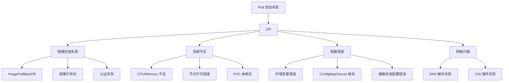

> **生产环境安全提示**
>
> 本文档包含可直接执行的运维命令。执行前请确认：当前目标集群与 Namespace 是否正确；是否具备足够的 RBAC 权限；是否已在非生产环境验证。命令风险等级标注：🔴 高风险（可能造成数据丢失或服务中断）、🟡 中风险（会修改集群状态，但通常可回滚）、🟢 低风险/只读（信息收集，无副作用）。


# 故障树分析（FTA）与取证循证方法论（FEBM）

> **CNCF 状态**: 方法论 | **类别**: Troubleshooting | **主要语言**: Markdown, Mermaid

## 概述

故障树分析（FTA, Fault Tree Analysis）与取证循证方法论（FEBM, Forensic Evidence-Based Methodology）是两种互补的 Kubernetes 生产环境故障诊断方法。FTA 是一种自顶向下的演绎推理方法，从问题现象出发，通过逻辑门（AND/OR）分解为基本原因；FEBM 是一种自底向上的归纳取证方法，从收集的证据出发推理故障原因。两者结合使用——FTA 提供系统化的候选根因框架，FEBM 提供基于证据的验证路径——能显著提高复杂分布式系统的故障定位效率。

## Key Features（核心能力）

- **FTA 故障树**：从顶层事件（问题现象）通过 AND/OR 逻辑门分解到基本原因
- **FEBM 证据链**：证据收集 → 证据分类 → 假设生成 → 假设验证 → 结论输出
- **最小割集分析**：识别导致顶层事件的最小原因组合
- **AI Agent 结合**：FTA 提供候选根因知识库，FEBM 提供验证执行路径
- **可复用的因果图谱**：积累故障案例构建组织级知识库
- **与 K8s 事件集成**：自动从 K8s Events 和指标中收集证据

## 架构与工作原理

FTA + FEBM 联合方法论的工作流：当故障发生时，首先使用 FTA 根据问题类型从预定义的故障树中选择候选根因路径；然后启动 FEBM 流程，收集相关证据（日志、指标、Events、命令输出）；基于证据生成或排除假设；通过额外的诊断命令验证假设；最终确定根因并输出修复方案。AI Agent 可自动化这个过程——FTA 作为知识库提供推理路径，FEBM 作为执行框架驱动证据收集和验证。

## K8s 集成

在 K8s 环境中，FTA 故障树覆盖 Pod 启动失败、服务不可达、性能下降等常见场景，每棵故障树的叶子节点对应可检查的 K8s 资源状态（Pod Status、Events、Node Conditions、Service Endpoints 等）。FEBM 证据收集通过 kubectl 命令、Prometheus 查询和 K8s Events API 自动化执行。

## 生产用例

- **Pod 启动失败诊断**：从 ImagePullBackOff 到 OOMKilled 的系统化排查
- **网络问题定位**：DNS 解析失败、Service 不可达的因果分析
- **性能降级排查**：从应用延迟指标到资源争用的证据链推理
- **AI 运维知识库**：积累故障树和证据模式构建自动化运维 Agent

## 安装与快速开始

```bash
# 🟢 K8s 证据收集命令模板
kubectl describe pod <name> -n <ns>     # Pod 状态和 Events
kubectl get events -n <ns> --sort-by=.lastTimestamp  # 事件时间线
kubectl top pod -n <ns>               # 资源使用
kubectl logs <pod> -n <ns> --previous # 崩溃前日志
```

## FTA 故障树示例：Pod 启动失败



## FEBM 证据收集框架

### 证据分类体系

| 证据类型 | 来源 | 收集命令 | 分析要点 |
|----------|------|----------|----------|
| Pod 状态 | K8s API | `kubectl get pod -o yaml` | conditions, containerStatuses |
| 事件 | K8s Events | `kubectl get events --sort-by=.lastTimestamp` | 时间线、频率、关联对象 |
| 日志 | 容器 stdout | `kubectl logs --previous` | 错误模式、时间戳、堆栈 |
| 指标 | Prometheus | `promql: rate(container_cpu_usage_seconds_total[5m])` | 趋势、突变、阈值 |
| 节点状态 | Node API | `kubectl describe node` | conditions, taints, pressure |
| 网络 | Service/Endpoints | `kubectl get endpoints <svc>` | 端点是否就绪 |

### FEBM 执行流程

```bash
# 阶段1：证据收集（只读，无副作用）
# 🟢 收集 Pod 完整状态
kubectl get pod <name> -n <ns> -o yaml > /tmp/evidence-pod.yaml
kubectl describe pod <name> -n <ns> > /tmp/evidence-describe.txt

# 🟢 收集事件时间线
kubectl get events -n <ns> --sort-by=.lastTimestamp > /tmp/evidence-events.txt

# 🟢 收集日志（当前 + 上次崩溃）
kubectl logs <pod> -n <ns> --tail=200 > /tmp/evidence-logs-current.txt
kubectl logs <pod> -n <ns> --previous --tail=200 > /tmp/evidence-logs-previous.txt

# 🟢 收集资源使用
kubectl top pod <pod> -n <ns> > /tmp/evidence-resources.txt

# 🟢 收集节点状态
kubectl describe node $(kubectl get pod <pod> -n <ns> -o jsonpath='{.spec.nodeName}') > /tmp/evidence-node.txt

# 阶段2：假设生成与验证
# 基于证据生成假设，然后执行验证命令：

# 假设: 镜像拉取失败
kubectl get events -n <ns> --field-selector reason=Failed | grep -i pull

# 假设: OOMKilled
kubectl get pod <pod> -n <ns> -o jsonpath='{.status.containerStatuses[0].lastState.terminated.reason}'

# 假设: 探针配置错误
kubectl get pod <pod> -n <ns> -o jsonpath='{.spec.containers[0].livenessProbe}'

# 假设: 资源不足
kubectl describe node <node> | grep -A5 "Allocated resources"
```

## AI Agent 集成模式

```yaml
# FTA 知识库结构示例
fault_trees:
  - id: pod-startup-failure
    top_event: "Pod 无法进入 Running 状态"
    gates:
      - type: OR
        children:
          - type: BASIC
            id: image-pull-failure
            evidence_commands:
              - "kubectl get events -n {ns} --field-selector reason=Failed"
              - "kubectl describe pod {pod} -n {ns} | grep -A5 'Events'"
            fix_actions:
              - "检查镜像名称和 tag 是否正确"
              - "检查 imagePullSecrets 配置"
              - "检查节点到 Registry 的网络连通性"
          - type: BASIC
            id: oom-killed
            evidence_commands:
              - "kubectl get pod {pod} -n {ns} -o jsonpath='{.status.containerStatuses[0].lastState}'"
              - "kubectl top pod {pod} -n {ns}"
            fix_actions:
              - "增加 memory limits"
              - "检查应用内存泄漏"
```

## 生产案例

### 案例1：复杂网络故障定位
- **场景**：微服务间调用间歇性超时，影响多个服务
- **FTA 应用**：从“服务调用超时”顶层事件分解：DNS 解析 / 连接建立 / 数据传输 / 服务端处理
- **FEBM 验证**：收集 CoreDNS 日志发现 NXDOMAIN；检查 Service Endpoints 发现部分 Pod 未就绪；最终定位为 CNI 插件 Bug 导致部分 Pod IP 未注册
- **效果**：故障定位时间从 2小时 缩短到 15分钟

### 案例2：性能降级根因分析
- **场景**：API 响应时间从 50ms 逐渐升高到 2s
- **FTA 应用**：从“响应延迟”分解：CPU 争用 / 内存压力 / 磁盘 I/O / 网络延迟 / 依赖服务慢
- **FEBM 验证**：Prometheus 指标显示 CPU throttling；cgroup 统计确认 CPU limit 过低；结合部署时间线确认是新版本资源需求增加
- **效果**：建立可复用的性能故障树，后续类似问题 5分钟内定位

## 对比替代方案

| 维度 | FTA+FEBM | 5 Whys | 试错法 | AIOps |
|------|---------|--------|--------|-------|
| 系统性 | 强 | 中 | 弱 | 强 |
| 可追溯 | 强 | 中 | 弱 | 中 |
| 学习曲线 | 中 | 低 | 低 | 高 |
| 复杂故障 | 强 | 弱 | 弱 | 强 |
| 可复用 | 强 | 弱 | 无 | 中 |
| 自动化 | 支持 | 无 | 无 | 核心 |

## 检查清单

- [ ] 常见故障场景已建立 FTA 故障树
- [ ] FEBM 证据收集命令模板已准备
- [ ] 证据收集脚本已自动化（只读命令）
- [ ] 故障案例已积累到知识库
- [ ] AI Agent 已集成 FTA 知识库（可选）
- [ ] 团队已培训 FTA+FEBM 方法论

## Related

- [[概念/Structural Troubleshooting Framework.md|Structural Troubleshooting Framework]] — Structural Troubleshooting Framework
- [[概念/Production Troubleshooting Playbook.md|Production Troubleshooting Playbook]] — Production Troubleshooting Playbook

- [[README]]
- [[nginx-ingress-fta]]


<!-- risk-assessed -->
