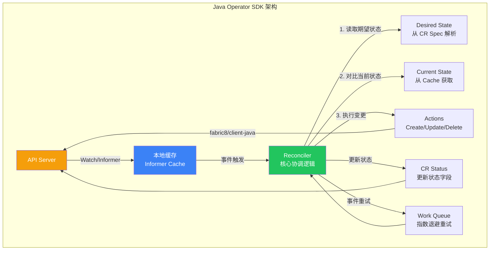
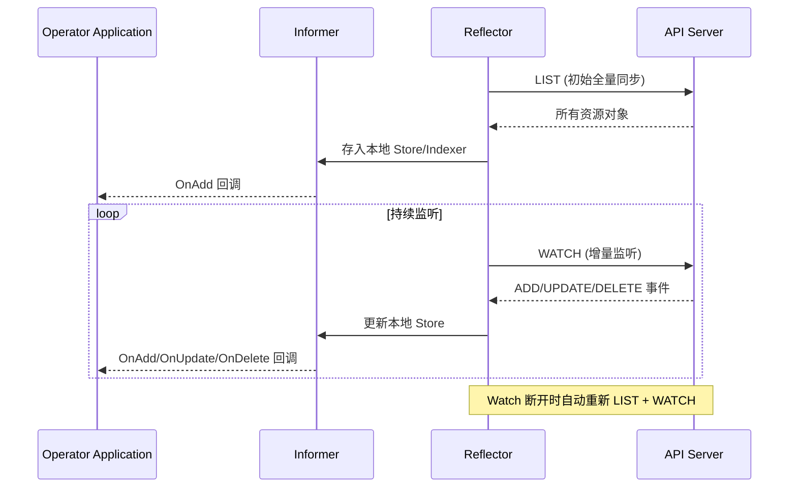

> **生产环境安全提示**
>
> 本文档包含可直接执行的运维命令。执行前请确认：当前目标集群与 Namespace 是否正确；是否具备足够的 RBAC 权限；是否已在非生产环境验证。命令风险等级标注：🔴 高风险（可能造成数据丢失或服务中断）、🟡 中风险（会修改集群状态，但通常可回滚）、🟢 低风险/只读（信息收集，无副作用）。


# Java Operator SDK 开发指南

> **适用版本**: JDK 17+ / Java Operator SDK 4.x / fabric8 7.x / [[entities/kubernetes.md|[[Kubernetes|kubernetes]]]] v1.28+
> **最后更新**: 2026-04-30

---

## 一、概述

Kubernetes Operator 模式允许使用自定义资源（CRD）扩展 Kubernetes 平台能力。虽然 Go 是 Operator 开发的主流语言，但 Java 生态同样有成熟的 SDK——尤其是对于已有 Java 技术栈的团队，使用 Java Operator SDK 可以复用现有的业务逻辑、类库和 CI/CD 流水线。

本指南覆盖 Java Operator SDK 的核心开发模式，包括 Kubernetes 客户端选型（fabric8 vs client-java）、CRD 定义、Reconciler 实现、Informer 模式、状态管理、Finalizer、Leader Election 以及测试策略。



---

## 二、架构设计

### 2.1 Kubernetes Java 客户端对比

Java 生态有两个主要的 Kubernetes 客户端库，选择正确的客户端是 Operator 开发的第一步：

| 特性 | fabric8 kubernetes-client | official client-java |
|------|--------------------------|---------------------|
| **维护方** | Red Hat / 社区 | Kubernetes 官方 |
| **API 风格** | 流式 DSL（Fluent API） | Proto 生成的标准 API |
| **CRD 支持** | 原生 POJO + Type 加载 | 需要 Proto 定义或手动 |
| **Informer 支持** | 内置 | 内置 |
| **Operator SDK 集成** | Java Operator SDK (josdk) | KubeBuilder-style (KOG) |
| **文档质量** | 优秀 | 一般 |
| **社区活跃度** | 高 | 中等 |
| **Spring Boot 集成** | spring-cloud-kubernetes | 无官方集成 |
| **文件大小** | ~15MB | ~25MB |
| **学习曲线** | 较平缓 | 较陡峭 |

```java
// fabric8 客户端示例 — 流式 DSL
KubernetesClient client = new DefaultKubernetesClient();
PodList pods = client.pods()
    .inNamespace("production")
    .withLabel("app", "myapp")
    .list();

Pod pod = client.pods()
    .inNamespace("production")
    .withName("myapp-abc123")
    .get();

client.apps().deployments()
    .inNamespace("production")
    .withName("myapp")
    .scale(5);
```

```java
// official client-java 示例
ApiClient apiClient = ClientBuilder.standard().build();
CoreV1Api coreApi = new CoreV1Api(apiClient);
AppsV1Api appsApi = new AppsV1Api(apiClient);

V1PodList pods = coreApi.listNamespacedPod("production")
    .labelSelector("app=myapp")
    .execute();

V1Deployment deployment = appsApi.readNamespacedDeployment("myapp", "production")
    .execute();

appsApi.replaceNamespacedDeploymentScale("myapp", "production",
    new V1Scale().spec(new V1ScaleSpec().replicas(5)))
    .execute();
```

> **推荐**: Java Operator SDK 底层使用 fabric8，本指南以 fabric8 + Java Operator SDK 为主。

### 2.2 Informer 模式详解

Informer 是 Kubernetes 客户端的核心组件，它通过 Watch 机制实现本地缓存，避免频繁调用 API Server：



```java
// fabric8 Informer 底层配置
SharedIndexInformer<V1Pod> informer = client.pods()
    .inNamespace("production")
    .withLabel("app", "myapp")
    .inform(new ResourceEventHandler<V1Pod>() {
        @Override
        public void onAdd(V1Pod pod) {
            log.info("Pod added: {}", pod.getMetadata().getName());
        }

        @Override
        public void onUpdate(V1Pod oldPod, V1Pod newPod) {
            log.info("Pod updated: {}", newPod.getMetadata().getName());
        }

        @Override
        public void onDelete(V1Pod pod, boolean deletedFinalStateUnknown) {
            log.info("Pod deleted: {}", pod.getMetadata().getName());
        }
    }, 30_000L);

// 注册索引（用于快速查找）
informer.getIndexer().addIndexers(new Indexer<V1Pod>() {
    @Override
    public String[] getKeys(V1Pod pod) {
        return new String[]{pod.getSpec().getNodeName()};
    }
});

// 使用索引查询
List<V1Pod> podsOnNode = informer.getIndexer()
    .byIndex("node", "worker-node-1");
```

---

## 三、核心配置

### 3.1 项目初始化

```xml
<project>
    <modelVersion>4.0.0</modelVersion>
    <groupId>com.example</groupId>
    <artifactId>my-operator</artifactId>
    <version>1.0.0</version>

    <properties>
        <java.version>17</java.version>
        <josdk.version>4.9.6</josdk.version>
        <fabric8.version>7.1.0</fabric8.version>
        <slf4j.version>2.0.16</slf4j.version>
    </properties>

    <dependencyManagement>
        <dependencies>
            <dependency>
                <groupId>io.fabric8</groupId>
                <artifactId>kubernetes-client-bom</artifactId>
                <version>${fabric8.version}</version>
                <type>pom</type>
                <scope>import</scope>
            </dependency>
        </dependencies>
    </dependencyManagement>

    <dependencies>
        <dependency>
            <groupId>io.javaoperatorsdk</groupId>
            <artifactId>operator-framework</artifactId>
            <version>${josdk.version}</version>
        </dependency>
        <dependency>
            <groupId>io.javaoperatorsdk</groupId>
            <artifactId>operator-framework-spring-boot-starter</artifactId>
            <version>${josdk.version}</version>
        </dependency>
        <dependency>
            <groupId>io.fabric8</groupId>
            <artifactId>kubernetes-client</artifactId>
        </dependency>
        <dependency>
            <groupId>org.slf4j</groupId>
            <artifactId>slf4j-api</artifactId>
            <version>${slf4j.version}</version>
        </dependency>
        <dependency>
            <groupId>ch.qos.logback</groupId>
            <artifactId>logback-classic</artifactId>
            <version>1.5.16</version>
        </dependency>

        <dependency>
            <groupId>io.javaoperatorsdk</groupId>
            <artifactId>operator-framework-spring-boot-starter-test</artifactId>
            <version>${josdk.version}</version>
            <scope>test</scope>
        </dependency>
        <dependency>
            <groupId>io.fabric8</groupId>
            <artifactId>kubernetes-client-api</artifactId>
            <classifier>tests</classifier>
            <scope>test</scope>
        </dependency>
        <dependency>
            <groupId>io.fabric8</groupId>
            <artifactId>kubernetes-server-mock</artifactId>
            <scope>test</scope>
        </dependency>
        <dependency>
            <groupId>org.junit.jupiter</groupId>
            <artifactId>junit-jupiter</artifactId>
            <version>5.11.4</version>
            <scope>test</scope>
        </dependency>
        <dependency>
            <groupId>org.awaitility</groupId>
            <artifactId>awaitility</artifactId>
            <version>4.2.2</version>
            <scope>test</scope>
        </dependency>
    </dependencies>
</project>
```

### 3.2 CRD 定义

```java
@Group("apps.example.com")
@Version("v1alpha1")
@ShortNames("wa")
@Plural("webapps")
@Singular("webapp")
public class WebApp extends CustomResource<WebAppSpec, WebAppStatus>
        implements Namespaced {
}

public class WebAppSpec {
    private String image;
    private int replicas = 1;
    private ResourceRequirements resources;
    private ProbeSpec livenessProbe;
    private ProbeSpec readinessProbe;
    private Map<String, String> env;
    private Map<String, String> labels;
    private String serviceAccountName;
    private boolean tlsEnabled = false;
    private String hostname;

    // getters and setters omitted for brevity
    // 实际代码中必须提供完整的 getter/setter
    
    public String getImage() { return image; }
    public void setImage(String image) { this.image = image; }
    public int getReplicas() { return replicas; }
    public void setReplicas(int replicas) { this.replicas = replicas; }
    public ResourceRequirements getResources() { return resources; }
    public void setResources(ResourceRequirements resources) { this.resources = resources; }
    public ProbeSpec getLivenessProbe() { return livenessProbe; }
    public void setLivenessProbe(ProbeSpec livenessProbe) { this.livenessProbe = livenessProbe; }
    public ProbeSpec getReadinessProbe() { return readinessProbe; }
    public void setReadinessProbe(ProbeSpec readinessProbe) { this.readinessProbe = readinessProbe; }
    public Map<String, String> getEnv() { return env; }
    public void setEnv(Map<String, String> env) { this.env = env; }
    public Map<String, String> getLabels() { return labels; }
    public void setLabels(Map<String, String> labels) { this.labels = labels; }
    public String getServiceAccountName() { return serviceAccountName; }
    public void setServiceAccountName(String serviceAccountName) { this.serviceAccountName = serviceAccountName; }
    public boolean isTlsEnabled() { return tlsEnabled; }
    public void setTlsEnabled(boolean tlsEnabled) { this.tlsEnabled = tlsEnabled; }
    public String getHostname() { return hostname; }
    public void setHostname(String hostname) { this.hostname = hostname; }
}

public class WebAppStatus {
    private ConditionStatus ready;
    private String message;
    private int availableReplicas;
    private int updatedReplicas;
    private String deploymentName;
    private String serviceName;
    private String url;
    private List<String> conditions;

    public ConditionStatus getReady() { return ready; }
    public void setReady(ConditionStatus ready) { this.ready = ready; }
    public String getMessage() { return message; }
    public void setMessage(String message) { this.message = message; }
    public int getAvailableReplicas() { return availableReplicas; }
    public void setAvailableReplicas(int availableReplicas) { this.availableReplicas = availableReplicas; }
    public int getUpdatedReplicas() { return updatedReplicas; }
    public void setUpdatedReplicas(int updatedReplicas) { this.updatedReplicas = updatedReplicas; }
    public String getDeploymentName() { return deploymentName; }
    public void setDeploymentName(String deploymentName) { this.deploymentName = deploymentName; }
    public String getServiceName() { return serviceName; }
    public void setServiceName(String serviceName) { this.serviceName = serviceName; }
    public String getUrl() { return url; }
    public void setUrl(String url) { this.url = url; }
    public List<String> getConditions() { return conditions; }
    public void setConditions(List<String> conditions) { this.conditions = conditions; }

    public enum ConditionStatus {
        TRUE, FALSE, UNKNOWN
    }
}

public class ResourceRequirements {
    private String cpuRequest;
    private String cpuLimit;
    private String memoryRequest;
    private String memoryLimit;

    public String getCpuRequest() { return cpuRequest; }
    public void setCpuRequest(String cpuRequest) { this.cpuRequest = cpuRequest; }
    public String getCpuLimit() { return cpuLimit; }
    public void setCpuLimit(String cpuLimit) { this.cpuLimit = cpuLimit; }
    public String getMemoryRequest() { return memoryRequest; }
    public void setMemoryRequest(String memoryRequest) { this.memoryRequest = memoryRequest; }
    public String getMemoryLimit() { return memoryLimit; }
    public void setMemoryLimit(String memoryLimit) { this.memoryLimit = memoryLimit; }
}

public class ProbeSpec {
    private String httpGetPath;
    private int port = 8080;
    private int initialDelaySeconds = 10;
    private int periodSeconds = 10;
    private int failureThreshold = 3;

    public String getHttpGetPath() { return httpGetPath; }
    public void setHttpGetPath(String httpGetPath) { this.httpGetPath = httpGetPath; }
    public int getPort() { return port; }
    public void setPort(int port) { this.port = port; }
    public int getInitialDelaySeconds() { return initialDelaySeconds; }
    public void setInitialDelaySeconds(int initialDelaySeconds) { this.initialDelaySeconds = initialDelaySeconds; }
    public int getPeriodSeconds() { return periodSeconds; }
    public void setPeriodSeconds(int periodSeconds) { this.periodSeconds = periodSeconds; }
    public int getFailureThreshold() { return failureThreshold; }
    public void setFailureThreshold(int failureThreshold) { this.failureThreshold = failureThreshold; }
}
```

### 3.3 Reconciler 实现

```java
@ControllerConfiguration(
    name = "webapp-controller",
    labelSelector = "app.kubernetes.io/managed-by=webapp-operator",
    generationAware = true
)
public class WebAppReconciler implements Reconciler<WebApp>,
        ContextInitializer<WebApp>,
        ErrorStatusHandler<WebApp>,
        EventSourceInitializer<WebApp> {

    private static final Logger log = LoggerFactory.getLogger(WebAppReconciler.class);
    private static final String FINALIZER_NAME = "apps.example.com/webapp-cleanup";

    private final KubernetesClient client;

    public WebAppReconciler(KubernetesClient client) {
        this.client = client;
    }

    @Override
    public void initContext(WebApp resource, Context<WebApp> context) {
        ContextInitializer.super.initContext(resource, context);
    }

    @Override
    public List<EventSource<?, ?>> prepareEventSources(EventSourceContext<WebApp> context) {
        SecondaryToPrimaryMapper<Deployment> deploymentMapper = (Deployment dep) -> {
            String ownerName = dep.getMetadata().getLabels().get("app.kubernetes.io/instance");
            return Set.of(new ResourceID(ownerName, dep.getMetadata().getNamespace()));
        };

        InformerEventSource<Deployment, WebApp> deploymentEventSource =
            new InformerEventSource.Builder<Deployment, WebApp>()
                .withInformerConfiguration(
                    InformerConfiguration.from(Deployment.class, context)
                        .withLabelSelector("app.kubernetes.io/managed-by=webapp-operator")
                        .withSecondaryToPrimaryMapper(deploymentMapper)
                        .build())
                .build();

        SecondaryToPrimaryMapper<Service> serviceMapper = (Service svc) -> {
            String ownerName = svc.getMetadata().getLabels().get("app.kubernetes.io/instance");
            return Set.of(new ResourceID(ownerName, svc.getMetadata().getNamespace()));
        };

        InformerEventSource<Service, Service> serviceEventSource =
            new InformerEventSource.Builder<Service, WebApp>()
                .withInformerConfiguration(
                    InformerConfiguration.from(Service.class, context)
                        .withLabelSelector("app.kubernetes.io/managed-by=webapp-operator")
                        .withSecondaryToPrimaryMapper(serviceMapper)
                        .build())
                .build();

        return List.of(deploymentEventSource, serviceEventSource);
    }

    @Override
    public UpdateControl<WebApp> reconcile(WebApp resource, Context<WebApp> context) {
        String name = resource.getMetadata().getName();
        String namespace = resource.getMetadata().getNamespace();
        log.info("Reconciling WebApp {}/{}", namespace, name);

        try {
            if (resource.isMarkedForDeletion()) {
                return handleDeletion(resource, context);
            }

            ensureFinalizer(resource);

            Deployment desiredDeployment = createDesiredDeployment(resource);
            Service desiredService = createDesiredService(resource);

            reconcileDeployment(resource, desiredDeployment, context);
            reconcileService(resource, desiredService, context);

            return updateStatus(resource, context);
        } catch (Exception e) {
            log.error("Error reconciling WebApp {}/{}", namespace, name, e);
            return UpdateControl.updateStatus(updateStatusForError(resource, e));
        }
    }

    private UpdateControl<WebApp> handleDeletion(WebApp resource, Context<WebApp> context) {
        log.info("Handling deletion for WebApp {}/{}",
            resource.getMetadata().getNamespace(), resource.getMetadata().getName());

        // 清理外部资源（如数据库记录、外部 API 调用等）
        cleanupExternalResources(resource);

        // 移除 Finalizer
        if (resource.getMetadata().getFinalizers() != null) {
            resource.getMetadata().getFinalizers().remove(FINALIZER_NAME);
        }
        return UpdateControl.updateResource(resource);
    }

    private void ensureFinalizer(WebApp resource) {
        if (resource.getMetadata().getFinalizers() == null) {
            resource.getMetadata().setFinalizers(new ArrayList<>());
        }
        if (!resource.getMetadata().getFinalizers().contains(FINALIZER_NAME)) {
            resource.getMetadata().getFinalizers().add(FINALIZER_NAME);
        }
    }

    private Deployment createDesiredDeployment(WebApp resource) {
        WebAppSpec spec = resource.getSpec();
        Map<String, String> labels = createCommonLabels(resource);
        Map<String, String> selectorMatchLabels = Map.of("app.kubernetes.io/name", "webapp",
            "app.kubernetes.io/instance", resource.getMetadata().getName());

        ContainerBuilder containerBuilder = new ContainerBuilder()
            .withName("webapp")
            .withImage(spec.getImage())
            .withPorts(new ContainerPortBuilder()
                .withContainerPort(spec.getReadinessProbe() != null ? spec.getReadinessProbe().getPort() : 8080)
                .withProtocol("TCP")
                .build())
            .withImagePullPolicy("IfNotPresent");

        if (spec.getResources() != null) {
            Map<String, Quantity> requests = new HashMap<>();
            Map<String, Quantity> limits = new HashMap<>();
            if (spec.getResources().getCpuRequest() != null) {
                requests.put("cpu", new Quantity(spec.getResources().getCpuRequest()));
            }
            if (spec.getResources().getMemoryRequest() != null) {
                requests.put("memory", new Quantity(spec.getResources().getMemoryRequest()));
            }
            if (spec.getResources().getCpuLimit() != null) {
                limits.put("cpu", new Quantity(spec.getResources().getCpuLimit()));
            }
            if (spec.getResources().getMemoryLimit() != null) {
                limits.put("memory", new Quantity(spec.getResources().getMemoryLimit()));
            }
            containerBuilder.withResources(new ResourceRequirementsBuilder()
                .withRequests(requests)
                .withLimits(limits)
                .build());
        }

        if (spec.getLivenessProbe() != null) {
            containerBuilder.withLivenessProbe(new ProbeBuilder()
                .withHttpGet(new HTTPGetActionBuilder()
                    .withPath(spec.getLivenessProbe().getHttpGetPath())
                    .withPort(new IntOrString(spec.getLivenessProbe().getPort()))
                    .build())
                .withInitialDelaySeconds(spec.getLivenessProbe().getInitialDelaySeconds())
                .withPeriodSeconds(spec.getLivenessProbe().getPeriodSeconds())
                .withFailureThreshold(spec.getLivenessProbe().getFailureThreshold())
                .build());
        }

        if (spec.getReadinessProbe() != null) {
            containerBuilder.withReadinessProbe(new ProbeBuilder()
                .withHttpGet(new HTTPGetActionBuilder()
                    .withPath(spec.getReadinessProbe().getHttpGetPath())
                    .withPort(new IntOrString(spec.getReadinessProbe().getPort()))
                    .build())
                .withInitialDelaySeconds(spec.getReadinessProbe().getInitialDelaySeconds())
                .withPeriodSeconds(spec.getReadinessProbe().getPeriodSeconds())
                .withFailureThreshold(spec.getReadinessProbe().getFailureThreshold())
                .build());
        }

        if (spec.getEnv() != null && !spec.getEnv().isEmpty()) {
            List<EnvVar> envVars = spec.getEnv().entrySet().stream()
                .map(e -> new EnvVarBuilder()
                    .withName(e.getKey())
                    .withValue(e.getValue())
                    .build())
                .collect(Collectors.toList());
            containerBuilder.withEnv(envVars);
        }

        return new DeploymentBuilder()
            .withNewMetadata()
                .withName(resource.getMetadata().getName())
                .withNamespace(resource.getMetadata().getNamespace())
                .withLabels(labels)
                .withOwnerReferences(new OwnerReferenceBuilder()
                    .withApiVersion(resource.getApiVersion())
                    .withKind(resource.getKind())
                    .withName(resource.getMetadata().getName())
                    .withUid(resource.getMetadata().getUid())
                    .withBlockOwnerDeletion(true)
                    .withController(true)
                    .build())
            .endMetadata()
            .withNewSpec()
                .withReplicas(spec.getReplicas())
                .withNewSelector()
                    .withMatchLabels(selectorMatchLabels)
                .endSelector()
                .withNewTemplate()
                    .withNewMetadata()
                        .withLabels(labels)
                    .endMetadata()
                    .withNewSpec()
                        .withServiceAccountName(spec.getServiceAccountName())
                        .withSecurityContext(new PodSecurityContextBuilder()
                            .withRunAsNonRoot(true)
                            .withRunAsUser(1001L)
                            .withFsGroup(1001L)
                            .build())
                        .withContainers(containerBuilder.build())
                    .endSpec()
                .endTemplate()
            .endSpec()
            .build();
    }

    private Service createDesiredService(WebApp resource) {
        Map<String, String> labels = createCommonLabels(resource);
        Map<String, String> selectorLabels = Map.of(
            "app.kubernetes.io/name", "webapp",
            "app.kubernetes.io/instance", resource.getMetadata().getName());

        return new ServiceBuilder()
            .withNewMetadata()
                .withName(resource.getMetadata().getName() + "-svc")
                .withNamespace(resource.getMetadata().getNamespace())
                .withLabels(labels)
                .withOwnerReferences(new OwnerReferenceBuilder()
                    .withApiVersion(resource.getApiVersion())
                    .withKind(resource.getKind())
                    .withName(resource.getMetadata().getName())
                    .withUid(resource.getMetadata().getUid())
                    .build())
            .endMetadata()
            .withNewSpec()
                .withType("ClusterIP")
                .withSelector(selectorLabels)
                .withPorts(new ServicePortBuilder()
                    .withPort(80)
                    .withTargetPort(new IntOrString(
                        resource.getSpec().getReadinessProbe() != null
                            ? resource.getSpec().getReadinessProbe().getPort() : 8080))
                    .withProtocol("TCP")
                    .withName("http")
                    .build())
            .endSpec()
            .build();
    }

    private void reconcileDeployment(WebApp resource, Deployment desired, Context<WebApp> context) {
        String name = resource.getMetadata().getName();
        String namespace = resource.getMetadata().getNamespace();

        Optional<Deployment> existing = context.getSecondaryResource(Deployment.class,
            name);

        if (existing.isEmpty()) {
            log.info("Creating Deployment {}/{}", namespace, name);
            client.apps().deployments()
                .inNamespace(namespace)
                .resource(desired)
                .create();
        } else {
            Deployment current = existing.get();
            if (!Objects.equals(current.getSpec().getReplicas(), desired.getSpec().getReplicas())
                || !Objects.equals(
                    current.getSpec().getTemplate().getSpec().getContainers().get(0).getImage(),
                    desired.getSpec().getTemplate().getSpec().getContainers().get(0).getImage())) {
                log.info("Updating Deployment {}/{}", namespace, name);
                client.apps().deployments()
                    .inNamespace(namespace)
                    .resource(desired)
                    .update();
            }
        }
    }

    private void reconcileService(WebApp resource, Service desired, Context<WebApp> context) {
        String name = resource.getMetadata().getName() + "-svc";
        String namespace = resource.getMetadata().getNamespace();

        Optional<Service> existing = context.getSecondaryResource(Service.class, name);

        if (existing.isEmpty()) {
            log.info("Creating Service {}/{}", namespace, name);
            client.services()
                .inNamespace(namespace)
                .resource(desired)
                .create();
        }
    }

    private UpdateControl<WebApp> updateStatus(WebApp resource, Context<WebApp> context) {
        String name = resource.getMetadata().getName();
        String namespace = resource.getMetadata().getNamespace();

        WebAppStatus status = resource.getStatus();
        if (status == null) {
            status = new WebAppStatus();
            resource.setStatus(status);
        }

        Deployment deployment = client.apps().deployments()
            .inNamespace(namespace)
            .withName(name)
            .get();

        if (deployment != null && deployment.getStatus() != null) {
            status.setAvailableReplicas(
                deployment.getStatus().getAvailableReplicas() != null
                    ? deployment.getStatus().getAvailableReplicas() : 0);
            status.setUpdatedReplicas(
                deployment.getStatus().getUpdatedReplicas() != null
                    ? deployment.getStatus().getUpdatedReplicas() : 0);

            boolean isReady = status.getAvailableReplicas() >= resource.getSpec().getReplicas();
            status.setReady(isReady
                ? WebAppStatus.ConditionStatus.TRUE
                : WebAppStatus.ConditionStatus.FALSE);
            status.setMessage(isReady
                ? "Deployment is ready"
                : String.format("Waiting for replicas: %d/%d",
                    status.getAvailableReplicas(), resource.getSpec().getReplicas()));
        } else {
            status.setReady(WebAppStatus.ConditionStatus.UNKNOWN);
            status.setMessage("Deployment not found");
        }

        status.setDeploymentName(name);
        status.setServiceName(name + "-svc");
        status.setUrl(String.format("http://%s.%s.svc.cluster.local",
            name + "-svc", namespace));

        return UpdateControl.updateStatus(resource);
    }

    private WebApp updateStatusForError(WebApp resource, Exception e) {
        WebAppStatus status = resource.getStatus();
        if (status == null) {
            status = new WebAppStatus();
            resource.setStatus(status);
        }
        status.setReady(WebAppStatus.ConditionStatus.FALSE);
        status.setMessage("Error: " + e.getMessage());
        return resource;
    }

    @Override
    public ErrorStatusUpdateControl<WebApp> updateErrorStatus(WebApp resource, Context<WebApp> context, Exception e) {
        WebAppStatus status = resource.getStatus();
        if (status == null) {
            status = new WebAppStatus();
            resource.setStatus(status);
        }
        status.setReady(WebAppStatus.ConditionStatus.FALSE);
        status.setMessage("Reconciliation error: " + e.getMessage());
        return ErrorStatusUpdateControl.updateStatus(resource);
    }

    private Map<String, String> createCommonLabels(WebApp resource) {
        Map<String, String> labels = new HashMap<>();
        labels.put("app.kubernetes.io/name", "webapp");
        labels.put("app.kubernetes.io/instance", resource.getMetadata().getName());
        labels.put("app.kubernetes.io/managed-by", "webapp-operator");
        labels.put("app.kubernetes.io/version",
            resource.getMetadata().getLabels() != null
                && resource.getMetadata().getLabels().containsKey("app.kubernetes.io/version")
                ? resource.getMetadata().getLabels().get("app.kubernetes.io/version") : "latest");
        if (resource.getSpec().getLabels() != null) {
            labels.putAll(resource.getSpec().getLabels());
        }
        return labels;
    }

    private void cleanupExternalResources(WebApp resource) {
        log.info("Cleaning up external resources for WebApp {}",
            resource.getMetadata().getName());
    }
}
```

### 3.4 CRD 生成与安装

```java
@Configuration
public class OperatorConfig {

    @Bean
    publiccrdGenerator() {
        return new CRDGenerator()
            .withCustomResourceDefinitions(
                new CRDGenerator.Context()
                    .withOutputDir("k8s/crds")
            )
            .inOutputDir("k8s/crds");
    }
}
```

Maven 插件自动生成 CRD YAML：

```xml
<plugin>
    <groupId>io.javaoperatorsdk</groupId>
    <artifactId>josdk-crd-generator-maven-plugin</artifactId>
    <version>4.9.6</version>
    <executions>
        <execution>
            <goals>
                <goal>generate</goal>
            </goals>
            <phase>process-classes</phase>
        </execution>
    </executions>
    <configuration>
        <outputDir>${project.basedir}/k8s/crds</outputDir>
    </configuration>
</plugin>
```

生成的 CRD YAML：

```yaml
apiVersion: apiextensions.k8s.io/v1
kind: CustomResourceDefinition
metadata:
  name: webapps.apps.example.com
spec:
  group: apps.example.com
  versions:
    - name: v1alpha1
      served: true
      storage: true
      subresources:
        status: {}
      schema:
        openAPIV3Schema:
          type: object
          properties:
            spec:
              type: object
              properties:
                image:
                  type: string
                replicas:
                  type: integer
                  minimum: 1
                  maximum: 100
                  default: 1
                resources:
                  type: object
                  properties:
                    cpuRequest:
                      type: string
                    cpuLimit:
                      type: string
                    memoryRequest:
                      type: string
                    memoryLimit:
                      type: string
                hostname:
                  type: string
                tlsEnabled:
                  type: boolean
                  default: false
                env:
                  type: object
                  additionalProperties:
                    type: string
                labels:
                  type: object
                  additionalProperties:
                    type: string
                serviceAccountName:
                  type: string
                livenessProbe:
                  type: object
                  properties:
                    httpGetPath:
                      type: string
                    port:
                      type: integer
                      default: 8080
                    initialDelaySeconds:
                      type: integer
                      default: 10
                    periodSeconds:
                      type: integer
                      default: 10
                    failureThreshold:
                      type: integer
                      default: 3
                readinessProbe:
                  type: object
                  properties:
                    httpGetPath:
                      type: string
                    port:
                      type: integer
                      default: 8080
                    initialDelaySeconds:
                      type: integer
                      default: 10
                    periodSeconds:
                      type: integer
                      default: 10
                    failureThreshold:
                      type: integer
                      default: 3
              required:
                - image
            status:
              type: object
              properties:
                ready:
                  type: string
                  enum: [TRUE, FALSE, UNKNOWN]
                message:
                  type: string
                availableReplicas:
                  type: integer
                updatedReplicas:
                  type: integer
                deploymentName:
                  type: string
                serviceName:
                  type: string
                url:
                  type: string
                conditions:
                  type: array
                  items:
                    type: string
      additionalPrinterColumns:
        - name: Image
          type: string
          jsonPath: .spec.image
        - name: Replicas
          type: integer
          jsonPath: .spec.replicas
        - name: Ready
          type: string
          jsonPath: .status.ready
        - name: Available
          type: integer
          jsonPath: .status.availableReplicas
        - name: Age
          type: date
          jsonPath: .metadata.creationTimestamp
  scope: Namespaced
  names:
    plural: webapps
    singular: webapp
    shortNames:
      - wa
    kind: WebApp
```

### 3.5 Leader Election 配置

```java
@Configuration
public class OperatorLeaderElectionConfig {

    @Bean
    public LeaderElectionConfiguration leaderElectionConfiguration() {
        return new LeaderElectionConfiguration(
            "webapp-operator-lock",
            "production",
            Duration.ofSeconds(15),
            Duration.ofSeconds(10),
            Duration.ofSeconds(30)
        );
    }
}
```

```yaml
# Leader Election 所需的 RBAC
apiVersion: rbac.authorization.k8s.io/v1
kind: Role
metadata:
  name: webapp-operator-leader
  namespace: production
rules:
  - apiGroups: ["coordination.k8s.io"]
    resources: ["leases"]
    verbs: ["get", "list", "watch", "create", "update", "patch", "delete"]
  - apiGroups: [""]
    resources: ["events"]
    verbs: ["create"]
---
apiVersion: rbac.authorization.k8s.io/v1
kind: RoleBinding
metadata:
  name: webapp-operator-leader
  namespace: production
roleRef:
  apiGroup: rbac.authorization.k8s.io
  kind: Role
  name: webapp-operator-leader
subjects:
  - kind: ServiceAccount
    name: webapp-operator-sa
    namespace: production
```

---

## 四、最佳实践

### 4.1 测试策略

#### 单元测试 — fabric8 Mock Server

```java
@ExtendWith(MockServerExtension.class)
class WebAppReconcilerTest {

    private KubernetesClient client;
    private WebAppReconciler reconciler;
    private MockServer mockServer;

    @BeforeEach
    void setUp(MockServer mockServer) {
        this.mockServer = mockServer;
        this.client = mockServer.createClient();
        this.reconciler = new WebAppReconciler(client);
    }

    @Test
    void shouldCreateDeploymentWhenWebAppCreated() {
        WebApp webApp = createTestWebApp("test-app", "default", "nginx:latest", 3);

        mockServer.expect()
            .get()
            .withPath("/apis/apps.example.com/v1alpha1/namespaces/default/webapps/test-app")
            .andReturn(200, webApp)
            .always();

        mockServer.expect()
            .post()
            .withPath("/apis/apps/v1/namespaces/default/deployments")
            .andReturn(201, new DeploymentBuilder().build())
            .once();

        mockServer.expect()
            .post()
            .withPath("/api/v1/namespaces/default/services")
            .andReturn(201, new ServiceBuilder().build())
            .once();

        UpdateControl<WebApp> result = reconciler.reconcile(webApp,
            new DefaultContext(null, null, null, null));

        assertNotNull(result);
        mockServer.assertRequestCount(3);
    }

    @Test
    void shouldHandleDeletionWithFinalizer() {
        WebApp webApp = createTestWebApp("test-app", "default", "nginx:latest", 1);
        webApp.getMetadata().setDeletionTimestamp(Instant.now().toString());
        webApp.getMetadata().setFinalizers(List.of("apps.example.com/webapp-cleanup"));

        UpdateControl<WebApp> result = reconciler.reconcile(webApp,
            new DefaultContext(null, null, null, null));

        assertTrue(result.isUpdateResource());
        assertFalse(webApp.getMetadata().getFinalizers()
            .contains("apps.example.com/webapp-cleanup"));
    }

    private WebApp createTestWebApp(String name, String namespace, String image, int replicas) {
        WebApp webApp = new WebApp();
        ObjectMeta metadata = new ObjectMeta();
        metadata.setName(name);
        metadata.setNamespace(namespace);
        metadata.setUid(UUID.randomUUID().toString());
        webApp.setMetadata(metadata);

        WebAppSpec spec = new WebAppSpec();
        spec.setImage(image);
        spec.setReplicas(replicas);
        webApp.setSpec(spec);

        return webApp;
    }
}
```

#### 集成测试 — 使用 Testcontainers

```java
@Testcontainers
@TestMethodOrder(MethodOrderer.OrderAnnotation.class)
class WebAppOperatorIntegrationTest {

    @Container
    static KubernetesContainer k3s = new KubernetesContainer()
        .withImage("rancher/k3s:v1.28.4-k3s1");

    private KubernetesClient client;

    @BeforeEach
    void setUp() {
        client = k3s.getClient();
    }

    @Test
    @Order(1)
    void shouldInstallCRD() {
        CustomResourceDefinition crd = client.apiextensions().v1()
            .customResourceDefinitions()
            .load(new File("k8s/crds/apps.example.com-webapps.yaml"))
            .item();

        client.apiextensions().v1().customResourceDefinitions()
            .resource(crd)
            .create();

        CustomResourceDefinitionList crds = client.apiextensions().v1()
            .customResourceDefinitions()
            .list();

        assertTrue(crds.getItems().stream()
            .anyMatch(c -> c.getMetadata().getName().equals("webapps.apps.example.com")));
    }
}
```

### 4.2 Operator 部署 YAML

```yaml
apiVersion: v1
kind: ServiceAccount
metadata:
  name: webapp-operator-sa
  namespace: production
---
apiVersion: rbac.authorization.k8s.io/v1
kind: ClusterRole
metadata:
  name: webapp-operator-role
rules:
  - apiGroups: ["apps.example.com"]
    resources: ["webapps", "webapps/status", "webapps/finalizers"]
    verbs: ["get", "list", "watch", "create", "update", "patch", "delete"]
  - apiGroups: ["apps"]
    resources: ["deployments"]
    verbs: ["get", "list", "watch", "create", "update", "patch", "delete"]
  - apiGroups: [""]
    resources: ["services"]
    verbs: ["get", "list", "watch", "create", "update", "patch", "delete"]
  - apiGroups: [""]
    resources: ["events"]
    verbs: ["create", "patch"]
  - apiGroups: ["coordination.k8s.io"]
    resources: ["leases"]
    verbs: ["get", "list", "watch", "create", "update", "patch", "delete"]
---
apiVersion: rbac.authorization.k8s.io/v1
kind: ClusterRoleBinding
metadata:
  name: webapp-operator-binding
roleRef:
  apiGroup: rbac.authorization.k8s.io
  kind: ClusterRole
  name: webapp-operator-role
subjects:
  - kind: ServiceAccount
    name: webapp-operator-sa
    namespace: production
---
apiVersion: apps/v1
kind: Deployment
metadata:
  name: webapp-operator
  namespace: production
spec:
  replicas: 1
  selector:
    matchLabels:
      app: webapp-operator
  template:
    metadata:
      labels:
        app: webapp-operator
    spec:
      serviceAccountName: webapp-operator-sa
      containers:
        - name: operator
          image: registry.example.com/webapp-operator:1.0.0
          env:
            - name: JAVA_OPTS
              value: "-XX:+UseContainerSupport -XX:MaxRAMPercentage=75.0 -XX:+UseG1GC"
            - name: KUBERNETES_NAMESPACE
              valueFrom:
                fieldRef:
                  fieldPath: metadata.namespace
          resources:
            requests:
              memory: "512Mi"
              cpu: "200m"
            limits:
              memory: "768Mi"
              cpu: "500m"
          livenessProbe:
            httpGet:
              path: /q/health/live
              port: 8080
            periodSeconds: 30
          readinessProbe:
            httpGet:
              path: /q/health/ready
              port: 8080
            periodSeconds: 10

```

---

## 五、故障排查

| 症状 | 可能原因 | 诊断方法 | 解决方案 |
|------|---------|---------|---------|
| CRD 未注册 | CRD YAML 未应用 | `kubectl get crd webapps.apps.example.com` | `kubectl apply -f k8s/crds/` |
| Reconciler 不触发 | RBAC 权限不足 | `kubectl logs <operator-pod> | grep "Forbidden"` | 检查 ClusterRole/Binding |
| 资源未创建 | OwnerReference 错误 | `kubectl describe <cr>` 查看 events | 确认 apiVersion/kind/uid 正确 |
| Finalizer 阻塞删除 | cleanup 逻辑异常 | `kubectl describe <cr>` 查看 [[Finalizers|finalizers]] | 修复 cleanup 逻辑或手动移除 finalizer |
| Leader Election 失败 | Lease 权限不足 | `kubectl get lease -n production` | 添加 coordination.k8s.io 权限 |
| 内存持续增长 | Informer 缓存泄漏 | `jcmd 1 GC.heap_histogram` | 检查 EventSource 生命周期 |
| 事件丢失 | Watch 重连问题 | `kubectl logs <operator-pod> | grep "watch"` | 增大 resync period |
| Status 未更新 | Status subresource 权限 | `kubectl auth can-i update webapps/status` | 添加 status 子资源权限 |
| GC 暂停过长 | Operator JVM 配置不当 | 查看 GC 日志 | 参考 JVM GC 调优指南 |
| 多实例冲突 | Leader Election 未配置 | 检查是否多 Pod 同时运行 | 配置 Leader Election |

**手动移除 Finalizer 的应急操作**：

> ⚠️ **🟡 中危变更** — 变更集群资源状态，建议先 --dry-run 或 diff 确认
> - `kubectl edit/patch`：修改运行中的资源

``` bash
# 🟡 中风险：会修改集群/资源状态，执行前请确认目标、影响范围与授权
# 仅在 Operator 问题无法正常清理时使用
kubectl patch webapp <name> -n <namespace> --type='json' \
  -p='[{"op": "replace", "path": "/metadata/finalizers", "value": []}]'
```
---

## 六、参考资源

- [Java Operator SDK 官方文档](https://javaoperatorsdk.io/)
- [fabric8 kubernetes-client GitHub](https://github.com/fabric8io/kubernetes-client)
- [Kubernetes Java client-java](https://github.com/kubernetes-client/java)
- [Kubernetes Operator 模式](https://kubernetes.io/docs/concepts/extend-kubernetes/operator/)
- [Kubernetes Informer 机制](https://kubernetes.io/docs/reference/using-api/api-concepts/)
- [CRD 开发最佳实践](https://kubernetes.io/docs/tasks/extend-kubernetes/custom-resources/custom-resource-definitions/)

```

<!-- risk-assessed -->
