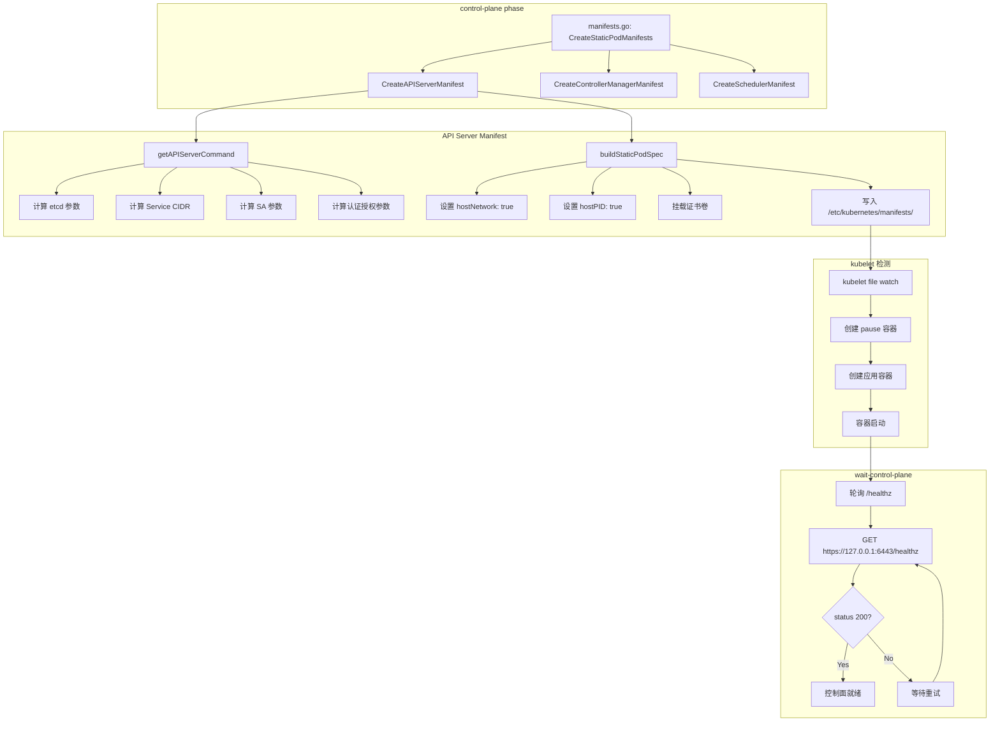

> **生产环境安全提示**
>
> 本文档包含可直接执行的运维命令。执行前请确认：当前目标集群与 Namespace 是否正确；是否具备足够的 RBAC 权限；是否已在非生产环境验证。命令风险等级标注：🔴 高风险（可能造成数据丢失或服务中断）、🟡 中风险（会修改集群状态，但通常可回滚）、🟢 低风险/只读（信息收集，无副作用）。


title: 控制面组件部署 (Static Pod Manifests)
description: '# 控制面组件部署 (Static Pod Manifests)'
category: functions
tags:
- k8s
- operations
- cluster-management
- etcd
- apiserver
- kubelet
- scheduler
- controller-manager
- rbac
last_updated: '2026-05-18'
difficulty: advanced
reading_level: advanced
audience:
- Kubernetes开发者
- DevOps工程师
- SRE
estimated_read_time: 5min
intent_queries:
- Kubernetes static pod manifests kube-apiserver kube-controller-manager kube-scheduler
- kubeadm control-plane manifests generation
- Kubernetes API server etcd connection static pod
- kubelet static pod manifest directory /etc/kubernetes/manifests
- Kubernetes control plane static pod wait healthz
trigger_keywords:
- static pod
- manifest
- kube-apiserver
- kube-controller-manager
- kube-scheduler
- kubelet
- manifests
- control-plane
- healthz
- wait-control-plane
- staticPod
- mirror pod
related_domains:
- 集群基础
- 故障诊断
related_topics:
- kubeadm init
- etcd
- API Server
- kubelet
- certificate
authors:
- name: KUDIG Team
  role: contributor
k8s_versions:
- '1.28'
- '1.29'
- '1.30'
- '1.31'
- '1.32'
---

# 控制面组件部署 (Static Pod Manifests)

## 函数/流程签名

```go
func CreateStaticPodManifests(cfg *kubeadmapi.InitConfiguration) error
func CreateAPIServerManifest(cfg *kubeadmapi.InitConfiguration) error
func CreateControllerManagerManifest(cfg *kubeadmapi.InitConfiguration) error
func CreateSchedulerManifest(cfg *kubeadmapi.InitConfiguration) error
func CreateEtcdManifest(cfg *kubeadmapi.InitConfiguration) error
func getAPIServerCommand(cfg *kubeadmapi.InitConfiguration) []string
func getControllerManagerCommand(cfg *kubeadmapi.InitConfiguration) []string
func getSchedulerCommand(cfg *kubeadmapi.InitConfiguration) []string
func getEtcdCommand(cfg *kubeadmapi.InitConfiguration) []string
func waitForControlPlane(timeout time.Duration) error
```

## 源码位置

| 文件路径 | 行号范围 | 说明 |
|---------|---------|------|
| `cmd/kubeadm/app/phases/controlplane/manifests.go` | L35-L250 | 静态 Pod manifest 生成 |
| `cmd/kubeadm/app/phases/controlplane/manifests.go` | L251-L450 | API Server 命令参数构建 |
| `cmd/kubeadm/app/phases/controlplane/manifests.go` | L451-L600 | Controller Manager 参数 |
| `cmd/kubeadm/app/phases/controlplane/manifests.go` | L601-L700 | Scheduler 参数 |
| `cmd/kubeadm/app/phases/etcd/local.go` | L30-L200 | etcd manifest 生成 |
| `cmd/kubeadm/app/phases/controlplane/wait.go` | L25-L120 | 等待控制面就绪 |
| `cmd/kubeadm/app/util/staticpod/utils.go` | L30-L200 | 静态 Pod 工具函数 |

## 参数说明

### API Server 启动参数

| 参数名 | 类型 | 说明 | 默认值 |
|--------|------|------|--------|
| `--advertise-address` | `string` | 广播地址 | 节点 IP |
| `--bind-address` | `string` | 监听地址 | `0.0.0.0` |
| `--secure-port` | `int` | HTTPS 端口 | `6443` |
| `--etcd-servers` | `[]string` | etcd 集群地址 | `https://127.0.0.1:2379` |
| `--service-cluster-ip-range` | `string` | Service CIDR | `10.96.0.0/12` |
| `--client-ca-file` | `string` | 客户端 CA 文件 | `/etc/kubernetes/pki/ca.crt` |
| `--tls-cert-file` | `string` | TLS 证书文件 | `/etc/kubernetes/pki/apiserver.crt` |
| `--tls-private-key-file` | `string` | TLS 私钥文件 | `/etc/kubernetes/pki/apiserver.key` |
| `--kubelet-client-certificate` | `string` | kubelet 客户端证书 | `/etc/kubernetes/pki/apiserver-kubelet-client.crt` |
| `--kubelet-client-key` | `string` | kubelet 客户端私钥 | `/etc/kubernetes/pki/apiserver-kubelet-client.key` |
| `--authorization-mode` | `string` | 授权模式 | `Node,RBAC` |
| `--enable-admission-plugins` | `string` | 启用的准入插件 | `NodeRestriction` |
| `--service-account-signing-key-file` | `string` | SA 签名密钥 | `/etc/kubernetes/pki/sa.key` |
| `--service-account-issuer` | `string` | SA 签发者 | `https://kubernetes.default.svc.cluster.local` |
| `--allow-privileged` | `bool` | 允许特权容器 | `true` |

### Controller Manager 启动参数

| 参数名 | 类型 | 说明 | 默认值 |
|--------|------|------|--------|
| `--bind-address` | `string` | 监听地址 | `0.0.0.0` |
| `--cluster-signing-cert-file` | `string` | 集群签发证书 | `/etc/kubernetes/pki/ca.crt` |
| `--cluster-signing-key-file` | `string` | 集群签发密钥 | `/etc/kubernetes/pki/ca.key` |
| `--kubeconfig` | `string` | kubeconfig 路径 | `/etc/kubernetes/controller-manager.conf` |
| `--leader-elect` | `bool` | Leader 选举 | `true` |
| `--node-cidr-mask-size` | `int` | Node CIDR 掩码 | `24` |
| `--service-cluster-ip-range` | `string` | Service CIDR | `10.96.0.0/12` |
| `--use-service-account-credentials` | `bool` | 使用 SA 凭证 | `true` |
| `--root-ca-file` | `string` | 根 CA 文件 | `/etc/kubernetes/pki/ca.crt` |
| `--service-account-private-key-file` | `string` | SA 私钥 | `/etc/kubernetes/pki/sa.key` |

### Scheduler 启动参数

| 参数名 | 类型 | 说明 | 默认值 |
|--------|------|------|--------|
| `--bind-address` | `string` | 监听地址 | `0.0.0.0` |
| `--kubeconfig` | `string` | kubeconfig 路径 | `/etc/kubernetes/scheduler.conf` |
| `--leader-elect` | `bool` | Leader 选举 | `true` |

## 返回值

| 返回值 | 类型 | 说明 |
|--------|------|------|
| `error` | `error` | manifest 创建失败错误 |
| `v1.Pod` | `*struct` | 生成的 static Pod 对象 |

## 调用链



## 源码分析

### CreateStaticPodManifests (manifests.go)

```go
// cmd/kubeadm/app/phases/controlplane/manifests.go
// CreateStaticPodManifests 生成所有控制面 static Pod manifest
func CreateStaticPodManifests(cfg *kubeadmapi.InitConfiguration) error {
    // 1. 确保 manifests 目录存在
    manifestDir := "/etc/kubernetes/manifests"
    if err := os.MkdirAll(manifestDir, 0755); err != nil {
        return fmt.Errorf("failed to create manifest dir: %w", err)
    }

    // 2. 生成 kube-apiserver manifest
    if err := CreateAPIServerManifest(cfg); err != nil {
        return fmt.Errorf("failed to create apiserver manifest: %w", err)
    }

    // 3. 生成 kube-controller-manager manifest
    if err := CreateControllerManagerManifest(cfg); err != nil {
        return fmt.Errorf("failed to create controller-manager manifest: %w", err)
    }

    // 4. 生成 kube-scheduler manifest
    if err := CreateSchedulerManifest(cfg); err != nil {
        return fmt.Errorf("failed to create scheduler manifest: %w", err)
    }

    return nil
}
```

### API Server Manifest 生成 (manifests.go)

```go
// cmd/kubeadm/app/phases/controlplane/manifests.go
// CreateAPIServerManifest 生成 kube-apiserver static Pod manifest
func CreateAPIServerManifest(cfg *kubeadmapi.InitConfiguration) error {
    // 1. 构建 API Server 命令参数
    command := getAPIServerCommand(cfg)

    // 2. 构建 static Pod spec
    podSpec := buildStaticPodSpec(
        "kube-apiserver",
        cfg.ClusterConfiguration.ImageRepository,
        cfg.ClusterConfiguration.KubernetesVersion,
        command,
    )

    // 3. 挂载证书和配置文件
    podSpec.Spec.Containers[0].VolumeMounts = []v1.VolumeMount{
        {Name: "certs", MountPath: "/etc/kubernetes/pki", ReadOnly: true},
        {Name: "ca", MountPath: "/etc/kubernetes/pki", ReadOnly: true},
        {Name: "etcd-certs", MountPath: "/etc/kubernetes/pki/etcd", ReadOnly: true},
        {Name: "config", MountPath: "/etc/kubernetes", ReadOnly: true},
    }

    // 4. 设置 host 网络
    //    API Server 必须使用宿主机网络
    podSpec.Spec.HostNetwork = true
    podSpec.Spec.HostPID = true

    // 5. 设置优先级 (system-node-critical)
    podSpec.Spec.PriorityClassName = "system-node-critical"

    // 6. 写入 YAML 文件
    //    kubelet 会监控此目录，自动创建/更新容器
    manifestPath := "/etc/kubernetes/manifests/kube-apiserver.yaml"
    return writeManifest(podSpec, manifestPath)
}

// getAPIServerCommand 构建 kube-apiserver 命令参数
func getAPIServerCommand(cfg *kubeadmapi.InitConfiguration) []string {
    // 基础参数
    command := []string{"kube-apiserver"}

    // 1. 广播地址
    command = append(command,
        fmt.Sprintf("--advertise-address=%s",
            cfg.LocalAPIEndpoint.AdvertiseAddress))

    // 2. HTTPS 端口
    command = append(command,
        fmt.Sprintf("--secure-port=%d",
            cfg.LocalAPIEndpoint.BindPort))

    // 3. etcd 连接配置
    command = append(command,
        "--etcd-servers=https://127.0.0.1:2379")
    command = append(command,
        "--etcd-cafile=/etc/kubernetes/pki/etcd/ca.crt")
    command = append(command,
        "--etcd-certfile=/etc/kubernetes/pki/apiserver-etcd-client.crt")
    command = append(command,
        "--etcd-keyfile=/etc/kubernetes/pki/apiserver-etcd-client.key")

    // 4. Service CIDR
    command = append(command,
        fmt.Sprintf("--service-cluster-ip-range=%s",
            cfg.Networking.ServiceSubnet))

    // 5. TLS 证书
    command = append(command,
        "--tls-cert-file=/etc/kubernetes/pki/apiserver.crt")
    command = append(command,
        "--tls-private-key-file=/etc/kubernetes/pki/apiserver.key")
    command = append(command,
        "--client-ca-file=/etc/kubernetes/pki/ca.crt")

    // 6. kubelet 客户端证书
    //    API Server 用此证书连接 kubelet (logs/exec)
    command = append(command,
        "--kubelet-client-certificate=/etc/kubernetes/pki/apiserver-kubelet-client.crt")
    command = append(command,
        "--kubelet-client-key=/etc/kubernetes/pki/apiserver-kubelet-client.key")

    // 7. 授权模式
    command = append(command,
        "--authorization-mode=Node,RBAC")

    // 8. 准入插件
    command = append(command,
        "--enable-admission-plugins=NodeRestriction")

    // 9. ServiceAccount 配置
    command = append(command,
        "--service-account-issuer=https://kubernetes.default.svc.cluster.local")
    command = append(command,
        "--service-account-key-file=/etc/kubernetes/pki/sa.pub")
    command = append(command,
        "--service-account-signing-key-file=/etc/kubernetes/pki/sa.key")
    command = append(command,
        "--service-account-api-audiences=https://kubernetes.default.svc.cluster.local")

    // 10. 前端代理
    command = append(command,
        "--proxy-client-cert-file=/etc/kubernetes/pki/front-proxy-client.crt")
    command = append(command,
        "--proxy-client-key-file=/etc/kubernetes/pki/front-proxy-client.key")
    command = append(command,
        "--requestheader-username-headers=X-Remote-User")
    command = append(command,
        "--requestheader-group-headers=X-Remote-Group")
    command = append(command,
        "--requestheader-extra-headers-prefix=X-Remote-Extra-")
    command = append(command,
        "--requestheader-client-ca-file=/etc/kubernetes/pki/front-proxy-ca.crt")
    command = append(command,
        "--requestheader-allowed-names=front-proxy-client")

    // 11. 允许特权容器
    command = append(command,
        "--allow-privileged=true")

    return command
}
```

### Controller Manager Manifest (manifests.go)

```go
// cmd/kubeadm/app/phases/controlplane/manifests.go
// getControllerManagerCommand 构建 kube-controller-manager 命令参数
func getControllerManagerCommand(cfg *kubeadmapi.InitConfiguration) []string {
    command := []string{"kube-controller-manager"}

    // 1. kubeconfig (连接 API Server)
    command = append(command,
        "--kubeconfig=/etc/kubernetes/controller-manager.conf")

    // 2. Leader 选举 (HA 集群必需)
    command = append(command,
        "--leader-elect=true")

    // 3. 集群签发证书 (用于 TLS Bootstrap)
    command = append(command,
        "--cluster-signing-cert-file=/etc/kubernetes/pki/ca.crt")
    command = append(command,
        "--cluster-signing-key-file=/etc/kubernetes/pki/ca.key")

    // 4. Service CIDR
    command = append(command,
        fmt.Sprintf("--service-cluster-ip-range=%s",
            cfg.Networking.ServiceSubnet))

    // 5. Node CIDR
    command = append(command,
        "--cluster-cidr="+cfg.Networking.PodSubnet)
    command = append(command,
        "--node-cidr-mask-size=24")

    // 6. ServiceAccount 控制
    command = append(command,
        "--root-ca-file=/etc/kubernetes/pki/ca.crt")
    command = append(command,
        "--service-account-private-key-file=/etc/kubernetes/pki/sa.key")
    command = append(command,
        "--use-service-account-credentials=true")

    // 7. 绑定地址
    command = append(command,
        "--bind-address=0.0.0.0")

    // 8. 安全端口
    command = append(command,
        "--secure-port=10257")

    return command
}
```

### Scheduler Manifest (manifests.go)

```go
// cmd/kubeadm/app/phases/controlplane/manifests.go
// getSchedulerCommand 构建 kube-scheduler 命令参数
func getSchedulerCommand(cfg *kubeadmapi.InitConfiguration) []string {
    command := []string{"kube-scheduler"}

    // 1. kubeconfig
    command = append(command,
        "--kubeconfig=/etc/kubernetes/scheduler.conf")

    // 2. Leader 选举
    command = append(command,
        "--leader-elect=true")

    // 3. 绑定地址
    command = append(command,
        "--bind-address=0.0.0.0")

    // 4. 安全端口
    command = append(command,
        "--secure-port=10259")

    // 5. 认证和授权
    command = append(command,
        "--authentication-kubeconfig=/etc/kubernetes/scheduler.conf")
    command = append(command,
        "--authorization-kubeconfig=/etc/kubernetes/scheduler.conf")

    return command
}
```

### 等待控制面就绪 (wait.go)

```go
// cmd/kubeadm/app/phases/controlplane/wait.go
// WaitForControlPlane 轮询等待 API Server 就绪
func WaitForControlPlane(client clientset.Interface, timeout time.Duration) error {
    start := time.Now()

    for {
        // 1. 检查 API Server /healthz 端点
        healthStatus := 0
        result := client.Discovery().RESTClient().Get("/healthz").Do(context.TODO())
        result.StatusCode(&healthStatus)

        if healthStatus == 200 {
            // 2. 额外检查: 获取节点信息确认 API Server 完全就绪
            _, err := client.CoreV1().Nodes().List(
                context.TODO(), metav1.ListOptions{})
            if err == nil {
                fmt.Println("[wait-control-plane] Control plane is ready")
                return nil
            }
        }

        // 3. 检查超时
        if time.Since(start) > timeout {
            return fmt.Errorf("timed out waiting for control plane after %v",
                timeout)
        }

        // 4. 等待后重试
        fmt.Println("[wait-control-plane] Waiting for the control plane to become ready...")
        time.Sleep(5 * time.Second)
    }
}
```

## 执行流程

### Static Pod 创建流程

```
步骤 1: kubeadm 写入 manifest 文件
    → /etc/kubernetes/manifests/kube-apiserver.yaml
    ↓
步骤 2: kubelet 检测到文件变化
    → kubelet 监控 /etc/kubernetes/manifests/ 目录
    → 文件创建/修改/删除都会触发事件
    ↓
步骤 3: kubelet 创建 Pod
    → 解析 YAML 文件为 v1.Pod 对象
    → 创建 "mirror Pod" 在 API Server 中
    ↓
步骤 4: 通过 CRI 创建 pause 容器
    → 拉取 pause 镜像 (registry.k8s.io/pause:3.9)
    → 创建网络命名空间
    ↓
步骤 5: 通过 CRI 创建应用容器
    → 拉取组件镜像 (kube-apiserver:v1.28.0)
    → 创建并启动容器
    ↓
步骤 6: 容器执行入口命令
    → kube-apiserver --advertise-address=...
    ↓
步骤 7: wait-control-plane 轮询
    → GET https://127.0.0.1:6443/healthz
    → 返回 200 → 控制面就绪
    → 默认超时 5 分钟
```

## 使用场景

### 场景 1: 自定义 API Server 参数

```yaml
# kubeadm-config.yaml
apiVersion: kubeadm.k8s.io/v1beta3
kind: ClusterConfiguration
kubernetesVersion: "v1.28.0"
apiServer:
  extraArgs:
    authorization-mode: "Node,RBAC"
    enable-admission-plugins: "NodeRestriction,PodSecurity"
    service-node-port-range: "30000-32767"
    audit-log-path: "/var/log/kubernetes/audit.log"
    audit-log-maxage: "30"
    profiling: "false"
    max-connection-bytes-per-sec: "0"
  extraVolumes:
  - name: audit-log
    hostPath: /var/log/kubernetes
    mountPath: /var/log/kubernetes
    pathType: DirectoryOrCreate
  certSANs:
  - "k8s-api.example.com"
  - "192.168.1.100"
```

### 场景 2: 手动修改 static Pod

``` bash
# 🟢 低风险：只读/信息收集，通常无副作用
# 查看 API Server manifest
cat /etc/kubernetes/manifests/kube-apiserver.yaml

# 修改参数 (例如添加审计)
vi /etc/kubernetes/manifests/kube-apiserver.yaml
# 添加:
#   - --audit-log-path=/var/log/kubernetes/audit.log
#   - --audit-log-maxage=30

# kubelet 自动检测变化并重启容器
# 等待重启完成
kubectl get pods -n kube-system -w

# 查看容器日志
crictl logs $(crictl ps --name kube-apiserver -q) --tail 50
```
### 场景 3: 使用补丁自定义 manifest

```yaml
# patch-apiserver.yaml
apiVersion: v1
kind: Pod
metadata:
  name: kube-apiserver
  namespace: kube-system
spec:
  containers:
  - name: kube-apiserver
    resources:
      requests:
        cpu: 500m
        memory: 512Mi
      limits:
        cpu: "2"
        memory: 2Gi
```

```bash
kubeadm init --patches=/path/to/patches/
```

## 配置示例

### 完整 API Server Manifest

```yaml
# /etc/kubernetes/manifests/kube-apiserver.yaml
apiVersion: v1
kind: Pod
metadata:
  name: kube-apiserver
  namespace: kube-system
spec:
  containers:
  - command:
    - kube-apiserver
    - --advertise-address=192.168.1.10
    - --allow-privileged=true
    - --authorization-mode=Node,RBAC
    - --client-ca-file=/etc/kubernetes/pki/ca.crt
    - --enable-admission-plugins=NodeRestriction
    - --enable-bootstrap-token-auth=true
    - --etcd-cafile=/etc/kubernetes/pki/etcd/ca.crt
    - --etcd-certfile=/etc/kubernetes/pki/apiserver-etcd-client.crt
    - --etcd-keyfile=/etc/kubernetes/pki/apiserver-etcd-client.key
    - --etcd-servers=https://127.0.0.1:2379
    - --kubelet-client-certificate=/etc/kubernetes/pki/apiserver-kubelet-client.crt
    - --kubelet-client-key=/etc/kubernetes/pki/apiserver-kubelet-client.key
    - --kubelet-preferred-address-types=InternalIP,ExternalIP,Hostname
    - --proxy-client-cert-file=/etc/kubernetes/pki/front-proxy-client.crt
    - --proxy-client-key-file=/etc/kubernetes/pki/front-proxy-client.key
    - --requestheader-allowed-names=front-proxy-client
    - --requestheader-client-ca-file=/etc/kubernetes/pki/front-proxy-ca.crt
    - --requestheader-extra-headers-prefix=X-Remote-Extra-
    - --requestheader-group-headers=X-Remote-Group
    - --requestheader-username-headers=X-Remote-User
    - --secure-port=6443
    - --service-account-issuer=https://kubernetes.default.svc.cluster.local
    - --service-account-key-file=/etc/kubernetes/pki/sa.pub
    - --service-account-signing-key-file=/etc/kubernetes/pki/sa.key
    - --service-cluster-ip-range=10.96.0.0/12
    - --tls-cert-file=/etc/kubernetes/pki/apiserver.crt
    - --tls-private-key-file=/etc/kubernetes/pki/apiserver.key
    image: registry.k8s.io/kube-apiserver:v1.28.0
    imagePullPolicy: IfNotPresent
    livenessProbe:
      failureThreshold: 8
      httpGet:
        host: 192.168.1.10
        path: /livez
        port: 6443
        scheme: HTTPS
      initialDelaySeconds: 10
      periodSeconds: 10
      successThreshold: 1
      timeoutSeconds: 15
    name: kube-apiserver
    readinessProbe:
      failureThreshold: 3
      httpGet:
        host: 192.168.1.10
        path: /readyz
        port: 6443
        scheme: HTTPS
      periodSeconds: 1
      timeoutSeconds: 15
    resources:
      requests:
        cpu: 250m
    startupProbe:
      failureThreshold: 24
      httpGet:
        host: 192.168.1.10
        path: /livez
        port: 6443
        scheme: HTTPS
      initialDelaySeconds: 10
      periodSeconds: 10
      successThreshold: 1
      timeoutSeconds: 15
    volumeMounts:
    - mountPath: /etc/kubernetes/pki
      name: certs
      readOnly: true
    - mountPath: /etc/kubernetes/pki/etcd
      name: etcd-certs
      readOnly: true
  hostNetwork: true
  hostPID: true
  priority: 2000001000
  priorityClassName: system-node-critical
  volumes:
  - hostPath:
      path: /etc/kubernetes/pki
      type: DirectoryOrCreate
    name: certs
  - hostPath:
      path: /etc/kubernetes/pki/etcd
      type: DirectoryOrCreate
    name: etcd-certs
```

## 实战示例

### 查看控制面组件状态

``` bash
# 🟢 低风险：只读/信息收集，通常无副作用
# 查看所有 static Pod
crictl ps --name kube
# CONTAINER ID   IMAGE                                    NAME                    STATE
# abc123         registry.k8s.io/kube-apiserver:v1.28.0   kube-apiserver          Running
# def456         registry.k8s.io/kube-controller-manager  kube-controller-manager Running
# ghi789         registry.k8s.io/kube-scheduler:v1.28.0   kube-scheduler          Running

# 查看 Pod 状态
kubectl get pods -n kube-system -l component=kube-apiserver
# NAME                              READY   STATUS    RESTARTS   AGE
# kube-apiserver-master             1/1     Running   0          10m

# 查看 API Server 健康状态
kubectl get --raw /healthz
# ok

# 查看各组件健康状态
kubectl get --raw /livez?verbose
# [+]etcd ok
# [+]etcd-readiness ok
# [+]informer-sync ok
# [+]log ok
# [+]ping ok
# [+]poststarthook/apiservice-openapi-controller ok
# [+]poststarthook/priority-and-fairness-config-consumer ok
# healthz check passed
```
### 组件故障排查

``` bash
# 🟢 低风险：只读/信息收集，通常无副作用
# API Server 日志
crictl logs $(crictl ps --name kube-apiserver -q) --tail 100

# 或通过 kubectl 查看
kubectl logs -n kube-system kube-apiserver-master --tail=100

# Controller Manager 日志
kubectl logs -n kube-system kube-controller-manager-master --tail=50

# Scheduler 日志
kubectl logs -n kube-system kube-scheduler-master --tail=50

# 检查 static Pod manifest
ls -la /etc/kubernetes/manifests/
# -rw------- 1 root root 4010 Jan  1 00:00 etcd.yaml
# -rw------- 1 root root 3890 Jan  1 00:00 kube-apiserver.yaml
# -rw------- 1 root root 3450 Jan  1 00:00 kube-controller-manager.yaml
# -rw------- 1 root root 3010 Jan  1 00:00 kube-scheduler.yaml
```
## 常见错误

| 错误 | 原因 | 解决方案 |
|------|------|---------|
| `apiserver not ready after 5m` | API Server 启动失败 | 检查 crictl logs 和 etcd 状态 |
| `etcd connection refused` | etcd 未启动 | 先确保 etcd static Pod 运行 |
| `certificate not found` | 证书文件缺失 | 检查 /etc/kubernetes/pki/ 目录 |
| `static pod not created` | kubelet 未监控 manifest 目录 | 检查 kubelet --pod-manifest-path |
| `OOMKilled` | 组件内存不足 | 增大 resource limits |
| `image pull backoff` | 镜像拉取失败 | 预拉取: `kubeadm config images pull` |

## 相关函数

- [集群概览](01-overview.md) — init 整体流程
- [证书管理](03-certs.md) — static Pod 挂载的证书
- [etcd 管理](07-etcd.md) — etcd static Pod
- [初始化阶段](17-init-phases.md) — phase 执行引擎
- [集群升级](09-upgrade.md) — 升级时更新 manifest
- [高级配置](11-advanced.md) — 自定义 static Pod 参数

## Related

- [[reference|#reference Hub]] — tag hub

- [[log|log]]
- [[系统基础/topic-cheat-sheet/go.md|go]]
- [[系统基础/topic-cheat-sheet/k8s.md|k8s]]
- [[entities/kubernetes.md|kubernetes]]
- [[平台工程/topic-code-analysis/node-create/01-overview.md|01-overview]]


<!-- risk-assessed -->
