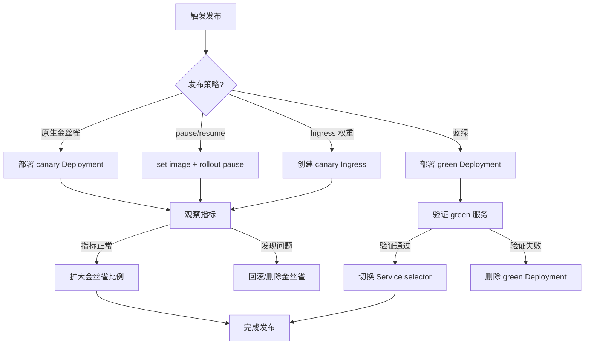

> **生产环境安全提示**
>
> 本文档包含可直接执行的运维命令。执行前请确认：当前目标集群与 Namespace 是否正确；是否具备足够的 RBAC 权限；是否已在非生产环境验证。命令风险等级标注：🔴 高风险（可能造成数据丢失或服务中断）、🟡 中风险（会修改集群状态，但通常可回滚）、🟢 低风险/只读（信息收集，无副作用）。


# Deployment [[skills/deployment-canary-and-bluegreen.md|deployment-canary-and-bluegreen]]模式

## 函数签名

```go
// pause/resume 机制 — Deployment Controller 内部处理
func (dc *DeploymentController) syncDeployment(ctx context.Context, key string) error

// 判断是否暂停
func isPaused(deployment *apps.Deployment) bool {
    return deployment.Spec.Paused
}

// syncRolloutStatus 在 Paused 时仅同步状态，不执行扩缩
func (dc *DeploymentController) sync(ctx context.Context, d *apps.Deployment, rsList []*apps.ReplicaSet) error
```

## 源码位置

| 组件 | 源码路径 | 说明 |
|------|---------|------|
| pause 处理 | `pkg/controller/deployment/sync.go` | syncDeployment 中 Paused 分支 |
| 状态条件 | `pkg/controller/deployment/progress.go` | Paused condition 写入 |
| Recreate | `pkg/controller/deployment/recreate.go` | 蓝绿实现基础 |

## 架构概述

```
┌─────────────────────────────────────────────────────────────────────┐
│              发布策略矩阵                                              │
├───────────────┬────────────────┬────────────────┬───────────────────┤
│ 策略          │ 停机时间       │ 流量控制粒度   │ 实现复杂度        │
├───────────────┼────────────────┼────────────────┼───────────────────┤
│ 原地替换      │ 有             │ 无             │ 低                │
│ (Recreate)    │                │                │                   │
├───────────────┼────────────────┼────────────────┼───────────────────┤
│ 滚动更新      │ 零             │ 副本数比例     │ 低                │
│ (RollingUpdate)│               │                │                   │
├───────────────┼────────────────┼────────────────┼───────────────────┤
│ 金丝雀发布    │ 零             │ 副本数/权重    │ 中                │
│ (Canary)      │                │                │                   │
├───────────────┼────────────────┼────────────────┼───────────────────┤
│ 蓝绿发布      │ 秒级切换       │ Service Selector│ 中               │
│ (Blue-Green)  │                │                │                   │
├───────────────┼────────────────┼────────────────┼───────────────────┤
│ 进阶金丝雀    │ 零             │ HTTP权重/Header│ 高                │
│ (Argo/Flagger)│                │                │                   │
└───────────────┴────────────────┴────────────────┴───────────────────┘
```

## pause/resume 机制源码分析

### syncDeployment 中的 Paused 处理

```go
// pkg/controller/deployment/sync.go
func (dc *DeploymentController) syncDeployment(ctx context.Context, key string) error {
    // ... 获取 Deployment 和 RS 列表 ...

    // 如果 Deployment 处于暂停状态，仅同步状态，不执行滚动更新
    if d.Spec.Paused {
        return dc.sync(ctx, d, rsList)
    }

    // 检查是否处于回滚状态
    if getRollbackTo(d) != nil {
        return dc.rollback(ctx, d, rsList)
    }

    // 检查是否需要扩缩容
    scalingEvent, err := dc.isScalingEvent(ctx, d, rsList)
    if err != nil {
        return err
    }
    if scalingEvent {
        return dc.sync(ctx, d, rsList)
    }

    // 根据策略执行更新
    switch d.Spec.Strategy.Type {
    case apps.RecreateDeploymentStrategyType:
        return dc.rolloutRecreate(ctx, d, rsList, podMap)
    case apps.RollingUpdateDeploymentStrategyType:
        return dc.rolloutRolling(ctx, d, rsList)
    }
    return fmt.Errorf("unexpected deployment strategy type: %s", d.Spec.Strategy.Type)
}
```

### Paused condition 写入

```go
// syncRolloutStatus 中写入 Paused 条件
func (dc *DeploymentController) syncRolloutStatus(
    ctx context.Context,
    allRSs []*apps.ReplicaSet,
    newRS *apps.ReplicaSet,
    d *apps.Deployment,
) error {
    newStatus := calculateStatus(allRSs, newRS, d)
    
    // 如果 Deployment 被暂停，添加 Paused condition
    if d.Spec.Paused && getCond(d.Status, apps.DeploymentProgressing) != nil {
        pausedCondition := newDeploymentCondition(
            apps.DeploymentProgressing,
            v1.ConditionUnknown,
            deploymentutil.PausedDeployReason,
            "Deployment is paused",
        )
        setDeploymentCondition(&newStatus, *pausedCondition)
    }
    
    return dc.updateDeploymentStatus(ctx, allRSs, newRS, d)
}
```

## 方案一：原生金丝雀发布（双 Deployment）

### 实现原理

```
Service (selector: app=web)
    ├── Deployment-stable (replicas=9, labels: app=web, version=v1)
    └── Deployment-canary (replicas=1, labels: app=web, version=v2)
                                                        ↑
                          10% 流量自动路由到金丝雀（基于副本比例）
```

### 实战操作

> ⚠️ **🟡 中危变更** — 变更集群资源状态，建议先 --dry-run 或 diff 确认
> - `kubectl apply/create/replace`：创建/变更集群资源
> - `kubectl delete`：删除资源（可由声明式清单重建）

``` bash
# 🟡 中风险：会修改集群/资源状态，执行前请确认目标、影响范围与授权
# 1. 当前稳定版本
kubectl get deployment web-stable
# NAME         READY   UP-TO-DATE   AVAILABLE
# web-stable   9/9     9            9

# 2. 创建金丝雀版本（10% 流量 = 1/10 副本）
kubectl apply -f web-canary.yaml

# 3. 观察金丝雀 Pod
kubectl get pods -l app=web -o wide
# NAME                           READY   STATUS    NODE
# web-stable-xxx-1               1/1     Running   node1
# web-stable-xxx-2               1/1     Running   node2
# ... (9个)
# web-canary-yyy-1               1/1     Running   node3  ← 金丝雀

# 4. 确认无误后扩容金丝雀，缩容稳定版
kubectl scale deployment web-canary --replicas=5
kubectl scale deployment web-stable --replicas=5

# 5. 完全切换
kubectl scale deployment web-canary --replicas=10
kubectl delete deployment web-stable
```
### 双 Deployment 配置

```yaml
# web-stable.yaml — 稳定版本
apiVersion: apps/v1
kind: Deployment
metadata:
  name: web-stable
  labels:
    app: web
    release: stable
spec:
  replicas: 9
  selector:
    matchLabels:
      app: web
      release: stable
  template:
    metadata:
      labels:
        app: web
        release: stable
        version: v1.0.0
    spec:
      containers:
      - name: web
        image: myapp:v1.0.0
---
# web-canary.yaml — 金丝雀版本
apiVersion: apps/v1
kind: Deployment
metadata:
  name: web-canary
  labels:
    app: web
    release: canary
spec:
  replicas: 1
  selector:
    matchLabels:
      app: web
      release: canary
  template:
    metadata:
      labels:
        app: web
        release: canary
        version: v2.0.0
    spec:
      containers:
      - name: web
        image: myapp:v2.0.0
---
# Service — 同时覆盖两个 Deployment
apiVersion: v1
kind: Service
metadata:
  name: web
spec:
  selector:
    app: web  # 同时匹配 stable 和 canary Pod
  ports:
  - port: 80
    targetPort: 8080
```

## 方案二：pause/resume 金丝雀

### 核心原理

利用 `kubectl rollout pause` 将 RollingUpdate 暂停在中间状态，实现部分副本跑新版本的金丝雀效果。

> ⚠️ **🟡 中危变更** — 变更集群资源状态，建议先 --dry-run 或 diff 确认
> - `kubectl rollout undo/restart`：触发滚动变更，影响副本

``` bash
# 🟡 中风险：会修改集群/资源状态，执行前请确认目标、影响范围与授权
# 1. 触发更新，立即暂停
kubectl set image deployment/web web=myapp:v2.0.0
kubectl rollout pause deployment/web

# 此时状态：1 个新 Pod（金丝雀），4 个旧 Pod
kubectl get rs -l app=web
# NAME              DESIRED   CURRENT   READY   AGE
# web-v2-7f9c8d   1         1         1       30s   ← 新版本 (paused here)
# web-v1-6e8b7c   4         4         4       2d

# 2. 观察金丝雀指标（错误率、延迟等）
# 确认无误后恢复更新
kubectl rollout resume deployment/web

# 如发现问题立即回滚
kubectl rollout undo deployment/web
```
### pause 命令的 API 操作

> ⚠️ **🟡 中危变更** — 变更集群资源状态，建议先 --dry-run 或 diff 确认
> - `kubectl edit/patch`：修改运行中的资源

``` bash
# 🟡 中风险：会修改集群/资源状态，执行前请确认目标、影响范围与授权
# kubectl rollout pause 本质上执行的操作
kubectl patch deployment web -p '{"spec":{"paused":true}}'

# kubectl rollout resume 本质上执行的操作
kubectl patch deployment web -p '{"spec":{"paused":false}}'
```
## 方案三：蓝绿发布（Service Selector 切换）

### 实现原理

```
Service (selector: 动态切换)
    ├── Deployment-blue  (当前生产，v1)
    └── Deployment-green (预发布，v2)
           ↑ 测试通过后，切换 Service selector 指向 green
```

### 实战操作

> ⚠️ **🟡 中危变更** — 变更集群资源状态，建议先 --dry-run 或 diff 确认
> - `kubectl apply/create/replace`：创建/变更集群资源
> - `kubectl delete`：删除资源（可由声明式清单重建）
> - `kubectl edit/patch`：修改运行中的资源

``` bash
# 🟡 中风险：会修改集群/资源状态，执行前请确认目标、影响范围与授权
# 1. 当前蓝版本生产中
kubectl get deployment web-blue
kubectl get svc web  # selector: version=blue

# 2. 部署绿版本（不影响生产流量）
kubectl apply -f web-green.yaml

# 3. 验证绿版本（通过 port-forward 或测试 Service）
kubectl port-forward svc/web-green 8080:80
curl http://localhost:8080/healthz

# 4. 切换流量（原子操作）
kubectl patch svc web -p '{"spec":{"selector":{"version":"green"}}}'

# 5. 确认无误后清理蓝版本
kubectl delete deployment web-blue
```
### 蓝绿发布配置

```yaml
# web-green.yaml
apiVersion: apps/v1
kind: Deployment
metadata:
  name: web-green
spec:
  replicas: 5
  selector:
    matchLabels:
      app: web
      version: green
  template:
    metadata:
      labels:
        app: web
        version: green
    spec:
      containers:
      - name: web
        image: myapp:v2.0.0
---
# 生产 Service — 随时可切换 selector
apiVersion: v1
kind: Service
metadata:
  name: web
spec:
  selector:
    app: web
    version: blue  # 切换时改为 green
  ports:
  - port: 80
    targetPort: 8080
```

## 方案四：Ingress 权重金丝雀（NGINX/ALB）

### NGINX Ingress Canary 注解

```yaml
# 金丝雀 Ingress（需要先创建主 Ingress）
apiVersion: networking.k8s.io/v1
kind: Ingress
metadata:
  name: web-canary
  annotations:
    nginx.ingress.kubernetes.io/canary: "true"
    nginx.ingress.kubernetes.io/canary-weight: "20"  # 20% 流量
    # 或基于 Header 路由
    # nginx.ingress.kubernetes.io/canary-by-header: "X-Canary"
    # nginx.ingress.kubernetes.io/canary-by-header-value: "true"
spec:
  rules:
  - host: api.example.com
    http:
      paths:
      - path: /
        pathType: Prefix
        backend:
          service:
            name: web-canary
            port:
              number: 80
```

## 执行流程



## 使用场景

| 方案 | 适用场景 | 优点 | 缺点 |
|------|---------|------|------|
| 双 Deployment 金丝雀 | 流量比例控制 | 灵活、副本级别控制 | 需维护两个 Deployment |
| pause/resume 金丝雀 | 快速验证单个 Pod | 简单、原生支持 | 只能暂停 1 个新 RS |
| 蓝绿发布 | 需要原子切换 | 秒级切换，可快速回滚 | 资源消耗翻倍 |
| Ingress 权重 | 精确流量百分比 | 精确控制、支持 Header 路由 | 依赖 Ingress Controller |
| Argo Rollouts | 生产级进阶需求 | 自动化分析、步骤化发布 | 额外运维复杂度 |

## 常见错误

| 错误 | 现象 | 原因 | 解决方案 |
|------|------|------|----------|
| pause 后无法 resume | resume 命令不生效 | Deployment 同时存在 RollbackTo 注解 | 先回滚，再重新发布 |
| 蓝绿切换后旧 Pod 流量未断 | 旧 Pod 仍收到请求 | Service 缓存未刷新 | 等待 endpointSlice 更新（通常 <1s） |
| 金丝雀副本比例不准确 | 实际流量比与预期不符 | kube-proxy 轮询非精确权重 | 使用 Ingress 权重或 Istio |
| 双 Deployment 标签冲突 | Pod 被错误的 Service 覆盖 | selector 设计有重叠 | 使用唯一 `release` label 区分 |

## 相关函数

- [`rolloutRolling`](04-rolling-update.md) — pause/resume 的基础机制
- [`rolloutRecreate`](07-recreate-strategy.md) — 蓝绿发布的底层类似模式
- [`rollbackToRevision`](06-revision-history.md) — 金丝雀验证失败时的回滚

## 扩展阅读

- Argo Rollouts: 提供 Canary/BlueGreen 声明式步骤化发布，支持 Prometheus/Datadog 自动分析
- Flagger: 基于 Istio/Linkerd/NGINX 实现流量权重的渐进式自动化发布
- Gateway API: Kubernetes SIG 推进的下一代流量管理标准

## 版本说明

- `Deployment.Spec.Paused` 自 v1.0 起支持
- NGINX Ingress Canary 注解自 ingress-nginx v0.21 起支持
- 基于 Kubernetes v1.28 – v1.32 源码分析

## Related

- [[entities/argo.md|argo]]
- [[entities/kubernetes.md|kubernetes]]
- [[entities/linkerd.md|Linkerd]]
- [[entities/istio.md|Istio]]


<!-- risk-assessed -->
