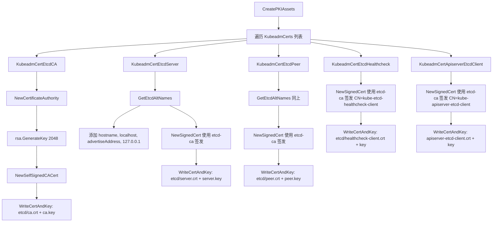
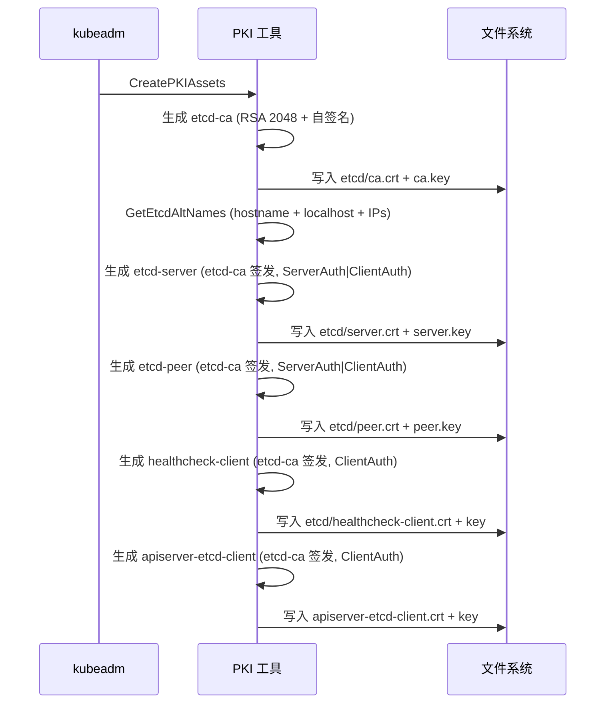

> **生产环境安全提示**
>
> 本文档包含可直接执行的运维命令。执行前请确认：当前目标集群与 Namespace 是否正确；是否具备足够的 RBAC 权限；是否已在非生产环境验证。命令风险等级标注：🔴 高风险（可能造成数据丢失或服务中断）、🟡 中风险（会修改集群状态，但通常可回滚）、🟢 低风险/只读（信息收集，无副作用）。


title: etcd 证书体系源码分析
description: '| 用户自定义 | `listen-client-urls` 中解析的地址 |'
category: functions
tags:
- k8s
- operations
- cluster-management
- etcd
- apiserver
- kubelet
last_updated: '2026-05-18'
difficulty: advanced
reading_level: advanced
audience:
- Kubernetes 管理员
- 存储工程师
- 集群运维人员
estimated_read_time: 5min
intent_queries:
- Kubernetes etcd 证书体系 etcd-ca 独立 CA
- etcd Server Peer HealthcheckClient 证书区别
- GetEtcdAltNames etcd SAN 生成源码
- API Server etcd 客户端证书 apiserver-etcd-client
- etcd 静态 Pod 证书挂载配置
trigger_keywords:
- etcd-ca
- etcd-server
- etcd-peer
- etcd-healthcheck-client
- apiserver-etcd-client
- GetEtcdAltNames
- etcd 静态 Pod
- Peer 通信
- Raft
- 外部 etcd
related_domains:
- 集群基础
- 故障诊断
related_topics:
- cluster-cert/pki-architecture
- cluster-cert/ca-generation
- cluster-cert/cert-config
authors:
- name: KUDIG Team
  role: contributor
k8s_versions:
- '1.28'
- '1.29'
- '1.30'
- '1.31'
- '1.32'
---

# etcd 证书体系源码分析

## 函数签名

```go
func GetEtcdAltNames(cfg *kubeadmapi.InitConfiguration) (*certutil.AltNames, error)

func NewCertificateAuthority(config *certutil.Config) (*x509.Certificate, crypto.Signer, error)

func NewSignedCert(cfg certutil.Config, key crypto.Signer, caCert *x509.Certificate, caKey crypto.Signer) (*x509.Certificate, error)

func (k *KubeadmCert) CreateFromCA(cfg *kubeadmapi.InitConfiguration, caCert *KubeadmCert) error

func WriteCertAndKey(pkiPath string, name string, cert *x509.Certificate, key crypto.Signer) error
```

## 源码位置

| 组件 | 源码路径 | 说明 |
|------|---------|------|
| etcd 证书定义 | `cmd/kubeadm/app/phases/certs/certs.go` | 所有 etcd 证书的 CN/O/Usages 定义 |
| etcd 本地启动 | `cmd/kubeadm/app/phases/etcd/local.go` | etcd 静态 Pod manifest 生成 |
| PKI 工具 | `cmd/kubeadm/app/util/pkiutil/pki_helpers.go` | 证书生成、写入、验证 |
| 通用证书库 | `staging/src/k8s.io/client-go/util/cert/cert.go` | NewSelfSignedCACert、NewSignedCert |
| SAN 计算 | `cmd/kubeadm/app/phases/certs/certs.go` | GetEtcdAltNames |

## 参数说明

### etcd 证书定义参数

| 证书名 | CommonName | Organization | Usages | CA |
|--------|-----------|--------------|--------|-----|
| etcd-ca | `etcd-ca` | 无 | CertSign | 自签名 |
| etcd-server | `etcd-server` | 无 | ServerAuth, ClientAuth | etcd-ca |
| etcd-peer | `etcd-peer` | 无 | ServerAuth, ClientAuth | etcd-ca |
| etcd-healthcheck-client | `kube-etcd-healthcheck-client` | `system:masters` | ClientAuth | etcd-ca |
| apiserver-etcd-client | `kube-apiserver-etcd-client` | `system:masters` | ClientAuth | etcd-ca |

### GetEtcdAltNames 自动 SAN

| SAN 类型 | 自动包含的值 |
|----------|-------------|
| DNS | 节点主机名、`localhost` |
| IP | `advertiseAddress`、`127.0.0.1`、`::1` |
| 用户自定义 | `listen-client-urls` 中解析的地址 |

### etcd 静态 Pod 证书参数

| etcd 参数 | 对应证书文件 |
|-----------|-------------|
| `--cert-file` | `/etc/kubernetes/pki/etcd/server.crt` |
| `--key-file` | `/etc/kubernetes/pki/etcd/server.key` |
| `--trusted-ca-file` | `/etc/kubernetes/pki/etcd/ca.crt` |
| `--client-cert-auth` | `true` |
| `--peer-cert-file` | `/etc/kubernetes/pki/etcd/peer.crt` |
| `--peer-key-file` | `/etc/kubernetes/pki/etcd/peer.key` |
| `--peer-trusted-ca-file` | `/etc/kubernetes/pki/etcd/ca.crt` |
| `--peer-client-cert-auth` | `true` |

## 返回值

| 函数 | 返回值 | 说明 |
|------|--------|------|
| `GetEtcdAltNames` | `(*certutil.AltNames, error)` | etcd 证书的 SAN 列表 |
| `NewCertificateAuthority` | `(*x509.Certificate, crypto.Signer, error)` | CA 证书和私钥 |
| `NewSignedCert` | `(*x509.Certificate, error)` | 由 CA 签发的终端证书 |
| `CreateFromCA` | `error` | 证书创建成功或失败 |
| `WriteCertAndKey` | `error` | 写入成功或失败 |

## 调用链



## 源码分析

### 概述

etcd 作为 Kubernetes 的数据存储后端，拥有独立的 PKI 体系。etcd 集群内部节点间通过 Peer 证书通信，外部客户端（如 API Server）通过 etcd Client 证书访问。etcd 证书由独立的 `etcd-ca` 签发，与 Kubernetes 主 CA 完全隔离，形成独立的信任域。

### etcd CA 证书

```go
// cmd/kubeadm/app/phases/certs/certs.go
var KubeadmCertEtcdCA = &KubeadmCert{
    Name:     "etcd-ca",
    LongName: "etcd certificate authority",
    BaseName: "ca",
    Config: certutil.Config{
        CommonName: "etcd-ca",
    },
}
```

存储路径: `/etc/kubernetes/pki/etcd/ca.crt` / `ca.key`

### etcd Server 证书

```go
var KubeadmCertEtcdServer = &KubeadmCert{
    Name:     "etcd-server",
    LongName: "certificate for serving the etcd API",
    BaseName: "server",
    CAName:   "etcd-ca",
    Config: certutil.Config{
        CommonName: "etcd-server",
        Usages:     []x509.ExtKeyUsage{x509.ExtKeyUsageServerAuth, x509.ExtKeyUsageClientAuth},
    },
}
```

**关键差异**: `Usages: ServerAuth | ClientAuth` — etcd server 同时需要服务端和客户端认证用途，因为 etcd 在 Peer 通信中也可能作为客户端发起连接。

### SAN 生成源码

```go
// cmd/kubeadm/app/phases/certs/certs.go
func GetEtcdAltNames(cfg *kubeadmapi.InitConfiguration) (*certutil.AltNames, error) {
    altNames := &certutil.AltNames{
        DNSNames: []string{
            cfg.NodeRegistration.Name,
            "localhost",
        },
        IPs: []net.IP{
            cfg.LocalAPIEndpoint.AdvertiseAddress,
            net.IPv4(127, 0, 0, 1),
            net.IPv6loopback,
        },
    }

    if cfg.Etcd.Local != nil {
        if err := appendSANsToAltNames(
            cfg.Etcd.Local.ServerCertSANs, altNames,
            "[certs] etcd-server serving cert superseded SANs",
        ); err != nil {
            return nil, err
        }
    }

    return altNames, nil
}
```

### etcd Peer 证书

```go
var KubeadmCertEtcdPeer = &KubeadmCert{
    Name:     "etcd-peer",
    LongName: "certificate for etcd nodes to communicate with each other",
    BaseName: "peer",
    CAName:   "etcd-ca",
    Config: certutil.Config{
        CommonName: "etcd-peer",
        Usages:     []x509.ExtKeyUsage{x509.ExtKeyUsageServerAuth, x509.ExtKeyUsageClientAuth},
    },
}
```

**用途**: etcd 集群节点间的 Raft 通信，节点加入集群时的身份验证。

### etcd Healthcheck Client 证书

```go
var KubeadmCertEtcdHealthcheck = &KubeadmCert{
    Name:     "etcd-healthcheck-client",
    LongName: "certificate for liveness probes to healthcheck etcd",
    BaseName: "healthcheck-client",
    CAName:   "etcd-ca",
    Config: certutil.Config{
        CommonName:   "kube-etcd-healthcheck-client",
        Organization: []string{"system:masters"},
        Usages:       []x509.ExtKeyUsage{x509.ExtKeyUsageClientAuth},
    },
}
```

### API Server 作为 etcd 客户端

```go
var KubeadmCertApiserverEtcdClient = &KubeadmCert{
    Name:     "apiserver-etcd-client",
    CAName:   "etcd-ca",
    Config: certutil.Config{
        CommonName:   "kube-apiserver-etcd-client",
        Organization: []string{"system:masters"},
        Usages:       []x509.ExtKeyUsage{x509.ExtKeyUsageClientAuth},
    },
}
```

**信任链**：
```
API Server ──► etcd
  携带: apiserver-etcd-client.crt (由 etcd-ca 签发)
  etcd 使用: etcd/ca.crt 验证
```

### etcd 静态 Pod 中的证书挂载

```yaml
# /etc/kubernetes/manifests/etcd.yaml (片段)
spec:
  containers:
  - name: etcd
    command:
    - etcd
    - --cert-file=/etc/kubernetes/pki/etcd/server.crt
    - --key-file=/etc/kubernetes/pki/etcd/server.key
    - --trusted-ca-file=/etc/kubernetes/pki/etcd/ca.crt
    - --client-cert-auth=true
    - --peer-cert-file=/etc/kubernetes/pki/etcd/peer.crt
    - --peer-key-file=/etc/kubernetes/pki/etcd/peer.key
    - --peer-trusted-ca-file=/etc/kubernetes/pki/etcd/ca.crt
    - --peer-client-cert-auth=true
    volumeMounts:
    - mountPath: /etc/kubernetes/pki/etcd
      name: etcd-certs
      readOnly: true
  volumes:
  - hostPath:
      path: /etc/kubernetes/pki/etcd
      type: DirectoryOrCreate
    name: etcd-certs
```

### 外部 etcd 模式

当使用外部 etcd 集群时，kubeadm 不管理 etcd CA 和服务端证书：

```yaml
apiVersion: kubeadm.k8s.io/v1beta3
kind: ClusterConfiguration
etcd:
  external:
    endpoints:
      - https://192.168.1.10:2379
      - https://192.168.1.11:2379
      - https://192.168.1.12:2379
    caFile: /etc/kubernetes/pki/etcd/ca.crt
    certFile: /etc/kubernetes/pki/apiserver-etcd-client.crt
    keyFile: /etc/kubernetes/pki/apiserver-etcd-client.key
```

外部模式下 kubeadm 只生成 `apiserver-etcd-client` 证书。

## 执行流程



## 使用场景

1. **etcd 集群内部通信**：Peer 证书用于 Raft 协议的节点间通信
2. **API Server 连接 etcd**：apiserver-etcd-client 证书用于读写数据
3. **etcd 健康检查**：healthcheck-client 证书用于 liveness probe
4. **外部 etcd 接入**：仅生成客户端证书，服务端证书由外部管理
5. **证书轮换**：`kubeadm certs renew etcd-server` 等命令

## 配置示例

```yaml
apiVersion: kubeadm.k8s.io/v1beta3
kind: ClusterConfiguration
etcd:
  local:
    dataDir: "/var/lib/etcd"
    serverCertSANs:
      - "etcd.example.com"
      - "192.168.1.100"
    peerCertSANs:
      - "etcd-peer.example.com"
      - "192.168.1.100"
    extraArgs:
      listen-client-urls: "https://127.0.0.1:2379,https://192.168.1.10:2379"
      listen-peer-urls: "https://192.168.1.10:2380"
      auto-compaction-retention: "1"
      snapshot-count: "50000"
```

## 实战示例

### etcd 证书验证

``` bash
# 🟢 低风险：只读/信息收集，通常无副作用
# 查看 etcd Server 证书详情
openssl x509 -in /etc/kubernetes/pki/etcd/server.crt -noout -text
# Issuer: CN = etcd-ca
# Subject: CN = etcd-server
# X509v3 extensions:
#     X509v3 Key Usage: critical
#         Digital Signature, Key Encipherment
#     X509v3 Extended Key Usage:
#         TLS Web Server Authentication, TLS Web Client Authentication
#     X509v3 Subject Alternative Name:
#         DNS:master-1, DNS:localhost, IP Address:192.168.1.10, IP Address:127.0.0.1

# 验证 etcd 证书链
openssl verify -CAfile /etc/kubernetes/pki/etcd/ca.crt /etc/kubernetes/pki/etcd/server.crt
# /etc/kubernetes/pki/etcd/server.crt: OK

# 检查 etcd 健康
ETCDCTL_API=3 etcdctl endpoint health \
  --endpoints=https://127.0.0.1:2379 \
  --cacert=/etc/kubernetes/pki/etcd/ca.crt \
  --cert=/etc/kubernetes/pki/etcd/healthcheck-client.crt \
  --key=/etc/kubernetes/pki/etcd/healthcheck-client.key
# https://127.0.0.1:2379 is healthy: successfully committed proposal: took = 2.3ms

# 查看 etcd 集群成员
ETCDCTL_API=3 etcdctl member list \
  --endpoints=https://127.0.0.1:2379 \
  --cacert=/etc/kubernetes/pki/etcd/ca.crt \
  --cert=/etc/kubernetes/pki/etcd/healthcheck-client.crt \
  --key=/etc/kubernetes/pki/etcd/healthcheck-client.key \
  -w table
# +------------------+---------+----------+----------------------------+
# |        ID        | STATUS  |   NAME   |        PEER ADDRS          |
# +------------------+---------+----------+----------------------------+
# | 7c4c8d5d4f000001 | started | master-1 | https://192.168.1.10:2380  |
# +------------------+---------+----------+----------------------------+
```
### 续期 etcd 证书

> ⚠️ **🟠 高危操作** — 影响业务流量或节点状态，需变更工单+影响评估+计划回滚
> - `systemctl stop/restart`：停止/重启系统服务，影响节点上所有容器

> **🔴 高风险操作警告**
>
> 下方命令属于不可逆或高影响操作，执行前请确认：
> - 已备份关键数据与配置
> - 处于批准的变更窗口期
> - 已获得相关责任人授权
> - 已准备回滚或恢复方案
> - 目标集群、Namespace、节点/资源名称正确无误

``` bash
# 🔴 高风险：可能造成数据丢失或服务中断，执行前需备份、变更审批与回滚方案
# 查看证书有效期
for cert in /etc/kubernetes/pki/etcd/*.crt; do
  echo "$cert: $(openssl x509 -in $cert -noout -enddate | cut -d= -f2)"
done
# /etc/kubernetes/pki/etcd/ca.crt: Jan  1 00:00:00 2035 GMT
# /etc/kubernetes/pki/etcd/server.crt: Jan  1 00:00:00 2025 GMT
# /etc/kubernetes/pki/etcd/peer.crt: Jan  1 00:00:00 2025 GMT
# /etc/kubernetes/pki/etcd/healthcheck-client.crt: Jan  1 00:00:00 2025 GMT

# 续期所有 etcd 证书
kubeadm certs renew etcd-server
kubeadm certs renew etcd-peer
kubeadm certs renew etcd-healthcheck-client
kubeadm certs renew apiserver-etcd-client

# 重启 etcd（通过重启 kubelet 触发静态 Pod 重建）
systemctl restart kubelet
```
## 常见错误

| 错误 | 现象 | 原因 | 解决方案 |
|------|------|------|----------|
| etcd 证书过期 | `authentication handshake failed: x509: certificate has expired` | 超过 1 年有效期 | `kubeadm certs renew etcd-server` |
| Peer 通信失败 | `remote error: tls: bad certificate` | Peer 证书 SAN 不含节点 IP | 重新生成含所有节点 IP 的 Peer 证书 |
| API Server 连不上 etcd | `etcdserver: request timed out` | apiserver-etcd-client 证书过期 | 续期并重启 kubelet |
| SAN 缺失 | `x509: certificate is valid for ..., not for 192.168.1.10` | etcd-server 证书缺少 IP | 在 `serverCertSANs` 中添加 IP |
| 外部 etcd CA 不匹配 | `certificate signed by unknown authority` | etcd-ca 与集群 CA 混用 | 确保 API Server 使用 etcd-ca 验证 |
| 证书与密钥不匹配 | `tls: private key does not match public key` | 证书轮换时部分文件更新 | 同时续期所有 etcd 证书 |

## 相关函数

- [`CreatePKIAssets`](02-ca-generation.md) — PKI 生成主入口
- [`NewCertificateAuthority`](02-ca-generation.md) — CA 证书生成
- [`GetAPIServerAltNames`](13-cert-config.md) — API Server SAN 计算
- [`kubeadm certs renew`](README.md) — 证书续期命令
- [`CreateLocalEtcdStaticPodManifest`](07-etcd.md) — etcd 静态 Pod 生成

## Related

- [[reference|#reference Hub]] — tag hub

- [[README|README]]
- [[系统基础/速查卡/go.md|go]]
- [[系统基础/速查卡/k8s.md|k8s]]
- [[entities/kubernetes.md|kubernetes]]
- [[entities/kcl.md|kcl]]
- [[生态参考/领域索引/etcd-index.md|etcd 知识图谱索引]]


<!-- risk-assessed -->
