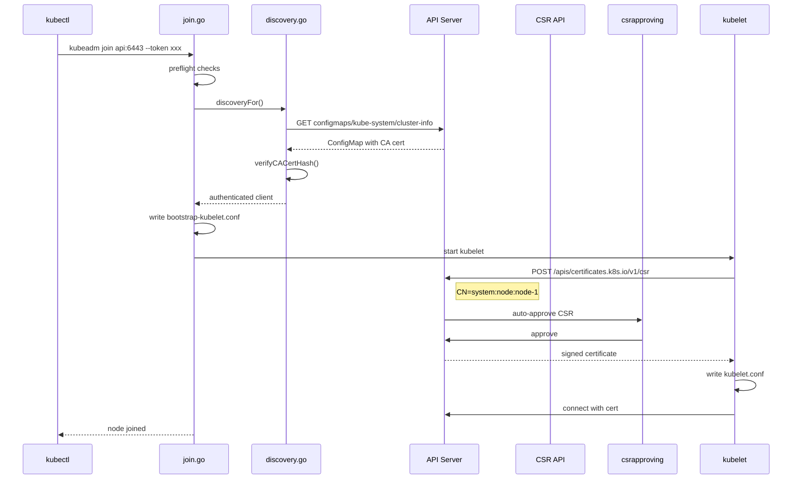

> **生产环境安全提示**
>
> 本文档包含可直接执行的运维命令。执行前请确认：当前目标集群与 Namespace 是否正确；是否具备足够的 RBAC 权限；是否已在非生产环境验证。命令风险等级标注：🔴 高风险（可能造成数据丢失或服务中断）、🟡 中风险（会修改集群状态，但通常可回滚）、🟢 低风险/只读（信息收集，无副作用）。


title: 节点加入流程 (kubeadm join)
description: '| `cmd/kubeadm/app/phases/kubelet/config.go` | L40-L200 | kubelet 配置写入
  |'
category: functions
tags:
- k8s
- operations
- cluster-management
- etcd
- apiserver
- kubelet
- controller-manager
- containerd
- daemonset
- rbac
last_updated: '2026-05-18'
difficulty: intermediate
reading_level: intermediate
audience:
- DevOps工程师
- Kubernetes管理员
- SRE
estimated_read_time: 5min
intent_queries:
- kubeadm join worker node process flow
- Kubernetes node join bootstrap token discovery
- kubeadm join control-plane certificate key
- TLS bootstrap kubelet CSR certificate
- Kubernetes node registration kubelet
trigger_keywords:
- kubeadm join
- bootstrap token
- TLS bootstrap
- CSR
- node join
- kubelet
- discovery
- certificate
- control-plane
- worker node
- token
related_domains:
- 集群基础
- 故障诊断
related_topics:
- kubeadm init
- TLS bootstrap
- certificate management
- kubelet
- HA cluster
authors:
- name: KUDIG Team
  role: contributor
k8s_versions:
- '1.28'
- '1.29'
- '1.30'
- '1.31'
- '1.32'
---

# 节点加入流程 (kubeadm join)

## 函数/流程签名

```go
func NewCmdJoin(out io.Writer, joinFlags *joinFlags) *cobra.Command
func RunJoin(cmd *cobra.Command, args []string, joinOptions *JoinOptions) error
func (o *JoinOptions) Run(data *joinData) error
func discoveryFor(cfg *kubeadmapi.JoinConfiguration) (*clientset.Clientset, error)
func loadDiscoveryBootstrapToken(cfg *kubeadmapi.JoinConfiguration) (*clientset.Clientset, error)
func TLSBootstrap(cfg *kubeadmapi.JoinConfiguration, client clientset.Interface) error
```

## 源码位置

| 文件路径 | 行号范围 | 说明 |
|---------|---------|------|
| `cmd/kubeadm/app/cmd/join.go` | L50-L250 | `RunJoin` 主入口 |
| `cmd/kubeadm/app/phases/join/discovery.go` | L30-L200 | 集群发现机制 |
| `cmd/kubeadm/app/phases/join/controlplanejoin.go` | L30-L250 | control-plane join |
| `cmd/kubeadm/app/phases/kubelet/config.go` | L40-L200 | kubelet 配置写入 |
| `cmd/kubeadm/app/phases/bootstraptoken/node/token.go` | L30-L150 | Bootstrap Token |

## 参数说明

### JoinConfiguration 参数

| 参数名 | 类型 | 说明 | 验证规则 |
|--------|------|------|---------|
| `discovery.bootstrapToken.apiServerEndpoint` | `string` | API Server 地址 | host:port 格式 |
| `discovery.bootstrapToken.token` | `string` | Bootstrap Token | `[a-z0-9]{6}.[a-z0-9]{16}` |
| `discovery.bootstrapToken.caCertHashes` | `[]string` | CA 证书哈希 | `sha256:<hex>` |
| `discovery.timeout` | `*metav1.Duration` | 发现超时 | 默认 5 分钟 |
| `nodeRegistration.criSocket` | `string` | CRI socket 路径 | 有效 socket 路径 |
| `nodeRegistration.name` | `string` | 节点名称 | 默认 hostname |
| `controlPlane` | `*JoinControlPlane` | 控制面加入配置 | 含 certificateKey |

## 返回值

| 返回值 | 类型 | 说明 |
|--------|------|------|
| `clientset.Clientset` | `*struct` | 已认证的 API 客户端 |
| `error` | `error` | join 过程中的错误 |

## 调用链



## 源码分析

### RunJoin 主入口

```go
// cmd/kubeadm/app/cmd/join.go
func RunJoin(cmd *cobra.Command, args []string, joinOptions *JoinOptions) error {
    // 1. 解析参数
    apiServerEndpoint := args[0]

    // 2. 构建 JoinConfiguration
    joinCfg, err := joinOptions.ToJoinConfiguration(apiServerEndpoint)

    // 3. 创建 join 数据上下文
    data, err := newJoinData(joinCfg, joinOptions.ignorePreflightErrors)

    // 4. 注册并执行 phases
    runner := workflow.NewRunner()
    runner.AppendPhase(preflightPhase())
    runner.AppendPhase(discoveryPhase())
    runner.AppendPhase(kubeletStartPhase())

    // 5. 如果是 control-plane 节点
    if joinCfg.ControlPlane != nil {
        runner.AppendPhase(controlPlaneJoinPhase())
    }

    return runner.Run()
}
```

### Discovery 集群发现

```go
// cmd/kubeadm/app/phases/join/discovery.go
func loadDiscoveryBootstrapToken(cfg *kubeadmapi.JoinConfiguration) (*clientset.Clientset, error) {
    // 1. 使用 Bootstrap Token 获取 cluster-info ConfigMap
    token := cfg.Discovery.BootstrapToken.Token
    apiServerURL := fmt.Sprintf("https://%s",
        cfg.Discovery.BootstrapToken.APIServerEndpoint)

    // 2. 临时不验证 TLS (还没拿到 CA cert)
    insecureClient, _ := clientset.NewForConfig(&rest.Config{
        Host:        apiServerURL,
        BearerToken: token,
        TLSClientConfig: rest.TLSClientConfig{Insecure: true},
    })

    // 3. 获取 ConfigMap
    configMap, err := insecureClient.CoreV1().ConfigMaps("kube-system").
        Get(context.TODO(), "cluster-info", metav1.GetOptions{})

    // 4. 提取 CA 证书
    kubeconfigStr := configMap.Data["kubeconfig"]
    kubeconfig, _ := clientcmd.Load([]byte(kubeconfigStr))
    caCert := kubeconfig.Clusters[0].CertificateAuthorityData

    // 5. 验证 CA 证书哈希 (防中间人攻击)
    hash := sha256.Sum256(caCert)
    actualHash := fmt.Sprintf("sha256:%x", hash)
    for _, expected := range cfg.Discovery.BootstrapToken.CACertHashes {
        if actualHash == expected {
            // 6. 创建安全客户端
            return clientset.NewForConfig(&rest.Config{
                Host:        apiServerURL,
                BearerToken: token,
                TLSClientConfig: rest.TLSClientConfig{CAData: caCert},
            })
        }
    }

    return nil, fmt.Errorf("CA cert hash mismatch (possible MITM attack)")
}
```

## 执行流程

### join 完整流程

```
步骤 1:  preflight 预检
    → 系统检查 (CPU/Memory/Swap)
    → CRI 运行时检查
    → 端口检查
    ↓
步骤 2:  discovery 集群发现
    → 使用 Bootstrap Token 获取 cluster-info
    → 验证 CA 证书哈希
    → 创建已认证的 API 客户端
    ↓
步骤 3:  kubelet-start
    → 写入 /etc/kubernetes/bootstrap-kubelet.conf
    → 写入 /var/lib/kubelet/config.yaml
    → 启动 kubelet
    ↓
步骤 4:  TLS Bootstrap
    → kubelet 生成私钥
    → 提交 CSR (CN=system:node:<name>)
    → csrapproving controller 自动审批
    → 证书写入 /var/lib/kubelet/pki/
    → 生成正式 kubelet.conf
    ↓
步骤 5:  (可选) control-plane-join
    → 解密获取证书
    → 生成 static Pod manifests
    → 添加 etcd 成员
    → 标记 control-plane 标签
```

### TLS Bootstrap 详解

```
kubelet 首次启动
    → 读取 bootstrap-kubelet.conf (含 Bootstrap Token)
    → 连接 API Server
    → 生成 RSA 2048 私钥
    → 创建 CSR:
      CN: system:node:<node-name>
      O: system:nodes
    → POST /apis/certificates.k8s.io/v1/csr
    → csrapproving controller 检查:
      - Token 属于 system:bootstrappers 组 ✓
      - CSR 的 signerName 正确 ✓
      → 自动批准
    → 证书写入 kubelet-client-current.pem
    → 生成 kubelet.conf (正式证书)
    → kubelet 使用正式证书连接 API Server
```

## 使用场景

### 场景 1: 标准节点加入

``` bash
# 🟢 低风险：只读/信息收集，通常无副作用
# 在 control-plane 获取 join 命令
kubeadm token create --print-join-command
# kubeadm join 192.168.1.10:6443 --token abc123.def456 --discovery-token-ca-cert-hash sha256:xxx

# 在 worker 节点执行
kubeadm join 192.168.1.10:6443 \
  --token abc123.def456 \
  --discovery-token-ca-cert-hash sha256:xxx

# 验证
kubectl get nodes
# NAME      STATUS   ROLES   AGE   VERSION
# master    Ready    cp      1h    v1.28.0
# worker-1  Ready    <none>  30s   v1.28.0
```
### 场景 2: Token 过期后重新生成

```bash
# Token 默认 24 小时过期
kubeadm token list
# TOKEN     TTL    EXPIRES   USAGES
# (空 - 没有 token)

# 创建新 token
kubeadm token create --print-join-command
# kubeadm join 192.168.1.10:6443 --token xyz789.abcdef --discovery-token-ca-cert-hash sha256:xxx

# 如果忘记 CA hash
openssl x509 -pubkey -in /etc/kubernetes/pki/ca.crt | \
  openssl rsa -pubin -outform der 2>/dev/null | \
  openssl dgst -sha256 -hex | sed 's/^.* //'
```

### 场景 3: 使用配置文件 join

```yaml
# join-config.yaml
apiVersion: kubeadm.k8s.io/v1beta3
kind: JoinConfiguration
discovery:
  bootstrapToken:
    apiServerEndpoint: "192.168.1.10:6443"
    token: "abc123.def4567890abcdef"
    caCertHashes:
    - "sha256:1234567890abcdef"
  timeout: 5m0s
nodeRegistration:
  criSocket: unix:///var/run/containerd/containerd.sock
  name: worker-1
  kubeletExtraArgs:
    cgroup-driver: "systemd"
```

```bash
kubeadm join --config=join-config.yaml
```

### 场景 4: control-plane 节点加入

``` bash
# 🟢 低风险：只读/信息收集，通常无副作用
# 加入 control-plane 节点
kubeadm join lb.example.com:6443 \
  --token abc123.def456 \
  --discovery-token-ca-cert-hash sha256:xxx \
  --control-plane \
  --certificate-key xxx

# 配置 kubectl
mkdir -p $HOME/.kube
cp /etc/kubernetes/admin.conf $HOME/.kube/config

# 验证
kubectl get nodes -l node-role.kubernetes.io/control-plane
# NAME       STATUS   ROLES           AGE   VERSION
# master-1   Ready    control-plane   1h    v1.28.0
# master-2   Ready    control-plane   30s   v1.28.0
```
## 配置示例

### Bootstrap Token RBAC

```yaml
# kubeadm init 自动创建 (参考)
# 允许 Bootstrap Token 创建 CSR
apiVersion: rbac.authorization.k8s.io/v1
kind: ClusterRoleBinding
metadata:
  name: kubeadm:node-autoapprove-bootstrap
roleRef:
  apiGroup: rbac.authorization.k8s.io
  kind: ClusterRole
  name: system:certificates.k8s.io:certificatesigningrequests:nodeclient
subjects:
- apiGroup: rbac.authorization.k8s.io
  kind: Group
  name: system:bootstrappers:kubeadm:default-node-token
---
# 允许 kubelet 自动续签证书
apiVersion: rbac.authorization.k8s.io/v1
kind: ClusterRoleBinding
metadata:
  name: kubeadm:node-autoapprove-certificate-rotation
roleRef:
  apiGroup: rbac.authorization.k8s.io
  kind: ClusterRole
  name: system:certificates.k8s.io:certificatesigningrequests:selfnodeclient
subjects:
- apiGroup: rbac.authorization.k8s.io
  kind: Group
  name: system:nodes
```

## 实战示例

### CSR 管理

``` bash
# 🟢 低风险：只读/信息收集，通常无副作用
# 查看 CSR 列表
kubectl get csr
# NAME        AGE   SIGNERNAME                                    REQUESTOR                CONDITION
# node-csr-1  10s   kubernetes.io/kube-apiserver-client-kubelet   system:bootstrap:abc123  Approved,Issued
# node-csr-2  5s    kubernetes.io/kube-apiserver-client-kubelet   system:bootstrap:abc123  Pending

# 手动批准 CSR
kubectl certificate approve node-csr-2

# 拒绝 CSR
kubectl certificate deny node-csr-3

# 查看 CSR 详情
kubectl describe csr node-csr-1
```
### join 故障排查

``` bash
# 🟢 低风险：只读/信息收集，通常无副作用
# 1. 检查 kubelet 状态
systemctl status kubelet
journalctl -u kubelet -n 50

# 2. 检查 CSR 状态
kubectl get csr
# 如果没有 Pending CSR → kubelet 未提交 CSR → 检查 bootstrap-kubelet.conf

# 3. 检查网络连通性
curl -k https://192.168.1.10:6443/healthz
# ok → API Server 可达

# 4. 检查容器运行时
crictl info

# 5. 检查证书文件
ls -la /etc/kubernetes/pki/
ls -la /var/lib/kubelet/pki/
```
### kubelet 配置写入

```go
// cmd/kubeadm/app/phases/kubelet/config.go
func WriteKubeletConfiguration(cfg *kubeadmapi.JoinConfiguration) error {
    // 1. 从 API Server 下载 kubelet 配置
    //    ConfigMap: kube-system/kubelet-config
    kubeletCfg, err := downloadKubeletConfig(client)

    // 2. 写入 /var/lib/kubelet/config.yaml
    kubeletConfigPath := "/var/lib/kubelet/config.yaml"
    data, _ := yaml.Marshal(kubeletCfg)
    os.WriteFile(kubeletConfigPath, data, 0644)

    // 3. 写入 bootstrap-kubelet.conf
    bootstrapConfig := generateBootstrapKubeconfig(
        cfg.Discovery.BootstrapToken.APIServerEndpoint,
        cfg.Discovery.BootstrapToken.Token,
        "/etc/kubernetes/pki/ca.crt",
    )
    clientcmd.WriteToFile(*bootstrapConfig,
        "/etc/kubernetes/bootstrap-kubelet.conf")

    // 4. 写入 systemd drop-in
    dropIn := `[Service]
Environment="KUBELET_KUBECONFIG_ARGS=--bootstrap-kubeconfig=/etc/kubernetes/bootstrap-kubelet.conf --kubeconfig=/etc/kubernetes/kubelet.conf"
Environment="KUBELET_CONFIG_ARGS=--config=/var/lib/kubelet/config.yaml"
ExecStart=
ExecStart=/usr/bin/kubelet $KUBELET_KUBECONFIG_ARGS $KUBELET_CONFIG_ARGS`
    os.WriteFile("/etc/systemd/system/kubelet.service.d/10-kubeadm.conf",
        []byte(dropIn), 0644)

    // 5. 启动 kubelet
    // systemctl enable --now kubelet
    return nil
}
```

### Bootstrap Token 自动审批流程

```go
// pkg/controller/certificates/approver/sarapprover.go
// csrapproving controller 自动审批来自 Bootstrap Token 的 CSR
func (a *csrApproving) handleCSR(csr *certificatesv1.CertificateSigningRequest) {
    // 1. 检查 CSR 的 signerName
    if csr.Spec.SignerName != "kubernetes.io/kube-apiserver-client-kubelet" {
        return // 不是 kubelet 客户端证书，跳过
    }

    // 2. 检查请求者身份
    //    来自 system:bootstrappers:kubeadm:default-node-token 组
    for _, group := range csr.Spec.Groups {
        if group == "system:bootstrappers:kubeadm:default-node-token" {
            // 3. 验证 CSR 内容
            //    CN 必须是 system:node:*
            //    O 必须是 system:nodes
            if validateCSRContent(csr) {
                // 4. 自动批准
                csr.Status.Conditions = append(csr.Status.Conditions,
                    certificatesv1.CertificateSigningRequestCondition{
                        Type:    certificatesv1.CertificateApproved,
                        Reason:  "AutoApproved",
                        Message: "Auto-approved by csrapproving controller",
                    })
                a.client.CertificatesV1().CertificateSigningRequests().
                    UpdateApproval(context.TODO(), csr.Name, csr, metav1.UpdateOptions{})
            }
        }
    }
}
```

### 从集群移除节点

> ⚠️ **🔴 灾难性操作** — 含不可逆命令，执行前必须满足变更窗口+双人复核+事前备份+回滚方案
> - `etcdctl member remove`：移除 etcd 成员，误删多数派会致集群不可用/丢数据
> - `kubeadm reset`：清理节点所有 K8s 配置/证书/CNI，节点脱离集群
> - `kubectl drain`：驱逐节点所有 Pod，业务流量受影响
> - `kubectl delete`：删除资源（可由声明式清单重建）

> **🔴 高风险操作警告**
>
> 下方命令属于不可逆或高影响操作，执行前请确认：
> - 已备份关键数据与配置
> - 处于批准的变更窗口期
> - 已获得相关责任人授权
> - 已准备回滚或恢复方案
> - 目标集群、Namespace、节点/资源名称正确无误

``` bash
# 🔴 高风险：可能造成数据丢失或服务中断，执行前需备份、变更审批与回滚方案
# 1. 在 control-plane 驱逐节点上的 Pod
kubectl drain <node-name> --delete-emptydir-data --ignore-daemonsets

# 2. 删除节点
kubectl delete node <node-name>

# 3. 在被移除节点上执行 reset
kubeadm reset --cleanup-iptables  # ⚠️ 清理节点所有 K8s 配置

# 4. 如果是 control-plane 节点，还需要:
#    - 移除 etcd 成员: etcdctl member remove <member-id>  # ⚠️ 移除 etcd 成员，可能丢数据
#    - 删除 etcd 数据目录
ETCDCTL_API=3 etcdctl member list \
  --cacert=/etc/kubernetes/pki/etcd/ca.crt \
  --cert=/etc/kubernetes/pki/etcd/healthcheck-client.crt \
  --key=/etc/kubernetes/pki/etcd/healthcheck-client.key \
  -w table

ETCDCTL_API=3 etcdctl member remove <id> \
  --cacert=/etc/kubernetes/pki/etcd/ca.crt \
  --cert=/etc/kubernetes/pki/etcd/healthcheck-client.crt \
  --key=/etc/kubernetes/pki/etcd/healthcheck-client.key
```
### 自动化节点加入脚本

> ⚠️ **🟠 高危操作** — 影响业务流量或节点状态，需变更工单+影响评估+计划回滚
> - `sysctl -w`：实时修改内核参数，全局生效

``` bash
# 🟢 低风险：只读/信息收集，通常无副作用
#!/bin/bash
# auto-join.sh - 自动化节点加入脚本
set -euo pipefail

API_SERVER="${1:?Usage: $0 <api-server:port> <token> <ca-hash> <token> <ca-hash>}"
TOKEN="${2:?}"
CA_HASH="${3:?}"

# 1. 系统准备
swapoff -a
sysctl -w net.ipv4.ip_forward=1

# 2. 执行 join
kubeadm join "$API_SERVER" \
  --token "$TOKEN" \
  --discovery-token-ca-cert-hash "sha256:$CA_HASH" \
  --cri-socket=unix:///var/run/containerd/containerd.sock

# 3. 等待节点就绪
echo "Waiting for node to become Ready..."
until kubectl get node $(hostname) -o jsonpath='{.status.conditions[?(@.type=="Ready")].status}' 2>/dev/null | grep -q True; do
  sleep 5
done
echo "Node $(hostname) joined successfully!"

```
## 常见错误

| 错误 | 原因 | 解决方案 |
|------|------|---------|
| `invalid token` | Token 过期 | `kubeadm token create` 生成新 token |
| `discovery-token-ca-cert-hash mismatch` | CA 哈希不匹配 | 重新获取正确哈希 |
| `connection refused` | API Server 不可达 | 检查网络和 API Server 状态 |
| `CSR not approved` | 自动审批未运行 | 检查 controller-manager 或手动批准 |
| `already part of a cluster` | 节点已在集群中 | 先执行 `kubeadm reset` |
| `CRI runtime not ready` | containerd 未启动 | `systemctl start containerd` |
| `certificate-key mismatch` | HA join 密钥错误 | 使用 init 时相同的 key |
| `node not ready` | CNI 未安装 | 安装 CNI 网络插件 |

## 相关函数

- [集群概览](01-overview.md) — kubeadm init 创建 Bootstrap Token
- [预检流程](02-preflight.md) — join 预检
- [节点加入进阶](12-join-advanced.md) — Discovery 和 TLS Bootstrap 详解
- [证书管理](03-certs.md) — TLS 证书体系
- [高可用进阶](14-ha-advanced.md) — control-plane join
- [安全机制](16-security.md) — Bootstrap Token 安全

### 配置文件发现模式

```yaml
# join-config-file.yaml (使用文件发现，不依赖 Token)
apiVersion: kubeadm.k8s.io/v1beta3
kind: JoinConfiguration
discovery:
  file:
    kubeConfigPath: "/etc/kubernetes/admin.conf"
  timeout: 5m0s
nodeRegistration:
  criSocket: unix:///var/run/containerd/containerd.sock
  name: worker-1
  taints: []
```

```bash
# 从 control-plane 复制 kubeconfig
scp /etc/kubernetes/admin.conf worker-1:/etc/kubernetes/

# 使用文件发现 join
kubeadm join --config=join-config-file.yaml
```

### kubelet 配置文件对比

```yaml
# bootstrap-kubelet.conf (首次启动，含 Bootstrap Token)
apiVersion: v1
kind: Config
clusters:
- cluster:
    certificate-authority: /etc/kubernetes/pki/ca.crt
    server: https://192.168.1.10:6443
  name: kubernetes
users:
- name: kubelet-bootstrap
  user:
    token: abc123.def4567890abcdef  # Bootstrap Token
contexts:
- context:
    cluster: kubernetes
    user: kubelet-bootstrap
  name: bootstrap

---
# kubelet.conf (证书签发后，使用正式证书)
apiVersion: v1
kind: Config
clusters:
- cluster:
    certificate-authority: /etc/kubernetes/pki/ca.crt
    server: https://192.168.1.10:6443
  name: kubernetes
users:
- name: system:node:worker-1
  user:
    client-certificate: /var/lib/kubelet/pki/kubelet-client-current.pem
    client-key: /var/lib/kubelet/pki/kubelet-client-current.pem
contexts:
- context:
    cluster: kubernetes
    user: system:node:worker-1
  name: default
current-context: default
```

### join 后文件结构

```
/etc/kubernetes/
├── bootstrap-kubelet.conf    # Bootstrap Token (初始用)
├── kubelet.conf              # 正式证书 (签发后)
├── pki/
│   └── ca.crt                # CA 证书 (从 ConfigMap 获取)
└── manifest/                 # 空 (worker 节点无 static Pod)

/var/lib/kubelet/
├── config.yaml               # kubelet 行为配置
└── pki/
    ├── kubelet-client-current.pem   # 签发的客户端证书
    ├── kubelet-client-2024-01-01.pem
    └── kubelet.crt                  # 服务端证书 (自签名)
```

## Related

- [[reference|#reference Hub]] — tag hub

- [[系统基础/速查卡/go.md|go]]
- [[系统基础/速查卡/k8s.md|k8s]]
- [[entities/kubernetes.md|kubernetes]]
- [[entities/cni.md|cni]]
- [[entities/containerd.md|containerd]]

```

<!-- risk-assessed -->
