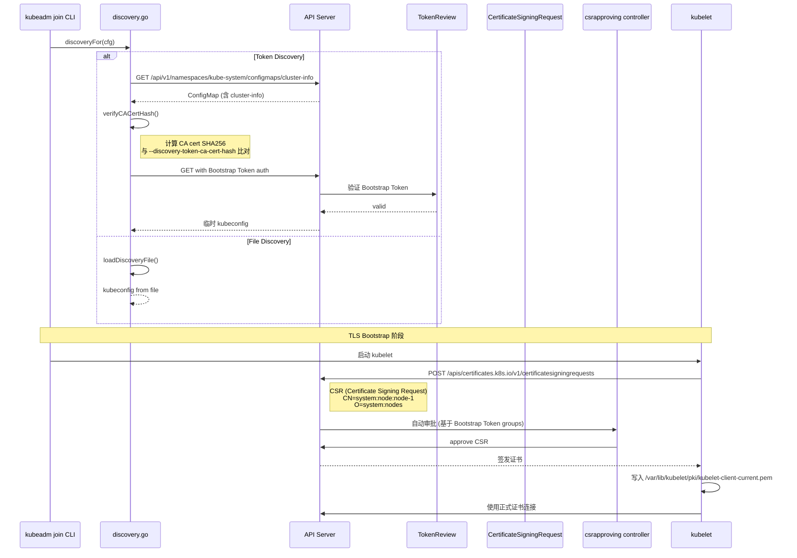

> **生产环境安全提示**
>
> 本文档包含可直接执行的运维命令。执行前请确认：当前目标集群与 Namespace 是否正确；是否具备足够的 RBAC 权限；是否已在非生产环境验证。命令风险等级标注：🔴 高风险（可能造成数据丢失或服务中断）、🟡 中风险（会修改集群状态，但通常可回滚）、🟢 低风险/只读（信息收集，无副作用）。


title: '节点加入进阶: Discovery 与 TLS Bootstrap 详解'
description: '# 节点加入进阶: Discovery 与 TLS Bootstrap 详解'
category: functions
tags:
- k8s
- operations
- cluster-management
- etcd
- apiserver
- kubelet
- scheduler
- controller-manager
- containerd
- rbac
last_updated: '2026-05-18'
difficulty: advanced
reading_level: advanced
audience:
- Kubernetes开发者
- DevOps工程师
- SRE
estimated_read_time: 5min
intent_queries:
- Kubernetes join discovery TLS bootstrap process
- kubeadm join bootstrap token CA cert hash verification
- Kubernetes CSR certificate signing request node
- kubeadm join control-plane certificate key upload
- cluster-info configmap bootstrap token authentication
trigger_keywords:
- join
- discovery
- bootstrap token
- TLS bootstrap
- CSR
- certificate
- csrapproving
- cluster-info
- kubelet.conf
- bootstrap-kubelet.conf
- node join
- certificate-key
related_domains:
- 集群基础
- domain-2-security
related_topics:
- kubeadm join
- certificate management
- TLS bootstrap
- RBAC
- HA cluster
authors:
- name: KUDIG Team
  role: contributor
k8s_versions:
- '1.28'
- '1.29'
- '1.30'
- '1.31'
- '1.32'
---

# 节点加入进阶: Discovery 与 TLS Bootstrap 详解

## 函数/流程签名

```go
func NewCmdJoin(out io.Writer, joinFlags *joinFlags) *cobra.Command
func RunJoin(cmd *cobra.Command, args []string, joinOptions *JoinOptions) error
func (o *JoinOptions) Run(data *joinData) error
func discoveryFor(cfg *kubeadmapi.JoinConfiguration) (*clientset.Clientset, error)
func loadDiscoveryBootstrapToken(cfg *kubeadmapi.JoinConfiguration) (*clientset.Clientset, error)
func loadDiscoveryFile(cfg *kubeadmapi.JoinConfiguration) (*clientset.Clientset, error)
func TLSBootstrap(cfg *kubeadmapi.JoinConfiguration, client clientset.Interface) error
func getTLSBootstrapDir() string
```

## 源码位置

| 文件路径 | 行号范围 | 说明 |
|---------|---------|------|
| `cmd/kubeadm/app/cmd/join.go` | L50-L250 | `NewCmdJoin` 命令注册和 `RunJoin` 入口 |
| `cmd/kubeadm/app/cmd/join.go` | L251-L400 | JoinOptions 验证和执行 |
| `cmd/kubeadm/app/phases/join/controlplanejoin.go` | L30-L250 | control-plane 节点加入逻辑 |
| `cmd/kubeadm/app/phases/join/discovery.go` | L30-L200 | 集群发现机制 |
| `cmd/kubeadm/app/phases/join/checks.go` | L25-L120 | join 预检 |
| `cmd/kubeadm/app/phases/kubelet/config.go` | L40-L200 | kubelet 配置写入 |
| `cmd/kubeadm/app/phases/bootstraptoken/node/token.go` | L30-L150 | Bootstrap Token 管理 |
| `cmd/kubeadm/app/phases/certs/renew.go` | L30-L100 | join 时的证书处理 |

## 参数说明

### JoinConfiguration 参数

| 参数名 | 类型 | 说明 | 验证规则 |
|--------|------|------|---------|
| `discovery` | `Discovery` | 集群发现配置 | 必须指定 token 或 file 其中之一 |
| `discovery.bootstrapToken` | `BootstrapTokenDiscovery` | Token 发现配置 | 格式: host:port |
| `discovery.file` | `FileDiscovery` | 文件发现配置 | 必须是本地文件路径或 URL |
| `discovery.timeout` | `*metav1.Duration` | 发现超时时间 | 默认 5 分钟 |
| `discovery.tlsBootstrapToken` | `string` | TLS Bootstrap Token | 格式: `[a-z0-9]{6}.[a-z0-9]{16}` |
| `nodeRegistration` | `NodeRegistrationOptions` | 节点注册选项 | 包含 name, criSocket, taints |
| `controlPlane` | `*JoinControlPlane` | 控制面加入配置 | 仅用于 control-plane 节点 |
| `skipPhases` | `[]string` | 跳过的阶段 | 已知的 phase 名称 |

### BootstrapTokenDiscovery 参数

| 参数名 | 类型 | 说明 | 验证规则 |
|--------|------|------|---------|
| `apiServerEndpoint` | `string` | API Server 地址 | 格式: host:port |
| `token` | `string` | Bootstrap Token | 格式: `[a-z0-9]{6}.[a-z0-9]{16}` |
| `caCertHashes` | `[]string` | CA 证书哈希列表 | 格式: `sha256:<hex>` |
| `unsafeSkipCAVerification` | `bool` | 跳过 CA 验证 | 不推荐，仅测试环境 |

## 返回值

| 返回值 | 类型 | 说明 |
|--------|------|------|
| `clientset.Clientset` | `*struct` | 已认证的 Kubernetes API 客户端 |
| `joinData` | `*struct` | join 上下文数据，包含配置和客户端 |
| `error` | `error` | join 过程中的错误 |

## 调用链



## 源码分析

### RunJoin 主入口 (join.go)

```go
// cmd/kubeadm/app/cmd/join.go
// RunJoin 执行 kubeadm join 主逻辑
func RunJoin(cmd *cobra.Command, args []string, joinOptions *JoinOptions) error {
    // 1. 解析 join 参数
    //    支持: kubeadm join <api-server-endpoint> --token <token> --discovery-token-ca-cert-hash <hash>
    if len(args) == 0 {
        return fmt.Errorf("missing API server endpoint argument")
    }

    apiServerEndpoint := args[0] // 例如: "192.168.1.10:6443"

    // 2. 构造 JoinConfiguration
    //    从命令行参数或配置文件
    joinCfg, err := joinOptions.ToJoinConfiguration(apiServerEndpoint)
    if err != nil {
        return fmt.Errorf("failed to create JoinConfiguration: %w", err)
    }

    // 3. 创建 join 上下文数据
    data, err := newJoinData(joinCfg, joinOptions.ignorePreflightErrors)
    if err != nil {
        return fmt.Errorf("failed to create join data: %w", err)
    }

    // 4. 执行 join phases
    runner := workflow.NewRunner()

    // 4.1 preflight 阶段
    runner.AppendPhase(preflightPhase())

    // 4.2 discovery 阶段 — 发现集群并验证身份
    runner.AppendPhase(discoveryPhase())

    // 4.3 kubelet-start 阶段 — 配置并启动 kubelet
    runner.AppendPhase(kubeletStartPhase())

    // 4.4 control-plane-join 阶段 (可选)
    //     仅当 --control-plane 时执行
    if joinCfg.ControlPlane != nil {
        runner.AppendPhase(controlPlaneJoinPhase())
    }

    // 5. 运行所有 phases
    if err := runner.Run(); err != nil {
        return fmt.Errorf("join failed: %w", err)
    }

    fmt.Println("[join] This node has joined the cluster.")
    return nil
}
```

### Discovery 集群发现 (discovery.go)

```go
// cmd/kubeadm/app/phases/join/discovery.go
// discoveryFor 执行集群发现，返回已认证的 API 客户端
func discoveryFor(cfg *kubeadmapi.JoinConfiguration) (*clientset.Clientset, *rest.Config, error) {
    // 1. 选择发现模式
    if cfg.Discovery.BootstrapToken != nil {
        // Token 发现模式 (默认)
        return loadDiscoveryBootstrapToken(cfg)
    }
    if cfg.Discovery.File != nil {
        // 文件发现模式
        return loadDiscoveryFile(cfg)
    }

    return nil, nil, fmt.Errorf("discovery method not specified")
}

// loadDiscoveryBootstrapToken 使用 Bootstrap Token 发现集群
func loadDiscoveryBootstrapToken(cfg *kubeadmapi.JoinConfiguration) (*clientset.Clientset, *rest.Config, error) {
    // 1. 构建 API Server URL
    apiServerURL := fmt.Sprintf("https://%s",
        cfg.Discovery.BootstrapToken.APIServerEndpoint)

    // 2. 使用 Bootstrap Token 获取 cluster-info ConfigMap
    //    GET /api/v1/namespaces/kube-system/configmaps/cluster-info
    //    使用 Bootstrap Token 作为 Bearer Token 认证
    token := cfg.Discovery.BootstrapToken.Token // 格式: abc123.def4567890abcdef

    insecureClient, err := clientset.NewForConfig(&rest.Config{
        Host:        apiServerURL,
        BearerToken: token,  // Bootstrap Token 作为临时凭证
        TLSClientConfig: rest.TLSClientConfig{
            Insecure: true,   // 暂时不验证 TLS (还没拿到 CA cert)
        },
    })
    if err != nil {
        return nil, nil, err
    }

    // 3. 获取 cluster-info ConfigMap
    //    该 ConfigMap 由 kubeadm init 创建，包含:
    //    - API Server CA 证书
    //    - 集群基本信息
    configMap, err := insecureClient.CoreV1().ConfigMaps("kube-system").
        Get(context.TODO(), "cluster-info", metav1.GetOptions{})
    if err != nil {
        return nil, nil, fmt.Errorf("failed to get cluster-info: %w", err)
    }

    // 4. 从 ConfigMap 提取 CA 证书
    kubeconfigStr := configMap.Data["kubeconfig"]
    kubeconfig, err := clientcmd.Load([]byte(kubeconfigStr))
    if err != nil {
        return nil, nil, err
    }

    // 5. 验证 CA 证书哈希 (防止中间人攻击)
    //    计算 CA cert 的 SHA256 哈希
    //    与 --discovery-token-ca-cert-hash 参数比对
    caCert := kubeconfig.Clusters[0].CertificateAuthorityData
    if err := verifyCACertHash(caCert,
        cfg.Discovery.BootstrapToken.CACertHashes); err != nil {
        return nil, nil, fmt.Errorf("CA cert hash verification failed: %w", err)
    }

    // 6. 创建已验证的客户端
    //    现在可以验证 TLS 了 (使用从 ConfigMap 获取的 CA cert)
    secureClient, err := clientset.NewForConfig(&rest.Config{
        Host:        apiServerURL,
        BearerToken: token,
        TLSClientConfig: rest.TLSClientConfig{
            CAData: caCert,  // 使用验证过的 CA 证书
        },
    })

    return secureClient, nil, nil
}

// verifyCACertHash 验证 CA 证书哈希
func verifyCACertHash(caCert []byte, expectedHashes []string) error {
    // 1. 解码 PEM 证书
    blocks, _ := certutil.ParseCertsPEM(caCert)
    if len(blocks) == 0 {
        return fmt.Errorf("no certificates found")
    }

    // 2. 计算证书公钥的 SHA256 哈希
    cert := blocks[0]
    pubKeyDER, err := x509.MarshalPKIXPublicKey(cert.PublicKey)
    if err != nil {
        return err
    }

    hash := sha256.Sum256(pubKeyDER)
    actualHash := fmt.Sprintf("sha256:%x", hash)

    // 3. 与预期哈希比对
    for _, expected := range expectedHashes {
        if actualHash == expected {
            return nil // 哈希匹配
        }
    }

    // 4. 哈希不匹配 — 可能是中间人攻击
    return fmt.Errorf(
        "CA cert hash mismatch: got %s, expected one of %v. "+
        "This could indicate a man-in-the-middle attack",
        actualHash, expectedHashes)
}
```

### TLS Bootstrap 流程 (kubelet.go)

```go
// pkg/kubelet/kubelet.go
// TLS Bootstrap 流程 (kubelet 自动执行)
func (kl *Kubelet) bootstrap() error {
    // 1. 读取 bootstrap-kubelet.conf
    //    包含 Bootstrap Token 和 API Server 地址
    bootstrapConfig, err := clientcmd.LoadFromFile(
        "/etc/kubernetes/bootstrap-kubelet.conf")
    if err != nil {
        return err
    }

    // 2. 使用 Bootstrap Token 创建临时客户端
    tempClient, err := clientset.NewForConfig(
        &rest.Config{
            Host:        bootstrapConfig.Clusters[0].Server,
            BearerToken: bootstrapConfig.AuthInfos[0].Token,
            TLSClientConfig: rest.TLSClientConfig{
                CAFile: "/etc/kubernetes/pki/ca.crt",
            },
        },
    )

    // 3. 生成私钥
    //    用于后续证书签发
    privateKey, err := rsa.GenerateKey(rand.Reader, 2048)
    if err != nil {
        return err
    }

    // 4. 生成 Certificate Signing Request (CSR)
    //    CN=system:node:<node-name>
    //    O=system:nodes
    csrTemplate := x509.CertificateRequest{
        Subject: pkix.Name{
            CommonName:   fmt.Sprintf("system:node:%s", kl.nodeName),
            Organization: []string{"system:nodes"},
        },
        DNSNames: []string{kl.nodeName},
        IPAddresses: []net.IP{
            net.ParseIP(kl.nodeIP),
        },
    }

    csrBytes, err := x509.CreateCertificateRequest(
        rand.Reader, &csrTemplate, privateKey)
    if err != nil {
        return err
    }

    // 5. 提交 CSR 到 API Server
    //    POST /apis/certificates.k8s.io/v1/certificatesigningrequests
    csr := &certificatesv1.CertificateSigningRequest{
        ObjectMeta: metav1.ObjectMeta{
            Name: fmt.Sprintf("node-csr-%s", kl.nodeName),
        },
        Spec: certificatesv1.CertificateSigningRequestSpec{
            Request:    pem.EncodeToMemory(&pem.Block{Type: "CERTIFICATE REQUEST", Bytes: csrBytes}),
            SignerName: "kubernetes.io/kube-apiserver-client-kubelet",
            Usages: []certificatesv1.KeyUsage{
                certificatesv1.UsageDigitalSignature,
                certificatesv1.UsageKeyEncipherment,
                certificatesv1.UsageClientAuth,
            },
        },
    }

    _, err = tempClient.CertificatesV1().CertificateSigningRequests().
        Create(context.TODO(), csr, metav1.CreateOptions{})
    if err != nil {
        return fmt.Errorf("failed to create CSR: %w", err)
    }

    // 6. 等待 CSR 被批准
    //    csrapproving controller 基于 Bootstrap Token groups 自动批准
    //    等待最多 15 分钟
    var approvedCert []byte
    for i := 0; i < 900; i++ { // 15 分钟，每秒检查一次
        time.Sleep(1 * time.Second)

        csrStatus, err := tempClient.CertificatesV1().
            CertificateSigningRequests().
            Get(context.TODO(), csr.Name, metav1.GetOptions{})
        if err != nil {
            continue
        }

        // 检查是否已批准
        for _, condition := range csrStatus.Status.Conditions {
            if condition.Type == certificatesv1.CertificateApproved {
                approvedCert = csrStatus.Status.Certificate
                break
            }
        }

        if len(approvedCert) > 0 {
            break
        }
    }

    if len(approvedCert) == 0 {
        return fmt.Errorf("CSR was not approved within 15 minutes")
    }

    // 7. 写入签发的证书
    //    /var/lib/kubelet/pki/kubelet-client-current.pem
    certPath := "/var/lib/kubelet/pki/kubelet-client-current.pem"
    if err := os.WriteFile(certPath, approvedCert, 0644); err != nil {
        return err
    }

    // 8. 写入私钥
    keyPath := "/var/lib/kubelet/pki/kubelet-client.key"
    keyPEM := pem.EncodeToMemory(&pem.Block{
        Type:  "RSA PRIVATE KEY",
        Bytes: x509.MarshalPKCS1PrivateKey(privateKey),
    })
    if err := os.WriteFile(keyPath, keyPEM, 0600); err != nil {
        return err
    }

    // 9. 生成正式 kubelet.conf
    //    使用签发的证书替代 Bootstrap Token
    kubeconfig := generateKubeletKubeconfig(
        bootstrapConfig.Clusters[0].Server,
        certPath, keyPath,
        "/etc/kubernetes/pki/ca.crt",
    )

    return clientcmd.WriteToFile(*kubeconfig, "/etc/kubernetes/kubelet.conf")
}
```

### Control-Plane Join (controlplanejoin.go)

```go
// cmd/kubeadm/app/phases/join/controlplanejoin.go
// JoinControlPlane 执行控制面节点加入
func JoinControlPlane(cfg *kubeadmapi.JoinConfiguration) error {
    // 1. 解密证书
    //    使用 --certificate-key 解密 ConfigMap 中的证书
    certs, err := downloadCerts(cfg.ControlPlane.CertificateKey)
    if err != nil {
        return fmt.Errorf("failed to download certs: %w", err)
    }

    // 2. 写入证书到 /etc/kubernetes/pki/
    if err := writeCerts(certs); err != nil {
        return err
    }

    // 3. 生成控制面组件 manifest
    //    kube-apiserver.yaml
    //    kube-controller-manager.yaml
    //    kube-scheduler.yaml
    if err := generateControlPlaneManifests(cfg); err != nil {
        return err
    }

    // 4. 生成 etcd manifest (如果是 stacked etcd)
    if err := generateEtcdManifest(cfg); err != nil {
        return err
    }

    // 5. 更新 API Server endpoints
    //    添加新节点的 IP 到 endpoints
    if err := updateAPIServerEndpoints(cfg); err != nil {
        return err
    }

    // 6. 标记节点为 control-plane
    if err := markControlPlane(cfg.NodeRegistration.Name); err != nil {
        return err
    }

    return nil
}
```

## 执行流程

### Token Discovery 详细流程

```
步骤 1: 解析 join 参数
    → API Server endpoint
    → Bootstrap Token
    → CA cert hash
    ↓
步骤 2: 首次连接 (不验证 TLS)
    → GET /api/v1/namespaces/kube-system/configmaps/cluster-info
    → 使用 Bootstrap Token 认证
    ↓
步骤 3: 提取 CA 证书
    → 从 ConfigMap data.kubeconfig 提取
    ↓
步骤 4: 验证 CA 证书哈希
    → 计算证书公钥 SHA256
    → 与 --discovery-token-ca-cert-hash 比对
    → 不匹配 → 拒绝连接 (中间人攻击)
    ↓
步骤 5: 创建安全客户端
    → 使用验证过的 CA 证书
    → 使用 Bootstrap Token 认证
    ↓
步骤 6: 写入 bootstrap-kubelet.conf
    → 包含 API Server URL + Bootstrap Token + CA cert
    ↓
步骤 7: 启动 kubelet
    → kubelet 读取 bootstrap-kubelet.conf
    ↓
步骤 8: kubelet 生成私钥
    → 2048-bit RSA 密钥
    ↓
步骤 9: kubelet 创建 CSR
    → CN=system:node:<node-name>
    → O=system:nodes
    → POST /apis/certificates.k8s.io/v1/certificatesigningrequests
    ↓
步骤 10: csrapproving controller 自动审批
    → 检查 CSR 来自 system:bootstrappers 组
    → 自动批准
    ↓
步骤 11: 证书写入
    → /var/lib/kubelet/pki/kubelet-client-current.pem
    ↓
步骤 12: 生成正式 kubelet.conf
    → 使用签发证书替代 Bootstrap Token
    → kubelet 重启后使用正式证书
```

## 使用场景

### 场景 1: 标准节点加入

``` bash
# 🟢 低风险：只读/信息收集，通常无副作用
# 在 control-plane 获取 join 命令
kubeadm token create --print-join-command
# kubeadm join 192.168.1.10:6443 --token abc123.def4567890abcdef --discovery-token-ca-cert-hash sha256:1234567890abcdef

# 在 worker 节点执行
kubeadm join 192.168.1.10:6443 \
  --token abc123.def4567890abcdef \
  --discovery-token-ca-cert-hash sha256:1234567890abcdef1234567890abcdef

# 验证
kubectl get nodes
# NAME      STATUS   ROLES           AGE   VERSION
# master    Ready    control-plane   1h    v1.28.0
# worker-1  Ready    <none>          30s   v1.28.0
```
### 场景 2: 使用配置文件 join

```yaml
# join-config.yaml
apiVersion: kubeadm.k8s.io/v1beta3
kind: JoinConfiguration
discovery:
  bootstrapToken:
    apiServerEndpoint: "192.168.1.10:6443"
    token: "abc123.def4567890abcdef"
    caCertHashes:
    - "sha256:1234567890abcdef1234567890abcdef"
  timeout: 5m0s
  tlsBootstrapToken: "abc123.def4567890abcdef"
nodeRegistration:
  criSocket: unix:///var/run/containerd/containerd.sock
  name: worker-1
  taints: []
  kubeletExtraArgs:
    cgroup-driver: "systemd"
```

```bash
kubeadm join --config=join-config.yaml
```

### 场景 3: control-plane 节点加入

``` bash
# 🟢 低风险：只读/信息收集，通常无副作用
# 加入新的 control-plane 节点
kubeadm join lb.example.com:6443 \
  --token abc123.def4567890abcdef \
  --discovery-token-ca-cert-hash sha256:xxx \
  --control-plane \
  --certificate-key xxx

# 验证
kubectl get nodes -l node-role.kubernetes.io/control-plane
# NAME       STATUS   ROLES           AGE   VERSION
# master-1   Ready    control-plane   1h    v1.28.0
# master-2   Ready    control-plane   30s   v1.28.0
```
### 场景 4: Token 过期后重新生成

```bash
# Token 默认 24 小时过期
# 查看现有 token
kubeadm token list
# TOKEN                    TTL       EXPIRES                USAGES
# abc123.def4567890abcdef  23h       2024-01-02T00:00:00Z   authentication,signing

# 生成新 token
kubeadm token create
# 输出: xyz789.abcdef0123456789

# 生成完整 join 命令 (含 CA hash)
kubeadm token create --print-join-command
# kubeadm join 192.168.1.10:6443 --token xyz789.abcdef0123456789 --discovery-token-ca-cert-hash sha256:xxx

# 如果忘记了 CA hash
openssl x509 -pubkey -in /etc/kubernetes/pki/ca.crt | \
  openssl rsa -pubin -outform der 2>/dev/null | \
  openssl dgst -sha256 -hex | sed 's/^.* //'
# 输出: 1234567890abcdef...
```

### 场景 5: 文件发现模式 (离线环境)

``` bash
# 🟢 低风险：只读/信息收集，通常无副作用
# 1. 在 control-plane 导出 cluster-info
kubectl -n kube-system get configmap cluster-info -o yaml > cluster-info.yaml

# 2. 传输到 worker 节点
scp cluster-info.yaml worker-1:/etc/kubernetes/cluster-info.yaml

# 3. 使用文件发现 join
kubeadm join --discovery-file=/etc/kubernetes/cluster-info.yaml

# 或者直接使用 kubeconfig 文件
scp /etc/kubernetes/admin.conf worker-1:/etc/kubernetes/bootstrap-kubelet.conf
kubeadm join --discovery-file=/etc/kubernetes/bootstrap-kubelet.conf
```
## 配置示例

### Bootstrap Token RBAC 配置

```yaml
# kubeadm init 自动创建的 RBAC 资源 (参考)
apiVersion: rbac.authorization.k8s.io/v1
kind: ClusterRoleBinding
metadata:
  name: kubeadm:node-autoapprove-bootstrap
roleRef:
  apiGroup: rbac.authorization.k8s.io
  kind: ClusterRole
  name: system:certificates.k8s.io:certificatesigningrequests:nodeclient
subjects:
- apiGroup: rbac.authorization.k8s.io
  kind: Group
  name: system:bootstrappers:kubeadm:default-node-token

---
# 自动续签 kubelet 证书
apiVersion: rbac.authorization.k8s.io/v1
kind: ClusterRoleBinding
metadata:
  name: kubeadm:node-autoapprove-certificate-rotation
roleRef:
  apiGroup: rbac.authorization.k8s.io
  kind: ClusterRole
  name: system:certificates.k8s.io:certificatesigningrequests:selfnodeclient
subjects:
- apiGroup: rbac.authorization.k8s.io
  kind: Group
  name: system:nodes
```

### 自动化 join 脚本配置

```yaml
# auto-join-configmap.yaml
apiVersion: v1
kind: ConfigMap
metadata:
  name: node-join-config
  namespace: kube-system
data:
  join-script.sh: |
    #!/bin/bash
    set -euo pipefail

    # 从环境变量获取 join 参数
    API_SERVER="${API_SERVER:-}"
    TOKEN="${TOKEN:-}"
    CA_HASH="${CA_HASH:-}"

    if [ -z "$API_SERVER" ] || [ -z "$TOKEN" ] || [ -z "$CA_HASH" ]; then
      echo "Missing required environment variables"
      exit 1
    fi

    # 执行 join
    kubeadm join "$API_SERVER" \
      --token "$TOKEN" \
      --discovery-token-ca-cert-hash "sha256:$CA_HASH" \
      --cri-socket=unix:///var/run/containerd/containerd.sock

    echo "Node joined successfully"
```

## 实战示例

### 查看 Bootstrap Token

```bash
# 列出所有 Bootstrap Token
kubeadm token list
# TOKEN                    TTL       EXPIRES                USAGES                   DESCRIPTION
# abc123.def4567890abcdef  23h       2024-01-02T00:00:00Z   authentication,signing   <none>

# 创建永不过期的 token (不推荐生产环境)
kubeadm token create --ttl 0
# 输出: forever.0123456789abcdef

# 创建带描述的 token
kubeadm token create --description "for worker node join"
```

### 查看 CSR 状态

``` bash
# 🟢 低风险：只读/信息收集，通常无副作用
# 查看 CSR 列表
kubectl get csr
# NAME        AGE   SIGNERNAME                                    REQUESTOR                 REQUESTEDDURATION   CONDITION
# node-csr-1  10s   kubernetes.io/kube-apiserver-client-kubelet   system:bootstrap:abc123   <none>              Approved,Issued
# node-csr-2  5s    kubernetes.io/kube-apiserver-client-kubelet   system:bootstrap:abc123   <none>              Pending

# 手动批准 CSR (如果自动批准失败)
kubectl certificate approve node-csr-2

# 查看 CSR 详情
kubectl describe csr node-csr-1
```
### 获取 CA 证书哈希

```bash
# 方法 1: 使用 openssl
openssl x509 -pubkey -in /etc/kubernetes/pki/ca.crt | \
  openssl rsa -pubin -outform der 2>/dev/null | \
  openssl dgst -sha256 -hex | sed 's/^.* //'
# 输出: 1234567890abcdef1234567890abcdef1234567890abcdef1234567890abcdef

# 方法 2: 使用 kubeadm
kubeadm init phase bootstrap-token --dry-run 2>&1 | grep "discovery-token-ca-cert-hash"

# 方法 3: 从 join 命令获取
kubeadm token create --print-join-command | grep -o 'sha256:[a-f0-9]*'

```

## 常见错误

| 错误 | 原因 | 解决方案 |
|------|------|---------|
| `invalid token` | Token 过期或格式错误 | `kubeadm token create` 生成新 token |
| `discovery-token-ca-cert-hash mismatch` | CA 证书哈希不匹配 | 重新获取正确的哈希值 |
| `connection refused` | API Server 不可达 | 检查网络和 API Server 状态 |
| `TLS handshake timeout` | 防火墙阻止 6443 端口 | 开放防火墙端口 |
| `CSR not approved` | csrapproving controller 未运行 | 检查 controller-manager 或手动批准 |
| `node not found` | CSR 未完成审批 | 等待 CSR 审批完成 |
| `cannot load cluster-info` | cluster-info ConfigMap 不存在 | 检查 `kube-system/cluster-info` ConfigMap |
| `certificate-key mismatch` | control-plane join 时密钥不匹配 | 使用 init 时相同的 --certificate-key |
| `already part of a cluster` | 节点已在集群中 | 先执行 `kubeadm reset` |
| `CRI runtime not ready` | containerd 未启动 | `systemctl start containerd` |

## 相关函数

- [集群概览](01-overview.md) — kubeadm init 创建 Bootstrap Token
- [预检流程](02-preflight.md) — join 前的预检
- [节点加入基础](06-join.md) — join 基本流程
- [证书管理](03-certs.md) — TLS 证书体系
- [安全机制](16-security.md) — Bootstrap Token 安全模型
- [高可用进阶](14-ha-advanced.md) — control-plane join 和证书分发
- [CRI 运行时](18-cri-runtime.md) — join 时 CRI 检查

## Related

- [[reference|#reference Hub]] — tag hub

- [[系统基础/速查卡/go.md|go]]
- [[系统基础/速查卡/k8s.md|k8s]]
- [[entities/kubernetes.md|kubernetes]]
- [[entities/containerd.md|containerd]]
- [[平台工程/代码分析/node-create/01-overview.md|01-overview]]

```

<!-- risk-assessed -->
