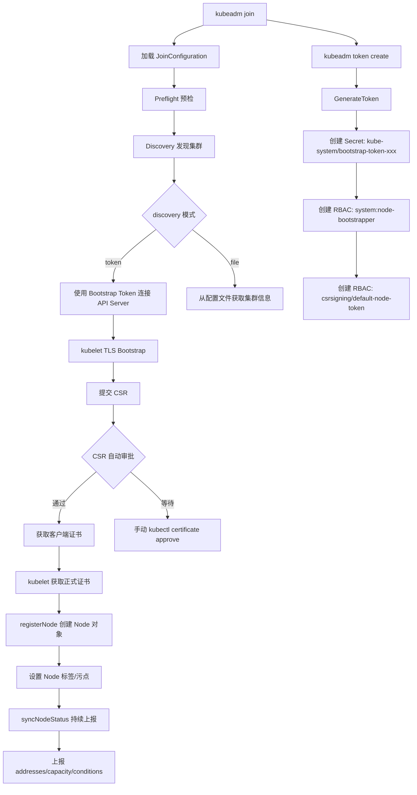
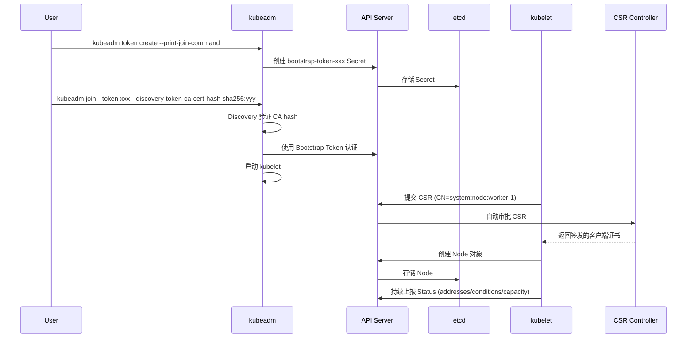

> **生产环境安全提示**
>
> 本文档包含可直接执行的运维命令。执行前请确认：当前目标集群与 Namespace 是否正确；是否具备足够的 RBAC 权限；是否已在非生产环境验证。命令风险等级标注：🔴 高风险（可能造成数据丢失或服务中断）、🟡 中风险（会修改集群状态，但通常可回滚）、🟢 低风险/只读（信息收集，无副作用）。


title: Node 注册与 kubeadm token 详解
description: '# Node 注册与 kubeadm token 详解'
category: functions
tags:
- k8s
- operations
- cluster-management
- etcd
- apiserver
- kubelet
- controller-manager
- containerd
- rbac
- rag
last_updated: 2026-05
difficulty: advanced
reading_level: advanced
audience:
- SRE
- 运维工程师
- 平台工程师
estimated_read_time: 5min
intent_queries:
- Node 注册与 kubeadm token 详解 是什么
- 如何 Node 注册与 kubeadm token 详解
trigger_keywords:
- Node
- 注册与
- kubeadm
- token
- 详解
- functions
authors:
- name: KUDIG Team
  role: contributor
k8s_versions:
- '1.28'
- '1.29'
- '1.30'
- '1.31'
- '1.32'
---

# Node 注册与 kubeadm token 详解

## 函数签名

```go
func CreateNewTokens(client kubernetes.Interface, tokens []*kubeadmapi.BootstrapToken, dryRun bool) error

func GenerateToken() (string, error)

func ParseToken(s string) (tokenID string, tokenSecret string, err error)

func NewBootstrap(token string, discoveryTokenAPIServers []string, discoveryTokenCACertHashes []string) (*Bootstrap, error)

func (k *Kubelet) syncNodeStatus(ctx context.Context) error

func (k *Kubelet) registerNode(ctx context.Context) error

func (k *certificateManager) RequestCertificate(ctx context.Context) (*x509.Certificate, error)
```

## 源码位置

| 组件 | 源码路径 | 说明 |
|------|---------|------|
| Bootstrap Token 管理 | `cmd/kubeadm/app/phases/bootstraptoken/` | Token 创建、删除、列表 |
| Token 命令 | `cmd/kubeadm/app/cmd/token/` | kubeadm token 子命令 |
| kubelet 注册 | `pkg/kubelet/nodestatus/` | 节点状态上报与注册 |
| CSR 管理 | `pkg/kubelet/certificate/` | 证书签名请求与轮换 |
| Node Lifecycle | `pkg/controller/nodelifecycle/` | 节点健康监控 |
| kubeadm join | `cmd/kubeadm/app/cmd/join.go` | 节点加入逻辑 |

## 参数说明

### BootstrapToken 结构

| 字段 | 类型 | 说明 |
|------|------|------|
| `Token` | `BootstrapTokenString` | Token 格式: `[a-z0-9]{6}.[a-z0-9]{16}` |
| `Description` | `string` | Token 描述信息 |
| `TTL` | `*metav1.Duration` | 有效期，默认 24h |
| `Expires` | `*metav1.Time` | 过期时间（与 TTL 二选一） |
| `Usages` | `[]string` | Token 用途列表 |
| `Groups` | `[]string` | 认证后附加的用户组 |

### NodeRegistration 字段

| 字段 | 类型 | 说明 | 默认值 |
|------|------|------|--------|
| `Name` | `string` | 节点名称 | hostname |
| `CRISocket` | `string` | CRI socket 路径 | 自动检测 |
| `Taints` | `[]corev1.Taint` | 节点初始污点 | 控制面自动添加 |
| `KubeletExtraArgs` | `map[string]string` | kubelet 额外参数 | |
| `IgnorePreflightErrors` | `[]string` | 忽略的预检错误 | |
| `ImagePullPolicy` | `corev1.PullPolicy` | 镜像拉取策略 | IfNotPresent |

### kubeadm join 参数

| 参数 | 说明 | 默认值 |
|------|------|--------|
| `--token` | Bootstrap Token | |
| `--discovery-token-ca-cert-hash` | CA 证书 hash（SHA256） | |
| `--discovery-file` | 配置文件路径 | |
| `--node-name` | 节点名称 | hostname |
| `--node-ip` | 节点 IP | 自动选择 |
| `--cri-socket` | CRI socket 路径 | 自动检测 |
| `--ignore-preflight-errors` | 忽略的预检错误 | |
| `--skip-phases` | 跳过的阶段 | |
| `--control-plane` | 加入为控制面节点 | false |

## 返回值

| 函数 | 返回值 | 说明 |
|------|--------|------|
| `GenerateToken` | `(string, error)` | 返回 `[a-z0-9]{6}.[a-z0-9]{16}` 格式的 Token |
| `ParseToken` | `(string, string, error)` | 返回 tokenID 和 tokenSecret |
| `CreateNewTokens` | `error` | Token 创建成功或失败 |
| `syncNodeStatus` | `error` | 节点状态同步结果 |
| `registerNode` | `error` | 节点注册结果 |

## 调用链



## 源码分析

### 概述

Kubernetes 节点注册是集群生命周期管理的关键环节。kubeadm 通过 Bootstrap Token 机制简化节点加入流程，kubelet 通过 TLS Bootstrap 获取正式证书后注册 Node 对象。理解 Token 生命周期、CSR 审批流程和 Node 对象创建过程，对于排查节点加入问题和设计自动化部署系统至关重要。

### Bootstrap Token 生成

```go
// cmd/kubeadm/app/phases/bootstraptoken/bootstraptoken.go
func GenerateToken() (string, error) {
    tokenID, err := rand.Bytes(constants.BootstrapTokenIDBytes)
    if err != nil {
        return "", err
    }
    tokenSecret, err := rand.Bytes(constants.BootstrapTokenSecretBytes)
    if err != nil {
        return "", err
    }
    return fmt.Sprintf("%s.%s", tokenID, tokenSecret), nil
}

func CreateNewTokens(client kubernetes.Interface, tokens []*kubeadmapi.BootstrapToken, dryRun bool) error {
    for _, token := range tokens {
        if err := CreateToken(client, token, dryRun); err != nil {
            return err
        }
    }
    return nil
}

func CreateToken(client kubernetes.Interface, token *kubeadmapi.BootstrapToken, dryRun bool) error {
    secretName := bootstraputil.BootstrapTokenSecretName(token.Token.ID)
    secret := &corev1.Secret{
        ObjectMeta: metav1.ObjectMeta{
            Name:      secretName,
            Namespace: metav1.NamespaceSystem,
        },
        Type: corev1.SecretType(bootstrapapi.BootstrapTokenSecretKey),
        Data: bootstraputil.BootstrapTokenToData(token),
    }

    if dryRun {
        fmt.Printf("[dryrun] Would create bootstrap token secret %s/%s\n", secret.Namespace, secret.Name)
        return nil
    }

    _, err := client.CoreV1().Secrets(metav1.NamespaceSystem).Create(context.TODO(), secret, metav1.CreateOptions{})
    return err
}
```

### Token 存储格式

```yaml
apiVersion: v1
kind: Secret
metadata:
  name: bootstrap-token-abc123
  namespace: kube-system
type: bootstrap.kubernetes.io/token
stringData:
  token-id: "abc123"
  token-secret: "def4567890123456"
  usage-bootstrap-authentication: "true"
  usage-bootstrap-signing: "true"
  auth-extra-groups: "system:bootstrappers:kubeadm:default-node-token"
  expiration: "2024-01-02T00:00:00Z"
  description: "kubeadm bootstrap token generated at 2024-01-01T00:00:00Z"
```

### kubelet TLS Bootstrap 流程

```go
// pkg/kubelet/certificate/certificate_manager.go
func (m *certificateManager) RequestCertificate(ctx context.Context) (*x509.Certificate, error) {
    csrData, err := x509.CreateCertificateRequest(
        rand.Reader,
        &x509.CertificateRequest{
            Subject: pkix.Name{
                CommonName:   fmt.Sprintf("system:node:%s", m.nodeName),
                Organization: []string{"system:nodes"},
            },
            DNSNames:    m.dnsNames,
            IPAddresses: m.ipAddresses,
        },
        m.privateKey,
    )
    if err != nil {
        return nil, err
    }

    csr := &certificatesv1.CertificateSigningRequest{
        ObjectMeta: metav1.ObjectMeta{
            GenerateName: "csr-",
        },
        Spec: certificatesv1.CertificateSigningRequestSpec{
            Request:    csrData,
            SignerName: certificatesv1.KubeAPIServerClientKubeletSignerName,
            Usages: []certificatesv1.KeyUsage{
                certificatesv1.UsageClientAuth,
                certificatesv1.UsageDigitalSignature,
            },
        },
    }

    approvedCSR, err := m.client.CertificatesV1().CertificateSigningRequests().Create(ctx, csr, metav1.CreateOptions{})
    if err != nil {
        return nil, err
    }

    return m.waitForCertificate(ctx, approvedCSR.Name)
}
```

### Node 对象注册

```go
// pkg/kubelet/nodestatus/setters.go
func NodeAddress(nodeAddrs []v1.NodeAddress) func(*v1.Node) error {
    return func(node *v1.Node) error {
        node.Status.Addresses = nodeAddrs
        return nil
    }
}

func MachineInfo(nodeName string, maxPods int32, podsPerCore int32, machineInfo *cadvisorapi.MachineInfo) func(*v1.Node) error {
    return func(node *v1.Node) error {
        node.Status.Capacity = v1.ResourceList{
            v1.ResourceCPU:       *resource.NewQuantity(int64(machineInfo.NumCores), resource.DecimalSI),
            v1.ResourceMemory:    *resource.NewQuantity(int64(machineInfo.MemoryCapacity), resource.BinarySI),
            v1.ResourceEphemeralStorage: *resource.NewQuantity(int64(machineInfo.FilesystemCapacity), resource.BinarySI),
            v1.ResourcePods:      *resource.NewQuantity(maxPods, resource.DecimalSI),
        }
        node.Status.Allocatable = node.Status.Capacity
        node.Status.NodeInfo.MachineID = machineInfo.MachineID
        node.Status.NodeInfo.SystemUUID = machineInfo.SystemUUID
        node.Status.NodeInfo.BootID = machineInfo.BootID
        node.Status.NodeInfo.KernelVersion = machineInfo.KernelVersion
        node.Status.NodeInfo.OSImage = machineInfo.ContainerOsVersion
        node.Status.NodeInfo.Architecture = machineInfo.Architecture
        return nil
    }
}
```

### PodCIDR 分配

kube-controller-manager 中的 node-controller 负责 PodCIDR 分配：

```go
// pkg/controller/nodelifecycle/node_lifecycle_controller.go
func (nc *Controller) reconcileNodeCIDR(node *v1.Node) error {
    if node.Spec.PodCIDR != "" {
        return nil
    }

    allocator, err := nc.cidrAllocator.Allocate(node.Name)
    if err != nil {
        return err
    }

    node.Spec.PodCIDR = allocator.String()
    _, err = nc.kubeClient.CoreV1().Nodes().Update(context.TODO(), node, metav1.UpdateOptions{})
    return err
}
```

## 执行流程



## 使用场景

1. **工作节点加入**：使用 `kubeadm join` 将节点注册到集群
2. **控制面节点扩展**：使用 `--control-plane` 加入新的控制面
3. **自动化部署**：脚本生成 Token 并批量加入节点
4. **Token 轮换**：定期创建新 Token 确保安全
5. **节点重新注册**：reset 后重新 join 修复异常节点

## 配置示例

```yaml
apiVersion: kubeadm.k8s.io/v1beta4
kind: JoinConfiguration
discovery:
  bootstrapToken:
    apiServerEndpoint: "192.168.1.10:6443"
    token: "abcdef.0123456789abcdef"
    caCertHashes:
      - "sha256:abc123def456..."
    unsafeSkipCAVerification: false
  timeout: 5m0s
nodeRegistration:
  name: "worker-3"
  criSocket: "unix:///run/containerd/containerd.sock"
  taints: []
  kubeletExtraArgs:
    node-ip: "192.168.1.13"
    node-labels: "node-role.kubernetes.io/worker="
timeouts:
  discovery: 5m0s
```

## 实战示例

### Token 管理全流程

``` bash
# 🟢 低风险：只读/信息收集，通常无副作用
# 创建 Token（默认 24h TTL）
kubeadm token create
#abcdef.0123456789abcdef

# 创建带描述的 Token
kubeadm token create --description="For worker-3 join" --ttl=2h
#ghijkl.9876543210ghijkl

# 列出所有 Token
kubeadm token list
# TOKEN                     TTL         EXPIRES                USAGES                   DESCRIPTION
# abcdef.0123456789abcdef   23h         2024-01-02T00:00:00Z   authentication,signing   <none>
# ghijkl.9876543210ghijkl   1h          2024-01-01T02:00:00Z   authentication,signing   For worker-3 join

# 生成 join 命令
kubeadm token create --print-join-command
# kubeadm join 192.168.1.10:6443 --token abcdef.0123456789abcdef --discovery-token-ca-cert-hash sha256:1234abc...

# 删除 Token
kubeadm token delete abcdef
# bootstrap token "abcdef" deleted

# 查看 Token 对应的 Secret
kubectl get secret bootstrap-token-ghijkl -n kube-system -o yaml
```
### 节点加入完整流程

``` bash
# 🟢 低风险：只读/信息收集，通常无副作用
# 在控制面节点生成 join 命令
kubeadm token create --print-join-command
# kubeadm join 192.168.1.10:6443 --token xxx --discovery-token-ca-cert-hash sha256:yyy

# 在工作节点执行
kubeadm join 192.168.1.10:6443 --token abcdef.0123456789abcdef \
  --discovery-token-ca-cert-hash sha256:1234abcdef5678...

# [preflight] Running pre-flight checks
# [preflight] Reading configuration from the cluster...
# [preflight] FYI: You can look at this config file with 'kubectl -n kube-system get cm kubeadm-config -o yaml'
# [kubelet-start] Writing kubelet configuration to file "/var/lib/kubelet/config.yaml"
# [kubelet-start] Starting the kubelet
# [kubelet-start] Waiting for the kubelet to perform the TLS Bootstrap...

# 验证节点加入
kubectl get nodes
# NAME       STATUS   ROLES           AGE   VERSION
# master-1   Ready    control-plane   1h    v1.28.0
# worker-1   Ready    <none>          10m   v1.28.0
# worker-2   Ready    <none>          5m    v1.28.0
```
### 查看 Node 对象

``` bash
# 🟢 低风险：只读/信息收集，通常无副作用
kubectl get node worker-1 -o yaml
# apiVersion: v1
# kind: Node
# metadata:
#   labels:
#     kubernetes.io/arch: amd64
#     kubernetes.io/hostname: worker-1
#     kubernetes.io/os: linux
#     node-role.kubernetes.io/worker: ""
#   name: worker-1
# spec:
#   podCIDR: 10.244.1.0/24
# status:
#   addresses:
#   - address: 192.168.1.11
#     type: InternalIP
#   - address: worker-1
#     type: Hostname
#   conditions:
#   - type: Ready
#     status: "True"
#     reason: KubeletReady
#   allocatable:
#     cpu: "4"
#     memory: 8Gi
#     pods: "110"
#   nodeInfo:
#     kubeletVersion: v1.28.0
#     containerRuntimeVersion: containerd://1.7.0
#     osImage: Ubuntu 22.04.3 LTS
```
## 常见错误

| 错误 | 现象 | 原因 | 解决方案 |
|------|------|------|----------|
| Token 已过期 | `[discovery] The cluster has no matching bootstrap token` | TTL 到期 | `kubeadm token create` 新建 |
| CA hash 不匹配 | `discovery failed: token ID is invalid` | CA hash 计算错误 | 重新获取 CA hash |
| CSR 未审批 | 节点 NotReady，CSR 状态 Pending | 自动审批 RBAC 缺失 | 检查 kubeadm 创建的 ClusterRoleBinding |
| hostname 不匹配 | `node name mismatch` | `/etc/hostname` 与 `--node-name` 不一致 | 统一节点名称 |
| PodCIDR 未分配 | `node pod cidr unassigned` | node-controller 未分配 | 检查 `--node-cidr-mask-size` 和 `--allocate-node-cidrs` |
| 多网卡 IP 选择错误 | 节点使用错误 IP | kubelet 选择第一个非 loopback 接口 | 显式指定 `--node-ip` |
| Bootstrap Token Secret 丢失 | Token 存在但无法使用 | Secret 被误删 | 重新创建 Token |

## 相关函数

- [`kubeadm join`](06-join.md) — 节点加入完整流程
- [`CSR 自动审批`](12-join-advanced.md) — CertificateSigningRequest 自动审批机制
- [`证书轮换`](../node-create/06-certificate.md) — kubelet 证书自动轮换
- [`Node Lifecycle Controller`](../node-create/01-overview.md) — 节点健康监控与驱逐
- [`kubeadm init phase bootstrap-token`](17-init-phases.md) — init 时创建 Bootstrap Token

## Related

- [[reference|#reference Hub]] — tag hub

- [[系统基础/速查卡/go.md|go]]
- [[系统基础/速查卡/k8s.md|k8s]]
- 02-cluster-lifecycle-management
- [[entities/kubernetes.md|kubernetes]]
- [[entities/containerd.md|containerd]]


<!-- risk-assessed -->
