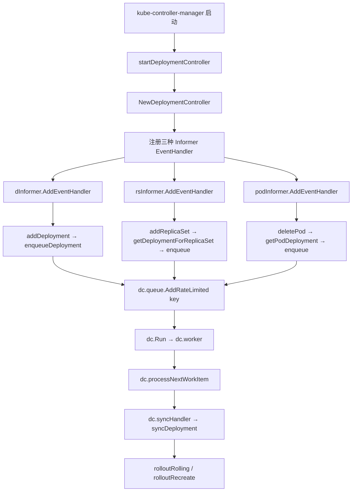
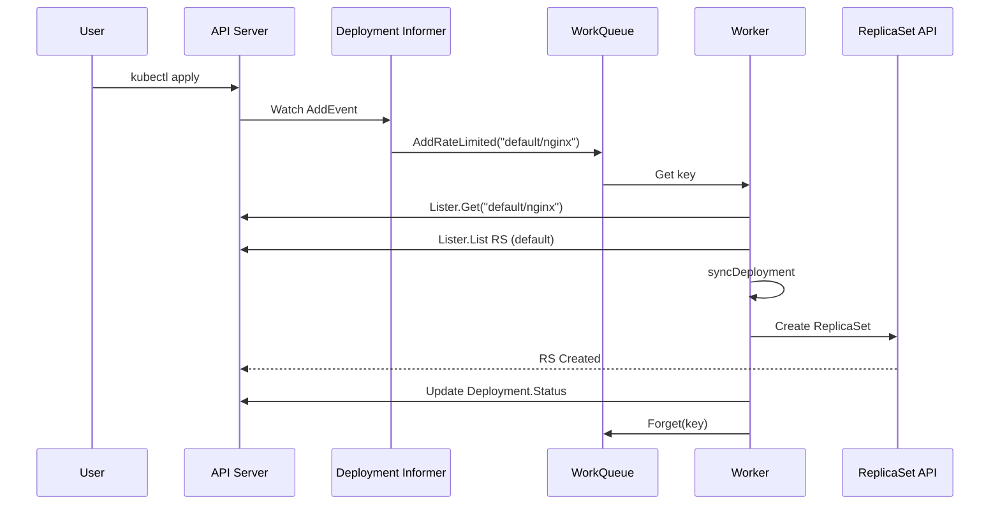

> **生产环境安全提示**
>
> 本文档包含可直接执行的运维命令。执行前请确认：当前目标集群与 Namespace 是否正确；是否具备足够的 RBAC 权限；是否已在非生产环境验证。命令风险等级标注：🔴 高风险（可能造成数据丢失或服务中断）、🟡 中风险（会修改集群状态，但通常可回滚）、🟢 低风险/只读（信息收集，无副作用）。


title: Deployment 控制器架构总览
category: deployment
tags:
- deployment
- controller
- architecture
- informer
- workqueue
- replicaset
- reconciliation
last_updated: 2026-05-18
description: 深入分析 Kubernetes Deployment 控制器的整体架构，涵盖 Informer 注册、事件处理、Worker 处理循环、OwnerReference
  机制以及与 ReplicaSet 的分层管理关系。
difficulty: advanced
intent_queries:
- kubernetes deployment controller architecture overview
- deployment informer workqueue loop
- kubernetes controller pattern deployment
- deployment replicaset ownerreference
- deployment controller initialization kubernetes
trigger_keywords:
- DeploymentController
- NewDeploymentController
- addDeployment
- enqueueDeployment
- processNextWorkItem
- Worker Loop
- Informer
- Lister
- OwnerReference
- LabelSelector
reading_level: advanced
audience:
- platform-engineer
- kubernetes-developer
- sre
estimated_read_time: 5min
related_domains:
- 工作负载
- 集群基础
related_topics:
- deployment-controller
- replicaset-controller
- rolling-update
domain_link: '[Workloads](../工作负载/README.md)'
topic_link: '[Deployment Create](./README.md)'
authors:
- name: KUDIG Team
  role: contributor
k8s_versions:
- '1.28'
- '1.29'
- '1.30'
- '1.31'
- '1.32'
---

# Deployment 控制器架构总览

## 函数签名

```go
func NewDeploymentController(
    dInformer appsinformers.DeploymentInformer,
    rsInformer appsinformers.ReplicaSetInformer,
    podInformer coreinformers.PodInformer,
    client clientset.Interface,
) (*DeploymentController, error)

func (dc *DeploymentController) Run(workers int, stopCh <-chan struct{})

func (dc *DeploymentController) addDeployment(obj interface{})
func (dc *DeploymentController) updateDeployment(oldObj, newObj interface{})
func (dc *DeploymentController) deleteDeployment(obj interface{})
func (dc *DeploymentController) enqueueDeployment(deployment *apps.Deployment)

func startDeploymentController(ctx ControllerContext) (http.Handler, bool, error)
```

## 源码位置

| 组件 | 源码路径 | 说明 |
|------|---------|------|
| 控制器入口 | `pkg/controller/deployment/deployment_controller.go` | NewDeploymentController、Run、事件处理 |
| 同步逻辑 | `pkg/controller/deployment/sync.go` | syncDeployment 主协调函数 |
| ReplicaSet 控制器 | `pkg/controller/replicaset/replica_set.go` | RS 核心逻辑、Pod 副本管理 |
| 工具函数 | `pkg/controller/deployment/util/` | RS 查找、hash 计算、状态比较 |
| 启动注册 | `cmd/kube-controller-manager/app/apps.go` | startDeploymentController |
| 滚动更新 | `pkg/controller/deployment/rolling.go` | RollingUpdate 策略 |
| Recreate | `pkg/controller/deployment/recreate.go` | Recreate 策略 |
| 进度追踪 | `pkg/controller/deployment/progress.go` | Status 计算 |

## 参数说明

### NewDeploymentController 参数

| 参数名 | 类型 | 说明 |
|--------|------|------|
| `dInformer` | `appsinformers.DeploymentInformer` | Deployment Informer，提供 Lister 和事件注册 |
| `rsInformer` | `appsinformers.ReplicaSetInformer` | ReplicaSet Informer，监听 RS 变更 |
| `podInformer` | `coreinformers.PodInformer` | Pod Informer，监听 Pod 删除事件 |
| `client` | `clientset.Interface` | Kubernetes API 客户端 |

### DeploymentController 内部字段

| 字段 | 类型 | 说明 |
|------|------|------|
| `dLister` | `appslisters.DeploymentLister` | Deployment 本地缓存 Lister |
| `rsLister` | `appslisters.ReplicaSetLister` | ReplicaSet 本地缓存 Lister |
| `podLister` | `corelisters.PodLister` | Pod 本地缓存 Lister |
| `queue` | `workqueue.RateLimitingInterface` | 限速工作队列 |
| `syncHandler` | `func(ctx context.Context, key string) error` | 同步处理函数（指向 syncDeployment） |
| `recorder` | `record.EventRecorder` | 事件记录器 |

### 启动参数

| 参数 | 默认值 | 说明 |
|------|--------|------|
| `--deployment-controller-sync-workers` | 5 | Worker goroutine 数量 |
| `--replicaset-controller-sync-workers` | 5 | RS Controller Worker 数量 |

## 返回值

| 函数 | 返回值 | 说明 |
|------|--------|------|
| `NewDeploymentController` | `(*DeploymentController, error)` | 控制器实例 |
| `Run` | 无 | 阻塞运行直到 stopCh 关闭 |
| `startDeploymentController` | `(http.Handler, bool, error)` | 启动控制器，返回 debug handler |
| `enqueueDeployment` | 无 | 将 Deployment key 加入队列 |

## 调用链



## 源码分析

### 概述

Kubernetes Deployment 是最核心的工作负载控制器之一，它通过管理 ReplicaSet 来实现 Pod 的声明式更新。用户只需描述期望状态（镜像版本、副本数、更新策略），Deployment 控制器自动完成底层的创建、扩缩容、滚动替换和回滚操作。整个控制器遵循 Informer + WorkQueue + Reconcile Loop 的经典模式。

### 控制器链架构

> ⚠️ **🟡 中危变更** — 变更集群资源状态，建议先 --dry-run 或 diff 确认
> - `kubectl apply/create/replace`：创建/变更集群资源

```
# 🟡 中风险：会修改集群/资源状态，执行前请确认目标、影响范围与授权
┌─────────────────────────────────────────────────────────────────────┐
│                    Deployment 控制器链                                │
├─────────────────────────────────────────────────────────────────────┤
│                                                                      │
│  用户操作                                                            │
│  ├── kubectl apply -f deployment.yaml                               │
│  ├── kubectl set image deployment/xxx                               │
│  └── kubectl scale deployment/xxx --replicas=5                      │
│         │                                                            │
│         ▼                                                            │
│  ┌──────────────┐                                                   │
│  │  API Server  │  ← 写入 etcd，触发 Watch 事件                     │
│  └──────────────┘                                                   │
│         │                                                            │
│         ▼                                                            │
│  ┌─────────────────────────────────────────────────────────────┐   │
│  │              Deployment Controller                           │   │
│  │  1. Informer List/Watch 监听 Deployment 变更                 │   │
│  │  2. 变更事件 → RateLimiter → WorkQueue                      │   │
│  │  3. Worker 出队 → syncDeployment()                          │   │
│  │  4. 计算期望 ReplicaSet 状态                                  │   │
│  │  5. 创建/更新 ReplicaSet 对象                                 │   │
│  │  6. 更新 Deployment Status                                    │   │
│  └─────────────────────────────────────────────────────────────┘   │
│         │                                                            │
│         ▼                                                            │
│  ┌─────────────────────────────────────────────────────────────┐   │
│  │              ReplicaSet Controller                           │   │
│  │  1. 监听 ReplicaSet 变更                                      │   │
│  │  2. 计算期望 Pod 数量 = Replicas                             │   │
│  │  3. 创建缺失 Pod / 删除多余 Pod                               │   │
│  └─────────────────────────────────────────────────────────────┘   │
│         │                                                            │
│         ▼                                                            │
│  kubelet + 调度器 → Pod 运行在节点上                                │
└─────────────────────────────────────────────────────────────────────┘
```
### 控制器启动源码

```go
// cmd/kube-controller-manager/app/apps.go
func startDeploymentController(ctx ControllerContext) (http.Handler, bool, error) {
    if !ctx.ComponentConfig.DeploymentController.ConcurrentDeploymentSyncs > 0 {
        return nil, false, nil
    }

    client := ctx.ClientBuilder.ClientOrDie("deployment-controller")
    dc, err := deployment.NewDeploymentController(
        ctx.InformerFactory.Apps().V1().Deployments(),
        ctx.InformerFactory.Apps().V1().ReplicaSets(),
        ctx.InformerFactory.Core().V1().Pods(),
        client,
    )
    if err != nil {
        return nil, true, err
    }

    go dc.Run(ctx.ComponentConfig.DeploymentController.ConcurrentDeploymentSyncs, ctx.Stop)

    return nil, true, nil
}
```

### Informer 注册源码

```go
// pkg/controller/deployment/deployment_controller.go
func NewDeploymentController(
    dInformer appsinformers.DeploymentInformer,
    rsInformer appsinformers.ReplicaSetInformer,
    podInformer coreinformers.PodInformer,
    client clientset.Interface,
) (*DeploymentController, error) {
    dc := &DeploymentController{
        client:           client,
        eventBroadcaster: record.NewBroadcaster(),
    }

    dc.eventBroadcaster.StartLogging(klog.Infof)
    dc.eventBroadcaster.StartRecordingToSink(&coreclient.EventSinkImpl{
        Interface: client.CoreV1().Events(""),
    })
    dc.recorder = dc.eventBroadcaster.NewRecorder(scheme.Scheme, v1.EventSource{
        Component: "deployment-controller",
    })

    dc.dLister = dInformer.Lister()
    dc.rsLister = rsInformer.Lister()
    dc.podLister = podInformer.Lister()

    dc.dListerSynced = dInformer.Informer().HasSynced
    dc.rsListerSynced = rsInformer.Informer().HasSynced
    dc.podListerSynced = podInformer.Informer().HasSynced

    dInformer.Informer().AddEventHandler(cache.ResourceEventHandlerFuncs{
        AddFunc:    dc.addDeployment,
        UpdateFunc: dc.updateDeployment,
        DeleteFunc: dc.deleteDeployment,
    })

    rsInformer.Informer().AddEventHandler(cache.ResourceEventHandlerFuncs{
        AddFunc:    dc.addReplicaSet,
        UpdateFunc: dc.updateReplicaSet,
        DeleteFunc: dc.deleteReplicaSet,
    })

    podInformer.Informer().AddEventHandler(cache.ResourceEventHandlerFuncs{
        DeleteFunc: dc.deletePod,
    })

    dc.queue = workqueue.NewNamedRateLimitingQueue(
        workqueue.NewControllerRateLimiter(),
        "deployment",
    )
    dc.syncHandler = dc.syncDeployment

    return dc, nil
}
```

### 事件处理与入队

```go
func (dc *DeploymentController) addDeployment(obj interface{}) {
    d := obj.(*apps.Deployment)
    klog.V(4).Infof("Adding deployment %s/%s", d.Namespace, d.Name)
    dc.enqueueDeployment(d)
}

func (dc *DeploymentController) updateDeployment(oldObj, newObj interface{}) {
    oldD := oldObj.(*apps.Deployment)
    newD := newObj.(*apps.Deployment)

    if oldD.ResourceVersion == newD.ResourceVersion {
        return
    }

    klog.V(4).Infof("Updating deployment %s/%s", newD.Namespace, newD.Name)
    dc.enqueueDeployment(newD)
}

func (dc *DeploymentController) deleteDeployment(obj interface{}) {
    d, ok := obj.(*apps.Deployment)
    if !ok {
        tombstone, ok := obj.(cache.DeletedFinalStateUnknown)
        if !ok {
            utilruntime.HandleError(fmt.Errorf("couldn't get object from tombstone"))
            return
        }
        d, ok = tombstone.Obj.(*apps.Deployment)
        if !ok {
            utilruntime.HandleError(fmt.Errorf("tombstone contained object not a Deployment"))
            return
        }
    }
    klog.V(4).Infof("Deleting deployment %s/%s", d.Namespace, d.Name)
    dc.enqueueDeployment(d)
}

func (dc *DeploymentController) enqueueDeployment(deployment *apps.Deployment) {
    key, err := controller.KeyFunc(deployment)
    if err != nil {
        utilruntime.HandleError(fmt.Errorf("couldn't get key for %#v: %v", deployment, err))
        return
    }
    dc.queue.AddRateLimited(key)
}
```

**关键设计**：
- 队列存储 `namespace/name` 格式的 key，不存储对象本身
- Worker 取出 key 后从 Lister 获取最新对象（避免使用过时数据）
- `AddRateLimited` 提供指数退避重试机制
- `ResourceVersion` 相同时跳过（减少不必要的同步）

### Worker 处理循环

```go
func (dc *DeploymentController) Run(workers int, stopCh <-chan struct{}) {
    defer utilruntime.HandleCrash()
    defer dc.queue.ShutDown()

    klog.Infof("Starting deployment controller")
    defer klog.Infof("Shutting down deployment controller")

    if !cache.WaitForNamedCacheSync("deployment", stopCh,
        dc.dListerSynced, dc.rsListerSynced, dc.podListerSynced) {
        return
    }

    for i := 0; i < workers; i++ {
        go wait.Until(dc.worker, time.Second, stopCh)
    }

    <-stopCh
}

func (dc *DeploymentController) worker() {
    for dc.processNextWorkItem() {
    }
}

func (dc *DeploymentController) processNextWorkItem() bool {
    key, quit := dc.queue.Get()
    if quit {
        return false
    }
    defer dc.queue.Done(key)

    err := dc.syncHandler(context.TODO(), key.(string))
    if err == nil {
        dc.queue.Forget(key)
        return true
    }

    utilruntime.HandleError(fmt.Errorf("sync %q failed with %v", key, err))
    dc.queue.AddRateLimited(key)
    return true
}
```

### Deployment 与 ReplicaSet 的关系

```
Deployment (用户直接操作)
    │
    ├── ReplicaSet-v1 (当前版本, replicas=5)
    │       ├── Pod-1
    │       ├── Pod-2
    │       ├── Pod-3
    │       ├── Pod-4
    │       └── Pod-5
    │
    └── ReplicaSet-v2 (旧版本, replicas=0)  ← 保留用于回滚
```

**分层原因**：
1. **解耦声明与实现**：用户声明 Deployment，控制器负责拆解为 ReplicaSet
2. **支持滚动更新**：同时存在多个 ReplicaSet，逐步迁移流量
3. **支持回滚**：保留历史 ReplicaSet，可快速切换版本
4. **状态追踪**：通过 ReplicaSet 的 PodTemplateHash 区分版本

## 执行流程



## 使用场景

1. **无状态应用部署**：Web 服务、API 服务、微服务
2. **滚动更新**：零停机镜像版本升级
3. **金丝雀发布**：配合 pause/resume 实现
4. **快速回滚**：一键回滚到历史版本
5. **水平扩缩容**：修改 replicas 字段

## 配置示例

```yaml
apiVersion: apps/v1
kind: Deployment
metadata:
  name: web-frontend
  namespace: production
  labels:
    app: web-frontend
    team: platform
spec:
  replicas: 5
  revisionHistoryLimit: 10
  progressDeadlineSeconds: 600
  minReadySeconds: 10
  strategy:
    type: RollingUpdate
    rollingUpdate:
      maxSurge: 2
      maxUnavailable: 1
  selector:
    matchLabels:
      app: web-frontend
  template:
    metadata:
      labels:
        app: web-frontend
        version: v2.1.0
    spec:
      containers:
      - name: web
        image: registry.example.com/web-frontend:v2.1.0
        ports:
        - containerPort: 8080
          protocol: TCP
        env:
        - name: LOG_LEVEL
          value: "info"
        resources:
          requests:
            cpu: 200m
            memory: 256Mi
          limits:
            cpu: "1"
            memory: 512Mi
        readinessProbe:
          httpGet:
            path: /healthz
            port: 8080
          initialDelaySeconds: 5
          periodSeconds: 5
          failureThreshold: 3
        livenessProbe:
          httpGet:
            path: /healthz
            port: 8080
          initialDelaySeconds: 15
          periodSeconds: 10
          failureThreshold: 3
      terminationGracePeriodSeconds: 30
```

## 实战示例

### 创建 Deployment 并观察 Informer 事件

> ⚠️ **🟡 中危变更** — 变更集群资源状态，建议先 --dry-run 或 diff 确认
> - `kubectl apply/create/replace`：创建/变更集群资源

``` bash
# 🟡 中风险：会修改集群/资源状态，执行前请确认目标、影响范围与授权
# 创建
kubectl apply -f deployment.yaml
# deployment.apps/web-frontend created

# 查看 RS 创建
kubectl get rs -l app=web-frontend -w
# NAME                          DESIRED   CURRENT   READY   AGE
# web-frontend-7b9d6c8f5d       5         0         0       0s
# web-frontend-7b9d6c8f5d       5         0         0       0s
# web-frontend-7b9d6c8f5d       5         0         0       0s
# web-frontend-7b9d6c8f5d       5         1         0       1s
# web-frontend-7b9d6c8f5d       5         2         0       1s
# web-frontend-7b9d6c8f5d       5         3         1       3s
# web-frontend-7b9d6c8f5d       5         4         2       4s
# web-frontend-7b9d6c8f5d       5         5         3       5s
# web-frontend-7b9d6c8f5d       5         5         5       7s

# 查看事件
kubectl describe deployment web-frontend
# Events:
#   Type    Reason             Age   From                   Message
#   Normal  NewReplicaSetCreated  7s  deployment-controller  Created new replica set web-frontend-7b9d6c8f5d
#   Normal  ScalingReplicaSet    7s   deployment-controller  Scaled up replica set web-frontend-7b9d6c8f5d to 5
```
### 滚动更新过程

``` bash
# 🟡 中风险：会修改集群/资源状态，执行前请确认目标、影响范围与授权
kubectl set image deployment/web-frontend web=registry.example.com/web-frontend:v2.2.0
# deployment.apps/web-frontend image updated

kubectl get pods -l app=web-frontend -w
# NAME                            READY   STATUS    RESTARTS   AGE
# web-frontend-7b9d6c8f5d-abcde   1/1     Running   0          5m
# web-frontend-7b9d6c8f5d-fghij   1/1     Running   0          5m
# web-frontend-7b9d6c8f5d-klmno   1/1     Running   0          5m
# web-frontend-7b9d6c8f5d-pqrst   1/1     Running   0          5m
# web-frontend-7b9d6c8f5d-uvwxy   1/1     Running   0          5m
# web-frontend-8c0e7d9g6e-12345   0/1     Pending   0          0s  ← 新 Pod
# web-frontend-8c0e7d9g6e-12345   0/1     ContainerCreating   0  0s
# web-frontend-7b9d6c8f5d-abcde   1/1     Terminating         0  5m  ← 旧 Pod 退出
# web-frontend-8c0e7d9g6e-12345   1/1     Running             0  3s
```
## 常见错误

| 错误 | 现象 | 原因 | 解决方案 |
|------|------|------|----------|
| Informer 缓存未同步 | 控制器启动后不处理事件 | WaitForCacheSync 未完成 | 检查 API Server 连通性 |
| WorkQueue 积压 | Deployment 更新延迟 | workers 数量不足或处理慢 | 增加 `--deployment-controller-sync-workers` |
| RateLimiter 过度限速 | 更新后长时间不处理 | 之前多次 syncDeployment 失败 | 查看日志定位 sync 错误根因 |
| RS 事件未触发 Deployment | 修改 RS 后 Deployment 不更新 | RS 的 OwnerReference 缺失 | 检查 RS 的 ownerReferences 字段 |
| Pod 删除未触发 | Pod 被杀但 Deployment 状态不变 | Pod label 不匹配 RS selector | 检查 Pod 的 pod-template-hash label |

## 相关函数

- [`syncDeployment`](02-deployment-controller.md) — 主协调函数
- [`rolloutRolling`](04-rolling-update.md) — RollingUpdate 策略
- [`rolloutRecreate`](README.md) — Recreate 策略
- [`calculateStatus`](05-deployment-status.md) — Status 计算
- [`rollbackToRevision`](06-revision-history.md) — 版本回滚

## Related

- [[reference|#reference Hub]] — tag hub

- [[deep-dive|#deep-dive Hub]] — tag hub

- [[README|README]]
- [[系统基础/速查卡/go.md|go]]
- [[系统基础/速查卡/k8s.md|k8s]]
- [[概念/deployment-controller-architecture.md|deployment-controller-architecture]]
- [[实体/kubernetes.md|kubernetes]]


<!-- risk-assessed -->
