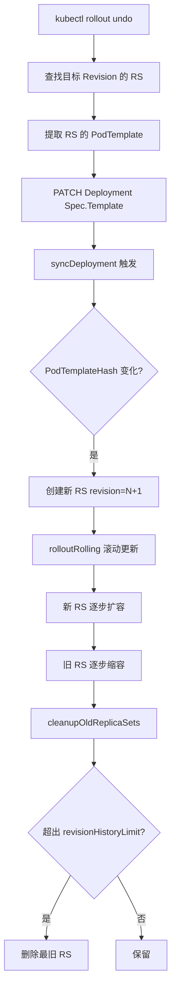
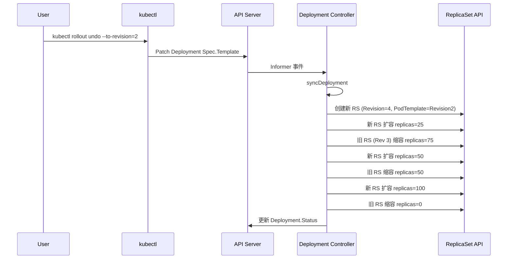

> **生产环境安全提示**
>
> 本文档包含可直接执行的运维命令。执行前请确认：当前目标集群与 Namespace 是否正确；是否具备足够的 RBAC 权限；是否已在非生产环境验证。命令风险等级标注：🔴 高风险（可能造成数据丢失或服务中断）、🟡 中风险（会修改集群状态，但通常可回滚）、🟢 低风险/只读（信息收集，无副作用）。


title: 版本历史与回滚机制
category: deployment
tags:
- deployment
- rollback
- revision
- replicaSet
- rollout
last_updated: 2026-05-18
description: 深入分析 Kubernetes Deployment 的版本历史管理机制和回滚实现，包括 revision annotation、rollbackToRevision
  源码、revisionHistoryLimit 清理策略以及比例回滚算法。
difficulty: intermediate
intent_queries:
- kubernetes deployment rollback source code
- deployment.kubernetes.io/revision annotation
- kubectl rollout undo how it works
- revisionHistoryLimit cleanup strategy kubernetes
- deployment rollback proportion scaling algorithm
trigger_keywords:
- rollout undo
- rollback revision
- revision history
- PodTemplateHash
- rollbackToRevision
- cleanupOldReplicaSets
- 比例回滚
- revision annotation
- kubectl rollout history
- --to-revision
reading_level: intermediate
audience:
- platform-engineer
- devops-engineer
- sre
- kubernetes-developer
estimated_read_time: 5min
related_domains:
- 工作负载
- 集群基础
related_topics:
- deployment-create
- rolling-update
- deployment-status
- replicaset-controller
domain_link: '[Control Plane](../集群基础/README.md)'
topic_link: '[Workloads](../工作负载/README.md)'
authors:
- name: KUDIG Team
  role: contributor
k8s_versions:
- '1.28'
- '1.29'
- '1.30'
- '1.31'
- '1.32'
---

# 版本历史与回滚机制

## 函数签名

```go
func SetNewReplicaSetAnnotations(deployment *apps.Deployment, newRS *apps.ReplicaSet, newRevision int64) error
func GetRevision(obj metav1.Object) int64
func FindNewReplicaSet(deployment *apps.Deployment, rsList []*apps.ReplicaSet) *apps.ReplicaSet
func (dc *DeploymentController) rollbackToRevision(ctx context.Context, deployment *apps.Deployment, rsList []*apps.ReplicaSet, toRevision int64) (*apps.Deployment, error)
func (dc *DeploymentController) cleanupOldReplicaSets(ctx context.Context, oldRSs []*apps.ReplicaSet, deployment *apps.Deployment) ([]*apps.ReplicaSet, error)
func SortReplicaSetsByRevision(rsList []*apps.ReplicaSet)

```

## 源码位置

| 组件 | 源码路径 | 说明 |
|------|---------|------|
| 回滚逻辑 | `pkg/controller/deployment/rollback.go` | rollbackToRevision |
| 版本管理 | `pkg/controller/deployment/util/deployment_util.go` | Revision/Hash/Annotation |
| 清理逻辑 | `pkg/controller/deployment/sync.go` | cleanupOldReplicaSets |
| kubectl undo | `pkg/kubectl/cmd/rollout/rollout_undo.go` | kubectl rollout undo |
| 滚动更新 | `pkg/controller/deployment/rolling.go` | rolloutRolling |
| 工具函数 | `pkg/controller/deployment/util/revision.go` | Revision 工具 |

## 参数说明

### Revision Annotation

| Annotation Key | 对象 | 说明 |
|---------------|------|------|
| `deployment.kubernetes.io/revision` | Deployment/RS | 版本号 |
| `deployment.kubernetes.io/desired-replicas` | RS | 创建时期望副本数 |
| `deployment.kubernetes.io/max-replicas` | RS | 创建时最大副本数 |
| `kubernetes.io/change-cause` | Deployment | 变更原因 |

### DeploymentSpec 回滚相关字段

| 字段 | 类型 | 默认值 | 说明 |
|------|------|--------|------|
| `revisionHistoryLimit` | `*int32` | 10 | 保留历史 RS 数量 |
| `paused` | `bool` | false | 暂停发布 |
| `progressDeadlineSeconds` | `*int32` | 600 | 进度超时 |

## 返回值

| 函数 | 返回值 | 说明 |
|------|--------|------|
| `GetRevision` | `int64` | 版本号，默认 0 |
| `FindNewReplicaSet` | `*apps.ReplicaSet` | 当前版本 RS |
| `rollbackToRevision` | `(*apps.Deployment, error)` | 回滚后 Deployment |
| `cleanupOldReplicaSets` | `([]*apps.ReplicaSet, error)` | 清理后保留的 RS |

## 调用链



## 源码分析

### 概述

Deployment 通过维护多个 ReplicaSet 来实现版本历史记录和一键回滚。每次修改 `PodTemplate` 都会创建一个新的 ReplicaSet，旧版本按 `revisionHistoryLimit` 保留。回滚不是直接切换 RS，而是将旧版本 PodTemplate 写回 Deployment 触发一次"向旧版本更新"。

### Revision 标识机制

```go
// pkg/controller/deployment/util/deployment_util.go
const (
    RevisionAnnotation        = "deployment.kubernetes.io/revision"
    DesiredReplicasAnnotation = "deployment.kubernetes.io/desired-replicas"
    MaxReplicasAnnotation     = "deployment.kubernetes.io/max-replicas"
)

func GetRevision(obj metav1.Object) int64 {
    v, ok := obj.GetAnnotations()[RevisionAnnotation]
    if !ok {
        return 0
    }
    revision, err := strconv.ParseInt(v, 10, 64)
    if err != nil {
        return 0
    }
    return revision
}

func SetNewReplicaSetAnnotations(deployment *apps.Deployment, newRS *apps.ReplicaSet, newRevision int64) error {
    alreadySet := false
    if newRS.Annotations == nil {
        newRS.Annotations = make(map[string]string)
    } else {
        _, alreadySet = newRS.Annotations[RevisionAnnotation]
    }

    if !alreadySet {
        newRS.Annotations[RevisionAnnotation] = strconv.FormatInt(newRevision, 10)
    }

    newRS.Annotations[DesiredReplicasAnnotation] = strconv.Itoa(int(*deployment.Spec.Replicas))
    newRS.Annotations[MaxReplicasAnnotation] = strconv.Itoa(int(GetMaxReplicas(deployment)))

    return nil
}
```

**Deployment 上的 Annotation**：
```yaml
metadata:
  annotations:
    deployment.kubernetes.io/revision: "3"
spec:
  revisionHistoryLimit: 10
```

**ReplicaSet 上的 Annotation**：
```yaml
metadata:
  annotations:
    deployment.kubernetes.io/revision: "2"
    deployment.kubernetes.io/desired-replicas: "5"
    deployment.kubernetes.io/max-replicas: "7"
  labels:
    pod-template-hash: "7c4c8d5d4f"
```

### 回滚源码分析

```go
// pkg/controller/deployment/rollback.go
func (dc *DeploymentController) rollbackToRevision(ctx context.Context, deployment *apps.Deployment, rsList []*apps.ReplicaSet, toRevision int64) (*apps.Deployment, error) {
    if toRevision == 0 {
        return deployment, nil
    }

    var targetRS *apps.ReplicaSet
    for _, rs := range rsList {
        if GetRevision(rs) == toRevision {
            targetRS = rs
            break
        }
    }

    if targetRS == nil {
        return nil, fmt.Errorf("unable to find specified revision %v in history", toRevision)
    }

    // 将目标 RS 的 PodTemplate 回写到 Deployment
    restoredDeployment := deployment.DeepCopy()
    restoredDeployment.Spec.Template = targetRS.Spec.Template

    // 计算回滚后的副本数
    if *targetRS.Spec.Replicas > 0 {
        *restoredDeployment.Spec.Replicas = *targetRS.Spec.Replicas
    }

    return dc.client.AppsV1().Deployments(restoredDeployment.Namespace).Update(ctx, restoredDeployment, metav1.UpdateOptions{})
}
```

**关键**：回滚不是直接切换 ReplicaSet，而是将旧版本的 PodTemplate 写回 Deployment Spec，触发正常的滚动更新流程。

### revisionHistoryLimit 清理逻辑

```go
// pkg/controller/deployment/sync.go
func (dc *DeploymentController) cleanupOldReplicaSets(ctx context.Context, oldRSs []*apps.ReplicaSet, deployment *apps.Deployment) ([]*apps.ReplicaSet, error) {
    revisionHistoryLimit := int32(10)
    if deployment.Spec.RevisionHistoryLimit != nil {
        revisionHistoryLimit = *deployment.Spec.RevisionHistoryLimit
    }

    if revisionHistoryLimit == 0 {
        for _, rs := range oldRSs {
            if err := dc.client.AppsV1().ReplicaSets(rs.Namespace).Delete(ctx, rs.Name, metav1.DeleteOptions{}); err != nil {
                return nil, err
            }
        }
        return nil, nil
    }

    SortReplicaSetsByRevision(oldRSs)

    i := 0
    for i < len(oldRSs)-int(revisionHistoryLimit) {
        if oldRSs[i].Status.Replicas != 0 || oldRSs[i].Spec.Replicas != nil && *oldRSs[i].Spec.Replicas != 0 {
            break
        }
        dc.client.AppsV1().ReplicaSets(oldRSs[i].Namespace).Delete(ctx, oldRSs[i].Name, metav1.DeleteOptions{})
        i++
    }

    return oldRSs[i:], nil
}
```

### 回滚后的 Revision 号

```
初始:
  Revision 1: nginx:1.19
  Revision 2: nginx:1.20
  Revision 3: nginx:1.21  ← 当前

回滚到 Revision 2:
  Revision 1: nginx:1.19
  Revision 2: nginx:1.20
  Revision 3: nginx:1.21
  Revision 4: nginx:1.20  ← 回滚创建的新 RS
```

回滚不复用旧 RS，而是创建新 RS（PodTemplate 相同但 Revision 递增）。

### 比例回滚

当 Deployment 规模很大时，回滚也遵循 `maxSurge`/`maxUnavailable` 约束：

```
当前: Revision 3 = nginx:1.21 (replicas=100)
回滚到: Revision 2 = nginx:1.20

Step 1: Revision 4 RS (PodTemplate=1.20), replicas=25
Step 2: Revision 4 RS: replicas=50, Revision 3 RS: replicas=75
Step 3: Revision 4 RS: replicas=75, Revision 3 RS: replicas=50
Step 4: Revision 4 RS: replicas=100, Revision 3 RS: replicas=0
```

### 回滚场景：镜像拉取失败回滚

> ⚠️ **🟡 中危变更** — 变更集群资源状态，建议先 --dry-run 或 diff 确认
> - `kubectl rollout undo/restart`：触发滚动变更，影响副本

``` bash
# 🟡 中风险：会修改集群/资源状态，执行前请确认目标、影响范围与授权
# 场景：更新后镜像拉取失败
kubectl set image deployment/nginx nginx=nginx:1.99
# deployment.apps/nginx image updated

# 查看状态
kubectl rollout status deployment/nginx
# error: failed to pull image nginx:1.99: repository not found

# 快速回滚
kubectl rollout undo deployment/nginx
# deployment.apps/nginx rolled back

# 或指定版本回滚
kubectl rollout undo deployment/nginx --to-revision=3
```
### 回滚场景：配置错误回滚

```yaml
# deployment.yaml - 错误的配置导致 Pod 无法启动
spec:
  template:
    spec:
      containers:
      - name: nginx
        image: nginx:1.25
        env:
        - name: DATABASE_URL
          value: "postgresql://invalid-host:5432/db"  # 错误配置
```

> ⚠️ **🟡 中危变更** — 变更集群资源状态，建议先 --dry-run 或 diff 确认
> - `kubectl rollout undo/restart`：触发滚动变更，影响副本

``` bash
# 🟢 低风险：只读/信息收集，通常无副作用
# 检测到问题后回滚
kubectl rollout undo deployment/nginx --to-revision=5

# 验证回滚成功
kubectl get deployment nginx -o jsonpath='{.spec.template.spec.containers[0].env}'
# 确认 DATABASE_URL 已恢复到正确值
```
### 回滚场景：金丝雀验证后回滚

> ⚠️ **🟡 中危变更** — 变更集群资源状态，建议先 --dry-run 或 diff 确认
> - `kubectl exec`：进入容器执行命令，可能改变容器状态
> - `kubectl rollout undo/restart`：触发滚动变更，影响副本

``` bash
# 🟡 中风险：会修改集群/资源状态，执行前请确认目标、影响范围与授权
# 场景：金丝雀发布验证失败需要回滚
kubectl set image deployment/api api=api:v2.0
kubectl rollout pause deployment/api

# 观察金丝雀 Pod
kubectl get pods -l app=api,version=v2.0

# 测试发现有问题
kubectl exec -it api-v2-xxx -- curl http://localhost:8080/health
# 返回: {"status": "error", "message": "database connection failed"}

# 回滚到稳定版本
kubectl rollout undo deployment/api

# 恢复金丝雀比例（如果有多个版本）
kubectl rollout resume deployment/api
```
## 执行流程



## 使用场景

1. **一键回滚**：`kubectl rollout undo` 快速恢复
2. **指定版本回滚**：`--to-revision=N` 回到特定版本
3. **金丝雀发布**：pause/resume 实现验证
4. **版本历史审计**：`kubectl rollout history` 查看所有变更
5. **历史版本限制**：`revisionHistoryLimit` 控制 RS 数量

## 配置示例

```yaml
apiVersion: apps/v1
kind: Deployment
metadata:
  name: nginx
  annotations:
    kubernetes.io/change-cause: "升级 nginx 到 1.25 修复 CVE-2024-XXXX"
spec:
  replicas: 5
  revisionHistoryLimit: 10
  progressDeadlineSeconds: 600
  strategy:
    type: RollingUpdate
    rollingUpdate:
      maxSurge: 2
      maxUnavailable: 1
  selector:
    matchLabels:
      app: nginx
  template:
    metadata:
      labels:
        app: nginx
    spec:
      containers:
      - name: nginx
        image: nginx:1.25
        ports:
        - containerPort: 80
```

## 实战示例

### 版本历史管理

> ⚠️ **🟡 中危变更** — 变更集群资源状态，建议先 --dry-run 或 diff 确认
> - `kubectl apply/create/replace`：创建/变更集群资源
> - `kubectl edit/patch`：修改运行中的资源
> - `kubectl label/annotate`：改元数据可能影响选择器/控制器
> - `kubectl rollout undo/restart`：触发滚动变更，影响副本

``` bash
# 🟡 中风险：会修改集群/资源状态，执行前请确认目标、影响范围与授权
# 查看版本历史
kubectl rollout history deployment/nginx
# deployment.apps/nginx
# REVISION  CHANGE-CAUSE
# 1         kubectl apply --filename=deployment.yaml --record=true
# 2         kubectl set image deployment/nginx nginx=nginx:1.20 --record=true
# 3         kubectl set image deployment/nginx nginx=nginx:1.21 --record=true

# 查看特定版本详情
kubectl rollout history deployment/nginx --revision=2
# deployment.apps/nginx with revision #2
# Pod Template:
#   Containers:
#    nginx:
#     Image: nginx:1.20

# 回滚到上一版本
kubectl rollout undo deployment/nginx
# deployment.apps/nginx rolled back

# 回滚到指定版本
kubectl rollout undo deployment/nginx --to-revision=1
# deployment.apps/nginx rolled back

# 查看 RS 版本对应
kubectl get rs -l app=nginx
# NAME               DESIRED   CURRENT   READY   AGE
# nginx-6d8f5c7b4f   0         0         0       10m    # Rev 1
# nginx-7c4c8d5d4f   0         0         0       5m     # Rev 2
# nginx-8d5e9e6e5g   5         5         5       2m     # Rev 4 (回滚)

# 设置 change-cause
kubectl annotate deployment/nginx kubernetes.io/change-cause="回滚到 nginx:1.19 修复启动问题"

# 限制历史版本数
kubectl patch deployment nginx -p '{"spec":{"revisionHistoryLimit":5}}'
```
### 金丝雀发布

> ⚠️ **🟡 中危变更** — 变更集群资源状态，建议先 --dry-run 或 diff 确认
> - `kubectl exec`：进入容器执行命令，可能改变容器状态
> - `kubectl rollout undo/restart`：触发滚动变更，影响副本

``` bash
# 🟡 中风险：会修改集群/资源状态，执行前请确认目标、影响范围与授权
# 1. 更新镜像
kubectl set image deployment/nginx nginx=nginx:2.0

# 2. 立即暂停
kubectl rollout pause deployment/nginx

# 3. 此时只有少量新 Pod
kubectl get pods -l app=nginx
# NAME                     READY   STATUS    RESTARTS   AGE
# nginx-8d5e9e6e5g-abcde   1/1     Running   0          30s   ← 新版本
# nginx-7c4c8d5d4f-fghij   1/1     Running   0          5m    ← 旧版本
# nginx-7c4c8d5d4f-klmno   1/1     Running   0          5m
# nginx-7c4c8d5d4f-pqrst   1/1     Running   0          5m
# nginx-7c4c8d5d4f-uvwxy   1/1     Running   0          5m

# 4. 验证新版本
kubectl exec -it nginx-8d5e9e6e5g-abcde -- curl -s localhost/health

# 5. 验证通过后继续
kubectl rollout resume deployment/nginx

# 6. 或验证失败回滚
kubectl rollout undo deployment/nginx

```
## 常见错误

| 错误 | 现象 | 原因 | 解决方案 |
|------|------|------|----------|
| 目标版本不存在 | `unable to find specified revision X in history` | RS 已被 revisionHistoryLimit 清理 | 增大 revisionHistoryLimit |
| revisionHistoryLimit=0 无法回滚 | `no rollout history found` | 所有历史 RS 被删除 | 设置 revisionHistoryLimit > 0 |
| 回滚后 PodTemplate 未变 | RS 已存在相同 hash | 回滚到当前版本是无操作 | 确认目标 revision 不同 |
| change-cause 缺失 | `REVISION CHANGE-CAUSE <none>` | 未使用 `--record` | 使用 `kubectl annotate` 手动设置 |
| 回滚中断 | Deployment 显示 Progressing=False | 回滚过程中新 Pod 不健康 | 检查 readinessProbe 配置 |

## 相关函数

- [`syncDeployment`](02-deployment-controller.md) — 主协调函数驱动回滚
- [`rolloutRolling`](04-rolling-update.md) — 滚动更新策略实现
- [`getNewReplicaSet`](02-deployment-controller.md) — 查找当前版本 RS
- [`GetPodTemplateSpecHash`](02-deployment-controller.md) — 计算 PodTemplate hash
- [`cleanupOldReplicaSets`](02-deployment-controller.md) — 清理过期 RS

## Related

- [[reference|#reference Hub]] — tag hub

- [[README|README]]
- [[系统基础/速查卡/go.md|go]]
- [[系统基础/速查卡/k8s.md|k8s]]
- [[实体/kubernetes.md|kubernetes]]
- [[系统基础/知识字典/workloads/deployments.md|deployments]]

```

<!-- risk-assessed -->
