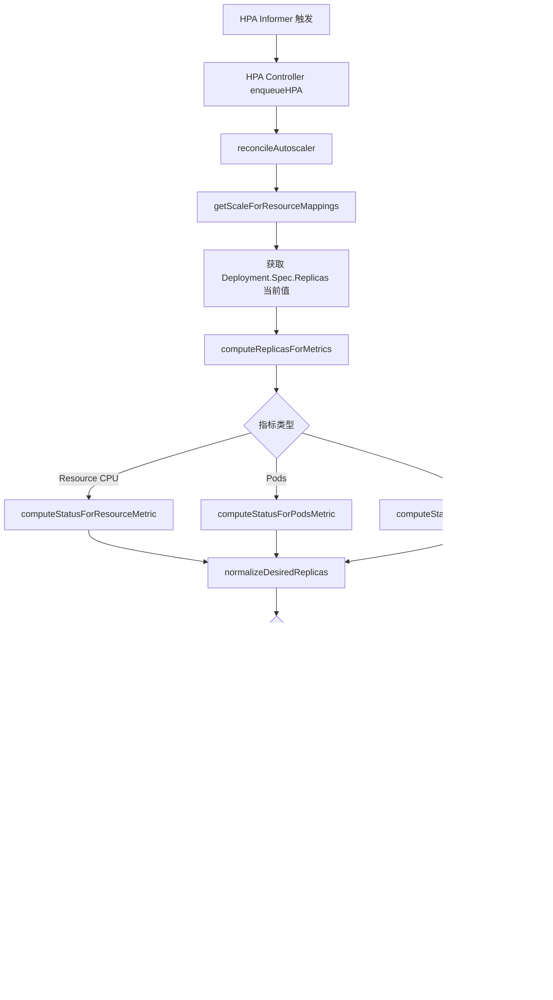

> **生产环境安全提示**
>
> 本文档包含可直接执行的运维命令。执行前请确认：当前目标集群与 Namespace 是否正确；是否具备足够的 RBAC 权限；是否已在非生产环境验证。命令风险等级标注：🔴 高风险（可能造成数据丢失或服务中断）、🟡 中风险（会修改集群状态，但通常可回滚）、🟢 低风险/只读（信息收集，无副作用）。


# Deployment 与 HPA 集成源码分析

## 函数签名

```go
// HPA 控制器核心函数
func (a *HorizontalController) reconcileAutoscaler(
    ctx context.Context,
    hpaSharedInformerFactory informers.SharedInformerFactory,
    hpa *autoscalingv2.HorizontalPodAutoscaler,
    key string,
) error

// Scale 子资源接口 — Deployment 实现
func (r *ScaleREST) Update(
    ctx context.Context,
    name string,
    objInfo rest.UpdatedObjectInfo,
    createValidation rest.ValidateObjectFunc,
    updateValidation rest.ValidateObjectUpdateFunc,
    forceAllowCreate bool,
    options *metav1.UpdateOptions,
) (runtime.Object, bool, error)
```

## 源码位置

| 组件 | 源码路径 | 说明 |
|------|---------|------|
| HPA 控制器 | `pkg/controller/util/horizontal/horizontal.go` | reconcileAutoscaler 主逻辑 |
| Scale 子资源 | `pkg/registry/apps/deployment/storage/storage.go` | Deployment Scale 接口 |
| 副本数计算 | `pkg/controller/util/horizontal/` | normalizeDesiredReplicas |
| 指标适配器 | `pkg/controller/util/horizontal/metrics/` | 多种指标源 |
| HPA 类型定义 | `staging/src/k8s.io/api/autoscaling/v2/types.go` | HPA API 结构 |

## 架构概述

```
┌────────────────────────────────────────────────────────────────────┐
│                     HPA ↔ Deployment 集成架构                       │
├────────────────────────────────────────────────────────────────────┤
│                                                                     │
│  ┌─────────────┐         ┌─────────────────────┐                  │
│  │ metrics-    │ ◄────── │  HPA Controller      │                  │
│  │ server/     │         │  - 采集当前指标       │                  │
│  │ prometheus  │         │  - 计算 desiredReps  │                  │
│  └─────────────┘         │  - 调用 Scale API    │                  │
│                           └──────────┬──────────┘                  │
│                                      │ /scale subresource           │
│                                      ▼                              │
│  ┌─────────────────────────────────────────────────┐               │
│  │              Deployment                          │               │
│  │  spec.replicas ← 被 HPA 写入                    │               │
│  │                                                  │               │
│  │  注意：Deployment Controller 独立协调 RS 副本    │               │
│  └─────────────────────────────────────────────────┘               │
│                                                                     │
│  关键约束：不要在 HPA 管理的 Deployment 中手动设置 replicas！        │
└────────────────────────────────────────────────────────────────────┘
```

## 参数说明

### HPA Spec 关键字段

| 字段 | 类型 | 说明 | 示例 |
|------|------|------|------|
| `scaleTargetRef` | `CrossVersionObjectReference` | 指向被管理的 Deployment | `kind: Deployment, name: web` |
| `minReplicas` | `*int32` | 最小副本数 | `2` |
| `maxReplicas` | `int32` | 最大副本数 | `20` |
| `metrics` | `[]MetricSpec` | 扩缩容指标列表 | CPU、内存、自定义指标 |
| `behavior` | `*HorizontalPodAutoscalerBehavior` | 扩缩容行为策略 | 稳定窗口、步长限制 |

### MetricSpec 类型

| 指标类型 | 说明 | 适用场景 |
|---------|------|---------|
| `Resource` | 标准资源（CPU/内存） | 通用负载 |
| `ContainerResource` | 容器级别资源 | 多容器 Pod |
| `External` | 外部指标（队列长度等） | 消息驱动 |
| `Object` | 集群对象指标 | Ingress RPS |
| `Pods` | Pod 自定义指标 | 应用业务指标 |

## 调用链



## 源码分析

### HPA 控制器核心协调逻辑

```go
// pkg/controller/util/horizontal/horizontal.go
func (a *HorizontalController) reconcileAutoscaler(
    ctx context.Context,
    hpaSharedInformerFactory informers.SharedInformerFactory,
    hpa *autoscalingv2.HorizontalPodAutoscaler,
    key string,
) error {
    // 1. 获取 Scale 子资源（包含当前 replicas）
    scale, targetGR, err := a.scaleForResourceMappings(ctx, hpa.Namespace, hpa.Spec.ScaleTargetRef.Name, mappings)
    if err != nil {
        return fmt.Errorf("failed to get scale subresource: %v", err)
    }
    currentReplicas := scale.Spec.Replicas

    // 2. 计算各指标期望副本数
    metricDesiredReplicas, metricName, metricStatuses, metricTimestamp, err :=
        a.computeReplicasForMetrics(ctx, hpa, scale, hpa.Spec.Metrics)

    // 3. 取所有指标中最大值（保守扩容策略）
    desiredReplicas := metricDesiredReplicas

    // 4. 应用 min/max 边界约束
    if desiredReplicas < *hpa.Spec.MinReplicas {
        desiredReplicas = *hpa.Spec.MinReplicas
    }
    if desiredReplicas > hpa.Spec.MaxReplicas {
        desiredReplicas = hpa.Spec.MaxReplicas
    }

    // 5. 应用稳定窗口（防止频繁抖动）
    desiredReplicas = a.stabilizeRecommendation(hpa, desiredReplicas)

    // 6. 应用 Behavior 策略（限制单次变更幅度）
    desiredReplicas, err = a.normalizeDesiredReplicasWithBehaviors(
        hpa, currentReplicas, minReplicas, desiredReplicas)

    // 7. 执行扩缩容
    if desiredReplicas != currentReplicas {
        scale.Spec.Replicas = desiredReplicas
        _, err = a.scaleNamespacer.Scales(hpa.Namespace).Update(ctx, targetGR, scale, metav1.UpdateOptions{})
        if err != nil {
            return fmt.Errorf("failed to rescale: %v", err)
        }
    }

    // 8. 更新 HPA.Status
    return a.updateStatus(ctx, hpa, currentReplicas, desiredReplicas, metricStatuses, ...)
}
```

### CPU 指标计算核心

```go
// computeStatusForResourceMetric 基于 CPU 利用率计算期望副本数
func (c *ReplicaCalculator) CalcScaleUpLimit(currentReplicas int32) int32 {
    return int32(math.Max(
        scaleUpLimitFactor*float64(currentReplicas),
        scaleUpLimitMinimum,
    ))
}

// 期望副本数 = ceil(currentReplicas * (currentUtilization / targetUtilization))
func (c *ReplicaCalculator) GetResourceReplicas(
    ctx context.Context,
    currentReplicas int32,
    targetUtilization int32,
    resource v1.ResourceName,
    namespace string,
    selector labels.Selector,
    container string,
) (replicaCount int32, utilization int32, rawUtilization int64, timestamp time.Time, err error) {
    // 从 metrics-server 获取当前所有 Pod 的 CPU 使用量
    metrics, timestamp, err := c.metricsClient.GetResourceMetric(ctx, resource, namespace, selector, container)

    // 计算有效 Pod 数（排除 unready/missing metrics 的 Pod）
    readyPodCount, unreadyPods, missingPods, ignoredPods := groupPods(podList, metrics, resource, ...)

    // 核心公式
    usageRatio := float64(metricsTotal) / float64(targetUtilization*int64(readyPodCount))
    replicaCount = int32(math.Ceil(usageRatio * float64(currentReplicas)))
    return replicaCount, currentUtilization, metricsTotal, timestamp, nil
}
```

### Behavior 扩缩容行为策略

```go
// normalizeDesiredReplicasWithBehaviors 应用 HPA Behavior 限制
func (a *HorizontalController) normalizeDesiredReplicasWithBehaviors(
    hpa *autoscalingv2.HorizontalPodAutoscaler,
    currentReplicas, minReplicas, desiredReplicas int32,
) (int32, error) {
    // 判断是扩容还是缩容
    if desiredReplicas > currentReplicas {
        // 扩容：受 scaleUp.policies 约束
        return a.convertDesiredReplicasWithBehaviorRate(
            currentReplicas, desiredReplicas, hpa.Spec.Behavior.ScaleUp)
    }
    // 缩容：受 scaleDown.policies 约束
    return a.convertDesiredReplicasWithBehaviorRate(
        currentReplicas, desiredReplicas, hpa.Spec.Behavior.ScaleDown)
}
```

## 执行流程

```
HPA 扩容触发时序（以 CPU 为例）：

T+0s  : metrics-server 采集节点 CPU 数据
T+15s : HPA Controller (每15s轮询一次) 读取 Pod CPU metrics
        currentReplicas = 5, CPU 利用率 = 85%
        targetUtilization = 50%
        desiredReplicas = ceil(5 * 85/50) = ceil(8.5) = 9
T+16s : 应用 behavior.scaleUp 策略检查（如 maxPods 限制）
        应用 stabilizationWindowSeconds 检查（防抖动）
T+17s : 调用 /scale API 更新 Deployment.Spec.Replicas = 9
T+18s : Deployment Controller 感知到 replicas 变更
        更新 ReplicaSet.Spec.Replicas = 9
T+25s : 4 个新 Pod 创建并就绪
T+60s : HPA 再次采集，CPU 利用率下降
```

## 使用场景

1. **Web 流量弹性伸缩**：基于 CPU/内存自动扩缩 API 服务
2. **消息队列消费**：基于队列积压长度扩缩消费者
3. **批处理任务**：基于任务数量动态调整 worker 数
4. **成本优化**：低峰期自动缩容降低资源成本

## 配置示例

### 基础 CPU HPA

```yaml
apiVersion: autoscaling/v2
kind: HorizontalPodAutoscaler
metadata:
  name: web-frontend-hpa
  namespace: production
spec:
  scaleTargetRef:
    apiVersion: apps/v1
    kind: Deployment
    name: web-frontend
  minReplicas: 3
  maxReplicas: 20
  metrics:
  - type: Resource
    resource:
      name: cpu
      target:
        type: Utilization
        averageUtilization: 60
```

### 多指标 HPA（CPU + 自定义）

```yaml
apiVersion: autoscaling/v2
kind: HorizontalPodAutoscaler
metadata:
  name: worker-hpa
spec:
  scaleTargetRef:
    apiVersion: apps/v1
    kind: Deployment
    name: worker
  minReplicas: 2
  maxReplicas: 50
  metrics:
  - type: Resource
    resource:
      name: cpu
      target:
        type: Utilization
        averageUtilization: 70
  - type: External
    external:
      metric:
        name: queue_messages_pending
        selector:
          matchLabels:
            queue: worker-queue
      target:
        type: AverageValue
        averageValue: "100"
  behavior:
    scaleUp:
      stabilizationWindowSeconds: 30
      policies:
      - type: Pods
        value: 4
        periodSeconds: 60
    scaleDown:
      stabilizationWindowSeconds: 300
      policies:
      - type: Percent
        value: 10
        periodSeconds: 60
```

## 实战示例

### 查看 HPA 状态

``` bash
# 🟢 低风险：只读/信息收集，通常无副作用
kubectl get hpa -n production
```
```
NAME               REFERENCE             TARGETS   MINPODS   MAXPODS   REPLICAS   AGE
web-frontend-hpa   Deployment/web-frontend   62%/60%   3         20        8          2h
```

### HPA 事件追踪

``` bash
# 🟢 低风险：只读/信息收集，通常无副作用
kubectl describe hpa web-frontend-hpa -n production
```
```
Events:
  Type    Reason             Age    From                       Message
  Normal  SuccessfulRescale  5m     horizontal-pod-autoscaler  New size: 8; reason: cpu resource utilization (percentage of request) above target
  Normal  SuccessfulRescale  45m    horizontal-pod-autoscaler  New size: 5; reason: All metrics below target
```

## 常见问题与陷阱

| 问题 | 原因 | 解决方案 |
|------|------|---------|
| HPA 无法获取指标 | metrics-server 未部署或未就绪 | 部署 `metrics-server`，确认 `kubectl top pods` 正常 |
| HPA 与手动 replicas 冲突 | 手动修改 Deployment.Spec.Replicas 被 HPA 覆盖 | 使用 HPA 管理时不要手动修改 replicas |
| 扩容速度过慢 | scaleUp.stabilizationWindowSeconds 过大 | 调整 behavior.scaleUp.stabilizationWindowSeconds |
| 缩容过于激进 | 未配置 scaleDown.stabilizationWindowSeconds | 设置合适的缩容稳定窗口（建议 ≥ 300s） |
| CPU 利用率始终为 unknown | Pod 未设置 resource.requests | 所有容器必须设置 requests.cpu |
| HPA 不触发扩容 | 指标值未超过目标 10% 阈值 | 检查真实负载，或调低 targetUtilization |

## 相关函数

- [`syncDeployment`](02-deployment-controller.md) — Deployment 主协调函数，接收 HPA 修改的 replicas
- [`scaleReplicaSetAndRecordEvent`](03-replicaset-controller.md) — RS 副本数调整实现
- [`calculateStatus`](05-deployment-status.md) — Deployment Status 字段更新

## 版本说明

- `autoscaling/v2` 自 v1.26 GA，推荐使用（v2beta2 已废弃）
- `containerResource` 指标类型自 v1.27 GA
- HPA behavior 配置自 v1.18 GA
- 基于 Kubernetes v1.28 – v1.32 源码分析

## Related

- [[entities/kubernetes.md|kubernetes]]
- [[系统基础/知识字典/workloads/replicaset.md|replicaset]]
- [[平台工程/代码分析/deployment-create/03-replicaset-controller.md|03-replicaset-controller]]
- [[平台工程/代码分析/deployment-create/05-deployment-status.md|05-deployment-status]]
- [[平台工程/代码分析/deployment-create/02-deployment-controller.md|02-deployment-controller]]


<!-- risk-assessed -->
