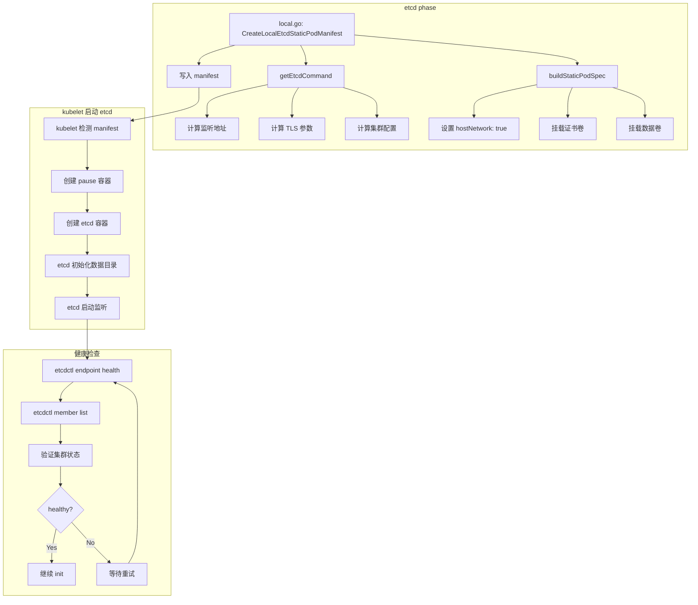

> **生产环境安全提示**
>
> 本文档包含可直接执行的运维命令。执行前请确认：当前目标集群与 Namespace 是否正确；是否具备足够的 RBAC 权限；是否已在非生产环境验证。命令风险等级标注：🔴 高风险（可能造成数据丢失或服务中断）、🟡 中风险（会修改集群状态，但通常可回滚）、🟢 低风险/只读（信息收集，无副作用）。


title: etcd 静态 Pod 管理
description: '# etcd 静态 Pod 管理'
category: functions
tags:
- k8s
- operations
- cluster-management
- etcd
- apiserver
- kubelet
- scheduler
- controller-manager
- rag
last_updated: '2026-05-18'
difficulty: advanced
reading_level: advanced
audience:
- Kubernetes开发者
- DevOps工程师
- SRE
estimated_read_time: 5min
intent_queries:
- Kubernetes etcd static pod manifest kubeadm
- etcd member list endpoint health backup
- etcd data directory /var/lib/etcd member
- etcd TLS certificates peer server client
- kubeadm etcd manifest generation
trigger_keywords:
- etcd
- static pod
- manifest
- member list
- endpoint health
- snapshot
- backup
- TLS
- peer
- server
- WAL
- snap
related_domains:
- 集群基础
- 故障诊断
related_topics:
- kubeadm init
- API Server
- etcd advanced
- certificate management
- HA cluster
authors:
- name: KUDIG Team
  role: contributor
k8s_versions:
- '1.28'
- '1.29'
- '1.30'
- '1.31'
- '1.32'
---

# etcd 静态 Pod 管理

## 函数/流程签名

```go
func CreateLocalEtcdStaticPodManifest(cfg *kubeadmapi.InitConfiguration) error
func getEtcdCommand(cfg *kubeadmapi.InitConfiguration) []string
func waitForEtcd(client clientset.Interface, timeout time.Duration) error
func checkEtcdHealth(endpoint string, certsDir string) error
func getEtcdPodSpec(cfg *kubeadmapi.InitConfiguration) (*v1.Pod, error)
func CreateEtcdStaticPodManifestHA(cfg *kubeadmapi.InitConfiguration, endpoints []string) error
```

## 源码位置

| 文件路径 | 行号范围 | 说明 |
|---------|---------|------|
| `cmd/kubeadm/app/phases/etcd/local.go` | L35-L250 | 本地 etcd manifest 生成 |
| `cmd/kubeadm/app/phases/etcd/local.go` | L251-L400 | HA etcd manifest 生成 |
| `cmd/kubeadm/app/util/etcd/etcdutil.go` | L30-L200 | etcd 工具函数 |
| `cmd/kubeadm/app/util/etcd/etcdutil.go` | L201-L350 | etcd 健康检查 |
| `staging/src/k8s.io/apiserver/pkg/storage/storagebackend/factory/etcd3.go` | L50-L300 | API Server → etcd 连接 |

## 参数说明

### etcd 启动参数

| 参数名 | 类型 | 说明 | 默认值 |
|--------|------|------|--------|
| `--name` | `string` | etcd 成员名称 | 节点主机名 |
| `--data-dir` | `string` | 数据存储目录 | `/var/lib/etcd` |
| `--listen-client-urls` | `[]string` | 客户端监听地址 | `https://127.0.0.1:2379,https://<ip>:2379` |
| `--listen-peer-urls` | `[]string` | 对等通信监听地址 | `https://<ip>:2380` |
| `--advertise-client-urls` | `[]string` | 客户端广播地址 | `https://<ip>:2379` |
| `--initial-advertise-peer-urls` | `[]string` | 对等广播地址 | `https://<ip>:2380` |
| `--initial-cluster` | `string` | 初始集群成员 | `<name>=https://<ip>:2380` |
| `--initial-cluster-token` | `string` | 集群 token | `etcd-cluster` |
| `--initial-cluster-state` | `string` | 初始状态 | `new` / `existing` |
| `--client-cert-auth` | `bool` | 客户端证书认证 | `true` |
| `--cert-file` | `string` | 服务端证书 | `/etc/kubernetes/pki/etcd/server.crt` |
| `--key-file` | `string` | 服务端私钥 | `/etc/kubernetes/pki/etcd/server.key` |
| `--peer-cert-file` | `string` | 对等证书 | `/etc/kubernetes/pki/etcd/peer.crt` |
| `--peer-key-file` | `string` | 对等私钥 | `/etc/kubernetes/pki/etcd/peer.key` |
| `--peer-client-cert-auth` | `bool` | 对等客户端证书认证 | `true` |
| `--trusted-ca-file` | `string` | 受信 CA 文件 | `/etc/kubernetes/pki/etcd/ca.crt` |
| `--peer-trusted-ca-file` | `string` | 对等受信 CA | `/etc/kubernetes/pki/etcd/ca.crt` |
| `--snapshot-count` | `int` | 快照阈值 | `10000` |
| `--heartbeat-interval` | `string` | 心跳间隔 | `500ms` (推荐 100-500ms) |
| `--election-timeout` | `string` | 选举超时 | `5000ms` (推荐 1000-5000ms) |

## 返回值

| 返回值 | 类型 | 说明 |
|--------|------|------|
| `error` | `error` | etcd manifest 创建或健康检查错误 |
| `*v1.Pod` | `struct` | etcd static Pod 对象 |

## 调用链



## 源码分析

### etcd Manifest 生成 (local.go)

```go
// cmd/kubeadm/app/phases/etcd/local.go
// CreateLocalEtcdStaticPodManifest 生成本地 etcd static Pod manifest
func CreateLocalEtcdStaticPodManifest(cfg *kubeadmapi.InitConfiguration) error {
    // 1. 构建 etcd 命令参数
    etcdCommand := getEtcdCommand(cfg)

    // 2. 构建 static Pod spec
    podSpec := &v1.Pod{
        TypeMeta: metav1.TypeMeta{
            APIVersion: "v1",
            Kind:       "Pod",
        },
        ObjectMeta: metav1.ObjectMeta{
            Name:      "etcd",
            Namespace: "kube-system",
        },
    }

    // 3. 配置容器
    container := v1.Container{
        Name:    "etcd",
        Image:   fmt.Sprintf("%s/etcd:%s",
            cfg.Etcd.Local.ImageRepository,
            cfg.Etcd.Local.ImageTag),
        Command: etcdCommand,
        VolumeMounts: []v1.VolumeMount{
            // 挂载 etcd 数据目录
            {Name: "etcd-data", MountPath: "/var/lib/etcd"},
            // 挂载 etcd 证书
            {Name: "etcd-certs", MountPath: "/etc/kubernetes/pki/etcd", ReadOnly: true},
        },
        LivenessProbe: &v1.Probe{
            // 健康检查: etcdctl endpoint health
            HTTPGet: &v1.HTTPGetAction{
                Host: cfg.LocalAPIEndpoint.AdvertiseAddress,
                Path: "/health",
                Port: intstr.FromInt(2379),
                Scheme: v1.URISchemeHTTPS,
            },
            InitialDelaySeconds: 10,
            TimeoutSeconds:      15,
            PeriodSeconds:       10,
            SuccessThreshold:    1,
            FailureThreshold:    8,
        },
    }

    // 4. 设置 Pod 级配置
    podSpec.Spec = v1.PodSpec{
        Containers:       []v1.Container{container},
        HostNetwork:      true,    // 使用宿主机网络
        HostPID:          true,
        PriorityClassName: "system-node-critical",
        Volumes: []v1.Volume{
            {
                Name: "etcd-data",
                VolumeSource: v1.VolumeSource{
                    HostPath: &v1.HostPathVolumeSource{
                        Path: "/var/lib/etcd",
                        Type: &hostPathDirOrCreate,
                    },
                },
            },
            {
                Name: "etcd-certs",
                VolumeSource: v1.VolumeSource{
                    HostPath: &v1.HostPathVolumeSource{
                        Path: "/etc/kubernetes/pki/etcd",
                        Type: &hostPathDirOrCreate,
                    },
                },
            },
        },
    }

    // 5. 序列化为 YAML 并写入文件
    manifestPath := "/etc/kubernetes/manifests/etcd.yaml"
    return writeManifestToFile(podSpec, manifestPath)
}
```

### etcd 命令构建 (local.go)

```go
// cmd/kubeadm/app/phases/etcd/local.go
// getEtcdCommand 构建 etcd 启动命令参数
func getEtcdCommand(cfg *kubeadmapi.InitConfiguration) []string {
    advertiseAddress := cfg.LocalAPIEndpoint.AdvertiseAddress

    command := []string{"etcd"}

    // 1. 成员名称
    command = append(command,
        fmt.Sprintf("--name=%s", cfg.NodeRegistration.Name))

    // 2. 数据目录
    command = append(command,
        fmt.Sprintf("--data-dir=%s", cfg.Etcd.Local.DataDir))

    // 3. 客户端监听地址
    //    本地回环 + 广播地址 (都使用 HTTPS)
    command = append(command,
        fmt.Sprintf("--listen-client-urls=https://127.0.0.1:2379,https://%s:2379",
            advertiseAddress))

    // 4. 客户端广播地址
    command = append(command,
        fmt.Sprintf("--advertise-client-urls=https://%s:2379",
            advertiseAddress))

    // 5. 对等通信监听地址
    command = append(command,
        fmt.Sprintf("--listen-peer-urls=https://%s:2380",
            advertiseAddress))

    // 6. 对等通信广播地址
    command = append(command,
        fmt.Sprintf("--initial-advertise-peer-urls=https://%s:2380",
            advertiseAddress))

    // 7. 初始集群配置
    //    单节点: 只有自己
    //    多节点: 包含所有成员
    initialCluster := fmt.Sprintf("%s=https://%s:2380",
        cfg.NodeRegistration.Name, advertiseAddress)
    command = append(command,
        fmt.Sprintf("--initial-cluster=%s", initialCluster))

    // 8. 初始集群 token (区分不同集群)
    command = append(command,
        "--initial-cluster-token=etcd-cluster")

    // 9. 初始集群状态
    //    new: 全新集群
    //    existing: 加入已有集群
    command = append(command,
        "--initial-cluster-state=new")

    // 10. TLS 证书配置 (服务端)
    command = append(command,
        "--cert-file=/etc/kubernetes/pki/etcd/server.crt")
    command = append(command,
        "--key-file=/etc/kubernetes/pki/etcd/server.key")
    command = append(command,
        "--trusted-ca-file=/etc/kubernetes/pki/etcd/ca.crt")
    command = append(command,
        "--client-cert-auth=true")

    // 11. TLS 证书配置 (对等通信)
    command = append(command,
        "--peer-cert-file=/etc/kubernetes/pki/etcd/peer.crt")
    command = append(command,
        "--peer-key-file=/etc/kubernetes/pki/etcd/peer.key")
    command = append(command,
        "--peer-trusted-ca-file=/etc/kubernetes/pki/etcd/ca.crt")
    command = append(command,
        "--peer-client-cert-auth=true")

    // 12. 快照和性能参数
    command = append(command,
        "--snapshot-count=10000")

    return command
}
```

### etcd 健康检查 (etcdutil.go)

```go
// cmd/kubeadm/app/util/etcd/etcdutil.go
// CheckEtcdHealth 检查 etcd 集群健康状态
func CheckEtcdHealth(cfg *kubeadmapi.InitConfiguration) error {
    // 1. 创建 etcd 客户端
    etcdClient, err := clientv3.New(clientv3.Config{
        Endpoints: []string{
            fmt.Sprintf("https://127.0.0.1:2379"),
        },
        TLS: &tls.Config{
            Certificates: []tls.Certificate{
                loadCert(
                    "/etc/kubernetes/pki/etcd/healthcheck-client.crt",
                    "/etc/kubernetes/pki/etcd/healthcheck-client.key",
                ),
            },
            RootCAs: loadCA("/etc/kubernetes/pki/etcd/ca.crt"),
        },
        DialTimeout: 5 * time.Second,
    })
    if err != nil {
        return fmt.Errorf("failed to connect to etcd: %w", err)
    }
    defer etcdClient.Close()

    // 2. 检查集群健康
    ctx, cancel := context.WithTimeout(context.Background(), 10*time.Second)
    defer cancel()

    // 3. 获取成员列表
    members, err := etcdClient.MemberList(ctx)
    if err != nil {
        return fmt.Errorf("failed to list etcd members: %w", err)
    }

    // 4. 验证每个成员健康
    for _, member := range members.Members {
        for _, endpoint := range member.ClientURLs {
            // 获取 endpoint 健康状态
            healthResp, err := etcdClient.Maintenance.Status(ctx, endpoint)
            if err != nil {
                return fmt.Errorf("etcd member %s is unhealthy: %w",
                    member.Name, err)
            }

            // 检查是否有 leader
            if healthResp.Header.RaftTerm == 0 {
                return fmt.Errorf("etcd member %s has no leader", member.Name)
            }

            fmt.Printf("[etcd] Member %s is healthy (raft term: %d)\n",
                member.Name, healthResp.Header.RaftTerm)
        }
    }

    // 5. 检查数据一致性
    //    获取 revision 确认数据可读
    getResp, err := etcdClient.Get(ctx, "/", clientv3.WithSerializable())
    if err != nil {
        return fmt.Errorf("failed to read etcd data: %w", err)
    }
    fmt.Printf("[etcd] Cluster revision: %d\n", getResp.Header.Revision)

    return nil
}
```

## 执行流程

### etcd 启动流程

```
# 🟢 低风险：只读/信息收集，通常无副作用
步骤 1: kubeadm 写入 etcd manifest
    → /etc/kubernetes/manifests/etcd.yaml
    ↓
步骤 2: kubelet 检测到新 manifest
    → 解析 YAML 文件
    ↓
步骤 3: 创建 pause 容器
    → 设置网络命名空间
    ↓
步骤 4: 创建 etcd 容器
    → 拉取 etcd 镜像 (registry.k8s.io/etcd:3.5.9-0)
    → 挂载 /var/lib/etcd (数据持久化)
    → 挂载 /etc/kubernetes/pki/etcd (TLS 证书)
    ↓
步骤 5: etcd 初始化
    → 创建数据目录 /var/lib/etcd/member/
    → 生成 WAL (Write-Ahead Log) 目录
    → 初始化 Raft 状态机
    ↓
步骤 6: etcd 开始监听
    → :2379 (客户端连接)
    → :2380 (对等通信)
    ↓
步骤 7: 健康检查
    → HTTP GET https://<ip>:2379/health
    → 返回 {"health": "true"}
    ↓
步骤 8: kubeadm 验证 etcd 就绪
    → etcdctl endpoint health
    → etcdctl member list
```
### HA etcd 加入流程

```
步骤 1: 新节点 kubeadm join --control-plane
    ↓
步骤 2: 解密获取 etcd CA 证书
    ↓
步骤 3: 生成 etcd 证书 (server, peer, healthcheck)
    ↓
步骤 4: 创建 etcd manifest
    → --initial-cluster-state=existing (加入已有集群)
    → --initial-cluster 包含所有成员
    ↓
步骤 5: etcd 容器启动
    ↓
步骤 6: 向集群发起加入请求
    → 通过 Raft 协议同步数据
    ↓
步骤 7: 等待数据同步完成
    ↓
步骤 8: 集群达到新的 quorum
```

## 使用场景

### 场景 1: 备份 etcd 数据

``` bash
# 🟢 低风险：只读/信息收集，通常无副作用
# 创建 etcd 快照
ETCDCTL_API=3 etcdctl snapshot save /backup/etcd-snapshot-$(date +%Y%m%d).db \
  --endpoints=https://127.0.0.1:2379 \
  --cacert=/etc/kubernetes/pki/etcd/ca.crt \
  --cert=/etc/kubernetes/pki/etcd/healthcheck-client.crt \
  --key=/etc/kubernetes/pki/etcd/healthcheck-client.key

# 验证快照
ETCDCTL_API=3 etcdctl snapshot status /backup/etcd-snapshot-20240101.db --write-table
# +----------+----------+------------+------------+
# | REVISION | KEYS     | TOTAL SIZE | HASH       |
# +----------+----------+------------+------------+
# | 12345678 | 1234     | 5.6 MB     | 1234567890 |
# +----------+----------+------------+------------+
```
### 场景 2: 从快照恢复 etcd

> ⚠️ **🔴 灾难性操作** — 含不可逆命令，执行前必须满足变更窗口+双人复核+事前备份+回滚方案
> - `etcdctl snapshot restore`：用快照覆盖 etcd 数据目录，集群状态强制回退
> - `systemctl stop/restart`：停止/重启系统服务，影响节点上所有容器

> **🔴 高风险操作警告**
>
> 下方命令属于不可逆或高影响操作，执行前请确认：
> - 已备份关键数据与配置
> - 处于批准的变更窗口期
> - 已获得相关责任人授权
> - 已准备回滚或恢复方案
> - 目标集群、Namespace、节点/资源名称正确无误

``` bash
# 🔴 高风险：可能造成数据丢失或服务中断，执行前需备份、变更审批与回滚方案
# 1. 停止所有控制面组件
crictl stop $(crictl ps --name etcd -q)
crictl stop $(crictl ps --name kube-apiserver -q)
crictl stop $(crictl ps --name kube-controller-manager -q)
crictl stop $(crictl ps --name kube-scheduler -q)

# 2. 备份当前数据
mv /var/lib/etcd /var/lib/etcd.bak

# 3. 从快照恢复
ETCDCTL_API=3 etcdctl snapshot restore /backup/etcd-snapshot.db \
  --data-dir=/var/lib/etcd \
  --name=master \
  --initial-cluster=master=https://192.168.1.10:2380 \
  --initial-cluster-token=etcd-cluster \
  --initial-advertise-peer-urls=https://192.168.1.10:2380

# 4. 重启 kubelet (自动启动所有 static Pod)
systemctl restart kubelet

# 5. 验证
ETCDCTL_API=3 etcdctl endpoint health \
  --cacert=/etc/kubernetes/pki/etcd/ca.crt \
  --cert=/etc/kubernetes/pki/etcd/healthcheck-client.crt \
  --key=/etc/kubernetes/pki/etcd/healthcheck-client.key
```
### 场景 3: 自定义 etcd 参数

```yaml
# kubeadm-config.yaml
apiVersion: kubeadm.k8s.io/v1beta3
kind: ClusterConfiguration
etcd:
  local:
    dataDir: "/var/lib/etcd"
    imageRepository: "registry.k8s.io"
    imageTag: "3.5.9-0"
    extraArgs:
      heartbeat-interval: "500"
      election-timeout: "5000"
      snapshot-count: "10000"
      auto-compaction-mode: "periodic"
      auto-compaction-retention: "1h"
      quota-backend-bytes: "8589934592"  # 8GB
      max-request-bytes: "10485760"       # 10MB
```

## 配置示例

### 完整 etcd Manifest

```yaml
# /etc/kubernetes/manifests/etcd.yaml
apiVersion: v1
kind: Pod
metadata:
  name: etcd
  namespace: kube-system
spec:
  containers:
  - command:
    - etcd
    - --advertise-client-urls=https://192.168.1.10:2379
    - --cert-file=/etc/kubernetes/pki/etcd/server.crt
    - --client-cert-auth=true
    - --data-dir=/var/lib/etcd
    - --experimental-initial-corrupt-check=true
    - --experimental-watch-progress-notify-interval=5s
    - --initial-advertise-peer-urls=https://192.168.1.10:2380
    - --initial-cluster=master=https://192.168.1.10:2380
    - --initial-cluster-token=etcd-cluster
    - --initial-cluster-state=new
    - --key-file=/etc/kubernetes/pki/etcd/server.key
    - --listen-client-urls=https://127.0.0.1:2379,https://192.168.1.10:2379
    - --listen-metrics-urls=http://127.0.0.1:2381
    - --listen-peer-urls=https://192.168.1.10:2380
    - --name=master
    - --peer-cert-file=/etc/kubernetes/pki/etcd/peer.crt
    - --peer-client-cert-auth=true
    - --peer-key-file=/etc/kubernetes/pki/etcd/peer.key
    - --peer-trusted-ca-file=/etc/kubernetes/pki/etcd/ca.crt
    - --snapshot-count=10000
    - --trusted-ca-file=/etc/kubernetes/pki/etcd/ca.crt
    image: registry.k8s.io/etcd:3.5.9-0
    imagePullPolicy: IfNotPresent
    livenessProbe:
      failureThreshold: 8
      httpGet:
        host: 192.168.1.10
        path: /health
        port: 2379
        scheme: HTTPS
      initialDelaySeconds: 10
      periodSeconds: 10
      timeoutSeconds: 15
    name: etcd
    startupProbe:
      failureThreshold: 24
      httpGet:
        host: 192.168.1.10
        path: /health
        port: 2379
        scheme: HTTPS
      initialDelaySeconds: 10
      periodSeconds: 10
      timeoutSeconds: 15
    resources:
      requests:
        cpu: 100m
        memory: 100Mi
    volumeMounts:
    - mountPath: /var/lib/etcd
      name: etcd-data
    - mountPath: /etc/kubernetes/pki/etcd
      name: etcd-certs
      readOnly: true
  hostNetwork: true
  hostPID: true
  priority: 2000001000
  priorityClassName: system-node-critical
  volumes:
  - hostPath:
      path: /etc/kubernetes/pki/etcd
      type: DirectoryOrCreate
    name: etcd-certs
  - hostPath:
      path: /var/lib/etcd
      type: DirectoryOrCreate
    name: etcd-data
```

## 实战示例

### etcd 日常运维命令

``` bash
# 🟢 低风险：只读/信息收集，通常无副作用
# 查看成员列表
ETCDCTL_API=3 etcdctl member list \
  --cacert=/etc/kubernetes/pki/etcd/ca.crt \
  --cert=/etc/kubernetes/pki/etcd/healthcheck-client.crt \
  --key=/etc/kubernetes/pki/etcd/healthcheck-client.key \
  --write-out=table
# +------------------+---------+--------+---------------------------+---------------------------+------------+
# |        ID        | STATUS  |  NAME  |       PEER ADDRS          |      CLIENT ADDRS         | IS LEARNER |
# +------------------+---------+--------+---------------------------+---------------------------+------------+
# | 8e9e05c52164694d | started | master | https://192.168.1.10:2380 | https://192.168.1.10:2379 |      false |
# +------------------+---------+--------+---------------------------+---------------------------+------------+

# 查看端点健康
ETCDCTL_API=3 etcdctl endpoint health --cluster \
  --cacert=/etc/kubernetes/pki/etcd/ca.crt \
  --cert=/etc/kubernetes/pki/etcd/healthcheck-client.crt \
  --key=/etc/kubernetes/pki/etcd/healthcheck-client.key
# https://192.168.1.10:2379 is healthy: successfully committed proposal

# 查看端点状态
ETCDCTL_API=3 etcdctl endpoint status --cluster -w table \
  --cacert=/etc/kubernetes/pki/etcd/ca.crt \
  --cert=/etc/kubernetes/pki/etcd/healthcheck-client.crt \
  --key=/etc/kubernetes/pki/etcd/healthcheck-client.key

# 查看 etcd 指标
curl -s http://127.0.0.1:2381/metrics | grep etcd_server_has_leader
# etcd_server_has_leader 1

# 查看数据库大小
ETCDCTL_API=3 etcdctl endpoint status -w json \
  --cacert=/etc/kubernetes/pki/etcd/ca.crt \
  --cert=/etc/kubernetes/pki/etcd/healthcheck-client.crt \
  --key=/etc/kubernetes/pki/etcd/healthcheck-client.key | jq '.[0].Status.dbSize'
```
## 常见错误

| 错误 | 原因 | 解决方案 |
|------|------|---------|
| `etcd server is not ready` | etcd 容器启动中 | 等待 startup probe 通过 |
| `database space exceeded` | etcd 数据超出配额 | 执行碎片整理: `etcdctl defrag` |
| `raft: leader changed` | leader 频繁切换 | 检查网络延迟和磁盘 IO |
| `etcd member unhealthy` | 成员无法通信 | 检查证书和网络 |
| `corrupt data` | 数据损坏 | 从快照恢复 |
| `too many open files` | 文件描述符不足 | `ulimit -n 65536` |
| `wal: max entry size exceed` | 写入数据过大 | 调整 `max-request-bytes` |

### etcd 自动压缩配置

```yaml
# kubeadm-config.yaml - etcd 自动压缩
apiVersion: kubeadm.k8s.io/v1beta3
kind: ClusterConfiguration
etcd:
  local:
    extraArgs:
      auto-compaction-mode: "periodic"
      auto-compaction-retention: "1h"
      quota-backend-bytes: "8589934592"
      max-request-bytes: "10485760"
```

### etcd 数据目录结构

```
/var/lib/etcd/
└── member/
    ├── wal/
    │   ├── 0000000000000000-0000000000000000.wal  # WAL 日志文件
    │   └── 0.wal
    ├── snap/
    │   ├── 0000000000000001-0000000000000001.snap  # 快照文件
    │   └── db                                     # BoltDB 数据文件
    └── WAL_LOCK
```

## 相关函数

``` bash
# 🟢 低风险：只读/信息收集，通常无副作用
# 在线碎片整理 (不中断服务)
ETCDCTL_API=3 etcdctl defrag \
  --cacert=/etc/kubernetes/pki/etcd/ca.crt \
  --cert=/etc/kubernetes/pki/etcd/healthcheck-client.crt \
  --key=/etc/kubernetes/pki/etcd/healthcheck-client.key \
  --endpoints=https://127.0.0.1:2379

# 查看碎片整理后的数据库大小
ETCDCTL_API=3 etcdctl endpoint status -w table \
  --cacert=/etc/kubernetes/pki/etcd/ca.crt \
  --cert=/etc/kubernetes/pki/etcd/healthcheck-client.crt \
  --key=/etc/kubernetes/pki/etcd/healthcheck-client.key

# 查看压缩的 revision
ETCDCTL_API=3 etcdctl get / --prefix --keys-only \
  --cacert=/etc/kubernetes/pki/etcd/ca.crt \
  --cert=/etc/kubernetes/pki/etcd/healthcheck-client.crt \
  --key=/etc/kubernetes/pki/etcd/healthcheck-client.key | head -20

# 设置自动压缩 (在 etcd extraArgs 中)
# auto-compaction-mode: periodic
# auto-compaction-retention: 1h
```
### etcd 监控指标

```bash
# 查看 etcd 关键指标
curl -s http://127.0.0.1:2381/metrics | grep -E 'etcd_server_has_leader|etcd_server_leader_changes_seen|etcd_disk_wal_fsync_duration_seconds|etcd_mvcc_db_total_size_in_bytes'

# 关键指标说明:
# etcd_server_has_leader = 1 (有 leader)
# etcd_server_leader_changes_seen_total (leader 变更次数，应该很少)
# etcd_disk_wal_fsync_duration_seconds (WAL 写入延迟，应 < 10ms)
# etcd_mvcc_db_total_size_in_bytes (数据库大小)
# etcd_server_heartbeat_send_failures_total (心跳失败次数)
```

### etcd 与 Kubernetes 版本兼容性

| Kubernetes 版本 | 推荐 etcd 版本 | 最低 etcd 版本 |
|-----------------|---------------|--------------|
| 1.24 | 3.5.x | 3.5.x |
| 1.25 | 3.5.x | 3.5.x |
| 1.26 | 3.5.x | 3.5.x |
| 1.27 | 3.5.x | 3.5.x |
| 1.28 | 3.5.x | 3.5.x |
| 1.29 | 3.5.x | 3.5.x |

## 相关函数

- [集群概览](01-overview.md) — init 流程中 etcd phase
- [证书管理](03-certs.md) — etcd TLS 证书
- [控制面组件](05-control-plane.md) — API Server 连接 etcd
- [etcd 进阶](13-etcd-advanced.md) — HA etcd 管理和调优
- [集群升级](09-upgrade.md) — 升级 etcd 版本
- [高可用进阶](14-ha-advanced.md) — 多节点 etcd 集群

## Related

- [[reference|#reference Hub]] — tag hub

- [[hot|hot]]
- [[系统基础/速查卡/go.md|go]]
- [[系统基础/速查卡/k8s.md|k8s]]
- [[entities/kubernetes.md|kubernetes]]
- [[系统基础/知识字典/operations/certificates.md|certificates]]
- [[生态参考/领域索引/backup-dr-index.md|Backup & DR 备份与灾备知识图谱索引]]
- [[生态参考/领域索引/etcd-index.md|etcd 知识图谱索引]]


<!-- risk-assessed -->
