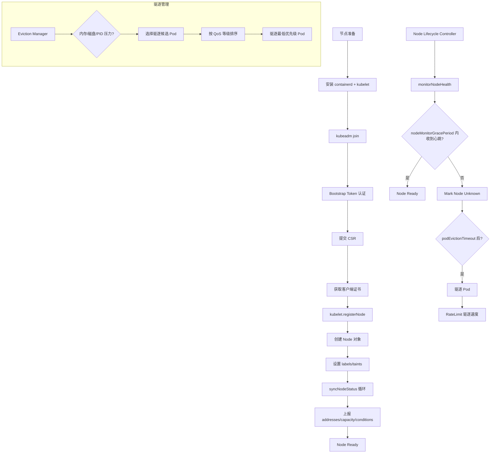
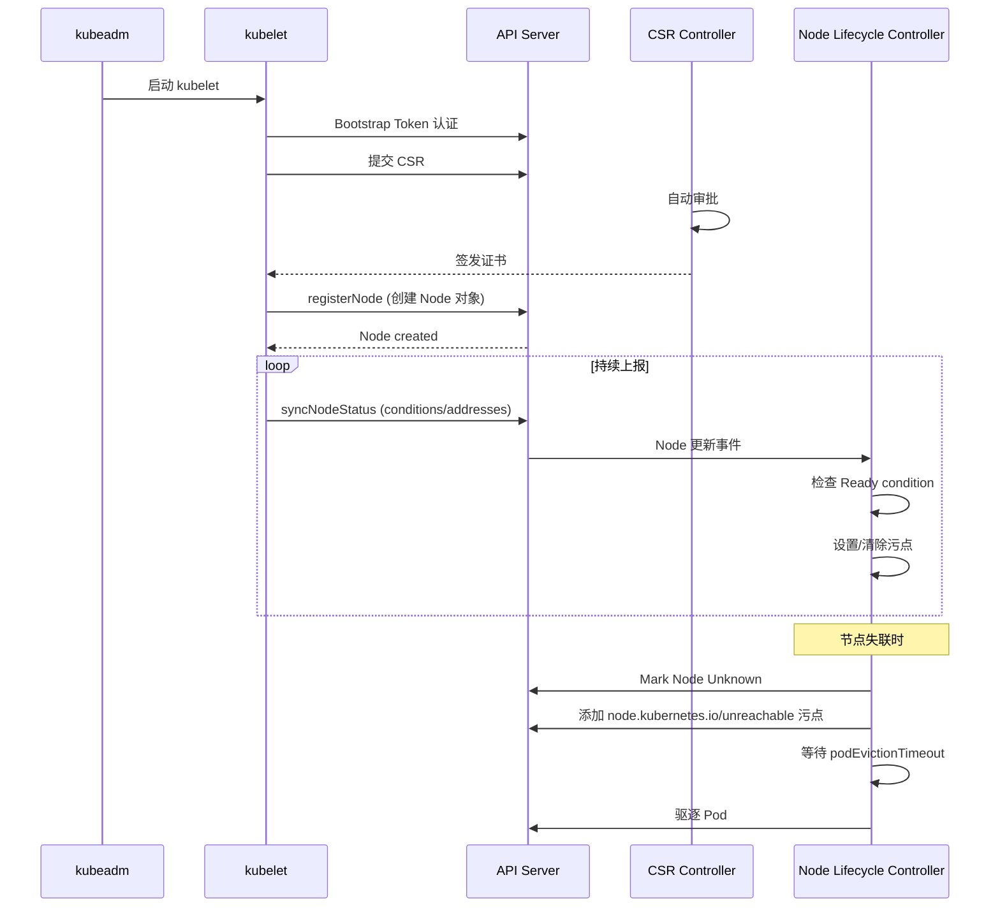

> **生产环境安全提示**
>
> 本文档包含可直接执行的运维命令。执行前请确认：当前目标集群与 Namespace 是否正确；是否具备足够的 RBAC 权限；是否已在非生产环境验证。命令风险等级标注：🔴 高风险（可能造成数据丢失或服务中断）、🟡 中风险（会修改集群状态，但通常可回滚）、🟢 低风险/只读（信息收集，无副作用）。


# Node Create — [[Kubernetes|Kubernetes]] 节点生命周期管理

## 函数签名

```go
func (kl *Kubelet) Run(ctx context.Context)
func (kl *Kubelet) syncNodeStatus(ctx context.Context) error
func (kl *Kubelet) registerNode(ctx context.Context) error
func (kl *Kubelet) syncPod(ctx context.Context, pod *v1.Pod) error
func (kl *certificateManager) RequestCertificate(ctx context.Context) (*x509.Certificate, error)

func NewNodeLifecycleController(
    kubeClient clientset.Interface,
    nodeInformer coreinformers.NodeInformer,
    podInformer coreinformers.PodInformer,
    ...) (*Controller, error)

func (nc *Controller) Run(ctx context.Context)
func (nc *Controller) monitorNodeHealth(ctx context.Context)

```

## 源码位置

| 组件 | 源码路径 | 说明 |
|------|---------|------|
| kubelet 主入口 | `pkg/kubelet/kubelet.go` | kubelet 核心逻辑 |
| 节点状态管理 | `pkg/kubelet/nodestatus/` | 状态上报与同步 |
| 节点注册 | `pkg/kubelet/certificate/` | Bootstrap + CSR |
| 证书轮换 | `pkg/kubelet/certificate/` | 自动证书续期 |
| 驱逐管理 | `pkg/kubelet/eviction/` | 资源压力驱逐 |
| PLEG | `pkg/kubelet/pleg/` | Pod 生命周期事件 |
| Node Lifecycle Controller | `pkg/controller/nodelifecycle/` | 节点健康监控 |
| kubectl drain | `pkg/kubectl/cmd/drain/` | drain 命令实现 |
| CNI 网络 | `pkg/kubelet/dockershim/network/cni/` | Pod 网络配置 |
| 容器运行时 | `pkg/kubelet/cri/` | CRI 接口 |
| kubeadm join | `cmd/kubeadm/app/cmd/join.go` | 节点加入 |
| Bootstrap Token | `cmd/kubeadm/app/phases/bootstraptoken/` | Token 管理 |

## 参数说明

### kubelet 启动参数

| 参数 | 默认值 | 说明 |
|------|--------|------|
| `--config` | 无 | kubelet 配置文件路径 |
| `--kubeconfig` | `/etc/kubernetes/kubelet.conf` | kubeconfig 路径 |
| `--hostname-override` | hostname | 覆盖节点名称 |
| `--node-ip` | 自动选择 | 节点 IP 地址 |
| `--node-labels` | 无 | 节点初始标签 |
| `--register-node` | `true` | 是否注册到 API Server |
| `--provider-id` | 无 | 云厂商节点 ID |
| `--max-[[Pods|pods]]` | 110 | 最大 Pod 数量 |
| `--cgroup-driver` | `systemd` | cgroup 驱动 |
| `--container-runtime` | `remote` | 容器运行时类型 |
| `--container-runtime-endpoint` | `unix:///run/containerd/containerd.sock` | CRI 端点 |

### Node 对象关键字段

| 字段 | 类型 | 说明 |
|------|------|------|
| `metadata.name` | `string` | 节点名称 |
| `metadata.labels` | `map[string]string` | 节点标签（含架构、OS、角色） |
| `spec.podCIDR` | `string` | 分配给节点的 Pod CIDR |
| `spec.taints` | `[]Taint` | 节点污点 |
| `spec.unschedulable` | `bool` | 是否不可调度 |
| `status.conditions` | `[]NodeCondition` | 节点状态条件 |
| `status.addresses` | `[]NodeAddress` | 节点地址列表 |
| `status.capacity` | `ResourceList` | 节点总资源 |
| `status.allocatable` | `ResourceList` | 节点可分配资源 |
| `status.nodeInfo` | `NodeSystemInfo` | 系统信息 |

### 节点 Conditions

| Condition | 说明 | 影响 |
|-----------|------|------|
| `Ready` | 节点健康状态 | False → NoExecute 驱逐 |
| `MemoryPressure` | 内存压力 | 驱逐 BestEffort Pod |
| `DiskPressure` | 磁盘压力 | 驱逐日志和未使用镜像 |
| `PIDPressure` | PID 不足 | 驱逐 Pod |
| `NetworkUnavailable` | 网络未配置 | 阻止调度 |

### 节点管理命令

| 命令 | 说明 |
|------|------|
| `kubectl get nodes` | 列出节点 |
| `kubectl describe node <name>` | 节点详情 |
| `kubectl cordon <node>` | 标记不可调度 |
| `kubectl uncordon <node>` | 恢复调度 |
| `kubectl drain <node>` | 驱逐所有 Pod |
| `kubectl top nodes` | 节点资源使用 |
| `kubectl label node <node> key=value` | 添加标签 |
| `kubectl taint node <node> key=value:NoSchedule` | 添加污点 |

## 返回值

| 函数 | 返回值 | 说明 |
|------|--------|------|
| `Run` | 无 | kubelet 阻塞运行 |
| `syncNodeStatus` | `error` | 状态同步结果 |
| `registerNode` | `error` | 注册成功或失败 |
| `syncPod` | `error` | Pod 同步结果 |
| `NewNodeLifecycleController` | `(*Controller, error)` | 控制器实例 |

## 调用链



## 源码分析

### 概述

本模块系统梳理 Kubernetes 节点从注册到运维管理的完整生命周期。节点分为控制面节点和工作节点两种角色，无论哪种角色都必须经过注册、认证、状态上报等关键流程。节点生命周期的管理涉及 kubelet、Node Lifecycle Controller、Cluster Autoscaler 等多个组件的协作。

### 节点生命周期全景

> ⚠️ **🔴 灾难性操作** — 含不可逆命令，执行前必须满足变更窗口+双人复核+事前备份+回滚方案
> - `kubeadm reset`：清理节点所有 K8s 配置/证书/CNI，节点脱离集群

```
阶段 1: 节点准备
├── 物理/虚拟机创建
├── 安装容器运行时 (containerd/cri-o)
├── 安装 kubelet 二进制 + systemd 服务
└── 网络配置 (CNI 插件安装)

阶段 2: 节点注册
├── kubeadm join / bootstrap token 认证
├── CSR 签发 → kubelet 获取正式证书
├── Node 对象创建 → API Server 注册
└── kubelet 状态上报 → Ready

阶段 3: 正常运行
├── Pod 调度与容器管理
├── 资源监控与上报 (cAdvisor)
├── 证书自动轮换
└── 健康检查与状态同步

阶段 4: 节点运维
├── drain → 维护操作 → uncordon
├── 版本升级 (kubelet/kubeadm/OS)
├── 弹性伸缩 (Cluster Autoscaler)
└── 故障排查与恢复

阶段 5: 节点移除
├── drain 驱逐所有 Pod
├── delete node 从集群移除
├── kubeadm reset 清理节点  # ⚠️ 清理节点所有 K8s 配置
└── 云厂商释放实例
```

### kubelet 核心组件

kubelet 是每个节点上运行的核心代理程序：

```go
// pkg/kubelet/kubelet.go
type Kubelet struct {
    nodeName        types.NodeName
    hostname        string
    kubeClient      clientset.Interface
    podManager      pod.Manager
    containerManager container.Manager
    evictionManager eviction.Manager
    certificateManager certificate.Manager
    probeManager    prober.Manager
    pleg            pleg.PodLifecycleEventGenerator
    statusManager   status.Manager
    volumeManager   volume.Manager
    networkPlugin   network.NetworkPlugin
    // ...
}

func (kl *Kubelet) Run(ctx context.Context) {
    kl.initializeRuntimeDependencies()

    go kl.syncNodeStatus(ctx)
    go kl.pleg.Watch(ctx)
    go kl.evictionManager.Start(ctx)
    go kl.probeManager.Start()
    go kl.certificateManager.Start(ctx)
    go kl.volumeManager.Run(ctx)

    kl.syncLoop(ctx, kl.updates)
}
```

### Node Lifecycle Controller

```go
// pkg/controller/nodelifecycle/node_lifecycle_controller.go
func (nc *Controller) monitorNodeHealth(ctx context.Context) {
    nodeInformer := nc.nodeInformer.Informer()
    nodeInformer.AddEventHandler(cache.ResourceEventHandlerFuncs{
        UpdateFunc: func(oldObj, newObj interface{}) {
            node := newObj.(*v1.Node)
            if node.Spec.Unschedulable {
                return
            }
            nc.enqueueNode(node)
        },
    })

    for i := 0; i < nc.workerNumber; i++ {
        go wait.Until(nc.worker, time.Second, ctx.Done())
    }
}

func (nc *Controller) doNodeProcessing(ctx context.Context, node *v1.Node) error {
    if !nc.knowsNoPodSignedByOldCert(node) {
        nc.taintNode(ctx, node, v1.TaintNodeNotReady)
    }

    if node.Spec.PodCIDR == "" && nc.allocateNodeCIDRs {
        nc.allocatePodCIDR(node)
    }

    nc.processNodeTaint(ctx, node)

    return nil
}
```

### 节点状态上报

```go
// pkg/kubelet/nodestatus/setters.go
func (kl *Kubelet) syncNodeStatus(ctx context.Context) error {
    node, err := kl.GetNode()
    if err != nil {
        return err
    }

    originalNode := node.DeepCopy()

    for _, setter := range kl.nodeStatus setters {
        if err := setter(node); err != nil {
            klog.Warningf("error setting node status: %v", err)
        }
    }

    if !apiequality.Semantic.DeepEqual(originalNode.Status, node.Status) {
        _, err := kl.kubeClient.CoreV1().Nodes().UpdateStatus(ctx, node, metav1.UpdateOptions{})
        return err
    }

    return nil
}
```

### Node 对象结构

```yaml
apiVersion: v1
kind: Node
metadata:
  name: node-1
  labels:
    kubernetes.io/arch: amd64
    kubernetes.io/os: linux
    kubernetes.io/hostname: node-1
    node-role.kubernetes.io/worker: ""
  annotations:
    node.alpha.kubernetes.io/ttl: "0"
    volumes.kubernetes.io/controller-managed-attach-detach: "true"
spec:
  podCIDR: 10.244.1.0/24
  taints:
  - key: node.kubernetes.io/not-ready
    effect: NoSchedule
status:
  conditions:
  - type: Ready
    status: "True"
    reason: KubeletReady
    lastHeartbeatTime: "2024-01-01T00:00:00Z"
  addresses:
  - type: InternalIP
    address: 192.168.1.10
  - type: Hostname
    address: node-1
  capacity:
    cpu: "4"
    memory: 8Gi
    pods: "110"
  allocatable:
    cpu: "3800m"
    memory: 7Gi
    pods: "110"
  nodeInfo:
    kubeletVersion: v1.28.0
    containerRuntimeVersion: containerd://1.7.0
    osImage: Ubuntu 22.04.3 LTS
    kernelVersion: 5.15.0-91-generic
```

## 执行流程



## 使用场景

1. **新节点加入集群**：kubeadm join 完成注册和认证
2. **节点维护**：cordon → 维护 → uncordon
3. **节点升级**：drain → upgrade kubelet → uncordon
4. **故障恢复**：排查 NotReady 节点
5. **弹性伸缩**：Cluster Autoscaler 自动增减节点

## 配置示例

```yaml
apiVersion: kubelet.config.k8s.io/v1beta1
kind: KubeletConfiguration
address: 0.0.0.0
port: 10250
readOnlyPort: 0
authentication:
  anonymous:
    enabled: false
  webhook:
    enabled: true
  x509:
    clientCAFile: /etc/kubernetes/pki/ca.crt
authorization:
  mode: Webhook
cgroupDriver: systemd
clusterDNS:
  - 10.96.0.10
clusterDomain: cluster.local
rotateCertificates: true
serverTLSBootstrap: true
maxPods: 110
podPidsLimit: -1
resolvConf: /run/systemd/resolve/resolv.conf
failSwapOn: true
containerLogMaxSize: 10Mi
containerLogMaxFiles: 5
evictionHard:
  memory.available: "100Mi"
  nodefs.available: "10%"
  nodefs.inodesFree: "5%"
  imagefs.available: "15%"
evictionSoft:
  memory.available: "200Mi"
  nodefs.available: "15%"
evictionSoftGracePeriod:
  memory.available: "1m30s"
  nodefs.available: "2m"
evictionMaxPodGracePeriod: 60
evictionPressureTransitionPeriod: 5m
```

## 实战示例

### 节点运维操作

> ⚠️ **🟠 高危操作** — 影响业务流量或节点状态，需变更工单+影响评估+计划回滚
> - `kubectl cordon`：标记节点不可调度
> - `kubectl drain`：驱逐节点所有 Pod，业务流量受影响

> **🔴 高风险操作警告**
>
> 下方命令属于不可逆或高影响操作，执行前请确认：
> - 已备份关键数据与配置
> - 处于批准的变更窗口期
> - 已获得相关责任人授权
> - 已准备回滚或恢复方案
> - 目标集群、Namespace、节点/资源名称正确无误

``` bash
# 🔴 高风险：可能造成数据丢失或服务中断，执行前需备份、变更审批与回滚方案
# 查看所有节点
kubectl get nodes -o wide
# NAME       STATUS   ROLES           AGE   VERSION   INTERNAL-IP    OS-IMAGE
# master-1   Ready    control-plane   1h    v1.28.0   192.168.1.10   Ubuntu 22.04
# worker-1   Ready    worker          45m   v1.28.0   192.168.1.11   Ubuntu 22.04
# worker-2   Ready    worker          30m   v1.28.0   192.168.1.12   Ubuntu 22.04

# 节点维护
kubectl cordon worker-1
# node/worker-1 cordoned

kubectl drain worker-1 --ignore-daemonsets --delete-emptydir-data
# node/worker-1 already cordoned
# evicting pod default/web-app-5d8c7b6f9c-abcde
# pod/web-app-5d8c7b6f9c-abcde evicted

# 维护完成后恢复
kubectl uncordon worker-1
# node/worker-1 uncordoned

# 查看节点资源使用
kubectl top nodes
# NAME       CPU(cores)   CPU%   MEMORY(bytes)   MEMORY%
# master-1   250m         6%     1024Mi          12%
# worker-1   850m         21%    3072Mi          38%
# worker-2   620m         15%    2048Mi          25%

# 查看节点详情
kubectl describe node worker-1
# Name:               worker-1
# Labels:             beta.kubernetes.io/arch=amd64
#                     kubernetes.io/hostname=worker-1
# Taints:             <none>
# Unschedulable:      false
# Conditions:
#   Type             Status  LastHeartbeatTime
#   Ready            True    2024-01-01T01:00:00Z
#   MemoryPressure   False   2024-01-01T01:00:00Z
#   DiskPressure     False   2024-01-01T01:00:00Z
```
## 常见错误

| 错误 | 现象 | 原因 | 解决方案 |
|------|------|------|----------|
| 节点 NotReady | `Ready=False` | kubelet 未运行或无法连接 API Server | `systemctl status kubelet` |
| CSR 未审批 | 节点注册卡住 | 自动审批 RBAC 缺失 | 检查 ClusterRoleBinding |
| 证书过期 | 节点 NotReady | kubelet 客户端证书过期 | 检查 `rotateCertificates: true` |
| PodCIDR 未分配 | `unassigned` | node-controller 配置问题 | 检查 `--allocate-node-cidrs` |
| 多网卡 IP 错误 | 节点使用错误 IP | kubelet 自动选择 | 指定 `--node-ip` |
| 资源压力驱逐 | Pod 被驱逐 | 内存/磁盘不足 | 检查 evictionHard 配置 |
| cgroup driver 不匹配 | kubelet 启动失败 | containerd 与 kubelet cgroup driver 不同 | 统一使用 `systemd` |

## 相关函数

- [`kubeadm join`](../cluster-create/06-join.md) — 节点加入流程
- [`CSR 自动审批`](../cluster-create/12-join-advanced.md) — 证书签名请求
- [`证书轮换`](06-certificate.md) — kubelet 证书自动续期
- [`节点驱逐`](04-drain.md) — drain/cordon/uncordon
- [`CNI 节点配置`](09-cni-node.md) — Pod 网络命名空间

## Related

- Domain-34: CNCF Landscape 开源项目 — Cross-reference
- [[实体/release-notes-networking.md|发布说明索引 — 网络]] — Cross-reference
- 网络 MOC — Cross-reference
- Topic 应用层架构设计最佳实践 — Cross-reference
- topic-application-architecture MOC — Cross-reference
- [[概念/bp-common-best-practices.md|Kubernetes 通用最佳实践参考]] — Cross-reference
- [[元数据/KUDIG Knowledge Base Architecture.md|KUDIG Knowledge Base Architecture]] — Cross-reference
- [[AI基础设施/基础设施/03-gpu-scheduling-management.md|GPU 调度与管理]] — Cross-reference
- [[AI基础设施/基础设施/05-distributed-training-frameworks.md|分布式训练框架]] — Cross-reference
- 发布变更 MOC — Cross-reference
- [[技能/learn-decision-tree-mermaid.md|故障排查决策树 - Mermaid 可视化版]] — Cross-reference
- [[技能/skill-22-daemonset-failure.md|DaemonSet 故障诊断与修复 / DaemonSet Failure Diagnosis & Remediation]] — Cross-reference
- [[平台工程/运维/06-monitoring-alerting-system.md|监控告警体系]] — Cross-reference
- Domain 30: 企业级灾备与业务连续性 (Enterprise Disaster Recovery & Business Continuity) — Cross-reference
- [[实体/ecosystem-changelog.md|生态组件变更日志索引]] — Cross-reference
- [[生态参考/领域索引/cluster-index.md|Cluster 集群知识图谱索引]]
- [[生态参考/领域索引/pvc-index.md|PVC 知识图谱索引]]
- [[生态参考/领域索引/terway-index.md|Terway 知识图谱索引]]
- [[生态参考/领域索引/nginx-ingress-index.md|nginx-ingress-controller 知识图谱索引]]
- [[生态参考/领域索引/higress-index.md|Higress 知识图谱索引]]

```

<!-- risk-assessed -->
