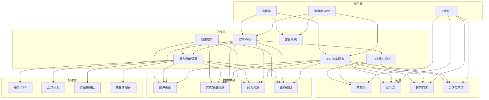
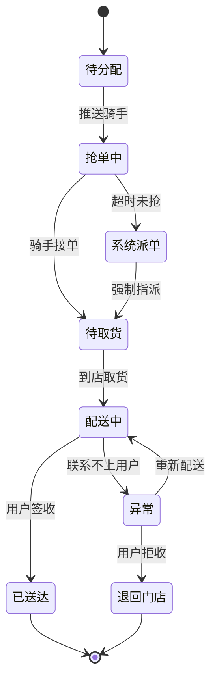
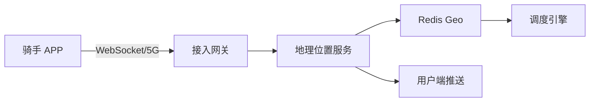

> **生产环境安全提示**
>
> 本文档包含可直接执行的运维命令。执行前请确认：当前目标集群与 Namespace 是否正确；是否具备足够的 RBAC 权限；是否已在非生产环境验证。命令风险等级标注：🔴 高风险（可能造成数据丢失或服务中断）、🟡 中风险（会修改集群状态，但通常可回滚）、🟢 低风险/只读（信息收集，无副作用）。


title: 即时零售架构设计
description: '# 即时零售架构设计 — 阿里云视角'
category: application-architecture
tags:
- k8s
- architecture
- industry
- redis
- mysql
- [[StatefulSet|statefulset]]
- operator
last_updated: 2026-05-18
difficulty: intermediate
reading_level: intermediate
audience:
- 新零售架构师
- 即时配送技术负责人
- SRE
estimated_read_time: 5min
intent_queries:
- 即时零售 [[Kubernetes|Kubernetes]] 30分钟达
- 同城配送 骑手调度 K8s
- LBS搜索 Redis Geo Kubernetes
- 前置仓 履约 Kubernetes
- 即时零售 [[KEDA|KEDA]] 弹性伸缩
trigger_keywords:
- 即时零售
- O2O
- 同城配送
- 前置仓
- LBS
- 骑手调度
- 运力调度
- KEDA
- 阿里云
related_domains:
- 集群基础
- 生产运维
- domain-7-observability
related_topics:
- 50-unmanned-retail
- 01-ecommerce-architecture
- 11-smart-retail-architecture
authors:
- name: KUDIG Team
  role: contributor
k8s_versions:
- '1.28'
- '1.29'
- '1.30'
- '1.31'
- '1.32'
---

# 即时零售架构设计 — 阿里云视角

> **适用版本**: Kubernetes v1.29 - v1.33 | **最后更新**: 2026-04-24
> **作者**: 阿里云解决方案架构师 | **标签**: `#即时零售` `#O2O` `#同城配送` `#前置仓` `#阿里云`

---

## 目录

1. [行业背景](#1-行业背景)
2. [业务架构](#2-业务架构)
3. [技术架构](#3-技术架构)
4. [核心数据流](#4-核心数据流)
5. [安全与合规](#5-安全与合规)
6. [可观测性](#6-可观测性)
7. [阿里云组件映射](#7-阿里云组件映射)
8. [生产检查清单](#8-生产检查清单)

---

## 1. 行业背景

### 1.1 业务特点

即时零售（30分钟-1小时达）是电商与本地生活的融合：

| 挑战 | 说明 | 架构影响 |
|:---|:---|:---|
| 极致时效 | 用户期望 30 分钟送达 | 就近履约 + 智能调度 |
| 高并发闪购 | 饭点/节假日订单激增 10x | 弹性伸缩 + 限流降级 |
| 库存实时性 | 门店库存秒级变化 | 分布式缓存 + 本地库存 |
| 配送复杂 | 骑手调度/路线/时效 | 算法优化 + 实时位置 |
| 多角色协同 | 用户/门店/骑手/平台 | 实时消息 + 状态同步 |

### 1.2 核心场景

- **LBS 商品搜索**: 基于位置的附近门店商品检索
- **智能运力调度**: 骑手-订单最优匹配
- **门店履约**: 拣货/打包/交接流程
- **实时配送追踪**: 骑手位置实时同步
- **动态定价**: 高峰时段运力定价

---

## 2. 业务架构

### 2.1 即时零售全景架构



### 2.2 订单履约时序

```mermaid
sequenceDiagram
    participant USER as 消费者
    participant ORDER as 订单中心
    candidate STORE as 门店系统
    participant PICK as 拣货系统
    participant RIDER as 骑手调度
    participant DELIVERY as 配送服务

    USER->>ORDER: 下单支付
    ORDER->>STORE: 锁定库存
    STORE-->>ORDER: 库存锁定成功
    ORDER->>PICK: 生成拣货单
    PICK->>STORE: 推送至门店 PDA
    STORE->>STORE: 拣货 + 打包
    STORE-->>PICK: 拣货完成
    PICK->>RIDER: 呼叫骑手
    RIDER->>RIDER: 智能派单
    RIDER->>STORE: 到店取货
    STORE->>RIDER: 交接确认
    RIDER->>DELIVERY: 开始配送
    DELIVERY->>USER: 实时位置推送
    RIDER->>USER: 送达确认
    USER->>USER: 签收评价
```

### 2.3 运力调度状态机



---

## 3. 技术架构

### 3.1 K8s 部署

```yaml
# LBS 搜索服务 Deployment
apiVersion: apps/v1
kind: Deployment
metadata:
  name: lbs-search-service
  namespace: instant-retail
spec:
  replicas: 10
  selector:
    matchLabels:
      app: lbs-search-service
  template:
    metadata:
      labels:
        app: lbs-search-service
    spec:
      affinity:
        podAntiAffinity:
          requiredDuringSchedulingIgnoredDuringExecution:
            - labelSelector:
                matchExpressions:
                  - key: app
                    operator: In
                    values: [lbs-search-service]
              topologyKey: topology.kubernetes.io/zone
      containers:
        - name: search
          image: registry.cn-hangzhou.aliyuncs.com/instant-retail/lbs-search:v4.2.0
          ports:
            - containerPort: 8080
          env:
            - name: REDIS_CLUSTER
              value: "redis-cluster:6379"
            - name: GEO_SEARCH_RADIUS_M
              value: "3000"
            - name: CACHE_TTL_SECONDS
              value: "30"
          resources:
            requests:
              memory: "2Gi"
              cpu: "1000m"
            limits:
              memory: "4Gi"
              cpu: "2000m"
```

```yaml
# 运力调度引擎 StatefulSet
apiVersion: apps/v1
kind: StatefulSet
metadata:
  name: dispatch-engine
  namespace: instant-retail
spec:
  serviceName: dispatch-engine
  replicas: 3
  selector:
    matchLabels:
      app: dispatch-engine
  template:
    metadata:
      labels:
        app: dispatch-engine
    spec:
      containers:
        - name: engine
          image: registry.cn-hangzhou.aliyuncs.com/instant-retail/dispatch:v5.1.0
          ports:
            - containerPort: 8080
            - containerPort: 9090
              name: metrics
          env:
            - name: ALGORITHM_MODE
              value: "realtime-optimization"
            - name: MAX_DISPATCH_RADIUS_M
              value: "5000"
          resources:
            requests:
              memory: "4Gi"
              cpu: "2000m"
            limits:
              memory: "8Gi"
              cpu: "4000m"
```

```yaml
# KEDA 基于订单量的弹性伸缩
apiVersion: keda.sh/v1alpha1
kind: ScaledObject
metadata:
  name: order-processor-scaler
  namespace: instant-retail
spec:
  scaleTargetRef:
    name: order-processor
  pollingInterval: 5
  cooldownPeriod: 60
  minReplicaCount: 10
  maxReplicaCount: 200
  triggers:
    - type: alibaba-cloud-rocketmq
      metadata:
        topic: instant-order-topic
        groupID: order-processor-group
        serviceEndpoint: http://rocketmq-instant.cn-hangzhou.aliyuncs.com
      authenticationRef:
        name: keda-rocketmq-trigger-auth
    - type: cron
      metadata:
        timezone: Asia/Shanghai
        start: 0 10 * * *
        end: 0 14 * * *
        desiredReplicas: "100"
```

---

## 4. 核心数据流

### 4.1 骑手位置实时同步



---

## 5. 安全与合规

- **食品安全**: 冷链商品温控数据追踪
- **骑手安全**: 实时位置隐私保护
- **数据合规**: 用户地址信息加密

---

## 6. 可观测性

- **订单履约时效**: P99 < 30min
- **运力匹配率**: > 95%
- **系统可用性**: 99.99%

---

## 7. 阿里云组件映射

| 功能域 | **阿里云云原生方案** |
|:---|:---|
| 容器平台 | **ACK Pro** |
| LBS | **阿里云位置服务** |
| 缓存 | **Redis 企业版 (Geo)** |
| 数据库 | **PolarDB MySQL** |
| 消息队列 | **RocketMQ** |
| 实时计算 | **Flink** |
| 可观测性 | **ARMS + SLS** |
| 推送 | **阿里云推送** |

---

## 8. 生产检查清单

- [ ] 高峰期弹性伸缩验证（午晚高峰）
- [ ] 骑手调度算法准确率 > 95%
- [ ] 门店库存同步延迟 < 5s
- [ ] 冷链商品温控数据完整性
- [ ] 用户隐私数据加密验证

---

**维护者**: 阿里云解决方案架构师团队 | **许可证**: MIT

---

## Obsidian 相关文档

- topic-application-architecture MOC
- [[应用模式/topic-application-architecture/README.md|Topic 应用层架构设计最佳实践]]
- [[应用模式/topic-application-architecture/01-ecommerce-architecture.md|电商系统 Kubernetes 生产架构设计]]
- [[应用模式/topic-application-architecture/02-mini-program-architecture.md|小程序平台架构设计]]
- [[应用模式/topic-application-architecture/03-cms-architecture.md|内容管理系统 CMS 架构设计]]
- [[应用模式/topic-application-architecture/04-im-rtc-architecture.md|实时通信 IM/RTC 架构设计]]
- [[应用模式/topic-application-architecture/05-online-education-architecture.md|在线教育平台 Kubernetes 生产架构设计]]
- [[应用模式/topic-application-architecture/06-fintech-architecture.md|金融科技FinTech Kubernetes生产架构设计]]
- [[应用模式/topic-application-architecture/07-iot-platform-architecture.md|物联网 IoT 平台架构设计]]
- [[应用模式/topic-application-architecture/08-ai-ml-inference-architecture.md|AI/ML 推理服务 Kubernetes 生产架构设计]]
- [[应用模式/topic-application-architecture/09-gaming-backend-architecture.md|游戏后端 Kubernetes 生产架构设计]]
- [[应用模式/topic-application-architecture/10-social-media-architecture.md|社交媒体平台Kubernetes生产架构设计]]

## See Also

- 29-agritech-iot
- 30-hrtech-saas
- 32-smart-restaurant
- 33-crossborder-warehouse


<!-- risk-assessed -->
