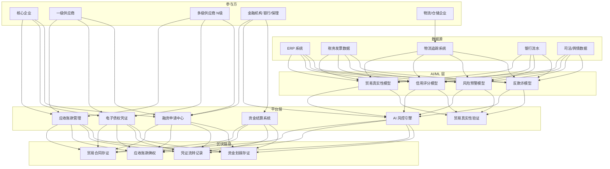
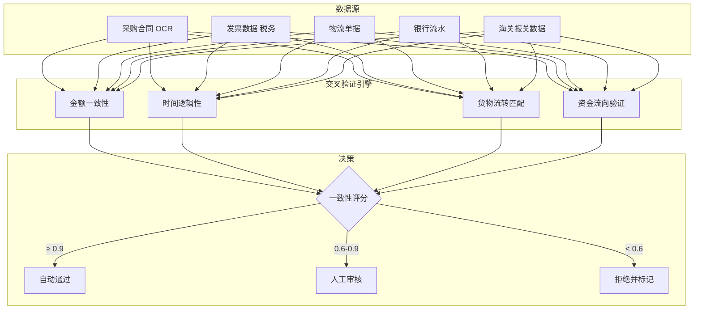

> **生产环境安全提示**
>
> 本文档包含可直接执行的运维命令。执行前请确认：当前目标集群与 Namespace 是否正确；是否具备足够的 RBAC 权限；是否已在非生产环境验证。命令风险等级标注：🔴 高风险（可能造成数据丢失或服务中断）、🟡 中风险（会修改集群状态，但通常可回滚）、🟢 低风险/只读（信息收集，无副作用）。


title: 供应链金融架构设计
description: '# 供应链金融架构设计 — 阿里云视角'
category: application-architecture
tags:
- k8s
- architecture
- industry
- [[Prometheus|prometheus]]
- opa
- redis
- mysql
- rag
last_updated: 2026-05-18
difficulty: advanced
reading_level: advanced
audience:
- 供应链金融架构师
- 区块链开发工程师
- 风控建模工程师
- 金融科技专家
estimated_read_time: 5min
intent_queries:
- 区块链供应链金融平台架构
- 电子债权凭证拆分流转
- AI 风控引擎信用评估
- 贸易真实性四流合一验证
- 蚂蚁链 BaaS 金融应用
trigger_keywords:
- 供应链金融
- 区块链
- 电子债权凭证
- AI风控
- 信用评估
- 贸易真实性
- 反欺诈
- 隐私计算
- 联邦学习
- 融资授信
related_domains:
- 网络
- 故障诊断
related_topics:
- topic-blockchain-architecture
- topic-fintech-architecture
authors:
- name: KUDIG Team
  role: contributor
k8s_versions:
- '1.28'
- '1.29'
- '1.30'
- '1.31'
- '1.32'
---

# 供应链金融架构设计 — 阿里云视角

> **适用版本**: [[Kubernetes|Kubernetes]] v1.29 - v1.33 | **最后更新**: 2026-04-24
> **作者**: 阿里云解决方案架构师 | **标签**: `#供应链金融` `#区块链` `#保理` `#阿里云`

---

<!-- chunk: 目录 -->## 目录

1. [行业概述](#1-行业概述)
2. [业务场景](#2-业务场景)
3. [架构设计](#3-架构设计)
4. [核心技术栈](#4-核心技术栈)
5. [Kubernetes 部署方案](#5-kubernetes-部署方案)
6. [数据架构](#6-数据架构)
7. [AI/ML 组件](#7-aiml-组件)
8. [安全与合规](#8-安全与合规)
9. [最佳实践](#9-最佳实践)
10. [反模式](#10-反模式)
11. [参考资源](#11-参考资源)

---

<!-- chunk: 1. 行业概述 -->## 1. 行业概述

## 1.1 市场规模与趋势

供应链金融解决中小微企业融资难题，通过核心企业信用多级传导降低融资成本。中国供应链金融市场规模预计从 2024 年的 35 万亿元增长到 2030 年的 60 万亿元。区块链、AI 风控和电子债权凭证是三大技术驱动力。政策支持包括《关于规范发展供应链金融 支持供应链产业链稳定循环和优化升级的意见》。

| 指标 | 2024 年 | 2026 年（预测） | 2030 年（预测） |
|:---|:---|:---|:---|
| 中国供应链金融余额 | ¥35T | ¥45T | ¥60T |
| 区块链存证覆盖率 | 20% | 45% | 80% |
| AI 风控渗透率 | 30% | 55% | 85% |
| 电子债权凭证规模 | ¥5T | ¥15T | ¥40T |
| 融资审批时效 | 3-7 天 | 1-3 天 | 实时 |

## 1.2 行业痛点

| 痛点 | 说明 | 数字化转型驱动 |
|:---|:---|:---|
| 信任传递难 | 核心企业信用难以多级传导 | 区块链存证 + 电子债权凭证 |
| 贸易真实性 | 虚假贸易/重复融资风险 | 物流/税务/资金流交叉验证 |
| 资金效率低 | 账期长、周转慢 | 自动化放款 + 智能合约 |
| 风险传导 | 供应链风险沿链传导 | AI 实时风控 + 预警 |
| 多方协同难 | 核心/供应商/金融机构协作 | 联盟链 + 统一平台 |
| 合规监管 | 银保监会/央行监管 | 审计追踪 + 数据上报 |

## 1.3 数字化转型架构影响

供应链金融架构需要覆盖参与方层（核心企业/多级供应商/金融机构/物流）、平台层（应收账款管理/电子债权凭证/融资申请/风控引擎/资金结算）、区块链层（贸易存证/确权/流转记录）和数据源层（ERP/税务/物流/银行流水）。核心挑战是贸易真实性验证和信用多级传导的安全性。

---

<!-- chunk: 2. 业务场景 -->## 2. 业务场景

## 2.1 应收账款保理融资

供应商基于对核心企业的应收账款向金融机构申请融资。核心企业在平台确认应付账款，区块链存证确权，金融机构基于确权信息进行风控评估和放款。融资利率比传统贷款低 2-5 个百分点。

## 2.2 电子债权凭证拆分流转

核心企业向一级供应商开具电子债权凭证（类似数字欠条），凭证可在供应链上逐级拆分流转。一级供应商可将凭证拆分后转让给二级供应商，实现核心企业信用的多级传导。凭证到期由核心企业兑付。

## 2.3 订单融资

基于核心企业的采购订单，供应商在发货前即可获得融资支持。系统需要验证订单真实性、供应商履约能力，并设置合理的融资比例（通常为订单金额的 60-80%）。

## 2.4 存货质押融资

供应商以库存商品作为质押物获得融资。系统通过 IoT 传感器实时监控仓库库存，AI 分析库存价值和流动性，动态调整质押率和预警线。

## 2.5 AI 供应链风险监控

实时监控供应链上下游企业的经营状况、舆情信息、司法风险和财务健康度。当核心企业或关键供应商出现风险信号时，系统自动预警并建议风险缓释措施。

---

<!-- chunk: 3. 架构设计 -->## 3. 架构设计

## 3.1 供应链金融全景架构



---

<!-- chunk: 4. 核心技术栈 -->## 4. 核心技术栈

| Component | Purpose | Technology | License |
|:---|:---|:---|:---|
| Container Orchestration | Platform management | ACK Pro | Proprietary |
| Blockchain | Trade evidence & trust | 蚂蚁链 BaaS / Hyperledger Fabric | Proprietary / Apache 2.0 |
| Smart Contract | Voucher lifecycle | Solidity / Chaincode | Open |
| AI Platform | Risk modeling | PAI / PyTorch | Proprietary / BSD |
| Relational DB | Business data | PolarDB MySQL | Proprietary |
| Cache | Hot data | Redis Enterprise | Proprietary |
| Message Queue | Event-driven processing | RocketMQ 5.x | Apache 2.0 |
| Identity Verification | KYC / eKYC | 阿里云实人认证 | Proprietary |
| OCR | Invoice & contract recognition | 阿里云 OCR | Proprietary |
| Search Engine | Risk data search | OpenSearch | Apache 2.0 |
| Object Storage | Document storage | OSS (加密) | Proprietary |
| Monitoring | Observability | ARMS + SLS | Proprietary |

---

<!-- chunk: 5. Kubernetes 部署方案 -->## 5. Kubernetes 部署方案

## 5.1 供应链金融平台 Deployment

```yaml
apiVersion: apps/v1
kind: Deployment
metadata:
  name: scf-platform
  namespace: supply-chain-finance
  labels:
    app: scf-platform
    tier: core-service
    compliance: financial
spec:
  replicas: 6
  selector:
    matchLabels:
      app: scf-platform
  strategy:
    rollingUpdate:
      maxSurge: 1
      maxUnavailable: 0
  template:
    metadata:
      labels:
        app: scf-platform
        tier: core-service
      annotations:
        prometheus.io/scrape: "true"
        prometheus.io/port: "9090"
    spec:
      affinity:
        podAntiAffinity:
          requiredDuringSchedulingIgnoredDuringExecution:
            - labelSelector:
                matchLabels:
                  app: scf-platform
              topologyKey: topology.kubernetes.io/zone
      containers:
        - name: platform
          image: registry.cn-hangzhou.aliyuncs.com/scf/platform:v4.0.0
          ports:
            - containerPort: 8080
              name: http
            - containerPort: 9090
              name: metrics
          env:
            - name: BLOCKCHAIN_NODE
              valueFrom:
                configMapKeyRef:
                  name: scf-config
                  key: blockchain-node-url
            - name: RISK_ENGINE_URL
              value: "http://risk-engine:8080"
            - name: DB_CONNECTION
              valueFrom:
                secretKeyRef:
                  name: scf-secrets
                  key: db-connection
            - name: REDIS_URL
              valueFrom:
                secretKeyRef:
                  name: scf-secrets
                  key: redis-url
            - name: KMS_KEY_ID
              valueFrom:
                secretKeyRef:
                  name: scf-secrets
                  key: kms-key-id
            - name: AUDIT_ENABLED
              value: "true"
          resources:
            requests:
              memory: "4Gi"
              cpu: "2000m"
            limits:
              memory: "8Gi"
              cpu: "4000m"
          readinessProbe:
            httpGet:
              path: /health/ready
              port: 8080
            initialDelaySeconds: 20
            periodSeconds: 5
          livenessProbe:
            httpGet:
              path: /health/live
              port: 8080
            initialDelaySeconds: 40
            periodSeconds: 10
```

## 5.2 AI 风控引擎 Deployment

```yaml
apiVersion: apps/v1
kind: Deployment
metadata:
  name: risk-engine
  namespace: supply-chain-finance
spec:
  replicas: 4
  selector:
    matchLabels:
      app: risk-engine
  template:
    metadata:
      labels:
        app: risk-engine
    spec:
      containers:
        - name: risk
          image: registry.cn-hangzhou.aliyuncs.com/scf/risk-engine:v3.0.0
          ports:
            - containerPort: 8080
          env:
            - name: MODEL_PATH
              value: "/models/risk-v5"
            - name: MAX_INFERENCE_MS
              value: "500"
            - name: CROSS_VALIDATION_ENABLED
              value: "true"
          resources:
            requests:
              memory: "4Gi"
              cpu: "2000m"
            limits:
              memory: "8Gi"
              cpu: "4000m"
```

## 5.3 ConfigMap, Service 与 Secret

```yaml
apiVersion: v1
kind: ConfigMap
metadata:
  name: scf-config
  namespace: supply-chain-finance
data:
  blockchain-node-url: "http://antchain-baas:8080"
  voucher-config: |
    {
      "max_split_levels": 5,
      "min_amount": 10000,
      "max_validity_days": 365,
      "transfer_fee_rate": 0.001
    }
  risk-config: |
    {
      "cross_validation_sources": ["invoice", "logistics", "bank_statement", "tax"],
      "consistency_threshold": 0.9,
      "auto_approval_threshold": 0.85,
      "manual_review_threshold": 0.6
    }
  compliance-config: |
    {
      "cbrc_reporting_enabled": true,
      "aml_check_enabled": true,
      "kyc_required": true,
      "max_single_loan_amount": 5000000
    }
---
apiVersion: v1
kind: Service
metadata:
  name: scf-platform
  namespace: supply-chain-finance
spec:
  selector:
    app: scf-platform
  ports:
    - name: http
      port: 8080
      targetPort: 8080
    - name: metrics
      port: 9090
      targetPort: 9090
  type: ClusterIP
---
apiVersion: v1
kind: Secret
metadata:
  name: scf-secrets
  namespace: supply-chain-finance
type: Opaque
stringData:
  db-connection: "mysql://scf@polardb.scf.rds.aliyuncs.com:3306/scf_db"
  redis-url: "redis://:password@redis-scf.rds.aliyuncs.com:6379/0"
  kms-key-id: "kms-key-id-placeholder"
  blockchain-private-key: "blockchain-key-placeholder"
  bank-api-key: "bank-api-key-placeholder"
```

---

<!-- chunk: 6. 数据架构 -->## 6. 数据架构

## 6.1 贸易真实性验证数据流



## 6.2 数据流说明

- **贸易数据流**: 合同/发票/物流数据经 OCR 识别后进行交叉验证，验证结果区块链存证
- **凭证流转流**: 电子债权凭证的拆分/转让/兑付全程上链记录
- **风控数据流**: 多源数据实时接入 AI 风控引擎，输出信用评分和风险等级
- **资金结算流**: 放款/还款通过银行接口执行，资金划拨记录上链

---

<!-- chunk: 7. AI/ML 组件 -->## 7. AI/ML 组件

## 7.1 核心模型

| 模型 | 用途 | 输入 | 输出 | 框架 |
|:---|:---|:---|:---|:---|
| 信用评分 | 企业信用评级 | 财务/交易/司法数据 | 信用分数 (300-850) | XGBoost |
| 贸易真实性 | 贸易背景真实性验证 | 合同/发票/物流/流水 | 一致性评分 (0-1) | 规则 + ML |
| 反欺诈 | 虚假贸易/重复融资检测 | 贸易数据/历史行为 | 欺诈概率 | Graph Neural Network |
| 风险预警 | 供应链风险传导预警 | 舆情/司法/经营数据 | 风险等级 + 原因 | BERT + GNN |
| 流动性预测 | 资金需求预测 | 历史融资/还款数据 | 未来资金需求 | LSTM |
| 发票验真 | 虚假发票识别 | 发票图像/数据 | 真伪判断 | OCR + 规则 |

---

<!-- chunk: 8. 安全与合规 -->## 8. 安全与合规

## 8.1 行业法规与标准

| 法规/标准 | 适用范围 | 架构要求 |
|:---|:---|:---|
| 银保监会供应链金融通知 | 供应链金融监管 | 贸易真实性 + 风险管理 |
| 反洗钱法 AML | 反洗钱合规 | 客户身份识别 + 可疑交易监测 |
| 电子签名法 | 电子合同效力 | CA 数字签名 + 时间戳 |
| 网络安全法 | 金融数据安全 | 等保三级 + 数据加密 |
| 个人信息保护法 | 企业信息保护 | 信息分类分级 + 最小权限 |
| 央行征信管理 | 征信数据管理 | 征信数据合规使用 |
| 区块链信息服务备案 | 区块链服务合规 | 区块链服务备案 |

## 8.2 安全架构要点

- **区块链不可篡改**: 所有贸易确权和资金流转数据上链存证
- **数据加密**: 企业财务数据、银行流水等敏感信息使用 KMS 加密
- **隐私计算**: 多方数据融合验证时使用联邦学习/隐私求交，不泄露原始数据
- **数字签名**: 电子合同和凭证使用 CA 数字签名，法律效力
- **审计追踪**: 全链路操作审计，不可篡改

---

<!-- chunk: 9. 最佳实践 -->## 9. 最佳实践

1. **贸易真实性四流合一**: 合同流、发票流、物流流、资金流四流交叉验证
2. **区块链存证关键节点**: 确权、流转、放款、还款等关键节点全部上链
3. **电子凭证拆分限制**: 限制凭证拆分层级（≤5级），防止信用过度传导
4. **AI 风控实时化**: 从事后风控转向实时风控，风险信号秒级响应
5. **隐私保护计算**: 金融机构间数据验证使用隐私计算技术，不直接交换原始数据
6. **自动化合规**: 自动完成 AML 检查、KYC 认证和监管数据上报
7. **多机构联盟链**: 银行、保理、核心企业共建联盟链，共享信任基础
8. **动态额度管理**: 根据企业实时经营状况动态调整授信额度
9. **预警早于违约**: AI 模型在企业违约前 30-90 天发出预警
10. **资金闭环管理**: 放款资金定向支付，确保用途真实

---

<!-- chunk: 10. 反模式 -->## 10. 反模式

1. **区块链形式主义**: 仅在表面使用区块链存证，关键数据链下可篡改。应核心数据强制上链
2. **忽视贸易真实性**: 仅看核心企业信用背书，不验证贸易背景真实性。应四流合一交叉验证
3. **过度信用传导**: 凭证无限拆分流转，5 级之后信用已严重衰减。应限制拆分层级
4. **数据孤岛风控**: 风控仅依赖单一数据源（如核心企业数据），无法全面评估。应多源交叉验证
5. **忽视反洗钱**: 未进行 AML/KYC 检查，为洗钱提供通道。应强制 AML 合规

---

<!-- chunk: 11. 参考资源 -->## 11. 参考资源

- [银保监会供应链金融通知](https://www.cbirc.gov.cn/)
- [蚂蚁链 BaaS 文档](https://help.aliyun.com/product/85221.html)
- [Hyperledger Fabric](https://www.hyperledger.org/projects/fabric)
- [供应链金融白皮书](https://www.nifa.org.cn/)
- [阿里云实人认证文档](https://help.aliyun.com/product/28308.html)
- [阿里云 OCR 文档](https://help.aliyun.com/product/30413.html)

---

**维护者**: 阿里云解决方案架构师团队 | **许可证**: MIT

---

<!-- chunk: Obsidian 相关文档 -->## Obsidian 相关文档

- topic-application-architecture MOC
- [[应用模式/topic-application-architecture/README.md|Topic 应用层架构设计最佳实践]]
- [[应用模式/topic-application-architecture/01-ecommerce-architecture.md|电商系统 Kubernetes 生产架构设计]]
- [[应用模式/topic-application-architecture/02-mini-program-architecture.md|小程序平台架构设计]]
- [[应用模式/topic-application-architecture/03-cms-architecture.md|内容管理系统 CMS 架构设计]]
- [[应用模式/topic-application-architecture/04-im-rtc-architecture.md|实时通信 IM/RTC 架构设计]]
- [[应用模式/topic-application-architecture/05-online-education-architecture.md|在线教育平台 Kubernetes 生产架构设计]]
- [[应用模式/topic-application-architecture/06-fintech-architecture.md|金融科技FinTech Kubernetes生产架构设计]]
- [[应用模式/topic-application-architecture/07-iot-platform-architecture.md|物联网 IoT 平台架构设计]]
- [[应用模式/topic-application-architecture/08-ai-ml-inference-architecture.md|AI/ML 推理服务 Kubernetes 生产架构设计]]
- [[应用模式/topic-application-architecture/09-gaming-backend-architecture.md|游戏后端 Kubernetes 生产架构设计]]
- [[应用模式/topic-application-architecture/10-social-media-architecture.md|社交媒体平台Kubernetes生产架构设计]]

## See Also

- 36-carbon-esg-management
- 37-pet-economy
- 39-smart-campus
- 40-cloud-gaming


<!-- risk-assessed -->
