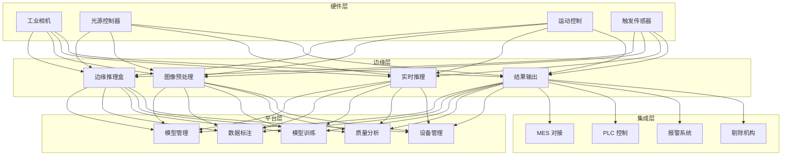
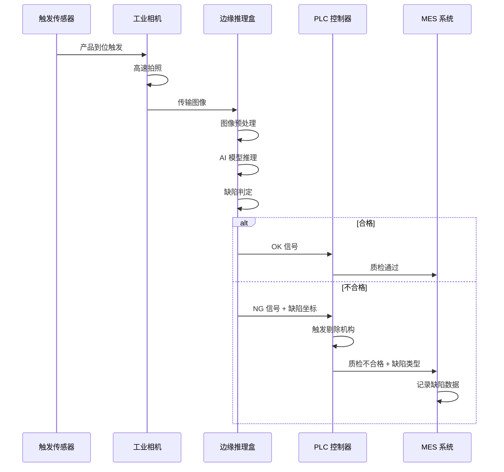
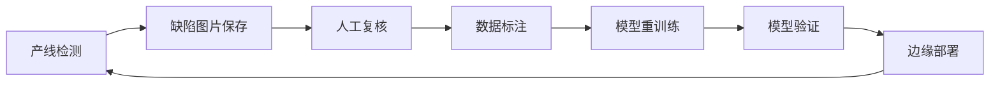

> **生产环境安全提示**
>
> 本文档包含可直接执行的运维命令。执行前请确认：当前目标集群与 Namespace 是否正确；是否具备足够的 RBAC 权限；是否已在非生产环境验证。命令风险等级标注：🔴 高风险（可能造成数据丢失或服务中断）、🟡 中风险（会修改集群状态，但通常可回滚）、🟢 低风险/只读（信息收集，无副作用）。


title: 工业视觉检测架构设计
description: '# 工业视觉检测架构设计 — 阿里云视角'
category: application-architecture
tags:
- k8s
- architecture
- industry
- gpu
- nvidia
last_updated: 2026-05-18
difficulty: advanced
reading_level: advanced
audience:
- 视觉算法工程师
- 工业自动化架构师
- 后端开发工程师
estimated_read_time: 5min
intent_queries:
- 工业视觉检测 AOI [[Kubernetes|Kubernetes]] 部署方案
- YOLOv8 缺陷检测模型训练与部署
- 边缘推理 GPU 集群架构设计
- PCB/半导体/锂电池视觉检测方案
- 机器视觉与 PLC/MES 系统集成
trigger_keywords:
- 工业视觉
- AOI自动光学检测
- 缺陷检测
- YOLOv8
- 边缘推理
- GPU训练
- 产线集成
- 模型部署
- 阿里云PAI
related_domains:
- 网络
- 故障诊断
related_topics:
- topic-ai-algorithm
- topic-iot-platform-architecture
authors:
- name: KUDIG Team
  role: contributor
k8s_versions:
- '1.28'
- '1.29'
- '1.30'
- '1.31'
- '1.32'
---

# 工业视觉检测架构设计 — 阿里云视角

> **适用版本**: Kubernetes v1.29 - v1.33 | **最后更新**: 2026-04-24
> **作者**: 阿里云解决方案架构师 | **标签**: `#工业视觉` `#AOI` `#缺陷检测` `#阿里云`

---

## 目录

1. [行业背景](#1-行业背景)
2. [业务架构](#2-业务架构)
3. [技术架构](#3-技术架构)
4. [核心数据流](#4-核心数据流)
5. [安全与合规](#5-安全与合规)
6. [可观测性](#6-可观测性)
7. [阿里云组件映射](#7-阿里云组件映射)
8. [生产检查清单](#8-生产检查清单)

---

## 1. 行业背景

### 1.1 业务特点

工业视觉检测（AOI）用机器视觉替代人工质检：

| 挑战 | 说明 | 架构影响 |
|:---|:---|:---|
| 检测速度 | 产线高速运动 | 高帧率相机 + 边缘推理 |
| 缺陷多样 | 微小缺陷难识别 | 深度学习 + 数据增强 |
| 产线集成 | 与 PLC/MES 对接 | 标准接口 + 低延迟 |
| 模型迭代 | 新缺陷持续出现 | 数据闭环 + 在线学习 |
| 环境干扰 | 光照/振动/灰尘 | 图像预处理 |

### 1.2 核心场景

- **PCB 检测**: 焊点/元件/线路缺陷
- **半导体检测**: 晶圆/芯片缺陷
- **锂电池检测**: 极片/隔膜/外观缺陷
- **汽车零部件**: 尺寸/表面/装配检测
- **食品医药**: 异物/包装/标签检测

---

## 2. 业务架构

### 2.1 工业视觉检测全景架构



### 2.2 检测流水线时序



---

## 3. 技术架构

### 3.1 K8s 部署

```yaml
# 模型训练 GPU Deployment
apiVersion: apps/v1
kind: Deployment
metadata:
  name: vision-model-training
  namespace: industrial-visual
spec:
  replicas: 2
  selector:
    matchLabels:
      app: vision-model-training
  template:
    metadata:
      labels:
        app: vision-model-training
    spec:
      nodeSelector:
        accelerator: nvidia-a100
      runtimeClassName: nvidia
      containers:
        - name: trainer
          image: registry.cn-hangzhou.aliyuncs.com/vision/model-training:v2.0.0-gpu
          ports:
            - containerPort: 8080
          env:
            - name: MODEL_TYPE
              value: "yolov8-seg"
            - name: BATCH_SIZE
              value: "32"
          resources:
            requests:
              nvidia.com/gpu: 2
              memory: "64Gi"
              cpu: "16000m"
            limits:
              nvidia.com/gpu: 2
              memory: "128Gi"
              cpu: "32000m"
          volumeMounts:
            - name: dataset-volume
              mountPath: /datasets
            - name: model-output
              mountPath: /models
      volumes:
        - name: dataset-volume
          persistentVolumeClaim:
            claimName: vision-dataset-pvc
        - name: model-output
          persistentVolumeClaim:
            claimName: vision-model-pvc
```

---

## 4. 核心数据流

### 4.1 缺陷数据闭环



---

## 5. 安全与合规

- **产线安全**: 检测系统不影响生产节拍
- **数据安全**: 产品图片保密
- **质量合规**: 检测标准符合行业规范

---

## 6. 可观测性

- **检测速度**: 单件 < 100ms
- **检测准确率**: > 99.5%
- **误检率**: < 0.5%

---

## 7. 阿里云组件映射

| 功能域 | **阿里云云原生方案** |
|:---|:---|
| 容器平台 | **ACK Pro + GPU** |
| AI | **PAI / 视觉智能** |
| 对象存储 | **OSS** |
| 数据库 | **PolarDB** |
| 可观测性 | **ARMS + SLS** |

---

## 8. 生产检查清单

- [ ] 检测速度满足产线节拍
- [ ] 缺陷检出率 > 99.5%
- [ ] 与 PLC/MES 接口联调
- [ ] 光照稳定性验证
- [ ] 模型版本管理规范

---

**维护者**: 阿里云解决方案架构师团队 | **许可证**: MIT

---

## Obsidian 相关文档

- topic-application-architecture KUDIG Database — Global MOC
- [[应用模式/topic-application-architecture/README.md|[[Topic 应用层架构设计最佳实践|Topic 应用层架构设计最佳实践]]]]
- [[应用模式/topic-application-architecture/01-ecommerce-architecture.md|电商系统 Kubernetes 生产架构设计]]
- [[应用模式/topic-application-architecture/02-mini-program-architecture.md|小程序平台架构设计]]
- [[应用模式/topic-application-architecture/03-cms-architecture.md|内容管理系统 CMS 架构设计]]
- [[应用模式/topic-application-architecture/04-im-rtc-architecture.md|实时通信 IM/RTC 架构设计]]
- [[应用模式/topic-application-architecture/05-online-education-architecture.md|在线教育平台 Kubernetes 生产架构设计]]
- [[应用模式/topic-application-architecture/06-fintech-architecture.md|金融科技FinTech Kubernetes生产架构设计]]
- [[应用模式/topic-application-architecture/07-iot-platform-architecture.md|物联网 IoT 平台架构设计]]
- [[应用模式/topic-application-architecture/08-ai-ml-inference-architecture.md|AI/ML 推理服务 Kubernetes 生产架构设计]]
- [[应用模式/topic-application-architecture/09-gaming-backend-architecture.md|游戏后端 Kubernetes 生产架构设计]]
- [[应用模式/topic-application-architecture/10-social-media-architecture.md|社交媒体平台Kubernetes生产架构设计]]

## See Also

- 61-smart-grid
- 62-distributed-energy
- 64-ai-drug-discovery
- 65-autonomous-driving-sim

## Related

- topic-application-architecture MOC — Cross-reference


<!-- risk-assessed -->
