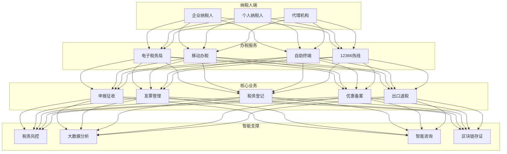
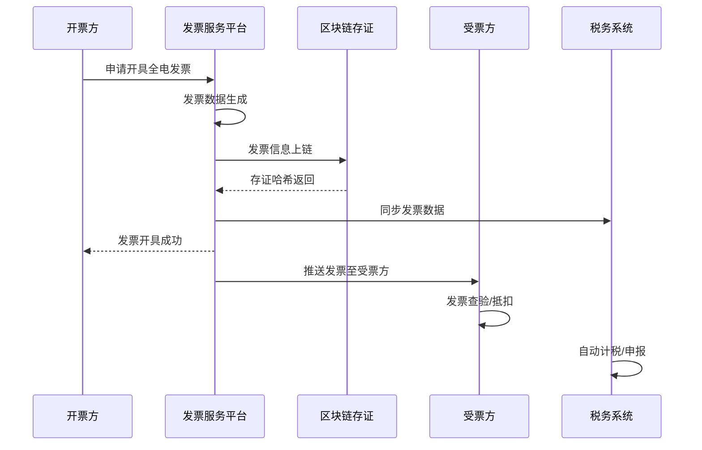
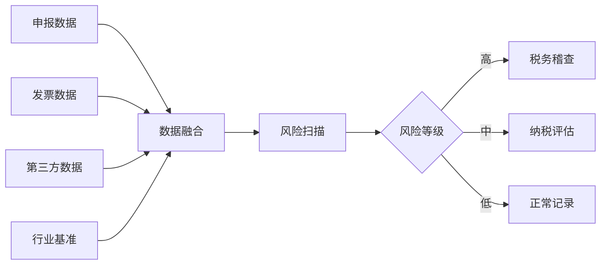

> **生产环境安全提示**
>
> 本文档包含可直接执行的运维命令。执行前请确认：当前目标集群与 Namespace 是否正确；是否具备足够的 RBAC 权限；是否已在非生产环境验证。命令风险等级标注：🔴 高风险（可能造成数据丢失或服务中断）、🟡 中风险（会修改集群状态，但通常可回滚）、🟢 低风险/只读（信息收集，无副作用）。


title: 智慧税务架构设计
description: '# 智慧税务架构设计 — 阿里云视角'
category: application-architecture
tags:
- k8s
- architecture
- industry
- redis
- operator
- gpu
- nvidia
last_updated: 2026-05-18
difficulty: advanced
reading_level: advanced
audience:
- 税务信息化架构师
- 税务系统开发者
- 合规专家
estimated_read_time: 5min
intent_queries:
- 电子税务局 [[Kubernetes|Kubernetes]] 高可用架构
- 全电发票区块链存证系统
- 税务风控 AI 模型预测
- 国密算法 SM2 SM3 SM4
- 阿里云 PolarDB 税务数据库
trigger_keywords:
- 智慧税务
- 电子税务局
- 全电发票
- 区块链存证
- 税务风控
- 国密算法
- 等保三级
- 金税工程
- 发票管理
- 大数据治税
related_domains:
- 网络
- 故障诊断
related_topics:
- topic-government-architecture
- topic-fintech-architecture
authors:
- name: KUDIG Team
  role: contributor
k8s_versions:
- '1.28'
- '1.29'
- '1.30'
- '1.31'
- '1.32'
---

# 智慧税务架构设计 — 阿里云视角

> **适用版本**: Kubernetes v1.29 - v1.33 | **最后更新**: 2026-04-24
> **作者**: 阿里云解决方案架构师 | **标签**: `#智慧税务` `#电子税务局` `#发票` `#阿里云`

---

## 目录

1. [行业背景](#1-行业背景)
2. [业务架构](#2-业务架构)
3. [技术架构](#3-技术架构)
4. [核心数据流](#4-核心数据流)
5. [安全与合规](#5-安全与合规)
6. [可观测性](#6-可观测性)
7. [阿里云组件映射](#7-阿里云组件映射)
8. [生产检查清单](#8-生产检查清单)

---

## 1. 行业背景

### 1.1 业务特点

智慧税务通过数字化手段提升税收治理效能：

| 挑战 | 说明 | 架构影响 |
|:---|:---|:---|
| 高并发申报 | 征期集中申报高峰 | 弹性伸缩 + 限流 |
| 发票管理 | 全电发票全国推广 | 区块链存证 |
| 风控精准 | 虚开发票/偷逃税识别 | 大数据 + AI |
| 数据融合 | 跨部门数据共享 | 数据交换平台 |
| 便民服务 | 纳税人办税体验 | 多端统一 |

### 1.2 核心场景

- **电子税务局**: 网上办税/移动端办税
- **全电发票**: 发票开具/流转/归档
- **税务风控**: 风险扫描/预警/应对
- **大数据治税**: 收入分析/税源监控
- **银税互动**: 纳税信用贷款

---

## 2. 业务架构

### 2.1 智慧税务全景架构



### 2.2 全电发票流转时序



---

## 3. 技术架构

### 3.1 K8s 部署

```yaml
# 电子税务局前端 Deployment
apiVersion: apps/v1
kind: Deployment
metadata:
  name: etax-frontend
  namespace: smart-tax
spec:
  replicas: 10
  selector:
    matchLabels:
      app: etax-frontend
  template:
    metadata:
      labels:
        app: etax-frontend
    spec:
      affinity:
        podAntiAffinity:
          requiredDuringSchedulingIgnoredDuringExecution:
            - labelSelector:
                matchExpressions:
                  - key: app
                    operator: In
                    values: [etax-frontend]
              topologyKey: topology.kubernetes.io/zone
      containers:
        - name: frontend
          image: registry.cn-hangzhou.aliyuncs.com/tax/etax-frontend:v5.0.0
          ports:
            - containerPort: 3000
          env:
            - name: CDN_DOMAIN
              value: "https://cdn.etax.gov.cn"
          resources:
            requests:
              memory: "1Gi"
              cpu: "500m"
            limits:
              memory: "2Gi"
              cpu: "1000m"
```

```yaml
# 税务风控引擎 Deployment
apiVersion: apps/v1
kind: Deployment
metadata:
  name: tax-risk-engine
  namespace: smart-tax
spec:
  replicas: 5
  selector:
    matchLabels:
      app: tax-risk-engine
  template:
    metadata:
      labels:
        app: tax-risk-engine
    spec:
      nodeSelector:
        accelerator: nvidia-t4
      runtimeClassName: nvidia
      containers:
        - name: risk
          image: registry.cn-hangzhou.aliyuncs.com/tax/risk-engine:v3.0.0-gpu
          ports:
            - containerPort: 8080
          env:
            - name: RISK_MODEL_VERSION
              value: "v2026.04"
            - name: ALERT_THRESHOLD
              value: "0.85"
          resources:
            requests:
              nvidia.com/gpu: 1
              memory: "8Gi"
              cpu: "4000m"
            limits:
              nvidia.com/gpu: 1
              memory: "16Gi"
              cpu: "8000m"
```

---

## 4. 核心数据流

### 4.1 税务大数据风控



---

## 5. 安全与合规

- **数据安全**: 纳税人涉税信息加密
- **等保三级**: 税务系统等级保护
- **国密算法**: SM2/SM3/SM4
- **审计追踪**: 操作全程留痕

---

## 6. 可观测性

- **申报响应**: P99 < 3s
- **发票开具**: P99 < 1s
- **系统可用性**: 99.99%

---

## 7. 阿里云组件映射

| 功能域 | **阿里云云原生方案** |
|:---|:---|
| 容器平台 | **ACK Pro** |
| 数据库 | **PolarDB** |
| 缓存 | **Redis 企业版** |
| 区块链 | **蚂蚁链 BaaS** |
| AI | **PAI** |
| 大数据 | **MaxCompute** |
| 可观测性 | **ARMS + SLS** |

---

## 8. 生产检查清单

- [ ] 征期弹性扩容验证
- [ ] 全电发票区块链存证完整性
- [ ] 风控模型准确率 > 95%
- [ ] 国密算法全链路验证
- [ ] 等保三级合规审计

---

**维护者**: 阿里云解决方案架构师团队 | **许可证**: MIT

---

## Obsidian 相关文档

- topic-application-architecture KUDIG Database — Global MOC
- [[应用模式/topic-application-architecture/README.md|[[Topic 应用层架构设计最佳实践|Topic 应用层架构设计最佳实践]]]]
- [[应用模式/topic-application-architecture/01-ecommerce-architecture.md|电商系统 Kubernetes 生产架构设计]]
- [[应用模式/topic-application-architecture/02-mini-program-architecture.md|小程序平台架构设计]]
- [[应用模式/topic-application-architecture/03-cms-architecture.md|内容管理系统 CMS 架构设计]]
- [[应用模式/topic-application-architecture/04-im-rtc-architecture.md|实时通信 IM/RTC 架构设计]]
- [[应用模式/topic-application-architecture/05-online-education-architecture.md|在线教育平台 Kubernetes 生产架构设计]]
- [[应用模式/topic-application-architecture/06-fintech-architecture.md|金融科技FinTech Kubernetes生产架构设计]]
- [[应用模式/topic-application-architecture/07-iot-platform-architecture.md|物联网 IoT 平台架构设计]]
- [[应用模式/topic-application-architecture/08-ai-ml-inference-architecture.md|AI/ML 推理服务 Kubernetes 生产架构设计]]
- [[应用模式/topic-application-architecture/09-gaming-backend-architecture.md|游戏后端 Kubernetes 生产架构设计]]
- [[应用模式/topic-application-architecture/10-social-media-architecture.md|社交媒体平台Kubernetes生产架构设计]]

## See Also

- 69-6g-core-network
- 70-ecny-cbdc
- 72-digital-twin-city
- 73-smart-firefighting

## Related

- topic-application-architecture MOC — Cross-reference


<!-- risk-assessed -->
