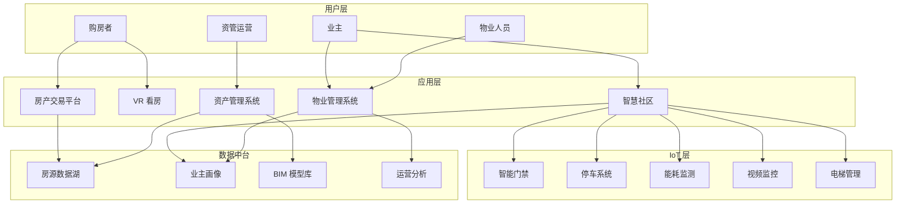
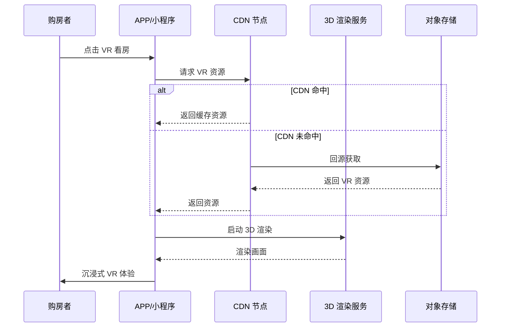
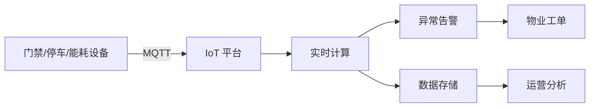

> **生产环境安全提示**
>
> 本文档包含可直接执行的运维命令。执行前请确认：当前目标集群与 Namespace 是否正确；是否具备足够的 RBAC 权限；是否已在非生产环境验证。命令风险等级标注：🔴 高风险（可能造成数据丢失或服务中断）、🟡 中风险（会修改集群状态，但通常可回滚）、🟢 低风险/只读（信息收集，无副作用）。


title: 房地产科技架构设计
description: '# 房地产科技架构设计 — 阿里云视角'
category: application-architecture
tags:
- k8s
- architecture
- industry
- mysql
- gpu
- nvidia
last_updated: 2026-05-18
difficulty: intermediate
reading_level: intermediate
audience:
- 房地产科技架构师
- 智慧社区技术负责人
- SRE
estimated_read_time: 5min
intent_queries:
- 房地产科技 [[Kubernetes|Kubernetes]] PropTech
- 智慧社区 IoT 阿里云架构
- VR看房 Kubernetes GPU渲染
- 房产交易平台 K8s 微服务
- BIM数字化 房地产 Kubernetes
trigger_keywords:
- 房地产科技
- PropTech
- 智慧社区
- VR看房
- IoT
- BIM
- 阿里云
related_domains:
- 集群基础
- 生产运维
- domain-7-observability
related_topics:
- 39-smart-campus
- 72-digital-twin-city
- 52-smart-water
authors:
- name: KUDIG Team
  role: contributor
k8s_versions:
- '1.28'
- '1.29'
- '1.30'
- '1.31'
- '1.32'
---

# 房地产科技架构设计 — 阿里云视角

> **适用版本**: Kubernetes v1.29 - v1.33 | **最后更新**: 2026-04-24
> **作者**: 阿里云解决方案架构师 | **标签**: `#房地产科技` `#PropTech` `#智慧社区` `#阿里云`

---

## 目录

1. [行业背景](#1-行业背景)
2. [业务架构](#2-业务架构)
3. [技术架构](#3-技术架构)
4. [核心数据流](#4-核心数据流)
5. [安全与合规](#5-安全与合规)
6. [可观测性](#6-可观测性)
7. [阿里云组件映射](#7-阿里云组件映射)
8. [生产检查清单](#8-生产检查清单)

---

## 1. 行业背景

### 1.1 业务特点

房地产科技涵盖房产交易、智慧社区、物业运营、空间管理：

| 挑战 | 说明 | 架构影响 |
|:---|:---|:---|
| 交易低频高客单 | 决策周期长、流程复杂 | 长流程工作流 |
| 房源真实性 | 虚假房源治理 | AI 审核 + 实勘 |
| 智慧社区 IoT | 门禁/停车/能耗设备多 | 边缘计算 + 物联网平台 |
| 数据安全 | 业主隐私保护 | 数据加密 + 脱敏 |
| BIM/CIM | 建筑信息模型 | 3D 渲染 + 大数据 |

### 1.2 核心场景

- **房产交易**: 房源发布、VR 看房、在线签约
- **智慧社区**: 门禁、停车、能耗、安防
- **物业运营**: 工单管理、设备运维、业主服务
- **资产管理**: 空间规划、租约管理、收益分析

---

## 2. 业务架构

### 2.1 房地产科技全景



### 2.2 VR 看房时序



---

## 3. 技术架构

### 3.1 K8s 部署

```yaml
# VR 渲染服务 GPU Deployment
apiVersion: apps/v1
kind: Deployment
metadata:
  name: vr-render-service
  namespace: proptech
spec:
  replicas: 3
  selector:
    matchLabels:
      app: vr-render-service
  template:
    metadata:
      labels:
        app: vr-render-service
    spec:
      nodeSelector:
        accelerator: nvidia-t4
      runtimeClassName: nvidia
      containers:
        - name: render
          image: registry.cn-hangzhou.aliyuncs.com/proptech/vr-render:v1.2.0-gpu
          ports:
            - containerPort: 8080
          resources:
            requests:
              nvidia.com/gpu: 1
              memory: "8Gi"
              cpu: "4000m"
            limits:
              nvidia.com/gpu: 1
              memory: "16Gi"
              cpu: "8000m"
```

---

## 4. 核心数据流

### 4.1 智慧社区 IoT 数据流



---

## 5. 安全与合规

- **个人信息保护**: 业主信息加密
- **等保三级**: 智慧社区系统
- **视频安全**: 监控数据合规存储

---

## 6. 可观测性

- **VR 加载时间**: P99 < 3s
- **IoT 数据延迟**: < 1s
- **系统可用性**: 99.9%

---

## 7. 阿里云组件映射

| 功能域 | **阿里云云原生方案** |
|:---|:---|
| 容器平台 | **ACK Pro** |
| IoT | **阿里云 IoT 平台** |
| 数据库 | **PolarDB MySQL** |
| 对象存储 | **OSS + CDN** |
| 实时计算 | **Flink** |
| AI | **PAI / 视觉智能** |
| 可观测性 | **ARMS + SLS** |

---

## 8. 生产检查清单

- [ ] VR 资源 CDN 预热
- [ ] IoT 设备接入验证
- [ ] 房源审核准确率测试
- [ ] 业主隐私数据加密验证
- [ ] 等保三级合规审计

---

**维护者**: 阿里云解决方案架构师团队 | **许可证**: MIT

---

## Obsidian 相关文档

- topic-application-architecture KUDIG Database — Global MOC
- [[应用模式/行业架构/README.md|Topic 应用层架构设计最佳实践]]
- [[应用模式/行业架构/01-ecommerce-architecture.md|电商系统 Kubernetes 生产架构设计]]
- [[应用模式/行业架构/02-mini-program-architecture.md|小程序平台架构设计]]
- [[应用模式/行业架构/03-cms-architecture.md|内容管理系统 CMS 架构设计]]
- [[应用模式/行业架构/04-im-rtc-architecture.md|实时通信 IM/RTC 架构设计]]
- [[应用模式/行业架构/05-online-education-architecture.md|在线教育平台 Kubernetes 生产架构设计]]
- [[应用模式/行业架构/06-fintech-architecture.md|金融科技FinTech Kubernetes生产架构设计]]
- [[应用模式/行业架构/07-iot-platform-architecture.md|物联网 IoT 平台架构设计]]
- [[应用模式/行业架构/08-ai-ml-inference-architecture.md|AI/ML 推理服务 Kubernetes 生产架构设计]]
- [[应用模式/行业架构/09-gaming-backend-architecture.md|游戏后端 Kubernetes 生产架构设计]]
- [[应用模式/行业架构/10-social-media-architecture.md|社交媒体平台Kubernetes生产架构设计]]

## See Also

- 26-aviation-travel
- 27-hospitality-tourism
- 29-agritech-iot
- 30-hrtech-saas


<!-- risk-assessed -->
