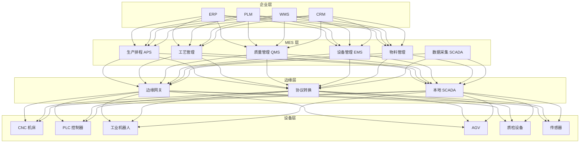
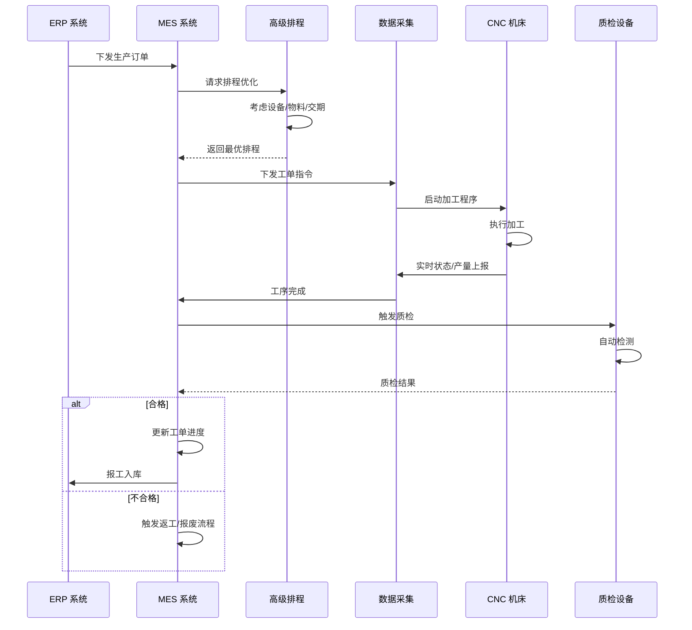
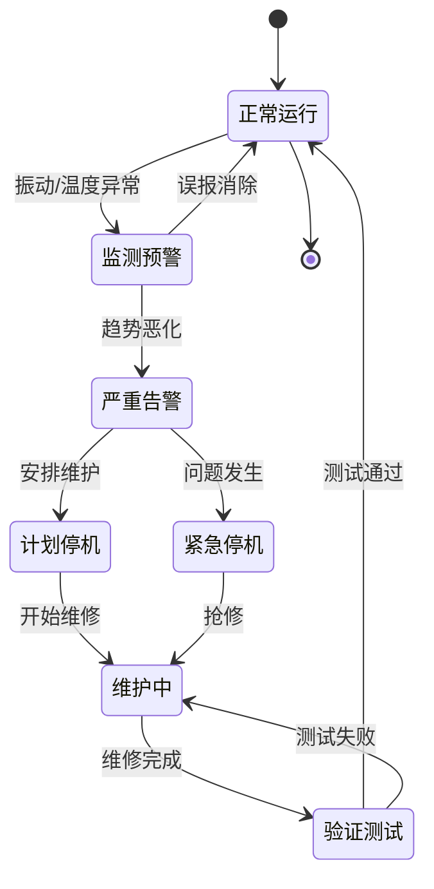
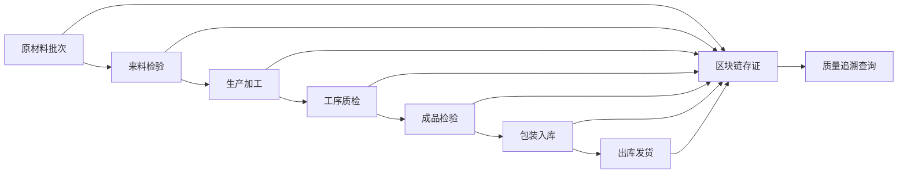
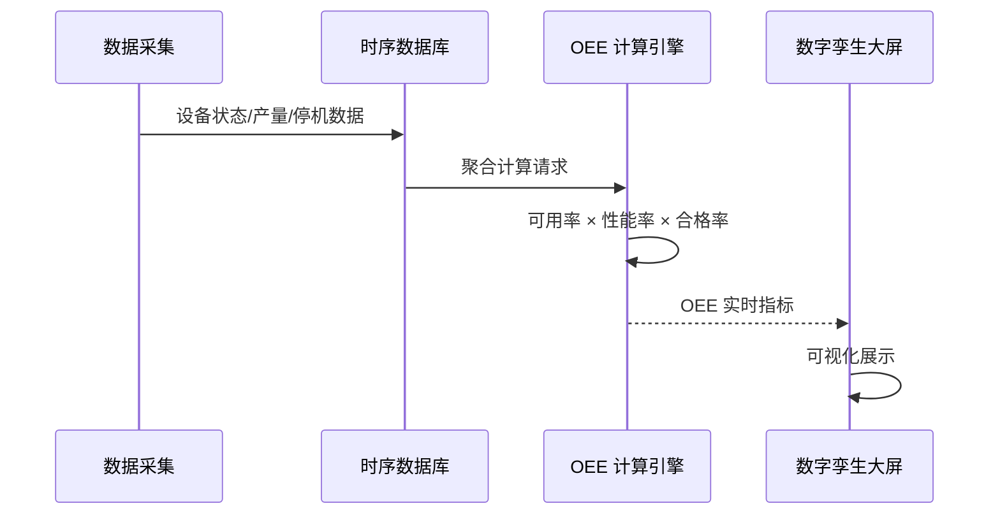

> **生产环境安全提示**
>
> 本文档包含可直接执行的运维命令。执行前请确认：当前目标集群与 Namespace 是否正确；是否具备足够的 RBAC 权限；是否已在非生产环境验证。命令风险等级标注：🔴 高风险（可能造成数据丢失或服务中断）、🟡 中风险（会修改集群状态，但通常可回滚）、🟢 低风险/只读（信息收集，无副作用）。


title: 智能制造MES架构设计
description: '# 智能制造 MES 架构设计 — 阿里云视角'
category: application-architecture
tags:
- k8s
- architecture
- industry
- [[Prometheus|prometheus]]
- grafana
- [[Flux|flux]]
- minio
- mysql
- kafka
- [[DaemonSet|daemonset]]
last_updated: '2026-05-18'
difficulty: expert
reading_level: expert
audience:
- 制造业架构师
- 工控系统工程师
- 阿里云解决方案架构师
- OT/IT融合专家
estimated_read_time: 5min
intent_queries:
- 智能制造MES系统架构设计
- 工业4.0 OPC UA协议K8s部署
- 设备预测性维护AI
- OEE设备综合效率计算
- MES质量追溯区块链
trigger_keywords:
- 智能制造
- MES
- 工业4.0
- OPC UA
- 预测性维护
- OEE
- 数字孪生
- 工控安全
- 边缘计算
- 质量追溯
related_domains:
- 集群基础
- domain-9-ai-ml
- domain-5-iot-edge-computing
- 网络
related_topics:
- 应用模式/topic-application-architecture/47-smart-mining
- 应用模式/topic-application-architecture/80-tsn-network
- 应用模式/topic-application-architecture/61-smart-grid
- 工作负载/topic-functions/05-iot-edge-computing
authors:
- name: KUDIG Team
  role: contributor
k8s_versions:
- '1.28'
- '1.29'
- '1.30'
- '1.31'
- '1.32'
---

# 智能制造 MES 架构设计 — 阿里云视角

> **适用版本**: Kubernetes v1.29 - v1.33 | **最后更新**: 2026-04-24
> **作者**: 阿里云解决方案架构师 | **标签**: `#智能制造` `#MES` `#工业4.0` `#阿里云`

---

## 目录

1. [行业背景](#1-行业背景)
2. [业务架构](#2-业务架构)
3. [技术架构](#3-技术架构)
4. [核心数据流](#4-核心数据流)
5. [安全与合规](#5-安全与合规)
6. [可观测性](#6-可观测性)
7. [阿里云组件映射](#7-阿里云组件映射)
8. [生产检查清单](#8-生产检查清单)

---

## 1. 行业背景

### 1.1 业务特点

制造执行系统（MES）是智能制造的核心，连接计划层与设备层：

| 挑战 | 说明 | 架构影响 |
|:---|:---|:---|
| 产线实时性 | 毫秒级设备数据采集 | 边缘计算 + 时序数据库 |
| 多品种小批量 | 柔性生产切换频繁 | 动态排产 + 数字孪生 |
| 质量追溯 | 全生命周期质量数据 | 区块链存证 |
| 设备互联 | CNC/PLC/机器人协议各异 | 协议网关 + OPC UA |
| OEE 优化 | 设备综合效率提升 | 实时分析 + AI 预测 |

### 1.2 核心场景

- **生产排程**: 基于订单/物料/设备的智能排产
- **工艺管理**: 工艺流程数字化与版本控制
- **质量管控**: SPC 统计过程控制/缺陷追溯
- **设备管理**: 预测性维护/问题预警
- **物料追溯**: 批次/序列号全链路追踪

---

## 2. 业务架构

### 2.1 智能制造 MES 全景架构



### 2.2 生产工单执行时序



### 2.3 设备预测性维护状态机



---

## 3. 技术架构

### 3.1 K8s 部署

```yaml
# MES 核心服务 Deployment
apiVersion: apps/v1
kind: Deployment
metadata:
  name: mes-core
  namespace: smart-manufacturing
spec:
  replicas: 5
  selector:
    matchLabels:
      app: mes-core
  template:
    metadata:
      labels:
        app: mes-core
    spec:
      affinity:
        podAntiAffinity:
          requiredDuringSchedulingIgnoredDuringExecution:
            - labelSelector:
                matchExpressions:
                  - key: app
                    operator: In
                    values: [mes-core]
              topologyKey: topology.kubernetes.io/zone
      containers:
        - name: mes
          image: registry.cn-hangzhou.aliyuncs.com/mfg/mes-core:v6.0.0
          ports:
            - containerPort: 8080
          env:
            - name: DATABASE_URL
              value: "polardb-mfg.rds.aliyuncs.com"
            - name: SCADA_GATEWAY_URL
              value: "http://scada-gateway:8080"
            - name: WORK_SHIFT_MODE
              value: "three-shift"
          resources:
            requests:
              memory: "4Gi"
              cpu: "2000m"
            limits:
              memory: "8Gi"
              cpu: "4000m"
          livenessProbe:
            httpGet:
              path: /health
              port: 8080
            initialDelaySeconds: 60
            periodSeconds: 15
```

```yaml
# 边缘数据采集 DaemonSet
apiVersion: apps/v1
kind: DaemonSet
metadata:
  name: edge-scada-collector
  namespace: smart-manufacturing
spec:
  selector:
    matchLabels:
      app: edge-scada-collector
  template:
    metadata:
      labels:
        app: edge-scada-collector
    spec:
      hostNetwork: true
      nodeSelector:
        node-type: factory-edge
      tolerations:
        - key: "dedicated"
          operator: "Equal"
          value: "factory"
          effect: "NoSchedule"
      containers:
        - name: collector
          image: registry.cn-hangzhou.aliyuncs.com/mfg/scada-collector:v3.2.0
          securityContext:
            privileged: true
          env:
            - name: OPC_UA_ENDPOINT
              value: "opc.tcp://plc-gateway:4840"
            - name: MODBUS_TCP_HOST
              value: "192.168.1.100"
            - name: COLLECTION_INTERVAL_MS
              value: "100"
          resources:
            requests:
              memory: "1Gi"
              cpu: "1000m"
            limits:
              memory: "2Gi"
              cpu: "2000m"
          volumeMounts:
            - name: device-config
              mountPath: /etc/scada/devices
      volumes:
        - name: device-config
          configMap:
            name: scada-device-config
```

```yaml
# AI 质检 GPU Deployment
apiVersion: apps/v1
kind: Deployment
metadata:
  name: ai-quality-inspection
  namespace: smart-manufacturing
spec:
  replicas: 2
  selector:
    matchLabels:
      app: ai-quality-inspection
  template:
    metadata:
      labels:
        app: ai-quality-inspection
    spec:
      nodeSelector:
        accelerator: nvidia-t4
      runtimeClassName: nvidia
      containers:
        - name: inspector
          image: registry.cn-hangzhou.aliyuncs.com/mfg/ai-inspection:v2.1.0-gpu
          ports:
            - containerPort: 8080
          env:
            - name: INSPECTION_MODEL
              value: "defect-detection-v3"
            - name: CONFIDENCE_THRESHOLD
              value: "0.92"
          resources:
            requests:
              nvidia.com/gpu: 1
              memory: "8Gi"
              cpu: "4000m"
            limits:
              nvidia.com/gpu: 1
              memory: "16Gi"
              cpu: "8000m"
          volumeMounts:
            - name: model-volume
              mountPath: /models
      volumes:
        - name: model-volume
          persistentVolumeClaim:
            claimName: ai-inspection-model-pvc
```

---

## 4. 核心数据流

### 4.1 全链路质量追溯



### 4.2 OEE 实时计算



---

## 5. 安全与合规

### 5.1 工业安全体系

| 层级 | 措施 | K8s 实现 |
|:---|:---|:---|
| 网络安全 | 工控网络与企业网隔离 | NetworkPolicy 工控隔离 |
| 数据安全 | 生产数据加密传输 | TLS + mTLS |
| 访问控制 | 操作员权限分级 | RBAC + 命名空间隔离 |
| 审计追溯 | 关键操作不可篡改 | 审计日志 + 区块链 |

---

## 6. 可观测性

- **数据采集延迟**: < 100ms
- **MES 响应时间**: P99 < 500ms
- **设备在线率**: > 99.5%
- **OEE 实时更新**: < 5s

---

## 7. 阿里云组件映射

| 功能域 | 自建/开源方案 | **阿里云云原生方案** | 选型理由 |
|:---|:---|:---|:---|
| 容器平台 | 自建 K8s | **ACK Pro + ACK Edge** | 云边一体管理 |
| 时序数据库 | InfluxDB/TDengine | **Lindorm 时序引擎** | PB 级工业时序数据 |
| 关系数据库 | MySQL/Oracle | **PolarDB MySQL** | 高并发事务处理 |
| 消息队列 | Kafka | **RocketMQ** | 高可靠设备消息 |
| AI 质检 | 自研模型 | **PAI / 视觉智能** | 工业缺陷检测 |
| 数字孪生 | Unity/UE 自建 | **DataV + 阿里云数字孪生** | 3D 产线可视化 |
| IoT 平台 | 自建网关 | **阿里云 IoT 平台** | 多协议设备接入 |
| 对象存储 | MinIO | **OSS** | 质检图片长期存储 |
| 区块链 | 自建链 | **蚂蚁链 BaaS** | 质量数据存证 |
| 可观测性 | Prometheus + Grafana | **ARMS + SLS** | 工业指标监控 |

---

## 8. 生产检查清单

### 8.1 部署前检查

- [ ] OPC UA/Modbus 设备协议兼容性验证
- [ ] 边缘网关离线自治能力测试（断网 24h）
- [ ] 时序数据库写入性能压测（百万点/秒）
- [ ] AI 质检模型准确率 > 95%
- [ ] MES 与 ERP/WMS 接口联调通过
- [ ] 工控网络与企业网安全隔离验证
- [ ] 数字孪生 3D 模型与物理产线同步延迟 < 1s
- [ ] 等保三级/工控安全合规审计

### 8.2 日常运维

- [ ] 每日：OEE 指标、设备问题率、质量合格率
- [ ] 每周：预测性维护模型预测准确率评估
- [ ] 每月：产能利用率分析、瓶颈工序优化
- [ ] 每季：安全漏洞扫描、灾备演练

---

**维护者**: 阿里云解决方案架构师团队 | **许可证**: MIT

---

## Obsidian 相关文档

- topic-application-architecture MOC
- [[应用模式/行业架构/README.md|Topic 应用层架构设计最佳实践]]
- [[应用模式/行业架构/01-ecommerce-architecture.md|电商系统 Kubernetes 生产架构设计]]
- [[应用模式/行业架构/02-mini-program-architecture.md|小程序平台架构设计]]
- [[应用模式/行业架构/03-cms-architecture.md|内容管理系统 CMS 架构设计]]
- [[应用模式/行业架构/04-im-rtc-architecture.md|实时通信 IM/RTC 架构设计]]
- [[应用模式/行业架构/05-online-education-architecture.md|在线教育平台 Kubernetes 生产架构设计]]
- [[应用模式/行业架构/06-fintech-architecture.md|金融科技FinTech Kubernetes生产架构设计]]
- [[应用模式/行业架构/07-iot-platform-architecture.md|物联网 IoT 平台架构设计]]
- [[应用模式/行业架构/08-ai-ml-inference-architecture.md|AI/ML 推理服务 Kubernetes 生产架构设计]]
- [[应用模式/行业架构/09-gaming-backend-architecture.md|游戏后端 Kubernetes 生产架构设计]]
- [[应用模式/行业架构/10-social-media-architecture.md|社交媒体平台Kubernetes生产架构设计]]

## See Also

- 49-livestream-ecommerce
- 50-unmanned-retail
- 52-smart-water
- 53-new-retail-dtc

## Related

- topic-application-architecture MOC — Cross-reference


<!-- risk-assessed -->
