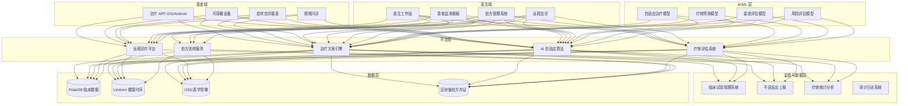
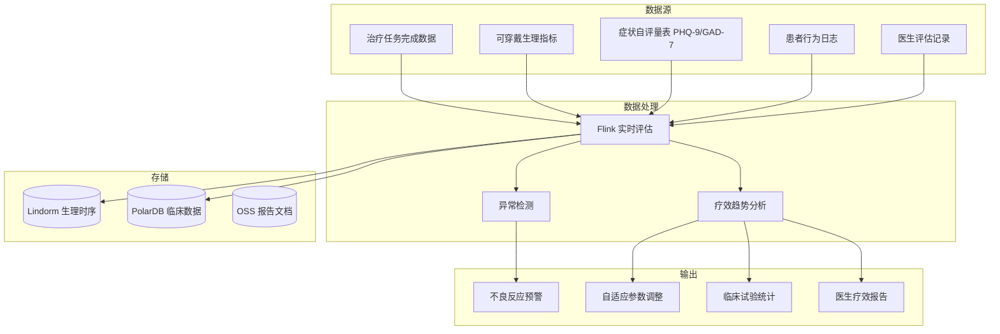

> **生产环境安全提示**
>
> 本文档包含可直接执行的运维命令。执行前请确认：当前目标集群与 Namespace 是否正确；是否具备足够的 RBAC 权限；是否已在非生产环境验证。命令风险等级标注：🔴 高风险（可能造成数据丢失或服务中断）、🟡 中风险（会修改集群状态，但通常可回滚）、🟢 低风险/只读（信息收集，无副作用）。


title: 数字疗法与互联网医疗架构设计
description: '# 数字疗法与互联网医疗架构设计 — 阿里云视角'
category: application-architecture
tags:
- k8s
- architecture
- industry
- [[Prometheus|prometheus]]
- opa
- redis
- mysql
- rag
last_updated: '2026-05-18'
difficulty: expert
reading_level: expert
audience:
- 医疗科技架构师
- 数字疗法开发者
- 远程医疗工程师
- 阿里云解决方案架构师
estimated_read_time: 5min
intent_queries:
- 数字疗法DTx系统架构设计
- 互联网医院远程诊疗K8s
- 数字疗法FDA/NMPA审批
- AI自适应治疗模型
- 电子处方区块链存证
trigger_keywords:
- 数字疗法
- DTx
- 互联网医疗
- 远程诊疗
- 电子处方
- SaMD
- FDA
- NMPA
- CBT
- 数字疗法审批
related_domains:
- 集群基础
- domain-9-ai-ml
- domain-7-observability
- 网络
related_topics:
- 应用模式/topic-application-architecture/14-smart-healthcare-architecture
- 应用模式/topic-application-architecture/73-smart-firefighting
- 工作负载/topic-functions/09-data-security-privacy
- topic-集群基础/03-privacy-protection
authors:
- name: KUDIG Team
  role: contributor
k8s_versions:
- '1.28'
- '1.29'
- '1.30'
- '1.31'
- '1.32'
---

# 数字疗法与互联网医疗架构设计 — 阿里云视角

> **适用版本**: Kubernetes v1.29 - v1.33 | **最后更新**: 2026-04-24
> **作者**: 阿里云解决方案架构师 | **标签**: `#数字疗法` `#互联网医疗` `#远程诊疗` `#阿里云`

---

<!-- chunk: 目录 -->## 目录

1. [行业概述](#1-行业概述)
2. [业务场景](#2-业务场景)
3. [架构设计](#3-架构设计)
4. [核心技术栈](#4-核心技术栈)
5. [Kubernetes 部署方案](#5-kubernetes-部署方案)
6. [数据架构](#6-数据架构)
7. [AI/ML 组件](#7-aiml-组件)
8. [安全与合规](#8-安全与合规)
9. [最佳实践](#9-最佳实践)
10. [反模式](#10-反模式)
11. [参考资源](#11-参考资源)

---

<!-- chunk: 1. 行业概述 -->## 1. 行业概述

## 1.1 市场规模与趋势

数字疗法（DTx）是经临床验证的软件治疗方案，通过循证医学方法证明其临床有效性。全球数字疗法市场规模预计从 2024 年的 80 亿美元增长到 2030 年的 600 亿美元。已有 50+ 款数字疗法产品获得 FDA 或 NMPA 批准，覆盖精神健康、慢性病管理、康复训练、睡眠障碍等领域。

| 指标 | 2024 年 | 2026 年（预测） | 2030 年（预测） |
|:---|:---|:---|:---|
| 全球 DTx 市场规模 | $8B | $20B | $60B |
| FDA/NMPA 批准产品数 | 50+ | 100+ | 300+ |
| DTx 患者覆盖人数 | 5000 万 | 1.5 亿 | 5 亿 |
| 互联网医疗渗透率 | 15% | 30% | 55% |
| 远程诊疗占比 | 10% | 25% | 40% |

## 1.2 行业痛点

| 痛点 | 说明 | 数字化转型驱动 |
|:---|:---|:---|
| 医疗合规 | FDA/NMPA 审批要求严格 | 临床试验数据管理系统 |
| 疗效验证 | 需证明临床有效性 | 数据收集 + RCT 统计分析 |
| 个性化治疗 | 千人千方治疗方案 | AI 自适应算法 |
| 医患互动 | 远程监测与实时指导 | RTC 通信 + 可穿戴数据同步 |
| 数据安全 | 敏感健康数据保护 | 端到端加密 + HIPAA/PIPL 合规 |
| 依从性 | 患者治疗依从性低 | 游戏化 + 智能提醒 + 社交激励 |

## 1.3 数字化转型架构影响

数字疗法系统需要覆盖患者端（治疗APP/可穿戴/症状自评）、医生端（工作站/监测看板/处方管理）、平台层（治疗方案引擎/AI算法/疗效评估/远程诊疗/处方流转）和监管层（临床试验数据/不良反应上报/统计分析）。核心挑战是满足医疗器械软件（SaMD）的监管要求和临床数据安全。

---

<!-- chunk: 2. 业务场景 -->## 2. 业务场景

## 2.1 认知行为治疗（CBT）

针对抑郁、焦虑等精神健康问题的数字 CBT 干预。患者通过 APP 完成每日治疗任务（思维记录/放松训练/行为激活），AI 自适应算法根据患者反馈调整治疗参数。医生通过工作站监测患者进展并在需要时介入。

## 2.2 慢性病数字管理

针对糖尿病、高血压等慢性病的综合数字疗法。通过可穿戴设备持续监测血糖/血压/心率，AI 分析趋势并在异常时预警。结合饮食记录、运动追踪和用药提醒，形成个性化管理方案。

## 2.3 远程康复训练

针对卒中后康复、运动损伤康复的远程数字疗法。患者通过 APP 完成每日康复训练，摄像头捕捉运动姿态并 AI 评估动作标准度。物理治疗师远程监控进度并调整训练方案。

## 2.4 远程诊疗与电子处方

医生通过视频问诊、图文咨询等方式为患者提供远程诊疗服务。支持电子处方开具、处方流转至线下药房。系统需要集成医保结算、电子病历和处方审核。

## 2.5 临床试验数字化管理

数字疗法产品的临床试验数据管理，包括随机对照试验（RCT）设计、患者招募与分组、治疗数据采集、疗效评估和统计分析。需要满足 GCP（药物临床试验质量管理规范）要求。

---

<!-- chunk: 3. 架构设计 -->## 3. 架构设计

## 3.1 数字疗法全景架构



---

<!-- chunk: 4. 核心技术栈 -->## 4. 核心技术栈

| Component | Purpose | Technology | License |
|:---|:---|:---|:---|
| Container Orchestration | Platform management | ACK Pro | Proprietary |
| AI Framework | Model training & inference | PAI / PyTorch 2.x | Proprietary / BSD |
| RTC | Video consultation | 阿里云 RTC | Proprietary |
| Relational DB | Clinical data management | PolarDB MySQL | Proprietary |
| Time-Series DB | Health data storage | Lindorm TSDB | Proprietary |
| Object Storage | Medical images & documents | OSS (加密) | Proprietary |
| Cache | Session & hot data | Redis Enterprise | Proprietary |
| Message Queue | Event-driven processing | RocketMQ 5.x | Apache 2.0 |
| Blockchain | Prescription evidence | 蚂蚁链 BaaS | Proprietary |
| Search Engine | Medical knowledge search | OpenSearch | Apache 2.0 |
| Monitoring | Observability | ARMS + SLS | Proprietary |
| Data Encryption | Data protection | KMS + HSM | Proprietary |

---

<!-- chunk: 5. Kubernetes 部署方案 -->## 5. Kubernetes 部署方案

## 5.1 治疗引擎 Deployment

```yaml
apiVersion: apps/v1
kind: Deployment
metadata:
  name: therapy-engine
  namespace: digital-therapeutics
  labels:
    app: therapy-engine
    tier: core-service
    compliance: hipaa
spec:
  replicas: 4
  selector:
    matchLabels:
      app: therapy-engine
  strategy:
    rollingUpdate:
      maxSurge: 1
      maxUnavailable: 0
  template:
    metadata:
      labels:
        app: therapy-engine
        tier: core-service
      annotations:
        prometheus.io/scrape: "true"
        prometheus.io/port: "9090"
        compliance.audit: "enabled"
    spec:
      affinity:
        podAntiAffinity:
          requiredDuringSchedulingIgnoredDuringExecution:
            - labelSelector:
                matchLabels:
                  app: therapy-engine
              topologyKey: topology.kubernetes.io/zone
      containers:
        - name: engine
          image: registry.cn-hangzhou.aliyuncs.com/dtx/therapy-engine:v3.0.0
          ports:
            - containerPort: 8080
              name: http
            - containerPort: 9090
              name: metrics
          env:
            - name: TREATMENT_PROTOCOL_VERSION
              value: "v3.1"
            - name: CLINICAL_TRIAL_MODE
              value: "false"
            - name: ADAPTIVE_MODEL_URL
              value: "http://ai-adaptive-service:8080/predict"
            - name: DB_CONNECTION
              valueFrom:
                secretKeyRef:
                  name: dtx-secrets
                  key: db-connection
            - name: ENCRYPTION_KEY_ID
              valueFrom:
                secretKeyRef:
                  name: dtx-secrets
                  key: kms-key-id
            - name: AUDIT_LOG_ENABLED
              value: "true"
          resources:
            requests:
              memory: "4Gi"
              cpu: "2000m"
            limits:
              memory: "8Gi"
              cpu: "4000m"
          readinessProbe:
            httpGet:
              path: /health/ready
              port: 8080
            initialDelaySeconds: 15
            periodSeconds: 5
          livenessProbe:
            httpGet:
              path: /health/live
              port: 8080
            initialDelaySeconds: 30
            periodSeconds: 10
```

## 5.2 AI 自适应服务 Deployment

```yaml
apiVersion: apps/v1
kind: Deployment
metadata:
  name: ai-adaptive-service
  namespace: digital-therapeutics
spec:
  replicas: 3
  selector:
    matchLabels:
      app: ai-adaptive-service
  template:
    metadata:
      labels:
        app: ai-adaptive-service
    spec:
      containers:
        - name: ai
          image: registry.cn-hangzhou.aliyuncs.com/dtx/adaptive-ai:v2.0.0
          ports:
            - containerPort: 8080
          env:
            - name: MODEL_PATH
              value: "/models/cbt-adaptive-v3"
            - name: MODEL_VERSION
              value: "3.0"
            - name: MAX_INFERENCE_MS
              value: "200"
          resources:
            requests:
              memory: "4Gi"
              cpu: "2000m"
            limits:
              memory: "8Gi"
              cpu: "4000m"
```

## 5.3 ConfigMap, Service 与 Secret

```yaml
apiVersion: v1
kind: ConfigMap
metadata:
  name: dtx-config
  namespace: digital-therapeutics
data:
  treatment-protocols: |
    {
      "cbt_depression": {
        "version": "3.1",
        "sessions": 12,
        "adaptive": true,
        "modules": ["thought_record", "behavioral_activation", "relaxation", "mindfulness"]
      },
      "diabetes_management": {
        "version": "2.5",
        "monitoring": "continuous",
        "alert_thresholds": {"glucose_high": 180, "glucose_low": 70, "bp_high": 140}
      }
    }
  clinical-trial-config: |
    {
      "randomization": "block",
      "blinding": "double",
      "primary_endpoint": "PHQ-9 reduction >= 50%",
      "secondary_endpoints": ["GAD-7", "WHO-5", "adherence_rate"],
      "interim_analysis": true
    }
  adverse-event-categories: |
    ["worsening_symptoms", "suicidal_ideation", "device_malfunction", "data_breach", "allergic_reaction"]
---
apiVersion: v1
kind: Service
metadata:
  name: therapy-engine
  namespace: digital-therapeutics
spec:
  selector:
    app: therapy-engine
  ports:
    - name: http
      port: 8080
      targetPort: 8080
    - name: metrics
      port: 9090
      targetPort: 9090
  type: ClusterIP
---
apiVersion: v1
kind: Secret
metadata:
  name: dtx-secrets
  namespace: digital-therapeutics
type: Opaque
stringData:
  db-connection: "mysql://dtx_app@polardb.dtx.rds.aliyuncs.com:3306/dtx_db"
  kms-key-id: "kms-key-id-placeholder"
  rtc-app-id: "rtc-app-id-placeholder"
  rtc-app-key: "rtc-app-key-placeholder"
  blockchain-key: "blockchain-private-key-placeholder"
```

---

<!-- chunk: 6. 数据架构 -->## 6. 数据架构

## 6.1 疗效评估数据流



## 6.2 数据流说明

- **治疗数据流**: 患者完成治疗任务后数据实时上传，经 Flink 评估后更新疗效指标
- **生理数据流**: 可穿戴设备持续上传心率/血压/血糖等数据，异常值实时预警
- **处方数据流**: 电子处方经审核后流转至药房，全程区块链存证
- **临床试验流**: RCT 数据经脱敏后写入专用的临床试验数据仓库

---

<!-- chunk: 7. AI/ML 组件 -->## 7. AI/ML 组件

## 7.1 核心模型

| 模型 | 用途 | 输入 | 输出 | 框架 |
|:---|:---|:---|:---|:---|
| 自适应治疗 | 个性化治疗参数调整 | 患者历史/当前状态 | 治疗参数建议 | Bayesian Optimization |
| 疗效预测 | 治疗效果预测 | 基线/人口学/行为数据 | 疗效概率 | XGBoost |
| 姿态评估 | 康复动作标准度评估 | 视频帧 | 动作评分 + 纠正建议 | MMPose + 规则引擎 |
| 风险预警 | 自杀/恶化风险预警 | 症状/行为/生理数据 | 风险等级 (1-5) | LSTM Ensemble |
| 依从性预测 | 患者依从性预测 | 历史行为模式 | 流失概率 | Random Forest |
| NLP 分析 | 患者文本情感分析 | 日记/聊天记录 | 情绪标签 + 风险标记 | BERT |

---

<!-- chunk: 8. 安全与合规 -->## 8. 安全与合规

## 8.1 行业法规与标准

| 法规/标准 | 适用范围 | 架构要求 |
|:---|:---|:---|
| FDA SaMD | 医疗器械软件审批 | 软件生命周期管理 |
| NMPA 医疗器械 | 中国医疗器械注册 | 注册证 + 临床试验 |
| HIPAA | 美国健康数据保护 | PHI 加密 + 审计日志 |
| 个人信息保护法 | 中国个人信息保护 | 健康数据分类分级 |
| GCP | 临床试验质量管理 | 数据完整性 + 可追溯 |
| 等保三级 | 医疗信息系统安全 | 网络隔离 + 加密 + 审计 |
| HL7 FHIR | 医疗数据交换标准 | EHR 互操作 |

## 8.2 安全架构要点

- **数据加密**: 所有健康数据使用 KMS 托管密钥加密（传输中 TLS 1.3 + 静态 AES-256）
- **访问控制**: 基于角色的最小权限访问，医生仅可查看自己管理的患者数据
- **审计日志**: 所有数据访问和操作完整审计追踪，不可篡改
- **不良反应上报**: 自动检测并上报严重不良事件（SAE）至监管机构
- **数据脱敏**: 临床试验数据共享前必须脱敏处理

---

<!-- chunk: 9. 最佳实践 -->## 9. 最佳实践

1. **软件医疗器械合规**: 从 Day 1 就按照 SaMD 标准管理软件生命周期（IEC 62304）
2. **自适应算法验证**: AI 自适应治疗算法需要独立临床验证，确保不会做出有害调整
3. **分级数据保护**: 健康数据按敏感度分级（PHQ-9 评分 vs 聊天记录），不同级别不同保护措施
4. **不良事件快速响应**: 建立严重不良事件（SAE）自动检测和 24h 内上报机制
5. **临床试验数据隔离**: 临床试验环境与生产环境完全隔离，独立审计
6. **电子处方区块链存证**: 处方开具-审核-调配-发药全流程上链，防篡改
7. **可穿戴数据质量监控**: 持续监控可穿戴设备数据质量，识别传感器问题或佩戴不当
8. **治疗依从性提升**: 游戏化设计 + 社交激励 + 智能提醒，提升治疗完成率
9. **医生工作站集成**: 与医院 HIS/EMR 系统集成，避免医生使用多个系统
10. **远程诊疗双录**: 视频问诊全程录音录像，满足医疗纠纷举证要求

---

<!-- chunk: 10. 反模式 -->## 10. 反模式

1. **AI 未经验证直接用于治疗**: 自适应算法未经 RCT 验证就用于患者治疗，存在安全风险。应先完成临床验证
2. **健康数据明文存储**: 患者健康数据明文存储在数据库中。应使用 KMS 托管密钥加密
3. **忽视 GCP 合规**: 临床试验数据管理不满足 GCP 要求，导致注册申请被拒。应从开始就按 GCP 管理
4. **单一点依赖医生**: 所有治疗决策完全依赖医生，未充分利用 AI 辅助。应实现 AI 辅助 + 医生审核
5. **缺乏审计追踪**: 系统操作无审计日志，无法追溯数据变更。应全链路审计

---

<!-- chunk: 11. 参考资源 -->## 11. 参考资源

- [FDA Digital Health Center of Excellence](https://www.fda.gov/medical-devices/digital-health-center-excellence)
- [NMPA 医疗器械注册](https://www.nmpa.gov.cn/)
- [HL7 FHIR Standard](https://www.hl7.org/fhir/)
- [IEC 62304 Medical Device Software](https://www.iec.ch/)
- [HIPAA Security Rule](https://www.hhs.gov/hipaa/for-professionals/security/index.html)
- [阿里云 RTC 文档](https://help.aliyun.com/product/61339.html)
- [蚂蚁链 BaaS 文档](https://help.aliyun.com/product/85221.html)

---

**维护者**: 阿里云解决方案架构师团队 | **许可证**: MIT

---

<!-- chunk: Obsidian 相关文档 -->## Obsidian 相关文档

- topic-application-architecture MOC
- [[应用模式/行业架构/README.md|Topic 应用层架构设计最佳实践]]
- [[应用模式/行业架构/01-ecommerce-architecture.md|电商系统 Kubernetes 生产架构设计]]
- [[应用模式/行业架构/02-mini-program-architecture.md|小程序平台架构设计]]
- [[应用模式/行业架构/03-cms-architecture.md|内容管理系统 CMS 架构设计]]
- [[应用模式/行业架构/04-im-rtc-architecture.md|实时通信 IM/RTC 架构设计]]
- [[应用模式/行业架构/05-online-education-architecture.md|在线教育平台 Kubernetes 生产架构设计]]
- [[应用模式/行业架构/06-fintech-architecture.md|金融科技FinTech Kubernetes生产架构设计]]
- [[应用模式/行业架构/07-iot-platform-architecture.md|物联网 IoT 平台架构设计]]
- [[应用模式/行业架构/08-ai-ml-inference-architecture.md|AI/ML 推理服务 Kubernetes 生产架构设计]]
- [[应用模式/行业架构/09-gaming-backend-architecture.md|游戏后端 Kubernetes 生产架构设计]]
- [[应用模式/行业架构/10-social-media-architecture.md|社交媒体平台Kubernetes生产架构设计]]

## See Also

- 55-crossborder-dtc
- 56-smart-elderly-care
- 58-web3-gamefi
- 59-industrial-internet-platform

## Related

- topic-application-architecture MOC — Cross-reference


<!-- risk-assessed -->
