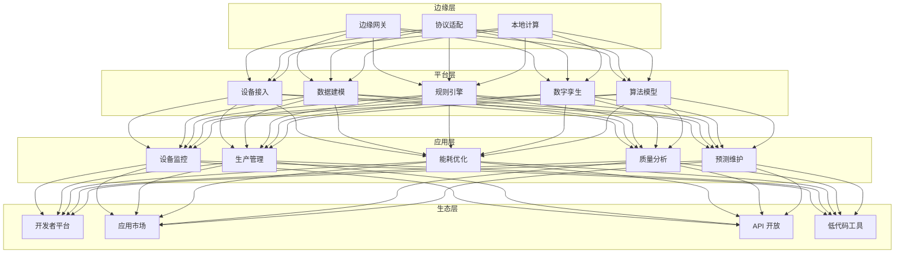
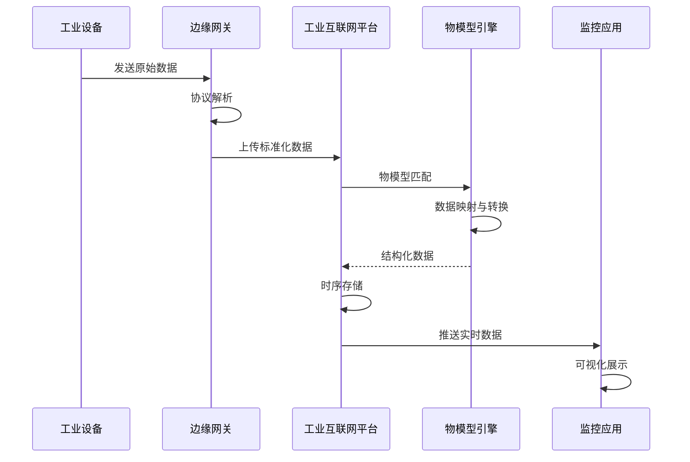
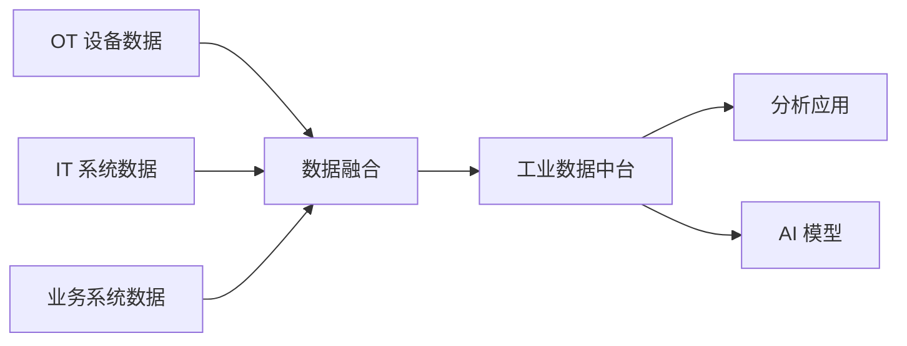

> **生产环境安全提示**
>
> 本文档包含可直接执行的运维命令。执行前请确认：当前目标集群与 Namespace 是否正确；是否具备足够的 RBAC 权限；是否已在非生产环境验证。命令风险等级标注：🔴 高风险（可能造成数据丢失或服务中断）、🟡 中风险（会修改集群状态，但通常可回滚）、🟢 低风险/只读（信息收集，无副作用）。


title: 工业互联网平台架构设计
description: '# 工业互联网平台架构设计 — 阿里云视角'
category: application-architecture
tags:
- k8s
- architecture
- industry
last_updated: 2026-05-18
difficulty: advanced
reading_level: advanced
audience:
- 工业互联网架构师
- IoT平台负责人
- 工业软件开发者
estimated_read_time: 5min
intent_queries:
- 工业互联网 [[Kubernetes|Kubernetes]] IIoT平台
- 设备接入 MQTT OPC-UA K8s
- 工业数据中台 Kubernetes Flink
- 工业APP 低代码 Kubernetes
- 数字孪生 工业互联网 阿里云
trigger_keywords:
- 工业互联网
- IIoT
- 平台化
- 设备接入
- MQTT
- OPC-UA
- 数字孪生
- 阿里云
related_domains:
- 集群基础
- 生产运维
- domain-11-ai-infra
- domain-7-observability
related_topics:
- 87-flexible-manufacturing
- 93-digital-twin-factory
- 51-smart-manufacturing-mes
- 07-iot-platform-architecture
authors:
- name: KUDIG Team
  role: contributor
k8s_versions:
- '1.28'
- '1.29'
- '1.30'
- '1.31'
- '1.32'
---

# 工业互联网平台架构设计 — 阿里云视角

> **适用版本**: Kubernetes v1.29 - v1.33 | **最后更新**: 2026-04-24
> **作者**: 阿里云解决方案架构师 | **标签**: `#工业互联网` `#IIoT` `#平台化` `#阿里云`

---

## 目录

1. [行业背景](#1-行业背景)
2. [业务架构](#2-业务架构)
3. [技术架构](#3-技术架构)
4. [核心数据流](#4-核心数据流)
5. [安全与合规](#5-安全与合规)
6. [可观测性](#6-可观测性)
7. [阿里云组件映射](#7-阿里云组件映射)
8. [生产检查清单](#8-生产检查清单)

---

## 1. 行业背景

### 1.1 业务特点

工业互联网平台连接设备、数据与应用，赋能产业数字化：

| 挑战 | 说明 | 架构影响 |
|:---|:---|:---|
| 设备接入 | 多品牌/多协议设备 | 协议适配网关 |
| 数据融合 | OT + IT 数据整合 | 数据中台 |
| 应用生态 | 第三方工业 APP | 开放平台 + 低代码 |
| 行业差异 | 不同行业需求各异 | 行业模板 + 可配置 |
| 安全隔离 | 企业数据安全 | 多租户隔离 |

### 1.2 核心场景

- **设备上云**: 工业设备接入与监控
- **数据分析**: 设备健康/能耗/效率分析
- **工业 APP**: 第三方应用市场
- **协同制造**: 产能共享/供应链协同
- **数字孪生**: 工厂/产线 3D 可视化

---

## 2. 业务架构

### 2.1 工业互联网平台全景架构



### 2.2 设备接入与建模时序



---

## 3. 技术架构

### 3.1 K8s 部署

```yaml
# 设备接入服务 Deployment
apiVersion: apps/v1
kind: Deployment
metadata:
  name: device-access
  namespace: ii-platform
spec:
  replicas: 10
  selector:
    matchLabels:
      app: device-access
  template:
    metadata:
      labels:
        app: device-access
    spec:
      containers:
        - name: access
          image: registry.cn-hangzhou.aliyuncs.com/iiot/device-access:v4.0.0
          ports:
            - containerPort: 8080
            - containerPort: 1883
              name: mqtt
          env:
            - name: MQTT_MAX_CONNECTIONS
              value: "1000000"
            - name: PROTOCOL_ADAPTERS
              value: "modbus,opc-ua,ble,mqtt"
          resources:
            requests:
              memory: "4Gi"
              cpu: "2000m"
            limits:
              memory: "8Gi"
              cpu: "4000m"
```

---

## 4. 核心数据流

### 4.1 工业数据融合



---

## 5. 安全与合规

- **工控安全**: 生产网与管理网隔离
- **数据安全**: 企业数据多租户隔离
- **等保三级**: 工业互联网平台合规

---

## 6. 可观测性

- **设备在线率**: > 98%
- **数据接入延迟**: < 1s
- **平台可用性**: 99.9%

---

## 7. 阿里云组件映射

| 功能域 | **阿里云云原生方案** |
|:---|:---|
| 容器平台 | **ACK Pro + ACK Edge** |
| IoT | **阿里云 IoT 平台** |
| 时序数据库 | **Lindorm** |
| 数据库 | **PolarDB** |
| 实时计算 | **Flink** |
| AI | **PAI** |
| 数字孪生 | **DataV** |
| 可观测性 | **ARMS + SLS** |

---

## 8. 生产检查清单

- [ ] 百万级设备接入压测
- [ ] 多协议适配兼容性
- [ ] 企业数据隔离验证
- [ ] 工业 APP 沙箱安全
- [ ] 等保三级合规审计

---

**维护者**: 阿里云解决方案架构师团队 | **许可证**: MIT

---

## Obsidian 相关文档

- topic-application-architecture KUDIG Database — Global MOC
- [[应用模式/行业架构/README.md|Topic 应用层架构设计最佳实践]]
- [[应用模式/行业架构/01-ecommerce-architecture.md|电商系统 Kubernetes 生产架构设计]]
- [[应用模式/行业架构/02-mini-program-architecture.md|小程序平台架构设计]]
- [[应用模式/行业架构/03-cms-architecture.md|内容管理系统 CMS 架构设计]]
- [[应用模式/行业架构/04-im-rtc-architecture.md|实时通信 IM/RTC 架构设计]]
- [[应用模式/行业架构/05-online-education-architecture.md|在线教育平台 Kubernetes 生产架构设计]]
- [[应用模式/行业架构/06-fintech-architecture.md|金融科技FinTech Kubernetes生产架构设计]]
- [[应用模式/行业架构/07-iot-platform-architecture.md|物联网 IoT 平台架构设计]]
- [[应用模式/行业架构/08-ai-ml-inference-architecture.md|AI/ML 推理服务 Kubernetes 生产架构设计]]
- [[应用模式/行业架构/09-gaming-backend-architecture.md|游戏后端 Kubernetes 生产架构设计]]
- [[应用模式/行业架构/10-social-media-architecture.md|社交媒体平台Kubernetes生产架构设计]]

## See Also

- 57-digital-therapeutics
- 58-web3-gamefi
- 60-v2x-autonomous-driving
- 61-smart-grid

## Related

- topic-application-architecture MOC — Cross-reference


<!-- risk-assessed -->
