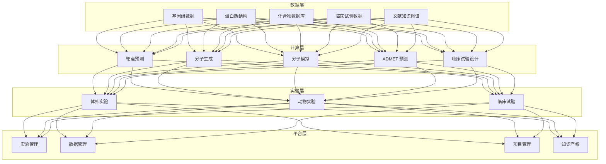
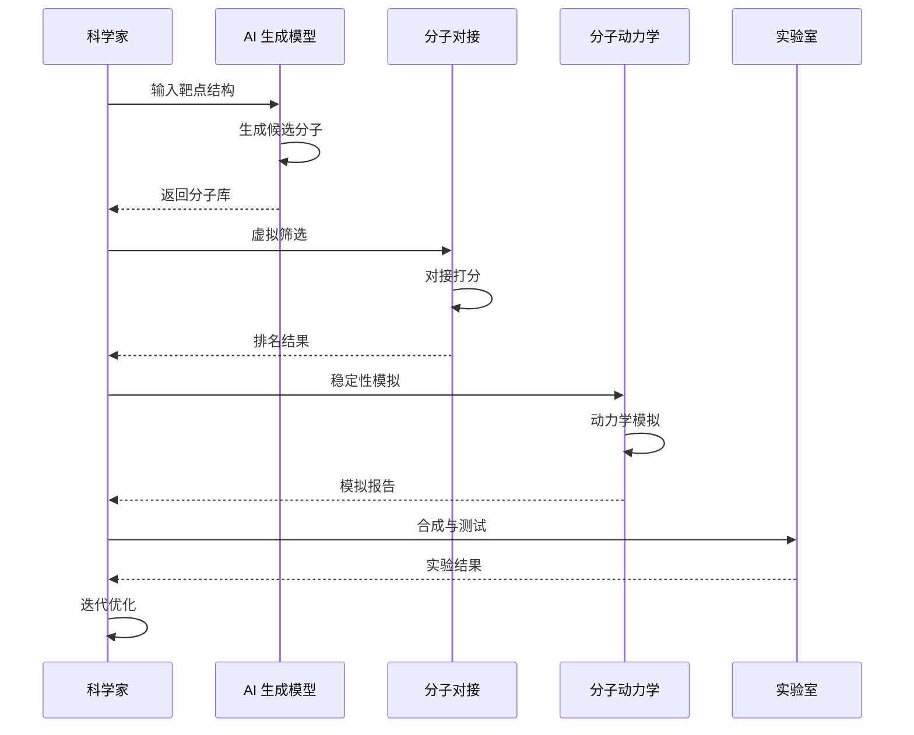
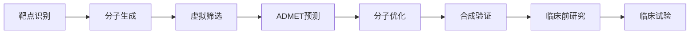

> **生产环境安全提示**
>
> 本文档包含可直接执行的运维命令。执行前请确认：当前目标集群与 Namespace 是否正确；是否具备足够的 RBAC 权限；是否已在非生产环境验证。命令风险等级标注：🔴 高风险（可能造成数据丢失或服务中断）、🟡 中风险（会修改集群状态，但通常可回滚）、🟢 低风险/只读（信息收集，无副作用）。


title: AI 制药架构设计
description: '# AI 制药架构设计 — 阿里云视角'
category: application-architecture
tags:
- k8s
- architecture
- industry
- job
- gpu
- nvidia
last_updated: 2026-05-18
difficulty: expert
reading_level: expert
audience:
- AI制药研究员
- 计算化学家
- 药物研发工程师
estimated_read_time: 5min
intent_queries:
- AI 制药分子生成与虚拟筛选
- GPU 分子动力学模拟 GROMACS
- 药物发现深度学习模型
- 靶点预测与化合物生成
- 阿里云 PAI 药物研发
trigger_keywords:
- AI制药
- 药物发现
- 分子生成
- 分子对接
- 分子动力学
- 靶点发现
- ADMET预测
- 虚拟筛选
- GPU计算
- 临床试验
related_domains:
- 网络
- 故障诊断
related_topics:
- topic-ai-algorithm
- topic-hpc-architecture
authors:
- name: KUDIG Team
  role: contributor
k8s_versions:
- '1.28'
- '1.29'
- '1.30'
- '1.31'
- '1.32'
---

# AI 制药架构设计 — 阿里云视角

> **适用版本**: [[Kubernetes|Kubernetes]] v1.29 - v1.33 | **最后更新**: 2026-04-24
> **作者**: 阿里云解决方案架构师 | **标签**: `#AI制药` `#药物发现` `#分子生成` `#阿里云`

---

## 目录

1. [行业背景](#1-行业背景)
2. [业务架构](#2-业务架构)
3. [技术架构](#3-技术架构)
4. [核心数据流](#4-核心数据流)
5. [安全与合规](#5-安全与合规)
6. [可观测性](#6-可观测性)
7. [阿里云组件映射](#7-阿里云组件映射)
8. [生产检查清单](#8-生产检查清单)

---

## 1. 行业背景

### 1.1 业务特点

AI 制药通过人工智能技术加速药物研发：

| 挑战 | 说明 | 架构影响 |
|:---|:---|:---|
| 计算密集 | 分子模拟需要大量算力 | GPU 集群 + 并行计算 |
| 数据稀缺 | 高质量标注数据少 | 迁移学习 + 数据增强 |
| 合规严格 | FDA/NMPA 审批 | 实验数据完整追溯 |
| 多模态融合 | 基因/蛋白/化合物 | 多模态模型 |
| 知识产权 | 化合物专利保护 | 数据隔离 + 加密 |

### 1.2 核心场景

- **靶点发现**: 疾病靶点预测与验证
- **分子生成**: AI 生成候选化合物
- **分子模拟**: 分子动力学/对接计算
- **临床试验**: 患者招募/疗效预测
- **老药新用**: 已有药物新适应症发现

---

## 2. 业务架构

### 2.1 AI 制药全景架构



### 2.2 分子生成与验证时序



---

## 3. 技术架构

### 3.1 K8s 部署

```yaml
# 分子动力学 GPU Job
apiVersion: batch/v1
kind: Job
metadata:
  name: molecular-dynamics-001
  namespace: ai-drug-discovery
spec:
  parallelism: 10
  template:
    spec:
      nodeSelector:
        accelerator: nvidia-a100
      runtimeClassName: nvidia
      containers:
        - name: md
          image: registry.cn-hangzhou.aliyuncs.com/drug/gromacs:v2023.3-gpu
          command: ["gmx", "mdrun", "-deffnm", "md_001"]
          resources:
            requests:
              nvidia.com/gpu: 1
              memory: "32Gi"
              cpu: "8000m"
            limits:
              nvidia.com/gpu: 1
              memory: "64Gi"
              cpu: "16000m"
          volumeMounts:
            - name: md-input
              mountPath: /input
            - name: md-output
              mountPath: /output
      volumes:
        - name: md-input
          persistentVolumeClaim:
            claimName: md-input-pvc
        - name: md-output
          persistentVolumeClaim:
            claimName: md-output-pvc
      restartPolicy: Never
```

---

## 4. 核心数据流

### 4.1 AI 药物发现流水线



---

## 5. 安全与合规

- **数据隐私**: 患者数据脱敏
- **知识产权**: 化合物专利保护
- **GLP/GCP**: 药物非临床/临床质量管理规范

---

## 6. 可观测性

- **分子模拟**: 纳秒级/day
- **模型训练**: 分布式 GPU 加速
- **实验进度**: 全流程跟踪

---

## 7. 阿里云组件映射

| 功能域 | **阿里云云原生方案** |
|:---|:---|
| 容器平台 | **ACK Pro + GPU** |
| GPU | **GN10/GN7 实例** |
| 高性能计算 | **E-HPC** |
| AI | **PAI** |
| 数据库 | **PolarDB** |
| 对象存储 | **OSS** |
| 可观测性 | **ARMS + SLS** |

---

## 8. 生产检查清单

- [ ] 分子模拟计算精度验证
- [ ] AI 模型预测准确率
- [ ] 实验数据完整性审计
- [ ] 化合物知识产权隔离
- [ ] GLP/GCP 合规审计

---

**维护者**: 阿里云解决方案架构师团队 | **许可证**: MIT

---

## Obsidian 相关文档

- topic-application-architecture KUDIG Database — Global MOC
- [[应用模式/行业架构/README.md|[[Topic 应用层架构设计最佳实践|Topic 应用层架构设计最佳实践]]]]
- [[应用模式/行业架构/01-ecommerce-architecture.md|电商系统 Kubernetes 生产架构设计]]
- [[应用模式/行业架构/02-mini-program-architecture.md|小程序平台架构设计]]
- [[应用模式/行业架构/03-cms-architecture.md|内容管理系统 CMS 架构设计]]
- [[应用模式/行业架构/04-im-rtc-architecture.md|实时通信 IM/RTC 架构设计]]
- [[应用模式/行业架构/05-online-education-architecture.md|在线教育平台 Kubernetes 生产架构设计]]
- [[应用模式/行业架构/06-fintech-architecture.md|金融科技FinTech Kubernetes生产架构设计]]
- [[应用模式/行业架构/07-iot-platform-architecture.md|物联网 IoT 平台架构设计]]
- [[应用模式/行业架构/08-ai-ml-inference-architecture.md|AI/ML 推理服务 Kubernetes 生产架构设计]]
- [[应用模式/行业架构/09-gaming-backend-architecture.md|游戏后端 Kubernetes 生产架构设计]]
- [[应用模式/行业架构/10-social-media-architecture.md|社交媒体平台Kubernetes生产架构设计]]

## See Also

- 62-distributed-energy
- 63-industrial-visual-inspection
- 65-autonomous-driving-sim
- 66-space-internet

## Related

- topic-application-architecture MOC — Cross-reference


<!-- risk-assessed -->
