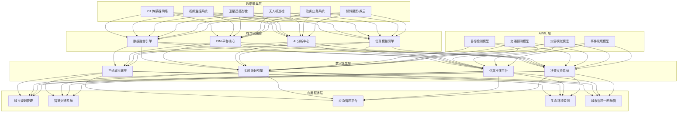
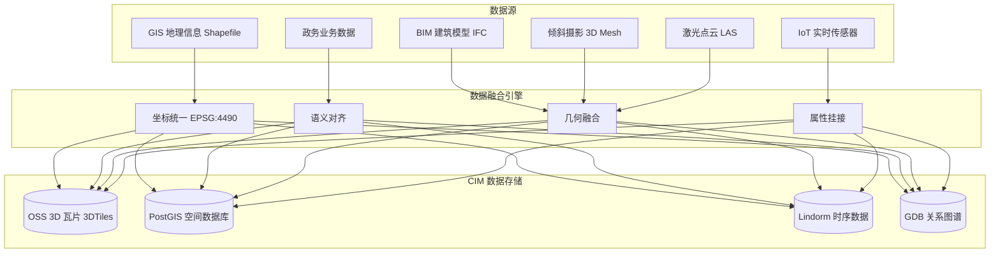

> **生产环境安全提示**
>
> 本文档包含可直接执行的运维命令。执行前请确认：当前目标集群与 Namespace 是否正确；是否具备足够的 RBAC 权限；是否已在非生产环境验证。命令风险等级标注：🔴 高风险（可能造成数据丢失或服务中断）、🟡 中风险（会修改集群状态，但通常可回滚）、🟢 低风险/只读（信息收集，无副作用）。


title: 数字孪生城市架构设计
description: '# 数字孪生城市架构设计 — 阿里云视角'
category: application-architecture
tags:
- k8s
- architecture
- industry
- [[Prometheus|prometheus]]
- grafana
- opa
- postgresql
- gateway
- gpu
- nvidia
last_updated: 2026-05-18
difficulty: advanced
reading_level: advanced
audience:
- 智慧城市架构师
- 数字孪生工程师
- 城市信息化负责人
- CIM平台开发者
estimated_read_time: 5min
intent_queries:
- digital twin city [[Kubernetes|kubernetes]] architecture
- 数字孪生城市K8s部署
- CIM平台架构设计
- 城市三维渲染GPU
- 数字孪生IoT数据融合
trigger_keywords:
- 数字孪生城市
- CIM
- 智慧城市
- 城市信息模型
- 三维渲染
- 城市大脑
- 数字孪生架构
- BIM
- GIS
- 城市CIM
related_domains:
- 集群基础
- 故障诊断
- 网络
related_topics:
- digital-government-architecture
- energy-power-architecture
- smart-campus
authors:
- name: KUDIG Team
  role: contributor
k8s_versions:
- '1.28'
- '1.29'
- '1.30'
- '1.31'
- '1.32'
---

# 数字孪生城市架构设计 — 阿里云视角

> **适用版本**: Kubernetes v1.29 - v1.33 | **最后更新**: 2026-04-24
> **作者**: 阿里云解决方案架构师 | **标签**: `#数字孪生城市` `#CIM` `#智慧城市` `#阿里云`

---

<!-- chunk: 目录 -->## 目录

1. [行业概述](#1-行业概述)
2. [业务场景](#2-业务场景)
3. [架构设计](#3-架构设计)
4. [核心技术栈](#4-核心技术栈)
5. [Kubernetes 部署方案](#5-kubernetes-部署方案)
6. [数据架构](#6-数据架构)
7. [AI/ML 组件](#7-aiml-组件)
8. [安全与合规](#8-安全与合规)
9. [最佳实践](#9-最佳实践)
10. [反模式](#10-反模式)
11. [参考资源](#11-参考资源)

---

<!-- chunk: 1. 行业概述 -->## 1. 行业概述

## 1.1 市场规模与趋势

数字孪生城市构建城市级数字镜像，将 BIM（建筑信息模型）、GIS（地理信息系统）、IoT（物联网）融合为 CIM（城市信息模型），实现虚实映射与智能决策。全球数字孪生城市市场规模预计从 2024 年的 150 亿美元增长到 2030 年的 1200 亿美元。全球已有 100+ 城市启动数字孪生城市项目，中国住建部推动 CIM 平台建设覆盖所有地级市。

| 指标 | 2024 年 | 2026 年（预测） | 2030 年（预测） |
|:---|:---|:---|:---|
| 全球市场规模 | $15B | $40B | $120B |
| 中国 CIM 平台覆盖 | 50+ 城市 | 100+ 城市 | 300+ 城市 |
| 城市三维建模精度 | 0.5m | 0.2m | 0.05m |
| 实时数据接入延迟 | 5s | 2s | 0.5s |
| AI 决策自动化率 | 20% | 40% | 70% |

## 1.2 行业痛点

| 痛点 | 说明 | 数字化转型驱动 |
|:---|:---|:---|
| 数据融合 | 多源异构城市数据难以打通 | 数据中台 + 语义建模 |
| 实时映射 | 物理城市动态变化需实时同步 | 流式计算 + IoT + 5G |
| 三维渲染 | 城市级三维可视化算力需求巨大 | GPU 集群 + 流式渲染 + LOD |
| 计算规模 | 千万级实体建模与分析 | 分布式计算 + 图计算 |
| 跨域协同 | 规划/建设/管理部门数据孤岛 | CIM 平台统一数据底座 |
| 标准缺失 | BIM/GIS/IoT 数据标准不统一 | 数据标准化 + 语义转换 |

## 1.3 数字化转型架构影响

数字孪生城市架构需要覆盖数据采集层（IoT/视频/遥感/无人机/政务系统）、城市大脑层（数据融合/CIM 平台/AI 分析/仿真模拟）、数字孪生层（三维城市底座/实时映射/仿真推演/决策支持）和应用服务层（城市规划/交通/应急/生态/治理）。核心挑战是城市级超大规模数据融合和三维实时渲染。

---

<!-- chunk: 2. 业务场景 -->## 2. 业务场景

## 2.1 城市信息模型 CIM 平台

CIM 平台是数字孪生城市的数据底座，融合 BIM（建筑精细模型）、GIS（地理空间信息）、IoT（实时传感数据），形成城市级三维数字底板。支持多源数据接入（倾斜摄影、激光点云、BIM 模型、矢量数据），提供统一的空间数据服务。

## 2.2 城市规划仿真验证

在数字孪生城市中进行城市规划方案仿真，包括日照分析、风环境模拟、交通仿真、景观视廊分析、人口承载力评估。规划方案可在虚拟环境中预览和对比，避免建成后的返工浪费。

## 2.3 城市运行实时监测

通过 IoT 传感器和视频监控实时感知城市运行状态，包括交通流量、空气质量、噪声水平、能耗数据、水位监测等。异常事件自动告警并联动应急指挥。

## 2.4 应急指挥与灾害仿真

支持洪水内涝仿真、地震灾害模拟、疏散路径规划、危险化学品扩散模拟等应急场景。灾害发生时实时叠加实时数据到三维城市模型，辅助指挥决策。

## 2.5 一网统管城市治理

将城市管理事件（市政设施损坏、占道经营、违章建筑、环境污染）通过 AI 自动发现或市民上报，分派到对应部门处置，形成发现-分派-处置-反馈闭环。

---

<!-- chunk: 3. 架构设计 -->## 3. 架构设计

## 3.1 数字孪生城市全景架构



---

<!-- chunk: 4. 核心技术栈 -->## 4. 核心技术栈

| Component | Purpose | Technology | License |
|:---|:---|:---|:---|
| Container Orchestration | Platform management | ACK Pro + GPU | Proprietary |
| 3D Rendering | City-scale visualization | DataV / Cesium / Unreal | Proprietary / Apache 2.0 |
| GIS Engine | Geospatial analysis | Aliyun GIS / PostGIS / GeoServer | Proprietary / Open |
| BIM Processing | Building model conversion | IFC.js / IfcOpenShell | MIT / LGPL |
| Point Cloud Processing | 3D reconstruction | CloudCompare / PDAL | GPL / BSD |
| Stream Processing | Real-time data processing | Apache Flink 1.18+ | Apache 2.0 |
| Time-Series DB | Sensor data storage | Lindorm TSDB | Proprietary |
| Graph Database | City entity relationships | GDB | Proprietary |
| Relational DB | Business data | PolarDB PostgreSQL | Proprietary |
| Object Storage | Spatial data storage | OSS | Proprietary |
| AI Platform | Model training | PAI / PyTorch | Proprietary / BSD |
| Simulation | Disaster simulation | MIKE / OpenFOAM | Proprietary / GPL |
| Message Queue | Event streaming | RocketMQ 5.x | Apache 2.0 |
| Monitoring | Observability | ARMS + SLS + Grafana | Proprietary / Apache 2.0 |

---

<!-- chunk: 5. Kubernetes 部署方案 -->## 5. Kubernetes 部署方案

## 5.1 三维渲染 GPU Deployment

```yaml
apiVersion: apps/v1
kind: Deployment
metadata:
  name: city-3d-renderer
  namespace: digital-twin-city
  labels:
    app: city-3d-renderer
    tier: rendering
spec:
  replicas: 6
  selector:
    matchLabels:
      app: city-3d-renderer
  strategy:
    rollingUpdate:
      maxSurge: 2
      maxUnavailable: 1
  template:
    metadata:
      labels:
        app: city-3d-renderer
        tier: rendering
      annotations:
        prometheus.io/scrape: "true"
        prometheus.io/port: "9090"
    spec:
      nodeSelector:
        accelerator: nvidia-a10
        node-pool: city-render
      runtimeClassName: nvidia
      containers:
        - name: renderer
          image: registry.cn-hangzhou.aliyuncs.com/city/3d-renderer:v3.0.0-gpu
          ports:
            - containerPort: 8080
              name: http
            - containerPort: 9090
              name: metrics
          env:
            - name: TILE_SIZE
              value: "256"
            - name: LOD_LEVELS
              value: "5"
            - name: MAX_TRIANGLE_COUNT
              value: "500000000"
            - name: TEXTURE_STREAMING
              value: "true"
            - name: CACHE_SIZE_GB
              value: "30"
            - name: CESIUM_ION_TOKEN
              valueFrom:
                secretKeyRef:
                  name: city-secrets
                  key: cesium-token
          resources:
            requests:
              nvidia.com/gpu: 1
              memory: "16Gi"
              cpu: "8000m"
            limits:
              nvidia.com/gpu: 1
              memory: "32Gi"
              cpu: "16000m"
          readinessProbe:
            httpGet:
              path: /health/ready
              port: 8080
            initialDelaySeconds: 30
            periodSeconds: 5
          livenessProbe:
            httpGet:
              path: /health/live
              port: 8080
            initialDelaySeconds: 60
            periodSeconds: 10
          volumeMounts:
            - name: tile-cache
              mountPath: /cache/tiles
            - name: city-models
              mountPath: /data/models
              readOnly: true
      volumes:
        - name: tile-cache
          emptyDir:
            sizeLimit: "40Gi"
        - name: city-models
          persistentVolumeClaim:
            claimName: city-models-pvc
```

## 5.2 CIM 数据融合服务

```yaml
apiVersion: apps/v1
kind: Deployment
metadata:
  name: cim-data-fusion
  namespace: digital-twin-city
spec:
  replicas: 4
  selector:
    matchLabels:
      app: cim-data-fusion
  template:
    metadata:
      labels:
        app: cim-data-fusion
    spec:
      affinity:
        podAntiAffinity:
          requiredDuringSchedulingIgnoredDuringExecution:
            - labelSelector:
                matchLabels:
                  app: cim-data-fusion
              topologyKey: topology.kubernetes.io/zone
      containers:
        - name: fusion
          image: registry.cn-hangzhou.aliyuncs.com/city/cim-fusion:v2.5.0
          ports:
            - containerPort: 8080
          env:
            - name: FUSION_MODE
              value: "semantic"
            - name: SUPPORTED_FORMATS
              value: "ifc,citygml,gltf,shapefile,laz"
            - name: SPATIAL_REF
              value: "EPSG:4490"
            - name: FLINK_URL
              value: "http://flink-cluster:8081"
          resources:
            requests:
              memory: "8Gi"
              cpu: "4000m"
            limits:
              memory: "16Gi"
              cpu: "8000m"
```

## 5.3 ConfigMap, Service 与 Secret

```yaml
apiVersion: v1
kind: ConfigMap
metadata:
  name: city-config
  namespace: digital-twin-city
data:
  city-bounds: |
    {
      "min_lon": 120.0, "max_lon": 122.0,
      "min_lat": 30.0, "max_lat": 32.0,
      "spatial_ref": "EPSG:4490"
    }
  render-lods: |
    {
      "lod0": {"distance": "5000m+", "detail": "block"},
      "lod1": {"distance": "2000-5000m", "detail": "building_outline"},
      "lod2": {"distance": "500-2000m", "detail": "building_detail"},
      "lod3": {"distance": "100-500m", "detail": "facade_texture"},
      "lod4": {"distance": "0-100m", "detail": "interior_bim"}
    }
  iot-subscription: |
    {
      "mqtt_broker": "iot-city.city.svc.cluster.local:1883",
      "topics": ["city/traffic/#", "city/environment/#", "city/water/#"],
      "qos": 1
    }
---
apiVersion: v1
kind: Service
metadata:
  name: city-3d-renderer
  namespace: digital-twin-city
spec:
  selector:
    app: city-3d-renderer
  ports:
    - name: http
      port: 8080
      targetPort: 8080
    - name: metrics
      port: 9090
      targetPort: 9090
  type: ClusterIP
---
apiVersion: v1
kind: Secret
metadata:
  name: city-secrets
  namespace: digital-twin-city
type: Opaque
stringData:
  cesium-token: "cesium-ion-access-token-placeholder"
  db-connection: "postgresql://city_app@polardb.city.rds.aliyuncs.com:5432/city_db"
  encryption-key: "aes-256-gcm-key-placeholder"
  api-gateway-key: "gateway-auth-key-placeholder"
```

---

<!-- chunk: 6. 数据架构 -->## 6. 数据架构

## 6.1 CIM 数据融合流



## 6.2 数据流说明

- **空间数据流**: BIM/GIS/点云数据经坐标统一和语义对齐后生成 3D Tiles 瓦片，存入 OSS 并由 CDN 分发
- **IoT 数据流**: 传感器数据经 Flink 实时处理后写入 Lindorm，同时更新数字孪生三维场景
- **业务数据流**: 政务系统数据经 ETL 清洗后写入 PolarDB，供分析应用使用
- **关系数据流**: 城市实体（建筑/道路/管网/设施）关系建模为知识图谱

---

<!-- chunk: 7. AI/ML 组件 -->## 7. AI/ML 组件

## 7.1 核心模型

| 模型 | 用途 | 输入 | 输出 | 框架 |
|:---|:---|:---|:---|:---|
| 交通预测 | 路段流量/拥堵预测 | 历史流量/事件/天气 | 未来 1h 流量 | STGCN |
| 目标检测 | 违章/事件自动发现 | 视频帧/卫星图 | 目标类别 + 位置 | YOLOv8 |
| 内涝仿真 | 城市内涝水位预测 | 降雨量/管网/地形 | 淹没范围/水深 | MIKE + DNN |
| 空气质量 | AQI 预测与溯源 | 监测站/气象/排放源 | 未来 24h AQI | LSTM + GNN |
| 建筑变化检测 | 违章建筑发现 | 多时相卫星图 | 变化区域标注 | Siamese Network |
| 人群密度 | 公共安全监测 | 视频流 | 密度热力图 | CSRNet |

---

<!-- chunk: 8. 安全与合规 -->## 8. 安全与合规

## 8.1 行业法规与标准

| 法规/标准 | 适用范围 | 架构要求 |
|:---|:---|:---|
| GB/T 35645-2017 | CIM 平台技术标准 | CIM 数据标准合规 |
| 等保三级 | 智慧城市系统安全 | 网络隔离 + 审计 + 加密 |
| 数据安全法 | 城市数据安全 | 数据分类分级管理 |
| 个人信息保护法 | 市民隐私保护 | 位置/行为数据脱敏 |
| GB/T 35273 | 个人信息安全规范 | 数据最小化收集 |
| 网络安全法 | 关键信息基础设施安全 | 安全防护 + 应急预案 |

## 8.2 安全架构要点

- **数据脱敏**: 市民位置、轨迹、行为数据实时脱敏后存储
- **访问分级**: 不同部门按需访问对应数据层级
- **视频隐私**: 公共区域视频分析在边缘端完成，不上传原始视频
- **灾备**: 跨区域数据备份，CIM 平台核心数据 RPO < 1h

---

<!-- chunk: 9. 最佳实践 -->## 9. 最佳实践

1. **3D Tiles 瓦片化**: 将城市三维模型切分为 3D Tiles 瓦片，按视距动态加载，优化浏览器渲染性能
2. **数据标准化先行**: 建立城市数据标准（BIM/GIS/IoT），在数据融合前完成标准化
3. **边缘 AI 处理**: 视频分析在边缘节点完成，仅上传结构化结果，保护隐私
4. **仿真与实时结合**: 应急仿真叠加实时 IoT 数据，提高仿真结果准确性
5. **分层 LOD 渲染**: 根据视距切换 LOD 层级（城市轮廓→建筑外观→立面纹理→室内 BIM）
6. **CIM 版本管理**: 城市三维模型按时间切片版本管理，支持历史回溯
7. **开放 API**: CIM 平台提供标准 API 供各委办局和第三方调用
8. **市民参与**: 提供市民上报渠道和可视化反馈，增强城市治理互动
9. **弹性伸缩**: 节假日/大型活动期间自动扩容渲染和计算资源
10. **数据质量监控**: 持续监控接入数据质量（完整率/准确率/时效性）

---

<!-- chunk: 10. 反模式 -->## 10. 反模式

1. **全量三维加载**: 一次性加载整个城市三维模型到浏览器，导致崩溃。应使用 3D Tiles 流式加载
2. **数据标准忽视**: 不建立统一数据标准直接融合，导致数据质量低下。应先建标准后做融合
3. **视频全量上传**: 将全城视频全量上传云端分析，带宽和隐私不可接受。应在边缘端 AI 分析
4. **仿真脱离实际**: 仿真参数不与实时 IoT 数据校准，仿真结果与实际偏差大。应持续校准模型
5. **系统孤岛重建**: 数字孪生平台与现有政务系统不打通，形成新的数据孤岛。应强制数据互通

---

<!-- chunk: 11. 参考资源 -->## 11. 参考资源

- [Cesium 3D Tiles Specification](https://cesium.com/learn/3d-tiles/)
- [OGC CityGML Standard](https://www.ogc.org/standards/citygml)
- [buildingSMART IFC Standard](https://www.buildingsmart.org/standards/ifc/)
- [GB/T 35645-2017 CIM 技术标准](https://openstd.samr.gov.cn/)
- [DataV 数据可视化](https://help.aliyun.com/product/446557.html)
- [Cesium 开源 3D 地球引擎](https://cesium.com/)
- [阿里云 GIS 服务文档](https://help.aliyun.com/product/122822.html)

---

**维护者**: 阿里云解决方案架构师团队 | **许可证**: MIT

---

<!-- chunk: Obsidian 相关文档 -->## Obsidian 相关文档

- topic-application-architecture MOC
- [[应用模式/行业架构/README.md|Topic 应用层架构设计最佳实践]]
- [[应用模式/行业架构/01-ecommerce-architecture.md|电商系统 Kubernetes 生产架构设计]]
- [[应用模式/行业架构/02-mini-program-architecture.md|小程序平台架构设计]]
- [[应用模式/行业架构/03-cms-architecture.md|内容管理系统 CMS 架构设计]]
- [[应用模式/行业架构/04-im-rtc-architecture.md|实时通信 IM/RTC 架构设计]]
- [[应用模式/行业架构/05-online-education-architecture.md|在线教育平台 Kubernetes 生产架构设计]]
- [[应用模式/行业架构/06-fintech-architecture.md|金融科技FinTech Kubernetes生产架构设计]]
- [[应用模式/行业架构/07-iot-platform-architecture.md|物联网 IoT 平台架构设计]]
- [[应用模式/行业架构/08-ai-ml-inference-architecture.md|AI/ML 推理服务 Kubernetes 生产架构设计]]
- [[应用模式/行业架构/09-gaming-backend-architecture.md|游戏后端 Kubernetes 生产架构设计]]
- [[应用模式/行业架构/10-social-media-architecture.md|社交媒体平台Kubernetes生产架构设计]]

## See Also

- 70-ecny-cbdc
- 71-smart-tax
- 73-smart-firefighting
- 74-immersive-xr

## Related

- topic-application-architecture MOC — Cross-reference


<!-- risk-assessed -->
