> **生产环境安全提示**
>
> 本文档包含可直接执行的运维命令。执行前请确认：当前目标集群与 Namespace 是否正确；是否具备足够的 RBAC 权限；是否已在非生产环境验证。命令风险等级标注：🔴 高风险（可能造成数据丢失或服务中断）、🟡 中风险（会修改集群状态，但通常可回滚）、🟢 低风险/只读（信息收集，无副作用）。


<!-- condition: kubectl get events -A --field-selector reason=CloudProviderError 显示云平台 API 错误 -->

# 云平台集成异常 FTA 树

## 适用范围与说明
- **目标**：覆盖云平台 API 失败、负载均衡操作失败、云盘/存储集成异常、网络资源耗尽与配额限制的关键成因与路径。
- **范围**：Cloud Controller Manager（CCM）、云 API 调用链（限流/鉴权/版本兼容）、负载均衡（SLB/ELB/NLB）、云盘（EBS/ESSD）、弹性网卡（ENI）、VPC/子网、配额与计费。
- **符号**：
  - **OR 门**：任一子事件成立即可触发父事件
  - **AND 门**：所有子事件同时成立才触发父事件

---

## Mermaid FTA 树

```mermaid
flowchart TD
  TE["顶事件: 云平台集成异常<br/>LB/存储/网络操作失败"]
  OR0{{OR}}
  TE --> OR0

  %% ======== 一级分类 ========
  OR0 --> CAT_API["A. 云 API 调用异常"]
  OR0 --> CAT_IAM["B. 凭证/IAM 异常"]
  OR0 --> CAT_LB["C. 负载均衡异常"]
  OR0 --> CAT_DISK["D. 云盘/存储异常"]
  OR0 --> CAT_NET["E. 网络/VPC 异常"]
  OR0 --> CAT_QUOTA["F. 配额与计费异常"]

  %% ======== A. 云 API ========
  A_OR{{OR}}
  CAT_API --> A_OR
  A_OR --> A1["A1. API 限流<br/>请求频率超限"]
  A_OR --> A2["A2. API 超时<br/>云平台响应慢"]
  A_OR --> A3["A3. API 版本不兼容<br/>SDK/CCM 过旧"]
  A_OR --> A4["A4. 区域/可用区问题<br/>服务降级"]

  %% ======== B. 凭证/IAM ========
  B_OR{{OR}}
  CAT_IAM --> B_OR
  B_OR --> B1["B1. AccessKey/Secret 过期"]
  B_OR --> B2["B2. RAM/IAM 角色权限不足"]
  B_OR --> B3["B3. STS Token 过期<br/>临时凭证刷新失败"]
  B_OR --> B4_AND["B4. 凭证完全失效<br/>(AND 门)"]

  B4_AND_GATE{{"AND"}}
  B4_AND --> B4_AND_GATE
  B4_AND_GATE --> B4C1["主凭证过期"]
  B4_AND_GATE --> B4C2["凭证轮换机制不可用"]

  %% ======== C. 负载均衡 ========
  C_OR{{OR}}
  CAT_LB --> C_OR
  C_OR --> C1["C1. SLB 创建失败<br/>配额/参数错误"]
  C_OR --> C2["C2. 后端服务器组异常<br/>health check 不通过"]
  C_OR --> C3["C3. 监听/端口配置错误"]
  C_OR --> C4["C4. TLS 证书异常<br/>证书过期/不匹配"]
  C_OR --> C5_AND["C5. LB 完全不可用<br/>(AND 门)"]

  C5_AND_GATE{{"AND"}}
  C5_AND --> C5_AND_GATE
  C5_AND_GATE --> C5C1["CCM 无法更新 LB 配置"]
  C5_AND_GATE --> C5C2["手动修改导致配置漂移"]

  %% ======== D. 云盘/存储 ========
  D_OR{{OR}}
  CAT_DISK --> D_OR
  D_OR --> D1["D1. 云盘创建失败<br/>库存不足/参数错误"]
  D_OR --> D2["D2. 云盘挂载失败<br/>跨可用区/已挂载"]
  D_OR --> D3["D3. 云盘扩容失败<br/>不支持在线扩容"]
  D_OR --> D4["D4. 快照/备份异常"]

  %% ======== E. 网络/VPC ========
  E_OR{{OR}}
  CAT_NET --> E_OR
  E_OR --> E1["E1. VPC 子网 IP 耗尽"]
  E_OR --> E2["E2. ENI 创建/绑定失败<br/>配额/安全组"]
  E_OR --> E3["E3. NAT 网关异常<br/>出站流量中断"]
  E_OR --> E4["E4. 安全组规则冲突"]

  %% ======== F. 配额/计费 ========
  F_OR{{OR}}
  CAT_QUOTA --> F_OR
  F_OR --> F1["F1. 实例配额不足<br/>无法创建新节点"]
  F_OR --> F2["F2. 账号欠费<br/>资源冻结"]
  F_OR --> F3["F3. 按量付费限制<br/>信用额度不足"]
```



---

## 生产级观测与证据

| 类别 | 关键信号 |
|------|---------|
| **事件** | Service type=LoadBalancer 的 `SyncLoadBalancerFailed` 事件、PVC `ProvisioningFailed` 事件、Node `RegisteredNode` 失败事件 |
| **关键指标** | `cloudprovider_<provider>_api_request_duration_seconds`、`cloudprovider_<provider>_api_request_errors_total`、`kube_service_status_load_balancer_ingress`、`kube_persistentvolumeclaim_status_phase`、`kube_node_status_condition` |
| **关键日志** | cloud-controller-manager 日志（API call errors / throttling）、CSI driver 日志（disk attach/detach）、kube-controller-manager 日志（node lifecycle）、云平台操作审计日志 |
| **配置核对** | CCM 部署配置（--cloud-provider / cloud-config）、云凭证 Secret、Service annotations（LB 配置）、StorageClass parameters、VPC/子网/安全组配置 |

---

## JSON 工作流（含与/或门控件）

```json
{
  "flow_steps": [
    { "name": "开始", "action": "start", "step": "start_cloud_fta", "next_step": "event_cloud_abnormal" },
    { "name": "顶事件: 云平台集成异常", "action": "event", "step": "event_cloud_abnormal", "description": "LB/存储/网络操作失败 / 配额耗尽", "next_step": "gate_root_or" },
    { "name": "根因 OR 门", "action": "gate_or", "step": "gate_root_or", "control": "or_gate", "gate_type": "OR", "next_steps": ["cat_api", "cat_iam", "cat_lb", "cat_disk", "cat_net", "cat_quota"] },

    { "name": "A. 云 API 调用异常", "action": "category", "step": "cat_api", "next_step": "gate_api_or" },
    { "name": "云 API OR 门", "action": "gate_or", "step": "gate_api_or", "control": "or_gate", "gate_type": "OR", "next_steps": ["event_api_throttle", "event_api_timeout", "event_api_compat", "event_api_az_fail"] },

    {
      "name": "A1. API 限流", "action": "bottom_event", "step": "event_api_throttle",
      "description": "CCM/CSI 对云 API 的调用频率超限，被云平台返回 429/Throttling",
      "next_step": "end",
      "metadata": {
        "severity": "high",
        "probability": "medium",
        "mttr_minutes": 15,
        "detection": {
          "events": ["SyncLoadBalancerFailed: Throttling"],
          "metrics": ["cloudprovider_api_request_errors_total{code='429'}"],
          "logs": ["Throttling: Request was denied due to request throttling", "too many requests"]
        },
        "remediation": {
          "manual_steps": ["检查云平台 API 调用配额", "降低 CCM 的 --cloud-provider-rate-limit", "减少不必要的 API 调用（增大 reconcile 间隔）", "联系云厂商提升 API 限流配额"],
          "auto_actions": ["CCM 内置退避重试"]
        },
        "version_notes": ""
      }
    },
    {
      "name": "A2. API 超时", "action": "bottom_event", "step": "event_api_timeout",
      "description": "云平台 API 响应超时，LB/磁盘操作长时间 pending",
      "next_step": "end",
      "metadata": {
        "severity": "high",
        "probability": "low",
        "mttr_minutes": 15,
        "detection": {
          "events": ["操作 pending 超过预期时间"],
          "metrics": ["cloudprovider_api_request_duration_seconds > 30"],
          "logs": ["context deadline exceeded", "API timeout", "operation timed out"]
        },
        "remediation": {
          "manual_steps": ["检查云平台服务状态页面", "确认网络到云 API endpoint 的连通性", "增大 CCM 的 API 调用超时配置", "检查是否存在区域级别的服务降级"],
          "auto_actions": []
        },
        "version_notes": ""
      }
    },
    {
      "name": "A3. API 版本不兼容", "action": "bottom_event", "step": "event_api_compat",
      "description": "CCM/CSI SDK 版本过旧，调用的 API 版本已被云平台废弃",
      "next_step": "end",
      "metadata": {
        "severity": "high",
        "probability": "low",
        "mttr_minutes": 30,
        "detection": {
          "events": ["API 调用报错"],
          "metrics": [],
          "logs": ["API version deprecated", "unsupported API version", "InvalidApiVersion"]
        },
        "remediation": {
          "manual_steps": ["升级 CCM/CSI 驱动到最新版本", "检查云平台 API 变更公告", "确认 CCM 版本与 K8s 版本兼容矩阵"],
          "auto_actions": []
        },
        "version_notes": "CCM 与 K8s 版本有严格兼容要求"
      }
    },
    {
      "name": "A4. 区域/可用区问题", "action": "bottom_event", "step": "event_api_az_fail",
      "description": "云平台特定可用区服务降级或问题，影响该 AZ 的所有操作",
      "next_step": "end",
      "metadata": {
        "severity": "critical",
        "probability": "rare",
        "mttr_minutes": 60,
        "detection": {
          "events": ["多个操作同时失败"],
          "metrics": ["特定 AZ 的 API 错误率飙升"],
          "logs": ["availability zone xxx is not available"]
        },
        "remediation": {
          "manual_steps": ["检查云平台状态页面", "将工作负载迁移到其他 AZ", "使用多 AZ 部署策略", "等待云平台恢复并验证"],
          "auto_actions": ["多 AZ 部署自动容灾"]
        },
        "version_notes": ""
      }
    },

    { "name": "B. 凭证/IAM 异常", "action": "category", "step": "cat_iam", "next_step": "gate_iam_or" },
    { "name": "IAM OR 门", "action": "gate_or", "step": "gate_iam_or", "control": "or_gate", "gate_type": "OR", "next_steps": ["event_ak_expired", "event_ram_insufficient", "event_sts_expired", "event_cred_total_fail"] },

    {
      "name": "B1. AccessKey/Secret 过期", "action": "bottom_event", "step": "event_ak_expired",
      "description": "静态 AccessKey/SecretKey 过期或被禁用",
      "next_step": "end",
      "metadata": {
        "severity": "critical",
        "probability": "medium",
        "mttr_minutes": 10,
        "detection": {
          "events": ["所有云 API 调用失败"],
          "metrics": ["cloudprovider_api_request_errors_total{code='403'} 飙升"],
          "logs": ["InvalidAccessKeyId", "AccessKeyDisabled", "The AccessKey is disabled"]
        },
        "remediation": {
          "manual_steps": ["轮换 AccessKey 并更新 K8s Secret", "使用 RAM Role（实例角色）替代静态 AK", "使用 OIDC 联邦身份避免静态凭证"],
          "auto_actions": ["配置凭证自动轮换"]
        },
        "version_notes": ""
      }
    },
    {
      "name": "B2. RAM/IAM 角色权限不足", "action": "bottom_event", "step": "event_ram_insufficient",
      "description": "CCM/CSI 使用的 RAM Role 缺少操作 LB/磁盘/网络的权限",
      "next_step": "end",
      "metadata": {
        "severity": "high",
        "probability": "medium",
        "mttr_minutes": 15,
        "detection": {
          "events": ["SyncLoadBalancerFailed: Forbidden"],
          "metrics": ["cloudprovider_api_request_errors_total{code='403'}"],
          "logs": ["Forbidden: policy check failed", "You are not authorized to perform this operation"]
        },
        "remediation": {
          "manual_steps": ["检查 RAM Role 的策略列表", "添加缺失的权限（如 slb:CreateLoadBalancer / ecs:AttachDisk）", "使用最小权限原则但确保覆盖所有 CCM/CSI 操作", "审计 RAM 策略变更历史"],
          "auto_actions": []
        },
        "version_notes": ""
      }
    },
    {
      "name": "B3. STS Token 过期", "action": "bottom_event", "step": "event_sts_expired",
      "description": "STS 临时凭证过期且刷新机制失败",
      "next_step": "end",
      "metadata": {
        "severity": "critical",
        "probability": "low",
        "mttr_minutes": 10,
        "detection": {
          "events": ["云 API 调用突然全部失败"],
          "metrics": ["cloudprovider_api_request_errors_total{code='401'}"],
          "logs": ["SecurityTokenExpired", "Token has expired"]
        },
        "remediation": {
          "manual_steps": ["检查 STS Token 刷新服务（如 metadata service）", "确认 ECS 实例角色（instance profile）正确绑定", "检查 OIDC Provider 配置", "重启 CCM/CSI Pod 触发重新获取 Token"],
          "auto_actions": []
        },
        "version_notes": ""
      }
    },
    {
      "name": "B4. 凭证完全失效 (AND)", "action": "gate_and", "step": "event_cred_total_fail",
      "control": "and_gate", "gate_type": "AND",
      "conditions": ["主凭证过期/失效", "凭证轮换机制不可用（metadata service / OIDC）"],
      "combined_severity": "critical",
      "description": "所有云 API 调用失败，LB/存储/网络操作全部停止",
      "next_steps": ["event_primary_cred_expired", "event_rotation_broken"],
      "metadata": {
        "severity": "critical",
        "probability": "rare",
        "mttr_minutes": 30,
        "detection": {
          "events": ["所有云资源操作失败"],
          "metrics": ["cloudprovider_api_request_errors_total{code=~'401|403'} 全面飙升"],
          "logs": ["all authentication methods failed"]
        },
        "remediation": {
          "manual_steps": ["排查 metadata service 可用性", "手动注入新 AK/SK 到 Secret", "检查 OIDC Provider 健康状态", "恢复后验证所有云操作正常"],
          "auto_actions": []
        },
        "version_notes": ""
      }
    },
    { "name": "主凭证过期/失效", "action": "and_condition", "step": "event_primary_cred_expired", "next_step": "end" },
    { "name": "凭证轮换机制不可用", "action": "and_condition", "step": "event_rotation_broken", "next_step": "end" },

    { "name": "C. 负载均衡异常", "action": "category", "step": "cat_lb", "next_step": "gate_lb_or" },
    { "name": "LB OR 门", "action": "gate_or", "step": "gate_lb_or", "control": "or_gate", "gate_type": "OR", "next_steps": ["event_lb_create_fail", "event_lb_health_fail", "event_lb_listener_error", "event_lb_cert_error", "event_lb_drift"] },

    {
      "name": "C1. SLB 创建失败", "action": "bottom_event", "step": "event_lb_create_fail",
      "description": "Service type=LoadBalancer 创建 LB 失败，配额不足或参数错误",
      "next_step": "end",
      "metadata": {
        "severity": "critical",
        "probability": "medium",
        "mttr_minutes": 15,
        "detection": {
          "events": ["SyncLoadBalancerFailed"],
          "metrics": ["kube_service_status_load_balancer_ingress 为空"],
          "logs": ["failed to ensure load balancer", "Order.Quantity exceeded", "InvalidParameter"]
        },
        "remediation": {
          "manual_steps": ["检查 Service Events: kubectl describe svc <name>", "确认 LB 配额未耗尽", "检查 Service annotations 中的 LB 参数", "确认 VPC/子网配置正确"],
          "auto_actions": []
        },
        "version_notes": ""
      }
    },
    {
      "name": "C2. 后端服务器组异常", "action": "bottom_event", "step": "event_lb_health_fail",
      "description": "LB 健康检查不通过，后端节点/Pod 全部不健康",
      "next_step": "end",
      "metadata": {
        "severity": "critical",
        "probability": "common",
        "mttr_minutes": 15,
        "detection": {
          "events": ["所有 backend 状态 unhealthy"],
          "metrics": ["云平台 LB 监控: 健康后端数 == 0"],
          "logs": ["health check failed for backend"]
        },
        "remediation": {
          "manual_steps": ["检查 LB 健康检查配置（端口/路径/间隔）", "确认 Pod 运行且 readinessProbe 通过", "检查安全组是否允许 LB → Node 的健康检查流量", "确认 NodePort/TargetPort 匹配正确"],
          "auto_actions": []
        },
        "version_notes": ""
      }
    },
    {
      "name": "C3. 监听/端口配置错误", "action": "bottom_event", "step": "event_lb_listener_error",
      "description": "LB 监听端口/协议配置错误，流量无法正确转发",
      "next_step": "end",
      "metadata": {
        "severity": "high",
        "probability": "medium",
        "mttr_minutes": 10,
        "detection": {
          "events": ["Service 外部访问不通"],
          "metrics": [],
          "logs": ["listener configuration error", "protocol mismatch"]
        },
        "remediation": {
          "manual_steps": ["检查 Service spec.ports 配置", "确认 LB 监听协议与后端一致", "检查 Service annotations 中的协议覆盖配置", "在云控制台验证 LB 监听配置"],
          "auto_actions": []
        },
        "version_notes": ""
      }
    },
    {
      "name": "C4. TLS 证书异常", "action": "bottom_event", "step": "event_lb_cert_error",
      "description": "HTTPS 监听使用的 TLS 证书过期/不匹配/未找到",
      "next_step": "end",
      "metadata": {
        "severity": "critical",
        "probability": "medium",
        "mttr_minutes": 15,
        "detection": {
          "events": ["HTTPS 访问证书错误"],
          "metrics": [],
          "logs": ["certificate not found", "certificate expired", "domain mismatch"]
        },
        "remediation": {
          "manual_steps": ["检查 Service annotations 中的证书 ID", "在云控制台确认证书有效期和域名", "更新证书并重新 apply Service", "使用 cert-manager 自动管理证书"],
          "auto_actions": []
        },
        "version_notes": ""
      }
    },
    {
      "name": "C5. LB 完全不可用 (AND)", "action": "gate_and", "step": "event_lb_drift",
      "control": "and_gate", "gate_type": "AND",
      "conditions": ["CCM 无法更新 LB 配置", "手动修改导致 LB 配置与 Service 不一致"],
      "combined_severity": "critical",
      "description": "LB 配置漂移且 CCM 无法纠偏，流量分发完全异常",
      "next_steps": ["event_ccm_cannot_update", "event_manual_lb_drift"],
      "metadata": {
        "severity": "critical",
        "probability": "low",
        "mttr_minutes": 30,
        "detection": {
          "events": ["SyncLoadBalancerFailed 持续"],
          "metrics": ["kube_service_status_load_balancer_ingress 异常"],
          "logs": ["load balancer configuration mismatch", "conflict with existing configuration"]
        },
        "remediation": {
          "manual_steps": ["检查云控制台 LB 配置是否被手动修改", "恢复 LB 配置与 Service annotations 一致", "禁止手动修改 CCM 管理的 LB", "重建 Service 触发 CCM 重新同步"],
          "auto_actions": []
        },
        "version_notes": ""
      }
    },
    { "name": "CCM 无法更新 LB 配置", "action": "and_condition", "step": "event_ccm_cannot_update", "next_step": "end" },
    { "name": "手动修改导致配置漂移", "action": "and_condition", "step": "event_manual_lb_drift", "next_step": "end" },

    { "name": "D. 云盘/存储异常", "action": "category", "step": "cat_disk", "next_step": "gate_disk_or" },
    { "name": "存储 OR 门", "action": "gate_or", "step": "gate_disk_or", "control": "or_gate", "gate_type": "OR", "next_steps": ["event_disk_create_fail", "event_disk_attach_fail", "event_disk_resize_fail", "event_disk_snapshot_fail"] },

    {
      "name": "D1. 云盘创建失败", "action": "bottom_event", "step": "event_disk_create_fail",
      "description": "PVC 创建后云盘 provision 失败，库存/类型/可用区限制",
      "next_step": "end",
      "metadata": {
        "severity": "critical",
        "probability": "medium",
        "mttr_minutes": 15,
        "detection": {
          "events": ["ProvisioningFailed"],
          "metrics": ["kube_persistentvolumeclaim_status_phase{phase='Pending'}"],
          "logs": ["failed to create disk", "disk stock insufficient", "InvalidParameter"]
        },
        "remediation": {
          "manual_steps": ["检查 PVC Events: kubectl describe pvc <name>", "确认 StorageClass 参数正确（type/zone）", "确认云盘配额未耗尽", "检查可用区是否有对应类型的云盘库存"],
          "auto_actions": []
        },
        "version_notes": ""
      }
    },
    {
      "name": "D2. 云盘挂载失败", "action": "bottom_event", "step": "event_disk_attach_fail",
      "description": "云盘无法 attach 到节点，跨可用区或已挂载到其他节点",
      "next_step": "end",
      "metadata": {
        "severity": "critical",
        "probability": "medium",
        "mttr_minutes": 20,
        "detection": {
          "events": ["FailedAttachVolume", "FailedMount"],
          "metrics": [],
          "logs": ["disk is already attached to another instance", "cross-zone attach not allowed", "maximum number of disks reached"]
        },
        "remediation": {
          "manual_steps": ["检查云盘当前挂载状态", "确认 Pod 和 PV 在同一可用区", "等待旧 VolumeAttachment 清理（force detach）", "检查节点云盘挂载数限制"],
          "auto_actions": []
        },
        "version_notes": ""
      }
    },
    {
      "name": "D3. 云盘扩容失败", "action": "bottom_event", "step": "event_disk_resize_fail",
      "description": "PVC 扩容请求失败，不支持在线扩容或类型限制",
      "next_step": "end",
      "metadata": {
        "severity": "high",
        "probability": "low",
        "mttr_minutes": 20,
        "detection": {
          "events": ["FileSystemResizePending / ResizeFailed"],
          "metrics": [],
          "logs": ["failed to resize volume", "online resize not supported"]
        },
        "remediation": {
          "manual_steps": ["确认 StorageClass allowVolumeExpansion=true", "确认云盘类型支持在线扩容", "如不支持在线扩容，需停止 Pod 后扩容", "检查 CSI driver 版本是否支持 resize"],
          "auto_actions": []
        },
        "version_notes": "1.24+ CSI volume expansion GA"
      }
    },
    {
      "name": "D4. 快照/备份异常", "action": "bottom_event", "step": "event_disk_snapshot_fail",
      "description": "云盘快照创建失败或快照配额耗尽",
      "next_step": "end",
      "metadata": {
        "severity": "high",
        "probability": "low",
        "mttr_minutes": 15,
        "detection": {
          "events": ["VolumeSnapshot Failed"],
          "metrics": [],
          "logs": ["snapshot creation failed", "snapshot quota exceeded"]
        },
        "remediation": {
          "manual_steps": ["检查快照配额", "清理不需要的旧快照", "确认 VolumeSnapshotClass 配置正确", "检查存储后端状态"],
          "auto_actions": []
        },
        "version_notes": ""
      }
    },

    { "name": "E. 网络/VPC 异常", "action": "category", "step": "cat_net", "next_step": "gate_net_or" },
    { "name": "网络 OR 门", "action": "gate_or", "step": "gate_net_or", "control": "or_gate", "gate_type": "OR", "next_steps": ["event_vpc_ip_exhaust", "event_eni_fail", "event_nat_fail", "event_sg_conflict"] },

    {
      "name": "E1. VPC 子网 IP 耗尽", "action": "bottom_event", "step": "event_vpc_ip_exhaust",
      "description": "Pod/节点所在子网可用 IP 耗尽，新 Pod 无法获取 IP",
      "next_step": "end",
      "metadata": {
        "severity": "critical",
        "probability": "medium",
        "mttr_minutes": 20,
        "detection": {
          "events": ["FailedCreatePodSandBox: IPAM: no available IP"],
          "metrics": ["子网可用 IP 数接近 0"],
          "logs": ["no available IP in subnet", "IPAM allocation failed"]
        },
        "remediation": {
          "manual_steps": ["检查子网可用 IP 数", "添加新子网或扩大 CIDR", "回收泄漏 IP（检查 Terway/Flannel IPAM 状态）", "将节点分散到多个子网"],
          "auto_actions": []
        },
        "version_notes": ""
      }
    },
    {
      "name": "E2. ENI 创建/绑定失败", "action": "bottom_event", "step": "event_eni_fail",
      "description": "弹性网卡配额耗尽或安全组限制导致 ENI 操作失败",
      "next_step": "end",
      "metadata": {
        "severity": "critical",
        "probability": "medium",
        "mttr_minutes": 15,
        "detection": {
          "events": ["FailedCreatePodSandBox"],
          "metrics": ["节点 ENI 使用数接近配额"],
          "logs": ["ENI quota exceeded", "failed to attach ENI", "security group limit exceeded"]
        },
        "remediation": {
          "manual_steps": ["检查 ENI 配额: 云控制台 → 网络", "清理未使用的 ENI", "提升 ENI 配额", "选择更大规格实例（更多 ENI 配额）"],
          "auto_actions": []
        },
        "version_notes": ""
      }
    },
    {
      "name": "E3. NAT 网关异常", "action": "bottom_event", "step": "event_nat_fail",
      "description": "NAT 网关问题或带宽不足导致集群出站流量中断",
      "next_step": "end",
      "metadata": {
        "severity": "critical",
        "probability": "low",
        "mttr_minutes": 20,
        "detection": {
          "events": ["Pod 无法访问外部服务"],
          "metrics": ["NAT 网关连接数/带宽利用率"],
          "logs": ["dial tcp: i/o timeout (出站)", "connection timed out"]
        },
        "remediation": {
          "manual_steps": ["检查 NAT 网关状态和带宽", "增大 NAT 网关带宽", "检查路由表配置", "使用多 NAT 网关分摊流量"],
          "auto_actions": []
        },
        "version_notes": ""
      }
    },
    {
      "name": "E4. 安全组规则冲突", "action": "bottom_event", "step": "event_sg_conflict",
      "description": "安全组规则阻断了必要的网络通信（如节点间、LB→节点、API Server→kubelet）",
      "next_step": "end",
      "metadata": {
        "severity": "high",
        "probability": "medium",
        "mttr_minutes": 15,
        "detection": {
          "events": ["部分通信不通"],
          "metrics": [],
          "logs": ["connection refused", "connection timed out（特定方向）"]
        },
        "remediation": {
          "manual_steps": ["审查安全组规则", "确认允许: 节点间 VXLAN/IPIP（CNI需要）、kubelet 10250、NodePort 范围、LB 健康检查端口", "不要手动修改 CCM/CNI 管理的安全组"],
          "auto_actions": []
        },
        "version_notes": ""
      }
    },

    { "name": "F. 配额与计费异常", "action": "category", "step": "cat_quota", "next_step": "gate_quota_or" },
    { "name": "配额 OR 门", "action": "gate_or", "step": "gate_quota_or", "control": "or_gate", "gate_type": "OR", "next_steps": ["event_instance_quota", "event_account_overdue", "event_credit_limit"] },

    {
      "name": "F1. 实例配额不足", "action": "bottom_event", "step": "event_instance_quota",
      "description": "ECS/VM 实例配额耗尽，Cluster Autoscaler 无法创建新节点",
      "next_step": "end",
      "metadata": {
        "severity": "critical",
        "probability": "medium",
        "mttr_minutes": 30,
        "detection": {
          "events": ["Cluster Autoscaler ScaleUpFailed"],
          "metrics": ["cluster_autoscaler_failed_scale_ups_total"],
          "logs": ["scale up: quota exceeded", "InstanceQuotaExceeded"]
        },
        "remediation": {
          "manual_steps": ["检查实例配额: 云控制台 → 配额", "提交配额提升申请", "使用多种实例类型分散配额压力", "清理不需要的实例释放配额"],
          "auto_actions": []
        },
        "version_notes": ""
      }
    },
    {
      "name": "F2. 账号欠费", "action": "bottom_event", "step": "event_account_overdue",
      "description": "云账号欠费导致资源冻结，新操作全部失败",
      "next_step": "end",
      "metadata": {
        "severity": "critical",
        "probability": "rare",
        "mttr_minutes": 30,
        "detection": {
          "events": ["所有云资源操作失败"],
          "metrics": [],
          "logs": ["Account is in arrears", "Order failed: insufficient balance"]
        },
        "remediation": {
          "manual_steps": ["充值账号余额", "确认欠费后资源保留期限", "配置余额预警", "使用预付费避免欠费风险"],
          "auto_actions": ["配置账号余额告警"]
        },
        "version_notes": ""
      }
    },
    {
      "name": "F3. 按量付费限制", "action": "bottom_event", "step": "event_credit_limit",
      "description": "按量付费信用额度不足，无法创建新的按量资源",
      "next_step": "end",
      "metadata": {
        "severity": "high",
        "probability": "low",
        "mttr_minutes": 30,
        "detection": {
          "events": ["资源创建失败"],
          "metrics": [],
          "logs": ["credit limit exceeded", "insufficient credit"]
        },
        "remediation": {
          "manual_steps": ["提升信用额度", "充值账号", "将高频使用资源转为预付费", "优化资源使用减少按量消耗"],
          "auto_actions": []
        },
        "version_notes": ""
      }
    },

    { "name": "结束", "action": "end", "step": "end" }
  ]
}
```

---

## 版本适配（1.19–1.30）

| 版本范围 | 关键变化 |
|---------|---------|
| **1.19–1.20** | in-tree cloud provider 为主；CSI Migration alpha |
| **1.21–1.23** | CCM 外置推进；CSI Migration beta（AWS/GCE） |
| **1.24** | dockershim 移除，CCM 容器镜像需验证；CSI Migration GA（AWS/GCE） |
| **1.25** | CSI Migration GA（Azure/vSphere）；in-tree cloud provider 标记 deprecated |
| **1.26–1.27** | in-tree cloud provider 移除推进；CCM 必须外置部署 |
| **1.28–1.30** | 大部分 in-tree 存储插件已移除；CCM 外置为标准模式 |
| **共性** | 遵循 `fta-methodology-and-agentic-practices.md` 中的"版本适配基线"；CCM/CSI 版本需与 K8s 版本严格匹配 |

## Related

- [[技能/fta-方法论/symptom-matching/Symptom Vector Matching Engine.md|Symptom Vector Matching Engine]] — Cross-reference
- [[技能/skills-run-README|Skills Demo — 本地运行工单诊断技能]] — Cross-reference
- [[domain-19-landscape-references/topic-index/terway-index|Terway 知识图谱索引]]


<!-- risk-assessed -->
