> **生产环境安全提示**
>
> 本文档包含可直接执行的运维命令。执行前请确认：当前目标集群与 Namespace 是否正确；是否具备足够的 RBAC 权限；是否已在非生产环境验证。命令风险等级标注：🔴 高风险（可能造成数据丢失或服务中断）、🟡 中风险（会修改集群状态，但通常可回滚）、🟢 低风险/只读（信息收集，无副作用）。


<!-- condition: kubeadm init/join/reset/upgrade 命令返回错误码或 kubectl get nodes 显示 NotReady -->

# kubeadm FTA 树：集群生命周期故障诊断

> **fta_id**: FTA-KUBEADM-001
> **component**: cluster-lifecycle / kubeadm
> **severity**: P0-P2
> **k8s_versions**: ["1.28", "1.29", "1.30", "1.31", "1.32", "1.33"]
> **top_event_id**: TE-KUBEADM-001
> **last_updated**: 2026-05
> **authors**: KUDIG Team

---

## Mermaid FTA 树

```mermaid
flowchart TD
  TE["顶事件: kubeadm 操作异常<br/>init/join/reset/upgrade 失败"]
  OR0{{OR}}
  TE --> OR0

  %% ======== 一级分类 ========
  OR0 --> CAT_INIT["A. kubeadm init 失败"]
  OR0 --> CAT_JOIN["B. kubeadm join 失败"]
  OR0 --> CAT_RESET["C. kubeadm reset 失败"]
  OR0 --> CAT_UPGRADE["D. kubeadm upgrade 失败"]
  OR0 --> CAT_CONFIG["E. kubeadm config 生成错误"]
  OR0 --> CAT_CERTS["F. 证书相关问题"]

  %% ======== A. init ========
  A_OR{{OR}}
  CAT_INIT --> A_OR
  A_OR --> A1["A1. Pre-flight 检查失败<br/>端口占用 / 缺失工具"]
  A_OR --> A2["A2. 证书生成失败<br/>PKI 目录不存在 / 权限问题"]
  A_OR --> A3["A3. etcd 集群初始化失败<br/>超时 / 端口冲突"]
  A_OR --> A4["A4. 控制平面组件启动失败<br/>kubelet 不健康 / 端口冲突"]
  A_OR --> A5["A5. upload-certs 失败<br/>secret 不存在 / 权限问题"]

  %% ======== B. join ========
  B_OR{{OR}}
  CAT_JOIN --> B_OR
  B_OR --> B1["B1. TLS bootstrapping 失败<br/>token 过期 / CA 凭证不对"]
  B_OR --> B2["B2. kubelet 注册失败<br/>node name 冲突 / 角色不匹配"]
  B_OR --> B3["B3. crictl check 失败<br/>容器运行时未正常启动"]
  B_OR --> B4["B4. 网络插件初始化失败<br/>CNI 配置冲突 / calico 节点状态"]
  B_OR --> B5["B5. node not ready (join 后)<br/>kubelet 启动失败"]

  %% ======== C. reset ========
  C_OR{{OR}}
  CAT_RESET --> C_OR
  C_OR --> C1["C1. 目录清理不完整<br/>残留 SSL 文件导致重装失败"]
  C_OR --> C2["C2. iptables/ipvs 规则残留<br/>service clusterIP 无法释放"]
  C_OR --> C3["C3. 节点网络配置未恢复<br/>virtual IP 无法删除"]

  %% ======== D. upgrade ========
  D_OR{{OR}}
  CAT_UPGRADE --> D_OR
  D_OR --> D1["D1. upgrade plan 失败<br/>版本不支持（跳级）或集群状态异常"]
  D_OR --> D2["D2. upgrade apply 失败<br/>控制平面组件升级顺序错误 / 回滚失败"]
  D_OR --> D3["D3. 升级后 etcd 版本不兼容<br/>数据目录版本与二进制不一致"]
  D_OR --> D4["D4. 升级后 kube-apiserver 无法启动<br/>etcd 连接失败 / 证书 SAN 不全"]
  D_OR --> D5["D5. kubelet 版本不匹配<br/>kubelet 降级导致节点 NotReady"]

  %% ======== E. config ========
  E_OR{{OR}}
  CAT_CONFIG --> E_OR
  E_OR --> E1["E1. kubeadm config generate 失败<br/>不支持的 API 版本"]
  E_OR --> E2["E2. InitConfiguration 字段校验失败<br/>nodeRegistration.name 不匹配"]
  E_OR --> E3["E3. ClusterConfiguration 的 etcd/local API 版本错误"]

  %% ======== F. certs ========
  F_OR{{OR}}
  CAT_CERTS --> F_OR
  F_OR --> F1["F1. 证书过期<br/>kubeadm alpha certs check-expiration 显示已过期"]
  F_OR --> F2["F2. 证书 SAN 不全导致 API Server 无法启动<br/>新增节点 IP 未加入"]
  F_OR --> F3["F3. 外部 etcd 证书错误<br/>与 kubeadm 生成的 CA 不匹配"]
  F_OR --> F4["F4. cert renew 后 kubeconfig 失效<br/>无新认证信息"]

  %% ======== 顶事件详细说明 ========
  TE_HL["顶事件详细说明"]
  TE --> TE_HL
  TE_HL --> HL1["症状: kubeadm init 卡住不动，timeout"]
  TE_HL --> HL2["症状: kubeadm join 成功但节点 NotReady"]
  TE_HL --> HL3["症状: kubeadm upgrade apply 后 API Server 无法启动"]
  TE_HL --> HL4["症状: 集群版本升级后部分组件异常"]
```



---

## A. kubeadm init 失败

### A1. Pre-flight 检查失败

**问题现象**: `kubeadm init` 在 pre-flight 检查阶段报错退出

**可能原因**：

| 错误信息 | 原因 | 修复建议 |
|---------|------|---------|
| `[ERROR Port-6443]: kubeadm could not connect to another cluster node` | 6443 端口被占用 | `ss -tlnp | grep 6443` 确认并关闭冲突进程 |
| `[ERROR FileContent--proc-sys-net-ipv4-ip_forward]` | IP forward 未开启 | `sysctl -w net.ipv4.ip_forward=1` |
| `[WARNING Hostname]` | 主机名解析失败 | 确保 `/etc/hosts` 有本机 hostname 映射 |
| `[ERROR Swap]` | Swap 未关闭 | `swapoff -a` 并注释 fstab 中的 swap |
| `[ERROR CRI]` | 容器运行时无法连接 | `systemctl status containerd` 检查 |

**排查步骤**：
```bash
# 1. 查看详细错误
kubeadm init --skip-certificate-token-print 2>&1 | tail -50
# 2. 系统预检查项
cat /proc/sys/net/ipv4/ip_forward  # 应为 1
free -m | grep -i swap  # 应无 swap
ss -tlnp | grep -E '6443|10250|10259|10257'  # 检查所需端口
```

### A2. 证书生成失败

**问题现象**: init 在 `[ERROR] Certificate etcd/tls` 相关步骤失败

**可能原因**：
- `/etc/kubernetes/pki` 目录权限异常（需要 root 权限）
- 已存在旧证书与新 init 冲突

**排查步骤**：
```bash
# 1. 清理旧 PKI 目录
rm -rf /etc/kubernetes/pki
# 2. 重新 init（必须使用 root/sudo）
sudo kubeadm init
# 3. 检查证书权限
ls -la /etc/kubernetes/pki/
```

### A3. etcd 集群初始化失败

**问题现象**: `[etcd] Failed to bring up etcd Cluster` 并超时

**可能原因**：
- etcd 端口（2379-2380）被其他进程占用
- 磁盘 I/O 过低导致超时（etcd 对磁盘敏感）
- 网络分区导致节点间无法通信

**排查步骤**：
``` bash
# 🟢 低风险：只读/信息收集，通常无副作用
# 1. 检查 etcd 容器日志
crictl ps -a | grep etcd
crictl logs $(crictl ps -a | grep etcd | awk '{print $1}')
# 2. 检查 etcd 端点健康
ETCDCTL_API=3 etcdctl --endpoints=https://127.0.0.1:2379 --cacert=/etc/kubernetes/pki/etcd/ca.crt --cert=/etc/kubernetes/pki/etcd/healthcheck-client.crt --key=/etc/kubernetes/pki/etcd/healthcheck-client.key endpoint health
# 3. 检查磁盘性能
iostat -x 1 5
```
### A4. 控制平面组件启动失败

**问题现象**: kubeadm init 报告控制平面组件（kube-apiserver等）启动超时

**排查步骤**：
``` bash
# 🟢 低风险：只读/信息收集，通常无副作用
# 1. 检查 kubelet 服务状态
systemctl status kubelet
# 2. 查看 kubelet 日志
journalctl -u kubelet --since "5 minutes ago" | tail -50
# 3. 检查控制平面 Pod 状态
kubectl get pods -n kube-system | grep -E "apiserver|scheduler|controller"
# 4. 检查静态 Pod manifest 目录
ls /etc/kubernetes/manifests/
```
---

## B. kubeadm join 失败

### B1. TLS bootstrapping 失败

**问题现象**: `kubeadm join` 卡在 `[kubelet] Waiting for the kubelet to perform the TLS-bootstrap`

**可能原因**：

| 错误信息 | 原因 | 修复建议 |
|---------|------|---------|
| `[ERROR] TLS bootstrap failed` | join token 已过期（默认 24h） | 重新生成 token: `kubeadm token create --print-join-command` |
| `[ERROR] CSRs not approved` | Controller Manager 未批准 CSR | `kubectl certificate approve <csr-name>` |
| `[ERROR] invalid certificate` | 节点上 CA 证书与集群不一致 | 将节点上 `/etc/kubernetes/pki/ca.crt` 与集群 CA 对比 |

**排查步骤**：
``` bash
# 🟢 低风险：只读/信息收集，通常无副作用
# 1. 在控制平面节点查看未批准的 CSR
kubectl get csr
kubectl certificate approve <csr-name>
# 2. 检查 join token 是否过期
kubeadm token list
# 3. 如 token 过期，重新生成
kubeadm token create --print-join-command
# 4. 在 join 节点检查 CA 证书一致性
md5sum /etc/kubernetes/pki/ca.crt
```
### B2. kubelet 注册失败

**问题现象**: kubelet 启动但节点状态为 `Unknown`，在 API Server 日志中有 `node not found`

**可能原因**：
- 节点 hostname 与集群中已有节点冲突
- 节点 IP 变化导致注册失败

**排查步骤**：
> **🔴 高风险操作警告**
>
> 下方命令属于不可逆或高影响操作，执行前请确认：
> - 已备份关键数据与配置
> - 处于批准的变更窗口期
> - 已获得相关责任人授权
> - 已准备回滚或恢复方案
> - 目标集群、Namespace、节点/资源名称正确无误

``` bash
# 🔴 高风险：可能造成数据丢失或服务中断，执行前需备份、变更审批与回滚方案
# 1. 检查集群中现有节点
kubectl get nodes
# 2. 确认本机 hostname 和 IP
hostname
ip addr show | grep inet
# 3. 清理后重新 join
sudo kubeadm reset
sudo rm -rf /etc/kubernetes/pki
sudo kubeadm join ...
```
### B3. crictl check 失败

**问题现象**: `kubeadm join` 报错 `[preflight] Running pre-flight checks ` CRI error: container runtime is not running

**排查步骤**：
> **🔴 高风险操作警告**
>
> 下方命令属于不可逆或高影响操作，执行前请确认：
> - 已备份关键数据与配置
> - 处于批准的变更窗口期
> - 已获得相关责任人授权
> - 已准备回滚或恢复方案
> - 目标集群、Namespace、节点/资源名称正确无误

``` bash
# 🔴 高风险：可能造成数据丢失或服务中断，执行前需备份、变更审批与回滚方案
# 1. 检查容器运行时
systemctl status containerd  # 或 docker/cri-o
# 2. 检查 crictl 配置
cat /etc/containerd/config.toml | grep -i SystemdCgroup
# 3. 修复 containerd 配置后重启
sudo systemctl restart containerd
# 4. 重新 join
sudo kubeadm join ...
```
### B4. kubelet 启动后节点 NotReady

**问题现象**: join 成功，节点出现在 `kubectl get nodes` 但状态为 NotReady

**排查步骤**：
``` bash
# 🟢 低风险：只读/信息收集，通常无副作用
# 1. SSH 到该节点，检查 kubelet 状态
systemctl status kubelet
journalctl -u kubelet --since "5 minutes ago" | tail -50
# 2. 检查 CNI 插件是否安装
cat /etc/cni/net.d/
# 3. 检查容器运行时是否正常
crictl info
# 4. 查看 kubelet 日志中的具体错误
journalctl -u kubelet | grep -i error
```
---

## C. kubeadm reset 失败

### C1. 目录清理不完整

**问题现象**: reset 后重新 init 报错 "pki directory already exists"

**排查步骤**：
```bash
# 完整清理
sudo kubeadm reset -f
sudo rm -rf /etc/kubernetes/pki
sudo rm -rf /etc/kubernetes/manifests
sudo rm -rf /var/lib/etcd
sudo rm -rf /etc/cni/net.d/
# 检查残留
ls /etc/kubernetes/
```

### C2. iptables 规则残留

**问题现象**: reset 后集群 IP 无法释放，重新 init 后 Service 访问异常

**排查步骤**：
```bash
# 查看 iptables 残留规则
iptables -L -n -t nat | grep KUBE
iptables -L -n | grep KUBE
# 清理所有 kube 相关规则
iptables -F
iptables -t nat -F
iptables -X
# 如使用 IPVS
ipvsadm -C
```

### C3. reset 后重新 join 失败（残留清单不完整）

**问题现象**: `kubeadm reset -f` 后重新 join 报错，原因是某些目录未清理干净

**完整残留清单**：
> **🔴 高风险操作警告**
>
> 下方命令属于不可逆或高影响操作，执行前请确认：
> - 已备份关键数据与配置
> - 处于批准的变更窗口期
> - 已获得相关责任人授权
> - 已准备回滚或恢复方案
> - 目标集群、Namespace、节点/资源名称正确无误

``` bash
# 🔴 高风险：可能造成数据丢失或服务中断，执行前需备份、变更审批与回滚方案
# 完整清理（所有残留）
sudo kubeadm reset -f

# 控制平面组件
sudo rm -rf /etc/kubernetes/manifests/      # 静态 Pod manifests
sudo rm -rf /etc/kubernetes/backups/          # kubeadm 备份
sudo rm -rf /run/kubernetes/                  # runtime sockets

# PKI 和证书
sudo rm -rf /etc/kubernetes/pki/             # 所有证书
sudo rm -rf /etc/kubernetes/admin.conf       # kubeconfig
sudo rm -rf /etc/kubernetes/kubelet.conf     # kubelet kubeconfig

# etcd 数据
sudo rm -rf /var/lib/etcd/                   # etcd 数据目录

# CNI 网络配置
sudo rm -rf /etc/cni/net.d/                   # CNI 配置
sudo rm -rf /opt/cni/bin/                     # CNI 二进制（谨慎！其他集群可能用到）
sudo rm -rf /var/lib/cni/                     # CNI 状态

# containerd / CRI
sudo rm -rf /var/lib/containerd/              # containerd 状态（注意：其他集群可能共用）
sudo systemctl restart containerd

# iptables / IPVS
sudo iptables -F && sudo iptables -t nat -F && sudo iptables -X
sudo ipvsadm -C

# 检查是否清理干净（期望全部不存在）
ls /etc/kubernetes/  # 期望: 无输出
ls /var/lib/etcd/   # 期望: 无输出或报错 "不存在"
```
**排查步骤**：
``` bash
# 🟢 低风险：只读/信息收集，通常无副作用
# 1. 检查残留文件
ls -la /etc/kubernetes/

# 2. 检查 kubelet.conf 是否存在（导致 join 时认证失败）
cat /etc/kubernetes/kubelet.conf  # 如存在说明 reset 不完整

# 3. 重新生成 join 命令（确保 token 未过期）
kubeadm token create --print-join-command

# 4. 如仍报错 "node name conflicts"，检查节点 hostname 是否与集群中已存在节点重名
kubectl get nodes
hostname
```
### C4. etcd defrag 失败（磁盘空间不释放）

**问题现象**: etcd 使用磁盘空间持续增长，即使删除了大量历史数据 `db size` 仍不减少

**可能原因**：
- etcd 使用 B-tree 存储，删除操作不会立即压缩空间
- `db.size` 远大于 `actual.db.size`（元数据开销）

**排查步骤**：
``` bash
# 🟢 低风险：只读/信息收集，通常无副作用
# 1. 查看 etcd 当前磁盘使用
etcdctl --endpoints=https://127.0.0.1:2379 --cacert=/etc/kubernetes/pki/etcd/ca.crt \
  --cert=/etc/kubernetes/pki/etcd/healthcheck-client.crt \
  --key=/etc/kubernetes/pki/etcd/healthcheck-client.key endpoint status

# 2. 检查 db size（逻辑空间）vs 实际文件大小
ETCDCTL_API=3 etcdctl --endpoints=https://127.0.0.1:2379 \
  --cacert=/etc/kubernetes/pki/etcd/ca.crt \
  --cert=/etc/kubernetes/pki/etcd/healthcheck-client.crt \
  --key=/etc/kubernetes/pki/etcd/healthcheck-client.key \
  check datascale --write-out=table

# 3. 执行 defrag（在线，不影响集群）
ETCDCTL_API=3 etcdctl defrag --endpoints=https://127.0.0.1:2379 \
  --cacert=/etc/kubernetes/pki/etcd/ca.crt \
  --cert=/etc/kubernetes/pki/etcd/healthcheck-client.crt \
  --key=/etc/kubernetes/pki/etcd/healthcheck-client.key

# 4. 验证磁盘空间释放
du -sh /var/lib/etcd/
```
**注意事项**：
- defrag 期间会有短暂性能抖动（I/O 密集）
- 建议在业务低峰期执行
- 多节点 etcd 集群建议逐节点 defrag（不要同时 defrag 所有节点）

### C5. etcd space quota exceeded（配额耗尽）

**问题现象**: etcd 日志报错 "etcdserver: mvcc: database space exceeded"

**排查步骤**：
``` bash
# 🟢 低风险：只读/信息收集，通常无副作用
# 1. 确认配额状态
etcdctl --endpoints=https://127.0.0.1:2379 endpoint status | grep "Snapshot"

# 2. 检查当前空间配额
etcdctl --endpoints=https://127.0.0.1:2379 get "" --prefix=true | wc -l  # 历史版本数量

# 3. 查看配额配置
grep -i quota /etc/kubernetes/etcd.config.yaml
# 默认 quota: 8Gi（可用）

# 4. 紧急扩容配额（避免集群完全不可写）
# 编辑 /etc/kubernetes/etcd.config.yaml
# 添加: quota-backend-bytes: 17179869184  (16Gi)
# 然后 systemctl restart etcd

# 5. 执行 defrag + compact 历史版本
# 压缩历史版本（保留最近 2 小时）
COMPACT_REV=$(ETCDCTL_API=3 etcdctl --endpoints=https://127.0.0.1:2379 \
  --cacert=/etc/kubernetes/pki/etcd/ca.crt \
  --cert=/etc/kubernetes/pki/etcd/healthcheck-client.crt \
  --key=/etc/kubernetes/pki/etcd/healthcheck-client.key \
  get "" --prefix=true --keys-only | tail -1 | awk '{print $1+1}')
ETCDCTL_API=3 etcdctl --endpoints=https://127.0.0.1:2379 \
  --cacert=/etc/kubernetes/pki/etcd/ca.crt \
  --cert=/etc/kubernetes/pki/etcd/healthcheck-client.crt \
  --key=/etc/kubernetes/pki/etcd/healthcheck-client.key \
  compact $COMPACT_REV

# 6. defrag
ETCDCTL_API=3 etcdctl defrag --endpoints=https://127.0.0.1:2379 \
  --cacert=/etc/kubernetes/pki/etcd/ca.crt \
  --cert=/etc/kubernetes/pki/etcd/healthcheck-client.crt \
  --key=/etc/kubernetes/pki/etcd/healthcheck-client.key

# 7. 解除 alarm
ETCDCTL_API=3 etcdctl --endpoints=https://127.0.0.1:2379 \
  --cacert=/etc/kubernetes/pki/etcd/ca.crt \
  --cert=/etc/kubernetes/pki/etcd/healthcheck-client.crt \
  --key=/etc/kubernetes/pki/etcd/healthcheck-client.key \
  alarm disarm
```
### C6. etcd leadership election 失败

**问题现象**: etcd leader 频繁切换，集群日志显示 "lost leader" 或 "raft term changed"

**排查步骤**：
``` bash
# 🟢 低风险：只读/信息收集，通常无副作用
# 1. 查看当前 leader
etcdctl --endpoints=https://127.0.0.1:2379 endpoint status | grep "Leader"
# 多节点:
for ep in 127.0.0.1:2379 127.0.0.2:2379 127.0.0.3:2379; do
  echo "=== $ep ==="
  ETCDCTL_API=3 etcdctl --endpoints=$ep endpoint status 2>/dev/null | grep "Leader"
done

# 2. 检查网络延迟
ping -c 10 <other-etcd-node-ip>
etcdctl --endpoints=https://127.0.0.1:2379 move-leader <new-leader-ip>

# 3. 检查磁盘 I/O（etcd 对磁盘延迟极敏感，<10ms 为佳）
iostat -x 1 5
# 如 latency > 20ms，考虑使用更快的存储（SSD NVMe）

# 4. 检查 CPU 使用率（高 CPU 会导致 heartbeat 延迟）
top
```
### C7. kubelet kubeconfig 过期（kubeadm alpha kubeconfig user）

**问题现象**: kubelet 无法与 API Server 通信，错误 "client certificate has expired or is not yet valid"

**排查步骤**：
> **🔴 高风险操作警告**
>
> 下方命令属于不可逆或高影响操作，执行前请确认：
> - 已备份关键数据与配置
> - 处于批准的变更窗口期
> - 已获得相关责任人授权
> - 已准备回滚或恢复方案
> - 目标集群、Namespace、节点/资源名称正确无误

``` bash
# 🔴 高风险：可能造成数据丢失或服务中断，执行前需备份、变更审批与回滚方案
# 1. 检查 kubelet.conf 状态
cat /etc/kubernetes/kubelet.conf | grep -i "expiry"

# 2. 使用 kubeadm 更新 kubelet kubeconfig（K8s 1.28+ 推荐）
kubeadm kubeconfig user --org system:nodes --cert-name kubelet

# 3. 将生成的配置写入 /etc/kubernetes/kubelet.conf
# （kubeadm 输出的内容直接覆盖 /etc/kubernetes/kubelet.conf）

# 4. 重启 kubelet
systemctl restart kubelet

# 5. 验证
kubectl get nodes
# 如节点仍 NotReady，检查 kubelet 日志: journalctl -u kubelet --since "5 minutes ago"
```
---

## D. kubeadm upgrade 失败

### D1. upgrade plan 失败（版本不支持）

**问题现象**: `kubeadm upgrade plan` 报错 "this version is not supported"

**可能原因**：
- 跳级升级（如 1.27 → 1.29，直接跳到 1.31）—— 不支持跨两个次版本
- 使用了已被弃用的版本

**K8s 支持的升级路径**：
- K8s 版本最多跳过 1 个次版本（如 1.28 → 1.29 → 1.30）
- 1.26 之前版本不支持升级到 1.28+

**排查步骤**：
``` bash
# 🟢 低风险：只读/信息收集，通常无副作用
# 查看当前版本
kubectl version --short
# 查看 kubeadm 支持的版本
kubeadm upgrade plan --allow-release-missing  # 允许跳过版本检查
```
### D2. upgrade apply 失败

**问题现象**: `kubeadm upgrade apply` 在升级控制平面组件时失败

**排查步骤**：
``` bash
# 🟢 低风险：只读/信息收集，通常无副作用
# 1. 查看升级失败的组件日志
kubectl logs -n kube-system kube-apiserver-<node-name> --tail=50
journalctl -u kube-apiserver --since "10 minutes ago" | tail -50
# 2. 常见失败原因：etcd 数据目录版本不匹配
# 3. 回滚（如需要）
# kubeadm 不支持自动回滚，需手动恢复
# 恢复步骤见 D4 部分
```
### D3. etcd 版本不兼容

**问题现象**: 升级完成后 etcd 无法启动，日志显示 "db file is in a higher version"

**排查步骤**：
``` bash
# 🟢 低风险：只读/信息收集，通常无副作用
# 1. 检查 etcd 版本
etcd --version
# 2. 检查数据目录版本
ETCDCTL_API=3 etcdctl --endpoints=https://127.0.0.1:2379 ... db info .var/lib/etcd/member/
# 3. 解决方案：升级 etcd 二进制到匹配版本，或恢复数据备份
```
### D4. API Server 启动失败（回滚流程）

**问题现象**: 升级后 kube-apiserver 无法启动

**回滚步骤**：
> **🔴 高风险操作警告**
>
> 下方命令属于不可逆或高影响操作，执行前请确认：
> - 已备份关键数据与配置
> - 处于批准的变更窗口期
> - 已获得相关责任人授权
> - 已准备回滚或恢复方案
> - 目标集群、Namespace、节点/资源名称正确无误

``` bash
# 🔴 高风险：可能造成数据丢失或服务中断，执行前需备份、变更审批与回滚方案
# 1. 确认控制平面组件版本
kubectl get pods -n kube-system -o wide
# 2. 手动恢复到升级前版本（控制平面组件使用 kubeadm 管理的静态 Pod）
# 停止 kubelet
systemctl stop kubelet
# 3. 恢复旧的容器镜像
# 编辑 /etc/kubernetes/manifests/kube-apiserver.yaml 将镜像改回旧版本
# 4. 重启 kubelet
systemctl start kubelet
# 5. 确认 API Server 恢复
kubectl get pods -n kube-system | grep apiserver
```
### D5. kubelet 版本不匹配

**问题现象**: 升级完成后节点变为 NotReady，kubelet 日志显示 "version mismatch"

**排查步骤**：
``` bash
# 🟢 低风险：只读/信息收集，通常无副作用
# 在节点上查看 kubelet 版本
kubelet --version
# 在控制平面查看期望版本
kubectl get nodes -o jsonpath='{.items[*].status.nodeInfo.kubeletVersion}'
# 升级 kubelet（每个节点）
apt-get install kubelet=1.XX.Y-1
# 或使用 kubeadm
kubeadm upgrade node
```
---

## E. kubeadm config 生成错误

### E1. 生成的 ClusterConfiguration 无法使用

**问题现象**: `kubeadm init --config kubeadm-config.yaml` 报错 "invalid API version"

**排查步骤**：
```bash
# 1. 查看 kubeadm 支持的 API 版本
kubeadm init --help | grep -A10 "config"
# 2. 生成默认配置并查看版本
kubeadm config print init-defaults > init.yaml
# 3. 检查 ClusterConfiguration.clusterName 等字段
# 4. 使用 --dry-run 预检查
kubeadm init --dry-run --config=init.yaml
```

---

## F. 证书相关问题

### F1. 证书过期

**问题现象**: API Server 无法访问，日志显示 "certificate has expired"

**排查步骤**：
> **🔴 高风险操作警告**
>
> 下方命令属于不可逆或高影响操作，执行前请确认：
> - 已备份关键数据与配置
> - 处于批准的变更窗口期
> - 已获得相关责任人授权
> - 已准备回滚或恢复方案
> - 目标集群、Namespace、节点/资源名称正确无误

``` bash
# 🔴 高风险：可能造成数据丢失或服务中断，执行前需备份、变更审批与回滚方案
# 1. 检查证书过期时间
kubeadm alpha certs check-expiration
# 2. 批量更新所有证书（不需要滚动重启 API Server）
sudo kubeadm alpha certs renew all
# 3. 重启控制平面组件
sudo systemctl restart kubelet
# 4. 确认证书已更新
kubeadm alpha certs check-expiration
```
### F2. 证书 SAN 不全

**问题现象**: 新增节点 IP 或新 API Server IP 无法通过 TLS 验证

**排查步骤**：
> **🔴 高风险操作警告**
>
> 下方命令属于不可逆或高影响操作，执行前请确认：
> - 已备份关键数据与配置
> - 处于批准的变更窗口期
> - 已获得相关责任人授权
> - 已准备回滚或恢复方案
> - 目标集群、Namespace、节点/资源名称正确无误

``` bash
# 🔴 高风险：可能造成数据丢失或服务中断，执行前需备份、变更审批与回滚方案
# 1. 检查当前证书 SAN
openssl x509 -in /etc/kubernetes/pki/apiserver.crt -noout -text | grep -A5 "Subject Alternative Name"
# 2. 使用 kubeadm 更新 API Server 证书（添加新 IP）
kubeadm init phase certs apiserver --apiserver-cert-extra-sans=<new-ip>
# 3. 重启 API Server
systemctl restart kubelet
```
### F3. 外部 etcd 证书错误

**问题现象**: kubeadm init 报错 "无法连接到外部 etcd 集群"

**排查步骤**：
```bash
# 1. 检查 etcd CA 和证书
openssl s_client -connect <etcd-ip>:2379 -showcerts </dev/null 2>/dev/null | head -20
# 2. 确认 kubeadm 配置中的 etcd CA 与集群 CA 一致
# 3. 使用 kubeadm 重新生成 etcd 客户端证书
kubeadm init phase certs etcd-healthcheck-client
# 4. 同步证书到所有 etcd 节点
```

---

## 附录：关键命令索引

| 场景 | 命令 |
|------|------|
| 初始化集群 | `kubeadm init --pod-network-cidr=10.244.0.0/16` |
| 生成 join token | `kubeadm token create --print-join-command` |
| 查看证书过期 | `kubeadm alpha certs check-expiration` |
| 更新所有证书 | `kubeadm alpha certs renew all` |
| 查看升级计划 | `kubeadm upgrade plan` |
| 升级控制平面 | `kubeadm upgrade apply v1.XX.Y` |
| 升级节点 | `kubeadm upgrade node` |
| 重置节点 | `kubeadm reset -f` |
| 生成默认配置 | `kubeadm config print init-defaults` |
| 升级 kubeconfig | `kubeadm alpha kubeconfig user --org system:nodes --cert-name kubelet` |

---

```yaml
---
fta_id: FTA-KUBEADM-001
component: cluster-lifecycle / kubeadm
severity: P0-P2
k8s_versions: ["1.28", "1.29", "1.30", "1.31", "1.32", "1.33"]
top_event_id: TE-KUBEADM-001
related_skills: []
knowledge_refs:
  - domain-18-manifests-patterns/33-kubeadm-cluster-bootstrap.md
  - domain-01-cluster-fundamentals/31-kubectl-complete-reference.md
  - domain-10-troubleshooting-diagnostics/topic-fta/list/etcd-fta.md
---
```

## Related

- [[技能/learn-05-ingress-basics|第五课：Ingress - 外部 HTTP/HTTPS 访问]] — Cross-reference


<!-- risk-assessed -->
