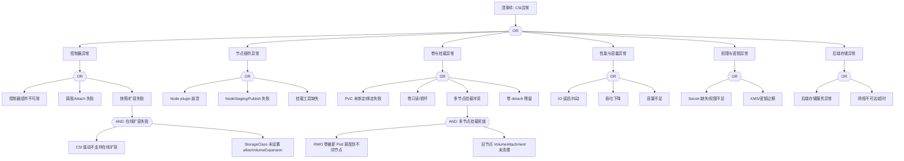

> **生产环境安全提示**
>
> 本文档包含可直接执行的运维命令。执行前请确认：当前目标集群与 Namespace 是否正确；是否具备足够的 RBAC 权限；是否已在非生产环境验证。命令风险等级标注：🔴 高风险（可能造成数据丢失或服务中断）、🟡 中风险（会修改集群状态，但通常可回滚）、🟢 低风险/只读（信息收集，无副作用）。


# CSI 存储异常故障树分析

<!-- condition: kubectl describe pod <pod> -n <ns> | grep -E 'FailedMount|FailedAttachVolume' 显示存储挂载错误 -->

# CSI 存储异常 FTA 树

## 适用范围与说明
- **目标**：覆盖 CSI 存储在生产环境中的挂载、性能与可用性异常路径。
- **范围**：驱动与控制器、节点插件、卷与快照、权限与密钥、后端存储依赖。
- **符号**：
  - **OR 门**：任一子事件成立即可触发父事件
  - **AND 门**：所有子事件同时成立才触发父事件

---

## Mermaid FTA 树



---

## 生产级观测与证据
- **事件**：
  - FailedMount / FailedAttachVolume / VolumeAttachFailed
  - ProvisioningFailed / ProvisioningCleanupFailed
  - VolumeResizeFailed / FileSystemResizeFailed
  - ExternalExpanding / VolumeSnapshotFailed
- **关键指标**：
  - 卷挂载失败率 (kubelet_volume_stats_*)
  - IO 延迟 (node_disk_io_time_seconds_total)
  - PVC 绑定时长 (kube_persistentvolumeclaim_status_phase)
  - CSI 操作耗时 (csi_operations_seconds)
  - 卷容量使用率 (kubelet_volume_stats_used_bytes)
- **关键日志**：
  - CSI controller 日志 (csi-provisioner, csi-attacher, csi-resizer)
  - CSI node plugin 日志
  - [[kubelet|kubelet]] 卷挂载日志
  - 后端存储系统日志
- **配置核对**：
  - StorageClass 配置 (provisioner, parameters, allowVolumeExpansion)
  - VolumeSnapshotClass 配置
  - Secret 引用完整性
  - 节点上挂载工具 (mount.nfs, iscsiadm, ceph-common)

---

## JSON 工作流（含与/或门控件）

```json
{
  "flow_steps": [
    { "name": "开始", "action": "start", "step": "start_csi_fta", "next_step": "event_csi_abnormal" },
    { "name": "顶事件: CSI异常", "action": "event", "step": "event_csi_abnormal", "description": "卷无法挂载/性能下降/扩容快照失败", "next_step": "gate_root_or" },
    { "name": "根因 OR 门", "action": "gate_or", "step": "gate_root_or", "control": "or_gate", "gate_type": "OR", "next_steps": ["cat_ctrl", "cat_node", "cat_vol", "cat_perf", "cat_auth", "cat_back"] },

    { "name": "类别: 控制器异常", "action": "category", "step": "cat_ctrl", "next_step": "gate_ctrl_or" },
    { "name": "控制器 OR 

## 相关链接

- [[技能/FTA Methodology and Core Principles.md|FTA 方法论]]
- [[技能/FTA Diagnostic Execution Engine.md|FTA 诊断执行引擎]]
- [[技能/ts-storage.md|存储故障排查]]

## Related

- [[README]] — FTA 故障树清单索引
- [[技能/ts-networking.md|ts-networking]] — 网络故障排查
- [[flannel-fta]] — Flannel 网络异常故障树分析
- [[技能/skill-22-daemonset-failure.md|skill-22-daemonset-failure]] — DaemonSet 故障诊断与修复 / DaemonSet Failure Diagnosis & Remediation
- [[实体/kubelet.md|kubelet]] — kubelet

- [[故障诊断/FTA故障树/list/csi-fta.md|CSI 存储异常故障树分析]]
- [[技能/ts-command-output.md|命令输出根因解析]] — Cross-reference
- [[生态参考/领域索引/backup-dr-index.md|Backup & DR 备份与灾备知识图谱索引]]
- [[生态参考/领域索引/pvc-index.md|PVC 知识图谱索引]]
- [[生态参考/领域索引/storage-index.md|Storage 存储知识图谱索引]]
- [[生态参考/领域索引/csi-index.md|CSI (Container Storage Interface) 知识图谱索引]]


<!-- risk-assessed -->
