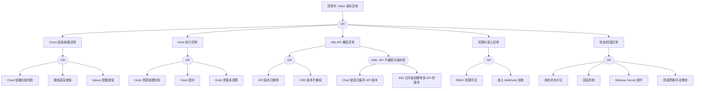

> **生产环境安全提示**
>
> 本文档包含可直接执行的运维命令。执行前请确认：当前目标集群与 Namespace 是否正确；是否具备足够的 RBAC 权限；是否已在非生产环境验证。命令风险等级标注：🔴 高风险（可能造成数据丢失或服务中断）、🟡 中风险（会修改集群状态，但通常可回滚）、🟢 低风险/只读（信息收集，无副作用）。


# Helm 发布异常故障树分析

<!-- condition: helm list -A 2>/dev/null | grep -E 'failed|pending-install' 显示失败的 Release -->

# Helm 发布异常 FTA 树

## 适用范围与说明
- **目标**：覆盖 Helm 发布失败、回滚失败与资源不一致的关键成因与路径。
- **范围**：Chart 仓库与渲染、Hook、K8s API 兼容、权限与审计、状态管理。
- **符号**：
  - **OR 门**：任一子事件成立即可触发父事件
  - **AND 门**：所有子事件同时成立才触发父事件

---

## Mermaid FTA 树



---

## 生产级观测与证据
- **事件**：
  - helm install/upgrade 失败
  - Release 状态 FAILED / PENDING_INSTALL / PENDING_UPGRADE
  - Hook 超时/失败
- **关键指标**：
  - Helm 发布失败率
  - 回滚失败率
  - Release 版本数量（过多的历史版本）
- **关键日志**：
  - Helm CLI 输出
  - Helm Controller/Flux 日志
  - apiserver 审计日志
  - Hook Job 日志
- **配置核对**：
  - Chart 版本和依赖项
  - Values 文件完整性
  - Hook 注解配置
  - API 版本兼容性
  - Release 历史版本管理 (--history-max)

---

## JSON 工作流（含与/或门控件）

```json
{
  "flow_steps": [
    { "name": "开始", "action": "start", "step": "start_helm_fta", "next_step": "event_helm_abnormal" },
    { "name": "顶事件: Helm 发布异常", "action": "event", "step": "event_helm_abnormal", "description": "Helm 发布失败/回滚失败/状态异常", "next_step": "gate_root_or" },
    { "name": "根因 OR 门", "action": "gate_or", "step": "gate_root_or", "control": "or_gate", "gate_type": "OR", "next_steps": ["cat_chart", "cat_hook", "cat_api", "cat_rbac", "cat_state"] },

    { "name": "类别: Chart 渲染/依赖异常", "action": "category", "step": "cat_chart", "next_step": "gate_chart_or" },
    { "name": "Chart OR 门", "action": "gate_or", "step": "gate_chart_or", "control": "or_gate", "gate_type": "OR", "next_steps": ["evt_chart_dep", "evt_chart_render", "evt_chart_values"] },
    {
      "name": "底事件: Chart 依赖拉取失败", "action": "bottom_event", "step": "evt_chart_dep",
      "description": "Chart 仓库不可达或依赖 Chart 版本不存在",
      "metadata": { "severity": "high", "probability": "medium", "mttr_minutes": 15,
        "detection": { "events": [], "metrics": [], "logs": ["failed to fetch", "chart not found", "repository not reachable"] },
        "remediation": { "manual_steps": ["helm repo update 刷新仓库索引", "检查仓库 URL 和认证: helm repo list", "验证网络连通性到仓库", "检查 Chart.yaml dependencies 版本约束"], "auto_actions"

## 相关链接

- [[技能/FTA Methodology and Core Principles.md|FTA 方法论]]
- [[技能/FTA Diagnostic Execution Engine.md|FTA 诊断执行引擎]]
- [[技能/ts-cluster-operations.md|集群运维排查]]

## Related

- [[flannel-fta]] — Flannel 网络异常故障树分析
- [[技能/skill-22-daemonset-failure.md|skill-22-daemonset-failure]] — DaemonSet 故障诊断与修复 / DaemonSet Failure Diagnosis & Remediation
- [[csi-fta]] — CSI 存储异常故障树分析
- [[flux]] — Flux
- [[helm]] — Helm

- [[故障诊断/FTA故障树/list/helm-fta.md|Helm 发布异常故障树分析]]
- [[归档/release-notes/cli-tools/helm/RELEASE-NOTES-4.0.md|RELEASE-NOTES-4.0]]
- [[归档/release-notes/cli-tools/helm/RELEASE-NOTES-3.18.md|RELEASE-NOTES-3.18]]
- RELEASE-NOTES-2.16
- RELEASE-NOTES-2.12
- RELEASE-NOTES-2.13
- [[归档/release-notes/cli-tools/helm/RELEASE-NOTES-4.1.md|RELEASE-NOTES-4.1]]
- [[归档/release-notes/cli-tools/helm/RELEASE-NOTES-3.19.md|RELEASE-NOTES-3.19]]
- RELEASE-NOTES-2.17
- RELEASE-NOTES-2.4
- [[归档/release-notes/cli-tools/helm/RELEASE-NOTES-3.12.md|RELEASE-NOTES-3.12]]
- RELEASE-NOTES-3.5
- RELEASE-NOTES-2.0
- RELEASE-NOTES-3.1
- [[归档/release-notes/cli-tools/helm/RELEASE-NOTES-3.16.md|RELEASE-NOTES-3.16]]
- RELEASE-NOTES-2.1
- RELEASE-NOTES-3.0
- [[归档/release-notes/cli-tools/helm/RELEASE-NOTES-3.17.md|RELEASE-NOTES-3.17]]
- RELEASE-NOTES-2.5
- RELEASE-NOTES-1.2
- [[归档/release-notes/cli-tools/helm/RELEASE-NOTES-3.13.md|RELEASE-NOTES-3.13]]
- RELEASE-NOTES-3.4
- RELEASE-NOTES-2.2
- [[归档/release-notes/cli-tools/helm/RELEASE-NOTES-3.14.md|RELEASE-NOTES-3.14]]
- RELEASE-NOTES-3.3
- [[归档/release-notes/cli-tools/helm/RELEASE-NOTES-3.20.md|RELEASE-NOTES-3.20]]
- RELEASE-NOTES-2.6
- RELEASE-NOTES-3.7
- [[归档/release-notes/cli-tools/helm/RELEASE-NOTES-3.10.md|RELEASE-NOTES-3.10]]
- RELEASE-NOTES-2.7
- RELEASE-NOTES-3.6
- [[归档/release-notes/cli-tools/helm/RELEASE-NOTES-3.11.md|RELEASE-NOTES-3.11]]
- RELEASE-NOTES-2.3
- [[归档/release-notes/cli-tools/helm/RELEASE-NOTES-3.15.md|RELEASE-NOTES-3.15]]
- RELEASE-NOTES-3.2
- RELEASE-NOTES-2.8
- RELEASE-NOTES-2.10
- [[归档/release-notes/cli-tools/helm/RELEASE-NOTES-3.9.md|RELEASE-NOTES-3.9]]
- RELEASE-NOTES-2.14
- RELEASE-NOTES-2.15
- RELEASE-NOTES-2.9
- RELEASE-NOTES-2.11
- [[归档/release-notes/cli-tools/helm/RELEASE-NOTES-3.8.md|RELEASE-NOTES-3.8]]
- [[技能/ts-command-output.md|命令输出根因解析]] — Cross-reference
- [[生态参考/领域索引/helm-index.md|Helm 全局索引]]


<!-- risk-assessed -->
