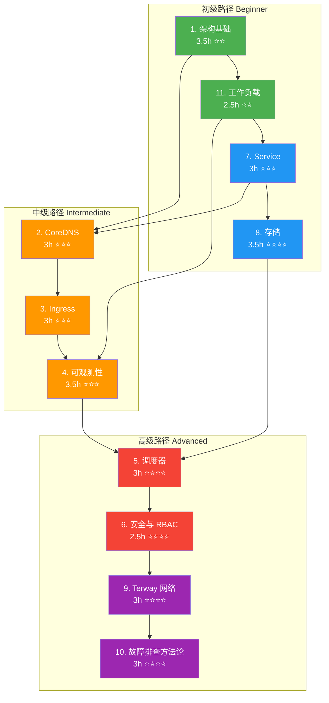
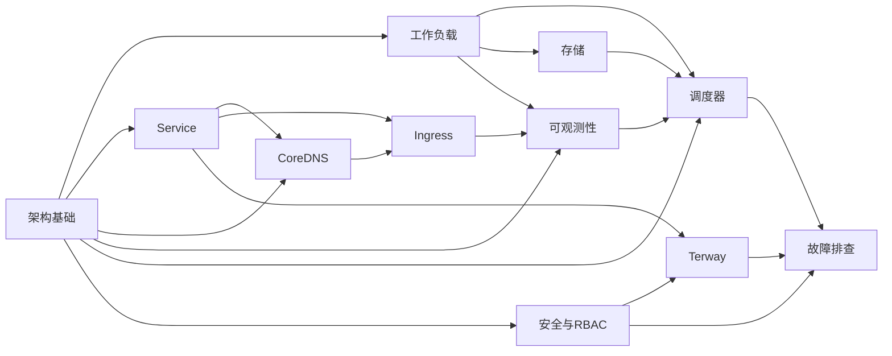

> **生产环境安全提示**
>
> 本文档包含可直接执行的运维命令。执行前请确认：当前目标集群与 Namespace 是否正确；是否具备足够的 RBAC 权限；是否已在非生产环境验证。命令风险等级标注：🔴 高风险（可能造成数据丢失或服务中断）、🟡 中风险（会修改集群状态，但通常可回滚）、🟢 低风险/只读（信息收集，无副作用）。


---
title: 'Topic: Presentations（技术演示文稿）'
description: '**11 篇 Presentation** | 面向内部培训与技术分享的 [[Kubernetes|Kubernetes]] 专题演示文稿'
category: presentations
tags:
- k8s
- presentation
- slides
- [[etcd|etcd]]
- [[kubelet|kubelet]]
- scheduler
- [[Prometheus|prometheus]]
- grafana
- jaeger
- coredns
last_updated: 2026-05
difficulty: intermediate
reading_level: intermediate
audience:
- 技术经理
- 培训师
estimated_read_time: 15min
intent_queries:
- 'Topic: Presentations（技术演示文稿） 是什么'
- '如何 Topic: Presentations（技术演示文稿）'
trigger_keywords:
- 'Topic:'
- Presentations
- 技术演示文稿
- presentations

tier: peripheral---


# Topic: Presentations（技术演示文稿）

> **11 篇 Presentation** | 面向内部培训与技术分享的 Kubernetes 专题演示文稿
> **适用版本**: Kubernetes v1.28 - v1.32 | **培训总时长**: 约 35 小时（含实验）
> **核心原则**: 系统化教学、分层进阶、生产闭环

---

## 课程总览（Training Program Overview）

本目录收录了 Kubernetes 核心技术领域的 11 篇演示文稿，覆盖从架构基础到故障排查的完整知识图谱。课程体系按认知规律编排，适用于团队内部培训、技术分享、Workshop 等场景。每篇 Presentation 包含完整的讲解大纲、关键知识点、演示命令和参考资源。

### 培训体系设计哲学

1. **分层递进** — 从概念到原理，从原理到实战，从实战到运维
2. **闭环验证** — 每个模块都有动手实验环节，确保知识可落地
3. **生产导向** — 所有示例和参数均来源于生产环境最佳实践
4. **可度量** — 配套评估标准，可量化学员掌握程度

### 培训体系总览

| 维度 | 数据 |
|:---|:---|
| 演示文稿总数 | 11 篇 |
| 总授课时长 | 约 35 小时 |
| 总实验时长 | 约 15 小时 |
| 知识点覆盖 | 架构 / 网络 / 存储 / 安全 / 调度 / 可观测性 / 排障 |
| 难度范围 | ⭐ 入门 → ⭐⭐⭐⭐⭐ 专家 |
| 目标岗位 | 开发工程师 / 运维工程师 / SRE 工程师 / 架构师 |

---

## 文档索引

| # | 文档 | 主题 | 授课时长 | 难度 |
|:---:|:---|:---|:---:|:---:|
| 1 | [架构基础](./kubernetes-architecture-fundamentals-presentation.md) | K8s 架构概览、核心组件、设计哲学 | 3.5h | ⭐⭐ |
| 2 | [CoreDNS](./kubernetes-coredns-presentation.md) | DNS 服务发现、CoreDNS 配置与调优 | 3h | ⭐⭐⭐ |
| 3 | [Ingress](./kubernetes-ingress-presentation.md) | Ingress 控制器、路由规则、TLS 终止 | 3h | ⭐⭐⭐ |
| 4 | [可观测性](./kubernetes-observability-presentation.md) | 监控、日志、链路追踪三大支柱 | 3.5h | ⭐⭐⭐ |
| 5 | [调度器](./kubernetes-scheduling-presentation.md) | 调度框架、亲和性、拓扑分布约束 | 3h | ⭐⭐⭐⭐ |
| 6 | [安全与 RBAC](./kubernetes-security-rbac-presentation.md) | RBAC 模型、ServiceAccount、安全策略 | 2.5h | ⭐⭐⭐⭐ |
| 7 | [Service](./kubernetes-service-presentation.md) | Service 类型、kube-proxy 模式、流量拓扑 | 3h | ⭐⭐⭐ |
| 8 | [存储](./kubernetes-storage-presentation.md) | PV/PVC、StorageClass、CSI 驱动 | 3.5h | ⭐⭐⭐⭐ |
| 9 | [Terway 网络](./kubernetes-terway-presentation.md) | 阿里云 Terway CNI、VPC 网络模式 | 3h | ⭐⭐⭐⭐ |
| 10 | [故障排查方法论](./kubernetes-troubleshooting-methodology-presentation.md) | FTA/FEBM、结构化排障流程 | 3h | ⭐⭐⭐⭐ |
| 11 | [工作负载](./kubernetes-workload-presentation.md) | Deployment/StatefulSet/DaemonSet/Job | 2.5h | ⭐⭐ |

## 模板

| 文件 | 说明 |
|:---|:---|
| [presentation-template.md](./presentation-template.md) | 新建 Presentation 的标准模板与创作指南 |

---

## 每个演示的详细大纲

### 1. Kubernetes 架构基础（Architecture Fundamentals）

| 属性 | 内容 |
|:---|:---|
| **文件** | `kubernetes-architecture-fundamentals-presentation.md` |
| **难度** | ⭐⭐ |
| **时长** | 3.5 小时（含 40 分钟实验） |
| **前置要求** | Linux 基础、网络基础、了解容器概念 |
| **目标受众** | K8s 初学者、运维工程师、开发人员、架构师 |

**学习目标：**

- 理解 Kubernetes 作为分布式系统的设计哲学（声明式 API、控制器模式、 reconciliation loop）
- 掌握控制平面组件（API Server、etcd、Scheduler、Controller Manager）的职责与交互方式
- 理解数据平面组件（kubelet、kube-proxy、CRI）的工作机制
- 能够追踪一个完整请求从 `kubectl apply` 到 Pod Running 的生命周期
- 掌握 etcd 运维基础与高可用拓扑设计

**详细章节：**

| 阶段 | 内容 | 时长 |
|:---|:---|:---:|
| 第一阶段 | 核心概念与术语体系（Pod/Node/Namespace/Label/Annotation） | 30min |
| 第二阶段 | 控制平面架构深度解析（API Server 认证链路、etcd 读写路径、Scheduler 框架） | 45min |
| 第三阶段 | 声明式 API 与控制器模式（Informer/SharedInformerFactory/WorkQueue） | 30min |
| 第四阶段 | 请求完整生命周期追踪（kubectl → API Server → etcd → Scheduler → kubelet → CRI） | 30min |
| 第五阶段 | 生产环境高可用与 etcd 运维（堆叠拓扑 vs 外部拓扑、备份恢复） | 30min |
| 第六阶段 | 实战演示与动手实验（集群组件探查、etcd 操作、请求追踪） | 40min |
| Q&A | 互动问答 | 15min |

**关键知识点：**
- etcd MVCC 机制与 revision 管理
- API Server 的 watch 机制与 resourceVersion
- kubelet CRI 流程（CRI-O / containerd）
- 双栈网络与 CNI 插件选择

---

### 2. CoreDNS 全栈进阶

| 属性 | 内容 |
|:---|:---|
| **文件** | `kubernetes-coredns-presentation.md` |
| **难度** | ⭐⭐⭐ |
| **时长** | 3 小时（含 30 分钟实验） |
| **前置要求** | 架构基础课程、DNS 基本概念、Linux 网络基础 |
| **目标受众** | 网络初学者、SRE 工程师、架构师、应用开发者 |

**学习目标：**

- 理解 DNS 在 Kubernetes 服务发现中的核心角色与解析流程
- 掌握 CoreDNS 插件链机制与自定义配置方法
- 深入理解 ndots 陷阱与搜索域优化策略
- 能够部署和调优 NodeLocal DNSCache
- 掌握 CoreDNS 常见问题的排查方法

**详细章节：**

| 阶段 | 内容 | 时长 |
|:---|:---|:---:|
| 第一阶段 | DNS 基础与服务发现概念（A/AAAA/SRV/PTR 记录类型） | 25min |
| 第二阶段 | CoreDNS 架构与插件深度解析（Corefile 语法、插件链顺序） | 40min |
| 第三阶段 | ndots 陷阱与搜索域优化（Pod dnsPolicy/dnsConfig 调优） | 25min |
| 第四阶段 | NodeLocal DNSCache 部署与调优（DaemonSet 模式、iptables/IPVS 重定向） | 30min |
| 第五阶段 | 实战演示与动手实验（dig/nslookup 排查、CoreDNS 性能压测） | 30min |
| 第六阶段 | 故障排查与 SRE 运维（DNS 5 秒延迟、NXDOMAIN 风暴、Autopath 插件） | 25min |
| Q&A | 互动问答 | 15min |

**关键知识点：**
- CoreDNS 插件执行顺序：`errors → health → ready → kubeurl → fallthrough → cache → loop → reload → loadbalance`
- ndots 默认值 5 导致的搜索域膨胀问题
- `hosts` 插件与 `rewrite` 插件的自定义解析
- CoreDNS 水平扩展 vs NodeLocal DNSCache 垂直优化

---

### 3. Ingress 全栈进阶

| 属性 | 内容 |
|:---|:---|
| **文件** | `kubernetes-ingress-presentation.md` |
| **难度** | ⭐⭐⭐ |
| **时长** | 3 小时（含 35 分钟实验） |
| **前置要求** | 架构基础课程、Service 课程、HTTP/HTTPS 基础 |
| **目标受众** | 初级运维、流量治理专家、SRE 工程师、网络工程师 |

**学习目标：**

- 理解 Ingress 在七层流量链路中的位置与核心功能
- 掌握 Nginx Ingress Controller 的内部架构与工作原理
- 能够实现高级路由（基于 Header/Cookie/Path 的金丝雀发布和 A/B 测试）
- 掌握 TLS 证书管理（cert-manager 自动签发与轮转）
- 能够设计 Ingress 高可用架构并处理生产问题

**详细章节：**

| 阶段 | 内容 | 时长 |
|:---|:---|:---:|
| 第一阶段 | Ingress 基础概念与入门（Ingress Resource vs Gateway API） | 25min |
| 第二阶段 | Ingress Controller 架构深度解析（Nginx 模板渲染、Lua Balancer、Endpoint 变更感知） | 35min |
| 第三阶段 | 高级路由与流量治理（金丝雀发布、A/B 测试、蓝绿部署、流量镜像） | 35min |
| 第四阶段 | TLS 证书管理与安全（cert-manager 集成、ACME/Let's Encrypt、通配符证书） | 25min |
| 第五阶段 | 实战演示与动手实验（部署 Ingress Controller、配置路由规则、TLS 签发） | 35min |
| 第六阶段 | 高可用与 SRE 运维（多实例部署、配置热加载问题、413/502/504 排障） | 25min |
| Q&A | 互动问答 | 15min |

**关键知识点：**
- `nginx.ingress.kubernetes.io/canary` 注解体系
- Ingress Nginx 的 `location` snippet 自定义与安全风险
- `proxy_next_upstream` 与重试策略
- LB → Ingress Controller → Service → Pod 完整链路追踪

---

### 4. 可观测性全栈培训

| 属性 | 内容 |
|:---|:---|
| **文件** | `kubernetes-observability-presentation.md` |
| **难度** | ⭐⭐⭐ |
| **时长** | 3.5 小时（含 35 分钟实验） |
| **前置要求** | 架构基础课程、工作负载课程 |
| **目标受众** | SRE 工程师、全栈开发、监控架构师、运维工程师 |

**学习目标：**

- 理解可观测性三大支柱（Metrics/Logs/Traces）的关系与协作
- 掌握 Prometheus 架构与 PromQL 查询语言
- 理解 ServiceMonitor/PodMonitor 自动发现机制
- 掌握日志采集架构（Fluent Bit/Fluentd）与最佳实践
- 能够构建完整的告警管理体系与自愈体系

**详细章节：**

| 阶段 | 内容 | 时长 |
|:---|:---|:---:|
| 第一阶段 | 可观测性三大支柱与基础概念（USE 方法 / RED 方法 / Google 四大黄金信号） | 30min |
| 第二阶段 | Prometheus 监控架构与 PromQL（TSDB 存储、拉模型、联邦集群） | 40min |
| 第三阶段 | ServiceMonitor 自动发现与指标采集（Relabeling、标签管理、自定义指标） | 25min |
| 第四阶段 | 日志采集架构与链路追踪（EFK/PLG 栈、OpenTelemetry、Jaeger/Tempo） | 35min |
| 第五阶段 | 实战演示与动手实验（部署监控栈、编写 PromQL、配置告警规则） | 35min |
| 第六阶段 | 告警管理与自愈体系（Alertmanager 路由、抑制、静默、Webhook 自动化） | 25min |
| Q&A | 互动问答 | 15min |

**关键知识点：**
- `container_memory_working_set_bytes` vs `container_memory_rss` 区别
- PromQL `rate()` vs `irate()` vs `increase()` 使用场景
- Recording Rules 优化高频查询性能
- 日志结构化（JSON 格式）与 trace_id/span_id 注入

---

### 5. 调度与编排策略

| 属性 | 内容 |
|:---|:---|
| **文件** | `kubernetes-scheduling-presentation.md` |
| **难度** | ⭐⭐⭐⭐ |
| **时长** | 3 小时（含 35 分钟实验） |
| **前置要求** | 架构基础课程、工作负载课程 |
| **目标受众** | 架构师、SRE 工程师、应用运维、平台工程师 |

**学习目标：**

- 理解 Kubernetes 调度框架（Scheduling Framework）的扩展点设计
- 掌握 nodeSelector / NodeAffinity / PodAffinity / Taint&Toleration 高级调度策略
- 理解优先级与抢占机制（PriorityClass / Preemption）
- 掌握拓扑分布约束（TopologySpreadConstraints）与 Pod 拓扑分布
- 能够分析调度失败原因并进行资源管理优化

**详细章节：**

| 阶段 | 内容 | 时长 |
|:---|:---|:---:|
| 第一阶段 | 调度基础与工作原理（kube-scheduler 框架、Filter/Score/Bind 三阶段） | 30min |
| 第二阶段 | 高级调度策略（nodeAffinity 多种策略、Pod 亲和/反亲和、Taint/Toleration effect） | 40min |
| 第三阶段 | 优先级、抢占与重调度（PriorityClass、Descheduler 策略配置） | 30min |
| 第四阶段 | 资源管理与 QoS 体系（Request/Limit、Burstable/Guaranteed/BestEffort、LimitRange） | 25min |
| 第五阶段 | 实战演示与动手实验（调度约束实验、资源配额管理、拓扑分布测试） | 35min |
| 第六阶段 | 性能调优与巡检（调度器性能配置、Fractional resources、集群碎片整理） | 20min |
| Q&A | 互动问答 | 15min |

**关键知识点：**
- `podFitsResources` → `podFitsHostPorts` → `CheckNodeUnschedulable` 过滤链
- `SelectorSpreadPriority` vs `TopologySpreadConstraints` 演进
- `kube-scheduler --percentage-of-nodes-to-score` 性能调优
- ResourceQuota 与 LimitRange 的协作关系

---

### 6. 安全与 RBAC 权限管理

| 属性 | 内容 |
|:---|:---|
| **文件** | `kubernetes-security-rbac-presentation.md` |
| **难度** | ⭐⭐⭐⭐ |
| **时长** | 2.5 小时（含 30 分钟实验） |
| **前置要求** | 架构基础课程 |
| **目标受众** | 安全工程师、SRE 工程师、系统管理员 |

**学习目标：**

- 理解 Kubernetes 安全 4C 模型（Cloud → Cluster → Container → Code）
- 掌握认证（Authentication）与授权（Authorization）机制
- 深入理解 RBAC 模型（Role/ClusterRole/RoleBinding/ClusterRoleBinding）
- 掌握 ServiceAccount 最佳实践与 Pod 安全标准（PSS）
- 理解准入控制（Admission Control）与安全加固策略

**详细章节：**

| 阶段 | 内容 | 时长 |
|:---|:---|:---:|
| 第一阶段 | 安全基础与 4C 模型（攻击面分析、安全纵深防御） | 25min |
| 第二阶段 | 认证与授权机制（X509 证书、OIDC、Webhook、Node 认证） | 35min |
| 第三阶段 | RBAC 深度解析（APIGroup/Resource/Verb 资源模型、Aggregated ClusterRole） | 40min |
| 第四阶段 | 实战演示（RBAC 权限配置、ServiceAccount 绑定、权限审计） | 30min |
| 第五阶段 | 准入控制与安全加固（Pod Security Standards、NetworkPolicy、Secret 加密） | 25min |
| Q&A | 互动问答 | 15min |

**关键知识点：**
- `system:anonymous` 用户与匿名访问风险
- `kubectl auth can-i --list` 权限自省
- `kubectl auth reconcile` RBAC 配置审计
- Privilege Escalation Prevention（防止提权）
- Secret 加密配置（EncryptionConfiguration）

---

### 7. Service 全栈进阶

| 属性 | 内容 |
|:---|:---|
| **文件** | `kubernetes-service-presentation.md` |
| **难度** | ⭐⭐⭐ |
| **时长** | 3 小时（含 35 分钟实验） |
| **前置要求** | 架构基础课程、网络基础 |
| **目标受众** | 初级运维、网络架构师、SRE 工程师、应用开发者 |

**学习目标：**

- 理解 Service 四种类型（ClusterIP/NodePort/LoadBalancer/ExternalName）的适用场景
- 深入理解 kube-proxy iptables/IPVS 模式的工作原理与性能差异
- 掌握 Headless Service、EndpointSlice、拓扑感知路由等高级特性
- 能够排查 Service 流量链路上的各类问题
- 理解 Service 与 CoreDNS 的协作机制

**详细章节：**

| 阶段 | 内容 | 时长 |
|:---|:---|:---:|
| 第一阶段 | Service 基础概念与四种类型（ClusterIP 分配、kube-proxy 模式选择） | 30min |
| 第二阶段 | kube-proxy iptables/IPVS 转发原理（iptables 规则链、IPVS 调度算法、conntrack） | 40min |
| 第三阶段 | 高级特性（Headless Service/EndpointSlice/拓扑感知路由/内部流量策略） | 30min |
| 第四阶段 | 实战演示与动手实验（Service 创建、iptables 规则追踪、IPVS 模式切换） | 35min |
| 第五阶段 | 故障排查与 SRE 运维（Endpoints 为空、DNS 解析失败、连接超时） | 25min |
| Q&A | 互动问答 | 15min |

**关键知识点：**
- iptables 随机 vs IPVS 调度算法（rr/lc/wrr/wlc/sh/dh）
- EndpointSlice 分片机制与大规模 Service 性能优化
- `internalTrafficPolicy: Local` 与 `externalTrafficPolicy: Local` 的区别
- conntrack 表溢出排查（`nf_conntrack_max`）

---

### 8. 存储体系全栈进阶

| 属性 | 内容 |
|:---|:---|
| **文件** | `kubernetes-storage-presentation.md` |
| **难度** | ⭐⭐⭐⭐ |
| **时长** | 3.5 小时（含 35 分钟实验） |
| **前置要求** | 架构基础课程、Linux 存储基础（LVM/文件系统） |
| **目标受众** | 初级运维、存储架构师、SRE 工程师、应用开发者 |

**学习目标：**

- 理解 PV/PVC/StorageClass 三层抽象的设计意图与使用方式
- 深入理解 CSI（Container Storage Interface）架构与插件机制
- 掌握卷挂载的完整流程（ControllerPublish → NodeStage → NodePublish）
- 能够进行存储性能调优与故障排查
- 理解数据容灾策略（备份、快照、跨区域复制）

**详细章节：**

| 阶段 | 内容 | 时长 |
|:---|:---|:---:|
| 第一阶段 | 存储基础概念与快速入门（Volume 类型、emptyDir vs hostPath vs PVC） | 30min |
| 第二阶段 | PV/PVC/StorageClass 三层抽象（绑定机制、回收策略、动态供给） | 30min |
| 第三阶段 | CSI 架构与挂载深度解析（CSI Controller/Node RPC、attach/mount 流程） | 40min |
| 第四阶段 | 生产部署与性能优化（IOPS/吞吐量调优、多路径配置、卷扩容） | 30min |
| 第五阶段 | 实战演示与动手实验（StorageClass 创建、PVC 绑定、卷快照/恢复） | 35min |
| 第六阶段 | 故障诊断与数据容灾（卷 detach 失败、io hang、Velero 备份恢复） | 30min |
| Q&A | 互动问答 | 15min |

**关键知识点：**
- `WaitForFirstConsumer` 延迟绑定策略
- CSI Snapshot/Restore 与 VolumeClone
- `fsGroup` / `fsGroupChangePolicy` 文件权限管理
- VolumeAttachment 对象与 detach 故障排查

---

### 9. Terway 网络全栈进阶

| 属性 | 内容 |
|:---|:---|
| **文件** | `kubernetes-terway-presentation.md` |
| **难度** | ⭐⭐⭐⭐ |
| **时长** | 3 小时 |
| **前置要求** | 架构基础课程、Service 课程、阿里云 VPC 基础 |
| **目标受众** | 阿里云开发者、网络架构师、SRE 工程师 |

**学习目标：**

- 理解 Terway CNI 在阿里云 ACK 中的架构设计与模式选择
- 深入理解 ENI/IPAM 机制与 Pod IP 分配策略
- 掌握三种核心网络模式（VPC 路由/ENI 独占/ENIIP）的适用场景
- 能够进行 Terway 生产部署配置与性能优化
- 掌握 Terway 常见网络问题的排查方法

**详细章节：**

| 阶段 | 内容 | 时长 |
|:---|:---|:---:|
| 第一阶段 | Terway 核心概念与模式对比（VPC 路由 vs ENI 独占 vs ENIIP 性能/密度/安全对比） | 45min |
| 第二阶段 | 架构深度解析（ENIIP 模式 IPAM 算法、CRD 管理、veth pair + policy route） | 60min |
| 第三阶段 | 生产部署与优化（ENI 配额规划、IPAMD 资源池、NetworkPolicy 性能） | 45min |
| 第四阶段 | 排障与 SRE 运维（Pod 无法获取 IP、跨节点通信失败、NetworkPolicy 生效验证） | 30min |
| Q&A | 互动问答 | 15min |

**关键知识点：**
- ENI（Elastic Network Interface）配额与实例规格的关系
- Terway `ENIIP` 模式的 secondary IP 分配策略
- `terway-eniip` 的 policy route 与 rp_filter 设置
- 固定 IP（Static IP）与 EIP 绑定场景

---

### 10. 故障排查方法论

| 属性 | 内容 |
|:---|:---|
| **文件** | `kubernetes-troubleshooting-methodology-presentation.md` |
| **难度** | ⭐⭐⭐⭐ |
| **时长** | 3 小时（含 35 分钟实验） |
| **前置要求** | 架构基础课程、至少完成 2 个其他专题课程 |
| **目标受众** | SRE 工程师、架构师、高级运维、开发人员 |

**学习目标：**

- 掌握结构化故障排查方法论（分层排查、证据驱动、快速止损）
- 理解 FTA（Fault Tree Analysis）与 FEBM（Failure Effect Based Method）方法
- 掌握从应用层 → 网络层 → 存储层 → 节点层的系统化排障流程
- 能够制定应急响应 SOP 与止损降级方案
- 掌握根因分析与复盘（Post-mortem）的标准化流程

**详细章节：**

| 阶段 | 内容 | 时长 |
|:---|:---|:---:|
| 第一阶段 | 排障心法与工具箱（kubectl 诊断命令集、journalctl/systemctl/ptrace 工具链） | 25min |
| 第二阶段 | 分层排障模型（应用层 → 网络层 → 存储层 → 节点层 → 控制平面层） | 40min |
| 第三阶段 | 常见故障模式与排查流程（CrashLoopBackOff/ImagePullBackOff/OOMKilled/网络不通） | 35min |
| 第四阶段 | 实战演练与动手实验（模拟故障注入、限时排查、恢复验证） | 35min |
| 第五阶段 | 应急响应 SOP（止损优先级、降级策略、通信机制、自动化预案） | 25min |
| 第六阶段 | 根因分析与复盘（5-Whys、Fishbone、Timeline 复原、Action Item 管理） | 20min |
| Q&A | 互动问答 | 15min |

**关键知识点：**
- `kubectl get events --sort-by='.lastTimestamp'` 事件时间线
- `kubectl debug` 临时容器诊断
- `crictl` 与 `nerdctl` 容器运行时调试
- etcd `defrag` 与 `alarm` 处理

---

### 11. 工作负载全栈进阶

| 属性 | 内容 |
|:---|:---|
| **文件** | `kubernetes-workload-presentation.md` |
| **难度** | ⭐⭐ |
| **时长** | 2.5 小时（含 30 分钟实验） |
| **前置要求** | 架构基础课程 |
| **目标受众** | 开发者、运维初学者、SRE 专家 |

**学习目标：**

- 理解四种工作负载类型（Deployment/StatefulSet/DaemonSet/Job/CronJob）的设计意图与适用场景
- 深入理解 Deployment 滚动更新策略（MaxSurge/MaxUnavailable/RevisionHistoryLimit）
- 掌握 StatefulSet 有状态应用编排（有序部署/终止、稳定的网络标识、PVC 模板）
- 理解 DaemonSet 的调度与更新策略
- 掌握 HPA/VPA 弹性伸缩策略与监控集成

**详细章节：**

| 阶段 | 内容 | 时长 |
|:---|:---|:---:|
| 第一阶段 | 工作负载基础概念（Pod 模板、Label/Selector、OwnerReference/ControllerRevision） | 30min |
| 第二阶段 | Deployment 深度解析（RollingUpdate/Recreate 策略、金丝雀发布、回滚机制） | 35min |
| 第三阶段 | StatefulSet 与有状态应用（有序索引、Headless Service、VolumeClaimTemplate） | 30min |
| 第四阶段 | 实战演示（部署多类型工作负载、滚动更新、弹性伸缩验证） | 30min |
| 第五阶段 | 监控告警与弹性伸缩（HPA custom metrics、VPA、KEDA 事件驱动） | 25min |
| Q&A | 互动问答 | 15min |

**关键知识点：**
- Deployment `.spec.strategy.rollingUpdate.maxSurge/maxUnavailable` 计算
- StatefulSet `OnDelete` vs `RollingUpdate` 更新策略与 Partition 金丝雀
- DaemonSet `nodeAffinity` 与 `tolerations` 配置
- Job `backoffLimit` / `activeDeadlineSeconds` / `ttlSecondsAfterFinished`

---

## 培训路线图（Training Roadmap）

### 学习路径 Mermaid 图



### 路径说明

| 路径 | 适用人群 | 推荐顺序 | 总时长 | 预计周期 |
|:---|:---|:---|:---:|:---:|
| **初级路径** | 新人入职、K8s 初学者 | 1→11→7→8 | ~12.5h | 2 周 |
| **中级路径** | 有基础的运维/开发 | 1→2→3→4 或 1→11→7→2→3→4 | ~16h | 3 周 |
| **高级路径** | SRE 工程师、架构师 | 5→6→9→10（需先完成中级） | ~11.5h | 2 周 |
| **完整路径** | 全栈 K8s 工程师 | 1→11→7→8→2→3→4→5→6→9→10 | ~35h | 6-8 周 |
| **SRE 专项** | SRE 团队内训 | 1→4→10→5→6 | ~15.5h | 3 周 |
| **网络专项** | 网络工程师 | 1→7→2→3→9 | ~16h | 3 周 |

### 依赖关系矩阵



---

## 使用场景

| 场景 | 推荐 Presentation | 时长建议 | 目标成果 |
|:---|:---|:---:|:---|
| 新人入职培训 | 架构基础 → 工作负载 → Service | 各 45min | 能独立操作集群 |
| SRE 技术分享 | 故障排查方法论 → 可观测性 | 各 60min | 掌握排障体系 |
| 网络专题 Workshop | CoreDNS → Ingress → Terway | 各 30min | 理解网络全链路 |
| 安全合规培训 | 安全与 RBAC | 60min | RBAC 配置能力 |
| 存储专题深入 | 存储 → 工作负载 | 各 60min | 数据容灾能力 |
| 架构师认证 | 全部 11 篇 | 35h | 全栈 K8s 能力 |

---

## 讲师准备清单（Instructor Preparation Checklist）

### 课前 1 周准备

| # | 检查项 | 完成标准 | 状态 |
|:---:|:---|:---|:---:|
| 1 | 通读目标 Presentation 全文 | 理解所有知识点和实验步骤 | ☐ |
| 2 | 准备实验集群 | 至少 3 节点集群，版本 v1.28+ | ☐ |
| 3 | 验证所有 kubectl 命令 | 每条命令在目标集群上测试通过 | ☐ |
| 4 | 准备问题模拟脚本 | CrashLoopBackOff / OOMKilled / 网络问题 | ☐ |
| 5 | 准备 PPT/Slide 资料 | 按模板结构制作，含架构图和流程图 | ☐ |
| 6 | 确认学员名单与环境 | 每位学员有独立 namespace 和 kubeconfig | ☐ |
| 7 | 打印/分发速查卡 | 对应 topic-cheat-sheet 中的命令卡片 | ☐ |

### 课前 1 天准备

| # | 检查项 | 完成标准 | 状态 |
|:---:|:---|:---|:---:|
| 1 | 集群健康检查 | 所有 Node Ready、etcd 健康、DNS 正常 | ☐ |
| 2 | 实验物料预加载 | 容器镜像预拉取到所有节点 | ☐ |
| 3 | 网络带宽与延迟测试 | 学员网络可稳定访问集群 API Server | ☐ |
| 4 | 录屏/直播工具测试 | OBS/Zoom/腾讯会议画面与声音正常 | ☐ |
| 5 | 备用方案准备 | 录屏回放 + 离线命令输出文件 | ☐ |

### 课中注意

| # | 检查项 | 说明 |
|:---:|:---|:---|
| 1 | 每 20 分钟互动一次 | 提问/投票/小练习，保持学员注意力 |
| 2 | 实验环节一对一确认 | 确保每位学员完成关键实验步骤 |
| 3 | 记录学员问题 | 收集问题用于后续 Q&A 或课程改进 |
| 4 | 控制时间节奏 | 按大纲时间分配，预留弹性缓冲 |

### 课后跟进

| # | 检查项 | 说明 |
|:---:|:---|:---|
| 1 | 发送课程资料 | PPT + 实验手册 + 命令速查卡 |
| 2 | 布置课后作业 | 按评估标准设计实操练习 |
| 3 | 收集课程反馈 | 匿名问卷（内容深度/节奏/实用性） |
| 4 | 更新进度跟踪表 | 记录每位学员的完成状态和评估成绩 |

---

## 学员环境要求（Student Environment Requirements）

### 基础工具安装

学员需提前安装以下工具，并在课前完成环境验证：

``` bash
# 🟢 低风险：只读/信息收集，通常无副作用
# === 基础工具安装 ===

# 1. 安装 kubectl (Linux)
curl -LO "https://dl.k8s.io/release/$(curl -L -s https://dl.k8s.io/release/stable.txt)/bin/linux/amd64/kubectl"
sudo install -o root -g root -m 0755 kubectl /usr/local/bin/kubectl
kubectl version --client

# macOS (Homebrew)
brew install kubectl
kubectl version --client

# 2. 安装 Helm 3
curl -fsSL https://raw.githubusercontent.com/helm/helm/main/scripts/get-helm-3 | bash
helm version

# macOS
brew install helm
helm version

# 3. 安装 jq (JSON 处理)
sudo apt-get install -y jq   # Debian/Ubuntu
brew install jq               # macOS

# 4. 安装 stern (多 Pod 日志聚合)
# Linux
curl -LO https://github.com/stern/stern/releases/latest/download/stern_linux_amd64.tar.gz
tar -xzf stern_linux_amd64.tar.gz
sudo mv stern /usr/local/bin/
# macOS
brew install stern

# 5. 安装 tcpdump (网络抓包)
sudo apt-get install -y tcpdump   # Debian/Ubuntu
# macOS 自带

# 6. 安装 dig/nslookup (DNS 诊断)
sudo apt-get install -y dnsutils   # Debian/Ubuntu
brew install bind                   # macOS
```
### 集群访问验证

> ⚠️ **🟡 中危变更** — 变更集群资源状态，建议先 --dry-run 或 diff 确认
> - `kubectl apply/create/replace`：创建/变更集群资源
> - `kubectl delete`：删除资源（可由声明式清单重建）

``` bash
# 🟡 中风险：会修改集群/资源状态，执行前请确认目标、影响范围与授权
# === 集群连通性验证 ===

# 1. 配置 kubeconfig（由讲师提供）
mkdir -p ~/.kube
# 将讲师提供的 kubeconfig 文件复制到 ~/.kube/config
export KUBECONFIG=~/.kube/config

# 2. 验证集群连通性
kubectl cluster-info
kubectl get nodes
kubectl get namespaces

# 3. 创建个人 namespace
kubectl create namespace student-$(whoami)
kubectl config set-context --current --namespace=student-$(whoami)

# 4. 验证权限
kubectl auth can-i --list
kubectl auth can-i create pods
kubectl auth can-i create deployments

# 5. 验证 DNS 解析
kubectl run test-dns --image=busybox:1.36 --rm -it --restart=Never -- nslookup kubernetes.default

# 6. 验证基本操作
kubectl run test-nginx --image=nginx:1.27 --port=80
kubectl expose pod test-nginx --port=80 --target-port=80
kubectl get all
kubectl delete pod test-nginx
```
### 版本兼容性检查

``` bash
# 🟢 低风险：只读/信息收集，通常无副作用
# === 版本兼容性检查 ===

# kubectl 版本（与集群版本差异 <= 1 个小版本）
kubectl version --short 2>/dev/null || kubectl version

# 验证 API 资源可用性
kubectl api-resources | head -20
kubectl api-versions | sort

# 验证 StorageClass
kubectl get storageclass

# 验证 IngressClass
kubectl get ingressclass

# 验证节点能力
kubectl get nodes -o wide
kubectl describe node | grep -A 5 "Capacity"
```
---

## 培训进度跟踪表（Progress Tracking Table）

### 学员进度跟踪

| 学员 | 架构基础 | 工作负载 | Service | 存储 | CoreDNS | Ingress | 可观测性 | 调度器 | 安全RBAC | Terway | 故障排查 | 总评 |
|:---|:---:|:---:|:---:|:---:|:---:|:---:|:---:|:---:|:---:|:---:|:---:|:---:|
| 张三 | | | | | | | | | | | | |
| 李四 | | | | | | | | | | | | |
| 王五 | | | | | | | | | | | | |
| ... | | | | | | | | | | | | |

**填写说明：**
- ✅ 完成（通过评估）
- 🔶 进行中
- ❌ 未开始
- N/A 不适用（根据培训路径跳过）

### 状态说明

| 状态标记 | 含义 | 后续动作 |
|:---|:---|:---|
| ✅ | 完成并通过评估 | 进入下一模块 |
| 🔶 | 学习中或实验进行中 | 跟踪进度，提供辅导 |
| ❌ | 未开始 | 按路线图安排学习 |
| ⛔ | 未通过评估 | 补充学习后重新评估 |
| N/A | 不适用 | 根据培训路径跳过 |

### 团队整体进度

| 模块 | 计划日期 | 实际日期 | 参训人数 | 通过率 | 备注 |
|:---|:---|:---|:---:|:---:|:---|
| 架构基础 | | | | | |
| 工作负载 | | | | | |
| Service | | | | | |
| 存储 | | | | | |
| CoreDNS | | | | | |
| Ingress | | | | | |
| 可观测性 | | | | | |
| 调度器 | | | | | |
| 安全 RBAC | | | | | |
| Terway | | | | | |
| 故障排查 | | | | | |

---

## 综合实验环境搭建脚本（Lab Setup Script）

以下脚本用于搭建完整的培训实验环境。建议在课前由讲师执行，确保集群就绪。

### 集群初始化脚本

> ⚠️ **🟡 中危变更** — 变更集群资源状态，建议先 --dry-run 或 diff 确认
> - `helm upgrade/install`：部署/升级 release
> - `kubectl apply/create/replace`：创建/变更集群资源

``` bash
# 🟡 中风险：会修改集群/资源状态，执行前请确认目标、影响范围与授权
#!/bin/bash
# k8s-lab-setup.sh - Kubernetes 培训实验环境一键部署脚本
# 用法: bash k8s-lab-setup.sh [学员数量]
# 示例: bash k8s-lab-setup.sh 10

set -euo pipefail

STUDENT_COUNT=${1:-5}
CLUSTER_VERSION="v1.30.0"
HELM_VERSION="v3.15.0"

echo "========================================="
echo " Kubernetes 培训实验环境部署"
echo " 学员数量: ${STUDENT_COUNT}"
echo "========================================="

# === 0. 前置检查 ===
echo "[0/8] 前置检查..."
command -v kubectl >/dev/null 2>&1 || { echo "kubectl 未安装"; exit 1; }
command -v helm >/dev/null 2>&1 || { echo "helm 未安装"; exit 1; }
kubectl cluster-info >/dev/null 2>&1 || { echo "集群不可达"; exit 1; }
echo "  ✓ 集群连通正常"

# === 1. 创建学员 Namespace ===
echo "[1/8] 创建学员 Namespace..."
for i in $(seq 1 $STUDENT_COUNT); do
  NS="student-${i}"
  kubectl create namespace "$NS" --dry-run=client -o yaml | kubectl apply -f -
  # 设置 ResourceQuota 防止资源滥用
  kubectl apply -f - <<EOF
apiVersion: v1
kind: ResourceQuota
metadata:
  name: student-quota
  namespace: ${NS}
spec:
  hard:
    requests.cpu: "4"
    requests.memory: 8Gi
    limits.cpu: "8"
    limits.memory: 16Gi
    pods: "20"
    services: "10"
    persistentvolumeclaims: "5"
EOF
  # 设置 LimitRange 默认值
  kubectl apply -f - <<EOF
apiVersion: v1
kind: LimitRange
metadata:
  name: student-limits
  namespace: ${NS}
spec:
  limits:
  - default:
      cpu: "500m"
      memory: "512Mi"
    defaultRequest:
      cpu: "100m"
      memory: "128Mi"
    max:
      cpu: "2"
      memory: "2Gi"
    min:
      cpu: "50m"
      memory: "64Mi"
    type: Container
EOF
  echo "  ✓ Namespace ${NS} 已创建"
done

# === 2. 部署 metrics-server（HPA 必需） ===
echo "[2/8] 部署 metrics-server..."
kubectl apply -f https://github.com/kubernetes-sigs/metrics-server/releases/latest/download/components.yaml
kubectl wait deployment metrics-server -n kube-system --for condition=Available --timeout=120s 2>/dev/null || true
echo "  ✓ metrics-server 已部署"

# === 3. 部署 CoreDNS 测试工具 ===
echo "[3/8] 部署 DNS 诊断工具..."
kubectl apply -f - <<EOF
apiVersion: apps/v1
kind: Deployment
metadata:
  name: dns-utils
  namespace: kube-system
spec:
  replicas: 1
  selector:
    matchLabels:
      app: dns-utils
  template:
    metadata:
      labels:
        app: dns-utils
    spec:
      containers:
      - name: dns-utils
        image: tutum/dnsutils:latest
        command: ["sleep", "3600"]
EOF
echo "  ✓ DNS 诊断工具已部署"

# === 4. 部署 Nginx Ingress Controller ===
echo "[4/8] 部署 Nginx Ingress Controller..."
helm repo add ingress-nginx https://kubernetes.github.io/ingress-nginx 2>/dev/null || true
helm repo update
helm upgrade --install ingress-nginx ingress-nginx/ingress-nginx \
  --namespace ingress-nginx \
  --create-namespace \
  --set controller.replicaCount=2 \
  --set controller.metrics.enabled=true \
  --set controller.service.type=NodePort \
  --wait --timeout 300s
echo "  ✓ Ingress Controller 已部署"

# === 5. 部署 Prometheus + Grafana 监控栈 ===
echo "[5/8] 部署监控栈 (Prometheus + Grafana)..."
helm repo add prometheus-community https://prometheus-community.github.io/helm-charts 2>/dev/null || true
helm repo update
helm upgrade --install kube-prometheus prometheus-community/kube-prometheus-stack \
  --namespace monitoring \
  --create-namespace \
  --set grafana.enabled=true \
  --set grafana.service.type=NodePort \
  --set prometheus.prometheusSpec.retention=7d \
  --set alertmanager.enabled=true \
  --wait --timeout 600s
echo "  ✓ 监控栈已部署"

# === 6. 部署示例应用 ===
echo "[6/8] 部署示例应用..."
kubectl apply -f - <<EOF
apiVersion: apps/v1
kind: Deployment
metadata:
  name: demo-app
  namespace: default
spec:
  replicas: 3
  selector:
    matchLabels:
      app: demo-app
  template:
    metadata:
      labels:
        app: demo-app
    spec:
      containers:
      - name: nginx
        image: nginx:1.27
        ports:
        - containerPort: 80
        resources:
          requests:
            cpu: 100m
            memory: 128Mi
          limits:
            cpu: 500m
            memory: 512Mi
---
apiVersion: v1
kind: Service
metadata:
  name: demo-app
  namespace: default
spec:
  selector:
    app: demo-app
  ports:
  - port: 80
    targetPort: 80
---
apiVersion: networking.k8s.io/v1
kind: Ingress
metadata:
  name: demo-app
  namespace: default
  annotations:
    nginx.ingress.kubernetes.io/rewrite-target: /
spec:
  ingressClassName: nginx
  rules:
  - http:
      paths:
      - path: /demo
        pathType: Prefix
        backend:
          service:
            name: demo-app
            port:
              number: 80
EOF
echo "  ✓ 示例应用已部署"

# === 7. 预拉取实验镜像 ===
echo "[7/8] 预拉取实验镜像到所有节点..."
IMAGES=(
  "nginx:1.27"
  "busybox:1.36"
  "redis:7-alpine"
  "mysql:8.0"
  "grafana/grafana:latest"
  "prom/prometheus:latest"
)
for node in $(kubectl get nodes -o jsonpath='{.items[*].metadata.name}'); do
  for img in "${IMAGES[@]}"; do
    kubectl debug "pull-${node}" --image="$img" --node="$node" -- sleep 1 2>/dev/null || true
  done
done
echo "  ✓ 镜像预拉取已启动"

# === 8. 环境验证 ===
echo "[8/8] 环境验证..."
echo ""
echo "=== 集群状态 ==="
kubectl get nodes -o wide
echo ""
echo "=== 组件状态 ==="
kubectl get pods -n ingress-nginx
kubectl get pods -n monitoring
echo ""
echo "=== 学员 Namespace ==="
kubectl get namespaces | grep student
echo ""

echo "========================================="
echo " 实验环境部署完成!"
echo "========================================="
echo ""
echo "下一步:"
echo "  1. 为每位学员生成 kubeconfig:"
echo "     kubectl config set-credentials student-N --token=<TOKEN>"
echo "  2. 验证学员权限:"
echo "     kubectl auth can-i --list --as=system:serviceaccount:student-N:default"
echo "  3. 获取 Grafana 密码:"
echo "     kubectl get secret -n monitoring kube-prometheus-grafana -o jsonpath='{.data.admin-password}' | base64 -d"
echo ""
```
### RBAC 配置脚本

> ⚠️ **🟡 中危变更** — 变更集群资源状态，建议先 --dry-run 或 diff 确认
> - `kubectl apply/create/replace`：创建/变更集群资源

``` bash
# 🟡 中风险：会修改集群/资源状态，执行前请确认目标、影响范围与授权
#!/bin/bash
# setup-student-rbac.sh - 为学员创建受限 RBAC 权限
# 用法: bash setup-student-rbac.sh <学员编号>

set -euo pipefail

STUDENT_ID=${1:?用法: setup-student-rbac.sh <学员编号>}
NS="student-${STUDENT_ID}"

echo "为学员 ${STUDENT_ID} 配置 RBAC..."

# 创建 ServiceAccount
kubectl apply -f - <<EOF
apiVersion: v1
kind: ServiceAccount
metadata:
  name: student-${STUDENT_ID}
  namespace: ${NS}
EOF

# 创建 Role（学员在自己 namespace 内的权限）
kubectl apply -f - <<EOF
apiVersion: rbac.authorization.k8s.io/v1
kind: Role
metadata:
  name: student-role
  namespace: ${NS}
rules:
- apiGroups: ["", "apps", "batch", "networking.k8s.io", "extensions"]
  resources: ["*"]
  verbs: ["get", "list", "watch", "create", "update", "patch", "delete"]
- apiGroups: ["autoscaling"]
  resources: ["horizontalpodautoscalers"]
  verbs: ["get", "list", "watch", "create", "update", "patch", "delete"]
EOF

# 创建 RoleBinding
kubectl apply -f - <<EOF
apiVersion: rbac.authorization.k8s.io/v1
kind: RoleBinding
metadata:
  name: student-binding
  namespace: ${NS}
subjects:
- kind: ServiceAccount
  name: student-${STUDENT_ID}
  namespace: ${NS}
roleRef:
  kind: Role
  name: student-role
  apiGroup: rbac.authorization.k8s.io
EOF

# 创建只读 ClusterRole（学员可查看集群级资源但不能修改）
kubectl apply -f - <<EOF
apiVersion: rbac.authorization.k8s.io/v1
kind: ClusterRoleBinding
metadata:
  name: student-${STUDENT_ID}-readonly
subjects:
- kind: ServiceAccount
  name: student-${STUDENT_ID}
  namespace: ${NS}
roleRef:
  kind: ClusterRole
  name: view
  apiGroup: rbac.authorization.k8s.io
EOF

# 生成 kubeconfig
SA_TOKEN=$(kubectl create token student-${STUDENT_ID} --duration=87600h)
CLUSTER_URL=$(kubectl config view --minify -o jsonpath='{.clusters[0].cluster.server}')
CLUSTER_NAME=$(kubectl config view --minify -o jsonpath='{.clusters[0].name}')

cat > "kubeconfig-student-${STUDENT_ID}.yaml" <<EOF
apiVersion: v1
kind: Config
clusters:
- cluster:
    certificate-authority-data: $(kubectl config view --raw -o jsonpath='{.clusters[0].cluster.certificate-authority-data}')
    server: ${CLUSTER_URL}
  name: ${CLUSTER_NAME}
contexts:
- context:
    cluster: ${CLUSTER_NAME}
    namespace: ${NS}
    user: student-${STUDENT_ID}
  name: student-${STUDENT_ID}
current-context: student-${STUDENT_ID}
users:
- name: student-${STUDENT_ID}
  user:
    token: ${SA_TOKEN}
EOF

echo "✓ 学员 ${STUDENT_ID} RBAC 配置完成"
echo "✓ kubeconfig 已生成: kubeconfig-student-${STUDENT_ID}.yaml"
echo ""
echo "验证命令:"
echo "  KUBECONFIG=kubeconfig-student-${STUDENT_ID}.yaml kubectl get pods"
echo "  KUBECONFIG=kubeconfig-student-${STUDENT_ID}.yaml kubectl auth can-i --list"
```
---

## 评估标准（Evaluation Criteria）

### 评估维度

每个模块的评估由三部分组成：理论知识（30%）、实操能力（50%）、综合运用（20%）。

| 维度 | 权重 | 评估方式 | 通过标准 |
|:---|:---:|:---|:---|
| **理论知识** | 30% | 闭卷测验（20 道选择题 + 5 道简答题） | 正确率 ≥ 70% |
| **实操能力** | 50% | 限时实验任务（在实验集群中完成指定操作） | 完成所有必做项 + ≥ 80% 选做项 |
| **综合运用** | 20% | 综合场景题（设计/排障/优化方案） | 方案合理、可执行、有容错设计 |

### 分级评估标准

| 等级 | 分数范围 | 能力描述 |
|:---|:---:|:---|
| **A（优秀）** | 90-100 | 完全掌握原理，能独立设计生产级方案并指导他人 |
| **B（良好）** | 80-89 | 理解核心原理，能独立完成生产操作和基础排障 |
| **C（合格）** | 70-79 | 掌握基本概念，能在指导下完成标准操作 |
| **D（不合格）** | < 70 | 需要重新学习该模块 |

### 各模块评估要点

| 模块 | 理论考点 | 实操必做项 | 实操选做项 | 综合题 |
|:---|:---|:---|:---|:---|
| 架构基础 | 控制平面组件职责、etcd 读写路径、声明式 API | 部署集群、组件探查 | etcd 备份恢复 | 设计多集群架构方案 |
| 工作负载 | Deployment 更新策略、StatefulSet 有状态特性 | 滚动更新、回滚操作 | 金丝雀发布 | 有状态应用部署方案 |
| Service | 四种 Service 类型、iptables/IPVS 原理 | 创建 Service、验证流量 | IPVS 模式切换 | Service 调试场景 |
| 存储 | PV/PVC 绑定、CSI 挂载流程 | StorageClass + PVC + Pod | 卷快照/恢复 | 存储选型方案 |
| CoreDNS | ndots 机制、插件链顺序、NodeLocal DNSCache | Corefile 修改、DNS 排查 | 部署 NodeLocal | DNS 性能优化方案 |
| Ingress | Ingress 路由规则、TLS 管理、金丝雀注解 | Ingress 规则配置、TLS 签发 | 金丝雀发布 | 多租户 Ingress 架构 |
| 可观测性 | PromQL 查询、ServiceMonitor、告警路由 | 部署监控栈、编写 PromQL | 自定义 Dashboard | 告警体系设计方案 |
| 调度器 | 亲和性/反亲和、Taint/Toleration、拓扑分布 | 调度约束配置 | Descheduler 部署 | 多租户调度策略 |
| 安全 RBAC | RBAC 资源模型、4C 安全模型、PSS | RBAC 配置与审计 | NetworkPolicy 配置 | 最小权限方案设计 |
| Terway | ENIIP 模式、IPAM 策略、VPC 路由 | Terway 模式切换 | NetworkPolicy 验证 | 网络模式选型方案 |
| 故障排查 | 分层排障模型、常见故障模式、应急 SOP | 限时故障排查实战 | 根因分析报告 | 生产问题复盘方案 |

### 证书等级

| 等级 | 要求 | 认证 |
|:---|:---|:---|
| **K8s 运维工程师（初级）** | 完成初级路径（4 模块），所有模块 ≥ C | 内部认证 |
| **K8s SRE 工程师（中级）** | 完成中级路径（7 模块），所有模块 ≥ B | 内部认证 |
| **K8s 架构师（高级）** | 完成全部 11 模块，≥ 8 个 A，其余 ≥ B | 内部认证 |

---

## 交叉引用

| 相关目录 | 关系 |
|:---|:---|
| [生产运维/topic-learn/](../生产运维/topic-learn/) | 系统化学习计划（Presentation 可作为课程配套） |
| [系统基础/topic-cheat-sheet/](../系统基础/速查卡/) | 演示中的命令速查 |
| [故障诊断/FTA故障树/](../故障诊断/FTA故障树/) | 故障排查方法论 Presentation 的深度参考 |

---

*本文档遵循 KUDIG 全栈技术人才培养标准 | 版本: 2026.05.V4*

## Related

- Domain-34: CNCF Landscape 开源项目 — Cross-reference
- [[实体/release-notes-networking.md|发布说明索引 — 网络]] — Cross-reference
- 网络 MOC — Cross-reference
- Topic 应用层架构设计最佳实践 — Cross-reference
- topic-application-architecture MOC — Cross-reference
- [[概念/bp-common-best-practices.md|Kubernetes 通用最佳实践参考]] — Cross-reference
- [[元数据/KUDIG Knowledge Base Architecture.md|KUDIG Knowledge Base Architecture]] — Cross-reference
- [[AI基础设施/基础设施/03-gpu-scheduling-management.md|GPU 调度与管理]] — Cross-reference
- [[AI基础设施/基础设施/05-distributed-training-frameworks.md|分布式训练框架]] — Cross-reference
- 发布变更 MOC — Cross-reference
- [[技能/learn-decision-tree-mermaid.md|故障排查决策树 - Mermaid 可视化版]] — Cross-reference
- [[技能/skill-22-daemonset-failure.md|DaemonSet 故障诊断与修复 / DaemonSet Failure Diagnosis & Remediation]] — Cross-reference
- [[平台工程/运维/06-monitoring-alerting-system.md|监控告警体系]] — Cross-reference
- Domain 30: 企业级灾备与业务连续性 (Enterprise Disaster Recovery & Business Continuity) — Cross-reference
- [[实体/ecosystem-changelog.md|生态组件变更日志索引]] — Cross-reference
- [[生态参考/领域索引/cluster-index.md|Cluster 集群知识图谱索引]]
- [[生态参考/领域索引/pvc-index.md|PVC 知识图谱索引]]
- [[生态参考/领域索引/terway-index.md|Terway 知识图谱索引]]
- [[生态参考/领域索引/nginx-ingress-index.md|nginx-ingress-controller 知识图谱索引]]
- [[生态参考/领域索引/higress-index.md|Higress 知识图谱索引]]


<!-- risk-assessed -->
