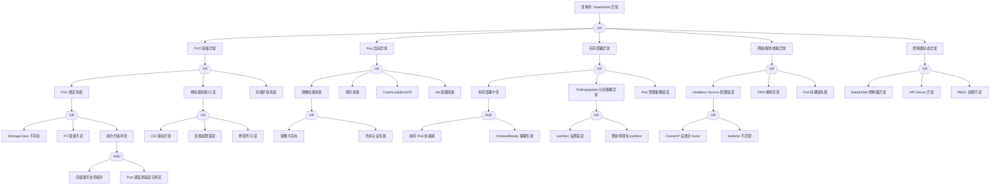

> **生产环境安全提示**
>
> 本文档包含可直接执行的运维命令。执行前请确认：当前目标集群与 Namespace 是否正确；是否具备足够的 RBAC 权限；是否已在非生产环境验证。命令风险等级标注：🔴 高风险（可能造成数据丢失或服务中断）、🟡 中风险（会修改集群状态，但通常可回滚）、🟢 低风险/只读（信息收集，无副作用）。


---
title: "StatefulSet 异常故障树分析"
category: skills
summary: "<!-- condition: kubectl get [[Pods|pods]] -n <ns> -l app=<name> -o jsonpath='{range .items[?(@.status.phase!=\'Running\')]} {.metadata.name}{\'\n\'}{end}' 显示 StatefulSet Pod 非 Running --..."
tags: ["k8s", "fta", "troubleshooting"]
sources: ["故障诊断/FTA故障树/list/statefulset-fta.md"]
created: 2026-05-21
updated: 2026-05-21
lifecycle: reviewed
lifecycle_changed: "2026-05-21"
tier: supporting
base_confidence: 0.7
---

# StatefulSet 异常故障树分析

<!-- condition: kubectl get pods -n <ns> -l app=<name> -o jsonpath='{range .items[?(@.status.phase!=\"Running\")]} {.metadata.name}{\"\n\"}{end}' 显示 StatefulSet Pod 非 Running -->

# StatefulSet 异常 FTA 树

## 适用范围与说明
- **目标**：覆盖 StatefulSet Pod 启动失败、序号错乱与持久化异常的关键成因与路径。
- **范围**：有序部署、PVC 绑定、存储与网络、镜像与探针、控制器状态。
- **符号**：
  - **OR 门**：任一子事件成立即可触发父事件
  - **AND 门**：所有子事件同时成立才触发父事件

---

## Mermaid FTA 树



---

## 生产级观测与证据
- **事件**：`FailedCreate`、`FailedMount`、`FailedScheduling`、`Unhealthy`、`ProvisioningFailed`。
- **关键指标**：`kube_statefulset_status_replicas`、`kube_statefulset_status_replicas_ready`、`kube_statefulset_status_replicas_current`、`kube_persistentvolumeclaim_status_phase`。
- **关键日志**：`kube-controller-manager`、`kubelet`、CSI 日志、etcd 日志（如果是 etcd StatefulSet）。
- **配置核对**：`volumeClaimTemplates`、滚动策略、Headless Service、资源请求、podManagementPolicy。

---

## JSON 工作流（含与/或门控件）

```json
{
  "flow_steps": [
    { "name": "开始", "action": "start", "step": "start_sts_fta", "next_step": "event_sts_abnormal" },
    { "name": "顶事件: StatefulSet 异常", "action": "event", "step": "event_sts_abnormal", "description": "Pod 未就绪/有序部署卡住/PVC 异常", "next_step": "gate_root_or" },
    { "name": "根因 OR 门", "action": "gate_or", "step": "gate_root_or", "control": "or_gate", "gate_type": "OR", "next_steps": ["cat_pvc", "cat_pod", "cat_order", "cat_net",

## 生产案例

### 案例 1: StatefulSet 更新卡住——Pod 未 Ready 阻止后续滚动

| 时间 | 事件 |
|------|------|
| 14:00 | 更新 StatefulSet 镜像版本 |
| 14:05 | Pod-2 更新后 CrashLoopBackOff，Pod-1/Pod-0 未更新 |
| 14:10 | `kubectl rollout status sts/db` 显示 "waiting for partition" |
| 14:15 | 修复 Pod-2 配置问题，`kubectl rollout resume sts/db` |
| 14:25 | 按序号 2→1→0 顺序更新完成 |

**根因**: StatefulSet 默认 OrderedReady 策略，必须等当前 Pod Ready 才更新下一个。

### 案例 2: PVC 未释放导致缩容后数据残留

**现象**: StatefulSet 从 5 缩容到 3，但 PVC-3/PVC-4 仍存在并占用存储。

**诊断**: `kubectl get pvc -l app=db` 显示 5 个 PVC，StatefulSet 缩容不自动删除 PVC

**修复**: 🟡 手动删除多余 PVC: `kubectl delete pvc data-db-3 data-db-4`，或配置 `persistentVolumeClaimRetentionPolicy`

## 升级决策点

| 级别 | 条件 | 动作 |
|------|------|------|
| P0 | 数据库主节点 Pod 不可用 | 检查 PVC 绑定 + Pod 事件 |
| P1 | 更新卡住超过 15min | 检查当前 Pod 状态 |
| P2 | 缩容后 PVC 残留 | 清理多余 PVC |

## 面试要点

1. **Q: StatefulSet 与 Deployment 的核心区别？**
   A: StatefulSet 提供: ① 稳定的网络标识(pod-name = sts-name-ordinal) ② 稳定的持久化存储(每个 Pod 独立 PVC) ③ 有序部署/扩缩/滚动更新 ④ 适合数据库、消息队列等有状态应用。

2. **Q: StatefulSet 的更新策略有哪些？**
   A: RollingUpdate(默认): 按序号从大到小逐个更新，等待 Ready；OnDelete: 手动删除 Pod 触发重建；partition: 只更新序号 >= partition 的 Pod，用于金丝雀发布。

3. **Q: Headless Service 在 StatefulSet 中的作用？**
   A: Headless Service(clusterIP: None) 为每个 Pod 创建 DNS A 记录(pod-name.svc-name.ns.svc.cluster.local)，提供稳定的网络标识，客户端可通过 DNS 发现所有副本。

## 相关链接

- [[技能/工作负载/pod/方法论/FTA Methodology and Core Principles.md|FTA 方法论]]
- [[技能/工作负载/pod/方法论/FTA Diagnostic Execution Engine.md|FTA 诊断执行引擎]]
- [[ts-workloads|工作负载故障排查]]

## Related

- [[statefulset]] — StatefulSet
- [[kubelet]] — kubelet
- [[etcd]] — etcd


<!-- risk-assessed -->
