> **生产环境安全提示**
>
> 本文档包含可直接执行的运维命令。执行前请确认：当前目标集群与 Namespace 是否正确；是否具备足够的 RBAC 权限；是否已在非生产环境验证。命令风险等级标注：🔴 高风险（可能造成数据丢失或服务中断）、🟡 中风险（会修改集群状态，但通常可回滚）、🟢 低风险/只读（信息收集，无副作用）。

# NodePool 异常故障树分析

> **FTA ID**: FTA-NODEPOOL-001
> **来源**: `故障诊断/FTA故障树/list/nodepool-fta.md`

## 适用范围与说明

- **目标**：覆盖节点池扩缩容、生命周期与可用性异常的关键成因与路径。
- **范围**：容量管理、自动扩缩容、调度与标签、节点初始化、镜像与运行时、网络与安全策略、控制面依赖。
- **符号**：
  - **OR 门**：任一子事件成立即可触发父事件
  - **AND 门**：所有子事件同时成立才触发父事件

---

## Mermaid FTA 树

```mermaid
flowchart TD
  TE[顶事件: NodePool异常]
  OR0{{OR}}
  TE --> OR0

  OR0 --> CAP[容量与扩缩容异常]
  OR0 --> INIT[节点初始化异常]
  OR0 --> SCH[调度与标签异常]
  OR0 --> IMG[镜像与运行时异常]
  OR0 --> NET[网络与安全异常]
  OR0 --> COST[配额与成本策略异常]
  OR0 --> CP[控制面/云平台依赖异常]

  CAP_OR{{OR}}
  CAP --> CAP_OR
  CAP_OR --> CAP1[扩容失败/超时]
  CAP_OR --> CAP2[缩容误判/过度缩容]
  CAP_OR --> CAP3[容量不足/上限限制]
  CAP_OR --> CAP4[竞价实例回收]

  INIT_OR{{OR}}
  INIT --> INIT_OR
  INIT_OR --> INIT1[节点加入集群失败]
  INIT_OR --> INIT2[引导脚本/云初始化失败]
  INIT_OR --> INIT3[节点池版本/镜像不一致]

  SCH_OR{{OR}}
  SCH --> SCH_OR
  SCH_OR --> SCH1[标签/污点策略错误]
  SCH_OR --> SCH2[拓扑约束冲突]
  SCH_OR --> SCH3[亲和/反亲和策略不合理]

  IMG_OR{{OR}}
  IMG --> IMG_OR
  IMG_OR --> IMG1[运行时/CRI 异常]
  IMG_OR --> IMG2[基础镜像损坏/不可用]
  IMG_OR --> IMG3[镜像仓库限流]

  NET_OR{{OR}}
  NET --> NET_OR
  NET_OR --> NET1[CNI/ENI 配额不足]
  NET_OR --> NET2[安全组/ACL 阻断]
  NET_OR --> NET3[IP 地址池耗尽]

  COST_OR{{OR}}
  COST --> COST_OR
  COST_OR --> COST1[云资源配额不足]
  COST_OR --> COST2[实例规格不可用]

  AND_COST{{"AND: 扩容完全失败"}}
  COST --> AND_COST
  AND_COST --> AND_COST1[目标规格配额不足]
  AND_COST --> AND_COST2[未配置备选实例规格]

  CP_OR{{OR}}
  CP --> CP_OR
  CP_OR --> CP1[API Server/控制面异常]
  CP_OR --> CP2[云平台 API 失败]

  AND_NET{{"AND: 网络资源耗尽"}}
  NET --> AND_NET
  AND_NET --> AND_NET1[VPC/子网 IP 地址耗尽]
  AND_NET --> AND_NET2[ENI 配额达到上限]
```



---

## 生产级观测与证据

- **事件**：
  - 扩容失败/超时事件 (ScaleUpFailed)
  - 节点池 Degraded/Updating 状态
  - 节点加入失败 (RegisterNodeFailed)
  - IP/ENI 配额不足告警
- **关键指标**：
  - 节点池期望节点数 vs 实际节点数
  - 扩容耗时 / 扩容失败率
  - VPC IP 使用率 / ENI 使用率
  - cluster-autoscaler 扩缩容决策指标
- **关键日志**：
  - cluster-autoscaler 日志
  - 云平台伸缩组日志
  - kubelet 启动日志
  - cloud-init / user-data 脚本日志
- **配置核对**：
  - 节点池规格/镜像版本
  - 标签/污点配置
  - 伸缩上下限
  - 引导脚本 (user-data)
  - 安全组/子网配置

---

## 诊断命令速查

```bash
# 🟢 低风险：只读/信息收集
# 检查节点池状态（云厂商 CRD）
kubectl get nodepool -o wide 2>/dev/null || kubectl get machinepool -o wide 2>/dev/null

# 检查 Cluster Autoscaler 日志
kubectl logs -n kube-system -l app=cluster-autoscaler --tail=100

# 检查 Pending Pod（扩容触发条件）
kubectl get pods --all-namespaces --field-selector status.phase=Pending -o wide

# 检查节点池事件
kubectl get events -A | grep -E 'NodePool|ScaleUpError|NodeGroup' | tail -20

# 检查节点加入状态
kubectl get nodes --sort-by=.metadata.creationTimestamp | tail -10
```

---

## 生产案例

### 案例1: 节点池扩容失败 - 云资源库存不足

**时间线**:
- 14:00 Cluster Autoscaler 触发扩容，新节点池需加 5 个节点
- 14:05 扩容失败: `InstanceCreationFailed: insufficient inventory in zone-a`
- 14:10 确认根因: 目标可用区 GPU 实例库存不足
- 14:15 配置多可用区回退，从 zone-b 扩容成功

**根因链**:
```
CA触发扩容 → 云API创建实例 → 目标可用区库存不足
→ 创建失败 → 节点池扩容失败 → Pod持续Pending
```

**修复**:
```bash
# 🟢 检查节点池状态
kubectl get nodepool -o wide
kubectl describe nodepool ${POOL_NAME}
# 🟡 配置多可用区
kubectl patch nodepool ${POOL} -p '{"spec":{"zones":["zone-a","zone-b","zone-c"]}}'
```

### 案例2: 节点池升级导致批量节点 NotReady

**现象**: 节点池滚动升级时多个节点同时 NotReady

**根因**: maxUnavailable 设置过大(50%)，同时升级节点过多

**修复**:
```bash
# 🟡 调整升级策略
kubectl patch nodepool ${POOL} -p '{"spec":{"rollingUpdate":{"maxUnavailable":1}}}'
# 🟢 检查节点状态
kubectl get nodes -l pool=${POOL} -o wide
```

---

## 预防与监控

### 告警规则

```yaml
groups:
- name: nodepool-alerts
  rules:
  - alert: NodePoolScaleUpFailed
    expr: cluster_autoscaler_failed_scale_ups_total > 0
    for: 10m
    labels:
      severity: critical
  - alert: NodePoolNotReady
    expr: kube_node_status_condition{condition="Ready",status="true"} == 0
    for: 10m
    labels:
      severity: critical
```

### 预防措施

| 措施 | 说明 | 优先级 |
|------|------|--------|
| 多可用区配置 | 避免单可用区库存不足 | P0 |
| 升级策略保守 | maxUnavailable=1 | P0 |
| 容量预留 | 保持 20% 资源余量 | P1 |
| 多实例规格 | 配置备选实例类型 | P1 |

---

## 面试要点

1. **Q: 节点池扩容失败的排查步骤？**
   A: 检查 CA 日志 → 确认云资源库存 → 验证配额限制 → 检查子网 IP 可用性 → 确认安全组规则

2. **Q: Cluster Autoscaler 的工作原理？**
   A: 监控 Pending Pod → 模拟调度找到合适节点池 → 调用云 API 创建实例 → 新节点加入集群 → Pod 调度成功

3. **Q: 节点池升级的最佳实践？**
   A: maxUnavailable=1 → 先 cordon+drain → 滚动替换 → PDB 保护 → 分批升级 → 验证业务正常

---

## 相关链接

- [[技能/故障诊断-节点/node/README.md|Node 异常诊断技能集]]
- [[技能/故障诊断-节点/node/01-node-notready-diagnosis.md|Node NotReady 诊断]]
- [[技能/故障诊断-节点/node/04-node-sop-runbook.md|Node SOP 与 Runbook]]
- [[故障诊断/FTA故障树/list/nodepool-fta.md|NodePool FTA 原始文件]]
- [[技能/fta-方法论/methodology/FTA Methodology and Core Principles.md|FTA 方法论]]
