> **生产环境安全提示**
>
> 本文档包含可直接执行的运维命令。执行前请确认：当前目标集群与 Namespace 是否正确；是否具备足够的 RBAC 权限；是否已在非生产环境验证。命令风险等级标注：🔴 高风险（可能造成数据丢失或服务中断）、🟡 中风险（会修改集群状态，但通常可回滚）、🟢 低风险/只读（信息收集，无副作用）。


# NodePool 异常故障树分析

<!-- condition: kubectl get events -A | grep -E 'NodePool|ScaleUpError|NodeGroup' 显示节点池异常 -->

# NodePool 异常 FTA 树

## 适用范围与说明
- **目标**：覆盖节点池扩缩容、生命周期与可用性异常的关键成因与路径。
- **范围**：容量管理、自动扩缩容、调度与标签、节点初始化、镜像与运行时、网络与安全策略、控制面依赖。
- **符号**：
  - **OR 门**：任一子事件成立即可触发父事件
  - **AND 门**：所有子事件同时成立才触发父事件

---

## Mermaid FTA 树

```mermaid
flowchart TD
  TE[顶事件: NodePool异常]
  OR0{{OR}}
  TE --> OR0

  OR0 --> CAP[容量与扩缩容异常]
  OR0 --> INIT[节点初始化异常]
  OR0 --> SCH[调度与标签异常]
  OR0 --> IMG[镜像与运行时异常]
  OR0 --> NET[网络与安全异常]
  OR0 --> COST[配额与成本策略异常]
  OR0 --> CP[控制面/云平台依赖异常]

  CAP_OR{{OR}}
  CAP --> CAP_OR
  CAP_OR --> CAP1[扩容失败/超时]
  CAP_OR --> CAP2[缩容误判/过度缩容]
  CAP_OR --> CAP3[容量不足/上限限制]
  CAP_OR --> CAP4[竞价实例回收]

  INIT_OR{{OR}}
  INIT --> INIT_OR
  INIT_OR --> INIT1[节点加入集群失败]
  INIT_OR --> INIT2[引导脚本/云初始化失败]
  INIT_OR --> INIT3[节点池版本/镜像不一致]

  SCH_OR{{OR}}
  SCH --> SCH_OR
  SCH_OR --> SCH1[标签/污点策略错误]
  SCH_OR --> SCH2[拓扑约束冲突]
  SCH_OR --> SCH3[亲和/反亲和策略不合理]

  IMG_OR{{OR}}
  IMG --> IMG_OR
  IMG_OR --> IMG1[运行时/CRI 异常]
  IMG_OR --> IMG2[基础镜像损坏/不可用]
  IMG_OR --> IMG3[镜像仓库限流]

  NET_OR{{OR}}
  NET --> NET_OR
  NET_OR --> NET1[CNI/ENI 配额不足]
  NET_OR --> NET2[安全组/ACL 阻断]
  NET_OR --> NET3[IP 地址池耗尽]

  COST_OR{{OR}}
  COST --> COST_OR
  COST_OR --> COST1[云资源配额不足]
  COST_OR --> COST2[实例规格不可用]

  %% AND 门: 配额不足 + 无备选规格
  AND_COST{{"AND: 扩容完全失败"}}
  COST --> AND_COST
  AND_COST --> AND_COST1[目标规格配额不足]
  AND_COST --> AND_COST2[未配置备选实例规格]

  CP_OR{{OR}}
  CP --> CP_OR
  CP_OR --> CP1[API Server/控制面异常]
  CP_OR --> CP2[云平台 API 失败]

  %% AND 门: IP 耗尽 + ENI 配额满
  AND_NET{{"AND: 网络资源耗尽"}}
  NET --> AND_NET
  AND_NET --> AND_NET1[VPC/子网 IP 地址耗尽]
  AND_NET --> AND_NET2[ENI 配额达到上限]
```



---

## 生产级观测与证据
- **事件**：
  - 扩容失败/超时事件 (ScaleUpFailed)
  - 节点池 Degraded/Updating 状态
  - 节点加入失败 (RegisterNodeFailed)
  - IP/ENI 配额不足告警
- **关键指标**：
  - 节点池期望节点数 vs 实际节点数
  - 扩容耗时 / 扩容失败率
  - VPC IP 使用率 / ENI 使用率
  - cluster-autoscaler 扩缩容决策指标
- **关键日志**：
  - cluster-autoscaler 日志
  - 云平台伸缩组日志
  - [[kubelet|kubelet]] 启动日志
  - cloud-init / user-data 脚本日志
- **配置核对**：
  - 节点池规格/镜像版本
  - 标签/污点配置
  - 伸缩上下限
  - 引导脚本 (user-data)
  - 安全组/子网配置

---

## JSON 工作流（含与/或门控件）

```json
{
  "flow_steps": [
    { "name": "开始", "action": "start", "step": "start_nodepool_fta", "next_step": "event_nodepool_abnormal" },
    { "name": "顶事件: NodePool异常", "action": "event", "step": "event_nodepool_abnormal", "description": "扩缩容异常/节点池不可用/节点加入失败", "next_step": "gate_root_or" },
    { "name": "根因 OR 门", "action": "gate_or", "step": "gate_root_or", "control": "or_gate", "gate_type": "OR", "next_steps": ["cat_capacity", "cat_init", "cat_schedule", "cat_image", "cat_network", "cat_cost", "cat_cp"] },

    { "name": "类别: 容量与扩缩容异常", "action": "category", "step": "cat_capacity", "next_step": "gate_capacity_or" },
    { "name": "容量 OR 门", "action": "gate_or", "step": "gate_capacity_or", "control": "or_gate", "gate_type": "OR", "next_steps": ["evt_scale_fail", "evt_scale_down_bad", "evt_capacity_limit", "evt_spot_reclaim"] },
    {
      "name": "底事件: 扩

## 生产案例

### 案例 1: 节点池扩容失败——实例规格库存不足

| 时间 | 事件 |
|------|------|
| 18:00 | 节点池自动扩容失败，Pod 持续 Pending |
| 18:05 | 云控制台显示目标可用区 ecs.g7.xlarge 库存不足 |
| 18:10 | 🟡 节点池添加备选实例规格(ecs.g7.2xlarge) |
| 18:15 | 扩容成功 |

**根因**: 节点池只配置了单一实例规格，未设置多规格/多可用区容灾。

### 案例 2: 节点池升级导致批量节点 NotReady

**现象**: 节点池批量升级 OS 后，多节点 kubelet 启动失败。

**诊断**: 新 OS 内核版本与 kubelet 不兼容

**修复**: 🔴 回滚 OS 版本或升级 kubelet，逐节点执行

## 升级决策点

| 级别 | 条件 | 动作 |
|------|------|------|
| P0 | 节点池批量异常 | 停止扩容 + 检查实例状态 |
| P1 | 扩容失败 | 检查云配额和库存 |
| P2 | 节点池配置需优化 | 调整实例规格和伸缩策略 |

## 面试要点

1. **Q: 节点池的设计最佳实践？**
   A: ① 按工作负载类型分离(计算型/内存型/GPU) ② 配置多实例规格容灾 ③ 设置合理的 min/max 节点数 ④ 启用自动修复 ⑤ 使用 taint/label 区分调度。

2. **Q: 节点池与 Cluster Autoscaler 的关系？**
   A: CA 以节点池(NodeGroup)为单位扩缩容，根据 Pending Pod 的资源需求选择合适节点池；节点池定义实例规格、可用区、标签等属性。

3. **Q: 如何安全地升级节点池？**
   A: ① 先升级测试节点池 ② 设置 maxSurge 控制并发升级数 ③ cordon + drain 再升级 ④ 逐批滚动(每批 20%) ⑤ 验证 Pod 调度正常后继续。

## 相关链接

- [[技能/fta-方法论/methodology/FTA Methodology and Core Principles.md|FTA 方法论]]
- [[技能/fta-方法论/execution-engine/FTA Diagnostic Execution Engine.md|FTA 诊断执行引擎]]
- [[技能/troubleshoot-node-issues.md|节点故障排查]]

## Related

- [[技能/assessment-daily-check-quiz.md|assessment-daily-check-quiz]] — Daily Check Quiz
- [[psp-scc-fta]] — PSP/SCC 异常故障树分析
- [[技能/skill-reference-remediation-playbook.md|skill-reference-remediation-playbook]] — Remediation Playbook
- [[cilium-fta]] — Cilium Fta
- [[实体/kubelet.md|kubelet]] — kubelet

- [[故障诊断/FTA故障树/list/nodepool-fta.md|NodePool 异常故障树分析]]

<!-- risk-assessed -->
