> **生产环境安全提示**
>
> 本文档包含可直接执行的运维命令。执行前请确认：当前目标集群与 Namespace 是否正确；是否具备足够的 RBAC 权限；是否已在非生产环境验证。命令风险等级标注：🔴 高风险（可能造成数据丢失或服务中断）、🟡 中风险（会修改集群状态，但通常可回滚）、🟢 低风险/只读（信息收集，无副作用）。

# 备份/恢复异常故障树分析

<!-- condition: velero backup get | grep -E 'Failed|PartiallyFailed' 显示备份失败 -->

# 备份/恢复异常 FTA 树

## 适用范围与说明
- **目标**：覆盖 Kubernetes 集群备份失败、恢复失败、数据不一致与 RPO/RTO 未达标的关键成因与路径。
- **范围**：etcd 快照、Velero/自定义备份工具、存储后端（S3/OSS/NFS）、加密与校验、恢复流程与顺序、依赖组件。
- **符号**：
  - **OR 门**：任一子事件成立即可触发父事件
  - **AND 门**：所有子事件同时成立才触发父事件

---

## Mermaid FTA 树

```mermaid
flowchart TD
  TE["顶事件: 备份/恢复异常<br/>数据丢失 / 恢复失败 / RPO 未达标"]
  OR0{{OR}}
  TE --> OR0

  %% ======== 一级分类 ========
  OR0 --> CAT_SNAP["A. etcd 快照异常"]
  OR0 --> CAT_APP["B. 应用级备份异常"]
  OR0 --> CAT_STORE["C. 存储后端异常"]
  OR0 --> CAT_CRYPTO["D. 加密/校验异常"]
  OR0 --> CAT_RESTORE["E. 恢复流程异常"]
  OR0 --> CAT_DEP["F. 依赖/调度异常"]

  %% ======== A. etcd 快照 ========
  A_OR{{OR}}
  CAT_SNAP --> A_OR
  A_OR --> A1["A1. 快照创建失败<br/>磁盘空间不足 / etcd 过载"]
  A_OR --> A2["A2. 快照超时<br/>数据量过大"]
  A_OR --> A3["A3. 快照不完整<br/>进程中断"]
  A_OR --> A4_AND["A4. 快照数据过期<br/>(AND 门)"]

  A4_AND_GATE{{"AND"}}
  A4_AND --> A4_AND_GATE
  A4_AND_GATE --> A4C1["CronJob 调度异常导致长时间未备份"]
  A4_AND_GATE --> A4C2["监控未检测到备份缺失"]

  %% ======== B. 应用级备份 ========
  B_OR{{OR}}
  CAT_APP --> B_OR
  B_OR --> B1["B1. Velero Backup 失败<br/>Plugin 错误"]
  B_OR --> B2["B2. 资源选择器遗漏<br/>关键资源未纳入备份"]
  B_OR --> B3["B3. Volume 快照失败<br/>CSI Snapshot 错误"]
  B_OR --> B4["B4. Hook 执行失败<br/>pre/post backup hook 报错"]
  B_OR --> B5_AND["B5. 备份数据不一致<br/>(AND 门)"]

  B5_AND_GATE{{"AND"}}
  B5_AND --> B5_AND_GATE
  B5_AND_GATE --> B5C1["有状态应用未 quiesce（数据库/缓存）"]
  B5_AND_GATE --> B5C2["备份期间有写入操作"]

  %% ======== C. 存储后端 ========
  C_OR{{OR}}
  CAT_STORE --> C_OR
  C_OR --> C1["C1. 存储不可达<br/>网络/Endpoint 异常"]
  C_OR --> C2["C2. 凭据失效<br/>AccessKey/Secret 过期"]
  C_OR --> C3["C3. 存储空间不足<br/>Bucket/Volume 已满"]
  C_OR --> C4["C4. 存储限流<br/>API 请求过多"]

  %% ======== D. 加密/校验 ========
  D_OR{{OR}}
  CAT_CRYPTO --> D_OR
  D_OR --> D1["D1. 加密密钥不可用<br/>KMS/Secret 缺失"]
  D_OR --> D2["D2. 数据完整性校验失败<br/>checksum 不匹配"]
  D_OR --> D3["D3. 密钥轮换后旧备份不可解密"]
  D_OR --> D4_AND["D4. 加密恢复死锁<br/>(AND 门)"]

  D4_AND_GATE{{"AND"}}
  D4_AND --> D4_AND_GATE
  D4_AND_GATE --> D4C1["备份加密密钥存储在集群内"]
  D4_AND_GATE --> D4C2["集群不可用需要从备份恢复"]

  %% ======== E. 恢复流程 ========
  E_OR{{OR}}
  CAT_RESTORE --> E_OR
  E_OR --> E1["E1. 恢复顺序错误<br/>CRD/Namespace 未先恢复"]
  E_OR --> E2["E2. 资源冲突<br/>已存在同名资源"]
  E_OR --> E3["E3. API 版本不兼容<br/>备份中 API 版本已移除"]
  E_OR --> E4["E4. PV/PVC 绑定失败<br/>后端存储不匹配"]
  E_OR --> E5["E5. etcd 恢复失败<br/>集群状态不一致"]
  E_OR --> E6_AND["E6. 跨版本恢复失败<br/>(AND 门)"]

  E6_AND_GATE{{"AND"}}
  E6_AND --> E6_AND_GATE
  E6_AND_GATE --> E6C1["备份来自旧版本集群"]
  E6_AND_GATE --> E6C2["目标集群已移除备份中使用的 API 版本"]

  %% ======== F. 依赖/调度 ========
  F_OR{{OR}}
  CAT_DEP --> F_OR
  F_OR --> F1["F1. 备份 CronJob 调度异常<br/>未按计划执行"]
  F_OR --> F2["F2. 备份 Pod 资源不足<br/>OOM / CPU 限制"]
  F_OR --> F3["F3. RBAC 权限不足<br/>无法读取集群资源"]
  F_OR --> F4["F4. 网络策略阻断<br/>备份 Pod 无法访问存储"]
```

---

## 生产级观测与证据

| 类别 | 关键信号 |
|------|---------|
| **事件** | Velero `Backup`/`Restore` 资源状态（Completed/PartiallyFailed/Failed）；etcd snapshot 定时任务状态；VolumeSnapshot 事件 |
| **关键指标

## 相关链接

- [[skills/FTA Methodology and Core Principles.md|FTA 方法论]]
- [[skills/FTA Diagnostic Execution Engine.md|[[FTA 诊断执行引擎|FTA 诊断执行引擎]]]]

## Related

- [[resource-quota-fta]] — ResourceQuota 异常故障树分析
- [[cloud-provider-fta]] — 云平台集成异常故障树分析
- Index.md|[[skills/Kubernetes FTA Top Events Index.md|Kubernetes FTA Top Events Index]]]] — Kubernetes FTA Top Events Index
- [[etcd]] — etcd
- [[kubernetes]] — Kubernetes (CNCF Graduated)

- [[故障诊断/topic-fta/list/backup-restore-fta.md|备份/恢复异常故障树分析]]
- [[skills/Symptom Vector Matching Engine.md|Symptom Vector Matching Engine]] — Cross-reference
- [[skills/skills-run-README.md|Skills Demo — 本地运行工单诊断技能]] — Cross-reference
- [[生态参考/topic-index/backup-dr-index.md|Backup & DR 备份与灾备知识图谱索引]]
- [[生态参考/topic-index/pvc-index.md|PVC 知识图谱索引]]
- [[生态参考/topic-index/gitops-cicd-index.md|GitOps / CI-CD 全局索引]]

<!-- risk-assessed -->
