> **生产环境安全提示**
>
> 本文档包含可直接执行的运维命令。执行前请确认：当前目标集群与 Namespace 是否正确；是否具备足够的 RBAC 权限；是否已在非生产环境验证。命令风险等级标注：🔴 高风险（可能造成数据丢失或服务中断）、🟡 中风险（会修改集群状态，但通常可回滚）、🟢 低风险/只读（信息收集，无副作用）。

# 云平台集成异常故障树分析

<!-- condition: kubectl get events -A --field-selector reason=CloudProviderError 显示云平台 API 错误 -->

# 云平台集成异常 FTA 树

## 适用范围与说明
- **目标**：覆盖云平台 API 失败、负载均衡操作失败、云盘/存储集成异常、网络资源耗尽与配额限制的关键成因与路径。
- **范围**：Cloud Controller Manager（CCM）、云 API 调用链（限流/鉴权/版本兼容）、负载均衡（SLB/ELB/NLB）、云盘（EBS/ESSD）、弹性网卡（ENI）、VPC/子网、配额与计费。
- **符号**：
  - **OR 门**：任一子事件成立即可触发父事件
  - **AND 门**：所有子事件同时成立才触发父事件

---

## Mermaid FTA 树

```mermaid
flowchart TD
  TE["顶事件: 云平台集成异常<br/>LB/存储/网络操作失败"]
  OR0{{OR}}
  TE --> OR0

  %% ======== 一级分类 ========
  OR0 --> CAT_API["A. 云 API 调用异常"]
  OR0 --> CAT_IAM["B. 凭证/IAM 异常"]
  OR0 --> CAT_LB["C. 负载均衡异常"]
  OR0 --> CAT_DISK["D. 云盘/存储异常"]
  OR0 --> CAT_NET["E. 网络/VPC 异常"]
  OR0 --> CAT_QUOTA["F. 配额与计费异常"]

  %% ======== A. 云 API ========
  A_OR{{OR}}
  CAT_API --> A_OR
  A_OR --> A1["A1. API 限流<br/>请求频率超限"]
  A_OR --> A2["A2. API 超时<br/>云平台响应慢"]
  A_OR --> A3["A3. API 版本不兼容<br/>SDK/CCM 过旧"]
  A_OR --> A4["A4. 区域/可用区问题<br/>服务降级"]

  %% ======== B. 凭证/IAM ========
  B_OR{{OR}}
  CAT_IAM --> B_OR
  B_OR --> B1["B1. AccessKey/Secret 过期"]
  B_OR --> B2["B2. RAM/IAM 角色权限不足"]
  B_OR --> B3["B3. STS Token 过期<br/>临时凭证刷新失败"]
  B_OR --> B4_AND["B4. 凭证完全失效<br/>(AND 门)"]

  B4_AND_GATE{{"AND"}}
  B4_AND --> B4_AND_GATE
  B4_AND_GATE --> B4C1["主凭证过期"]
  B4_AND_GATE --> B4C2["凭证轮换机制不可用"]

  %% ======== C. 负载均衡 ========
  C_OR{{OR}}
  CAT_LB --> C_OR
  C_OR --> C1["C1. SLB 创建失败<br/>配额/参数错误"]
  C_OR --> C2["C2. 后端服务器组异常<br/>health check 不通过"]
  C_OR --> C3["C3. 监听/端口配置错误"]
  C_OR --> C4["C4. TLS 证书异常<br/>证书过期/不匹配"]
  C_OR --> C5_AND["C5. LB 完全不可用<br/>(AND 门)"]

  C5_AND_GATE{{"AND"}}
  C5_AND --> C5_AND_GATE
  C5_AND_GATE --> C5C1["CCM 无法更新 LB 配置"]
  C5_AND_GATE --> C5C2["手动修改导致配置漂移"]

  %% ======== D. 云盘/存储 ========
  D_OR{{OR}}
  CAT_DISK --> D_OR
  D_OR --> D1["D1. 云盘创建失败<br/>库存不足/参数错误"]
  D_OR --> D2["D2. 云盘挂载失败<br/>跨可用区/已挂载"]
  D_OR --> D3["D3. 云盘扩容失败<br/>不支持在线扩容"]
  D_OR --> D4["D4. 快照/备份异常"]

  %% ======== E. 网络/VPC ========
  E_OR{{OR}}
  CAT_NET --> E_OR
  E_OR --> E1["E1. VPC 子网 IP 耗尽"]
  E_OR --> E2["E2. ENI 创建/绑定失败<br/>配额/安全组"]
  E_OR --> E3["E3. NAT 网关异常<br/>出站流量中断"]
  E_OR --> E4["E4. 安全组规则冲突"]

  %% ======== F. 配额/计费 ========
  F_OR{{OR}}
  CAT_QUOTA --> F_OR
  F_OR --> F1["F1. 实例配额不足<br/>无法创建新节点"]
  F_OR --> F2["F2. 账号欠费<br/>资源冻结"]
  F_OR --> F3["F3. 按量付费限制<br/>信用额度不足"]
```

---

## 生产级观测与证据

| 类别 | 关键信号 |
|------|---------|
| **事件** | [[Service|Service]] type=LoadBalancer 的 `SyncLoadBalancerFailed` 事件、PVC `ProvisioningFailed` 事件、Node `RegisteredNode` 失败事件 |
| **关键指标** | `cloudprovider_<provider>_api_request_duration_seconds`、`cloudprovider_<provider>_api_request_errors_total`、`kube_service_status_load_balancer_ingress`、`kube_persistentvolumeclaim_status_phase`、`kube_node_status_condition` |
| **关键日志** | cloud-controller-manager 日志（API call errors / throttling）、CSI driver 日志（disk attach/detach）、kube-controller-manager 日志（node lifecycle）、云平台操作审计日志 |
| **配置核对** | CCM 部署配置（--cloud-provider / cloud-config）、云凭证 Secret、Service annotations（LB 配置）、StorageClass paramete

## 相关链接

- [[skills/FTA Methodology and Core Principles.md|FTA 方法论]]
- [[skills/FTA Diagnostic Execution Engine.md|[[FTA 诊断执行引擎|FTA 诊断执行引擎]]]]

## Related

- [[calico-fta]] — Calico Fta
- [[skills/ts-gitops-devops.md|ts-gitops-devops]] — GitOps/DevOps 排查
- [[skills/Agent Orchestration Patterns.md|Agent Orchestration Patterns]] — Agent Orchestration Patterns for FTA
- [[service-fta]] — Service 异常故障树分析
- [[resource-quota-fta]] — ResourceQuota 异常故障树分析

- [[故障诊断/topic-fta/list/cloud-provider-fta.md|云平台集成异常故障树分析]]
- [[skills/Symptom Vector Matching Engine.md|Symptom Vector Matching Engine]] — Cross-reference
- [[skills/skills-run-README.md|Skills Demo — 本地运行工单诊断技能]] — Cross-reference
- [[生态参考/topic-index/terway-index.md|Terway 知识图谱索引]]

<!-- risk-assessed -->
