> **生产环境安全提示**
>
> 本文档包含可直接执行的运维命令。执行前请确认：当前目标集群与 Namespace 是否正确；是否具备足够的 RBAC 权限；是否已在非生产环境验证。命令风险等级标注：🔴 高风险（可能造成数据丢失或服务中断）、🟡 中风险（会修改集群状态，但通常可回滚）、🟢 低风险/只读（信息收集，无副作用）。


<!-- condition: kubectl get crd -A -o jsonpath='{range .items[?(@.status.conditions[?(@.type!=\"Established\")].type)]} {.metadata.name}{\"\n\"}{end}' 显示 CRD 异常 -->

# CRD/Operator 异常 FTA 树

## 适用范围与说明
- **目标**：覆盖 CRD/Operator 协调循环失效、版本不兼容、资源漂移、Webhook 转换失败与依赖组件异常的关键成因与路径。
- **范围**：CRD 定义/注册、Operator 控制器生命周期、Reconcile 循环、转换/验证 Webhook、RBAC/SA 认证、依赖组件（API Server / etcd / informer cache）。
- **符号**：
  - **OR 门**：任一子事件成立即可触发父事件
  - **AND 门**：所有子事件同时成立才触发父事件

---

## Mermaid FTA 树

```mermaid
flowchart TD
  TE["顶事件: CRD/Operator 异常<br/>资源不收敛 / CR 操作失败"]
  OR0{{OR}}
  TE --> OR0

  %% ======== 一级分类 ========
  OR0 --> CAT_CRD["A. CRD 定义/注册异常"]
  OR0 --> CAT_CTRL["B. Operator/Controller 运行异常"]
  OR0 --> CAT_RECON["C. Reconcile 循环异常"]
  OR0 --> CAT_WH["D. Webhook 转换/验证异常"]
  OR0 --> CAT_RBAC["E. RBAC 与认证异常"]
  OR0 --> CAT_DEP["F. 依赖/控制面异常"]

  %% ======== A. CRD 定义/注册 ========
  A_OR{{OR}}
  CAT_CRD --> A_OR
  A_OR --> A1["A1. CRD 注册失败<br/>apply/create 报错"]
  A_OR --> A2["A2. CRD schema 校验错误<br/>OpenAPI validation 失败"]
  A_OR --> A3["A3. CRD 版本兼容性问题<br/>storedVersions 不一致"]
  A_OR --> A4_AND["A4. CRD 版本升级死锁<br/>(AND 门)"]

  A4_AND_GATE{{"AND"}}
  A4_AND --> A4_AND_GATE
  A4_AND_GATE --> A4C1["对象存储版本为已废弃版本"]
  A4_AND_GATE --> A4C2["转换 Webhook 不可用"]

  %% ======== B. Operator/Controller ========
  B_OR{{OR}}
  CAT_CTRL --> B_OR
  B_OR --> B1["B1. Controller Pod 崩溃/重启<br/>OOM / panic / 配置错误"]
  B_OR --> B2["B2. Leader Election 失败<br/>锁竞争超时"]
  B_OR --> B3["B3. Controller 多副本脑裂<br/>分布式锁异常"]
  B_OR --> B4["B4. Informer Cache 不同步<br/>watch 断连 / 资源过多"]
  B_OR --> B5_AND["B5. Operator 级联删除阻塞<br/>(AND 门)"]

  B5_AND_GATE{{"AND"}}
  B5_AND --> B5_AND_GATE
  B5_AND_GATE --> B5C1["CR 上存在未清理 Finalizer"]
  B5_AND_GATE --> B5C2["负责清理的 Controller 不运行"]

  %% ======== C. Reconcile 循环 ========
  C_OR{{OR}}
  CAT_RECON --> C_OR
  C_OR --> C1["C1. Reconcile 持续报错<br/>子资源创建/更新失败"]
  C_OR --> C2["C2. 队列积压<br/>worker 不足 / 处理时间过长"]
  C_OR --> C3["C3. 资源状态漂移<br/>外部修改覆盖 Operator 期望"]
  C_OR --> C4["C4. Reconcile 无限循环<br/>status 更新触发再次入队"]
  C_OR --> C5_AND["C5. 扩缩容阻塞<br/>(AND 门)"]

  C5_AND_GATE{{"AND"}}
  C5_AND --> C5_AND_GATE
  C5_AND_GATE --> C5C1["子资源 Quota 耗尽"]
  C5_AND_GATE --> C5C2["Reconcile 无退避重试上限"]

  %% ======== D. Webhook ========
  D_OR{{OR}}
  CAT_WH --> D_OR
  D_OR --> D1["D1. 转换 Webhook 失败<br/>版本转换出错"]
  D_OR --> D2["D2. 验证 Webhook 误拒<br/>规则过严"]
  D_OR --> D3["D3. Webhook 服务不可达<br/>Endpoint / Service 异常"]
  D_OR --> D4["D4. Webhook 超时<br/>处理时间 > failurePolicy 超时"]
  D_OR --> D5_AND["D5. Webhook 级联超时<br/>(AND 门)"]

  D5_AND_GATE{{"AND"}}
  D5_AND --> D5_AND_GATE
  D5_AND_GATE --> D5C1["多个 Webhook 串联处理"]
  D5_AND_GATE --> D5C2["单个 Webhook 接近超时阈值"]

  %% ======== E. RBAC ========
  E_OR{{OR}}
  CAT_RBAC --> E_OR
  E_OR --> E1["E1. ServiceAccount 不存在/挂载失败"]
  E_OR --> E2["E2. ClusterRole/Role 权限不足<br/>缺少 verbs 或 resource"]
  E_OR --> E3["E3. Token 过期/轮换失败<br/>BoundServiceAccountToken"]
  E_OR --> E4["E4. Namespace 作用域越界<br/>跨 NS 操作被拒"]

  %% ======== F. 依赖/控制面 ========
  F_OR{{OR}}
  CAT_DEP --> F_OR
  F_OR --> F1["F1. API Server 不可用/限流<br/>watch/list 断连"]
  F_OR --> F2["F2. etcd 响应慢/不可用<br/>CR 读写延迟"]
  F_OR --> F3["F3. Informer reflector 停止<br/>context canceled / too old resource version"]
  F_OR --> F4["F4. 网络分区<br/>Operator → API Server 链路中断"]
```



---

## 生产级观测与证据

| 类别 | 关键信号 |
|------|---------|
| **事件** | `FailedCreate`、`FailedUpdate`、`FailedDelete` (子资源)；MutatingWebhookConfiguration 事件；Leader Election Lost 事件 |
| **关键指标** | `controller_runtime_reconcile_total{result="error"}`、`controller_runtime_reconcile_time_seconds`、`workqueue_depth`、`workqueue_retries_total`、`rest_client_requests_total{code=~"4.."}`、`apiserver_request_duration_seconds`、`leader_election_master_status` |
| **关键日志** | Operator 容器日志（Reconcile error / panic / context deadline）、kube-apiserver audit log（Webhook 调用记录）、kubelet 事件（Pod crash） |
| **配置核对** | CRD spec（versions / conversion / storedVersions）、ClusterRole/Role bindings、Webhook failurePolicy / timeoutSeconds、Operator Deployment replicas / resources、LeaderElectionConfig |

---

## JSON 工作流（含与/或门控件）

```json
{
  "flow_steps": [
    { "name": "开始", "action": "start", "step": "start_crd_fta", "next_step": "event_crd_abnormal" },
    { "name": "顶事件: CRD/Operator 异常", "action": "event", "step": "event_crd_abnormal", "description": "CR 资源不收敛 / 操作失败 / 状态漂移", "next_step": "gate_root_or" },
    { "name": "根因 OR 门", "action": "gate_or", "step": "gate_root_or", "control": "or_gate", "gate_type": "OR", "next_steps": ["cat_crd", "cat_ctrl", "cat_recon", "cat_wh", "cat_rbac", "cat_dep"] },

    { "name": "A. CRD 定义/注册异常", "action": "category", "step": "cat_crd", "next_step": "gate_crd_or" },
    { "name": "CRD OR 门", "action": "gate_or", "step": "gate_crd_or", "control": "or_gate", "gate_type": "OR", "next_steps": ["event_crd_register_fail", "event_crd_schema_error", "event_crd_version_compat", "event_crd_upgrade_deadlock"] },

    {
      "name": "A1. CRD 注册失败", "action": "bottom_event", "step": "event_crd_register_fail",
      "description": "kubectl apply CRD 返回错误，CRD 未出现在 API 资源列表",
      "next_step": "end",
      "metadata": {
        "severity": "critical",
        "probability": "low",
        "mttr_minutes": 15,
        "detection": {
          "events": ["kubectl apply 报错"],
          "metrics": ["apiserver_request_total{resource=customresourcedefinitions,code=~'4..'}"],
          "logs": ["kube-apiserver: unable to create CRD"]
        },
        "remediation": {
          "manual_steps": ["检查 CRD YAML 语法", "确认 API Server 可用", "检查 CRD names 是否冲突（plural/singular/shortNames）", "确认 group 不与内置 API 冲突"],
          "auto_actions": ["kubectl apply --server-side --force-conflicts"]
        },
        "version_notes": "1.22+ 移除 CRD v1beta1，必须使用 v1"
      }
    },
    {
      "name": "A2. CRD schema 校验错误", "action": "bottom_event", "step": "event_crd_schema_error",
      "description": "CRD OpenAPI v3 schema 定义错误，导致 CR 创建/更新被拒绝",
      "next_step": "end",
      "metadata": {
        "severity": "high",
        "probability": "medium",
        "mttr_minutes": 20,
        "detection": {
          "events": ["admission webhook denied: validation failed"],
          "metrics": ["apiserver_request_total{resource=<cr>,code='422'}"],
          "logs": ["invalid: spec.xxx: Invalid value"]
        },
        "remediation": {
          "manual_steps": ["对比 CRD schema 与 CR 实例字段", "检查 required 字段列表", "确认 enum/pattern/format 约束是否过严", "使用 kubectl explain <crd> 验证 schema"],
          "auto_actions": []
        },
        "version_notes": "1.25+ 强制 structural schema，不允许 x-[[实体/kubernetes|kubernetes]]-preserve-unknown-fields: true 在顶层"
      }
    },
    {
      "name": "A3. CRD 版本兼容性问题", "action": "bottom_event", "step": "event_crd_version_compat",
      "description": "storedVersions 包含已废弃版本，或多版本间字段不一致导致数据丢失",
      "next_step": "end",
      "metadata": {
        "severity": "high",
        "probability": "low",
        "mttr_minutes": 30,
        "detection": {
          "events": ["status.storedVersions 包含非 served 版本"],
          "metrics": [],
          "logs": ["unable to convert stored version"]
        },
        "remediation": {
          "manual_steps": ["列出 storedVersions: kubectl get crd <name> -o jsonpath='{.status.storedVersions}'", "确保所有 storedVersions 都在 spec.versions 且 served=true", "迁移所有对象到新版本后清理 storedVersions", "使用 kubectl get <cr> --all-namespaces -o yaml 验证字段完整性"],
          "auto_actions": ["编写迁移脚本 patch 所有 CR 到新版本"]
        },
        "version_notes": "1.22 移除 v1beta1 CRD，需确保 storedVersions 只含 v1 版本"
      }
    },
    {
      "name": "A4. CRD 版本升级死锁 (AND)", "action": "gate_and", "step": "event_crd_upgrade_deadlock",
      "control": "and_gate", "gate_type": "AND",
      "conditions": ["对象存储版本为已废弃版本 (storedVersions)", "转换 Webhook 不可用 (Service/Pod down)"],
      "combined_severity": "critical",
      "description": "存量 CR 以旧版本存储，但转换 Webhook 不可用导致无法读取/列出任何 CR 对象",
      "next_steps": ["event_crd_stored_deprecated", "event_crd_conv_webhook_down"],
      "metadata": {
        "severity": "critical",
        "probability": "rare",
        "mttr_minutes": 60,
        "detection": {
          "events": ["Internal error occurred: failed calling webhook"],
          "metrics": ["apiserver_request_total{resource=<cr>,code='500'}"],
          "logs": ["failed to call webhook: connection refused"]
        },
        "remediation": {
          "manual_steps": ["恢复转换 Webhook 服务可用性", "如 Webhook 无法恢复，临时修改 CRD conversion strategy 为 None", "通过 etcd 直接修复 storedVersions", "使用 etcdctl 直接读取并迁移对象数据"],
          "auto_actions": []
        },
        "version_notes": "Webhook conversion 从 1.16 GA，建议为转换 Webhook 配置 HA 部署"
      }
    },
    { "name": "对象存储版本为已废弃版本", "action": "and_condition", "step": "event_crd_stored_deprecated", "next_step": "end" },
    { "name": "转换 Webhook 不可用", "action": "and_condition", "step": "event_crd_conv_webhook_down", "next_step": "end" },

    { "name": "B. Operator/Controller 运行异常", "action": "category", "step": "cat_ctrl", "next_step": "gate_ctrl_or" },
    { "name": "Controller OR 门", "action": "gate_or", "step": "gate_ctrl_or", "control": "or_gate", "gate_type": "OR", "next_steps": ["event_ctrl_crash", "event_ctrl_leader_fail", "event_ctrl_split_brain", "event_ctrl_informer_desync", "event_ctrl_finalizer_block"] },

    {
      "name": "B1. Controller Pod 崩溃/重启", "action": "bottom_event", "step": "event_ctrl_crash",
      "description": "Operator Pod 频繁 CrashLoopBackOff，OOMKilled 或 panic 退出",
      "next_step": "end",
      "metadata": {
        "severity": "critical",
        "probability": "medium",
        "mttr_minutes": 15,
        "detection": {
          "events": ["CrashLoopBackOff", "OOMKilled", "BackOff"],
          "metrics": ["kube_pod_container_status_restarts_total{container=<operator>}", "container_memory_working_set_bytes"],
          "logs": ["panic: runtime error", "signal: killed"]
        },
        "remediation": {
          "manual_steps": ["检查 Pod 日志: kubectl logs <pod> --previous", "检查资源限制是否足够", "确认配置文件/环境变量正确", "检查依赖的 Secret/ConfigMap 是否存在"],
          "auto_actions": ["增大 memory limits", "修复 Operator 代码缺陷后重新部署"]
        },
        "version_notes": ""
      }
    },
    {
      "name": "B2. Leader Election 失败", "action": "bottom_event", "step": "event_ctrl_leader_fail",
      "description": "多副本 Operator 无法完成选主，所有副本均不处理 Reconcile",
      "next_step": "end",
      "metadata": {
        "severity": "critical",
        "probability": "low",
        "mttr_minutes": 10,
        "detection": {
          "events": ["leader election lost", "failed to acquire lease"],
          "metrics": ["leader_election_master_status == 0 (所有副本)"],
          "logs": ["failed to acquire lease: context deadline exceeded"]
        },
        "remediation": {
          "manual_steps": ["检查 Lease 对象: kubectl get lease -n <ns>", "确认 Lease 持有者 Pod 是否存在", "如旧 Lease 残留，删除后等待重新选主", "检查 API Server 连通性"],
          "auto_actions": ["kubectl delete lease <name> -n <ns>"]
        },
        "version_notes": "1.20+ 建议使用 coordination.k8s.io/v1 Lease 替代 ConfigMap/Endpoint 选主"
      }
    },
    {
      "name": "B3. Controller 多副本脑裂", "action": "bottom_event", "step": "event_ctrl_split_brain",
      "description": "两个副本同时认为自己是 Leader，导致重复操作或冲突更新",
      "next_step": "end",
      "metadata": {
        "severity": "critical",
        "probability": "rare",
        "mttr_minutes": 20,
        "detection": {
          "events": ["conflict: the object has been modified"],
          "metrics": ["controller_runtime_reconcile_total{result='error'} 双副本同时增长"],
          "logs": ["optimistic lock error", "the object has been modified; please apply your changes to the latest version"]
        },
        "remediation": {
          "manual_steps": ["检查 Lease 对象 holderIdentity 和 renewTime", "确认时钟同步（NTP）", "减少 LeaseDuration / 增大 RenewDeadline", "降低副本数为 1 排查"],
          "auto_actions": []
        },
        "version_notes": ""
      }
    },
    {
      "name": "B4. Informer Cache 不同步", "action": "bottom_event", "step": "event_ctrl_informer_desync",
      "description": "Informer watch 断连导致缓存过期，Reconcile 基于旧数据决策",
      "next_step": "end",
      "metadata": {
        "severity": "high",
        "probability": "medium",
        "mttr_minutes": 10,
        "detection": {
          "events": [],
          "metrics": ["workqueue_retries_total 持续增长", "rest_client_requests_total{code='410'}"],
          "logs": ["too old resource version", "watch channel closed", "reflector: Failed to watch"]
        },
        "remediation": {
          "manual_steps": ["检查 API Server 负载和连接数", "确认 Operator 到 API Server 网络稳定", "增大 --kube-api-qps / --kube-api-burst", "重启 Operator 触发 full relist"],
          "auto_actions": ["Operator 自动 relist（client-go 默认行为）"]
        },
        "version_notes": "1.27+ 支持 WatchList 特性（alpha），可优化大规模 list 性能"
      }
    },
    {
      "name": "B5. Operator 级联删除阻塞 (AND)", "action": "gate_and", "step": "event_ctrl_finalizer_block",
      "control": "and_gate", "gate_type": "AND",
      "conditions": ["CR 上存在未清理的 Finalizer", "负责清理的 Controller 不运行"],
      "combined_severity": "high",
      "description": "CR 删除操作永远 pending，因为 Finalizer 要求 Controller 处理但 Controller 已不可用",
      "next_steps": ["event_finalizer_exists", "event_ctrl_not_running"],
      "metadata": {
        "severity": "high",
        "probability": "medium",
        "mttr_minutes": 15,
        "detection": {
          "events": ["CR deletionTimestamp 已设置但对象持续存在"],
          "metrics": [],
          "logs": ["resource is being deleted but has finalizers"]
        },
        "remediation": {
          "manual_steps": ["确认 Controller 状态并尝试恢复", "如 Controller 无法恢复，手动移除 Finalizer: kubectl patch <cr> -p '{\"metadata\":{\"finalizers\":null}}' --type=merge", "确认手动移除 Finalizer 不会导致资源泄漏"],
          "auto_actions": []
        },
        "version_notes": ""
      }
    },
    { "name": "CR 上存在未清理 Finalizer", "action": "and_condition", "step": "event_finalizer_exists", "next_step": "end" },
    { "name": "负责清理的 Controller 不运行", "action": "and_condition", "step": "event_ctrl_not_running", "next_step": "end" },

    { "name": "C. Reconcile 循环异常", "action": "category", "step": "cat_recon", "next_step": "gate_recon_or" },
    { "name": "Reconcile OR 门", "action": "gate_or", "step": "gate_recon_or", "control": "or_gate", "gate_type": "OR", "next_steps": ["event_reconcile_error", "event_queue_backlog", "event_state_drift", "event_reconcile_loop", "event_scale_block"] },

    {
      "name": "C1. Reconcile 持续报错", "action": "bottom_event", "step": "event_reconcile_error",
      "description": "Reconcile 函数执行失败，子资源（Deployment/Service/ConfigMap）创建或更新失败",
      "next_step": "end",
      "metadata": {
        "severity": "high",
        "probability": "common",
        "mttr_minutes": 20,
        "detection": {
          "events": ["FailedCreate", "FailedUpdate"],
          "metrics": ["controller_runtime_reconcile_total{result='error'}", "controller_runtime_reconcile_errors_total"],
          "logs": ["Reconciler error", "failed to create/update resource"]
        },
        "remediation": {
          "manual_steps": ["检查 Operator 日志中具体报错原因", "确认子资源 schema 是否与当前 K8s 版本兼容", "确认 RBAC 权限是否包含对应资源的 verbs", "检查 ResourceQuota 或 LimitRange 限制"],
          "auto_actions": ["修复 Operator 代码并重新部署"]
        },
        "version_notes": ""
      }
    },
    {
      "name": "C2. 队列积压", "action": "bottom_event", "step": "event_queue_backlog",
      "description": "WorkQueue 深度持续增长，CR 变更长时间得不到处理",
      "next_step": "end",
      "metadata": {
        "severity": "high",
        "probability": "medium",
        "mttr_minutes": 15,
        "detection": {
          "events": [],
          "metrics": ["workqueue_depth > 100", "workqueue_queue_duration_seconds 持续增大", "workqueue_unfinished_work_seconds > 0"],
          "logs": ["processing item took too long"]
        },
        "remediation": {
          "manual_steps": ["增大 MaxConcurrentReconciles (controller-runtime)", "检查单次 Reconcile 耗时并优化", "检查外部依赖（DB/API）是否变慢", "增大 Operator 资源（CPU/内存）"],
          "auto_actions": ["HPA 扩容 Operator 副本（需支持分片）"]
        },
        "version_notes": ""
      }
    },
    {
      "name": "C3. 资源状态漂移", "action": "bottom_event", "step": "event_state_drift",
      "description": "外部修改（kubectl edit / 其他 Controller）覆盖 Operator 管理的资源，导致实际状态与 CR 声明不一致",
      "next_step": "end",
      "metadata": {
        "severity": "medium",
        "probability": "common",
        "mttr_minutes": 10,
        "detection": {
          "events": ["资源反复更新 (watch 事件)"],
          "metrics": ["controller_runtime_reconcile_total 快速增长"],
          "logs": ["detected drift in managed resource", "updating resource to match desired state"]
        },
        "remediation": {
          "manual_steps": ["确认是否有其他 Controller 也在管理同一资源", "使用 ownerReferences 标记归属", "在 Operator 中实现 3-way merge 而非覆盖", "禁止手动修改 Operator 管理的资源"],
          "auto_actions": ["Operator 自动纠偏（drift correction）"]
        },
        "version_notes": "1.20+ Server-Side Apply 可减少字段冲突"
      }
    },
    {
      "name": "C4. Reconcile 无限循环", "action": "bottom_event", "step": "event_reconcile_loop",
      "description": "Reconcile 更新 CR status 触发新 watch event，导致再次入队形成无限循环",
      "next_step": "end",
      "metadata": {
        "severity": "medium",
        "probability": "medium",
        "mttr_minutes": 30,
        "detection": {
          "events": [],
          "metrics": ["controller_runtime_reconcile_total 极高频率", "workqueue_adds_total 远超预期"],
          "logs": ["reconciling <cr> 高频出现"]
        },
        "remediation": {
          "manual_steps": ["检查是否在 Reconcile 中无条件更新 status", "实现 status 比较逻辑（只在变化时更新）", "使用 Generation/ObservedGeneration 模式", "配置 Predicate 过滤 status-only 更新"],
          "auto_actions": []
        },
        "version_notes": ""
      }
    },
    {
      "name": "C5. 扩缩容阻塞 (AND)", "action": "gate_and", "step": "event_scale_block",
      "control": "and_gate", "gate_type": "AND",
      "conditions": ["子资源 Quota 耗尽（Namespace/Cluster 级别）", "Reconcile 无退避重试上限"],
      "combined_severity": "high",
      "description": "Operator 尝试创建子资源被 Quota 拒绝，但无退避策略导致持续高频重试",
      "next_steps": ["event_quota_exhausted", "event_no_backoff"],
      "metadata": {
        "severity": "high",
        "probability": "low",
        "mttr_minutes": 20,
        "detection": {
          "events": ["exceeded quota"],
          "metrics": ["workqueue_retries_total 快速增长", "apiserver_request_total{code='403'}"],
          "logs": ["forbidden: exceeded quota"]
        },
        "remediation": {
          "manual_steps": ["检查 ResourceQuota: kubectl describe quota -n <ns>", "增大 Quota 或清理不需要的资源", "在 Operator 中实现指数退避重试"],
          "auto_actions": []
        },
        "version_notes": ""
      }
    },
    { "name": "子资源 Quota 耗尽", "action": "and_condition", "step": "event_quota_exhausted", "next_step": "end" },
    { "name": "Reconcile 无退避重试上限", "action": "and_condition", "step": "event_no_backoff", "next_step": "end" },

    { "name": "D. Webhook 转换/验证异常", "action": "category", "step": "cat_wh", "next_step": "gate_wh_or" },
    { "name": "Webhook OR 门", "action": "gate_or", "step": "gate_wh_or", "control": "or_gate", "gate_type": "OR", "next_steps": ["event_conv_fail", "event_val_reject", "event_wh_unreachable", "event_wh_timeout", "event_wh_cascade_timeout"] },

    {
      "name": "D1. 转换 Webhook 失败", "action": "bottom_event", "step": "event_conv_fail",
      "description": "CRD 多版本转换失败，API Server 无法将存储版本转换为请求版本",
      "next_step": "end",
      "metadata": {
        "severity": "critical",
        "probability": "low",
        "mttr_minutes": 25,
        "detection": {
          "events": ["Internal error occurred: failed calling webhook"],
          "metrics": ["apiserver_admission_webhook_rejection_count{type='conversion'}"],
          "logs": ["conversion webhook error", "failed to convert"]
        },
        "remediation": {
          "manual_steps": ["检查转换 Webhook 日志", "确认转换逻辑覆盖所有版本组合", "检查 Webhook 服务证书是否有效", "测试: kubectl get <cr> -o yaml --v=8"],
          "auto_actions": []
        },
        "version_notes": "Conversion webhook 从 1.15 beta, 1.16 GA"
      }
    },
    {
      "name": "D2. 验证 Webhook 误拒", "action": "bottom_event", "step": "event_val_reject",
      "description": "ValidatingWebhookConfiguration 规则过严或逻辑错误，拒绝了合法的 CR 操作",
      "next_step": "end",
      "metadata": {
        "severity": "high",
        "probability": "medium",
        "mttr_minutes": 15,
        "detection": {
          "events": ["admission webhook denied the request"],
          "metrics": ["apiserver_admission_webhook_rejection_count{name=<webhook>}"],
          "logs": ["denied the request: <specific reason>"]
        },
        "remediation": {
          "manual_steps": ["检查 Webhook 拒绝的具体原因", "临时设置 failurePolicy: Ignore 绕过", "修复 Webhook 验证逻辑", "使用 --dry-run=server 测试"],
          "auto_actions": []
        },
        "version_notes": ""
      }
    },
    {
      "name": "D3. Webhook 服务不可达", "action": "bottom_event", "step": "event_wh_unreachable",
      "description": "Webhook Service 后端 Pod 不存在、未就绪或网络不可达",
      "next_step": "end",
      "metadata": {
        "severity": "critical",
        "probability": "medium",
        "mttr_minutes": 10,
        "detection": {
          "events": ["failed calling webhook: connection refused / no endpoints"],
          "metrics": ["apiserver_admission_webhook_fail_open_count"],
          "logs": ["dial tcp: connection refused", "service has no endpoints"]
        },
        "remediation": {
          "manual_steps": ["检查 Webhook Service 和 Endpoints", "确认 Webhook Pod 运行且 Ready", "检查 NetworkPolicy 是否阻断 API Server → Webhook 流量", "检查 Webhook caBundle 是否正确"],
          "auto_actions": ["设置 failurePolicy: Ignore 防止阻塞（需评估安全性）"]
        },
        "version_notes": ""
      }
    },
    {
      "name": "D4. Webhook 超时", "action": "bottom_event", "step": "event_wh_timeout",
      "description": "Webhook 处理时间超过 timeoutSeconds（默认 10s）",
      "next_step": "end",
      "metadata": {
        "severity": "high",
        "probability": "low",
        "mttr_minutes": 15,
        "detection": {
          "events": ["context deadline exceeded"],
          "metrics": ["apiserver_admission_webhook_admission_duration_seconds > 10"],
          "logs": ["webhook timeout", "context deadline exceeded"]
        },
        "remediation": {
          "manual_steps": ["增大 timeoutSeconds（最大 30s）", "优化 Webhook 处理逻辑", "检查 Webhook 到外部依赖的延迟", "使用 matchPolicy: Equivalent 减少不必要调用"],
          "auto_actions": []
        },
        "version_notes": "1.14+ 支持自定义 timeoutSeconds"
      }
    },
    {
      "name": "D5. Webhook 级联超时 (AND)", "action": "gate_and", "step": "event_wh_cascade_timeout",
      "control": "and_gate", "gate_type": "AND",
      "conditions": ["多个 Webhook 串联处理同一请求", "单个 Webhook 处理时间接近超时阈值"],
      "combined_severity": "high",
      "description": "多个 Webhook 串联时累计处理时间超过限制，即使单个 Webhook 未超时也导致请求失败",
      "next_steps": ["event_multi_webhook_chain", "event_single_wh_near_timeout"],
      "metadata": {
        "severity": "high",
        "probability": "rare",
        "mttr_minutes": 25,
        "detection": {
          "events": ["context deadline exceeded（在第 N 个 Webhook 处）"],
          "metrics": ["apiserver_admission_webhook_admission_duration_seconds 分 Webhook 名统计"],
          "logs": ["total webhook processing exceeded"]
        },
        "remediation": {
          "manual_steps": ["审计所有匹配该资源的 Webhook 数量", "减少不必要的 Webhook 匹配范围", "使用 objectSelector / namespaceSelector 精确匹配", "优化各 Webhook 处理时间"],
          "auto_actions": []
        },
        "version_notes": ""
      }
    },
    { "name": "多个 Webhook 串联处理", "action": "and_condition", "step": "event_multi_webhook_chain", "next_step": "end" },
    { "name": "单个 Webhook 接近超时阈值", "action": "and_condition", "step": "event_single_wh_near_timeout", "next_step": "end" },

    { "name": "E. RBAC 与认证异常", "action": "category", "step": "cat_rbac", "next_step": "gate_rbac_or" },
    { "name": "RBAC OR 门", "action": "gate_or", "step": "gate_rbac_or", "control": "or_gate", "gate_type": "OR", "next_steps": ["event_sa_missing", "event_rbac_insufficient", "event_token_expired", "event_ns_scope"] },

    {
      "name": "E1. ServiceAccount 不存在/挂载失败", "action": "bottom_event", "step": "event_sa_missing",
      "description": "Operator 引用的 ServiceAccount 不存在或 Token 未正确挂载",
      "next_step": "end",
      "metadata": {
        "severity": "critical",
        "probability": "low",
        "mttr_minutes": 10,
        "detection": {
          "events": ["MountVolume.SetUp failed: serviceaccount not found"],
          "metrics": [],
          "logs": ["serviceaccount <name> not found"]
        },
        "remediation": {
          "manual_steps": ["创建缺失的 ServiceAccount", "确认 Deployment serviceAccountName 配置正确", "检查 SA automountServiceAccountToken 设置"],
          "auto_actions": []
        },
        "version_notes": "1.24+ 默认不自动创建 SA secret，使用 TokenRequest API"
      }
    },
    {
      "name": "E2. ClusterRole/Role 权限不足", "action": "bottom_event", "step": "event_rbac_insufficient",
      "description": "Operator SA 缺少操作 CR 或子资源所需的 RBAC 权限",
      "next_step": "end",
      "metadata": {
        "severity": "high",
        "probability": "common",
        "mttr_minutes": 10,
        "detection": {
          "events": ["forbidden: User <sa> cannot <verb> resource <resource>"],
          "metrics": ["rest_client_requests_total{code='403'}"],
          "logs": ["forbidden", "cannot list/get/create/update/delete"]
        },
        "remediation": {
          "manual_steps": ["kubectl auth can-i --as=system:serviceaccount:<ns>:<sa> <verb> <resource>", "检查 ClusterRole/Role 定义", "确认 ClusterRoleBinding/RoleBinding 绑定正确", "补充缺失的 verbs/resources/apiGroups"],
          "auto_actions": []
        },
        "version_notes": ""
      }
    },
    {
      "name": "E3. Token 过期/轮换失败", "action": "bottom_event", "step": "event_token_expired",
      "description": "BoundServiceAccountToken 过期后未正确轮换，API 请求被拒绝",
      "next_step": "end",
      "metadata": {
        "severity": "high",
        "probability": "low",
        "mttr_minutes": 10,
        "detection": {
          "events": ["Unauthorized"],
          "metrics": ["rest_client_requests_total{code='401'}"],
          "logs": ["token expired", "Unauthorized"]
        },
        "remediation": {
          "manual_steps": ["检查 Token 有效期配置", "确认 kubelet 正常运行（负责 Token 轮换）", "重启 Operator Pod 刷新 Token", "检查 --service-account-max-token-expiration 设置"],
          "auto_actions": []
        },
        "version_notes": "1.22+ BoundServiceAccountToken GA，Token 默认 1h 有效期并自动轮换"
      }
    },
    {
      "name": "E4. Namespace 作用域越界", "action": "bottom_event", "step": "event_ns_scope",
      "description": "Namespace-scoped Operator 尝试操作其他 Namespace 资源，被 RBAC 拒绝",
      "next_step": "end",
      "metadata": {
        "severity": "medium",
        "probability": "low",
        "mttr_minutes": 15,
        "detection": {
          "events": ["forbidden: cannot <verb> in namespace <other-ns>"],
          "metrics": ["rest_client_requests_total{code='403'}"],
          "logs": ["cannot access resource in namespace"]
        },
        "remediation": {
          "manual_steps": ["确认 Operator 作用域（Namespace/Cluster）", "如需跨 Namespace，使用 ClusterRole + ClusterRoleBinding", "或在目标 Namespace 创建 RoleBinding", "限制 Operator watch 范围与 RBAC 范围一致"],
          "auto_actions": []
        },
        "version_notes": ""
      }
    },

    { "name": "F. 依赖/控制面异常", "action": "category", "step": "cat_dep", "next_step": "gate_dep_or" },
    { "name": "依赖 OR 门", "action": "gate_or", "step": "gate_dep_or", "control": "or_gate", "gate_type": "OR", "next_steps": ["event_apiserver_issue", "event_etcd_slow", "event_informer_stop", "event_network_partition"] },

    {
      "name": "F1. API Server 不可用/限流", "action": "bottom_event", "step": "event_apiserver_issue",
      "description": "API Server 过载或限流导致 Operator 的 watch/list/CRUD 操作失败",
      "next_step": "end",
      "metadata": {
        "severity": "critical",
        "probability": "low",
        "mttr_minutes": 15,
        "detection": {
          "events": ["Throttling"],
          "metrics": ["apiserver_request_total{code='429'}", "rest_client_requests_total{code='429'}", "apiserver_current_inflight_requests"],
          "logs": ["Throttling request", "Too Many Requests"]
        },
        "remediation": {
          "manual_steps": ["检查 API Server 资源使用和请求量", "降低 Operator QPS/Burst 配置", "增加 API Server 副本", "使用 priority and fairness 调整请求优先级"],
          "auto_actions": []
        },
        "version_notes": "1.20+ APF (API Priority and Fairness) GA 替代 max-requests-inflight"
      }
    },
    {
      "name": "F2. etcd 响应慢/不可用", "action": "bottom_event", "step": "event_etcd_slow",
      "description": "etcd 性能下降导致 CR 读写延迟增大或超时",
      "next_step": "end",
      "metadata": {
        "severity": "critical",
        "probability": "low",
        "mttr_minutes": 20,
        "detection": {
          "events": [],
          "metrics": ["etcd_request_duration_seconds > 1", "etcd_disk_wal_fsync_duration_seconds"],
          "logs": ["etcdserver: request timed out", "apply request took too long"]
        },
        "remediation": {
          "manual_steps": ["检查 etcd 磁盘 IO 性能", "检查 etcd 集群健康状态", "评估 CR 对象数量和大小对 etcd 的影响", "考虑 CR 对象压缩或清理"],
          "auto_actions": []
        },
        "version_notes": ""
      }
    },
    {
      "name": "F3. Informer reflector 停止", "action": "bottom_event", "step": "event_informer_stop",
      "description": "Informer watch 连接被服务端关闭且无法恢复，缓存停止更新",
      "next_step": "end",
      "metadata": {
        "severity": "high",
        "probability": "low",
        "mttr_minutes": 10,
        "detection": {
          "events": [],
          "metrics": ["workqueue_depth 停止变化（无新事件入队）"],
          "logs": ["reflector: Failed to watch", "the server has asked for the client to provide credentials", "context canceled"]
        },
        "remediation": {
          "manual_steps": ["检查 Operator 到 API Server 的网络连接", "确认 SA Token 仍然有效", "重启 Operator Pod 强制重建 Informer", "检查 API Server 是否有连接数限制"],
          "auto_actions": ["Operator 重启后自动恢复"]
        },
        "version_notes": ""
      }
    },
    {
      "name": "F4. 网络分区", "action": "bottom_event", "step": "event_network_partition",
      "description": "Operator Pod 所在节点与 API Server 网络断开",
      "next_step": "end",
      "metadata": {
        "severity": "critical",
        "probability": "rare",
        "mttr_minutes": 15,
        "detection": {
          "events": ["NodeNotReady（Operator 所在节点）"],
          "metrics": ["up{job='<operator>'} == 0"],
          "logs": ["dial tcp <apiserver>:443: i/o timeout", "connection refused"]
        },
        "remediation": {
          "manual_steps": ["检查节点网络状态", "确认 kube-proxy / CNI 正常", "检查防火墙规则", "考虑部署 Operator 到控制面节点或使用 PDB 保护"],
          "auto_actions": ["Kubernetes 自动在其他节点重新调度 Operator Pod"]
        },
        "version_notes": ""
      }
    },

    { "name": "结束", "action": "end", "step": "end" }
  ]
}
```

---

## 版本适配（1.19–1.30）

| 版本范围 | 关键变化 |
|---------|---------|
| **1.19–1.21** | CRD `apiextensions.k8s.io/v1beta1` 仍可用但已 deprecated；Webhook matchPolicy 默认 `Exact` |
| **1.22** | **CRD v1beta1 移除**，必须使用 `apiextensions.k8s.io/v1`；Webhook `admissionregistration.k8s.io/v1beta1` 移除 |
| **1.23–1.24** | CEL validation 引入（alpha）；ServiceAccount Token 不再自动创建 Secret（1.24） |

> ⚠️ **弃用警告**: `PodSecurityPolicy` 已在 Kubernetes v1.25 中正式移除。
> 请使用 [Pod Security Admission (PSA)](https://kubernetes.io/docs/concepts/security/pod-security-admission/) 替代。

| **1.25** | CEL validation beta；PodSecurityPolicy 移除，Operator 部署需迁移到 PodSecurity admission |
| **1.26–1.27** | CRD validation ratcheting（alpha 1.26, beta 1.28）；WatchList（alpha 1.27） |
| **1.28–1.30** | CRD SelectableFields（1.30 beta）；ValidatingAdmissionPolicy GA（1.30）可替代部分 Webhook |
| **共性** | 遵循 `fta-methodology-and-agentic-practices.md` 中的"版本适配基线"；Operator 框架（controller-runtime/kubebuilder/operator-sdk）版本需与 K8s API 版本对齐 |


<!-- risk-assessed -->
