> **生产环境安全提示**
>
> 本文档包含可直接执行的运维命令。执行前请确认：当前目标集群与 Namespace 是否正确；是否具备足够的 RBAC 权限；是否已在非生产环境验证。命令风险等级标注：🔴 高风险（可能造成数据丢失或服务中断）、🟡 中风险（会修改集群状态，但通常可回滚）、🟢 低风险/只读（信息收集，无副作用）。


# GPU 异常故障树分析

<!-- condition: kubectl get nodes -o jsonpath='{.items[*].status.capacity.nvidia.com/gpu}' 返回 0 或 Pod 日志显示 CUDA_ERROR -->

# GPU 异常 FTA 树

## 适用范围与说明
- **目标**：覆盖 GPU 设备不可用、调度失败、驱动不兼容、运行时异常与资源碎片化的关键成因与路径。
- **范围**：Device Plugin、驱动/CUDA/cuDNN 兼容性、容器运行时（nvidia-container-runtime）、调度与拓扑、配额与资源管理、节点与硬件问题。
- **符号**：
  - **OR 门**：任一子事件成立即可触发父事件
  - **AND 门**：所有子事件同时成立才触发父事件

---

## Mermaid FTA 树

```mermaid
flowchart TD
  TE["顶事件: GPU 异常<br/>GPU 不可用 / 调度失败 / 训练中断"]
  OR0{{OR}}
  TE --> OR0

  %% ======== 一级分类 ========
  OR0 --> CAT_DEV["A. Device Plugin 异常"]
  OR0 --> CAT_DRV["B. 驱动/CUDA 兼容性异常"]
  OR0 --> CAT_SCHED["C. 调度与拓扑异常"]
  OR0 --> CAT_RT["D. 容器运行时/GPU 运行时异常"]
  OR0 --> CAT_RES["E. 资源配额与碎片化"]
  OR0 --> CAT_HW["F. 节点/硬件问题"]

  %% ======== A. Device Plugin ========
  A_OR{{OR}}
  CAT_DEV --> A_OR
  A_OR --> A1["A1. Device Plugin Pod 崩溃<br/>DaemonSet 异常"]
  A_OR --> A2["A2. GPU 设备未注册<br/>capacity 为 0"]
  A_OR --> A3["A3. Device Plugin Socket 断连<br/>kubelet 通信失败"]
  A_OR --> A4_AND["A4. GPU 设备不可见<br/>(AND 门)"]

  A4_AND_GATE{{"AND"}}
  A4_AND --> A4_AND_GATE
  A4_AND_GATE --> A4C1["NVIDIA 驱动未加载"]
  A4_AND_GATE --> A4C2["Device Plugin 已启动但检测不到设备"]

  %% ======== B. 驱动/CUDA ========
  B_OR{{OR}}
  CAT_DRV --> B_OR
  B_OR --> B1["B1. NVIDIA 驱动版本不匹配<br/>内核模块加载失败"]
  B_OR --> B2["B2. CUDA 版本不兼容<br/>应用 CUDA > 驱动支持"]
  B_OR --> B3["B3. cuDNN/NCCL 版本冲突<br/>库链接失败"]
  B_OR --> B4["B4. 驱动升级后 GPU 异常<br/>模块热加载失败"]

  %% ======== C. 调度与拓扑 ========
  C_OR{{OR}}
  CAT_SCHED --> C_OR
  C_OR --> C1["C1. 节点标签/污点不匹配<br/>nodeSelector/toleration 缺失"]
  C_OR --> C2["C2. GPU 资源碎片化<br/>单节点剩余 GPU 不满足请求"]
  C_OR --> C3["C3. 拓扑亲和性冲突<br/>跨 NUMA/NVLink 调度"]
  C_OR --> C4_AND["C4. 调度完全阻塞<br/>(AND 门)"]

  C4_AND_GATE{{"AND"}}
  C4_AND --> C4_AND_GATE
  C4_AND_GATE --> C4C1["所有 GPU 节点资源已占满"]
  C4_AND_GATE --> C4C2["Cluster Autoscaler 无法扩容 GPU 节点"]

  %% ======== D. 容器运行时 ========
  D_OR{{OR}}
  CAT_RT --> D_OR
  D_OR --> D1["D1. nvidia-container-runtime 未配置<br/>runtimeClass 缺失"]
  D_OR --> D2["D2. GPU 设备挂载失败<br/>/dev/nvidia* 不可访问"]
  D_OR --> D3["D3. NVIDIA Container Toolkit 版本不兼容"]
  D_OR --> D4["D4. containerd 配置缺失<br/>nvidia runtime handler 未注册"]

  %% ======== E. 资源配额 ========
  E_OR{{OR}}
  CAT_RES --> E_OR
  E_OR --> E1["E1. ResourceQuota 限制<br/>nvidia.com/gpu 达上限"]
  E_OR --> E2["E2. GPU 请求/限制不一致<br/>requests ≠ limits"]
  E_OR --> E3["E3. GPU 共享/虚拟化异常<br/>vGPU/MIG 配置错误"]
  E_OR --> E4_AND["E4. GPU 利用率低但分配满<br/>(AND 门)"]

  E4_AND_GATE{{"AND"}}
  E4_AND --> E4_AND_GATE
  E4_AND_GATE --> E4C1["GPU 已全部分配（allocatable = 0）"]
  E4_AND_GATE --> E4C2["实际 GPU 利用率极低"]

  %% ======== F. 节点/硬件 ========
  F_OR{{OR}}
  CAT_HW --> F_OR
  F_OR --> F1["F1. GPU 硬件问题<br/>ECC 错误 / Xid 错误"]
  F_OR --> F2["F2. GPU 温度过高<br/>降频/节流"]
  F_OR --> F3["F3. PCIe 链路异常<br/>带宽降级"]
  F_OR --> F4["F4. GPU 挂死<br/>需硬件重置"]
```



---

## 生产级观测与证据

| 类别 | 关键信号 |
|------|---------|
| **事件** | `FailedScheduling (Insufficient nvidia.com/gpu)`、Device Plugin Pod 重启事件、`nvidia-smi` Xid 错误事件 |
| **关键指标** | `kube_node_status_

## 生产案例

### 案例1: GPU Device Plugin 崩溃导致 Pod 无法调度

**时间线**:
- 08:00 节点重启后 nvidia-device-plugin Pod CrashLoopBackOff
- 08:05 新 GPU Pod 调度失败: `Insufficient nvidia.com/gpu`
- 08:10 确认根因: NVIDIA 驱动未正确加载(nvidia-smi 失败)
- 08:20 重新加载驱动模块，Device Plugin 恢复

**根因链**:
```
节点重启 → NVIDIA驱动模块未自动加载 → nvidia-smi失败
→ Device Plugin无法枚举GPU → 节点无nvidia.com/gpu资源
→ Pod调度失败(Insufficient nvidia.com/gpu)
```

**修复**:
```bash
# 🟢 检查 GPU 状态
nvidia-smi
lsmod | grep nvidia
# 🟡 重新加载驱动
modprobe nvidia
modprobe nvidia_uvm
# 🟡 重启 Device Plugin
kubectl delete pod -n kube-system -l name=nvidia-device-plugin-ds
# 🟢 验证节点 GPU 资源
kubectl describe node ${NODE} | grep nvidia.com/gpu
```

### 案例2: GPU Xid 错误导致训练任务失败

**现象**: 训练 Pod 突然被 Kill，`dmesg` 显示 `NVRM: Xid 79: GPU has fallen off the bus`

**根因**: GPU 硬件故障或 PCIe 连接不稳定

**修复**:
```bash
# 🟢 检查 Xid 错误
dmesg | grep -i "xid\|nvrm"
# 🔴 重置 GPU (高风险)
nvidia-smi --gpu-reset -i ${GPU_ID}
# 如硬件故障，需更换节点并排除调度
kubectl cordon ${NODE}
```

## 预防与监控

### 告警规则

```yaml
groups:
- name: gpu-alerts
  rules:
  - alert: GPUDevicePluginDown
    expr: kube_pod_status_ready{condition="true"} * on(pod) group_left() kube_pod_labels{label_name="nvidia-device-plugin-ds"} == 0
    for: 5m
    labels:
      severity: critical
  - alert: GPUXidError
    expr: increase(nvidia_gpu_xid_errors_total[5m]) > 0
    for: 1m
    labels:
      severity: critical
  - alert: GPUMemoryHigh
    expr: nvidia_gpu_memory_used_bytes / nvidia_gpu_memory_total_bytes > 0.95
    for: 10m
    labels:
      severity: warning
```

### 预防措施

| 措施 | 说明 | 优先级 |
|------|------|--------|
| 驱动自动加载 | /etc/modules-load.d/nvidia.conf | P0 |
| GPU 健康检查 | NPD + DCGM exporter 监控 Xid | P0 |
| 故障节点自动排除 | 检测到 Xid 79 自动 cordon | P1 |
| 驱动版本管理 | 使用 GPU Operator 统一管理 | P1 |

## 面试要点

1. **Q: K8s 中 GPU 调度的工作原理？**
   A: NVIDIA Device Plugin 向 kubelet 注册 nvidia.com/gpu 扩展资源 → Pod requests GPU → 调度器分配节点 → Device Plugin 分配具体 GPU 设备 → 容器挂载 GPU

2. **Q: GPU Pod 调度失败的排查步骤？**
   A: 检查 Device Plugin Pod 状态 → nvidia-smi 验证驱动 → 确认节点 allocatable GPU 数量 → 检查 Pod requests 配置 → 查看调度器事件

3. **Q: 常见 GPU Xid 错误及处理？**
   A: Xid 31(内存页错误,重启容器) / Xid 48(双位 ECC,更换GPU) / Xid 79(GPU脱落,检查PCIe) / Xid 13(图形引擎异常,重置GPU)

## 相关链接

- [[技能/FTA Methodology and Core Principles.md|FTA 方法论]]
- [[技能/FTA Diagnostic Execution Engine.md|[[FTA 诊断执行引擎|FTA 诊断执行引擎]]]]
- [[技能/ts-node-components.md|节点组件排查]]

## Related

- [[技能/Symptom Vector Matching Engine.md|[[Symptom Vector Matching Engine|Symptom Vector Matching Engine]]]] — Symptom Vector Matching Engine
- [[技能/skill-reference-root-cause-catalog.md|skill-reference-root-cause-catalog]] — Root Cause Catalog
- [[实体/container-runtime.md|container-runtime]] — Container Runtime
- [[实体/kubelet.md|kubelet]] — kubelet
- [[containerd]] — containerd

- [[故障诊断/FTA故障树/list/gpu-fta.md|GPU 异常故障树分析]]
- [[技能/assessment-daily-check-quiz.md|Daily Check Quiz]] — Cross-reference


<!-- risk-assessed -->
