> **生产环境安全提示**
>
> 本文档包含可直接执行的运维命令。执行前请确认：当前目标集群与 Namespace 是否正确；是否具备足够的 RBAC 权限；是否已在非生产环境验证。命令风险等级标注：🔴 高风险（可能造成数据丢失或服务中断）、🟡 中风险（会修改集群状态，但通常可回滚）、🟢 低风险/只读（信息收集，无副作用）。


---
title: "HPA 异常故障树分析"
category: skills
summary: "<!-- condition: kubectl get hpa -A -o jsonpath='{range .items[?(@.status.currentReplicas != @.status.desiredReplicas)]} {.metadata.namespace}/{.metadata.name}{\'\n\'}{end}' 显示副本..."
tags: ["k8s", "fta", "troubleshooting"]
sources: ["故障诊断/topic-fta/list/hpa-fta.md"]
created: 2026-05-21
updated: 2026-05-21
lifecycle: reviewed
lifecycle_changed: "2026-05-21"
tier: supporting
base_confidence: 0.7
---

# HPA 异常故障树分析

<!-- condition: kubectl get hpa -A -o jsonpath='{range .items[?(@.status.currentReplicas != @.status.desiredReplicas)]} {.metadata.namespace}/{.metadata.name}{\"\n\"}{end}' 显示副本数不匹配 -->

# HPA 异常 FTA 树

## 适用范围与说明
- **目标**：覆盖 HPA 扩缩容失效、指标不可用与震荡的关键成因与路径。
- **范围**：指标采集、算法策略、目标对象状态、资源与配额、控制面依赖。
- **符号**：
  - **OR 门**：任一子事件成立即可触发父事件
  - **AND 门**：所有子事件同时成立才触发父事件

---

## Mermaid FTA 树

```mermaid
flowchart TD
  TE[顶事件: HPA 扩缩容异常]
  OR0{{OR}}
  TE --> OR0

  OR0 --> MET[指标不可用/不准确]
  OR0 --> ALG[算法与策略异常]
  OR0 --> OBJ[目标对象异常]
  OR0 --> QUO[配额与容量限制]
  OR0 --> CP[控制面依赖异常]

  MET_OR{{OR}}
  MET --> MET_OR
  MET_OR --> MET1[Metrics Server 异常]
  MET_OR --> MET2[自定义指标采集失败]
  MET_OR --> MET3[指标延迟/过期]

  MET1_OR{{OR}}
  MET1 --> MET1_OR
  MET1_OR --> MET1A[Metrics Server Pod 异常]
  MET1_OR --> MET1B[API 注册失败]
  MET1_OR --> MET1C[kubelet 指标采集失败]

  MET2_OR{{OR}}
  MET2 --> MET2_OR
  MET2_OR --> MET2A[Prometheus Adapter 异常]
  MET2_OR --> MET2B[外部指标源不可达]
  MET2_OR --> MET2C[指标名称/标签不匹配]

  ALG_OR{{OR}}
  ALG --> ALG_OR
  ALG_OR --> ALG1[阈值配置不当]
  ALG_OR --> ALG2[冷却窗口设置不合理]
  ALG_OR --> ALG3[副本震荡]
  ALG_OR --> ALG4[扩容卡住]

  ALG1_OR{{OR}}
  ALG1 --> ALG1_OR
  ALG1_OR --> ALG1A[目标值过高/过低]
  ALG1_OR --> ALG1B[指标类型选择错误]

  AND_OSCILLATION{{AND}}
  ALG3 --> AND_OSCILLATION
  AND_OSCILLATION --> ALG3A[阈值设置过敏感]
  AND_OSCILLATION --> ALG3B[冷却窗口过短]

  AND_STUCK{{AND}}
  ALG4 --> AND_STUCK
  AND_STUCK --> ALG4A[指标持续不可用]
  AND_STUCK --> ALG4B[已达 maxReplicas]

  OBJ_OR{{OR}}
  OBJ --> OBJ_OR
  OBJ_OR --> OBJ1[目标资源不存在]
  OBJ_OR --> OBJ2[副本状态不收敛]
  OBJ_OR --> OBJ3[目标资源 Scale 子资源异常]

  OBJ2_OR{{OR}}
  OBJ2 --> OBJ2_OR
  OBJ2_OR --> OBJ2A[新 Pod 启动失败]
  OBJ2_OR --> OBJ2B[旧 Pod 无法终止]
  OBJ2_OR --> OBJ2C[副本数与期望不一致]

  QUO_OR{{OR}}
  QUO --> QUO_OR
  QUO_OR --> QUO1[资源配额限制]
  QUO_OR --> QUO2[节点资源不足]
  QUO_OR --> QUO3[PDB 阻止缩容]

  QUO1_OR{{OR}}
  QUO1 --> QUO1_OR
  QUO1_OR --> QUO1A[命名空间 CPU/内存配额用尽]
  QUO1_OR --> QUO1B[Pod 数量超过限制]

  QUO2_OR{{OR}}
  QUO2 --> QUO2_OR
  QUO2_OR --> QUO2A[可调度节点资源不足]
  QUO2_OR --> QUO2B[Cluster Autoscaler 未能扩展]

  CP_OR{{OR}}
  CP --> CP_OR
  CP_OR --> CP1[API Server 异常]
  CP_OR --> CP2[HPA 控制器异常]
  CP_OR --> CP3[RBAC 权限不足]

  CP2_OR{{OR}}
  CP2 --> CP2_OR
  CP2_OR --> CP2A[控制器进程异常]
  CP2_OR --> CP2B[控制循环卡死]
  CP2_OR --> CP2C[同步周期过长]
```



---

## 生产级观测与证据
- **事件**：`FailedGetResourceMetric`、`FailedComputeMetricsReplicas`、`FailedRescale`、`SuccessfulRescale`。
- **关键指标**：`kube_hpa_status_current_replicas`、`kube_hpa_status_desired_replicas`、`kube_hpa_spec_min_replicas`、`kube_hpa_spec_max_replicas`、`kube_hpa_status_condition`。
- **关键日志**：`kube-controller-manager`、`metrics-server`、`prometheus-adapter`、自定义指标适配器日志。
- **配置核对**：目标资源、`min/maxReplicas`、指标阈值、`stabilizationWindowSeconds`、`behavior` 策略。

---

## JSON 工作流（含与/或门控件）

```json
{
  "flow_steps": [
    { "name": "开始", "action": "start", "step": "start_hpa_fta", "next_step": "event_hpa_abnormal" },
    { "name": "顶事件: HPA 扩缩容异常", "action": "event", "step": "event_hpa_abnormal", "description": "扩缩容停滞/震荡/失败", "next_s

## 相关链接

- [[技能/FTA Methodology and Core Principles.md|FTA 方法论]]
- [[技能/FTA Diagnostic Execution Engine.md|FTA 诊断执行引擎]]
- [[ts-resources-scheduling|资源调度排查]]

## Related

- [[prometheus]] — Prometheus


<!-- risk-assessed -->
