> **生产环境安全提示**
>
> 本文档包含可直接执行的运维命令。执行前请确认：当前目标集群与 Namespace 是否正确；是否具备足够的 RBAC 权限；是否已在非生产环境验证。命令风险等级标注：🔴 高风险（可能造成数据丢失或服务中断）、🟡 中风险（会修改集群状态，但通常可回滚）、🟢 低风险/只读（信息收集，无副作用）。


# kube-proxy 异常故障树分析

<!-- condition: Service ClusterIP/NodePort 不通、访问 Service 超时、后端 Pod 选择异常 -->

## 适用范围与说明
- **目标**：覆盖 kube-proxy 异常导致 Service 不可达、负载不均、连接超时等关键成因与路径。
- **范围**：kube-proxy 进程、代理模式（iptables/ipvs/nftables）、Service/EndpointSlice 同步、内核网络参数、CNI 边界。
- **符号**：
  - **OR 门**：任一子事件成立即可触发父事件
  - **AND 门**：所有子事件同时成立才触发父事件

---

## Mermaid FTA 树

```mermaid
flowchart TD
  TE[顶事件: Service 访问异常 / kube-proxy 异常]
  OR0{{OR}}
  TE --> OR0

  OR0 --> SVC[kube-proxy 服务异常]
  OR0 --> RULE[转发规则异常]
  OR0 --> EP[EndpointSlice 同步异常]
  OR0 --> MODE[代理模式问题]
  OR0 --> KERN[内核网络参数问题]
  OR0 --> CNI[CNI 边界问题]

  %% kube-proxy 服务异常分支
  SVC_OR{{OR}}
  SVC --> SVC_OR
  SVC_OR --> SVC1[Pod 未运行]
  SVC_OR --> SVC2[API Server 连接失败]
  SVC_OR --> SVC3[RBAC 权限不足]

  SVC1_OR{{OR}}
  SVC1 --> SVC1_OR
  SVC1_OR --> SVC1A[OOMKilled]
  SVC1_OR --> SVC1B[节点资源不足]
  SVC1_OR --> SVC1C[镜像拉取失败]

  SVC2_OR{{OR}}
  SVC2 --> SVC2_OR
  SVC2_OR --> SVC2A[API Server 不可达]
  SVC2_OR --> SVC2B[kube-proxy 证书过期]

  %% 转发规则异常分支
  RULE_OR{{OR}}
  RULE --> RULE_OR
  RULE_OR --> RULE1[iptables 规则未生成]
  RULE_OR --> RULE2[ipvs virtual server 缺失]
  RULE_OR --> RULE3[nftables 规则错误]

  RULE1_OR{{OR}}
  RULE1 --> RULE1_OR
  RULE1_OR --> RULE1A[iptables 模式过于庞大]
  RULE1_OR --> RULE1B[iptables 锁竞争]

  %% EndpointSlice 同步异常分支
  EP_OR{{OR}}
  EP --> EP_OR
  EP_OR --> EP1[watch 连接中断]
  EP_OR --> EP2[EndpointSlice API 不可达]
  EP_OR --> EP3[Service selector 不匹配]

  %% 代理模式问题分支
  MODE_OR{{OR}}
  MODE --> MODE_OR
  MODE_OR --> MODE1[iptables 性能瓶颈]
  MODE_OR --> MODE2[ipvs 内核模块未加载]
  MODE_OR --> MODE3[nftables 内核不支持]

  MODE1_AND{{AND}}
  MODE1 --> MODE1_AND
  MODE1_AND --> MODE1A[服务数量极大]
  MODE1_AND --> MODE1B[规则数量 > 10k]

  %% 内核网络参数问题分支
  KERN_OR{{OR}}
  KERN --> KERN_OR
  KERN_OR --> KERN1[conntrack 表满]
  KERN_OR --> KERN2[nf_conntrack_max 过小]
  KERN_OR --> KERN3[IPVS 连接跟踪异常]

  %% CNI 边界问题分支
  CNI_OR{{OR}}
  CNI --> CNI_OR
  CNI_OR --> CNI1[CNI 未提供 Pod L3 连通性]
  CNI_OR --> CNI2[NetworkPolicy 误拦截]
  CNI_OR --> CNI3[节点防火墙阻断 Service CIDR]
```



---

## 生产级观测与证据

- **kube-proxy 关键日志关键字**：`Failed to ensure iptables rules`、`IPVS service not found`、`EndpointSlice watch error`、`conntrack full`。
- **关键指标**：`kubeproxy_sync_proxy_rules_duration_seconds`、`kubeproxy_sync_proxy_rules_iptables_total`、iptables/ipvs 规则数量。
- **关键命令**：
  ```bash
  kubectl logs -n kube-system -l k8s-app=kube-proxy
  iptables -t nat -L KUBE-SERVICES -n
  ipvsadm -Ln
  conntrack -L | wc -l
  ```

## 相关链接

- [[技能/fta-方法论/methodology/FTA Methodology and Core Principles.md|FTA 方法论]]
- [[技能/fta-方法论/execution-engine/FTA Diagnostic Execution Engine.md|FTA 诊断执行引擎]]
- [[实体/kube-proxy.md|kube-proxy]] — kube-proxy
- [[故障诊断/高级排障/structural-02-node-components/02-kube-proxy-troubleshooting.md|kube-proxy 故障排查指南]]
- [[故障诊断/FTA故障树/list/service-fta.md|Service 异常故障树分析]]
- [[故障诊断/FTA故障树/list/cni-fta.md|CNI 异常故障树分析]]


<!-- risk-assessed -->
