> **生产环境安全提示**
>
> 本文档包含可直接执行的运维命令。执行前请确认：当前目标集群与 Namespace 是否正确；是否具备足够的 RBAC 权限；是否已在非生产环境验证。命令风险等级标注：🔴 高风险（可能造成数据丢失或服务中断）、🟡 中风险（会修改集群状态，但通常可回滚）、🟢 低风险/只读（信息收集，无副作用）。


# kubelet 异常故障树分析

<!-- condition: kubectl get nodes 显示 NotReady 或 kubectl describe node 出现 KubeletNotReady / PLEG is not healthy -->

## 适用范围与说明
- **目标**：覆盖 kubelet 异常导致节点 NotReady、Pod 生命周期异常、状态上报失败等关键成因与路径。
- **范围**：kubelet 进程、证书与认证、CRI/CNI/CSI 交互、PLEG、资源压力与驱逐、节点状态上报。
- **符号**：
  - **OR 门**：任一子事件成立即可触发父事件
  - **AND 门**：所有子事件同时成立才触发父事件

---

## Mermaid FTA 树

```mermaid
flowchart TD
  TE[顶事件: kubelet 异常导致节点 NotReady/Pod 生命周期异常]
  OR0{{OR}}
  TE --> OR0

  OR0 --> PROC[kubelet 进程异常]
  OR0 --> CERT[证书与认证异常]
  OR0 --> CRI[CRI 交互异常]
  OR0 --> PLEG[PLEG 不健康]
  OR0 --> PRESS[资源压力与驱逐]
  OR0 --> NET[网络/CNI 交互异常]
  OR0 --> CSI[存储/CSI 挂载异常]

  %% kubelet 进程异常分支
  PROC_OR{{OR}}
  PROC --> PROC_OR
  PROC_OR --> PROC1[进程崩溃/未启动]
  PROC_OR --> PROC2[资源不足]
  PROC_OR --> PROC3[配置加载失败]

  PROC1_OR{{OR}}
  PROC1 --> PROC1_OR
  PROC1_OR --> PROC1A[systemd 未启动 kubelet]
  PROC1_OR --> PROC1B[kubelet panic/OOM]
  PROC1_OR --> PROC1C[静态 Pod manifest 错误]

  PROC2_OR{{OR}}
  PROC2 --> PROC2_OR
  PROC2_OR --> PROC2A[CPU 限流]
  PROC2_OR --> PROC2B[内存不足]
  PROC2_OR --> PROC2C[PID 耗尽]

  PROC3_OR{{OR}}
  PROC3 --> PROC3_OR
  PROC3_OR --> PROC3A[KubeletConfiguration 语法错误]
  PROC3_OR --> PROC3B[cgroup driver 不匹配]

  %% 证书与认证异常分支
  CERT_OR{{OR}}
  CERT --> CERT_OR
  CERT_OR --> CERT1[客户端证书过期]
  CERT_OR --> CERT2[服务端证书异常]
  CERT_OR --> CERT3[API Server 认证失败]

  CERT1_OR{{OR}}
  CERT1 --> CERT1_OR
  CERT1_OR --> CERT1A[证书轮换未启用]
  CERT1_OR --> CERT1B[CSR 未审批]
  CERT1_OR --> CERT1C[kube-controller-manager 异常]

  %% CRI 交互异常分支
  CRI_OR{{OR}}
  CRI --> CRI_OR
  CRI_OR --> CRI1[容器运行时未运行]
  CRI_OR --> CRI2[CRI socket 不可达]
  CRI_OR --> CRI3[镜像拉取失败]

  CRI1_OR{{OR}}
  CRI1 --> CRI1_OR
  CRI1_OR --> CRI1A[containerd/CRI-O 崩溃]
  CRI1_OR --> CRI1B[容器运行时资源耗尽]

  %% PLEG 不健康分支
  PLEG_OR{{OR}}
  PLEG --> PLEG_OR
  PLEG_OR --> PLEG1[容器运行时响应慢]
  PLEG_OR --> PLEG2[僵尸容器/ shim 泄漏]
  PLEG_OR --> PLEG3[磁盘 IO 极高]

  %% 资源压力与驱逐分支
  PRESS_OR{{OR}}
  PRESS --> PRESS_OR
  PRESS_OR --> PRESS1[MemoryPressure]
  PRESS_OR --> PRESS2[DiskPressure]
  PRESS_OR --> PRESS3[PIDPressure]

  PRESS1_AND{{AND}}
  PRESS1 --> PRESS1_AND
  PRESS1_AND --> PRESS1A[可用内存低于阈值]
  PRESS1_AND --> PRESS1B[eviction-hard 触发]

  %% 网络/CNI 交互异常分支
  NET_OR{{OR}}
  NET --> NET_OR
  NET_OR --> NET1[CNI 插件调用失败]
  NET_OR --> NET2[Pod 网络命名空间创建失败]
  NET_OR --> NET3[sandbox 容器启动失败]

  %% 存储/CSI 挂载异常分支
  CSI_OR{{OR}}
  CSI --> CSI_OR
  CSI_OR --> CSI1[CSI driver 未注册]
  CSI_OR --> CSI2[卷挂载超时]
  CSI_OR --> CSI3[VolumeManager reconcile 失败]
```



---

## 生产级观测与证据

- **kubelet 关键日志关键字**：`PLEG is not healthy`、`node status update failed`、`certificate has expired or is not yet valid`、`Container runtime is down`、`eviction manager`。
- **关键指标**：`kubelet_node_status_capacity`、`kubelet_runtime_operations_errors_total`、`kubelet_pleg_relist_duration_seconds`。
- **关键命令**：
  ```bash
  systemctl status kubelet
  journalctl -u kubelet --since "10 min ago"
  crictl info
  openssl x509 -in /var/lib/kubelet/pki/kubelet-client-current.pem -noout -dates
  ```

## 相关链接

- [[技能/fta-方法论/methodology/FTA Methodology and Core Principles.md|FTA 方法论]]
- [[技能/fta-方法论/execution-engine/FTA Diagnostic Execution Engine.md|FTA 诊断执行引擎]]
- [[实体/kubelet.md|kubelet]] — kubelet
- [[故障诊断/高级排障/structural-02-node-components/01-kubelet-troubleshooting.md|kubelet 故障排查指南]]
- [[故障诊断/FTA故障树/list/node-fta.md|Node 异常故障树分析]]


<!-- risk-assessed -->
