> **生产环境安全提示**
>
> 本文档包含可直接执行的运维命令。执行前请确认：当前目标集群与 Namespace 是否正确；是否具备足够的 RBAC 权限；是否已在非生产环境验证。命令风险等级标注：🔴 高风险（可能造成数据丢失或服务中断）、🟡 中风险（会修改集群状态，但通常可回滚）、🟢 低风险/只读（信息收集，无副作用）。


<!-- condition: kubectl get events -A | grep -E 'CannotEvict|PdbViolations|Eviction' 显示 PDB 相关阻止事件 -->

# PDB 异常 FTA 树

## 适用范围与说明
- **目标**：覆盖 PDB 阻塞驱逐、配置错误与升级失败的关键成因与路径。
- **范围**：PDB 配置、驱逐控制器、滚动升级与维护窗口、控制面依赖。
- **符号**：
  - **OR 门**：任一子事件成立即可触发父事件
  - **AND 门**：所有子事件同时成立才触发父事件

---

## Mermaid FTA 树

```mermaid
flowchart TD
  TE[顶事件: PDB 异常]
  OR0{{OR}}
  TE --> OR0

  OR0 --> CONF[配置错误]
  OR0 --> EVICT[驱逐异常]
  OR0 --> UP[升级/维护异常]
  OR0 --> CTRL[控制面异常]
  OR0 --> AUDIT[审计与回滚缺失]

  %% ========== 1. 配置错误 ==========
  CONF_OR{{OR}}
  CONF --> CONF_OR
  CONF_OR --> CONF_MIN[minAvailable 异常]
  CONF_OR --> CONF_MAX[maxUnavailable 异常]
  CONF_OR --> CONF_SEL[selector 异常]

  CONF_MIN_OR{{OR}}
  CONF_MIN --> CONF_MIN_OR
  CONF_MIN_OR --> CONF_MIN1[minAvailable 过高]
  CONF_MIN_OR --> CONF_MIN2[minAvailable 为百分比计算错误]

  CONF_MAX_OR{{OR}}
  CONF_MAX --> CONF_MAX_OR
  CONF_MAX_OR --> CONF_MAX1[maxUnavailable 过低]
  CONF_MAX_OR --> CONF_MAX2[maxUnavailable 为 0]

  CONF_SEL_OR{{OR}}
  CONF_SEL --> CONF_SEL_OR
  CONF_SEL_OR --> CONF_SEL1[selector 不匹配任何 Pod]
  CONF_SEL_OR --> CONF_SEL2[selector 匹配范围过宽]

  %% AND 门：minAvailable=replicas + maxUnavailable=0
  AND_CONF{{"AND: 无法驱逐任何 Pod"}}
  CONF --> AND_CONF
  AND_CONF --> AND_CONF1[minAvailable >= 当前副本数]
  AND_CONF --> AND_CONF2[maxUnavailable = 0 或未设置]

  %% ========== 2. 驱逐异常 ==========
  EVICT_OR{{OR}}
  EVICT --> EVICT_OR
  EVICT_OR --> EVICT_REJ[驱逐被拒绝]
  EVICT_OR --> EVICT_STATE[状态不一致]
  EVICT_OR --> EVICT_DEAD[死锁]

  EVICT_REJ_OR{{OR}}
  EVICT_REJ --> EVICT_REJ_OR
  EVICT_REJ_OR --> EVICT_REJ1[disruptionsAllowed 为 0]
  EVICT_REJ_OR --> EVICT_REJ2[Pod 不健康但计入可用]

  EVICT_STATE_OR{{OR}}
  EVICT_STATE --> EVICT_STATE_OR
  EVICT_STATE_OR --> EVICT_STATE1[currentHealthy 计数错误]
  EVICT_STATE_OR --> EVICT_STATE2[expectedPods 与实际不符]

  EVICT_DEAD_OR{{OR}}
  EVICT_DEAD --> EVICT_DEAD_OR
  EVICT_DEAD_OR --> EVICT_DEAD1[Pod 卡在 Terminating]
  EVICT_DEAD_OR --> EVICT_DEAD2[新 Pod 无法调度]

  %% AND 门：Pod Terminating + 新 Pod 无法调度
  AND_DEAD{{"AND: 驱逐死锁"}}
  EVICT_DEAD --> AND_DEAD
  AND_DEAD --> AND_DEAD1[旧 Pod 卡在 Terminating]
  AND_DEAD --> AND_DEAD2[新 Pod 无法调度导致健康数不足]

  %% ========== 3. 升级/维护异常 ==========
  UP_OR{{OR}}
  UP --> UP_OR
  UP_OR --> UP_ROLL[滚动升级异常]
  UP_OR --> UP_DRAIN[节点 Drain 异常]
  UP_OR --> UP_WINDOW[维护窗口异常]

  UP_ROLL_OR{{OR}}
  UP_ROLL --> UP_ROLL_OR
  UP_ROLL_OR --> UP_ROLL1[Deployment 更新被阻塞]
  UP_ROLL_OR --> UP_ROLL2[StatefulSet 更新卡住]

  UP_DRAIN_OR{{OR}}
  UP_DRAIN --> UP_DRAIN_OR
  UP_DRAIN_OR --> UP_DRAIN1[kubectl drain 超时]
  UP_DRAIN_OR --> UP_DRAIN2[CA 缩容被阻塞]

  UP_WINDOW_OR{{OR}}
  UP_WINDOW --> UP_WINDOW_OR
  UP_WINDOW_OR --> UP_WINDOW1[维护窗口配置缺失]
  UP_WINDOW_OR --> UP_WINDOW2[维护期间 PDB 未调整]

  %% ========== 4. 控制面异常 ==========
  CTRL_OR{{OR}}
  CTRL --> CTRL_OR
  CTRL_OR --> CTRL_API[API Server 异常]
  CTRL_OR --> CTRL_DC[Disruption Controller 异常]

  CTRL_API_OR{{OR}}
  CTRL_API --> CTRL_API_OR
  CTRL_API_OR --> CTRL_API1[Eviction API 超时]
  CTRL_API_OR --> CTRL_API2[API Server 过载]

  CTRL_DC_OR{{OR}}
  CTRL_DC --> CTRL_DC_OR
  CTRL_DC_OR --> CTRL_DC1[Controller 同步延迟]
  CTRL_DC_OR --> CTRL_DC2[Controller 不可用]

  %% ========== 5. 审计与回滚缺失 ==========
  AUDIT_OR{{OR}}
  AUDIT --> AUDIT_OR
  AUDIT_OR --> AUDIT1[PDB 变更未审计]
  AUDIT_OR --> AUDIT2[驱逐拒绝未告警]
  AUDIT_OR --> AUDIT3[无紧急覆盖机制]
```



---

## 生产级观测与证据
- **事件**：
  - `CannotEvictPod` - 驱逐被 PDB 拒绝
  - `DisruptionAllowed` - 允许中断数
- **关键指标**：
  - `kube_poddisruptionbudget_status_current_healthy` - 当前健康 Pod 数
  - `kube_poddisruptionbudget_status_desired_healthy` - 期望健康数
  - `kube_poddisruptionbudget_status_pod_disruptions_allowed` - 允许中断数
- **关键日志**：
  - `kube-controller-manager` - PDB Controller 日志
  - `apiserver` 审计日志 - Eviction API 调用
- **配置核对**：
  - PDB spec (minAvailable/maxUnavailable)
  - Pod selector 匹配
  - Deployment/StatefulSet 策略

---

## JSON 工作流（含与/或门控件）

```json
{
  "flow_steps": [
    { "name": "开始", "action": "start", "step": "start_pdb_fta", "next_step": "event_pdb_abnormal" },
    { "name": "顶事件: PDB 异常", "action": "event", "step": "event_pdb_abnormal", "description": "驱逐阻塞/升级失败/维护受阻", "next_step": "gate_root_or" },
    { "name": "根因 OR 门", "action": "gate_or", "step": "gate_root_or", "control": "or_gate", "gate_type": "OR", "next_steps": ["cat_conf", "cat_evict", "cat_up", "cat_ctrl", "cat_audit"] },

    { "name": "类别: 配置错误", "action": "category", "step": "cat_conf", "next_step": "gate_conf_or" },
    { "name": "配置错误 OR 门", "action": "gate_or", "step": "gate_conf_or", "control": "or_gate", "gate_type": "OR", "next_steps": ["subcat_conf_min", "subcat_conf_max", "subcat_conf_sel", "gate_and_conf"] },

    { "name": "子类: minAvailable 异常", "action": "subcategory", "step": "subcat_conf_min", "next_step": "gate_conf_min_or" },
    { "name": "minAvailable OR 门", "action": "gate_or", "step": "gate_conf_min_or", "control": "or_gate", "gate_type": "OR", "next_steps": ["event_conf_min_high", "event_conf_min_pct"] },
    {
      "name": "底事件: minAvailable 过高",
      "action": "bottom_event",
      "step": "event_conf_min_high",
      "description": "minAvailable 设置过高导致无法驱逐",
      "metadata": {
        "severity": "high",
        "probability": "common",
        "mttr_minutes": 15,
        "detection": {
          "events": ["CannotEvictPod"],
          "metrics": ["kube_poddisruptionbudget_status_pod_disruptions_allowed == 0"],
          "logs": ["cannot evict pod as it would violate the pod's disruption budget"]
        },
        "remediation": {
          "manual_steps": ["检查 PDB minAvailable 配置", "降低 minAvailable 或增加副本数", "或临时删除 PDB"],
          "auto_actions": []
        }
      },
      "next_step": "gate_root_or"
    },
    {
      "name": "底事件: minAvailable 百分比计算错误",
      "action": "bottom_event",
      "step": "event_conf_min_pct",
      "description": "百分比 minAvailable 在低副本数时导致问题",
      "metadata": {
        "severity": "medium",
        "probability": "medium",
        "mttr_minutes": 15,
        "detection": {
          "events": ["CannotEvictPod"],
          "metrics": [],
          "logs": []
        },
        "remediation": {
          "manual_steps": ["理解百分比向上取整逻辑", "低副本数时使用绝对值", "检查计算结果"],
          "auto_actions": []
        }
      },
      "next_step": "gate_root_or"
    },

    { "name": "子类: maxUnavailable 异常", "action": "subcategory", "step": "subcat_conf_max", "next_step": "gate_conf_max_or" },
    { "name": "maxUnavailable OR 门", "action": "gate_or", "step": "gate_conf_max_or", "control": "or_gate", "gate_type": "OR", "next_steps": ["event_conf_max_low", "event_conf_max_zero"] },
    {
      "name": "底事件: maxUnavailable 过低",
      "action": "bottom_event",
      "step": "event_conf_max_low",
      "description": "maxUnavailable 设置过低限制驱逐",
      "metadata": {
        "severity": "medium",
        "probability": "medium",
        "mttr_minutes": 15,
        "detection": {
          "events": ["CannotEvictPod"],
          "metrics": [],
          "logs": []
        },
        "remediation": {
          "manual_steps": ["增加 maxUnavailable", "评估应用容忍度"],
          "auto_actions": []
        }
      },
      "next_step": "gate_root_or"
    },
    {
      "name": "底事件: maxUnavailable 为 0",
      "action": "bottom_event",
      "step": "event_conf_max_zero",
      "description": "maxUnavailable=0 完全阻止驱逐",
      "metadata": {
        "severity": "critical",
        "probability": "low",
        "mttr_minutes": 10,
        "detection": {
          "events": ["CannotEvictPod"],
          "metrics": ["kube_poddisruptionbudget_status_pod_disruptions_allowed == 0"],
          "logs": []
        },
        "remediation": {
          "manual_steps": ["修改 maxUnavailable 为至少 1", "或删除 PDB"],
          "auto_actions": []
        }
      },
      "next_step": "gate_root_or"
    },

    { "name": "子类: selector 异常", "action": "subcategory", "step": "subcat_conf_sel", "next_step": "gate_conf_sel_or" },
    { "name": "selector OR 门", "action": "gate_or", "step": "gate_conf_sel_or", "control": "or_gate", "gate_type": "OR", "next_steps": ["event_conf_sel_miss", "event_conf_sel_wide"] },
    {
      "name": "底事件: selector 不匹配任何 Pod",
      "action": "bottom_event",
      "step": "event_conf_sel_miss",
      "description": "PDB selector 无法匹配目标 Pod",
      "metadata": {
        "severity": "medium",
        "probability": "low",
        "mttr_minutes": 15,
        "detection": {
          "events": [],
          "metrics": ["kube_poddisruptionbudget_status_expected_pods == 0"],
          "logs": []
        },
        "remediation": {
          "manual_steps": ["检查 PDB selector 配置", "验证 Pod 标签匹配"],
          "auto_actions": []
        }
      },
      "next_step": "gate_root_or"
    },
    {
      "name": "底事件: selector 匹配范围过宽",
      "action": "bottom_event",
      "step": "event_conf_sel_wide",
      "description": "PDB selector 匹配了非预期的 Pod",
      "metadata": {
        "severity": "medium",
        "probability": "low",
        "mttr_minutes": 20,
        "detection": {
          "events": [],
          "metrics": [],
          "logs": []
        },
        "remediation": {
          "manual_steps": ["精确化 selector 配置", "添加更多标签过滤"],
          "auto_actions": []
        }
      },
      "next_step": "gate_root_or"
    },
    {
      "name": "AND 门: 无法驱逐任何 Pod",
      "action": "gate_and",
      "step": "gate_and_conf",
      "control": "and_gate",
      "gate_type": "AND",
      "description": "配置导致完全无法驱逐",
      "conditions": ["minAvailable >= 当前副本数", "maxUnavailable = 0 或未设置"],
      "combined_severity": "critical",
      "next_steps": ["event_and_conf_min", "event_and_conf_max"],
      "next_step": "gate_root_or"
    },
    {
      "name": "AND 条件1: minAvailable 过高",
      "action": "and_condition",
      "step": "event_and_conf_min",
      "description": "minAvailable >= 当前健康副本数",
      "parent_gate": "gate_and_conf"
    },
    {
      "name": "AND 条件2: maxUnavailable 为 0",
      "action": "and_condition",
      "step": "event_and_conf_max",
      "description": "maxUnavailable = 0 或等效配置",
      "parent_gate": "gate_and_conf"
    },

    { "name": "类别: 驱逐异常", "action": "category", "step": "cat_evict", "next_step": "gate_evict_or" },
    { "name": "驱逐异常 OR 门", "action": "gate_or", "step": "gate_evict_or", "control": "or_gate", "gate_type": "OR", "next_steps": ["subcat_evict_rej", "subcat_evict_state", "subcat_evict_dead"] },

    { "name": "子类: 驱逐被拒绝", "action": "subcategory", "step": "subcat_evict_rej", "next_step": "gate_evict_rej_or" },
    { "name": "驱逐拒绝 OR 门", "action": "gate_or", "step": "gate_evict_rej_or", "control": "or_gate", "gate_type": "OR", "next_steps": ["event_evict_rej_zero", "event_evict_rej_unhealthy"] },
    {
      "name": "底事件: disruptionsAllowed 为 0",
      "action": "bottom_event",
      "step": "event_evict_rej_zero",
      "description": "当前不允许任何中断",
      "metadata": {
        "severity": "high",
        "probability": "common",
        "mttr_minutes": 20,
        "detection": {
          "events": ["CannotEvictPod"],
          "metrics": ["kube_poddisruptionbudget_status_pod_disruptions_allowed == 0"],
          "logs": []
        },
        "remediation": {
          "manual_steps": ["等待其他 Pod 恢复健康", "检查 Pod 为何不健康", "临时调整 PDB"],
          "auto_actions": []
        }
      },
      "next_step": "gate_root_or"
    },
    {
      "name": "底事件: Pod 不健康但计入可用",
      "action": "bottom_event",
      "step": "event_evict_rej_unhealthy",
      "description": "不健康 Pod 仍计入可用导致计算错误",
      "metadata": {
        "severity": "medium",
        "probability": "low",
        "mttr_minutes": 30,
        "detection": {
          "events": [],
          "metrics": [],
          "logs": []
        },
        "remediation": {
          "manual_steps": ["检查 Pod 就绪探针", "确保不健康 Pod 正确标记"],
          "auto_actions": []
        }
      },
      "next_step": "gate_root_or"
    },

    { "name": "子类: 状态不一致", "action": "subcategory", "step": "subcat_evict_state", "next_step": "gate_evict_state_or" },
    { "name": "状态不一致 OR 门", "action": "gate_or", "step": "gate_evict_state_or", "control": "or_gate", "gate_type": "OR", "next_steps": ["event_evict_state_healthy", "event_evict_state_expected"] },
    {
      "name": "底事件: currentHealthy 计数错误",
      "action": "bottom_event",
      "step": "event_evict_state_healthy",
      "description": "PDB currentHealthy 与实际不符",
      "metadata": {
        "severity": "medium",
        "probability": "low",
        "mttr_minutes": 20,
        "detection": {
          "events": [],
          "metrics": [],
          "logs": []
        },
        "remediation": {
          "manual_steps": ["检查 Pod 就绪状态", "等待 Controller 同步"],
          "auto_actions": []
        }
      },
      "next_step": "gate_root_or"
    },
    {
      "name": "底事件: expectedPods 与实际不符",
      "action": "bottom_event",
      "step": "event_evict_state_expected",
      "description": "PDB expectedPods 计数不正确",
      "metadata": {
        "severity": "medium",
        "probability": "low",
        "mttr_minutes": 20,
        "detection": {
          "events": [],
          "metrics": [],
          "logs": []
        },
        "remediation": {
          "manual_steps": ["检查 selector 匹配的 Pod 数", "等待 Controller 同步"],
          "auto_actions": []
        }
      },
      "next_step": "gate_root_or"
    },

    { "name": "子类: 死锁", "action": "subcategory", "step": "subcat_evict_dead", "next_step": "gate_evict_dead_or" },
    { "name": "死锁 OR 门", "action": "gate_or", "step": "gate_evict_dead_or", "control": "or_gate", "gate_type": "OR", "next_steps": ["event_evict_dead_term", "event_evict_dead_sched", "gate_and_dead"] },
    {
      "name": "底事件: Pod 卡在 Terminating",
      "action": "bottom_event",
      "step": "event_evict_dead_term",
      "description": "被驱逐的 Pod 卡在 Terminating 状态",
      "metadata": {
        "severity": "high",
        "probability": "medium",
        "mttr_minutes": 30,
        "detection": {
          "events": [],
          "metrics": [],
          "logs": []
        },
        "remediation": {
          "manual_steps": ["检查 Pod Finalizers", "检查 preStop hook", "强制删除: kubectl delete pod --force --grace-period=0"],
          "auto_actions": []
        }
      },
      "next_step": "gate_root_or"
    },
    {
      "name": "底事件: 新 Pod 无法调度",
      "action": "bottom_event",
      "step": "event_evict_dead_sched",
      "description": "替换 Pod 无法调度导致健康数无法恢复",
      "metadata": {
        "severity": "high",
        "probability": "medium",
        "mttr_minutes": 30,
        "detection": {
          "events": ["FailedScheduling"],
          "metrics": [],
          "logs": ["no nodes available"]
        },
        "remediation": {
          "manual_steps": ["检查调度失败原因", "增加节点或释放资源"],
          "auto_actions": []
        }
      },
      "next_step": "gate_root_or"
    },
    {
      "name": "AND 门: 驱逐死锁",
      "action": "gate_and",
      "step": "gate_and_dead",
      "control": "and_gate",
      "gate_type": "AND",
      "description": "旧 Pod 无法终止同时新 Pod 无法调度",
      "conditions": ["旧 Pod 卡在 Terminating", "新 Pod 无法调度导致健康数不足"],
      "combined_severity": "critical",
      "next_steps": ["event_and_dead_term", "event_and_dead_sched"],
      "next_step": "gate_root_or"
    },
    {
      "name": "AND 条件1: Terminating 卡住",
      "action": "and_condition",
      "step": "event_and_dead_term",
      "description": "被驱逐的 Pod 卡在 Terminating 状态",
      "parent_gate": "gate_and_dead"
    },
    {
      "name": "AND 条件2: 调度失败",
      "action": "and_condition",
      "step": "event_and_dead_sched",
      "description": "新 Pod 因资源不足等原因无法调度",
      "parent_gate": "gate_and_dead"
    },

    { "name": "类别: 升级/维护异常", "action": "category", "step": "cat_up", "next_step": "gate_up_or" },
    { "name": "升级维护 OR 门", "action": "gate_or", "step": "gate_up_or", "control": "or_gate", "gate_type": "OR", "next_steps": ["subcat_up_roll", "subcat_up_drain", "subcat_up_window"] },

    { "name": "子类: 滚动升级异常", "action": "subcategory", "step": "subcat_up_roll", "next_step": "gate_up_roll_or" },
    { "name": "滚动升级 OR 门", "action": "gate_or", "step": "gate_up_roll_or", "control": "or_gate", "gate_type": "OR", "next_steps": ["event_up_roll_deploy", "event_up_roll_sts"] },
    {
      "name": "底事件: Deployment 更新被阻塞",
      "action": "bottom_event",
      "step": "event_up_roll_deploy",
      "description": "PDB 阻塞 Deployment 滚动更新",
      "metadata": {
        "severity": "high",
        "probability": "common",
        "mttr_minutes": 30,
        "detection": {
          "events": ["CannotEvictPod"],
          "metrics": [],
          "logs": ["cannot evict pod"]
        },
        "remediation": {
          "manual_steps": ["检查 PDB 配置与 Deployment strategy 是否兼容", "确保 maxSurge 允许额外 Pod", "临时调整 PDB"],
          "auto_actions": []
        }
      },
      "next_step": "gate_root_or"
    },
    {
      "name": "底事件: StatefulSet 更新卡住",
      "action": "bottom_event",
      "step": "event_up_roll_sts",
      "description": "PDB 阻塞 StatefulSet 滚动更新",
      "metadata": {
        "severity": "high",
        "probability": "medium",
        "mttr_minutes": 30,
        "detection": {
          "events": ["CannotEvictPod"],
          "metrics": [],
          "logs": []
        },
        "remediation": {
          "manual_steps": ["StatefulSet 默认逐个更新，确保 PDB 允许至少 1 个中断", "检查 Pod 健康状态"],
          "auto_actions": []
        }
      },
      "next_step": "gate_root_or"
    },

    { "name": "子类: 节点 Drain 异常", "action": "subcategory", "step": "subcat_up_drain", "next_step": "gate_up_drain_or" },
    { "name": "Drain 异常 OR 门", "action": "gate_or", "step": "gate_up_drain_or", "control": "or_gate", "gate_type": "OR", "next_steps": ["event_up_drain_timeout", "event_up_drain_ca"] },
    {
      "name": "底事件: kubectl drain 超时",
      "action": "bottom_event",
      "step": "event_up_drain_timeout",
      "description": "节点 drain 因 PDB 超时失败",
      "metadata": {
        "severity": "high",
        "probability": "common",
        "mttr_minutes": 30,
        "detection": {
          "events": [],
          "metrics": [],
          "logs": ["error when evicting pod", "global timeout reached"]
        },
        "remediation": {
          "manual_steps": ["增加 drain 超时时间", "使用 --disable-eviction 跳过 PDB (谨慎)", "临时删除 PDB"],
          "auto_actions": []
        }
      },
      "next_step": "gate_root_or"
    },
    {
      "name": "底事件: CA 缩容被阻塞",
      "action": "bottom_event",
      "step": "event_up_drain_ca",
      "description": "Cluster Autoscaler 缩容被 PDB 阻塞",
      "metadata": {
        "severity": "medium",
        "probability": "common",
        "mttr_minutes": 30,
        "detection": {
          "events": [],
          "metrics": ["cluster_autoscaler_unremovable_nodes_count"],
          "logs": ["pod is blocking scale down"]
        },
        "remediation": {
          "manual_steps": ["检查 PDB 配置", "评估是否需要为所有应用配置 PDB", "配置 safe-to-evict 注解"],
          "auto_actions": []
        }
      },
      "next_step": "gate_root_or"
    },

    { "name": "子类: 维护窗口异常", "action": "subcategory", "step": "subcat_up_window", "next_step": "gate_up_window_or" },
    { "name": "维护窗口 OR 门", "action": "gate_or", "step": "gate_up_window_or", "control": "or_gate", "gate_type": "OR", "next_steps": ["event_up_window_miss", "event_up_window_pdb"] },
    {
      "name": "底事件: 维护窗口配置缺失",
      "action": "bottom_event",
      "step": "event_up_window_miss",
      "description": "无维护窗口机制导致随时可能被阻塞",
      "metadata": {
        "severity": "medium",
        "probability": "common",
        "mttr_minutes": 30,
        "detection": {
          "events": [],
          "metrics": [],
          "logs": []
        },
        "remediation": {
          "manual_steps": ["建立维护窗口机制", "在维护期间临时调整 PDB"],
          "auto_actions": []
        }
      },
      "next_step": "gate_root_or"
    },
    {
      "name": "底事件: 维护期间 PDB 未调整",
      "action": "bottom_event",
      "step": "event_up_window_pdb",
      "description": "维护窗口期间 PDB 未放宽限制",
      "metadata": {
        "severity": "medium",
        "probability": "medium",
        "mttr_minutes": 20,
        "detection": {
          "events": [],
          "metrics": [],
          "logs": []
        },
        "remediation": {
          "manual_steps": ["维护前临时调整 PDB", "或删除 PDB 后重建"],
          "auto_actions": []
        }
      },
      "next_step": "gate_root_or"
    },

    { "name": "类别: 控制面异常", "action": "category", "step": "cat_ctrl", "next_step": "gate_ctrl_or" },
    { "name": "控制面 OR 门", "action": "gate_or", "step": "gate_ctrl_or", "control": "or_gate", "gate_type": "OR", "next_steps": ["subcat_ctrl_api", "subcat_ctrl_dc"] },

    { "name": "子类: API Server 异常", "action": "subcategory", "step": "subcat_ctrl_api", "next_step": "gate_ctrl_api_or" },
    { "name": "API Server OR 门", "action": "gate_or", "step": "gate_ctrl_api_or", "control": "or_gate", "gate_type": "OR", "next_steps": ["event_ctrl_api_timeout", "event_ctrl_api_load"] },
    {
      "name": "底事件: Eviction API 超时",
      "action": "bottom_event",
      "step": "event_ctrl_api_timeout",
      "description": "Eviction API 调用超时",
      "metadata": {
        "severity": "high",
        "probability": "low",
        "mttr_minutes": 20,
        "detection": {
          "events": [],
          "metrics": [],
          "logs": ["context deadline exceeded"]
        },
        "remediation": {
          "manual_steps": ["检查 API Server 状态", "重试 eviction 操作"],
          "auto_actions": []
        }
      },
      "next_step": "gate_root_or"
    },
    {
      "name": "底事件: API Server 过载",
      "action": "bottom_event",
      "step": "event_ctrl_api_load",
      "description": "API Server 高负载影响 Eviction",
      "metadata": {
        "severity": "high",
        "probability": "low",
        "mttr_minutes": 30,
        "detection": {
          "events": [],
          "metrics": ["apiserver_request_duration_seconds"],
          "logs": []
        },
        "remediation": {
          "manual_steps": ["检查 API Server 负载", "增加 API Server 资源"],
          "auto_actions": []
        }
      },
      "next_step": "gate_root_or"
    },

    { "name": "子类: Disruption Controller 异常", "action": "subcategory", "step": "subcat_ctrl_dc", "next_step": "gate_ctrl_dc_or" },
    { "name": "Disruption Controller OR 门", "action": "gate_or", "step": "gate_ctrl_dc_or", "control": "or_gate", "gate_type": "OR", "next_steps": ["event_ctrl_dc_sync", "event_ctrl_dc_unavail"] },
    {
      "name": "底事件: Controller 同步延迟",
      "action": "bottom_event",
      "step": "event_ctrl_dc_sync",
      "description": "Disruption Controller 状态同步延迟",
      "metadata": {
        "severity": "medium",
        "probability": "low",
        "mttr_minutes": 20,
        "detection": {
          "events": [],
          "metrics": [],
          "logs": []
        },
        "remediation": {
          "manual_steps": ["检查 controller-manager 日志", "等待同步完成"],
          "auto_actions": []
        }
      },
      "next_step": "gate_root_or"
    },
    {
      "name": "底事件: Controller 不可用",
      "action": "bottom_event",
      "step": "event_ctrl_dc_unavail",
      "description": "kube-controller-manager 不可用",
      "metadata": {
        "severity": "critical",
        "probability": "rare",
        "mttr_minutes": 30,
        "detection": {
          "events": [],
          "metrics": ["up{job='kube-controller-manager'}"],
          "logs": []
        },
        "remediation": {
          "manual_steps": ["检查 controller-manager 状态", "重启 controller-manager"],
          "auto_actions": []
        }
      },
      "next_step": "gate_root_or"
    },

    { "name": "类别: 审计与回滚缺失", "action": "category", "step": "cat_audit", "next_step": "gate_audit_or" },
    { "name": "审计回滚 OR 门", "action": "gate_or", "step": "gate_audit_or", "control": "or_gate", "gate_type": "OR", "next_steps": ["event_audit_log", "event_audit_alert", "event_audit_override"] },
    {
      "name": "底事件: PDB 变更未审计",
      "action": "bottom_event",
      "step": "event_audit_log",
      "description": "PDB 配置变更未记录审计日志",
      "metadata": {
        "severity": "medium",
        "probability": "common",
        "mttr_minutes": 30,
        "detection": {
          "events": [],
          "metrics": [],
          "logs": []
        },
        "remediation": {
          "manual_steps": ["配置审计策略记录 PDB 变更", "将 PDB 纳入 GitOps"],
          "auto_actions": []
        }
      },
      "next_step": "gate_root_or"
    },
    {
      "name": "底事件: 驱逐拒绝未告警",
      "action": "bottom_event",
      "step": "event_audit_alert",
      "description": "驱逐被 PDB 拒绝未触发告警",
      "metadata": {
        "severity": "medium",
        "probability": "common",
        "mttr_minutes": 30,
        "detection": {
          "events": [],
          "metrics": [],
          "logs": []
        },
        "remediation": {
          "manual_steps": ["配置 CannotEvictPod 事件告警", "监控 disruptionsAllowed 指标"],
          "auto_actions": []
        }
      },
      "next_step": "gate_root_or"
    },
    {
      "name": "底事件: 无紧急覆盖机制",
      "action": "bottom_event",
      "step": "event_audit_override",
      "description": "紧急情况无法快速绕过 PDB",
      "metadata": {
        "severity": "high",
        "probability": "common",
        "mttr_minutes": 20,
        "detection": {
          "events": [],
          "metrics": [],
          "logs": []
        },
        "remediation": {
          "manual_steps": ["建立紧急删除 PDB 流程", "准备 kubectl delete pdb 命令", "培训运维人员"],
          "auto_actions": []
        }
      },
      "next_step": "gate_root_or"
    },

    { "name": "结束", "action": "end", "step": "end_pdb_fta" }
  ]
}
```

---

## 版本适配（1.19–1.30）
- **1.19–1.23**：
  - PDB API 版本与控制器需对齐
  - policy/v1beta1 为主，注意 v1 迁移
- **1.24–1.27**：
  - policy/v1 成为稳定版本
  - 驱逐策略与升级控制需结合 PSA/OPA 影响
- **1.28–1.30**：
  - 稳定 API 为主
  - unhealthyPodEvictionPolicy 字段 (1.27+) 可控制不健康 Pod 驱逐
  - 审计链路需一致
- **共性**：
  - PDB 是保护应用可用性的关键机制
  - 配置需要与 Deployment 策略协调
  - 遵循 `fta-methodology-and-agentic-practices.md` 中的"版本适配基线"

## Related

- [[技能/skill-reference-remediation-playbook|Remediation Playbook]] — Cross-reference
- [[技能/assessment-daily-check-quiz|Daily Check Quiz]] — Cross-reference


<!-- risk-assessed -->
